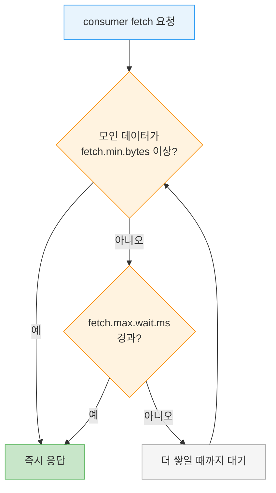
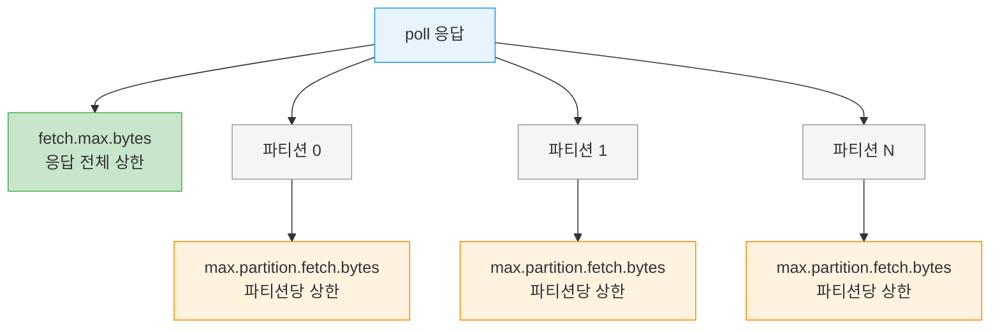

# Consumer 설정 심화

> [01-03.Consumer Group](01-03.Consumer%20Group.md)이 3개의 필수 설정과 group.id를 다뤘다면, 이 글은 성능과 가용성에 영향을 주는 나머지 설정을 모읍니다. 대부분 합리적인 기본값을 가져 손댈 필요가 없지만, fetch 동작·타임아웃·멀티 DC fetch·오프셋 보존 같은 설정은 잘못 두면 지연이 늘거나 운영 사고로 이어집니다. 어떤 설정이 무엇을 조절하고 언제 기본값에서 벗어나야 하는지가 이 장의 주제입니다.

## 학습 목표

> fetch 계열 설정이 처리량과 지연을 어떻게 맞바꾸는지, 그리고 타임아웃·멀티 DC·오프셋 보존 설정이 가용성에 주는 영향을 설명할 수 있는 것이 이 장의 목표입니다.

이 장을 다 읽고 다음 다섯 가지에 자신 있게 답할 수 있으면 학습이 완료됩니다.

1. fetch.min.bytes와 fetch.max.wait.ms가 함께 동작하는 방식을 설명할 수 있습니다.
2. fetch.max.bytes와 max.partition.fetch.bytes 중 무엇을 권장하는지와 그 이유를 말할 수 있습니다.
3. max.poll.records가 제어하는 것이 무엇인지 설명할 수 있습니다.
4. request.timeout.ms를 낮추지 말라는 권고의 이유를 말할 수 있습니다.
5. offsets.retention.minutes가 빈 그룹에 주는 영향을 설명할 수 있습니다.

## 1. fetch 크기와 대기 — 처리량과 지연의 맞바꿈

> fetch.min.bytes는 broker가 응답하기 전 모을 최소 데이터량을, fetch.max.wait.ms는 그 대기 상한을 정합니다. 둘을 올리면 처리량이 좋아지지만 지연이 늘어납니다.

`fetch.min.bytes`는 consumer가 fetch할 때 broker에서 받을 최소 데이터량을 정합니다(기본 1바이트). broker가 fetch 요청을 받았는데 새 레코드가 이 값보다 적으면, 더 쌓일 때까지 기다렸다 응답합니다. 토픽 활동이 적을 때 consumer와 broker 양쪽의 부하를 줄이는 효과가 있습니다. 데이터가 적은데 consumer가 CPU를 너무 쓰거나, consumer가 많아 broker 부하를 낮추고 싶을 때 기본값보다 올립니다. 다만 저처리량 상황에서는 이 값을 올리면 지연이 늘어납니다.

`fetch.max.wait.ms`는 그 대기의 상한입니다(기본 500ms). fetch.min.bytes를 채우려고 무한정 기다리지 않도록, 최대 얼마나 기다릴지를 정합니다. SLA로 최대 지연이 묶여 있으면 이 값을 낮춥니다. 예를 들어 fetch.max.wait.ms를 100ms, fetch.min.bytes를 1MB로 두면, broker는 1MB가 모이거나 100ms가 지나거나 둘 중 먼저 일어나는 시점에 응답합니다.

> 💬 **비유**: fetch.min.bytes와 fetch.max.wait.ms는 배차 정책과 같습니다. 버스를 일정 인원이 차야 출발(min.bytes)시키되, 너무 오래 기다리지 않게 정해진 시각이 되면 인원이 안 차도 출발(max.wait.ms)시킵니다. 이 비유는 "충분히 모으거나 시간이 되면 보낸다"까지 유효하지만, 버스는 한 대씩 떠나는 반면 fetch 응답은 여러 파티션 데이터를 한 번에 싣는다는 점에서 단순화된 것입니다.

## 2. fetch 메모리 한도 — fetch.max.bytes를 권장

> fetch.max.bytes는 poll 한 번에 broker가 반환할 최대 바이트를, max.partition.fetch.bytes는 파티션당 최대 바이트를 정합니다. 메모리 제어에는 fetch.max.bytes가 권장됩니다.

`fetch.max.bytes`는 consumer가 broker를 poll할 때 broker가 반환할 최대 바이트를 정합니다(기본 50MB). 파티션이나 메시지 수와 무관하게 consumer가 서버 응답을 담을 메모리 크기를 제한합니다. 한 가지 예외가 있습니다. 레코드는 batch 단위로 전송되는데, broker가 보낼 첫 record-batch가 이 한도를 넘으면 그 batch는 그대로 보내고 한도를 무시합니다. consumer가 멈추지 않고 진행하도록 보장하기 위해서입니다. broker 쪽에도 최대 fetch 크기를 제한하는 매칭 설정이 있어, 관리자가 디스크에서 큰 읽기와 긴 네트워크 전송으로 broker 부하가 커지는 것을 막을 수 있습니다.

`max.partition.fetch.bytes`는 server가 파티션당 반환할 최대 바이트를 정합니다(기본 1MB). `poll()`이 반환하는 레코드는 consumer에 할당된 파티션당 최대 이 값만큼을 씁니다. 그런데 이 설정으로 메모리를 제어하기는 꽤 복잡합니다. broker 응답에 몇 개의 파티션이 포함될지를 통제할 수 없기 때문입니다. 그래서 파티션마다 비슷한 양을 처리해야 할 특별한 이유가 없다면 **fetch.max.bytes를 쓰기를 강하게 권장합니다**.

| 설정 | 제한 단위 | 기본값 | 권장 |
|------|-----------|--------|------|
| `fetch.max.bytes` | poll 응답 전체 | 50MB | 메모리 제어에 권장 |
| `max.partition.fetch.bytes` | 파티션당 | 1MB | 파티션 균등 처리 필요 시만 |

두 설정이 메모리를 제어하는 범위가 어떻게 다른지 그림으로 보면 다음과 같습니다.

파티션 수를 통제할 수 없으니 파티션당 상한을 곱한 총량을 예측하기 어렵습니다. 응답 전체를 한 번에 제한하는 fetch.max.bytes가 메모리 통제에 단순한 이유입니다.

## 3. 처리 단위와 타임아웃

> max.poll.records는 한 poll이 반환할 레코드 수를, default.api.timeout.ms와 request.timeout.ms는 API 호출과 broker 응답 대기를 정합니다. request.timeout.ms는 낮추지 않습니다.

`max.poll.records`는 단일 `poll()` 호출이 반환할 최대 레코드 *수*를 제어합니다. 데이터의 크기가 아니라 개수를 정하는 값으로, 한 poll 루프 반복에서 애플리케이션이 처리할 양을 통제합니다. 레코드당 처리가 무거우면 이 값을 줄여 한 루프 시간을 짧게 유지하고, 그래서 `max.poll.interval.ms`를 넘기지 않게 합니다(상세는 [01-06.Consumer poll 루프와 종료](01-06.Consumer%20poll%20루프와%20종료.md)).

`default.api.timeout.ms`는 API 호출 시 명시적 timeout을 주지 않았을 때 적용되는 (거의) 모든 호출의 timeout입니다(기본 1분). request timeout 기본값보다 높아서 필요 시 재시도를 포함합니다. 이 기본값을 쓰지 않는 예외가 `poll()`인데, poll()은 항상 명시적 timeout을 요구합니다.

`request.timeout.ms`는 consumer가 broker 응답을 기다리는 최대 시간입니다(기본 30초). 이 시간 내에 broker가 응답하지 않으면 client는 broker가 아예 응답하지 않을 것으로 간주해 연결을 닫고 재연결을 시도합니다. **이 값은 낮추지 않기를 권장합니다.** broker가 요청을 처리할 충분한 시간을 줘야 하기 때문입니다. 이미 과부하된 broker에 요청을 다시 보내 봐야 얻을 게 거의 없고, 끊고 다시 연결하는 행위 자체가 오버헤드를 더 늘립니다.

## 4. 멀티 DC와 TCP 버퍼

> client.rack은 같은 zone의 replica에서 fetch해 멀티 DC 비용·지연을 줄입니다. TCP 버퍼는 다른 DC 통신 시 키웁니다.

기본적으로 consumer는 각 파티션의 leader replica에서 메시지를 가져옵니다. 그러나 클러스터가 여러 데이터센터나 클라우드 가용 영역(AZ)에 걸쳐 있으면, consumer와 같은 zone에 있는 replica에서 가져오는 것이 성능과 비용 양면에서 유리합니다. 가장 가까운 replica에서 fetch하려면 `client.rack`을 설정해 client가 위치한 zone을 알리고, broker가 기본 `replica.selector.class`를 `org.apache.kafka.common.replica.RackAwareReplicaSelector`로 바꾸도록 구성합니다. client·partition 메타데이터를 근거로 최적 replica를 고르는 custom selector를 직접 구현할 수도 있습니다.

`receive.buffer.bytes`와 `send.buffer.bytes`는 데이터를 읽고 쓸 때 소켓이 쓰는 TCP 수신·송신 버퍼 크기입니다. -1로 두면 OS 기본값을 씁니다. producer나 consumer가 다른 데이터센터의 broker와 통신할 때는 이 값을 키우는 것이 좋습니다. 그런 네트워크 링크는 보통 지연이 높고 대역폭이 낮기 때문입니다.

## 5. 오프셋 보존 — 빈 그룹의 함정

> offsets.retention.minutes는 빈 그룹의 committed offset을 얼마나 보존할지 정합니다(기본 7일). 이 기간이 지나면 그룹은 기억을 잃고 신규 그룹처럼 동작합니다.

`offsets.retention.minutes`는 broker 설정이지만 consumer 동작에 영향을 주므로 알아둬야 합니다. consumer 그룹에 active 멤버가 있는 한, 즉 heartbeat를 보내며 멤버십을 유지하는 한, 그룹이 파티션별로 마지막 커밋한 offset은 Kafka가 보존합니다. 재배정이나 재시작 시 다시 가져올 수 있습니다.

문제는 그룹이 비었을 때입니다. 그룹이 empty가 되면 Kafka는 committed offset을 이 설정이 정한 기간만큼만 보존합니다(기본 7일). 그 뒤 offset이 삭제되면, 그룹이 다시 active 되어도 과거에 무엇을 소비했는지 전혀 기억하지 못하는 새 그룹처럼 동작합니다. 이때 어디서부터 읽을지는 `auto.offset.reset` 정책이 정합니다(상세는 [01-03.Consumer Group §6](01-03.Consumer%20Group.md)). 이 동작은 버전에 따라 여러 번 바뀌었으므로, 2.1.0 미만이면 해당 버전 문서를 확인해야 합니다.

## 6. 실무 적용

> 설정 조정은 "지연을 줄일까 처리량을 키울까"와 "운영 사고를 막을까"로 나뉩니다. (이 절은 원문 §4.7을 운영 판단으로 재구성한 보조 설명입니다.)

설정 조정은 크게 두 갈래입니다. 하나는 처리량과 지연의 맞바꿈입니다. fetch.min.bytes를 올리면 저활동 시 부하가 줄지만 지연이 늘고, fetch.max.wait.ms를 낮추면 SLA를 지키지만 작은 응답이 잦아집니다. 다른 하나는 운영 사고 예방입니다. request.timeout.ms를 함부로 낮추면 과부하 broker에 재연결 폭주를 부르고, offsets.retention.minutes를 모르면 잠시 멈춘 그룹이 기억을 잃어 재시작 시 예상 밖의 위치에서 소비합니다.

자주 마주치는 결정을 정리하면 다음과 같습니다.

| 상황 | 조정 | 이유 |
|------|------|------|
| 저활동 토픽 CPU 과다 | fetch.min.bytes ↑ | 적은 데이터를 모아서 받아 왕복 감소 |
| 최대 지연 SLA | fetch.max.wait.ms ↓ | 대기 상한을 짧게 |
| 레코드당 처리 무거움 | max.poll.records ↓ | 한 루프 시간 통제로 evict 방지 |
| 멀티 AZ 비용 | client.rack 설정 | 같은 zone replica fetch |

> ⚠️ **주의**: 잠시 멈출 그룹(배포 교체, 점검)이 7일 넘게 비면 committed offset이 삭제되어, 재가동 시 auto.offset.reset 정책대로 처음 또는 최신부터 읽습니다. 장기 중단이 예정되면 offsets.retention.minutes를 늘리거나, 재가동 시 시작 위치를 명시적으로 지정합니다.

## 7. 면접 대비 Q&A

> 답을 보지 않고 먼저 입으로 답해 본 뒤 비교해 보면 좋습니다.

### Q1. fetch.min.bytes와 fetch.max.wait.ms는 어떻게 함께 동작하나요?

fetch.min.bytes는 broker가 응답하기 전 모을 최소 데이터량이고, fetch.max.wait.ms는 그 대기의 상한입니다. broker는 데이터가 min.bytes만큼 모이거나 max.wait.ms가 지나거나 둘 중 먼저인 시점에 응답합니다. min.bytes를 올리면 저활동 시 부하가 줄지만, 그만큼 지연이 늘어납니다.

### Q2. fetch.max.bytes와 max.partition.fetch.bytes 중 무엇을 권장하나요?

fetch.max.bytes입니다. max.partition.fetch.bytes는 파티션당 한도라, broker 응답에 몇 개 파티션이 포함될지 통제할 수 없어 메모리 제어가 복잡합니다. fetch.max.bytes는 poll 응답 전체를 제한하므로 메모리 통제가 단순합니다. 파티션마다 비슷한 양을 처리할 특별한 이유가 없으면 fetch.max.bytes를 씁니다.

### Q3. max.poll.records가 제어하는 것은 무엇인가요?

단일 poll()이 반환할 레코드의 *수*입니다. 데이터 크기가 아니라 개수를 정해, 한 poll 루프 반복에서 처리할 양을 통제합니다. 레코드당 처리가 무거우면 이 값을 줄여 한 루프 시간을 짧게 유지하고, max.poll.interval.ms를 넘겨 evict되는 일을 막습니다.

### Q4. request.timeout.ms를 낮추지 말라는 이유는?

broker에 요청을 처리할 충분한 시간을 줘야 하기 때문입니다. 기본 30초보다 낮추면, 이미 과부하된 broker에 응답을 포기하고 재연결을 시도하게 되는데, 끊고 다시 연결하는 것 자체가 오버헤드를 더합니다. 과부하 상황에서 요청을 다시 보내 봐야 얻을 게 거의 없습니다.

### Q5. offsets.retention.minutes가 빈 그룹에 주는 영향은?

active 멤버가 있는 동안은 committed offset이 계속 보존되지만, 그룹이 empty가 되면 이 기간(기본 7일)만큼만 보존됩니다. 그 뒤 offset이 삭제되면 그룹이 다시 살아나도 과거 소비 기록이 없는 새 그룹처럼 동작해, auto.offset.reset 정책대로 처음 또는 최신부터 읽습니다.

## 8. 관련 문서

- [01-03.Consumer Group](01-03.Consumer%20Group.md) — 3개 필수 설정과 auto.offset.reset
- [01-04.리밸런스 프로토콜](01-04.리밸런스%20프로토콜.md) — session.timeout·heartbeat·max.poll.interval
- [01-06.Consumer poll 루프와 종료](01-06.Consumer%20poll%20루프와%20종료.md) — max.poll.records로 루프 시간 통제
