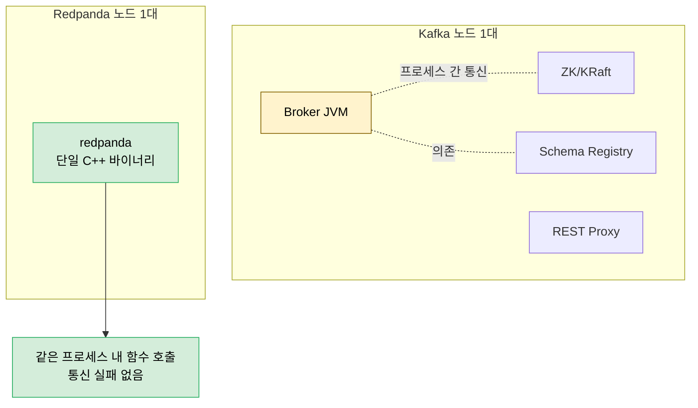
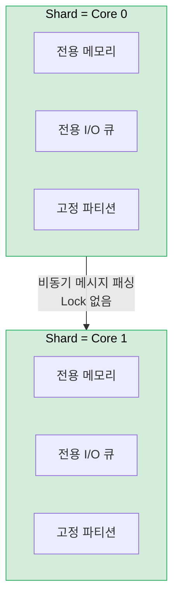

# Redpanda 아키텍처

---

> Redpanda는 Kafka API 호환이라는 외부 계약을 그대로 유지하면서, 내부 구현을 *단일 바이너리·Thread-per-Core·Raft*로 다시 짠 메시지 브로커다. 공통 메시지 큐 추상은 [01-01.메시지 큐 아키텍처](01-01.메시지%20큐%20아키텍처.md)와 [01-02.리더 선출](01-02.리더%20선출.md)에서 다뤘고, 이 글은 그 위에서 Redpanda 특유의 선택을 살핀다.


## 학습 목표

> Redpanda의 *단일 바이너리·Shard-Nothing·Raft 기반 복제*가 어떤 운영 이점을 만드는지로 이해한다.

이 장을 다 읽고 다음 다섯 가지에 자신 있게 답할 수 있으면 학습이 완료된다.

1. Kafka 다중 프로세스 모델과 Redpanda 단일 바이너리의 운영 복잡도 차이를 설명할 수 있다.
2. Thread-per-Core·Shard-Nothing 모델이 Lock Contention과 Cache Line Bouncing을 어떻게 제거하는지 설명할 수 있다.
3. Seastar의 Future/Promise·Cooperative Scheduling이 만들어 내는 비용 절감을 말할 수 있다.
4. Redpanda의 Raft 기반 복제가 Kafka ISR과 외부 계약을 어떻게 호환시키는지 설명할 수 있다.
5. Tiered Storage·Advertised Listeners 같은 운영 친화 기능의 의도를 설명할 수 있다.


## 1. 단일 바이너리

> Kafka는 Broker·ZK·SR·Proxy를 별도 프로세스로 운영하지만, Redpanda는 모든 기능을 하나의 C++ 바이너리에 통합한다. 운영 복잡도가 "노드 수 × 프로세스 종류"의 곱셈에서 "노드 수"의 덧셈으로 바뀐다.

**바이너리(Binary)**란 소스 코드를 컴파일하여 만들어진 **하나의 실행 파일**이다.

- Redpanda의 경우 C++로 작성된 소스 코드가 컴파일되어 `/usr/bin/redpanda`라는 단일 실행 파일이 된다.
- 이 파일 하나 안에 메시지 브로커, Schema Registry, HTTP Proxy, Admin API 기능이 모두 포함되어 있다.
- "단일"이 강조하는 포인트는 **노드 수가 아니라, 노드 하나에서 실행해야 하는 프로세스 수**다.

Redpanda 클러스터는 **동일한 단일 바이너리(redpanda)**를 실행하는 여러 노드로 구성된다.

- Kafka 생태계에서 Zookeeper, KRaft Controller, Schema Registry, REST Proxy 등이 별도의 프로세스로 분리되어 있는 것과 달리, Redpanda는 이 모든 기능을 하나의 바이너리 안에 통합했다.
- 분산 시스템에서 프로세스 수가 늘어날수록 장애 포인트가 증가하고, 배포와 모니터링이 기하급수적으로 어려워진다. 단일 바이너리는 이 문제를 근본적으로 제거한다.

### 1.1 Kafka: 다중 프로세스 모델

Kafka 생태계에서 하나의 노드를 완전하게 운영하려면, 여러 개의 독립적인 프로세스를 각각 설치하고 실행해야 한다.

- 각 프로세스는 별도의 JAR 파일(JVM 바이너리)이고, 별도의 설정 파일을 가지며, 별도의 포트를 열고, 별도의 모니터링이 필요하다.
- 하나가 죽으면 나머지가 멀쩡해도 전체 기능에 영향을 준다.
- 예) Schema Registry가 죽으면 Broker는 살아있어도 스키마 검증이 불가능해진다. 이런 프로세스들 사이의 의존성을 관리하는 것 자체가 운영 부담이다.

### 1.2 Redpanda: 단일 프로세스 모델

Redpanda는 이 모든 기능을 하나의 C++ 바이너리에 컴파일하여 통합했다.

- 설치는 `apt install redpanda` 또는 `rpk` 명령 하나로 끝나고, 설정 파일도 `redpanda.yaml` 하나, 실행도 `systemctl start redpanda` 하나, 모니터링도 프로세스 하나만 보면 된다.
- 프로세스 간 네트워크 통신도 필요 없고(같은 프로세스 안이므로 함수 호출로 처리), 버전 호환성 문제도 없다(한 바이너리 안에 모든 기능이 같은 버전으로 포함되므로).

### 1.3 클러스터 전체에서 보면

"단일 바이너리"라 해서 클러스터에 파일이 하나만 존재한다는 뜻이 아니다. **각 노드(서버)마다 동일한 바이너리를 개별 설치**하고, 각 노드에서 독립적인 프로세스로 실행한다.

- 3노드 클러스터라면 3대의 서버에 각각 같은 `redpanda` 바이너리가 설치되고, 3개의 독립적인 프로세스가 실행된다.
- 이 프로세스들이 Internal RPC(:33145)를 통해 서로 통신하면서 하나의 클러스터를 형성한다.

차이를 정리하면 다음과 같다.

| 관점                       | Kafka (3노드 클러스터)                | Redpanda (3노드 클러스터)          |
| -------------------------- | ------------------------------------- | ---------------------------------- |
| **노드당 프로세스**        | 4~5개 (Broker, ZK/KRaft, SR, Proxy)   | 1개 (redpanda)                     |
| **클러스터 전체 프로세스** | 12~15개                               | 3개                                |
| **설치**                   | 컴포넌트마다 별도 설치                | `apt install redpanda` 하나        |
| **설정 파일**              | 프로세스당 1개 × 4~5 = 노드당 4~5개   | 노드당 1개 (redpanda.yaml)         |
| **업그레이드**             | 컴포넌트별 순서와 호환성 확인 필요    | 바이너리 하나만 교체               |
| **장애 포인트**            | 프로세스 간 통신 실패 가능            | 프로세스 내부이므로 통신 실패 없음 |
| **모니터링**               | 프로세스 × 노드 수 = 12~15개 대시보드 | 노드 수 = 3개 대시보드             |

이 설계의 실질적 효과는 **운영 복잡도의 곱셈이 덧셈으로 바뀌는 것**이다. Kafka에서 "노드 수 × 프로세스 종류 수"만큼 관리 대상이 늘어나는 반면, Redpanda에서는 "노드 수"만큼만 관리하면 된다. 노드가 10대, 50대, 100대로 늘어날수록 이 차이는 기하급수적으로 벌어진다.

각 노드는 시작 시 seed 노드 목록을 통해 클러스터에 참여한다. 클러스터 내에서 모든 노드는 동등한 역할을 수행할 수 있으며, 특정 노드가 "메타데이터 전용"이거나 "데이터 전용"인 구분은 없다. 토픽을 생성하면 파티션이 노드에 분산되고, 각 파티션은 독립적인 Raft 그룹을 형성하여 복제를 관리한다.

클러스터 메타데이터(토픽 설정, 파티션 할당, ACL, Consumer Group 오프셋)는 **Controller Raft Group**이라는 특수 Raft 그룹이 관리한다. 이 그룹의 리더가 곧 클러스터의 Controller이며, Kafka의 KRaft Controller와 유사한 역할을 한다. 다만 Redpanda에서는 별도의 프로세스가 아니라 일반 노드 중 하나가 이 역할을 겸한다.




## 2. Thread-per-Core 모델

> JVM의 공유 메모리 모델은 Lock Contention·Cache Line Bouncing·Context Switching으로 코어를 늘려도 처리량이 수렴한다. Redpanda는 각 코어를 독립 Shard로 두는 Shard-Nothing 아키텍처로 이를 근본적으로 피한다.

### 2.1 기존 모델의 문제 (Kafka/JVM)

> 전통적인 서버 애플리케이션은 **공유 메모리(Shared Memory) 모델**을 사용한다. 여러 Thread가 같은 메모리 공간에 접근하고, 데이터 정합성을 위해 Lock(Mutex, Semaphore 등)을 사용한다.

Kafka도 JVM 위에서 이 모델로 동작한다. 이 방식은 프로그래밍이 직관적이지만, 고성능 시나리오에서 심각한 병목을 만든다.

- **Lock Contention(락 경합)**: Thread 1이 Lock을 잡고 있으면 Thread 2는 대기해야 한다. CPU 코어가 4개라도 Lock 하나에 4개 Thread가 경합하면 실질적으로 단일 Thread와 다를 바 없는 처리량이 된다. 이를 **Amdahl's Law**라고 한다. 프로그램에서 직렬화되는 부분의 비율이 높을수록, 코어를 아무리 추가해도 성능 향상이 수렴한다.
- **Cache Line Bouncing**: Lock보다 더 미묘한 성능 저하 요인이다. 현대 CPU에서 메모리 접근은 Cache Line(보통 64바이트) 단위로 이루어진다. Thread 1이 Core 0에서 데이터를 수정하면 해당 Cache Line은 Core 0의 L1 캐시에 "Modified" 상태로 저장된다. Thread 2가 Core 1에서 같은 데이터를 읽으려 하면 MESI 프로토콜에 의해 Core 0의 캐시를 무효화하고 데이터를 가져와야 한다. 같은 소켓 내에서는 약 20-40ns, **NUMA 시스템에서 다른 소켓을 넘어가면 100ns 이상** 소요된다.
- **False Sharing**: Cache Line Bouncing의 특수한 형태다. 두 Thread가 서로 다른 변수를 수정하더라도, 이 변수들이 같은 64바이트 Cache Line 안에 있으면 불필요한 캐시 무효화가 발생한다.
- **Context Switching 오버헤드**: JVM Thread Pool 모델의 문제다. JVM은 수십~수백 개의 Thread를 생성하고, OS 스케줄러가 이들을 CPU 코어에 번갈아 배치한다. Thread가 전환될 때마다 레지스터 저장/복원, TLB 플러시, 캐시 미스 등이 발생한다.

### 2.2 Redpanda의 Shard-Nothing 아키텍처

> Redpanda는 이 문제들을 근본적으로 해결하기 위해 **Shard-Nothing** 아키텍처를 채택했다. 핵심 원칙은 단순하다. **각 CPU 코어를 독립적인 "Shard"로 취급하고, Shard 간에 어떤 상태도 공유하지 않는 것**이다.

각 Shard는 자체적으로 다음을 소유한다.

- **전용 메모리 영역**: 시작 시 전체 가용 메모리를 코어 수로 나누어 할당. `malloc()`/`free()` 경합이 없다.
- **전용 I/O 큐**: 디스크 읽기/쓰기 요청을 독립적으로 관리한다.
- **전용 네트워크 연결**: 각 코어가 자체 소켓을 관리한다.
- **전용 파티션**: 특정 파티션은 특정 코어에 고정(CPU Affinity)된다.

Shard 간 통신이 필요할 때는 Lock 대신 **비동기 메시지 패싱**을 사용한다. Core 0이 Core 1에 데이터를 전달해야 하면, Core 0은 Core 1의 수신 큐에 메시지를 넣고 즉시 다른 작업을 계속한다. Core 1은 자신의 이벤트 루프에서 이 큐를 확인하고 처리한다. Lock이 없으므로 대기도 없고, Cache Line Bouncing도 최소화된다.

파티션이 특정 코어에 고정되면 **L1/L2 캐시 적중률**이 극대화된다. 파티션의 메타데이터, 인덱스, 최근 메시지가 항상 같은 코어의 캐시에 존재하므로, 메인 메모리까지 갈 필요 없이 수 ns 내에 데이터에 접근할 수 있다. 모든 I/O는 비동기로 처리되어 코어가 절대 블로킹되지 않는다.



### 2.3 Seastar 프레임워크

Redpanda의 Shard-Nothing 아키텍처는 **Seastar** 프레임워크 위에 구축되었다. Seastar는 ScyllaDB(Cassandra의 C++ 재구현)에서 먼저 검증된 고성능 C++ 프레임워크로, Thread-per-Core 모델을 프로그래밍 가능하게 만들어 준다.

**Future/Promise 프로그래밍 모델**은 Seastar의 핵심이다. 전통적인 동기 코드에서 `read(fd, buf, size)` 호출은 디스크 I/O가 완료될 때까지 Thread를 블로킹한다. Seastar에서는 이를 Future로 감싸서 비동기로 처리한다.

```cpp
// 전통적 방식: Thread 블로킹
data = read(fd, buf, 4096);
process(data);
send(client, result);

// Seastar 방식: 비동기 체이닝
read_dma(fd, buf, 4096)
    .then([](auto data) { return process(data); })
    .then([client](auto result) { return send(client, result); });
```

`read_dma()`는 즉시 Future 객체를 반환한다. 실제 디스크 I/O는 백그라운드에서 진행되고, I/O가 완료되면 `.then()`에 등록된 콜백이 **같은 코어**에서 실행된다. 하나의 코어에서 수천 개의 Future가 동시에 진행 중이더라도, Thread는 하나뿐이므로 Lock이 필요 없다.

**Cooperative Scheduling**은 Seastar의 또 다른 핵심이다. OS의 Preemptive Scheduling은 Thread를 강제로 중단하고 다른 Thread로 전환한다. 이때 Context Switching 비용이 발생한다. Seastar에서는 각 Task가 **자발적으로 제어권을 양보**한다. I/O를 요청하면 자연스럽게 yield되고, `.then()` 체인의 다음 단계로 다른 Task가 실행된다. 강제 전환이 없으므로 Context Switching 비용이 제로다.

이 방식의 단점은 하나의 Task가 yield하지 않으면(예: 오래 걸리는 CPU 연산) 다른 모든 Task가 대기한다는 점이다. 따라서 Seastar 기반 코드는 오래 걸리는 연산을 작은 단위로 분할하고, 중간에 명시적으로 yield해야 한다. Redpanda는 이런 패턴을 내부적으로 철저히 준수한다.

**메모리 관리** 역시 코어별로 독립적이다. Seastar는 시작 시 전체 가용 메모리를 코어 수로 균등 분할하여 각 코어에 할당한다. 각 코어는 자신의 메모리 풀에서만 할당/해제하므로, `malloc()`/`free()`에서의 글로벌 Lock 경합이 없다. JVM의 Garbage Collector가 "Stop-the-World" 이벤트로 모든 Thread를 멈추는 것과 대조적으로, Seastar에서는 GC 자체가 존재하지 않는다. C++의 RAII와 스마트 포인터로 메모리를 관리하므로, 예측 가능한 지연시간을 보장한다.

**I/O 백엔드**로는 최신 Linux 커널(5.1+)에서 **io_uring**을 지원한다. io_uring은 커널-유저 공간 간 공유 링 버퍼를 사용하여 System Call 오버헤드를 극적으로 줄인다. 하나의 System Call로 수십 개의 I/O 요청을 제출하고, 별도의 System Call 없이 완료 결과를 확인할 수 있다. io_uring은 특히 NVMe SSD와 결합할 때 AIO 대비 20-30% 높은 IOPS를 달성한다.

### 2.4 Thread-per-Core의 실질적 효과

이 모든 요소가 합쳐져서 Redpanda는 하드웨어의 물리적 한계에 근접하는 성능을 달성한다. 동일한 하드웨어에서 Kafka 대비 Redpanda가 최대 10배 낮은 P99 지연시간을 기록하는 것은, 알고리즘의 차이가 아니라 **시스템 프로그래밍 모델의 근본적 차이** 때문이다. Lock이 없으면 경합이 없고, 경합이 없으면 코어 수에 비례하여 성능이 선형적으로 증가한다.

| 항목            | Kafka (JVM Thread Pool)           | Redpanda (Thread-per-Core)       |
| --------------- | --------------------------------- | -------------------------------- |
| **Thread 모델** | 수십~수백 Thread, OS 스케줄링     | 코어당 1 Thread, 협력적 스케줄링 |
| **메모리 접근** | 공유 메모리 + Lock                | 코어별 독립 메모리               |
| **I/O 방식**    | Buffered I/O + Page Cache         | O_DIRECT + io_uring              |
| **GC**          | JVM GC (Stop-the-World)           | 없음 (C++ RAII)                  |
| **캐시 효율**   | Thread 마이그레이션으로 캐시 미스 | CPU Affinity로 캐시 적중 극대화  |
| **확장성**      | 코어 추가 시 Lock 경합 증가       | 코어 추가 시 선형 성능 향상      |


## 3. 스토리지 아키텍처

> Redpanda의 스토리지는 Kafka와 같은 Append-Only 분산 커밋 로그를 따르되, Tiered Storage로 오래된 세그먼트를 오브젝트 스토리지로 내려 보관 비용을 낮춘다.

Redpanda의 스토리지는 **분산 커밋 로그** 구조다. 모든 메시지는 시간 순서대로 Append-Only 로그에 기록되며, 이 로그 자체가 곧 데이터다.

### 3.1 디렉토리 구조

```
/var/lib/redpanda/data/kafka/
├── orders/                    # 토픽명
│   ├── 0/                     # 파티션 번호
│   │   ├── 0-1-v1.log        # 세그먼트 파일 (base_offset=0, term=1)
│   │   ├── 0-1-v1.base_index # 오프셋 인덱스
│   │   ├── 0-1-v1.timeindex  # 타임스탬프 인덱스
│   │   └── snapshot           # Producer 상태
│   ├── 1/                     # 파티션 1
│   └── 2/                     # 파티션 2
└── another-topic/
```

핵심 특징:

- **O_DIRECT I/O**: OS Page Cache를 우회하고 자체 메모리 관리. GC Pause가 없어 예측 가능한 지연시간 달성. **XFS 파일시스템 필수**.
- **Segment 기반 관리**: 파티션은 여러 Segment 파일로 분할. Active Segment에만 쓰기, Closed Segment만 삭제/Compaction 가능.
- **Sparse Index**: 모든 오프셋이 아닌 일정 간격만 인덱싱하여 메모리 절약.
- **Raft 로그 통합**: 복제 메타데이터와 데이터가 같은 로그에 통합되어 Strong Consistency 보장.

### 3.2 Tiered Storage

Tiered Storage는 오래된 세그먼트를 S3, GCS 등 Object Storage로 자동 이동시키는 기능이다. 로컬 NVMe SSD에는 최근 데이터(Hot Data)만 유지하고, 과거 데이터(Cold Data)는 저비용 스토리지에 보관한다. Consumer가 과거 데이터를 요청하면 Object Storage에서 투명하게 가져온다.

이를 통해 로컬 디스크 용량의 제약 없이 사실상 무제한의 데이터를 보관할 수 있으며, 비용은 Object Storage 요금만큼만 발생한다.


## 4. 네트워크 아키텍처

> 단일 바이너리가 클라이언트 유형별로 독립 포트(Kafka API·Admin·Schema Registry·Internal RPC)를 연다. Advertised Listeners 설정이 외부에 광고할 주소를 정하므로, Docker·K8s 환경에서 이 값을 맞추는 것이 접속 성패를 가른다.

Redpanda는 단일 바이너리에서 여러 API 엔드포인트를 제공한다. 각 엔드포인트는 서로 다른 클라이언트 유형을 대상으로 하며, 독립적인 포트에서 동작한다.

### 4.1 포트 구성

| 포트      | API                     | 프로토콜              | 용도                                       |
| --------- | ----------------------- | --------------------- | ------------------------------------------ |
| **9092**  | Kafka API               | Kafka Binary Protocol | Producer/Consumer 메시지 송수신            |
| **8081**  | Schema Registry         | HTTP/REST             | Avro, Protobuf, JSON Schema 관리           |
| **8082**  | HTTP Proxy (Pandaproxy) | HTTP/REST             | Kafka 클라이언트 없이 HTTP로 메시지 송수신 |
| **9644**  | Admin API               | HTTP/REST             | 클러스터 관리, 설정 변경, 모니터링         |
| **33145** | Internal RPC            | 내부 프로토콜         | Raft 복제, 리더 선출, 노드 간 통신         |

### 4.2 Advertised Listeners

**Advertised Listeners**는 Redpanda가 "클라이언트에게 자신의 주소를 어떻게 알려줄 것인가"를 결정하는 설정이다. 단순한 배포 환경에서는 직관적이지만, **Kubernetes나 Docker 환경에서는 필수적**인 개념이다.

Kafka Protocol에서 클라이언트가 처음 연결하면, 브로커는 **메타데이터 응답에 각 파티션 리더의 주소를 포함**한다. 클라이언트는 이 주소로 실제 데이터를 주고받는다. 문제는 Docker 컨테이너 안에서 Redpanda가 보는 자신의 주소(예: `172.17.0.2:9092`)와 외부 클라이언트가 접근 가능한 주소(예: `my-host:19092`)가 다르다는 것이다.

```yaml
# redpanda.yaml 설정 예시
redpanda:
  advertised_kafka_api:
    - address: 0.0.0.0       # 내부 클라이언트용
      port: 9092
      name: internal
    - address: my-host.com   # 외부 클라이언트용
      port: 19092
      name: external
```

### 4.3 Docker CLI 플래그와 Advertise 설정

`redpanda start` CLI에서 listen 주소와 advertise 주소를 설정할 수 있지만, **모든 API에 대해 advertise CLI 플래그가 존재하는 것은 아니다.** v25.3.6 기준 지원 현황은 다음과 같다.

| API             | Listen 플래그            | Advertise 플래그                   | CLI 지원 |
| --------------- | ------------------------ | ---------------------------------- | -------- |
| Kafka API       | `--kafka-addr`           | `--advertise-kafka-addr`           | O        |
| Internal RPC    | `--rpc-addr`             | `--advertise-rpc-addr`             | O        |
| Pandaproxy      | `--pandaproxy-addr`      | `--advertise-pandaproxy-addr`      | O        |
| Schema Registry | `--schema-registry-addr` | `--advertise-schema-registry-addr` | **X**    |

Schema Registry의 advertise 주소는 CLI 플래그가 없으며, 필요한 경우 `redpanda.yaml` 설정 파일의 `schema_registry.advertised_schema_registry` 항목으로 설정해야 한다.

### 4.4 Kubernetes 네트워크 패턴

Kubernetes 환경에서 Redpanda를 배포할 때는 내부/외부 접근을 위한 네트워크 설계가 중요하다.

**클러스터 내부 접근(Pod-to-Pod)**: 같은 Kubernetes 클러스터 내 애플리케이션은 Headless Service를 통해 각 Pod에 직접 접근한다. DNS 이름은 `redpanda-0.redpanda.namespace.svc.cluster.local:9092` 형태다.

**클러스터 외부 접근**: 두 가지 주요 패턴이 있다.

| 패턴             | 장점                            | 단점                                      | 적합한 환경 |
| ---------------- | ------------------------------- | ----------------------------------------- | ----------- |
| **NodePort**     | 설정 간단, 추가 비용 없음       | 포트 범위 제한(30000-32767), 노드 IP 노출 | 개발/테스트 |
| **LoadBalancer** | 안정적인 외부 IP, TLS 종단 가능 | 각 브로커마다 별도 LB 필요, 비용 증가     | 프로덕션    |

LoadBalancer 패턴에서 주의할 점은 **각 브로커가 별도의 LoadBalancer를 가져야 한다**는 것이다. Kafka Protocol은 클라이언트가 특정 브로커에 직접 연결해야 하므로(파티션 리더에 직접 쓰기), 단일 LoadBalancer 뒤에 모든 브로커를 두면 올바른 브로커로 라우팅되지 않는다.


## 5. Redpanda의 Raft와 ISR

> Kafka의 ISR이 리더가 동적으로 관리하는 목록이라면, Redpanda는 파티션마다 Raft Quorum 응답으로 커밋을 판정한다. ISR은 Kafka 호환용 표현으로만 남고, Unclean Election이 구조적으로 불가능하다.

### 5.1 Redpanda vs Kafka: ISR의 의미 차이

Kafka와 Redpanda 모두 ISR 개념을 사용하지만, 내부 구현은 완전히 다르다.

**Kafka의 ISR 모델**에서 리더는 ISR이라는 동적 목록을 직접 관리한다. 팔로워가 지연되면 리더가 ISR에서 제거하고, 따라잡으면 다시 추가한다. `acks=all` 설정 시 리더는 **현재 ISR에 포함된 모든 복제본**이 메시지를 확인할 때까지 기다린다.

**Redpanda의 Raft 모델**은 ISR을 별도로 관리하지 않는다. 대신 **Raft Consensus 프로토콜의 Quorum(과반수)** 을 사용한다. Raft에서는 "누가 동기화되어 있는지"를 추적하지 않고, 단순히 "몇 개 노드가 응답했는지"만 센다. RF=3이면 항상 2/3의 동의가 필요하며, 이는 동적으로 변하지 않는다.

Kafka API 호환성을 위해 Redpanda도 ISR 개념을 노출하지만, 실제로는 **Raft Quorum을 ISR로 표현**한 것이다. `acks=all`은 "모든 동기화된 복제본"이 아니라 "Raft Quorum(과반수)"을 의미한다. 사용자 입장에서는 동일하게 동작하지만, 내부 메커니즘이 다르므로 장애 시나리오에서 차이가 발생한다.

**Redpanda는 Raft 기반이므로 Unclean Leader Election 문제가 구조적으로 방지된다.** Raft에서는 **최신 로그를 가진 노드만 리더가 될 수 있다**. 투표 과정에서 후보자의 로그 인덱스를 비교하여, 자신보다 오래된 로그를 가진 후보자에게는 투표하지 않는다.

Redpanda는 **가용성보다 일관성을 우선**한다. 과반수 노드가 죽으면 쓰기가 중단되지만, 데이터 유실은 발생하지 않는다. 이는 금융, 의료 등 데이터 정확성이 중요한 분야에서 중요한 보장이다.

### 5.2 프로덕션 설정 예시

```bash
# 토픽 생성 시
rpk topic create orders \
  --replicas 3 \
  --topic-config min.insync.replicas=2 \
  --topic-config replication.factor=3

# Producer 설정 (Java)
props.put("acks", "all");
props.put("retries", 3);
props.put("max.in.flight.requests.per.connection", 1);  // 순서 보장
```

### 5.3 모니터링

ISR 상태를 모니터링하여 복제 지연을 조기에 발견할 수 있다.

```bash
# 토픽의 ISR 상태 확인
rpk topic describe orders --detailed

# 출력 예시:
# PARTITION  LEADER  REPLICAS  ISR        HIGH-WATERMARK
# 0          1       [1,2,3]   [1,2,3]    1000000
# 1          2       [2,3,1]   [2,3]      1500000  ← 주의: ISR 축소!
```

Partition 1에서 ISR이 [2,3]으로 축소된 것을 발견했다면, 노드 1이 지연되고 있다는 신호다.

**Prometheus 메트릭**:

```
redpanda_kafka_under_replicated_replicas > 0  # 경고: ISR 축소
redpanda_kafka_offline_replicas > 0           # 심각: 복제본 오프라인
```

### 5.4 정리: ISR vs Raft

| 항목                 | Kafka ISR                     | Redpanda Raft        |
| -------------------- | ----------------------------- | -------------------- |
| **동기화 판단**      | 리더가 동적으로 ISR 목록 관리 | Quorum 응답만 카운트 |
| **안전성 보장**      | ISR 크기 변화에 따라 동적     | 수학적 과반수로 정적 |
| **Unclean Election** | 설정에 따라 허용 가능         | 구조적으로 방지      |
| **일관성 vs 가용성** | 설정으로 조정                 | 일관성 우선          |
| **운영 복잡도**      | ISR 크기 모니터링 필수        | Quorum만 이해하면 됨 |


## 6. 하드웨어 권장 사항

> Thread-per-Core 모델은 코어 수가 곧 처리량이므로, 개발·테스트와 프로덕션의 CPU·메모리·디스크 권장 사양이 뚜렷이 갈린다.

| 리소스       | 개발/테스트          | 프로덕션                                       |
| ------------ | -------------------- | ---------------------------------------------- |
| **CPU**      | 2-4 코어             | 8-16+ 코어 (Thread-per-Core이므로 코어 = 성능) |
| **메모리**   | 4-8 GB               | 32-64+ GB (Seastar가 코어별 분배)              |
| **디스크**   | SSD (어떤 FS든 가능) | NVMe SSD + **XFS 필수** (O_DIRECT)             |
| **네트워크** | 1 Gbps               | 10+ Gbps (Raft 복제 트래픽 고려)               |

Thread-per-Core 모델에서는 **코어 수가 곧 성능**이다. 2GHz 16코어가 4GHz 4코어보다 훨씬 높은 처리량을 달성한다. 메모리는 Seastar가 코어별로 균등 분배하므로 코어 수에 비례하여 충분히 할당해야 한다.


## 7. 면접 대비 Q&A

> 면접에서 자주 나오는 형태로 5개. 답을 보지 않고 먼저 입으로 답해 본 뒤 비교한다.

### Q1. Redpanda의 단일 바이너리 모델이 만드는 가장 큰 운영 이점은?

운영 복잡도가 *곱셈에서 덧셈으로* 바뀐다. Kafka는 노드 수 × 프로세스 종류 수만큼 관리 대상이 늘어나(브로커·ZK/KRaft·Schema Registry·REST Proxy), 노드가 10대만 돼도 40~50개 프로세스를 모니터링해야 한다. Redpanda는 노드 수만큼만 관리한다. 또 프로세스 사이 네트워크 통신이 없어 *Schema Registry가 죽어 브로커 기능 일부가 막히는* 종류의 부분 장애가 구조적으로 사라진다. 버전 호환성 매트릭스도 한 바이너리 안이라 신경 쓸 일이 없다.

### Q2. Thread-per-Core가 Lock Contention보다 더 큰 문제로 보는 것은?

Cache Line Bouncing과 False Sharing이다. Lock은 코드로 가시화되지만, 캐시 라인 무효화는 *코드가 깨끗해 보여도* CPU가 보이지 않게 비용을 만든다. NUMA를 가로지르는 캐시 무효화는 100ns 이상 걸리고, 초당 수백만 건을 처리하는 브로커에서는 누적 효과가 치명적이다. Shard-Nothing은 코어별 메모리·I/O·소켓·파티션을 완전히 분리해 캐시 라인 자체가 코어를 넘어가지 않게 한다. 그래서 코어 수에 *선형으로* 성능이 늘어난다.

### Q3. Seastar의 Cooperative Scheduling이 갖는 장단점은?

장점은 Context Switch 비용이 제로라는 점이다. Task가 자발적으로 yield하므로 레지스터·TLB·캐시 미스 부담이 없고, 같은 코어 안에서 수천 Future가 진행돼도 단일 Thread 안에서만 흘러간다. 단점은 *yield하지 않는 Task가 코어를 독점*한다는 점이다. 오래 걸리는 CPU 연산을 작은 단위로 잘라 명시적으로 yield해야 한다. Redpanda는 이 규칙을 내부 코드에서 엄격히 지킨다.

### Q4. Redpanda가 Kafka ISR 개념을 노출하는 이유는?

Kafka API 호환성을 유지하기 위해서다. 클라이언트(Producer/Consumer/관리 도구)는 ISR 응답을 그대로 받아 자신의 정책을 적용한다. 다만 내부적으로 *동적 ISR 목록*은 없고, 매번 Raft Quorum 응답을 ISR 형태로 변환해 보여줄 뿐이다. `acks=all`도 "현재 ISR 모두"가 아니라 "Raft Quorum"을 의미한다. 결과적으로 운영자는 같은 명령(`rpk topic describe`)으로 ISR을 볼 수 있지만, 그 ISR이 동적으로 흔들리는 일은 없다.

### Q5. Tiered Storage가 데이터 보관 비용에 미치는 영향은?

로컬 NVMe에는 *Hot 세그먼트*만 두고, 보관 기간이 긴 Cold 세그먼트는 S3/GCS 같은 Object Storage로 자동 이관해서 디스크 비용을 GB당 수십 분의 일로 줄인다. Consumer가 과거 데이터를 요청하면 Object Storage에서 투명하게 페치되므로 클라이언트 코드는 변경 없다. 단점은 *Cold 데이터 조회 시 추가 지연*이 발생한다는 것과, *Object Storage egress 비용*이 별도로 든다는 점이다. 그래서 retention을 길게 잡되 자주 조회되지 않는 토픽에 적합하다.


## 8. 관련 문서

- [01-01.메시지 큐 아키텍처](01-01.메시지%20큐%20아키텍처.md) — 공통 추상 (파티션·복제·acks)
- [01-02.리더 선출](01-02.리더%20선출.md) — Raft의 본격적 다룸
- [02-02.Redpanda Console 인증](02-02.Redpanda%20Console%20인증.md) — Admin API 측 운영 도구
- [02-03.Kafka·Redpanda SASL 인증](02-03.Kafka·Redpanda%20SASL%20인증.md) — Kafka API 측 인증
- [03-01.Kafka 공통 정책 스타터 패턴](03-01.Kafka%20공통%20정책%20스타터%20패턴.md) — 운영 디폴트 정책


## 참고

- [Redpanda Architecture](https://docs.redpanda.com/current/get-started/architecture/)
- [Seastar Framework](https://seastar.io/)
- [Cluster Configuration](https://docs.redpanda.com/current/reference/cluster-properties/)


---

> **TPS 적용 사례** — `okestro/tps-gitlab2`
>
> - **상태**: TPS는 Redpanda를 메시지 브로커로 사용 중. 클러스터 운영(개발계 DEV, BOK 환경) 상세는 본 학습 트리가 아닌 `tps/infra/SKILL.md`에서 다룸.
