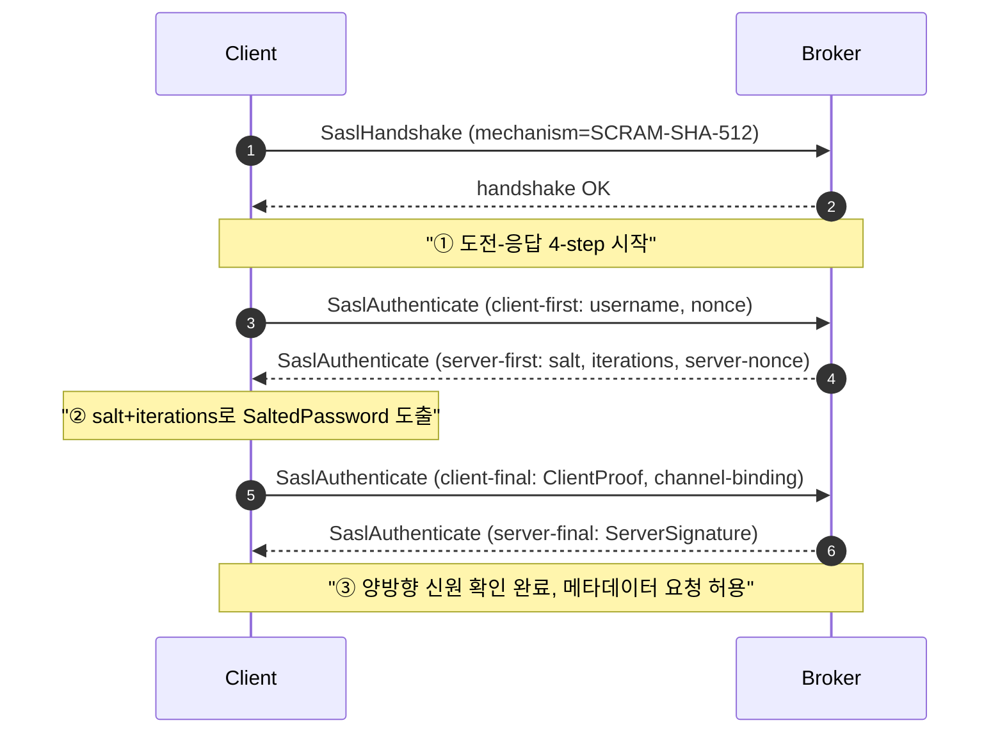

# Kafka·Redpanda SASL 인증 — 메시지 큐 본체에 신원을 다는 표준 경로

---

> [02-02.Redpanda Console 인증](02-02.Redpanda%20Console%20인증.md)이 남긴 갈고리를 받아 시작한다. Console UI에 게이트를 세워도 9092/9093 포트로 직접 클라이언트가 붙으면 그대로 통과한다는 사실, 그리고 우리 차트(`values-dev.yaml`, `values-ppp.yaml`)가 `auth.sasl.enabled: false`로 떠 있다는 사실에서 출발한다. 이 글은 브로커 자체에 인증을 붙이는 표준 절차인 SASL을 정리하고, TPS 차트와 `message-lib`에 어떻게 떨어지는지까지 내려간다.


## 학습 목표

> SASL 메커니즘 선택과 *JAAS·ACL·TLS와의 조합*을 이해해 클러스터에 신원을 단단히 박는다.

이 장을 다 읽고 다음 다섯 가지에 자신 있게 답할 수 있으면 학습이 완료된다.

1. SASL/PLAIN과 SASL/SCRAM의 차이를 *전송 평문 여부·해시 저장 여부*로 설명할 수 있다.
2. SASL이 *인증*만 담당하고, *권한*은 ACL이 별도로 담당하는 관계를 설명할 수 있다.
3. SASL을 켤 때 TLS가 사실상 함께 강제되는 이유를 설명할 수 있다.
4. JAAS 설정이 클라이언트에서 어떻게 표현되고 시크릿 회전이 어디서 일어나는지 설명할 수 있다.
5. Kafka와 Redpanda의 SASL 구현 차이(메커니즘 지원·SR 인증)를 비교할 수 있다.

## 1. 왜 이 글을 쓰는가

문제는 04-06의 마지막 문장이 정확하다. UI 게이트는 사람이 브라우저로 접속할 때의 통제이지, 프로듀서·컨슈머가 9092로 붙는 평면을 보호하지 않는다. 사내망에 같이 떠 있는 임의의 파드에서 `kafkacat -b 10.255.17.176:31092`를 치면 그대로 토픽이 보이고, 토픽이 보이면 메시지를 흘려 넣을 수도 있다. SASL이 꺼져 있는 한 모든 클라이언트는 "익명"이고, 익명이라는 사실 자체를 브로커가 모른다는 점이 더 큰 문제다.

이 글은 그 평면을 닫는 방법을 정리한다. 다만 "SASL 켜는 방법" 한 줄이 아니라, *어떤 메커니즘이 우리 환경에 맞는가*, *JAAS·ACL·TLS와는 어떻게 묶이는가*, *Redpanda는 Kafka와 어떤 차이가 있는가*, *TPS의 `message-lib` 디폴트와 충돌하지 않게 어디를 건드려야 하는가* 까지 같은 톤으로 내려간다. 04-06이 UI 층의 게이트를 다뤘다면, 04-07은 와이어 프로토콜 층의 게이트를 다룬다.

## 2. SASL이 푸는 문제와 푸는 방식

먼저 자주 묶이는 두 개를 분리해 둔다. TLS는 *서버가 진짜 그 서버인지*와 *전송 구간이 도청되지 않는지*를 보장한다. SASL은 *클라이언트가 누구인지*를 브로커에게 증명한다. TLS만 켜면 도청은 막히지만 익명 접속은 그대로 허용되고, SASL만 켜면 누구인지는 알지만 비밀번호가 평문으로 흐른다. 그래서 운영 환경의 기본 조합은 SASL_SSL 한 가지로 수렴한다. Kafka는 이 조합을 `security.protocol` 한 키로 표현한다.

| `security.protocol` | 전송 암호화 | 클라이언트 신원 | 쓰임 |
|---|---|---|---|
| `PLAINTEXT` | 없음 | 없음 | 폐쇄망 dev 초기, 운영 금지 |
| `SSL` | 있음 | mTLS 시만 | UI 미인증 회피용 + 클라이언트 인증서 별도 |
| `SASL_PLAINTEXT` | 없음 | 있음 | 사내망 내부 토폴로지 한정, 비밀번호 노출 위험 |
| `SASL_SSL` | 있음 | 있음 | 사실상 운영 기본 |

SASL은 Kafka 와이어 프로토콜에 두 개의 프레임으로 끼어든다. 클라이언트가 TCP를 연 직후, `ApiVersions` 다음에 `SaslHandshake` 요청을 보내 "나는 SCRAM-SHA-512로 인증하겠다"고 알리고, 브로커가 그 메커니즘을 허용하면 곧이어 `SaslAuthenticate` 프레임들이 메커니즘 고유의 도전-응답을 주고받는다. 이 단계가 끝나기 전에는 어떤 토픽 메타데이터 요청도 받지 않는다. 출처: [`apache/kafka` docs/security/authentication-using-sasl.md](https://github.com/apache/kafka/blob/trunk/docs/security/authentication-using-sasl.md).

## 3. 메커니즘 비교 — 무엇을 고르는가

선택지는 다섯 개로 좁힌다. mTLS는 SASL의 일원은 아니지만 운영에서 자주 같이 묶이므로 비교 행에 둔다.

| 메커니즘 | 증명 방식 | 비밀 저장 형태 | 교체 비용 | 운영 함정 |
|---|---|---|---|---|
| `PLAIN` | 비밀번호 평문 전송 (TLS 안에서) | 브로커 측 평문/해시 파일 | 사용자 추가 = 파일 재배포 | TLS 없으면 즉시 노출. JAAS 정적 파일 재배포는 롤링 재시작 동반 |
| `SCRAM-SHA-256` | challenge-response, salted hash | 브로커 메타데이터(Kafka는 ZK/KRaft, Redpanda는 컨트롤러) | 사용자별 동적 추가 가능 | iterations 너무 낮으면 brute-force 약함 |
| `SCRAM-SHA-512` | 위와 동일, 더 긴 해시 | 위와 동일 | 위와 동일 | CPU 비용 약간 증가, 운영 대부분의 디폴트 |
| `OAUTHBEARER` | OAuth2 토큰 검증 | IdP가 보유, 브로커는 검증만 | 토큰 만료 주기로 자동 회전 | 만료 시 재인증 처리 누락 시 리밸런스 중 끊김. Redpanda 지원은 버전·라이선스 의존 |
| `GSSAPI`(Kerberos) | KDC 티켓 | KDC가 보유 | 티켓 발급/갱신 운영 | 사내 KDC 운영 부담. 외부 PaaS와 잘 안 맞음 |
| `mTLS` (참고) | 클라이언트 인증서 | 인증서 파일 + 키 | 인증서 만료 주기 | SASL과 동시 사용 시 Principal 충돌 |

우리 운영계 기준 표준은 **SCRAM-SHA-512 + SASL_SSL** 한 묶음이다. 이유는 셋이다. 사용자 추가/회수가 동적이라 차트 재배포가 필요 없고, salted challenge-response라 평문 비밀번호가 흐르지 않으며, Kafka와 Redpanda가 양쪽 다 1급으로 지원한다. PLAIN은 dev에서도 굳이 쓸 이유가 없다. SCRAM-SHA-256 대비 512의 CPU 비용 차이는 우리 메시지 처리량 수준에서는 측정 잡음 안쪽이다.

OAUTHBEARER는 Keycloak 같은 IdP가 이미 잘 도는 조직에서만 점수가 높다. 토큰 만료를 클라이언트가 갱신해 주지 않으면 리밸런스 도중 인증이 만료돼 컨슈머가 떨어진다. Redpanda의 OIDC 지원은 라이선스 의존이라 무료 에디션에서는 SCRAM이 사실상 강제다([Redpanda authentication 페이지](https://docs.redpanda.com/current/manage/security/authentication/) 참고).

선택을 거꾸로 점검하는 질문 세 개도 가져 둔다. 첫째, *사용자 추가가 신청서 한 장으로 끝나는가?* 그렇지 않다면 OAUTHBEARER가 답이고, 그렇다면 SCRAM이 답이다. 둘째, *비밀번호 회전 주기를 90일 안쪽으로 잡을 수 있는가?* 어렵다면 토큰 만료를 자동으로 강제하는 OAUTHBEARER가 더 안전하다. 셋째, *클라이언트 라이브러리가 모두 같은 메커니즘을 지원하는가?* 모듈 한 곳이라도 OAUTHBEARER 비지원이면 그쪽을 강제로 SCRAM으로 떨어뜨려야 하고, 그 비대칭이 운영 비용으로 누적된다. 세 답이 모두 SCRAM 쪽이면 SCRAM-SHA-512가 가장 작은 운영 표면을 만든다.

iterations 값도 한 번에 못 박는다. Redpanda 기본은 4096이고, Kafka는 사용자 생성 시 `--scram-mechanism SCRAM-SHA-512=[iterations=8192,password=...]` 형태로 지정할 수 있다. 모던 하드웨어 기준 8192~10000 사이면 인증 한 번에 수 ms를 더하지만 brute-force 비용은 한 자리 수 늘어난다. 운영에서는 8192를 출발점으로 두고, 인증 지연이 측정 가능할 정도로 늘어나면 그때 4096으로 내린다.

## 4. JAAS와 클라이언트 설정의 실제

Kafka 클라이언트가 SASL을 켜는 데 필요한 키는 사실상 세 줄이다.

```properties
security.protocol=SASL_SSL
sasl.mechanism=SCRAM-SHA-512
sasl.jaas.config=org.apache.kafka.common.security.scram.ScramLoginModule required \
                 username="tps-operator" \
                 password="${SASL_PASSWORD}";
```

`sasl.jaas.config`는 JVM 전역 `-Djava.security.auth.login.config` 파일 대신 클라이언트 단위로 인라인 JAAS를 박는 길이다. 옛 문서는 JVM 옵션을 시키지만, 한 JVM에서 여러 클러스터에 다른 신원으로 접속해야 하는 일이 흔하기 때문에 인라인 방식이 사실상 표준이 됐다.

Spring Boot에서는 이 세 줄이 `spring.kafka.properties.*`로 매핑된다. `message-lib`의 `KafkaDefaultsEnvironmentPostProcessor`가 디폴트를 주입하는 방식과 결이 같다. SASL을 켤 때는 다음처럼 추가한다.

```yaml
spring:
  kafka:
    properties:
      security.protocol: SASL_SSL
      sasl.mechanism: SCRAM-SHA-512
      sasl.jaas.config: >
        org.apache.kafka.common.security.scram.ScramLoginModule required
        username="${TPS_KAFKA_USER}"
        password="${TPS_KAFKA_PASSWORD}";
      ssl.truststore.location: /etc/tps/kafka/truststore.jks
      ssl.truststore.password: ${TPS_KAFKA_TRUSTSTORE_PASSWORD}
```

코드 레벨에서 같은 키를 ProducerFactory에 직접 넘길 때는 comma-leading으로 적는다.

```java
Map<String, Object> props = new HashMap<>();
props.put(
        CommonClientConfigs.SECURITY_PROTOCOL_CONFIG, "SASL_SSL"
        , SaslConfigs.SASL_MECHANISM, "SCRAM-SHA-512"
        , SaslConfigs.SASL_JAAS_CONFIG, jaasFor(user, password)
        , SslConfigs.SSL_TRUSTSTORE_LOCATION_CONFIG, truststorePath
        , SslConfigs.SSL_TRUSTSTORE_PASSWORD_CONFIG, truststorePassword
);
```

> 위 예시는 `Map.put(...)`을 한 번에 여러 키로 호출할 수 없으므로 실제 코드에서는 키마다 호출을 분리한다. comma-leading 규칙은 가독성 시연용으로만 쓰고, 실 코드에서는 빌더 또는 `Map.of`를 쓴다.

비밀번호를 YAML에 직접 박지 않는다. dev/ppp는 K8s `Secret`을 환경변수로 주입하고, `${...}` 자리표시자가 Spring Boot의 표준 위임으로 해석된다. 비밀번호 자체가 평문으로 어딘가에 잠시라도 떠 있는 구간을 만들지 않는 것이 운영의 출발점이다.

## 5. SCRAM 핸드셰이크 시퀀스

SCRAM-SHA-512는 4-step challenge-response다. *서버가 비밀번호를 받지 않고도* 클라이언트가 비밀번호를 안다는 사실을 검증할 수 있게 설계됐다.



핵심은 두 가지다. 첫째, 비밀번호 자체가 네트워크에 흐른 적이 없다. 둘째, 각 단계가 nonce를 포함하기 때문에 같은 클라이언트의 직전 핸드셰이크를 그대로 재생해도 통하지 않는다. PLAIN과 결정적으로 다른 지점이다.

## 6. ACL — 인증 다음에 오는 인가

SASL을 켜면 브로커는 클라이언트가 *누구인지*를 안다. 그 신원으로 *무엇을 할 수 있는지*는 ACL이 결정한다. 두 층을 같이 켜지 않으면 SASL은 반쪽이다. 인증된 익명을 만든 셈이 된다.

Kafka의 ACL 모델은 *Principal × Resource × Operation × Permission*의 4축이다. Principal은 SASL 사용자라면 `User:alice`, mTLS라면 `User:CN=alice,OU=team`처럼 표현된다. 같은 사용자라도 SASL과 mTLS가 동시에 적용되면 Principal 문자열이 달라져 ACL이 안 맞는 함정이 생긴다. Redpanda도 동일한 모델을 따른다.

```bash
# Redpanda (rpk)
rpk acl create \
  --allow-principal "User:tps-operator" \
  --operation read --operation describe \
  --topic 'tps.executor.result.*' --resource-pattern-type prefixed
```

```bash
# Kafka (kafka-acls.sh)
kafka-acls.sh --bootstrap-server $BS --command-config admin.properties \
  --add --allow-principal "User:tps-operator" \
  --operation Read --operation Describe \
  --topic tps.executor.result --resource-pattern-type prefixed
```

운영에서 자주 깨지는 지점이 둘 있다. 하나는 `super.users`. 이 목록에 들어간 Principal은 ACL을 모두 건너뛴다. 운영 계정을 여기 넣어 둔 채로 잊으면 ACL 회수가 무력화된다. 다른 하나는 *컨슈머 그룹* 리소스. 토픽 Read만 부여하고 group Read를 빠뜨리면 컨슈머가 메시지를 받지만 오프셋 커밋을 못 해 무한 재처리에 빠진다. 토픽·그룹·트랜잭션 리소스를 짝지어 부여하는 습관이 필요하다.

Redpanda 측 사실 한 가지는 분명히 짚어 둔다. **SCRAM 사용자를 만들었다고 권한이 같이 붙지 않는다.** `rpk security user create`는 신원만 생성하고, superuser가 ACL을 별도로 부여해야 그 사용자가 토픽에 닿을 수 있다. 출처: [`rpk security user create`](https://docs.redpanda.com/current/reference/rpk/rpk-security/rpk-security-user-create/).

ACL 운영에는 짝지어 부여해야 하는 권한 묶음이 따로 있다. 컨슈머 한 명을 살리려면 토픽 `Read`와 `Describe`, 그리고 그 컨슈머가 속한 그룹의 `Read`를 함께 줘야 한다. Producer 쪽은 토픽 `Write`와 `Describe`, idempotent producer라면 클러스터 `IdempotentWrite`도 같이 필요하다. Kafka Streams처럼 내부 리포지토리 토픽을 자동 생성하는 경우라면 `Create` 권한과 토픽 패턴 매칭까지 한 번 더 검토한다. 권한을 절반만 주면 "메시지는 들어오는데 커밋이 안 됨" 같은 무거운 증상으로 나타나기 때문에, ACL 정의를 코드로 관리해 빠짐없이 적용한다.

리소스 패턴 타입(`literal` vs `prefixed`)도 운영 비용에 직결된다. 토픽 이름을 도메인 prefix(`tps.executor.`, `tps.operator.`)로 끊는 우리 명명 규칙([01-01.토픽 디자인](./../03_TopicDesign/01-01.토픽%20디자인.md))과 prefix ACL을 같이 쓰면, 새 토픽이 생겨도 ACL을 다시 부여하지 않아도 된다. 반면 `literal`로만 쓰면 토픽이 추가될 때마다 ACL PR이 따라간다. 우리 환경에서는 prefix를 기본으로 두고, 민감한 토픽 한두 개만 literal로 좁히는 방식이 운영 부담이 가장 낮다.

## 7. TLS와의 결합 — SASL_SSL을 기본으로 두는 이유

PLAIN+SASL_PLAINTEXT 조합은 비밀번호를 그대로 평문으로 흘린다. 사내망 안이라 해도 패킷 캡처 한 번에 모든 사용자 비밀번호가 새는 셈이라 의미가 없다. SCRAM이라면 평문 비밀번호는 안 흐르지만, ClientProof 캡처 후 오프라인 brute-force는 충분히 시도 가능하다. 그래서 TLS 채널 안에 SASL을 묶는 SASL_SSL이 운영 기본이 된다.

리스너 분리도 같이 결정해야 한다. **internal listener**(브로커 간, 사내 클라이언트)와 **external listener**(NodePort/LB 노출)는 같은 SASL을 쓰더라도 인증서 회전 주기와 호스트네임이 다르다. Redpanda 차트의 `external` 블록과 `internal`을 따로 두는 이유가 여기 있다.

인증서 회전은 무중단이 가능해야 한다. Kafka/Redpanda는 모두 **truststore 핫리로드**를 부분 지원하지만, 보수적으로는 두 개의 인증서 체인을 truststore에 동시에 두고 점진 교체하는 패턴이 안전하다. 회전 절차를 정의하지 않으면 만료일 직전에 전 클러스터가 멈추는 사고가 난다.

호스트네임 검증도 자주 새는 지점이다. 운영에서 `ssl.endpoint.identification.algorithm=https`를 끄고 도는 케이스가 있는데, 이걸 끄면 mTLS 없는 SASL_SSL에서 중간자 공격을 사실상 막지 못한다. 인증서 SAN에 외부/내부 호스트네임을 같이 포함시키는 작업이 차트 단계에서 끝나야 검증을 켜 둘 수 있다. NodePort로 IP를 직접 노출하는 우리 dev 구성에서는 `IP SAN`까지 함께 넣어야 한다.

cipher suite도 한 번은 점검한다. Java 17 기준 기본 cipher 목록에 TLS 1.3가 우선이지만, 일부 사내 보안정책이 TLS 1.2를 강제한다. 그 경우 `AES-GCM` 계열만 enabled로 두고 CBC 계열은 명시적으로 제외한다. cipher 목록을 클라이언트와 브로커가 한 줄도 어긋나지 않게 맞춰 둬야 핸드셰이크가 일관되게 통과한다.

## 8. Redpanda 차이점

Kafka 문서를 그대로 적용하다 막히는 지점이 몇 군데 있다. 그 차이가 04-05(01-05.Redpanda%20아키텍처.md))에서 본 단일 바이너리·KRaft 대체 구조에서 나온다.

첫째, **ZooKeeper SASL과 `kafka_server_jaas.conf` 개념이 없다.** Kafka 시절 JVM에 JAAS 파일을 던지는 운영은 Redpanda에서 통째로 사라진다. 사용자 관리는 컨트롤러 상태로 들어가고, `rpk security user create`로 추가/삭제한다.

둘째, **`redpanda.yaml`의 키 이름이 다르다.** Kafka의 `sasl.enabled.mechanisms` 대신 `kafka_api`의 `authentication_method: sasl`과 `sasl_mechanisms: [SCRAM-SHA-256, SCRAM-SHA-512]`가 있다. ACL을 켜는 키는 `kafka_enable_authorization: true`다.

셋째, **OAUTHBEARER·Kerberos 지원이 라이선스 의존이다.** 무료 에디션에서는 SCRAM이 사실상 선택지의 전부다. 우리가 Console 인증을 무료 라이선스에서 풀어야 했던 것과 같은 제약이 브로커 인증에도 그대로 적용된다.

넷째, **Helm 차트 인터페이스가 Kafka 차트와 다르다.** `tps_manifest/helm-charts/redpanda/values-*.yaml`의 `auth.sasl.enabled`와 `tls.enabled`가 1차 스위치고, 그 아래 사용자·시크릿 슬롯이 추가된다. 현재 둘 다 `false`다.

## 9. TPS 적용 — 우리 차트와 코드는 어디를 바꾸는가

코드 레벨 진입점은 두 곳이다. 차트(`tps_manifest/helm-charts/redpanda`)와 라이브러리(`message-lib`).

차트에서 바꿔야 할 키는 작다.

```yaml
# values-dev.yaml / values-ppp.yaml
auth:
  sasl:
    enabled: true
    mechanism: SCRAM-SHA-512
    users:
      - name: tps-operator
        password: { valueFrom: { secretKeyRef: { name: tps-kafka-secrets, key: operator-password } } }
        mechanism: SCRAM-SHA-512
      - name: tps-executor
        password: { valueFrom: { secretKeyRef: { name: tps-kafka-secrets, key: executor-password } } }
        mechanism: SCRAM-SHA-512

tls:
  enabled: true
  certs:
    default:
      caEnabled: true
```

차트가 떠 있는 시점에 사용자를 동적으로 추가/삭제할 때는 `rpk security user`를 쓰는 편이 안전하다. 차트 values에 사용자 목록을 박으면 헬름 업그레이드가 항상 사용자 동기화까지 함께 시도하기 때문에, 인시던트 대응 중 임시 사용자를 만들면 다음 배포에서 사라지는 함정이 생긴다.

라이브러리에서 바꿔야 할 곳은 `KafkaDefaultsEnvironmentPostProcessor`다. 디폴트로 던지는 `spring.kafka.*` 키 옆에 SASL 키를 *프로파일에 따라* 끼워 넣는다. 환경마다 키 이름은 동일하고, 값만 `Secret`에서 환경변수로 들어온다.

```java
defaults.put("spring.kafka.properties.security.protocol", "SASL_SSL");
defaults.put("spring.kafka.properties.sasl.mechanism", "SCRAM-SHA-512");
defaults.put(
        "spring.kafka.properties.sasl.jaas.config"
        , "org.apache.kafka.common.security.scram.ScramLoginModule required "
        + "username=\"${TPS_KAFKA_USER}\" password=\"${TPS_KAFKA_PASSWORD}\";"
);
defaults.put("spring.kafka.properties.ssl.truststore.location", "/etc/tps/kafka/truststore.jks");
```

`message-lib`가 디폴트만 주입한다는 점이 중요하다. 소비/발행 프로젝트가 자기 `application.yml`에 같은 키를 명시하면 그쪽이 이긴다. 운영에서 일부 서비스만 다른 신원으로 접근해야 할 때 이 우선순위가 그대로 작동한다.

Schema Registry와 Connect도 같은 인증을 통과해야 한다. Producer/Consumer만 SASL을 끼우고 Schema Registry 클라이언트가 평문이면 직렬화 단계에서 인증 실패로 떨어진다. `message-lib`가 노출하는 `schema.registry.url` 옆에 `basic.auth.credentials.source=USER_INFO`와 `basic.auth.user.info=user:password`(또는 SR 자체의 SASL)도 함께 세팅한다.

환경별 권장은 다음과 같이 잡는다. 운영(BOK 포함)은 SASL_SSL + SCRAM-SHA-512가 기본이고, ppp는 같은 묶음을 운영 전 단계 검증으로 사용한다. dev는 *최소한 SASL_PLAINTEXT + SCRAM-SHA-256*까지는 켜는 편이 좋다. dev에서 SASL을 안 켜면, 운영에서 처음 켤 때 발견되는 버그(키 이름 오타, JAAS escape, truststore 경로) 비용이 커진다.

TPS 모듈별 적용 지점도 미리 그려 둔다. `operator`는 명령 토픽으로 Write, 결과 토픽으로 Read를 동시에 가지므로 SASL 사용자 한 명에 두 권한을 모두 부여한다. `executor`는 반대로 결과 토픽 Write, 명령 토픽 Read가 짝이다. Outbox 폴러는 DB와 Kafka 양쪽에 신원을 가지는데, Kafka 쪽 신원은 operator/executor와 분리해 두는 편이 사고 시 회수 범위를 좁힐 수 있다. 운영 사고 보고서를 떠올렸을 때 "어떤 신원이 어떤 토픽에 무엇을 했는가"가 한 줄로 답해질 수 있어야 한다.

테스트 환경의 임베디드 브로커도 같은 방향으로 정렬한다. `EmbeddedKafkaBroker` 기반 통합 테스트가 SASL을 끄고 도는 동안에는, 운영에서 발견되는 버그가 테스트로 안 잡힌다. dev 클러스터에 SASL을 켜 두고 통합 테스트의 일부를 그쪽으로 옮기거나, 임베디드 브로커에도 `brokerProperties`로 SASL_PLAINTEXT를 켜 두는 정도는 비용 대비 효과가 좋다.

## 10. 마이그레이션 절차 — 무중단으로 켜기

이미 운영 중인 클러스터에 SASL을 끼우는 데는 **이중 리스너** 패턴이 가장 안전하다.

1. 기존 PLAINTEXT 리스너(9092)는 그대로 두고, SASL_SSL 리스너(예: 9094)를 새로 추가한다.
2. 사용자와 ACL을 미리 생성해 둔다(`rpk security user create` → `rpk acl create`).
3. 클라이언트를 한 서비스씩 9094로 전환한다. 전환할 때 `bootstrap.servers`, `security.protocol`, `sasl.*` 세 곳을 함께 바꾼다.
4. 모든 클라이언트가 9094를 쓰는 것이 메트릭으로 확인되면 PLAINTEXT 리스너를 폐쇄한다.

롤백 기준선은 명확히 잡는다. *PLAINTEXT 리스너를 닫기 전까지는 언제든 SASL_SSL을 끄고 9092로 되돌릴 수 있다*. PLAINTEXT를 끈 시점부터는 되돌리려면 다시 9092를 여는 헬름 배포가 필요하다. 끄는 PR과 여는 PR을 묶어서 준비해 둔다.

inter-broker 통신도 같은 절차로 옮긴다. `security.inter.broker.protocol`을 `PLAINTEXT`에서 `SASL_SSL`로 바꿀 때는 *반드시* 모든 브로커가 새 리스너를 들을 수 있게 된 다음에 인터브로커 키를 바꿔야 한다. 순서가 뒤집히면 리더 선출이 끊긴다.

각 단계마다 검증 포인트를 못 박아 둔다. SASL_SSL 리스너를 추가한 직후에는 `rpk cluster info --tls-enabled --user ... --password ...`로 새 리스너 응답을 확인하고, ACL을 한 줄 부여할 때마다 `rpk topic consume`을 신원 시점으로 한 번씩 돌려 권한이 의도대로 좁혀졌는지 확인한다. 클라이언트 전환 단계에서는 브로커 로그의 `authentication failed` 카운터를 메트릭으로 빼서 0으로 수렴하는지 본다. 이런 검증 없이 단계만 진행하면 마지막 PLAINTEXT 폐쇄에서 한꺼번에 장애가 터진다.

## 11. 공통 한계와 함정

**SASL이 켜져 있어도 빈 토픽만 보이는 현상.** 인증은 통과했는데 ACL이 없는 사용자는 메타데이터 요청 결과가 빈 리스트로 돌아온다. "토픽이 사라졌다"고 신고가 들어오는 99%의 경로다. 인증/인가를 분리해서 확인하는 절차가 필요하다.

**SCRAM iterations 너무 낮은 위험.** Redpanda는 기본 4096이지만, 외부 도구로 사용자를 만들 때 임의로 낮춰 두는 케이스가 있다. 4096 미만이면 오프라인 brute-force 비용이 급격히 낮아진다. 사용자 생성 후 메타데이터로 iterations를 확인하는 루틴이 있어야 한다.

**리밸런스 중 인증 만료.** OAUTHBEARER에서 가장 자주 발생한다. 토큰 만료가 리밸런스 도중과 겹치면 컨슈머가 그룹에서 영구히 빠진다. 토큰 갱신 콜백을 등록하지 않은 상태로 OAUTHBEARER를 쓰지 않는다.

**mTLS와 SASL 동시 사용 시 Principal 충돌.** 둘 다 켜면 Kafka는 어느 쪽 Principal을 쓸지 `ssl.principal.mapping.rules`로 결정한다. 매핑이 의도와 다르면 ACL 전체가 깨진 것처럼 보인다. 한쪽만 쓰는 편이 운영 비용이 낮다.

**PLAIN+SCRAM 혼용.** `sasl.enabled.mechanisms`에 둘 다 두면 운영자는 PLAIN을 통제했다고 생각하지만, 클라이언트는 여전히 PLAIN을 고를 수 있다. PLAIN이 필요 없으면 enabled 목록에서 제거한다.

**Schema Registry 인증 누락.** 9장에서 다시 다룰 주제이지만, Producer는 SASL을 통과해도 Schema Registry 호출이 평문으로 외부망을 타면 메시지 계약 전체가 노출된다.

**관찰성 공백.** SASL 인증 실패 카운터, ACL 거부 카운터, 인증서 만료까지의 일수는 SASL을 켜는 순간부터 Grafana에 띄워 둔다. Redpanda는 `redpanda_kafka_handler_sasl_auth_failed_total` 류 메트릭을, Kafka는 `kafka.server:type=BrokerTopicMetrics,name=FailedAuthenticationPerSec`를 노출한다. 운영에 켜 두지 않으면 사고가 나기 전에 알 길이 없다.

**JAAS 문자열 escape.** YAML과 Helm을 거치면서 따옴표가 잘못 닫혀 `sasl.jaas.config`가 깨지는 사고가 잦다. 끝의 세미콜론(`;`) 누락이 단골이고, YAML `>-` 폴딩이 줄바꿈을 공백으로 바꿔 의도와 달리 한 줄로 합쳐지는 케이스도 있다. 배포 직후 한 클라이언트라도 인증이 통과하는지 자동으로 확인하는 스모크 테스트가 필요하다.

## 12. 체크리스트 — 도입 PR 전 확인 항목

- [ ] `auth.sasl.enabled: true`, `auth.sasl.mechanism: SCRAM-SHA-512`로 차트 값 갱신.
- [ ] `tls.enabled: true`와 CA/서버 인증서 시크릿 동시 갱신.
- [ ] `tps-kafka-secrets`에 사용자별 비밀번호 키 추가, values는 `secretKeyRef`로만 참조.
- [ ] `kafka_enable_authorization: true` 켜고, 도입 직후 `super.users` 목록 점검.
- [ ] 토픽 패턴별 ACL을 사용자 단위로 생성 (`read/describe/write`, 컨슈머 그룹 `read` 동반).
- [ ] `message-lib`의 `KafkaDefaultsEnvironmentPostProcessor`에 `security.protocol/sasl.mechanism/sasl.jaas.config/truststore` 디폴트 추가.
- [ ] Schema Registry 클라이언트에도 동일 인증/TLS 적용.
- [ ] 이중 리스너 전환 절차(9092 유지 → 9094 추가 → 클라이언트 이동 → 9092 폐쇄)와 롤백 PR을 같이 준비.
- [ ] dev에서 최소 1주 운영 후 ppp로 승급, 그다음 운영계로 승급.
- [ ] 비밀번호·인증서 회전 주기를 문서화 (90일 권장, 만료 14일 전 알림).

## 13. 면접 대비 Q&A

> 면접에서 자주 나오는 형태로 5개. 답을 보지 않고 먼저 입으로 답해 본 뒤 비교한다.

### Q1. SASL/PLAIN과 SASL/SCRAM의 결정적 차이는?

PLAIN은 *비밀번호를 평문으로 전송*한다. TLS 없이는 도청 한 번으로 끝난다. SCRAM은 챌린지-응답 방식으로 비밀번호 자체를 와이어에 띄우지 않고, 브로커도 평문 비밀번호가 아닌 *솔트된 해시*만 저장한다. PLAIN은 외부 신원 제공자(LDAP/IDP)에 위임할 때 유용하지만, 자체 사용자 풀을 갖는 클러스터라면 SCRAM-SHA-512가 표준 선택이다.

### Q2. SASL을 켰는데 ACL이 비어 있으면 어떻게 동작하나?

브로커 설정에 따라 두 경로다. `kafka_enable_authorization: false`면 인증만 통과해도 모든 작업이 허용된다(즉 *신원만 확인*). `true`면 ACL이 없는 사용자는 어떤 작업도 못 한다. 그래서 SASL 도입 직후 `super.users`에 비상용 계정을 두고 점진적으로 ACL을 채워 가는 패턴이 안전하다. SASL과 ACL은 *인증*과 *권한*으로 역할이 분리돼 있다는 점을 잊으면 운영 사고가 난다.

### Q3. SASL을 켜면 TLS가 사실상 강제되는 이유는?

SASL/PLAIN은 *그 자체로 평문*이라 TLS 없이 쓰면 의미가 없다. SCRAM이라도 클라이언트가 보낸 챌린지 응답이 도청되면 *동일한 챌린지에서는* 재사용 공격이 가능하다. 더 근본적으로 SASL은 *인증 메시지*만 보호하지 *그 뒤 페이로드*는 보호하지 않는다. 토픽 데이터·메타데이터가 평문으로 흐르면 인증을 켤 이유가 없다. 그래서 SASL_PLAINTEXT는 데모용이고, 운영은 SASL_SSL이 정상이다.

### Q4. JAAS 설정에서 비밀번호 회전을 안전하게 하려면?

비밀번호를 *코드/values에 박지 말고* `secretKeyRef`로만 참조하게 만들고, Kubernetes Secret 자체를 회전한다. JAAS 문자열은 환경변수로 주입되어 Spring `KafkaDefaultsEnvironmentPostProcessor` 같은 자리에서 조립된다. 회전 절차는 (1) 새 비밀번호를 SCRAM 사용자에 추가, (2) Secret 갱신·재배포, (3) 모든 컨슈머·프로듀서가 새 비번으로 재인증됐는지 확인, (4) 옛 비밀번호 SCRAM 등록 제거다. 단계 사이에 양쪽 비번이 동시에 살아있는 *오버랩 구간*이 있어야 무중단이 된다.

### Q5. Kafka와 Redpanda의 SASL 운영 차이는?

지원 메커니즘과 도구 측면이다. Kafka는 PLAIN·SCRAM-SHA-256/512·GSSAPI(Kerberos)·OAUTHBEARER를 다 지원한다. Redpanda는 PLAIN·SCRAM-SHA-256/512·OAUTHBEARER가 표준이고, Kerberos는 정식 지원이 아니다. 또 Redpanda는 `rpk security user create` 같은 단일 바이너리 도구로 사용자 관리가 끝나서 *별도 ZK/KRaft 메타 인프라*를 만지지 않아도 된다. Schema Registry 인증도 같은 바이너리 안이라 별도 컴포넌트의 별도 인증 설정이 없다.


## 14. 관련 문서

- [02-01.Redpanda 아키텍처](02-01.Redpanda%20아키텍처.md) — 단일 바이너리 위에서의 SASL 위치
- [02-02.Redpanda Console 인증](02-02.Redpanda%20Console%20인증.md) — UI 게이트와의 짝 패턴
- [03-01.Kafka 공통 정책 스타터 패턴](03-01.Kafka%20공통%20정책%20스타터%20패턴.md) — SASL/TLS 디폴트를 starter로 묶기


## 15. 다음 단계 / 참고 문서

- [02-02.Redpanda Console 인증](02-02.Redpanda%20Console%20인증.md) — UI 게이트 4가지 옵션. 이 문서와 한 쌍으로 읽는다.
- [02-01.Redpanda 아키텍처](02-01.Redpanda%20아키텍처.md) — 단일 바이너리·KRaft 대체 구조가 SASL 구성에 어떻게 떨어지는지의 배경.
- [08_advanced/01_variants/01-04.스키마 거버넌스](.././08_advanced/01_variants/01-04.스키마%20거버넌스.md) — Schema Registry 측 ACL 보강 논의.
- Kafka 공식: [authentication-using-sasl.md](https://github.com/apache/kafka/blob/trunk/docs/security/authentication-using-sasl.md), [authorization.md](https://github.com/apache/kafka/blob/trunk/docs/security/authorization.md).
- Redpanda 공식: [Authentication](https://docs.redpanda.com/current/manage/security/authentication/), [rpk security user create](https://docs.redpanda.com/current/reference/rpk/rpk-security/rpk-security-user-create/), [Authorization (ACL)](https://docs.redpanda.com/current/manage/security/authorization/).
