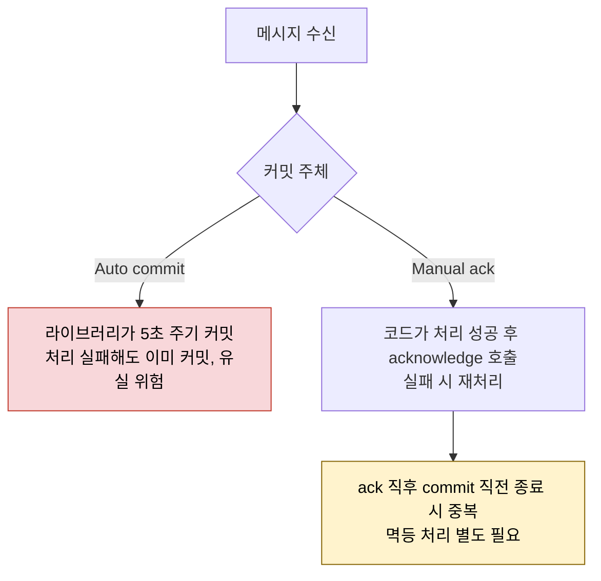
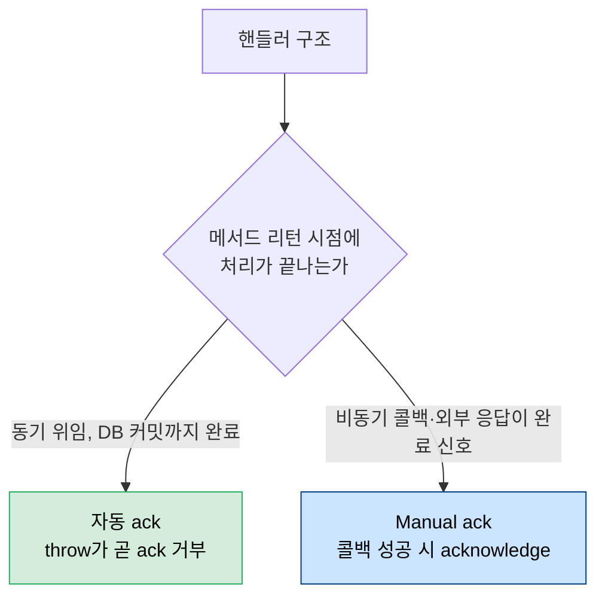

# Manual Ack와 Offset Commit 정책

---

> Kafka 컨슈머의 진짜 안전성은 *언제 오프셋을 커밋하는가*로 결정된다. Auto commit은 "메시지를 받은 사실"만 기록하고, Manual ack는 "비즈니스 처리가 끝난 사실"을 기록한다. 두 정책의 차이가 장애 시 메시지 유실과 중복의 분기점이다. 본 글은 Spring Kafka에서 두 정책이 실제로 어떻게 동작하며, 어느 경우에 Manual ack가 의미 있고 어느 경우엔 자동 ack로 충분한지를 정리한다.

`03-04.Exactly-once 의미론과 Consumer Idempotency`가 *중복 처리에 안전한 시스템 만들기*의 큰 틀이라면, 본 글은 그 안의 한 부품인 *오프셋 커밋 타이밍 정책*만 따로 떼어내 본다.


## 1. 두 정책의 본질적 차이

> 같은 메시지에 대해 "처리됨"이라는 사실을 *어디서 누가* 기록하느냐가 다르다. Auto commit은 *Kafka 클라이언트 라이브러리*가 주기적으로 한다. Manual ack는 *애플리케이션 코드*가 명시적으로 호출한다.

| 측면 | Auto commit | Manual ack |
|------|-------------|-----------|
| 커밋 주체 | Kafka consumer 라이브러리 (백그라운드) | 비즈니스 코드 |
| 커밋 시점 | `auto.commit.interval.ms`(기본 5초) 주기 | `Acknowledgment.acknowledge()` 호출 시 |
| 장애 시 위험 | *처리 실패해도 이미 커밋*되어 유실 가능 | *처리 성공 후* 커밋이라 재처리 가능 |
| 코드 복잡도 | 낮음 (별도 호출 없음) | `Acknowledgment` 인자 추가 |
| 멱등성 책임 | 컨슈머가 짊어짐 (중복은 시간 정확도에 달림) | 컨슈머가 짊어짐 (재처리 빈도가 줄지만 0은 아님) |

Manual ack가 "유실을 막는다"고만 이해하면 안 된다. *재처리 빈도를 줄일 뿐* 0으로 만들지 못한다. ack 호출 직후 offset commit 직전에 죽으면 같은 메시지가 다시 들어온다. 따라서 *Manual ack를 쓰더라도 멱등 처리는 별도로 필요하다* (`03-04 §4` Inbox 멱등 테이블).




## 2. Spring Kafka의 ack-mode 7가지

> Spring Kafka는 `AckMode` enum으로 커밋 시점을 7개로 세분화한다. 운영에서 자주 쓰는 것은 셋 — `BATCH`(기본), `MANUAL`, `MANUAL_IMMEDIATE`.

```yaml
spring:
  kafka:
    listener:
      ack-mode: MANUAL  # 또는 MANUAL_IMMEDIATE, BATCH 등
```

| ack-mode | 동작 |
|----------|------|
| `RECORD` | 메서드 리턴마다 커밋 |
| `BATCH` (기본) | poll 한 번에 받은 모든 record가 처리되면 커밋 |
| `TIME` | 일정 시간 경과 시 커밋 |
| `COUNT` | 일정 건수 처리 시 커밋 |
| `COUNT_TIME` | 둘 중 먼저 만족하는 쪽 |
| `MANUAL` | `acknowledge()` 호출 시 다음 poll에 커밋 |
| `MANUAL_IMMEDIATE` | `acknowledge()` 호출 즉시 동기 커밋 |

`MANUAL`과 `MANUAL_IMMEDIATE`의 차이는 *커밋 지연*이다. `MANUAL`은 다음 poll 사이클에 묶여 커밋되므로 처리량이 높지만, 그 사이에 컨슈머가 죽으면 직전 ack가 반영되지 않을 수 있다. `MANUAL_IMMEDIATE`는 즉시 커밋해 안전하지만 매번 동기 RPC라 처리량이 떨어진다.


## 3. Manual ack가 의미 있는 두 경우

> Manual ack를 도입하기 전에 *왜 필요한가*를 분명히 해야 한다. 단순히 "안전해 보여서" 도입하면 코드 복잡도만 늘어난다.

### 3-1. 핸들러가 비동기로 일을 시작하는 경우

핸들러 메서드가 외부 API를 호출하고 *콜백으로 결과를 받는* 구조라면 메서드 리턴 시점에는 처리가 끝나지 않은 상태다. 자동 ack는 메서드 리턴 = 처리 완료로 간주하므로 콜백 실패 시 메시지가 이미 커밋된 상태가 된다.

```java
@KafkaListener(topics = "order", containerFactory = "manualAckFactory")
public void consume(OrderEvent event, Acknowledgment ack) {
    externalApi.sendAsync(event, response -> {
        if (response.isSuccess()) {
            ack.acknowledge();  // 콜백에서 ack
        }
        // 실패 시 ack 안 함 → 재처리
    });
}
```

이 패턴은 외부 응답이 *처리 완료의 진짜 신호*인 경우에만 적합하다.

### 3-2. 외부 응답이 도착해야 처리 완료라고 부를 수 있는 경우

결제 승인이나 배송 요청처럼 *외부 시스템의 응답이 확정 신호*인 도메인에서는 핸들러 메서드가 리턴해도 "처리 끝"이 아니다. 외부 응답을 기다린 뒤 ack해야 한다.


## 4. Manual ack가 필요 없는 경우

> 핸들러가 *동기 위임*으로 끝나는 단순 구조라면 자동 ack로 충분하다. `03-04 §5`의 결론과 같다 — TPS 대부분의 컨슈머가 이 케이스다.

핸들러가 비즈니스 메서드를 호출하고 그 메서드가 동기 트랜잭션 안에서 DB 커밋까지 마치고 리턴하는 패턴이라면, *메서드 리턴 = 처리 완료 = ack* 흐름이 자연스럽다.

```java
@KafkaListener(topics = "deploy")
@Transactional
public void onDeploy(DeployCommandAvro cmd) {
    deployUseCase.handle(cmd);  // DB 커밋까지 동기 처리
}
```

이 경우 manual ack를 도입해도 *재처리 빈도가 약간 줄어드는 것 외에는 안전성 차이가 없다*. 핸들러가 throw하면 자동 ack는 *커밋 안 함*으로 동작하므로 재처리가 일어난다. 즉 throw가 곧 "ack 거부"의 의미를 갖는다.

`03-04 §5`가 이를 정리한 그대로다 — *manual ack는 비동기 콜백 패턴 한정*이고, 동기 위임이면 자동 ack가 더 깔끔하다.




## 5. Auto commit과 Manual ack를 섞을 때 주의

> `enable.auto.commit=true`(라이브러리 레벨)와 Spring Kafka의 ack-mode는 서로 다른 레이어다. 둘을 동시에 켜면 동작이 어긋난다.

`enable.auto.commit=true`는 Kafka 클라이언트가 *주기적으로 자동 커밋*하는 옵션이다. Spring Kafka는 이 옵션을 *강제로 false*로 두는 것을 권장하며, ack-mode로 직접 통제한다.

```yaml
spring:
  kafka:
    consumer:
      enable-auto-commit: false  # Spring Kafka 권장 기본
```

Spring Kafka의 ack-mode `MANUAL`은 *컨슈머 라이브러리의 auto commit이 꺼져 있다는 전제*에서만 동작한다. 둘 다 켜져 있으면 ack 호출이 무의미해진다.


## 6. Manual ack 사용 시 흔한 실수

> 코드를 봤을 때 "ack 안 되는 이유"를 추적하기 어려운 패턴이 셋 있다.

### 6-1. ack 호출 전 throw

```java
@KafkaListener(topics = "order", containerFactory = "manualAckFactory")
public void on(OrderEvent event, Acknowledgment ack) {
    process(event);  // 여기서 throw
    ack.acknowledge();  // 호출 안 됨
}
```

`process()`가 throw하면 ack가 호출되지 않고, Spring Kafka의 `DefaultErrorHandler`가 재시도·DLQ 경로로 보낸다. 이건 *정상 동작*이지만 "왜 ack가 안 됐는가"를 디버깅할 때 헷갈린다.

### 6-2. ack를 try/catch로 감싼 finally

```java
try {
    process(event);
} catch (Exception e) {
    log.error("failed", e);
} finally {
    ack.acknowledge();  // 실패해도 ack
}
```

이 패턴은 *어떤 실패도 재처리하지 않겠다*는 강한 정책이다. 의도한 거라면 OK이지만, "안전해 보여서" 무심코 쓰면 메시지 유실의 원인이 된다.

### 6-3. nullable Acknowledgment

ack-mode가 `MANUAL`이 아닌 컨테이너에 `Acknowledgment` 인자를 추가하면 `null`이 주입된다. `ack.acknowledge()` 호출 시 NPE. 컨테이너 factory와 ack-mode를 함께 확인해야 한다.


## 7. 정리

Manual ack는 *유실을 막는 절대 안전망*이 아니라 *재처리 빈도를 줄이는 정밀 제어 도구*다. 도입 판단의 핵심은 "핸들러 메서드가 리턴할 때 처리가 정말 끝나는가"다.

- 동기 위임 + 트랜잭션이면 자동 ack로 충분
- 비동기 콜백 또는 외부 응답 대기 패턴이면 Manual ack 필요
- *어느 쪽이든* 멱등 처리(`03-04` Inbox 패턴)는 따로 필요

TPS는 대부분의 핸들러가 동기 위임 패턴이라 자동 ack를 채택했다. 별도 Manual ack 설정 빈은 두지 않았고, 운영 안전망은 `KafkaErrorConfig`의 재시도·DLQ가 짊어진다.


---

> **TPS 적용 사례** — `okestro/tps-gitlab2`
>
> - **현재 정책**: `enable-auto-commit=false` + ack-mode 기본(BATCH). Manual ack 미사용
> - **이유**: Command/Result 컨슈머 모두 동기 위임 패턴. 핸들러 메서드 리턴 = 트랜잭션 커밋 = 처리 완료
> - **재처리 안전망**: `message-lib/.../config/KafkaErrorConfig.java`의 `DefaultErrorHandler`가 throw 시 1초·2초·4초 백오프 후 `tps.v305p.dlq`로 격리
> - **참조**: 멱등성 보강은 [`../03-04.Exactly-once 의미론과 Consumer Idempotency`](../05_ConsistencyPattern/03-04.Exactly-once%20의미론과%20Consumer%20Idempotency.md), config 종합은 [01-12](04-01.message-lib%20config%205개%20클래스%20종합.md)
