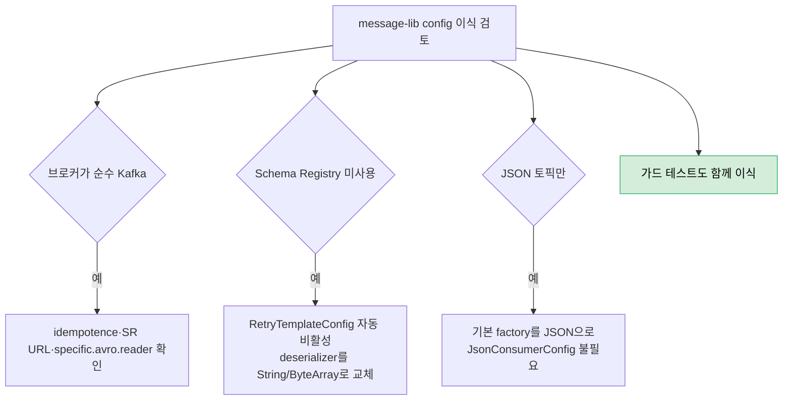
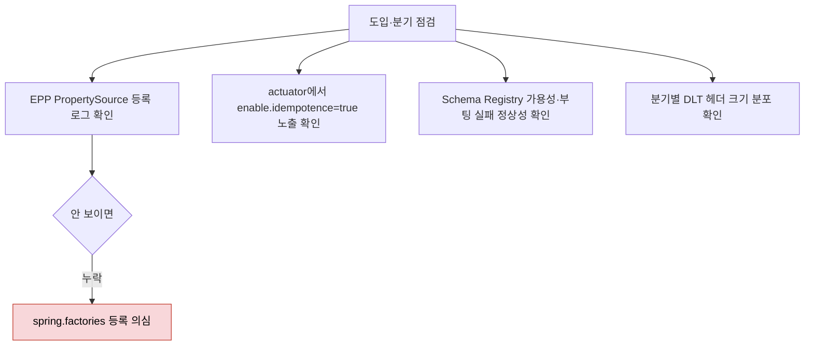

# message-lib config 운영 이식 가이드

---

> [01-12](04-01.message-lib%20config%205개%20클래스%20종합.md)이 *왜 이렇게 생겼는가*를 다루고, [01-13](04-02.message-lib%20config%20학습%20검증.md)가 *이해했는가*를 검증한다면, 이 문서는 *어떻게 다른 프로젝트에 옮겨 쓰는가*와 *운영에서 무엇을 본다*에 답한다. 결정 체크리스트와 운영 모니터링 항목을 한 자리에 모았다.


## 0. 사용 방법

> 이 문서는 다음 두 상황에서 펴 본다.
>
> 1. 같은 패턴을 *새 프로젝트*에 적용하려고 결정할 때.
> 2. `message-lib`를 *운영 환경에서 모니터링*할 때.

새 프로젝트 적용 결정은 §1 결정 체크리스트로 시작한다. 브로커 종류(Kafka vs Redpanda), Schema Registry 유무, 메시지 형식(Avro vs JSON), idempotence 정책 네 축에서 자기 환경이 어디에 해당하는지 먼저 매핑한다. 그 다음 §2 코드 변경 자리와 §3 운영 모니터링을 본다. PR 리뷰 시 §2 다섯 항목은 체크리스트로 그대로 쓸 수 있다.


## 1. 다른 프로젝트 적용 결정 체크리스트

> 이 패턴을 *다른 Spring Boot 프로젝트*에 옮겨 쓸 때 무엇을 먼저 결정해야 하는지 정리한다. TPS 환경 가정이 어디까지 박혀 있는지 명시한다.

### 1-1. 브로커가 순수 Kafka라면

| 항목 | 확인 사항 |
|------|----------|
| `enable.idempotence=true` | Confluent Kafka에서도 동일하게 동작. Producer Config v3.0+ 권장 |
| Schema Registry URL | Confluent Schema Registry는 별도 컴포넌트. URL은 yaml로 명시 |
| `specific.avro.reader=true` | 라이브러리 사용 측이 Avro generated 클래스를 classpath에 가져야 함 |
| `transactional.id` | 본 시스템은 사용 안 함. 다중 파티션 EOS가 필요하면 추가 검토 |

### 1-2. Schema Registry를 쓰지 않는다면

| 항목 | 결정 |
|------|------|
| `KafkaRetryTemplateConfig` | `@ConditionalOnProperty`로 자동 비활성화됨. 그대로 둬도 무관 |
| Consumer value-deserializer | `KafkaAvroDeserializer` 자리에 `StringDeserializer` 또는 `ByteArrayDeserializer`로 교체 필요 |
| `@RetryableTopic` 활성화 여부 | Avro 없이 byte[] 또는 String만 다루면 기본 `KafkaTemplate`으로 충분 |

### 1-3. JSON 토픽만 다룬다면

| 항목 | 결정 |
|------|------|
| `KafkaDefaultsEPP`의 Avro 관련 키 | `KafkaAvroDeserializer` 삭제, `JsonDeserializer` 또는 `ByteArrayDeserializer`로 교체 |
| `KafkaJsonConsumerConfig` | *기본 factory*가 JSON이라면 본 클래스 자체가 불필요 |
| `KafkaHeaderMapperConfig` | 헤더 디코딩은 직렬화 형식과 무관. 그대로 유효 |

### 1-4. idempotence를 끄고 싶은 경우

`application.yml`에 다음을 추가하면 EPP의 `addLast` 우선순위 덕분에 즉시 덮인다.

```yaml
spring:
  kafka:
    producer:
      properties:
        enable.idempotence: false
```

그러나 idempotence를 끄면 outbox 폴러의 retry 안전성이 사라진다. *왜 끄려고 하는지* 결정 근거를 먼저 적어 두고, 가능하면 별도 컨슈머 그룹에서 멱등성을 확보(Inbox 패턴, `../03-01.Inbox`)하는 쪽이 안전하다.

### 1-5. 가드 테스트는 함께 옮긴다

`RetryableTopicConfigurationGuardTest`처럼 *빌드 단계에서 누락을 잡는 테스트*는 본 패턴의 핵심이다. 다른 프로젝트로 패턴을 옮길 때 이 테스트도 같이 가져와 `@RetryableTopic` 사용 자리가 `kafkaTemplate` 속성을 명시했는지 검증한다. 가드 테스트가 없으면 누락이 운영에서 `ClassCastException`으로 나타난다.




## 2. PR 머지 전 코드 체크리스트

> 다섯 클래스를 *수정*하거나 *새 키를 추가*할 때 PR 리뷰에서 본다. 다섯 항목 모두 ✓이어야 머지.

1. `KafkaDefaultsEPP`에 새 키를 추가할 때 — 의존 모듈의 yaml로 *오버라이드 가능한가*. `addFirst`로 등록하면 강제가 되어 라이브러리 정책으로 부적합.
2. `KafkaErrorConfig`에 새 `addNotRetryableExceptions` 항목을 추가할 때 — `@RetryableTopic` 경로는 이 정책을 *공유하지 않는다*. 두 경로 동시 적용이 필요하면 별도 작업.
3. `KafkaRetryTemplateConfig`의 빈 이름 `retryKafkaTemplate`을 바꿀 때 — 모든 `@RetryableTopic(kafkaTemplate=)`을 함께 갱신해야 함. 가드 테스트가 빌드 단계에서 잡지만 미적용 변경은 런타임 `ClassCastException`.
4. `KafkaHeaderMapperConfig`의 `addTrustedPackages("*")`를 좁힐 때 — 외부에서 객체 헤더가 들어오는 토픽이 있는지 먼저 점검.
5. `KafkaJsonConsumerConfig`의 `jsonListenerFactory`를 쓰는 컨슈머가 늘어날 때 — listener factory 이름을 컨슈머 측에서 정확히 인용했는지.


## 3. 운영 모니터링

> 새 환경에 라이브러리를 도입할 때와 분기별 정기 점검에서 본다.

1. 의존 모듈 부팅 로그에 `PropertySource 'kafkaMessagingDefaults' added`(또는 actuator `/env`)가 보이는가 — EPP 정상 등록 신호. 안 보이면 `spring.factories` 등록 누락 의심.
2. `spring.kafka.producer.properties.enable.idempotence=true`가 actuator에 노출되는가 — 운영 환경에서 누가 끄지 않았는지 정기 점검. 끄려는 경우 §1-4 절차 준수.
3. Redpanda Schema Registry 가용성 — `KafkaRetryTemplateConfig` 빈이 조용히 비활성화되면 `@RetryableTopic` 컨슈머가 부팅 시 실패하므로 별도 알람 불필요. 그러나 *부팅이 깨끗하게 실패하는가*는 새 환경 도입 시 한 번 확인.
4. DLT 토픽 메시지의 헤더 크기 — `KafkaErrorConfig`가 잡는 경로는 `excludeHeader(EX_STACKTRACE)`로 안전하지만 `@RetryableTopic` 경로는 별도 Recoverer라 헤더 누적이 가능하다. 03-04 사고를 참고해 분기별로 DLT 헤더 크기 분포를 확인.




## 4. 환경 가정 명시 — 어디까지가 TPS 전용인가

> 06-01의 설계 결정 중 *TPS 환경에만 유효한 가정*과 *일반 패턴으로 가져갈 수 있는 부분*을 명시 분리한다.

| 영역 | TPS 전용 가정 | 일반 패턴 |
|------|--------------|-----------|
| Producer value-serializer | `ByteArraySerializer` 고정 — outbox가 이미 직렬화한 byte[]를 발행하기 때문 | 직렬화 위치를 *어디 한 군데로* 박는다는 원칙 |
| Consumer value-deserializer | `KafkaAvroDeserializer` + `specific.avro.reader=true` | `ErrorHandlingDeserializer` 위임으로 thread 보호 |
| `@RetryableTopic` 전용 producer | Avro `SpecificRecord` 재발행 | 직렬화 미스매치 시 *별도 KafkaTemplate*을 빈 이름으로 명시 참조 |
| `KafkaJsonConsumerConfig` | Jenkins·Redpanda Connect의 외부 JSON 토픽 | 두 직렬화 정책이 공존하면 *listener factory를 분리* |
| `KafkaHeaderMapperConfig` `addTrustedPackages("*")` | CloudEvents 헤더만 다룸 | 외부 객체 헤더가 들어오면 신뢰 패키지 명시 |
| Schema Registry URL 의존 | Redpanda 내장 `redpanda-0:8081` | `@ConditionalOnProperty`로 빈 활성화 분기 |

오른쪽 *일반 패턴*은 다른 프로젝트에 그대로 옮겨도 의미가 있는 설계 원칙이다. 왼쪽 *TPS 전용 가정*은 본 시스템의 outbox + Avro + Redpanda 조합에서만 자명하므로, 다른 조합에서는 §1 체크리스트로 다시 결정해야 한다.


## 5. 정리

다섯 클래스를 *그대로* 옮기는 일은 거의 없다. 환경(브로커·Schema Registry·직렬화 형식)이 달라지면 어느 키를 살리고 어느 키를 바꿀지 결정해야 한다. 결정의 기준은 §1 체크리스트, 결정의 점검은 §2 PR 체크리스트, 결정 이후의 신호는 §3 모니터링이다.

이식의 가장 큰 함정은 *idempotence를 무심코 끄는 일*과 *`@RetryableTopic`에 `kafkaTemplate`을 빠뜨리는 일*이다. 둘 다 정적 분석으로 잡기 어려워 가드 테스트와 actuator 점검이 필요하다. §1-5와 §3-2가 이 두 함정을 다룬다.


## 6. 관련 문서

- [04-01.message-lib config 5개 클래스 종합](04-01.message-lib%20config%205개%20클래스%20종합.md) — 다섯 클래스의 구조와 역할
- [04-02.message-lib config 학습 검증](04-02.message-lib%20config%20학습%20검증.md) — Q&A와 실습으로 이해 검증
- [05-03.Kafka 예외 처리 통합](../05_ConsistencyPattern/05-03.Kafka%20예외%20처리%20통합.md) — 예외 처리 측면의 통합 가이드
- [05-04.KafkaErrorConfig DLT 헤더 폭증 사고](../05_ConsistencyPattern/05-04.KafkaErrorConfig%20DLT%20헤더%20폭증%20사고.md) — `@RetryableTopic` 별도 Recoverer가 일으킨 운영 사고
- [../03-01.Inbox](../05_ConsistencyPattern/03-01.Inbox.md) — idempotence를 끌 때 멱등성을 어디서 확보할지의 대안
