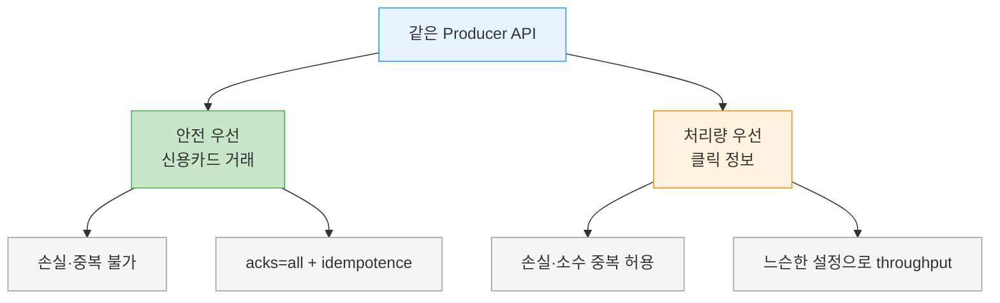
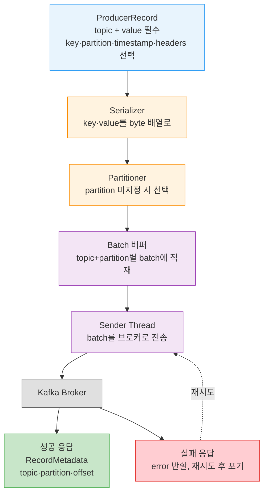

# Producer 아키텍처

---

> Kafka를 큐로 쓰든 메시지 버스로 쓰든 저장 플랫폼으로 쓰든, 데이터를 넣는 쪽에는 항상 Producer가 있습니다. 그런데 `producer.send()` 한 줄 뒤에서는 직렬화·파티션 선택·배치·별도 전송 스레드가 순서대로 움직입니다. 이 글은 그 내부 경로(send-path)를 단계별로 풀어, 뒤따르는 설정(`acks`·`linger.ms`·idempotence 등)이 *어느 단계에 붙는 손잡이인지* 알 수 있는 지도를 먼저 만듭니다.

## 학습 목표

> Producer가 `send()` 한 줄 뒤에서 거치는 단계와, 그 단계에 설정이 어떻게 붙는지를 설명할 수 있는 것이 이 장의 목표입니다.

이 장을 다 읽고 다음 다섯 가지에 자신 있게 답할 수 있으면 학습이 완료됩니다.

1. `ProducerRecord`의 필수 필드와 선택 필드를 구분하고 각각의 의미를 설명할 수 있습니다.
2. `send()` 호출 이후 메시지가 브로커에 도달하기까지의 단계를 순서대로 나열할 수 있습니다.
3. 직렬화·파티셔너·배치·전송 스레드가 각각 어떤 책임을 지는지 설명할 수 있습니다.
4. 브로커 응답이 성공일 때 돌아오는 `RecordMetadata`가 무엇을 담는지 말할 수 있습니다.
5. 유스케이스의 요구사항(손실 허용·중복 허용·지연·처리량)이 Producer 설정 선택을 어떻게 좌우하는지 판단할 수 있습니다.

## 1. 요구사항이 Producer를 결정합니다

> 같은 Producer API라도 손실·중복·지연·처리량 요구가 설정 선택의 방향을 정합니다. 신용카드와 클릭 로그가 정반대인 이유가 여기에 있습니다.

메시지를 Kafka에 써야 하는 이유는 다양합니다. 사용자 활동 기록, 메트릭 수집, 로그 적재, 스마트 기기 정보 수집, 애플리케이션 간 비동기 통신, DB 적재 전 버퍼링 같은 용도가 모두 같은 Producer API 위에 올라갑니다.

용도가 다양하면 요구사항도 갈립니다. 메시지 하나하나가 critical한지 아니면 손실을 견딜 수 있는지, 중복이 우연히 생겨도 되는지, 엄격한 지연·처리량 제약이 있는지가 용도마다 다릅니다. 이 답이 곧 설정 선택의 출발점입니다.

두 극단을 비교하면 감이 잡힙니다. 다음 표는 같은 Producer API를 쓰면서도 요구사항이 정반대인 두 유스케이스입니다.

| 유스케이스 | 손실·중복 | 지연 요구 | 처리량 요구 |
|------------|-----------|-----------|-------------|
| 신용카드 거래 처리 | 단 한 건도 손실·중복 불가 | 낮아야 하나 500ms까지 허용 | 초당 백만 건 목표 |
| 웹사이트 클릭 정보 | 약간의 손실·소수 중복 허용 | 사용자 경험에 지장 없으면 높아도 됨 | 사이트 활동량에 비례 |

신용카드 쪽은 `acks=all`과 idempotence처럼 안전을 끌어올리는 설정으로 기울고, 클릭 정보 쪽은 처리량과 낮은 오버헤드를 위해 더 느슨한 설정을 고를 수 있습니다. 같은 API라도 *요구사항이 손잡이를 어느 방향으로 돌릴지* 정합니다.

같은 출발점에서 요구사항이 설정을 반대 방향으로 미는 모습을 그림으로 보면 다음과 같습니다.

## 2. send-path 한눈에 보기

> `send()` 한 번은 직렬화 → 파티셔너 → batch → 전송 스레드 → 브로커 응답이라는 다섯 단계를 거칩니다. 이 단계 경계가 곧 설정이 붙는 자리입니다.

Producer API 자체는 단순하지만, `send()` 한 번에 내부에서는 여러 단계가 순차로 일어납니다. 다음 그림은 메시지가 Producer를 통과해 브로커에 도달하기까지의 흐름입니다.

각 단계를 아래에서 하나씩 풀어 봅니다. 단계의 경계를 알아 두면, 뒤 장에서 다루는 설정이 어느 단계의 동작을 바꾸는지가 명확해집니다.

> 💬 **비유**: send-path는 공장의 컨베이어 라인과 닮았습니다. 원재료(객체)가 포장 단계(직렬화)를 거쳐, 행선지 분류대(파티셔너)에서 목적지별 상자(batch)에 담기고, 배송 트럭(전송 스레드)이 모인 상자를 한 번에 실어 나릅니다. 이 비유는 "단계가 순서대로 이어지고 트럭이 따로 움직인다"까지 유효하지만, batch가 가득 차지 않아도 트럭이 출발할 수 있다는 점(half-full 전송)에서는 깨집니다.

## 3. ProducerRecord — 무엇을 보내는가

> `ProducerRecord`는 토픽과 값만 필수이고 key·partition·timestamp·headers는 선택입니다. 목적지와 내용이 필수, 나머지는 동작 조정용이라는 기준으로 갈립니다.

전송의 시작은 `ProducerRecord` 객체를 만드는 일입니다. 이 객체에는 보낼 토픽과 값이 반드시 들어가야 합니다. 선택적으로 key, partition, timestamp, 그리고 헤더(headers) 모음을 함께 지정할 수 있습니다.

필수와 선택을 가르는 기준은 단순합니다. 토픽과 값이 없으면 "어디에 무엇을 쓸지"가 정해지지 않으므로 둘은 반드시 있어야 합니다. 나머지는 동작을 세밀하게 조정하는 추가 정보일 뿐입니다.

- topic, value: 필수. 목적지와 내용.
- key: 선택. 파티션 결정과 추가 정보 용도(상세는 [05-03.Producer 파티셔너](05-03.Producer%20파티셔너.md)).
- partition: 선택. 직접 지정하면 파티셔너 단계를 건너뜁니다.
- timestamp, headers: 선택. 메타데이터 성격의 부가 정보.

## 4. 직렬화 — 객체를 byte 배열로

> 직렬화는 send-path의 첫 단계입니다. broker가 byte 배열만 다루므로, 네트워크로 보내기 전에 key·value를 반드시 byte 배열로 바꿉니다.

`send()`가 호출되면 Producer가 가장 먼저 하는 일은 key와 value 객체를 byte 배열로 직렬화하는 것입니다. 브로커는 key와 value를 byte 배열로만 다루기 때문에, 네트워크로 보내기 전에 반드시 이 변환이 필요합니다.

직렬화를 담당하는 클래스가 Serializer이고, Producer 생성 시 `key.serializer`·`value.serializer`로 지정합니다. 직렬화기와 사용자 정의 직렬화, Avro 직렬화는 별도 주제이므로 [05-02.Producer 생성과 전송 모드](05-02.Producer%20생성과%20전송%20모드.md)와 [01-03.Avro](../02_MessageContract/01-03.Avro.md)에서 자세히 다룹니다. 여기서는 *직렬화가 send-path의 첫 단계*라는 위치만 기억하면 됩니다.

## 5. 파티셔너 — 어느 파티션으로 갈지

> partition을 직접 지정하지 않으면 파티셔너가 key를 근거로 파티션을 고릅니다. 파티션이 정해져야 같은 토픽·파티션 batch에 레코드를 모을 수 있습니다.

파티션을 명시적으로 지정하지 않았다면, 직렬화된 데이터는 파티셔너로 넘어갑니다. 파티셔너는 대개 `ProducerRecord`의 key를 근거로 파티션을 고릅니다.

파티션이 정해지면 Producer는 이 레코드가 갈 토픽과 파티션을 알게 됩니다. 그러면 같은 토픽·파티션으로 갈 다른 레코드들과 함께 하나의 batch에 이 레코드를 추가합니다. 파티셔너의 구체적 동작(기본 해시·sticky·사용자 정의)은 [05-03.Producer 파티셔너](05-03.Producer%20파티셔너.md)에서 다룹니다.

## 6. 배치와 전송 스레드 — 모아서 보내기

> `send()`를 호출한 스레드와 실제 전송 스레드가 분리돼 있어 Producer는 기술적으로 항상 비동기입니다. `linger.ms`·`batch.size`가 이 단계에 붙습니다.

같은 토픽·파티션으로 가는 레코드들은 batch에 쌓입니다. 그리고 이 batch들을 적절한 브로커로 실제로 보내는 일은 *별도의 스레드*가 맡습니다.

이 구조가 중요한 이유는 `send()`를 호출한 스레드와 전송을 수행하는 스레드가 분리돼 있다는 점입니다. 메시지는 일단 버퍼에 놓이고, 전송 스레드가 비동기로 브로커에 보냅니다. 그래서 Kafka Producer는 기술적으로 항상 비동기입니다. 모아서 보내는 정도를 조절하는 `linger.ms`·`batch.size` 같은 설정이 바로 이 단계에 붙습니다(상세는 [04-01.message-lib config 5개 클래스 종합](04-01.message-lib%20config%205개%20클래스%20종합.md)).

## 7. 브로커 응답 — 성공과 실패

> 성공이면 토픽·파티션·오프셋을 담은 `RecordMetadata`가, 실패면 error가 돌아옵니다. Producer는 곧장 포기하지 않고 몇 차례 재시도한 뒤에야 error를 반환합니다.

브로커가 메시지를 받으면 응답을 돌려보냅니다. 응답은 두 갈래입니다.

성공이라면 `RecordMetadata` 객체가 돌아옵니다. 여기에는 레코드가 쓰인 토픽, 파티션, 그리고 그 파티션 안에서의 오프셋(offset)이 담깁니다. 즉 "어디에 몇 번째로 쓰였는지"를 알 수 있습니다.

실패라면 error가 돌아옵니다. Producer가 error를 받으면 곧장 포기하지 않고, 몇 차례 재전송을 시도한 뒤에야 최종적으로 error를 반환합니다. 재시도로 풀리는 오류와 풀리지 않는 오류의 구분, 그리고 오류를 코드에서 어떻게 받을지는 [05-02.Producer 생성과 전송 모드](05-02.Producer%20생성과%20전송%20모드.md)에서 이어집니다.

## 8. 내장 클라이언트와 wire protocol

> 이 문서가 다루는 Java Producer는 내장 클라이언트입니다. 바이너리 wire protocol로 다른 언어 클라이언트도 가능하지만, 그것은 이 문서의 범위 밖입니다.

Kafka에는 개발자가 바로 쓸 수 있는 내장 클라이언트 API가 함께 제공됩니다. 이 문서가 다루는 Java Producer가 그중 하나입니다.

내장 클라이언트 외에도 Kafka에는 바이너리 wire protocol이 있습니다. 올바른 byte 시퀀스를 Kafka 네트워크 포트로 보내기만 하면, 애플리케이션은 어떤 언어로든 메시지를 읽고 쓸 수 있습니다. C++·Python·Go 등 여러 언어의 클라이언트가 이 프로토콜을 구현합니다. 다만 이들은 Apache Kafka 프로젝트의 일부가 아니며, wire protocol과 외부 클라이언트는 이 문서의 범위 밖입니다.

## 9. 실무 적용

> send-path 단계를 알면, 메시지가 어디서 막히는지를 단계별로 좁혀 진단할 수 있습니다. (이 절은 원문 §3.0 범위를 넘는 운영 관점 보조 설명입니다.)

send-path의 가치는 장애를 진단할 때 드러납니다. "메시지가 안 들어간다"는 증상 하나도, 단계를 알면 후보를 좁힐 수 있기 때문입니다. 직렬화 단계에서 막히면 `SerializationException`이 즉시 나고, batch 버퍼 단계에서 막히면 `send()`가 블로킹되며, 전송 스레드와 broker 사이에서 막히면 timeout 뒤 재시도가 돕니다. 같은 "실패"라도 어느 단계인지에 따라 봐야 할 설정이 다릅니다.

각 단계에 붙는 설정을 한눈에 정리하면 다음과 같습니다. 이 표는 뒤따르는 문서들이 다루는 설정이 send-path의 어디를 조절하는지에 대한 지도 역할을 합니다.

| send-path 단계 | 붙는 설정 | 조절 대상 |
|----------------|-----------|-----------|
| 직렬화 | `key.serializer`·`value.serializer` | 객체를 byte 배열로 바꾸는 방식 |
| 파티셔너 | `partitioner.class` | 레코드가 갈 파티션 선택 |
| batch·전송 스레드 | `linger.ms`·`batch.size`·`buffer.memory` | 모아 보내는 정도와 버퍼 한도 |
| broker 응답 | `acks`·`retries`·`delivery.timeout.ms` | 성공 기준과 재시도 |

## 10. 면접 대비 Q&A

> 답을 보지 않고 먼저 입으로 답해 본 뒤 비교해 보면 좋습니다.

### Q1. `ProducerRecord`에서 필수 필드와 선택 필드는 무엇인가요?

토픽과 값이 필수입니다. 목적지와 내용이 없으면 무엇을 어디에 쓸지가 정해지지 않기 때문입니다. key, partition, timestamp, headers는 선택입니다. 이들은 파티션 결정이나 메타데이터처럼 동작을 세밀하게 조정하는 추가 정보일 뿐, 없어도 전송 자체는 성립합니다.

### Q2. `send()` 호출 이후 브로커 도달까지의 단계를 순서대로 말해 보세요.

직렬화 → 파티셔너 → batch 적재 → 전송 스레드 → 브로커 응답 순서입니다. key·value를 byte 배열로 직렬화하고, 파티션이 미지정이면 파티셔너가 파티션을 고르며, 같은 토픽·파티션 레코드를 batch에 모으고, 별도 스레드가 batch를 브로커로 보낸 뒤, 브로커가 성공 또는 실패로 응답합니다.

### Q3. Producer가 "기술적으로 항상 비동기"라는 말은 무슨 뜻인가요?

`send()`를 호출한 스레드와 실제 전송을 수행하는 스레드가 분리돼 있다는 뜻입니다. 메시지는 일단 버퍼에 놓이고, 별도의 전송 스레드가 batch 단위로 브로커에 보냅니다. 동기 전송처럼 보이는 코드도 내부적으로는 이 비동기 경로 위에서 결과를 기다릴 뿐입니다.

### Q4. 성공 응답으로 돌아오는 `RecordMetadata`에는 무엇이 담기나요?

레코드가 쓰인 토픽, 파티션, 그리고 그 파티션 안에서의 오프셋이 담깁니다. "어디에 몇 번째로 쓰였는지"를 이 객체로 확인할 수 있습니다. 실패한 경우에는 대신 error가 돌아오고, Producer는 몇 차례 재시도 후에야 최종 error를 반환합니다.

### Q5. 유스케이스 요구사항이 Producer 설정을 어떻게 좌우하나요?

손실·중복 허용 여부, 지연·처리량 요구가 설정 방향을 정합니다. 신용카드 거래처럼 손실·중복이 불가하면 `acks=all`과 idempotence로 안전을 끌어올리고, 클릭 정보처럼 약간의 손실을 견딜 수 있으면 처리량과 낮은 오버헤드 쪽으로 기웁니다. 같은 API라도 요구사항이 손잡이를 돌리는 방향을 결정합니다.

## 11. 관련 문서

- [05-02.Producer 생성과 전송 모드](05-02.Producer%20생성과%20전송%20모드.md) — 필수 설정과 fire-and-forget·동기·비동기 전송
- [04-01.message-lib config 5개 클래스 종합](04-01.message-lib%20config%205개%20클래스%20종합.md) — send-path 각 단계에 붙는 설정의 종합
- [01-01.메시지 큐 아키텍처](01-01.메시지%20큐%20아키텍처.md) — 브로커 측 파티션·복제·acks 구조
