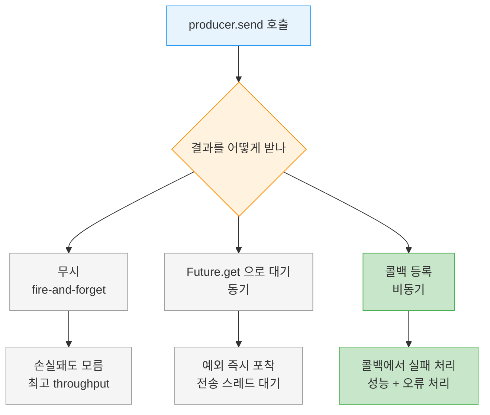
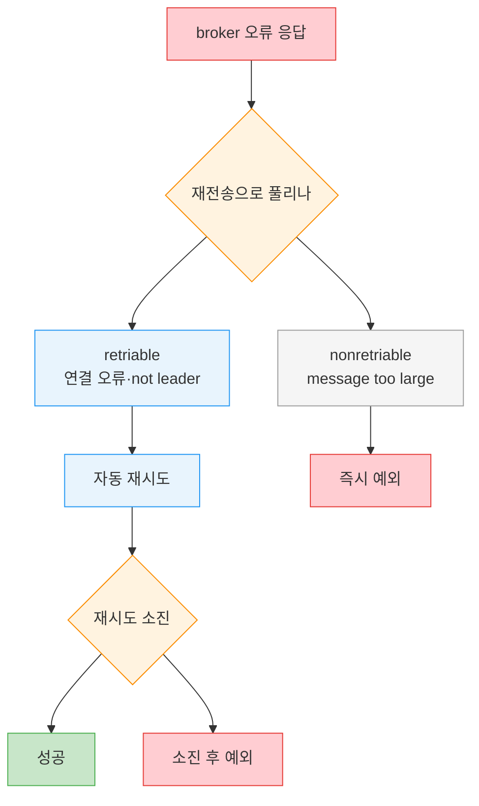

# Producer 생성과 전송 모드

---

> [05-01.Producer 아키텍처](05-01.Producer%20아키텍처.md)에서 send-path의 단계를 봤다면, 이번에는 그 입구를 다룹니다. Producer를 만들 때 반드시 채워야 하는 세 가지 설정이 무엇인지, 그리고 `send()`를 어떤 방식으로 호출하느냐에 따라 손실·성능·오류 처리가 어떻게 갈리는지 정리합니다. 같은 `send()`라도 결과를 버리느냐, 기다리느냐, 콜백으로 받느냐가 프로덕션의 안정성을 가릅니다.

## 학습 목표

> Producer 생성의 세 필수 설정과 세 전송 모드를 구분하고, 같은 `send()`가 손실·성능·오류 처리에서 어떻게 갈리는지 설명할 수 있는 것이 이 장의 목표입니다.

이 장을 다 읽고 다음 다섯 가지에 자신 있게 답할 수 있으면 학습이 완료됩니다.

1. Producer 생성 시 반드시 지정해야 하는 세 가지 설정을 나열하고 각각의 역할을 설명할 수 있습니다.
2. value만 보낼 때도 `key.serializer`가 필요한 이유와 그 우회 방법을 말할 수 있습니다.
3. 세 가지 전송 모드(fire-and-forget·동기·비동기)의 trade-off를 비교할 수 있습니다.
4. retriable 오류와 nonretriable 오류를 구분하고 각각의 예를 들 수 있습니다.
5. 콜백이 어느 스레드에서 실행되는지, 그로 인해 지켜야 할 제약이 무엇인지 설명할 수 있습니다.

## 1. Producer를 만드는 세 가지 필수 설정

> `bootstrap.servers`·`key.serializer`·`value.serializer` 셋은 없으면 Producer를 만들 수 없습니다. broker가 byte 배열만 다루기에 직렬화기가 필수입니다.

Kafka로 메시지를 쓰는 첫 단계는 Producer 객체를 만드는 일이고, 여기에는 반드시 채워야 하는 설정이 셋 있습니다. 나머지 동작은 대부분 추가 설정으로 제어하지만, 이 셋이 없으면 Producer를 생성할 수 없습니다.

| 설정 | 역할 | 비고 |
|------|------|------|
| `bootstrap.servers` | 클러스터 초기 연결용 broker host:port 목록 | 전체 broker 불필요(연결 후 더 알아냄). 최소 2개 권장 |
| `key.serializer` | key 객체를 byte 배열로 직렬화할 클래스명 | value만 보내도 필수 |
| `value.serializer` | value 객체를 byte 배열로 직렬화할 클래스명 | - |

`bootstrap.servers`에 모든 broker를 적을 필요는 없습니다. Producer가 초기 연결 후 클러스터에서 나머지 정보를 받아 오기 때문입니다. 다만 최소 두 개는 적기를 권합니다. 한 broker가 내려가도 다른 쪽으로 연결할 수 있어야 하니까요.

직렬화기를 지정하는 이유는 [05-01](05-01.Producer%20아키텍처.md)에서 본 대로 broker가 key와 value를 byte 배열로만 다루기 때문입니다. Producer 인터페이스는 파라미터화 타입으로 어떤 Java 객체든 받을 수 있어 코드 가독성이 좋지만, 그만큼 객체를 byte 배열로 바꾸는 방법을 Producer가 알아야 합니다. 그 방법을 알려 주는 것이 `key.serializer`·`value.serializer`이고, 둘은 `org.apache.kafka.common.serialization.Serializer` 인터페이스를 구현한 클래스명을 받습니다. Kafka 클라이언트 패키지에는 `ByteArraySerializer`·`StringSerializer`·`IntegerSerializer` 등이 들어 있어, 흔한 타입이면 직접 만들 필요가 없습니다.

### 1.1 value만 보내도 key.serializer가 필요합니다

값만 보내고 key를 쓰지 않더라도 `key.serializer`는 반드시 설정해야 합니다. 이 제약을 깔끔하게 피하려면 key 타입에 `Void`를 쓰고 `VoidSerializer`를 지정하면 됩니다. "key를 안 쓰니 직렬화기도 생략"이 통하지 않는다는 점만 기억하면 됩니다.

## 2. 전송 모드 세 가지

> fire-and-forget·동기·비동기 셋 중 무엇을 고르느냐가 손실 가능성·성능·오류 처리를 가릅니다. 프로덕션은 보통 비동기 콜백을 씁니다.

Producer를 만들었다면 메시지를 보낼 차례입니다. 보내는 방식은 크게 세 가지로 나뉘고, 무엇을 선택하느냐에 따라 손실 가능성·성능·오류 처리가 달라집니다.

다음 표는 세 모드를 한눈에 비교한 것입니다.

| 모드 | 결과 확인 | 성능 | 오류 처리 |
|------|-----------|------|-----------|
| fire-and-forget | 안 함 | 가장 빠름 | 손실돼도 앱이 모름 |
| 동기(synchronous) | `Future.get()`로 대기 | 가장 느림 | 예외로 즉시 포착 |
| 비동기(asynchronous) | 콜백으로 수신 | 빠름 | 콜백에서 처리 |

세 모드가 `send()` 이후 어떻게 갈라지는지 흐름으로 보면 다음과 같습니다.

### 2.1 Fire-and-forget

메시지를 서버로 보내고 도착 여부를 신경 쓰지 않는 방식입니다. Kafka는 가용성이 높고 Producer가 자동으로 재전송하므로 대개는 성공합니다. 하지만 nonretriable 오류나 timeout이 나면 메시지는 손실되고, 애플리케이션은 그 사실에 대한 어떤 정보도 예외도 받지 못합니다. 메시지를 조용히 버려도 되는 경우에만 쓸 수 있고, 프로덕션에서는 보통 그렇지 않습니다.

`send()`가 호출 전 단계에서 던지는 예외는 fire-and-forget에서도 받을 수 있습니다. 직렬화에 실패한 `SerializationException`, 버퍼가 가득 찼을 때의 `BufferExhaustedException`이나 `TimeoutException`, 전송 스레드가 인터럽트된 `InterruptException` 같은 경우입니다. 즉 "전송 결과"는 못 받아도 "전송 시도 이전의 실패"는 잡을 수 있습니다.

### 2.2 동기 전송

`send()`의 반환값인 `Future` 객체에 `get()`을 호출해, 응답을 기다린 뒤 다음 레코드로 넘어가는 방식입니다. 성공하면 `RecordMetadata`를 얻어 오프셋 등을 확인할 수 있고, 실패하면 예외가 던져집니다. Kafka가 produce 요청에 오류로 응답하거나 재전송이 모두 소진됐을 때 그 예외를 코드에서 포착할 수 있다는 점이 장점입니다.

대가는 성능입니다. 클러스터가 얼마나 바쁜지에 따라 broker는 produce 요청에 2ms에서 수 초까지 응답할 수 있는데, 동기 전송은 그동안 전송 스레드가 다른 일을 못 하고 기다리기만 합니다. 추가 메시지를 보내지도 못합니다. 그래서 동기 전송은 성능이 나빠 프로덕션에서는 거의 쓰지 않고, 코드 예제에서 자주 보일 뿐입니다.

### 2.3 비동기 전송

`send()`에 콜백을 함께 넘기는 방식입니다. broker로부터 응답을 받으면 콜백이 트리거됩니다. 왕복 시간이 10ms라면 매 메시지마다 응답을 기다리는 동기 방식은 100개를 보내는 데 약 1초가 걸리지만, 응답을 기다리지 않으면 거의 시간이 들지 않습니다.

대부분의 경우 응답 자체는 필요하지 않습니다. Kafka가 돌려주는 토픽·파티션·오프셋을 보내는 쪽이 쓸 일이 드물기 때문입니다. 그러나 전송에 *완전히 실패한 시점*은 알아야 예외를 던지거나 로그를 남기거나 오류 파일에 기록할 수 있습니다. 콜백은 바로 이 "실패를 비동기로 받아 처리"하기 위한 장치입니다.

콜백 클래스는 `org.apache.kafka.clients.producer.Callback` 인터페이스를 구현하고, 단일 메서드 `onCompletion(RecordMetadata, Exception)`을 가집니다. 두 번째 인자인 예외가 `null`이 아니면 오류가 발생한 것입니다.

## 3. 오류는 두 종류입니다

> retriable은 재전송으로 풀려 Producer가 자동 처리하고, nonretriable은 즉시 예외가 됩니다. 그래서 앱 코드는 nonretriable과 재시도 소진 케이스에 집중합니다.

`KafkaProducer`가 마주치는 오류는 재시도로 풀리는 것과 풀리지 않는 것으로 나뉩니다. 이 구분이 중요한 이유는, 재시도 가능한 오류는 Producer가 알아서 처리하므로 애플리케이션 로직에서 따로 다룰 필요가 없기 때문입니다.

| 종류 | 의미 | 예 | Producer 동작 |
|------|------|-----|----------------|
| retriable | 재전송으로 해결 가능 | 연결 오류, "not leader for partition" | 자동 재시도, 소진 후에만 예외 |
| nonretriable | 재전송해도 동일 | "Message size too large" | 재시도 없이 즉시 예외 |

retriable 오류는 시간이 지나면 상황이 달라질 수 있는 경우입니다. 연결 오류는 연결이 다시 맺어지면 풀리고, "not leader for partition"은 새 리더가 선출되고 클라이언트 메타데이터가 갱신되면 풀립니다. `KafkaProducer`는 이런 오류를 자동 재시도하도록 설정할 수 있어서, 애플리케이션은 재시도 횟수가 모두 소진되고도 풀리지 않았을 때에야 예외를 받습니다.

반면 "Message size too large" 같은 오류는 같은 메시지를 다시 보내도 결과가 같으므로 재시도하지 않고 즉시 예외를 반환합니다. 따라서 코드에서 신경 쓸 부분은 retriable 재시도가 아니라, nonretriable 오류와 재시도가 소진된 경우의 처리입니다.

오류가 발생했을 때 Producer가 분기하는 경로를 그림으로 정리하면 다음과 같습니다.

## 4. 콜백은 Producer 메인 스레드에서 실행됩니다

> 콜백이 메인 스레드에서 돌기에 같은 파티션 메시지의 콜백 순서는 보장되지만, 그만큼 콜백 안에서 블로킹하면 다른 전송이 막힙니다.

비동기 전송의 콜백을 다룰 때 반드시 알아야 할 제약이 있습니다. 콜백은 Producer의 메인 스레드에서 실행됩니다.

이 사실은 두 가지를 함의합니다. 같은 파티션으로 두 메시지를 잇따라 보내면 두 콜백도 보낸 순서대로 실행되므로 순서가 보장됩니다. 동시에, 콜백이 느리면 Producer가 지연되어 다른 메시지 전송을 막습니다.

그래서 콜백 안에서 블로킹 작업을 하면 안 됩니다. 블로킹이 필요하다면 별도의 스레드를 만들어 그쪽에서 동시에 처리해야 합니다. 콜백 자체는 가볍고 빠르게 끝나야 합니다.

> 💬 **비유**: 콜백은 식당 카운터의 한 명뿐인 직원과 같습니다. 손님(메시지)이 온 순서대로 응대하므로 순서는 지켜지지만, 한 손님 응대에 오래 끌면(블로킹) 뒤에 줄 선 손님 전부가 기다립니다. 그래서 시간이 걸리는 일은 다른 직원(별도 스레드)에게 넘겨야 합니다. 이 비유는 "한 줄 처리라 순서 보장 + 한 건이 막으면 전체 지연"까지 유효하고, 실제로는 콜백이 파티션별로 순서를 보장한다는 세부에서는 단순화된 것입니다.

## 5. 실무 적용

> 유스케이스의 손실 허용도와 성능 요구로 세 전송 모드 중 하나를 고릅니다. (이 절은 원문 §3.2의 모드 설명을 선택 기준으로 재구성한 보조 설명입니다.)

세 모드는 우열이 아니라 용도가 다릅니다. 선택 기준은 "이 메시지를 잃어도 되는가"와 "결과를 언제 알아야 하는가" 두 질문으로 좁혀집니다.

- 손실을 견딜 수 있고 최고 처리량이 필요하면 fire-and-forget을 씁니다. 메트릭·로그 수집처럼 한두 건 빠져도 무방한 경우입니다.
- 한 건 한 건의 성공을 확실히 확인해야 하면 동기 전송을 쓰지만, 성능 저하 때문에 보통은 배치 작업이나 예제로 한정합니다.
- 손실은 막되 처리량도 지켜야 하는 대부분의 프로덕션은 비동기 콜백을 씁니다.

> ⚠️ **주의**: 비동기 콜백을 쓰면서 순서가 중요한 경우, 재시도와 in-flight 요청 수 설정에 따라 순서가 뒤집힐 수 있습니다. 순서 보장이 필요하면 idempotent producer 설정을 함께 봐야 합니다(상세는 [04-01.message-lib config 5개 클래스 종합](04-01.message-lib%20config%205개%20클래스%20종합.md)).

## 6. 면접 대비 Q&A

> 답을 보지 않고 먼저 입으로 답해 본 뒤 비교해 보면 좋습니다.

### Q1. Producer 생성 시 반드시 지정해야 하는 세 가지는 무엇인가요?

`bootstrap.servers`, `key.serializer`, `value.serializer`입니다. `bootstrap.servers`는 클러스터 초기 연결용 broker 목록으로, 전체를 적을 필요는 없지만 한 broker 장애에 대비해 최소 두 개를 권합니다. 두 직렬화기는 key와 value를 byte 배열로 바꾸는 클래스명인데, broker가 byte 배열만 다루기 때문에 필요합니다.

### Q2. value만 보낼 건데 왜 `key.serializer`를 설정해야 하나요?

value만 보내더라도 `key.serializer`는 필수 설정이기 때문입니다. key를 쓰지 않는다고 직렬화기를 생략할 수는 없습니다. 이 제약을 깔끔하게 피하려면 key 타입에 `Void`를, 직렬화기에 `VoidSerializer`를 지정하면 됩니다.

### Q3. 세 가지 전송 모드의 trade-off를 비교해 보세요.

fire-and-forget은 가장 빠르지만 손실돼도 앱이 모릅니다. 동기 전송은 `Future.get()`으로 결과를 확실히 확인하고 예외를 포착할 수 있으나, 전송 스레드가 응답을 기다리며 놀기 때문에 성능이 나빠 프로덕션에서는 거의 쓰지 않습니다. 비동기 전송은 콜백으로 실패를 받아 처리하므로 성능과 오류 처리를 함께 얻어 가장 실용적입니다.

### Q4. retriable 오류와 nonretriable 오류의 차이는 무엇인가요?

retriable은 재전송으로 풀릴 수 있는 오류로, 연결 오류나 "not leader for partition"이 예입니다. Producer가 자동 재시도하고 소진 후에만 예외를 줍니다. nonretriable은 다시 보내도 결과가 같은 오류로, "Message size too large"가 예이며 재시도 없이 즉시 예외를 반환합니다. 그래서 코드에서는 nonretriable과 재시도 소진 케이스에 집중합니다.

### Q5. 콜백 안에서 블로킹 작업을 하면 안 되는 이유는 무엇인가요?

콜백이 Producer 메인 스레드에서 실행되기 때문입니다. 콜백이 느리면 그 스레드가 묶여 다른 메시지 전송이 지연됩니다. 같은 스레드 실행 덕분에 같은 파티션 메시지의 콜백 순서는 보장되지만, 그만큼 콜백은 빠르게 끝나야 합니다. 블로킹이 필요하면 별도 스레드에서 처리해야 합니다.

## 7. 관련 문서

- [05-01.Producer 아키텍처](05-01.Producer%20아키텍처.md) — send-path 파이프라인과 직렬화·파티셔너 단계
- [03-01.Kafka 공통 정책 스타터 패턴](03-01.Kafka%20공통%20정책%20스타터%20패턴.md) — 재시도·오류 정책을 starter로 강제하기
- [05-01.Spring Kafka DLT와 Producer Config](../05_ConsistencyPattern/05-01.Spring%20Kafka%20DLT와%20Producer%20Config.md) — 전송 실패 후 DLT 경로와 Producer 설정
