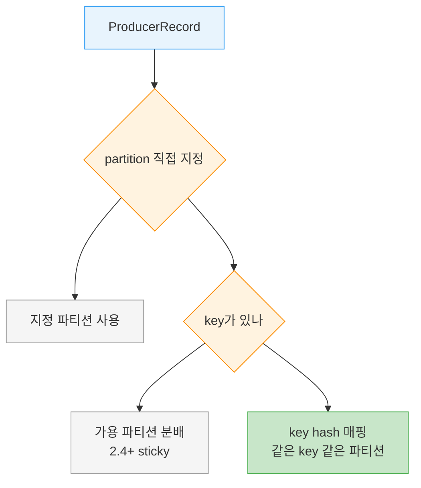
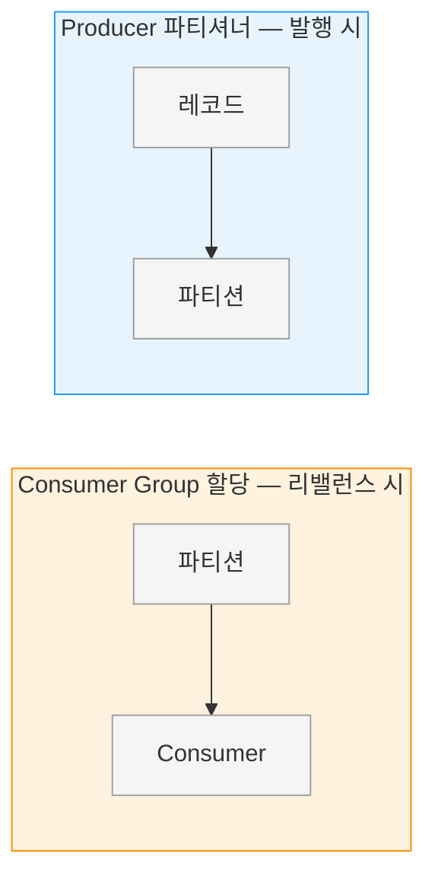

# Producer 파티셔너

---

> 같은 key를 가진 메시지가 항상 같은 파티션으로 가는 일은 우연이 아니라 파티셔너가 만드는 약속입니다. 이 글은 Producer가 레코드를 어느 파티션에 쓸지 정하는 규칙을 다룹니다. key가 있을 때와 없을 때의 기본 동작, Kafka 2.4에서 바뀐 sticky 전략, 그리고 특정 고객이 트래픽을 독점할 때 직접 파티셔너를 만드는 법까지 살펴봅니다. Consumer Group의 파티션 *할당*과는 이름이 겹쳐도 다른 이야기라는 점을 먼저 짚겠습니다.


## 학습 목표

> 같은 key가 같은 파티션으로 가는 규칙과 그 예외(파티션 추가, sticky, 사용자 정의)를 설명하고, Consumer Group 할당과 구분할 수 있는 것이 이 장의 목표입니다.

이 장을 다 읽고 다음 다섯 가지에 자신 있게 답할 수 있으면 학습이 완료됩니다.

1. key가 가진 두 가지 목적을 설명할 수 있습니다.
2. key가 없을 때와 있을 때 기본 파티셔너가 각각 어떻게 동작하는지 말할 수 있습니다.
3. Kafka 2.4에서 도입된 sticky 동작이 무엇을 개선하는지 설명할 수 있습니다.
4. 파티션을 나중에 추가하면 key→파티션 매핑이 왜 깨지는지 설명할 수 있습니다.
5. 사용자 정의 파티셔너가 필요한 상황과 구현 방법을 말할 수 있습니다.


## 1. key는 두 가지 일을 합니다

> key는 메시지와 함께 저장되는 추가 정보이자, 어느 파티션에 쓸지 정하는 근거입니다. 같은 key는 같은 파티션으로 간다는 약속이 핵심입니다.

Kafka 메시지는 key-value 쌍입니다. 토픽과 value만으로 `ProducerRecord`를 만들 수도 있는데, 이때 key는 기본값인 `null`이 됩니다. 그러나 대부분의 애플리케이션은 key를 함께 실어 보냅니다.

key가 맡는 일은 둘입니다. 하나는 메시지와 함께 저장되는 추가 정보 역할이고, 다른 하나는 이 메시지를 토픽의 어느 파티션에 쓸지 결정하는 근거 역할입니다. 핵심 약속은 *같은 key는 같은 파티션으로 간다*는 것입니다.

이 약속이 중요한 이유는 소비 측에 영향을 주기 때문입니다. 어떤 프로세스가 토픽의 일부 파티션만 읽고 있다면, 특정 key의 모든 레코드는 같은 파티션에 모이므로 같은 프로세스가 읽게 됩니다. key는 [Ch6의 compacted topic](01-01.메시지%20큐%20아키텍처.md)에서도 중요한 역할을 합니다.


## 2. 기본 파티셔너의 동작

> key가 없으면 가용 파티션에 분배(2.4+ sticky), key가 있으면 hash로 매핑합니다. hash는 Java 버전을 올려도 값이 변하지 않습니다.

key가 있느냐 없느냐에 따라 기본 파티셔너의 동작이 갈립니다. 다음 표가 두 경우를 정리합니다.

| 경우 | 파티션 선택 방식 | 특징 |
|------|------------------|------|
| key가 `null` | 가용 파티션 중 분배(Kafka 2.4+ sticky) | 균등 분배 목적 |
| key가 있음 | key hash 결과로 매핑 | 같은 key=같은 파티션 |

레코드 하나가 파티션을 정하는 갈림길을 그림으로 보면 다음과 같습니다.



### 2.1 key가 없을 때 — round-robin과 sticky

key가 `null`이고 기본 파티셔너를 쓰면, 레코드는 토픽의 가용 파티션 중 하나로 보내집니다. 파티션 사이 균형을 맞추기 위해 round-robin 방식이 쓰입니다.

Kafka 2.4 Producer부터는 이 round-robin이 sticky로 바뀌었습니다. 한 파티션으로 보낼 batch를 가득 채운 다음에야 다음 파티션으로 넘어간다는 뜻입니다. 덕분에 같은 수의 메시지를 더 적은 요청으로 보낼 수 있어, 지연이 낮아지고 broker의 CPU 사용도 줄어듭니다.

### 2.2 key가 있을 때 — hash 매핑

key가 있고 기본 파티셔너를 쓰면, Kafka는 key를 hash해서 그 결과로 파티션을 정합니다. 이 hash는 Kafka 자체 알고리즘이라 Java 버전을 올려도 hash 값이 달라지지 않습니다. 같은 key가 늘 같은 파티션으로 가야 하므로 안정성이 보장되어야 하기 때문입니다.

매핑을 계산할 때는 가용 파티션만이 아니라 토픽의 전체 파티션을 사용합니다. 그래서 데이터를 쓰려는 시점에 특정 파티션이 가용하지 않으면 오류가 날 수 있습니다. 다만 이런 경우는 드뭅니다(Kafka의 복제·가용성은 [01-01.메시지 큐 아키텍처](01-01.메시지%20큐%20아키텍처.md)에서 다룹니다).

> 💬 **비유**: key hash 파티셔닝은 우편번호로 배송 지점을 정하는 것과 같습니다. 같은 우편번호(key)는 늘 같은 지점(파티션)으로 가므로 한 동네 택배가 흩어지지 않습니다. 이 비유는 "같은 key가 같은 곳으로 모인다"까지 유효하지만, 지점 수(파티션 수)를 늘리면 우편번호-지점 대응이 바뀌어 옛 택배와 새 택배가 다른 지점으로 갈라지는 점(§4)에서 한계가 드러납니다.


## 3. 키가 있어도 분산하고 싶을 때

> key는 필요하지만 한 key가 워크로드를 독점할 때, `RoundRobinPartitioner`·`UniformStickyPartitioner`로 균등 분산할 수 있습니다. ETL이 대표 사례입니다.

기본 파티셔너 외에도 Kafka 클라이언트는 `RoundRobinPartitioner`와 `UniformStickyPartitioner`를 제공합니다. 이들은 메시지에 key가 있어도 각각 무작위 분배와 sticky 무작위 분배를 적용합니다.

key가 소비 애플리케이션에는 중요하지만 워크로드가 한쪽으로 쏠릴 때 이 파티셔너가 유용합니다. 예를 들어 ETL 애플리케이션이 Kafka 레코드의 key를 관계형 DB의 기본 키로 쓰는 경우, key 자체는 꼭 필요하지만 특정 key 하나가 비정상적으로 큰 워크로드를 가질 수 있습니다. `UniformStickyPartitioner`를 쓰면 모든 파티션에 워크로드가 고르게 분산됩니다.


## 4. 파티션을 나중에 추가하면 매핑이 깨집니다

> key→파티션 매핑은 파티션 수가 변하지 않는 동안만 일관됩니다. 새 파티션을 추가하면 같은 key의 새 레코드가 다른 파티션으로 갈 수 있습니다.

기본 파티셔너에서 key→파티션 매핑이 일관되게 유지되는 조건은 *토픽의 파티션 수가 변하지 않는* 동안뿐입니다. 파티션 수가 그대로라면, 예컨대 user 045189에 관한 레코드는 늘 파티션 34에 쓰인다고 믿을 수 있습니다. 이 일관성 덕분에 파티션을 읽을 때 여러 최적화가 가능합니다.

그러나 토픽에 새 파티션을 추가하는 순간 이 보장이 사라집니다. 기존 레코드는 파티션 34에 남아 있지만 새 레코드는 다른 파티션에 쓰일 수 있습니다. 그래서 key 기반 파티셔닝이 중요하다면, 가장 쉬운 해법은 충분한 수의 파티션으로 토픽을 만들어 두고 이후로 파티션을 절대 추가하지 않는 것입니다.


## 5. 사용자 정의 파티셔너

> 특정 key가 트래픽을 독점해 한 파티션만 비대해질 때, `Partitioner`를 구현해 그 key에 전용 파티션을 주고 나머지는 hash로 분산할 수 있습니다.

기본 파티셔너가 가장 흔히 쓰이지만, Kafka는 hash 파티셔닝만 강요하지 않습니다. 데이터를 다르게 나눠야 할 합당한 이유가 있을 때 직접 파티셔너를 만들 수 있습니다.

상황을 하나 들어 봅니다. B2B 업체인데 가장 큰 고객사 "Banana"와의 거래가 하루 트랜잭션의 10%를 넘는다고 해봅니다. 기본 hash 파티셔닝을 쓰면 Banana 레코드가 다른 계정들과 같은 파티션에 배정되어, 한 파티션만 다른 파티션보다 훨씬 커집니다. 서버가 공간이 부족해지거나 처리가 느려지는 문제가 생길 수 있습니다. 원하는 것은 Banana에게 전용 파티션을 주고, 나머지 계정은 hash 파티셔닝으로 다른 파티션들에 매핑하는 것입니다.

다음은 이를 구현한 사용자 정의 파티셔너의 예입니다.

```java
import org.apache.kafka.clients.producer.Partitioner;
import org.apache.kafka.common.Cluster;
import org.apache.kafka.common.PartitionInfo;
import org.apache.kafka.common.record.InvalidRecordException;
import org.apache.kafka.common.utils.Utils;

public class BananaPartitioner implements Partitioner {

    public void configure(Map<String, ?> configs) {}

    public int partition(String topic, Object key, byte[] keyBytes,
                         Object value, byte[] valueBytes,
                         Cluster cluster) {
        List<PartitionInfo> partitions = cluster.partitionsForTopic(topic);
        int numPartitions = partitions.size();

        if ((keyBytes == null) || (!(key instanceof String)))
            throw new InvalidRecordException("We expect all messages " +
                "to have customer name as key");

        if (((String) key).equals("Banana"))
            return numPartitions - 1; // Banana는 항상 마지막 파티션으로

        // 나머지 레코드는 나머지 파티션에 hash로 분산
        return Math.abs(Utils.murmur2(keyBytes)) % (numPartitions - 1);
    }

    public void close() {}
}
```

`Partitioner` 인터페이스는 `configure`·`partition`·`close` 세 메서드를 가집니다. 위 예는 `partition`만 구현했는데, 사실 고객 이름 같은 특수 값은 `partition`에 하드코딩하기보다 `configure`로 전달하는 편이 낫습니다. 또한 String key만 기대하므로, 그렇지 않으면 `InvalidRecordException`을 던집니다.


## 6. Consumer Group의 파티션 할당과는 다릅니다

> 파티셔너는 레코드를 파티션에 나누고, Consumer Group 할당은 파티션을 Consumer에 나눕니다. "Round Robin"·"Sticky" 이름이 겹쳐도 대상이 다릅니다.

이름이 겹쳐 혼동하기 쉬운 지점을 정리하겠습니다. Producer 파티셔너와 Consumer Group의 파티션 할당은 서로 다른 단계의 서로 다른 결정입니다.

| 구분 | Producer 파티셔너 | Consumer Group 할당(Assignor) |
|------|-------------------|-------------------------------|
| 결정 대상 | 레코드를 어느 파티션에 *쓸지* | 파티션을 어느 Consumer가 *읽을지* |
| 동작 시점 | 발행 시 | 리밸런스 시 |
| "Round Robin"의 의미 | 레코드를 파티션에 분배 | 파티션을 Consumer에 분배 |

"Round Robin"과 "Sticky"라는 이름이 양쪽에 모두 등장하지만, 한쪽은 *레코드→파티션*을, 다른 쪽은 *파티션→Consumer*를 나눕니다. 두 결정이 무엇을 무엇에 나누는지 그림으로 대비하면 다음과 같습니다.



Consumer 측 할당 전략은 [01-03.Consumer Group](01-03.Consumer%20Group.md)에서 다룹니다.


## 7. 실무 적용

> key 파티셔닝을 쓸 토픽은 파티션 수를 넉넉히 잡고 나중에 늘리지 않는 것이 핵심입니다. (이 절은 원문 §3.5의 결론을 운영 판단으로 재구성한 보조 설명입니다.)

파티셔너 선택은 토픽을 만들 때 이미 결정됩니다. key로 순서나 코로케이션을 보장해야 하면 기본 파티셔너를 쓰되, §4에서 본 대로 파티션을 나중에 추가하면 매핑이 깨지므로 처음부터 충분한 수로 만들어 둡니다. 반대로 key는 필요하지만 한 key가 트래픽을 독점하면 `UniformStickyPartitioner`로 분산을 우선합니다.

상황별 선택을 정리하면 다음과 같습니다.

| 상황 | 선택 | 이유 |
|------|------|------|
| key 순서·코로케이션이 중요 | 기본 파티셔너 | 같은 key 같은 파티션 보장 |
| key 필요하나 워크로드 쏠림 | `UniformStickyPartitioner` | 균등 분산 우선 |
| 특정 key가 트래픽 독점 | 사용자 정의 파티셔너 | 독점 key 격리 |

> ⚠️ **주의**: key 기반 파티셔닝을 쓰는 토픽에 파티션을 추가하면, 기존 key의 새 레코드가 다른 파티션으로 가 순서·코로케이션 가정이 깨집니다. 파티션 수는 토픽 생성 시점에 신중히 정합니다.


## 8. 면접 대비 Q&A

> 답을 보지 않고 먼저 입으로 답해 본 뒤 비교해 보면 좋습니다.

### Q1. key가 가진 두 가지 목적은 무엇인가요?

하나는 메시지와 함께 저장되는 추가 정보 역할이고, 다른 하나는 이 메시지를 어느 파티션에 쓸지 정하는 근거 역할입니다. 핵심 약속은 같은 key는 같은 파티션으로 간다는 것입니다. 이 약속 덕분에 특정 key의 모든 레코드를 같은 소비 프로세스가 읽을 수 있습니다.

### Q2. key가 없을 때 기본 파티셔너는 어떻게 동작하나요?

가용 파티션 중 하나로 round-robin 방식으로 분배합니다. Kafka 2.4 Producer부터는 이 round-robin이 sticky로 동작해, 한 파티션의 batch를 가득 채운 뒤에 다음 파티션으로 넘어갑니다. 그 결과 같은 수의 메시지를 더 적은 요청으로 보내 지연과 broker CPU가 줄어듭니다.

### Q3. key hash가 Java 버전에 영향받지 않는 이유는 무엇인가요?

Kafka가 자체 hash 알고리즘을 쓰기 때문입니다. 같은 key는 늘 같은 파티션으로 가야 한다는 약속을 지키려면 hash 값이 안정적이어야 하므로, Java를 업그레이드해도 값이 달라지지 않도록 설계돼 있습니다. 매핑 계산에는 가용 파티션이 아니라 전체 파티션을 사용합니다.

### Q4. 파티션을 추가하면 왜 매핑이 깨지나요?

기본 파티셔너의 key→파티션 매핑은 파티션 수가 변하지 않는 동안만 일관되기 때문입니다. 새 파티션을 추가하면 기존 레코드는 원래 파티션에 남지만 같은 key의 새 레코드는 다른 파티션에 쓰일 수 있습니다. 그래서 key 파티셔닝이 중요하면 충분한 파티션으로 만들어 두고 이후 추가하지 않는 편이 안전합니다.

### Q5. 사용자 정의 파티셔너는 언제 필요한가요?

특정 key가 트래픽을 독점해 한 파티션만 비대해질 때입니다. 예컨대 한 고객사 거래가 전체의 10%를 넘으면, 기본 hash로는 그 레코드가 다른 계정과 같은 파티션에 몰려 서버 공간 부족이나 처리 지연이 생길 수 있습니다. 이때 그 고객에게 전용 파티션을 주고 나머지는 hash로 분산하도록 `Partitioner`를 구현합니다.


## 9. 관련 문서

- [05-01.Producer 아키텍처](05-01.Producer%20아키텍처.md) — send-path에서 파티셔너의 위치
- [01-01.토픽 디자인](../03_TopicDesign/01-01.토픽%20디자인.md) — 파티션 수 결정과 토픽 설계
- [01-03.Consumer Group](01-03.Consumer%20Group.md) — 소비 측 파티션 할당 전략(Assignor)
