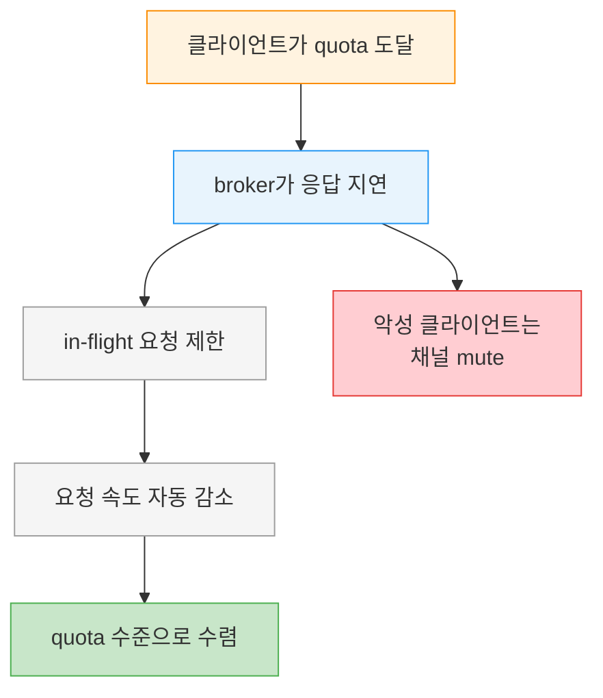
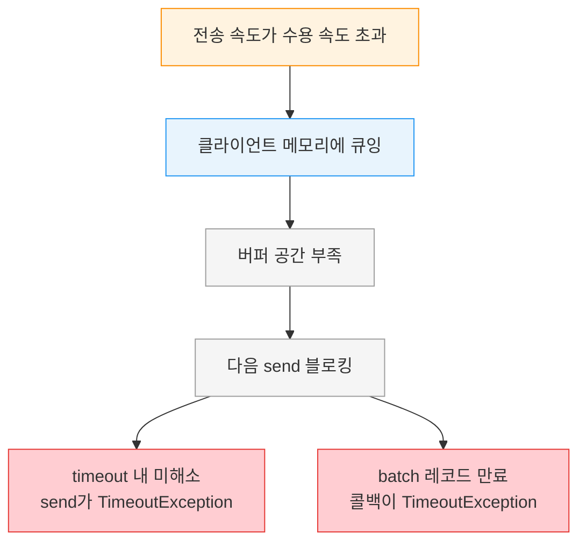

# Quota와 Throttling

---

> 한 클라이언트가 폭주하면 broker 전체가 느려지고, 그 피해는 점잖게 동작하던 다른 클라이언트에게까지 번집니다. Kafka는 이를 막기 위해 클라이언트별로 발행·소비 속도를 제한하는 quota 메커니즘을 둡니다. 이 글은 quota의 세 종류, 정적·동적 설정 방법, quota에 걸렸을 때 broker가 보이는 throttling 동작, 그리고 Producer 쪽에서 이 한계가 어떻게 `TimeoutException`으로 드러나는지를 정리합니다.


## 학습 목표

> quota의 세 종류와 적용 단위, 정적·동적 설정, throttling 동작, 그리고 그 한계가 Producer에서 `TimeoutException`으로 드러나는 경로를 설명할 수 있는 것이 이 장의 목표입니다.

이 장을 다 읽고 다음 다섯 가지에 자신 있게 답할 수 있으면 학습이 완료됩니다.

1. Kafka quota의 세 종류와 각각이 제한하는 대상을 설명할 수 있습니다.
2. quota를 어떤 단위(기본·client-id·user)로 적용할 수 있는지 말할 수 있습니다.
3. 정적 설정과 동적 설정의 차이와 동적 설정을 권하는 이유를 설명할 수 있습니다.
4. 클라이언트가 quota에 도달했을 때 broker가 보이는 throttling 동작을 설명할 수 있습니다.
5. 비동기 전송이 broker 수용 한계를 넘으면 어떤 경로로 예외가 발생하는지 설명할 수 있습니다.


## 1. quota는 세 종류입니다

> produce·consume는 초당 바이트로 전송·수신 속도를, request는 broker 처리 시간 비율을 제한합니다. 앞 둘은 처리량, 마지막은 처리 시간을 다룹니다.

Kafka broker는 메시지를 발행·소비하는 속도를 제한할 수 있고, 이 장치를 quota라고 부릅니다. quota에는 세 종류가 있습니다.

| 종류 | 제한 대상 | 단위 |
|------|-----------|------|
| produce | 클라이언트가 데이터를 보내는 속도 | bytes per second |
| consume | 클라이언트가 데이터를 받는 속도 | bytes per second |
| request | broker가 클라이언트 요청을 처리하는 시간 비율 | 시간 % |

produce와 consume quota는 초당 바이트 단위로 전송·수신 속도를 제한합니다. request quota는 broker가 클라이언트 요청을 처리하는 데 쓰는 시간의 비율을 제약 대상으로 삼습니다.


## 2. quota를 적용하는 단위

> 기본 quota·client-id·user 또는 그 조합으로 걸 수 있습니다. 단 user별 quota는 인증이 구성된 클러스터에서만 의미가 있습니다.

quota는 적용 범위를 골라 걸 수 있습니다. 모든 클라이언트에 적용되는 기본 quota를 설정하거나, 특정 client-id에, 특정 user에, 또는 둘 다에 걸어도 됩니다.

여기서 한 가지 전제를 짚어야 합니다. user별 quota는 보안이 구성되고 클라이언트가 인증하는 클러스터에서만 의미가 있습니다. 인증이 없으면 user라는 식별자가 성립하지 않기 때문입니다.


## 3. 정적 설정과 동적 설정

> 설정 파일 정적 quota는 바꾸려면 전 broker 재시작이 필요해 번거롭습니다. 그래서 특정 클라이언트에는 재시작이 필요 없는 동적 설정을 씁니다.

quota를 거는 방법은 두 갈래입니다. broker 설정 파일에 박는 정적 방식과, 명령으로 즉시 바꾸는 동적 방식입니다.

### 3.1 정적 설정 — broker 설정 파일

모든 클라이언트에 적용되는 기본 produce·consume quota는 broker 설정 파일의 일부입니다. 예를 들어 각 Producer를 평균 2MBps 이하로 제한하려면 다음을 broker 설정에 추가합니다.

```properties
quota.producer.default=2M
```

권장되지는 않지만, 기본 quota를 덮어쓰는 특정 클라이언트 quota도 설정 파일에 둘 수 있습니다. clientA는 4MBps, clientB는 10MBps를 허용하려면 다음과 같이 씁니다.

```properties
quota.producer.override="clientA:4M,clientB:10M"
```

설정 파일에 적힌 quota는 정적이어서, 바꾸려면 설정을 고친 뒤 모든 broker를 재시작해야 합니다. 새 클라이언트는 언제든 들어올 수 있는데, 그때마다 전체 broker를 재시작하기란 현실적으로 번거롭습니다. 그래서 특정 클라이언트에 quota를 거는 일반적인 방법은 동적 설정입니다.

### 3.2 동적 설정 — kafka-configs

동적 설정은 `kafka-configs.sh`나 AdminClient API로 거는 방식이고, 재시작이 필요 없습니다. 다음은 몇 가지 예입니다.

clientC를 client-id로 식별해 초당 1024바이트만 produce하도록 제한합니다.

```bash
bin/kafka-configs --bootstrap-server localhost:9092 --alter \
  --add-config 'producer_byte_rate=1024' \
  --entity-name clientC --entity-type clients
```

user1을 인증된 principal로 식별해 produce 1024바이트, consume 2048바이트로 묶어 둡니다.

```bash
bin/kafka-configs --bootstrap-server localhost:9092 --alter \
  --add-config 'producer_byte_rate=1024,consumer_byte_rate=2048' \
  --entity-name user1 --entity-type users
```

더 구체적인 override가 없는 모든 user의 consume를 초당 2048바이트로 제한합니다. 이것이 기본 quota를 동적으로 바꾸는 방법입니다.

```bash
bin/kafka-configs --bootstrap-server localhost:9092 --alter \
  --add-config 'consumer_byte_rate=2048' --entity-type users
```


## 4. throttling — quota에 걸리면 일어나는 일

> quota에 도달하면 broker가 응답을 지연시켜 클라이언트 속도를 자동으로 낮춥니다. 잘못 동작하는 클라이언트는 채널을 mute하기도 합니다.

클라이언트가 quota에 도달하면 broker는 그 클라이언트의 요청을 throttling하기 시작합니다. quota를 넘지 못하게 막기 위해 응답을 지연시키는 것입니다.

대부분의 클라이언트는 in-flight 요청 수가 제한돼 있어서, 응답이 지연되면 요청 속도가 자동으로 줄어듭니다. 그 결과 클라이언트 트래픽이 quota가 허용하는 수준으로 내려옵니다. broker는 한 걸음 더 나아가, throttling 중에도 추가 요청을 보내는 잘못 동작하는 클라이언트를 막기 위해 그 클라이언트와의 통신 채널을 quota 준수에 필요한 시간만큼 mute하기도 합니다.

quota 도달부터 트래픽이 내려오기까지의 동작을 그림으로 보면 다음과 같습니다.



throttling 동작은 메트릭으로 노출됩니다. `produce-throttle-time-avg`·`produce-throttle-time-max`·`fetch-throttle-time-avg`·`fetch-throttle-time-max`가 각각 produce·fetch 요청이 throttling으로 지연된 평균·최대 시간입니다. 이 시간은 produce·consume 처리량 quota, request time quota, 또는 둘 다에 의한 지연을 나타낼 수 있습니다.

> 💬 **비유**: throttling은 고속도로 진입 램프의 신호등(ramp metering)과 같습니다. 차(요청)가 몰리면 신호가 진입 간격을 늘려 본선(broker)이 막히지 않게 합니다. 운전자는 신호를 보고 자연스럽게 진입 속도를 줄입니다(in-flight 제한으로 자동 감속). 이 비유는 "지연을 줘서 유입을 줄인다"까지 유효하지만, 신호등은 진입 *전*에 막는 반면 Kafka는 요청을 받은 뒤 *응답*을 늦추는 방식이라는 점에서 깨집니다.


## 5. 비동기 전송과 quota — TimeoutException으로 드러납니다

> 받아들이는 속도보다 빠르게 계속 보내면 버퍼가 차고 `send()`가 블로킹되다 `TimeoutException`이 됩니다. broker 용량을 계획·모니터링해야 합니다.

quota는 Producer 쪽에서 조용히 끝나지 않습니다. 비동기 `Producer.send()`로 broker가 받아들이는 속도보다 빠르게 계속 보내면, 그 한계가 예외로 드러납니다.

흐름은 이렇습니다. 메시지는 먼저 클라이언트 메모리에 큐잉됩니다. 보내는 속도가 받아들이는 속도보다 계속 높으면 클라이언트는 결국 초과 메시지를 담을 버퍼 공간이 부족해지고, 다음 `Producer.send()` 호출이 블로킹됩니다. 이 블로킹이 timeout만큼 기다려도 broker가 따라잡아 버퍼를 비우지 못하면, `Producer.send()`가 `TimeoutException`을 던집니다. 또는 이미 batch에 들어간 일부 레코드가 `delivery.timeout.ms`보다 오래 기다려 만료되면서, `send()` 콜백이 `TimeoutException`으로 호출되기도 합니다.

이 단계적 흐름을 그림으로 정리하면 다음과 같습니다.



이 한계는 quota 때문일 수도 있고 단순한 용량 부족 때문일 수도 있습니다. 어느 쪽이든 결론은 같습니다. broker의 시간당 용량이 Producer가 보내는 속도를 감당하는지 계획하고 모니터링해야 합니다. 버퍼와 timeout 설정의 상세는 [05-02.Producer 생성과 전송 모드](05-02.Producer%20생성과%20전송%20모드.md)와 연결됩니다.


## 6. 실무 적용

> 여러 클라이언트가 한 클러스터를 공유할 때, 한 클라이언트의 폭주가 전체를 끌어내리지 않도록 quota를 겁니다. (이 절은 원문 §3.8의 메커니즘을 적용 시나리오로 재구성한 보조 설명입니다.)

quota는 멀티 테넌트 클러스터에서 가치가 큽니다. 한 팀의 배치 작업이 갑자기 대량 발행을 시작해도, produce quota가 걸려 있으면 다른 팀의 실시간 트래픽이 함께 느려지는 일을 막습니다. 설정은 정적 파일보다 동적(`kafka-configs.sh`)을 기본으로 하는데, 새 클라이언트가 들어올 때마다 broker를 재시작하지 않아도 되기 때문입니다.

운영에서 함께 봐야 할 신호는 throttle-time 메트릭입니다. `produce-throttle-time-avg`가 0보다 크게 지속되면 그 클라이언트가 quota에 걸려 지연되고 있다는 뜻이므로, quota 상향이 필요한지 아니면 그 클라이언트의 발행 패턴이 비정상인지 판단합니다.

> ⚠️ **주의**: quota를 너무 낮게 잡으면 정상 트래픽까지 throttling되어 `send()`가 블로킹되다 `TimeoutException`으로 이어질 수 있습니다(§5). quota 값은 실제 처리량을 측정한 뒤 여유를 두고 정합니다.


## 7. 면접 대비 Q&A

> 답을 보지 않고 먼저 입으로 답해 본 뒤 비교해 보면 좋습니다.

### Q1. Kafka quota의 세 종류는 무엇인가요?

produce, consume, request입니다. produce와 consume는 클라이언트가 데이터를 보내고 받는 속도를 초당 바이트로 제한합니다. request는 broker가 클라이언트 요청을 처리하는 데 쓰는 시간의 비율을 제한합니다. 앞의 둘이 처리량을, 마지막이 broker 처리 시간을 다룬다는 점이 다릅니다.

### Q2. quota는 어떤 단위로 걸 수 있나요?

모든 클라이언트에 적용되는 기본 quota, 특정 client-id, 특정 user, 또는 둘의 조합으로 걸 수 있습니다. 다만 user별 quota는 보안이 구성되고 클라이언트가 인증하는 클러스터에서만 의미가 있습니다. 인증이 없으면 user 식별자 자체가 성립하지 않기 때문입니다.

### Q3. 정적 설정 대신 동적 설정을 권하는 이유는 무엇인가요?

설정 파일의 quota는 정적이라 바꾸려면 모든 broker를 재시작해야 하기 때문입니다. 새 클라이언트는 언제든 들어올 수 있는데 그때마다 재시작하는 것은 번거롭습니다. 동적 설정은 `kafka-configs.sh`나 AdminClient API로 재시작 없이 quota를 걸 수 있어, 특정 클라이언트에 quota를 적용하는 일반적인 방법입니다.

### Q4. 클라이언트가 quota에 도달하면 broker는 어떻게 동작하나요?

요청에 대한 응답을 지연시키는 throttling을 시작합니다. in-flight 요청 수가 제한된 클라이언트는 응답 지연으로 요청 속도가 자동으로 줄어 quota 수준으로 내려옵니다. 잘못 동작하는 클라이언트가 throttling 중에도 요청을 계속 보내면, broker는 그 채널을 필요한 시간만큼 mute하기도 합니다.

### Q5. 비동기 전송이 broker 수용 한계를 넘으면 어떤 일이 일어나나요?

메시지가 먼저 클라이언트 메모리에 큐잉되고, 보내는 속도가 계속 높으면 버퍼 공간이 부족해져 다음 `send()`가 블로킹됩니다. timeout 안에 버퍼가 비워지지 않으면 `send()`가 `TimeoutException`을 던지거나, batch의 레코드가 `delivery.timeout.ms`를 넘겨 만료되며 콜백이 `TimeoutException`으로 호출됩니다. 그래서 broker 용량이 발행 속도를 감당하는지 계획·모니터링해야 합니다.


## 8. 관련 문서

- [05-02.Producer 생성과 전송 모드](05-02.Producer%20생성과%20전송%20모드.md) — 버퍼·timeout 설정과 send 블로킹 경로
- [03-01.Kafka 공통 정책 스타터 패턴](03-01.Kafka%20공통%20정책%20스타터%20패턴.md) — 운영 정책을 starter로 강제하기
- [02-01.Redpanda 아키텍처](02-01.Redpanda%20아키텍처.md) — broker 측 용량과 처리 구조
