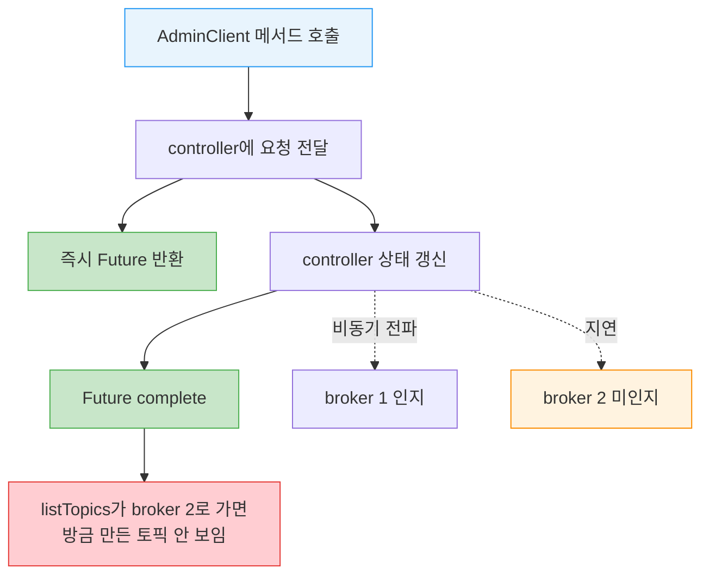
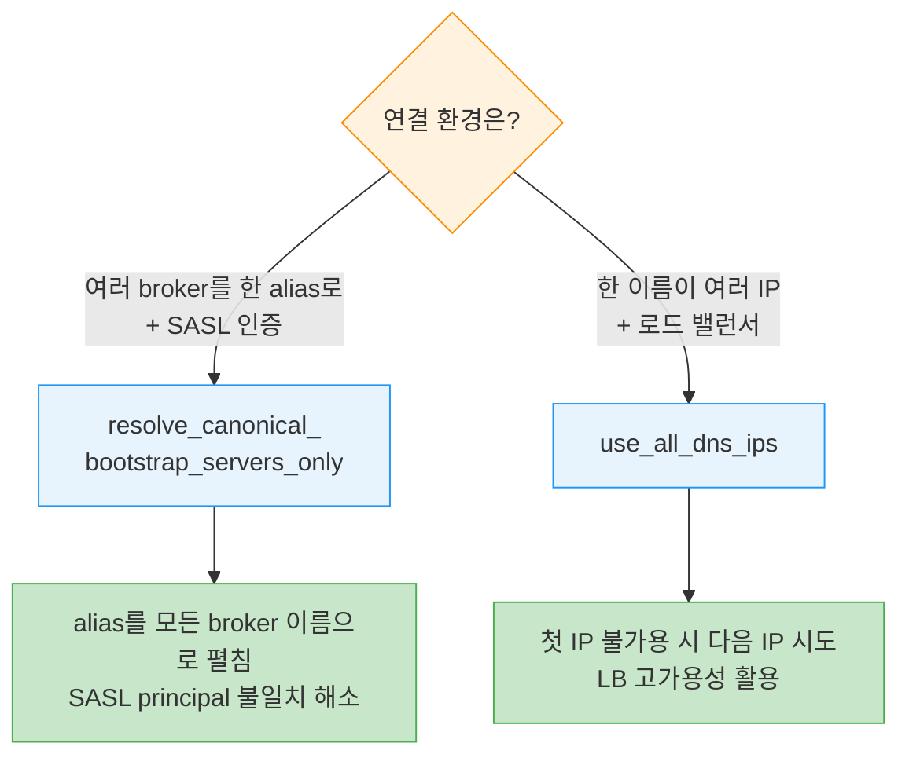

# AdminClient 기초와 토픽 관리


> [01-01.토픽 디자인](../03_TopicDesign/01-01.토픽%20디자인.md) §5가 Spring `KafkaAdmin` 빈으로 앱 기동 시 토픽을 *선언적으로* 만드는 길을 다뤘다면, 이 글은 같은 일을 *명령형으로* 하는 raw `AdminClient`를 다룹니다. CLI나 GUI 도구로도 관리할 수 있지만, 클라이언트 앱 안에서 토픽을 직접 만들고 검증하고 싶을 때가 있습니다. Apache Kafka는 0.11부터 이런 관리 기능을 코드로 부를 수 있는 AdminClient를 제공합니다. AdminClient를 이해하는 출발점은 "왜 비동기인가"이며, 이 설계 원칙을 알면 각 메서드가 한결 직관적으로 보입니다.


## 학습 목표

> AdminClient가 왜 비동기·결과적 일관성 API인지 설명하고, 생성·종료 생명주기와 토픽 list·describe·create·delete를 직접 다룰 수 있는 것이 이 장의 목표입니다.

이 장을 다 읽고 다음 다섯 가지에 자신 있게 답할 수 있으면 학습이 완료됩니다.

1. AdminClient가 비동기이고 결과적 일관성을 가진다는 말의 의미를 설명할 수 있습니다.
2. Future를 감싼 Result 객체와 `get()`이 무엇을 하는지 말할 수 있습니다.
3. `close(timeout)`의 timeout이 무엇을 보장하는지 설명할 수 있습니다.
4. client.dns.lookup의 두 값이 각각 어떤 문제를 푸는지 구분할 수 있습니다.
5. 토픽 존재를 확인하고 없으면 생성하는 흐름에서 ExecutionException을 어떻게 다루는지 말할 수 있습니다.


## 1. 왜 AdminClient인가

> 앱 안에서 관리 명령을 실행해야 할 때가 있습니다. 대표적으로 데이터에 따라 토픽을 즉석 생성하는 경우이며, AdminClient 이전의 대안은 모두 불편했습니다.

토픽을 관리하는 CLI·GUI 도구는 많습니다(9장에서 다룹니다). 그런데 클라이언트 애플리케이션 안에서 관리 명령을 실행하고 싶을 때가 있습니다. 사용자 입력이나 데이터에 따라 토픽을 on-demand로 만드는 것이 특히 흔한 경우입니다. IoT 앱은 사용자 디바이스에서 이벤트를 받아 디바이스 타입별 토픽에 기록하는데, 제조사가 새 디바이스 타입을 내놓으면 두 갈래가 생깁니다. 하나는 별도 프로세스로 토픽 생성을 잊지 않고 챙기는 것이고, 다른 하나는 앱이 미인식 디바이스 타입 이벤트를 받았을 때 새 토픽을 동적으로 만드는 것입니다. 후자는 단점이 있지만, 토픽 생성을 위한 별도 프로세스 의존을 없앤다는 점이 상황에 따라 매력적입니다.

Apache Kafka는 0.11에서 AdminClient를 추가해, 이전에는 명령줄로만 하던 관리 기능을 프로그래밍 API로 제공합니다. 토픽 list·create·delete, 클러스터 describe, ACL 관리, 설정 수정이 여기 들어갑니다.

구체적인 예를 봅니다. 앱이 특정 토픽에 이벤트를 발행하려면 첫 이벤트를 보내기 전에 토픽이 존재해야 합니다. AdminClient 이전에는 선택지가 모두 비친화적이었습니다. `producer.send()`에서 `UNKNOWN_TOPIC_OR_PARTITION` 예외를 잡아 사용자에게 토픽을 만들라고 알리거나, 클러스터가 자동 토픽 생성을 켜두기를 기대하거나, 호환성 보장이 없는 내부 API에 의존하는 것이 전부였습니다. AdminClient가 생긴 지금은 훨씬 나은 길이 있습니다. AdminClient로 토픽 존재를 확인하고 없으면 그 자리에서 만드는 것입니다.

> 💬 **비유**: AdminClient는 식당 주방의 셀프 주문 태블릿과 같습니다. 직원(CLI 도구)을 부르지 않고도 손님이 자리에서 메뉴를 추가·확인·취소할 수 있습니다. 이 비유는 "앱이 외부 도구 없이 스스로 관리 작업을 한다"까지 유효하지만, 태블릿 주문은 누르는 즉시 주방 화면에 뜨는 반면 AdminClient는 요청을 보내고 *나중에* 결과를 받는 비동기라는 점에서 단순화된 것입니다. 이 비동기성이 다음 절의 핵심입니다.


## 2. 비동기와 결과적 일관성 — AdminClient를 이해하는 열쇠

> AdminClient의 모든 메서드는 요청을 controller에 전달한 직후 즉시 반환하고 Future를 돌려줍니다. 메타데이터 전파가 비동기라, 방금 만든 토픽이 잠시 안 보일 수 있습니다.

AdminClient에서 가장 중요하게 이해할 점은 **비동기**라는 사실입니다. 각 메서드는 요청을 cluster controller에 전달한 직후 즉시 반환하며, 하나 이상의 Future 객체를 돌려줍니다. Future는 비동기 작업의 결과로, 상태 확인·취소·완료 대기·완료 후 함수 실행 메서드를 가집니다. AdminClient는 이 Future를 다시 Result 객체로 감쌉니다. Result는 완료를 기다리는 메서드와 흔한 후속 작업용 헬퍼를 제공합니다. 예를 들어 `KafkaAdminClient.createTopics`는 `CreateTopicsResult`를 반환해, 모든 토픽 생성을 기다리거나, 각 토픽 상태를 개별로 확인하거나, 생성 후 특정 토픽의 설정을 조회하게 해줍니다.

Kafka가 controller에서 broker로 메타데이터를 전파하는 과정이 비동기이기 때문에, AdminClient API가 반환하는 Future는 **controller 상태가 완전히 갱신되면** 완료로 간주됩니다. 그 시점에 모든 broker가 새 상태를 아는 것은 아닙니다. 그래서 `listTopics` 요청이 최신이 아닌 broker에서 처리되면, 방금 만든 토픽이 목록에 없을 수 있습니다. 이 성질을 **결과적 일관성(eventual consistency)** 이라 부릅니다. 결국 모든 broker가 모든 토픽을 알게 되지만, 정확히 언제인지는 보장할 수 없습니다.



여기에 더해 알아둘 설계 성질이 둘 더 있습니다. 하나는 **flat hierarchy** 입니다. Apache Kafka 프로토콜이 지원하는 모든 admin 작업이 `KafkaAdminClient`에 직접 구현되어 있고, 객체 계층이나 네임스페이스가 없습니다. 인터페이스가 커서 다소 압도적일 수 있다는 점은 논쟁적이지만, 장점은 분명합니다. 어떤 admin 작업의 방법을 알고 싶으면 JavaDoc 하나만 검색하면 되고 IDE 자동완성이 잘 듣습니다. "내가 엉뚱한 곳을 보는 건가" 고민할 필요가 없습니다. AdminClient에 없으면 아직 구현되지 않은 것입니다.

다른 하나는 **요청 종류에 따른 broker 라우팅** 입니다. 클러스터 상태를 *수정*하는 작업(create·delete·alter)은 controller가 처리합니다. 상태를 *읽는* 작업(list·describe)은 아무 broker나 처리할 수 있어, 클라이언트가 아는 한 가장 부하가 적은(least-loaded) broker로 전달됩니다. API 사용자에게 직접 영향을 주지는 않지만, 일부 작업은 성공하고 다른 작업은 실패하거나 어떤 작업이 너무 오래 걸리는 이유를 추적할 때 알아두면 좋습니다.

> ⚠️ **ZooKeeper 직접 사용 금지**: 이 장이 쓰인 시점(Apache Kafka 2.5 출시 직전)에는 대부분의 admin 작업을 AdminClient로도, ZooKeeper의 클러스터 메타데이터를 직접 수정해서도 할 수 있었습니다. 책은 ZooKeeper를 직접 쓰지 말 것을 강하게 권하며, 꼭 해야 한다면 Kafka에 버그로 신고하라고 합니다. 가까운 미래에 Kafka 커뮤니티가 ZooKeeper 의존을 제거할 예정이라, ZooKeeper를 직접 쓰는 앱은 수정이 필요해지기 때문입니다. 반면 AdminClient API는 내부 구현만 바뀌고 동일하게 유지됩니다.[^kraft]

[^kraft]: 원문은 2.5 출시 직전 시점의 서술입니다. 이후 Kafka는 KRaft(KIP-500) 모드로 ZooKeeper 의존을 실제로 걷어냈고, 본문의 예측("AdminClient API는 그대로 유지")은 그대로 들어맞았습니다. 본문 사실은 원문 시점을 따르고, 현황은 이 각주로만 보완합니다.


## 3. AdminClient 생명주기 — 생성·설정·종료

> AdminClient는 `create(props)`로 만들고 `close(timeout)`로 닫습니다. 필수 설정은 bootstrap 서버 하나뿐이라 Producer·Consumer보다 훨씬 단순합니다.

AdminClient를 쓰려면 먼저 인스턴스를 만들어야 합니다. 어렵지 않습니다.

```java
// AdminClient 생성과 종료
Properties props = new Properties();
props.put(AdminClientConfig.BOOTSTRAP_SERVERS_CONFIG, "localhost:9092");
AdminClient admin = AdminClient.create(props);
// TODO: AdminClient로 유용한 일을 한다
admin.close(Duration.ofSeconds(30));
```

static `create` 메서드는 설정이 담긴 Properties 객체를 받습니다. **유일한 필수 설정은 클러스터 URI**, 즉 연결할 broker의 콤마 구분 리스트입니다. 늘 그렇듯 프로덕션에서는 하나가 잠시 불가용할 경우를 대비해 broker를 최소 셋 지정하려 합니다. 보안·인증 연결은 11장에서 따로 다룹니다.

AdminClient를 시작했으면 언젠가 닫아야 합니다. `close`를 호출할 때 아직 진행 중인 작업이 있을 수 있다는 점이 중요합니다. 그래서 close는 timeout 파라미터를 받습니다. close를 부른 뒤에는 다른 메서드를 부르거나 요청을 더 보낼 수 없지만, 클라이언트는 timeout이 만료될 때까지 응답을 기다립니다. timeout이 지나면 진행 중인 작업을 모두 timeout 예외로 중단하고 리소스를 해제합니다. timeout 없이 close를 부르면 모든 작업이 끝날 때까지 무한정 기다린다는 뜻입니다.

3장과 4장에서 본 KafkaProducer·KafkaConsumer와 달리, AdminClient는 훨씬 단순해서 설정할 것이 많지 않습니다. 중요한 둘만 봅니다.

### 3.1 client.dns.lookup

기본적으로 Kafka는 bootstrap 서버 설정에 적힌 hostname(이후에는 advertised.listeners가 반환하는 이름)을 기준으로 연결을 검증·해석·생성합니다. 이 단순한 모델은 대부분 동작하지만 두 가지 중요한 경우를 놓칩니다. 둘은 서로 배타적입니다.

첫째는 **DNS alias** 사용입니다. broker1.hostname.com, broker2.hostname.com처럼 이름이 늘어나는 대신, 이들 전부에 매핑되는 단일 alias `all-brokers.hostname.com`을 만들어 bootstrap에 씁니다. 초기 연결이 어느 broker로 가든 상관없으니 편리합니다. 그런데 **SASL 인증을 쓰면 문제**가 됩니다. 클라이언트는 all-brokers.hostname.com을 인증하려 하지만 서버 principal은 broker2.hostname.com입니다. 이름이 맞지 않으면 SASL은 인증을 거부하고(서버 인증서가 중간자 공격일 수 있으므로) 연결이 실패합니다. 이때 `client.dns.lookup=resolve_canonical_bootstrap_servers_only`를 씁니다. 클라이언트가 DNS alias를 "펼쳐서", alias가 연결하는 모든 broker 이름을 원래 bootstrap 리스트에 넣은 것과 같은 결과를 얻습니다.

둘째는 **하나의 DNS가 여러 IP로 매핑**되는 경우입니다. 현대 네트워크에서는 모든 broker를 proxy나 로드 밸런서 뒤에 두는 것이 흔합니다. 특히 Kubernetes에서는 클러스터 밖에서 들어오는 연결을 위해 로드 밸런서가 필요합니다. 이때 로드 밸런서가 단일 장애점이 되지 않도록, broker1.hostname.com이 여러 IP를 가리키게 합니다. 모두 로드 밸런서로 해석되고 모두 같은 broker로 트래픽을 보내며, 이 IP들은 시간에 따라 바뀝니다. 기본 Kafka 클라이언트는 hostname이 해석하는 첫 IP만 연결하려 합니다. 그 IP가 불가용해지면 broker가 멀쩡해도 연결이 실패합니다. 그래서 `client.dns.lookup=use_all_dns_ips`를 강하게 권장합니다. 고가용 로드 밸런싱 계층의 이점을 놓치지 않게 해줍니다.



이 설정은 2.1.0에서 도입됐습니다.

### 3.2 request.timeout.ms

이 설정은 앱이 AdminClient 응답을 기다리는 데 쓸 수 있는 시간을 제한합니다. retriable 에러를 만나 재시도하는 시간도 포함됩니다. 기본값은 120초로 꽤 길지만, 일부 AdminClient 작업, 특히 컨슈머 그룹 관리 명령은 응답에 시간이 걸립니다. 앞서 말했듯 각 메서드는 Options 객체를 받고, 거기에 그 호출에만 적용되는 timeout을 담을 수 있습니다. AdminClient 작업이 앱의 critical path에 있다면 더 낮은 timeout을 쓰고 적시에 응답이 없을 때를 다르게 처리하는 편이 낫습니다. 흔한 예로, 서비스가 시작할 때 특정 토픽 존재를 검증하되 Kafka가 30초 넘게 걸리면 서버 시작을 계속 진행하고 토픽 검증은 나중에 하거나 아예 건너뜁니다.


## 4. 토픽 관리 — list·describe·create·delete

> AdminClient의 가장 흔한 용도가 토픽 관리입니다. 목록 조회, describe, 생성, 삭제를 차례로 봅니다.

AdminClient를 만들고 설정했으니 이제 무엇을 할 수 있는지 봅니다. 가장 흔한 용도는 토픽 관리이고, 목록 조회·describe·생성·삭제가 들어갑니다.

### 4.1 listTopics

먼저 클러스터의 모든 토픽을 나열합니다.

```java
// 모든 토픽 이름 출력
ListTopicsResult topics = admin.listTopics();
topics.names().get().forEach(System.out::println);
```

`admin.listTopics()`는 `ListTopicsResult`를 반환하는데, 이는 Future 컬렉션을 얇게 감싼 것입니다. `topics.names()`는 이름의 Future set을 돌려주고, 여기에 `get()`을 부르면 실행 스레드가 서버가 토픽 이름 set으로 응답하거나 timeout 예외가 날 때까지 기다립니다. 목록을 받으면 순회하며 모든 토픽 이름을 출력합니다.

### 4.2 존재 확인 후 없으면 생성

이제 조금 더 야심 찬 것을 합니다. 토픽이 존재하는지 확인하고 없으면 만드는 것입니다. 특정 토픽 존재를 확인하는 한 방법은 전체 토픽 목록을 받아 그 안에 있는지 보는 것인데, 대형 클러스터에서는 비효율적입니다. 게다가 존재 여부뿐 아니라 **파티션 수와 replica 수가 올바른지**까지 확인하고 싶을 때가 있습니다. 예를 들어 Kafka Connect와 Confluent Schema Registry는 설정을 Kafka 토픽에 저장합니다. 시작할 때 이들은 설정 토픽이 존재하는지, 설정 변경이 엄격한 순서로 도착하도록 파티션이 하나뿐인지, 가용성을 위해 replica가 셋인지, 옛 설정이 무기한 보존되도록 compacted인지 확인합니다.

```java
// describeTopics로 존재·구성 확인, 없으면 createTopics로 생성
DescribeTopicsResult demoTopic = admin.describeTopics(TOPIC_LIST);
try {
    topicDescription = demoTopic.values().get(TOPIC_NAME).get();
    System.out.println("Description of demo topic:" + topicDescription);
    // 파티션 수 검증
    if (topicDescription.partitions().size() != NUM_PARTITIONS) {
      System.out.println("Topic has wrong number of partitions. Exiting.");
      System.exit(-1);
    }
} catch (ExecutionException e) {
    // 토픽 없음 외의 거의 모든 예외는 그대로 던진다
    if (! (e.getCause() instanceof UnknownTopicOrPartitionException)) {
        e.printStackTrace();
        throw e;
    }
    // 여기 왔다면 토픽이 없는 것 — 생성한다
    System.out.println("Topic " + TOPIC_NAME + " does not exist. Going to create it now");
    // 파티션·replica 수는 optional. 미지정 시 broker 기본값 사용.
    CreateTopicsResult newTopic = admin.createTopics(Collections.singletonList(
            new NewTopic(TOPIC_NAME, NUM_PARTITIONS, REP_FACTOR)));
    // 생성 결과 검증
    if (newTopic.numPartitions(TOPIC_NAME).get() != NUM_PARTITIONS) {
        System.out.println("Topic has wrong number of partitions.");
        System.exit(-1);
    }
}
```

흐름을 짚습니다. `describeTopics()`에 검증할 토픽 이름 리스트를 넘기면 `DescribeTopicsResult`가 오는데, 이는 토픽 이름을 Future description에 매핑한 맵을 감쌉니다. Future를 `get()`으로 기다리면 `TopicDescription`을 얻습니다. 그런데 서버가 요청을 제대로 못 끝낼 수도 있습니다. 토픽이 없으면 서버는 description으로 응답할 수 없어 에러를 돌려보내고, Future는 **ExecutionException** 을 던지며 완료됩니다. 서버가 보낸 실제 에러가 그 예외의 cause입니다. 토픽이 없는 경우를 다루고 싶으므로 이 예외를 처리합니다.

토픽이 존재하면 Future는 `TopicDescription`을 돌려줍니다. 여기에는 토픽의 모든 파티션 리스트가 있고, 각 파티션마다 어느 broker가 leader인지, replica 리스트와 ISR(in-sync replica) 리스트가 담깁니다. 단 여기에 **토픽 설정은 포함되지 않습니다**. 설정은 [06-02](06-02.AdminClient%20설정·컨슈머그룹·클러스터.md)에서 다룹니다.

기억할 핵심이 하나 있습니다. **모든 AdminClient result 객체는 Kafka가 에러로 응답하면 ExecutionException을 던집니다.** AdminClient result가 감싼 Future이고, Future가 예외를 감싸기 때문입니다. Kafka가 반환한 에러를 알려면 항상 ExecutionException의 cause를 살펴야 합니다.

토픽이 없으면 새로 만듭니다. 생성할 때 이름만 주고 나머지는 기본값을 쓸 수도 있고, 파티션 수·replica 수·설정을 지정할 수도 있습니다. 마지막으로 토픽 생성이 반환되기를 기다리고 결과를 검증합니다. 위 예에서는 파티션 수를 확인하는데, 생성 시 파티션 수를 지정했으니 거의 맞을 것입니다. 결과 확인은 broker 기본값에 의존해 만들었을 때 더 흔합니다. 여기서도 `get()`을 부르므로 예외가 날 수 있고, 이 시나리오에서는 **TopicExistsException** 이 흔합니다. 처리해 두는 편이 좋습니다(예컨대 describe로 올바른 설정인지 확인).

> 📌 **선언적 Spring 빈 vs 명령형 raw 클라이언트**: [01-01.토픽 디자인](../03_TopicDesign/01-01.토픽%20디자인.md) §5의 `KafkaAdmin`+`NewTopic` 빈은 앱이 기동할 때 빈을 훑어 없는 토픽만 만들고 있으면 무시하는 *선언적* 경로입니다. 반환값이 없어 결과를 코드로 받지 못합니다. 반면 이 글의 `AdminClient.createTopics`는 *명령형* 경로로, `CreateTopicsResult`를 돌려받아 생성 결과를 확인하고 후속 분기를 짤 수 있습니다. 정적인 토픽 카탈로그는 Spring 빈이, 데이터·입력에 따른 동적 생성과 존재 검증은 raw 클라이언트가 어울립니다.

### 4.3 deleteTopics

토픽이 생겼으니 삭제합니다.

```java
// 토픽 삭제 — 비동기라 직후엔 아직 남아 있을 수 있다
admin.deleteTopics(TOPIC_LIST).all().get();
try {
    topicDescription = demoTopic.values().get(TOPIC_NAME).get();
    System.out.println("Topic " + TOPIC_NAME + " is still around");
} catch (ExecutionException e) {
    System.out.println("Topic " + TOPIC_NAME + " is gone");
}
```

이 코드는 이제 익숙합니다. 삭제할 토픽 이름 리스트로 `deleteTopics`를 부르고 `get()`으로 완료를 기다립니다.

> ⚠️ **삭제는 최종적입니다**: 코드는 단순하지만, Kafka에서 토픽 삭제는 되돌릴 수 없습니다. 지운 토픽을 구해줄 휴지통이 없고, 토픽이 비었는지·정말 지우려는 게 맞는지 확인하는 검사도 없습니다. 잘못된 토픽을 지우면 복구 불가능한 데이터 손실로 이어지므로 이 메서드는 각별히 조심해서 다뤄야 합니다.

### 4.4 KafkaFuture로 블로킹하지 않기

지금까지는 모두 Future에 블로킹 `get()`을 썼습니다. 대부분은 이걸로 충분합니다. admin 작업은 드물고, 작업이 성공하거나 timeout 날 때까지 기다리는 것이 보통 허용됩니다. 한 가지 예외가 있습니다. 많은 admin 요청을 처리하리라 예상되는 서버에 쓸 때입니다. 이때는 Kafka 응답을 기다리며 서버 스레드를 묶어두고 싶지 않습니다. 계속 사용자 요청을 받아 Kafka로 보내고, Kafka가 응답하면 그 응답을 클라이언트에 보내고 싶습니다. 이런 상황에서 KafkaFuture의 다재다능함이 유용합니다.

```java
// Vert.x로 비블로킹 토픽 describe — 응답이 오면 그때 HTTP 클라이언트에 회신
vertx.createHttpServer().requestHandler(request -> {
    String topic = request.getParam("topic");
    String timeout = request.getParam("timeout");
    int timeoutMs = NumberUtils.toInt(timeout, 1000);

    DescribeTopicsResult demoTopic = admin.describeTopics(
            Collections.singletonList(topic),
            new DescribeTopicsOptions().timeoutMs(timeoutMs));

    // 블로킹 get() 대신, 완료 시 호출될 콜백을 등록한다
    demoTopic.values().get(topic).whenComplete(
            new KafkaFuture.BiConsumer<TopicDescription, Throwable>() {
                @Override
                public void accept(final TopicDescription topicDescription,
                                   final Throwable throwable) {
                    if (throwable != null) {
                      // 실패하면 에러를 HTTP 클라이언트에 회신
                      request.response().end("Error trying to describe topic "
                              + topic + " due to " + throwable.getMessage());
                    } else {
                      // 성공하면 description을 회신
                      request.response().end(topicDescription.toString());
                    }
                }
            });
}).listen(8080);
```

핵심은 Kafka 응답을 기다리지 않는다는 것입니다. `DescribeTopicsResult`가 Kafka에서 응답이 도착하면 그때 HTTP 클라이언트에 회신을 보냅니다. 그 사이 HTTP 서버는 다른 요청을 계속 처리합니다. SIGSTOP으로 Kafka를 멈춘 뒤(프로덕션에서는 절대 하지 마세요) 긴 timeout과 짧은 timeout을 가진 두 요청을 보내면, 나중에 보낸 짧은 timeout 요청이 먼저 응답합니다. 첫 요청 뒤에 막히지 않는 것입니다.


## 5. 실무 적용

> 앱 시작 시 토픽 존재 검증이 가장 흔한 용도입니다. 이때 timeout 전략과 비동기 처리 여부를 함께 결정합니다.

가장 흔한 실무 패턴은 서비스가 기동할 때 의존하는 토픽이 올바른 구성으로 존재하는지 검증하는 것입니다. describe로 파티션 수·replica 수를 확인하고, 없으면 create로 만들되 `TopicExistsException`을 처리합니다. 이때 두 가지를 함께 정합니다. 하나는 timeout으로, 토픽 검증이 critical path라면 Options에 짧은 timeout을 두고 응답이 늦으면 검증을 미루거나 건너뛰는 식으로 기동을 막지 않습니다. 다른 하나는 블로킹 여부로, 단발성 검증이면 `get()`으로 충분하지만 대량 요청을 받는 서버라면 `whenComplete` 콜백으로 스레드를 묶지 않습니다.

상황별 선택을 정리하면 다음과 같습니다.

| 상황 | 방식 | 이유 |
|------|------|------|
| 단발성 토픽 검증·생성 | 블로킹 `get()` | admin 작업은 드물어 대기가 허용됨 |
| 기동 critical path 검증 | Options에 짧은 timeout | Kafka 지연이 서버 기동을 막지 않게 |
| 대량 admin 요청 처리 서버 | `whenComplete` 콜백 | 응답 대기로 서버 스레드를 묶지 않게 |

> ⚠️ **주의**: 결과적 일관성 때문에 create나 delete 직후의 describe·list 결과를 그대로 믿으면 안 됩니다. 방금 만든 토픽이 안 보이거나 방금 지운 토픽이 남아 보일 수 있습니다. 직후 검증이 꼭 필요하면 재시도하거나 잠시 뒤 다시 확인합니다.


## 6. 면접 대비 Q&A

> 답을 보지 않고 먼저 입으로 답해 본 뒤 비교해 보면 좋습니다.

### Q1. AdminClient가 비동기·결과적 일관성이라는 말은 무슨 뜻인가요?

각 메서드가 요청을 controller에 전달한 직후 즉시 Future를 반환하고 블록하지 않는다는 것이 비동기입니다. Future는 controller 상태가 완전히 갱신되면 완료로 간주되는데, 그 시점에 모든 broker가 새 상태를 안다는 보장은 없습니다. 그래서 방금 만든 토픽이 다른 broker로 간 `listTopics`에는 잠시 안 보일 수 있고, 결국에는 모든 broker가 알게 되지만 정확한 시점은 보장되지 않습니다. 이것이 결과적 일관성입니다.

### Q2. AdminClient result에서 에러는 어떻게 확인하나요?

모든 result 객체는 Kafka가 에러로 응답하면 `ExecutionException`을 던집니다. result가 감싼 Future이고 Future가 예외를 감싸기 때문입니다. 따라서 Kafka가 실제로 반환한 에러를 알려면 항상 `ExecutionException`의 cause를 봐야 합니다. 예컨대 없는 토픽을 describe하면 cause가 `UnknownTopicOrPartitionException`이고, 이미 있는 토픽을 create하면 `TopicExistsException`입니다.

### Q3. close(timeout)의 timeout은 무엇을 보장하나요?

close를 부른 시점에 진행 중인 작업이 있을 수 있어, timeout만큼 그 응답을 기다린다는 것을 보장합니다. close 후에는 새 요청을 보낼 수 없고, timeout이 지나면 진행 중 작업을 모두 timeout 예외로 중단하고 리소스를 해제합니다. timeout 없이 부르면 모든 작업이 끝날 때까지 무한정 기다립니다.

### Q4. client.dns.lookup의 두 값은 각각 어떤 문제를 푸나요?

`resolve_canonical_bootstrap_servers_only`는 여러 broker를 하나의 DNS alias로 bootstrap하면서 SASL을 쓸 때 씁니다. alias 이름과 서버 principal이 달라 SASL이 거부하는 문제를, alias를 실제 broker 이름들로 펼쳐 해소합니다. `use_all_dns_ips`는 하나의 이름이 여러 IP(로드 밸런서)로 매핑될 때 씁니다. 기본은 첫 IP만 연결하지만 이 값은 첫 IP가 불가용하면 다음 IP를 시도해, 고가용 로드 밸런싱 계층의 이점을 살립니다.

### Q5. Spring KafkaAdmin 빈으로 토픽을 만드는 것과 AdminClient.createTopics의 차이는?

Spring `KafkaAdmin`+`NewTopic` 빈은 앱 기동 시 빈을 훑어 없는 토픽만 만들고 있으면 무시하는 선언적 경로로, 반환값이 없어 결과를 코드로 받지 못합니다. `AdminClient.createTopics`는 명령형 경로로 `CreateTopicsResult`를 돌려받아 생성 결과를 확인하고 분기를 짤 수 있습니다. 정적 토픽 카탈로그는 Spring 빈이, 데이터에 따른 동적 생성·존재 검증은 raw 클라이언트가 어울립니다.


## 7. 관련 문서

- [01-01.토픽 디자인](../03_TopicDesign/01-01.토픽%20디자인.md) §5 — 선언적 Spring KafkaAdmin·NewTopic 빈으로 토픽 생성(이 글의 명령형 raw 클라이언트와 상보)
- [06-02.AdminClient 설정·컨슈머그룹·클러스터](06-02.AdminClient%20설정·컨슈머그룹·클러스터.md) — 토픽 설정 describe·수정과 컨슈머 그룹 offset 관리
- [06-03.AdminClient 고급 작업과 테스트](06-03.AdminClient%20고급%20작업과%20테스트.md) — 파티션 추가·레코드 삭제·리더 선출·MockAdminClient 테스트
