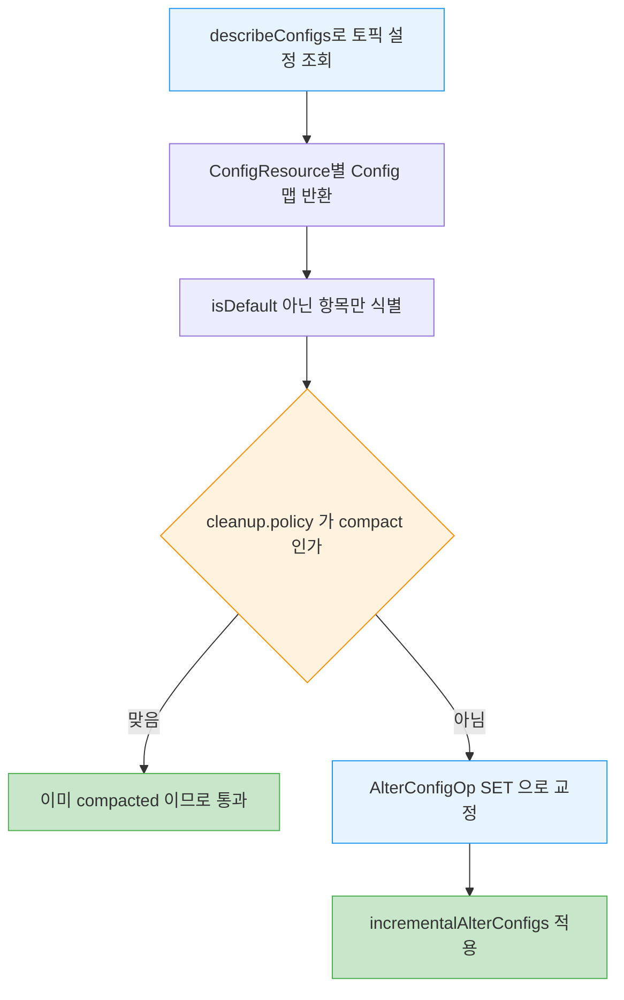
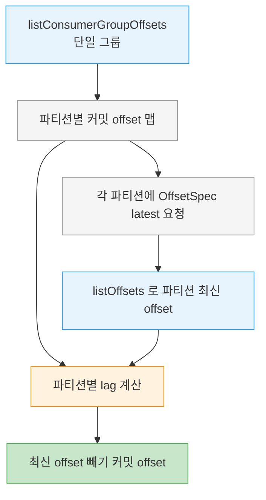

# AdminClient 설정·컨슈머그룹·클러스터


> [06-01.AdminClient 기초와 토픽 관리](06-01.AdminClient%20기초와%20토픽%20관리.md)가 AdminClient의 설계 원칙과 토픽 CRUD를 다뤘다면, 이 글은 토픽 *설정*을 읽고 고치는 법, 컨슈머 그룹과 그들이 커밋한 offset을 탐색·수정하는 법, 그리고 클러스터 메타데이터를 조회하는 법을 다룹니다. 특히 컨슈머 그룹 offset을 외부에서 reset하는 기능은 SRE가 장애 복구 도구를 만들 때 핵심이라, 어떤 안전장치가 걸려 있고 무엇을 함께 챙겨야 하는지가 중요합니다.


## 학습 목표

> 토픽 설정을 describe·수정하는 법, 컨슈머 그룹 offset과 lag을 조회하고 reset하는 법, 클러스터 메타데이터를 읽는 법을 설명할 수 있는 것이 이 장의 목표입니다.

이 장을 다 읽고 다음 다섯 가지에 자신 있게 답할 수 있으면 학습이 완료됩니다.

1. ConfigResource로 무엇을 describe·수정할 수 있는지와 AlterConfigOp 네 타입을 말할 수 있습니다.
2. isDefault()가 어떤 설정을 nondefault로 판단하는지 설명할 수 있습니다.
3. listConsumerGroups의 valid·errors·all 차이를 구분할 수 있습니다.
4. 컨슈머 그룹의 committed offset과 lag을 어떻게 구하는지 말할 수 있습니다.
5. offset reset이 active 그룹에서 막히는 이유와 상태 저장 앱에서 주의할 점을 설명할 수 있습니다.


## 1. 설정 관리 — ConfigResource describe와 수정

> 설정 관리는 ConfigResource 컬렉션을 describe하고 update하는 것입니다. 토픽이 정말 compacted인지 주기적으로 확인하고 교정하는 것이 흔한 용도입니다.

설정 관리는 ConfigResource 컬렉션을 describe하고 업데이트하는 방식으로 합니다. config resource는 broker, broker logger, topic이 될 수 있습니다. broker와 broker logging 설정을 확인·수정하는 일은 보통 `kafka-config.sh` 같은 도구로 하지만, 토픽 설정을 그 토픽을 쓰는 앱에서 직접 확인·갱신하는 일은 꽤 흔합니다.

예를 들어 많은 앱이 올바른 동작을 위해 compacted 토픽에 의존합니다. 이런 앱이 주기적으로, 안전을 위해 기본 retention 주기보다 자주, 토픽이 정말 compacted인지 확인하고 아니면 교정하는 것은 합리적입니다.

```java
// 토픽 설정을 describe하고, compacted가 아니면 SET으로 교정
ConfigResource configResource =
        new ConfigResource(ConfigResource.Type.TOPIC, TOPIC_NAME);
DescribeConfigsResult configsResult =
        admin.describeConfigs(Collections.singleton(configResource));
Config configs = configsResult.all().get().get(configResource);

// 기본값이 아닌 설정만 출력 — 무엇이 손대졌는지 식별
configs.entries().stream().filter(
        entry -> !entry.isDefault()).forEach(System.out::println);

// compacted인지 확인
ConfigEntry compaction = new ConfigEntry(TopicConfig.CLEANUP_POLICY_CONFIG,
        TopicConfig.CLEANUP_POLICY_COMPACT);
if (!configs.entries().contains(compaction)) {
    // compacted가 아니면 compact로 설정
    Collection<AlterConfigOp> configOp = new ArrayList<AlterConfigOp>();
    configOp.add(new AlterConfigOp(compaction, AlterConfigOp.OpType.SET));
    Map<ConfigResource, Collection<AlterConfigOp>> alterConf = new HashMap<>();
    alterConf.put(configResource, configOp);
    admin.incrementalAlterConfigs(alterConf).all().get();
} else {
    System.out.println("Topic " + TOPIC_NAME + " is compacted topic");
}
```

흐름을 짚습니다. ConfigResource에는 여러 타입이 있고 여기서는 특정 토픽의 설정을 봅니다. 한 요청에 다른 타입의 resource를 여럿 지정할 수도 있습니다. `describeConfigs`의 결과는 각 ConfigResource를 설정 컬렉션에 매핑한 맵입니다. 각 설정 entry의 `isDefault()`로 어떤 설정이 손대졌는지 알 수 있습니다. 토픽 설정은 사용자가 토픽에 nondefault 값을 설정했거나, broker-level 설정이 수정되어 그 nondefault 값을 상속해 만들어진 토픽이면 nondefault로 간주됩니다.

설정을 수정하려면 수정할 ConfigResource 맵과 작업 컬렉션을 지정합니다. 각 수정 작업은 설정 entry(이름과 값, 여기서는 cleanup.policy가 이름이고 compacted가 값)와 작업 타입으로 이뤄집니다. Kafka에서 설정을 바꾸는 작업 타입은 넷입니다. 값을 설정하는 **SET**, 값을 제거하고 기본값으로 되돌리는 **DELETE**, 그리고 **APPEND** 와 **SUBTRACT** 입니다. 뒤의 둘은 List 타입 설정에만 적용되며, 매번 전체 리스트를 보내지 않고도 값을 더하거나 뺄 수 있게 해줍니다.



설정을 describe하는 기능은 비상 상황에 의외로 요긴합니다. 책의 일화에 따르면, 업그레이드 도중 broker 설정 파일이 깨진 복사본으로 바뀐 적이 있었습니다. 첫 broker를 재시작했더니 기동에 실패해 알게 됐는데, 원본을 복구할 수단이 없어 올바른 설정을 재구성하느라 상당한 시행착오를 각오해야 했습니다. 한 SRE가 남아 있는 broker 하나에 접속해 AdminClient로 그 설정을 덤프해 상황을 구했습니다.


## 2. 컨슈머 그룹 탐색 — list와 describe

> 컨슈머 그룹을 수정하려면 먼저 나열하고 describe해야 합니다. valid·errors·all 중 무엇으로 결과를 받느냐에 따라 에러 처리가 달라집니다.

Kafka는 대부분의 메시지 큐와 달리, 데이터를 이전에 소비·처리했던 정확한 순서로 재처리할 수 있습니다. 4장에서 컨슈머 그룹을 다룰 때 Consumer API로 옛 메시지를 되돌아가 다시 읽는 법을 설명했습니다. 다만 그 API를 쓴다는 것은 재처리 능력을 미리 앱에 프로그래밍해 두었다는 뜻입니다. 앱 스스로 "재처리" 기능을 노출해야 합니다.

이 능력을 미리 넣지 않았더라도 앱이 메시지를 재처리하게 만들고 싶은 상황이 있습니다. 장애 중에 오작동하는 앱을 트러블슈팅하는 경우가 하나이고, 재해 복구 failover로 새 클러스터에서 앱을 시작할 준비를 하는 경우(9장)가 다른 하나입니다. 이 절에서는 AdminClient로 컨슈머 그룹과 그들이 커밋한 offset을 프로그래밍으로 탐색·수정하는 법을 봅니다. 외부 도구는 10장에서 다룹니다.

탐색의 첫걸음은 그룹을 나열하는 것입니다.

```java
// 정상 반환된 그룹만 나열 — 에러는 무시
admin.listConsumerGroups().valid().get().forEach(System.out::println);
```

`valid()` 메서드를 쓰면 `get()`이 반환하는 컬렉션에는 클러스터가 에러 없이 반환한 그룹만 담깁니다. 에러가 있어도 예외로 던지지 않고 완전히 무시됩니다. `errors()`로는 모든 예외를 받을 수 있습니다. 다른 예제들처럼 `all()`을 쓰면 클러스터가 반환한 첫 에러만 예외로 던집니다. 이런 에러의 흔한 원인은 그룹을 볼 권한이 없는 인가 문제이거나, 일부 컨슈머 그룹의 coordinator가 불가용한 경우입니다.

일부 그룹의 정보가 더 필요하면 describe합니다.

```java
// 특정 컨슈머 그룹의 상세 정보 조회
ConsumerGroupDescription groupDescription = admin
        .describeConsumerGroups(CONSUMER_GRP_LIST)
        .describedGroups().get(CONSUMER_GROUP).get();
System.out.println("Description of group " + CONSUMER_GROUP
        + ":" + groupDescription);
```

description에는 그룹에 대한 풍부한 정보가 담깁니다. 그룹 멤버, 그들의 식별자와 host, 할당된 파티션, 할당에 쓰인 알고리즘, group coordinator의 host가 들어갑니다. 컨슈머 그룹을 트러블슈팅할 때 요긴합니다. 그런데 컨슈머 그룹에 대한 가장 중요한 정보 하나가 이 description에 빠져 있습니다. 그룹이 소비하는 각 파티션에 마지막으로 커밋한 offset이 무엇이고, 로그의 최신 메시지보다 얼마나 뒤처졌는지(lag)입니다.

과거에는 이 정보를 얻는 유일한 길이 컨슈머 그룹이 internal Kafka 토픽에 쓴 commit 메시지를 파싱하는 것이었습니다. 의도는 달성했지만 Kafka가 내부 메시지 포맷의 호환성을 보장하지 않아 이 옛 방법은 권장되지 않습니다. AdminClient가 이 정보를 어떻게 가져오는지 봅니다.


## 3. 컨슈머 그룹 offset과 lag 조회

> listConsumerGroupOffsets로 커밋된 offset을, listOffsets로 파티션 최신 offset을 받아 둘의 차이로 lag을 계산합니다.

```java
// 그룹의 committed offset과 파티션 최신 offset을 받아 lag 계산
Map<TopicPartition, OffsetAndMetadata> offsets =
        admin.listConsumerGroupOffsets(CONSUMER_GROUP)
                .partitionsToOffsetAndMetadata().get();

Map<TopicPartition, OffsetSpec> requestLatestOffsets = new HashMap<>();
for(TopicPartition tp: offsets.keySet()) {
    requestLatestOffsets.put(tp, OffsetSpec.latest());
}

Map<TopicPartition, ListOffsetsResult.ListOffsetsResultInfo> latestOffsets =
        admin.listOffsets(requestLatestOffsets).all().get();

for (Map.Entry<TopicPartition, OffsetAndMetadata> e: offsets.entrySet()) {
    String topic = e.getKey().topic();
    int partition =  e.getKey().partition();
    long committedOffset = e.getValue().offset();
    long latestOffset = latestOffsets.get(e.getKey()).offset();
    // lag = 파티션 최신 offset - 그룹이 커밋한 offset
    System.out.println("Consumer group " + CONSUMER_GROUP
            + " has committed offset " + committedOffset
            + " to topic " + topic + " partition " + partition
            + ". The latest offset in the partition is " + latestOffset
            + " so consumer group is "
            + (latestOffset - committedOffset) + " records behind");
}
```

흐름을 짚습니다. 먼저 그룹이 다루는 모든 topic·partition과 각각의 마지막 커밋 offset 맵을 가져옵니다. `describeConsumerGroups`와 달리 `listConsumerGroupOffsets`는 컬렉션이 아니라 **단일 컨슈머 그룹만** 받습니다. 다음으로 각 topic·partition에 대해 파티션 마지막 메시지의 offset을 구합니다. `OffsetSpec`에는 편리한 세 구현이 있습니다. 파티션의 가장 이른 offset과 가장 늦은 offset을 주는 `earliest()`와 `latest()`, 그리고 지정한 시각에 또는 그 직후에 쓰인 레코드의 offset을 주는 `forTimestamp()`입니다. 마지막으로 모든 파티션을 순회하며 마지막 커밋 offset, 파티션 최신 offset, 둘 사이의 lag을 출력합니다.

> 💬 **비유**: lag 조회는 마라톤 중계 화면의 "선두와 격차"와 같습니다. 커밋된 offset이 주자의 현재 위치, 파티션 최신 offset이 결승선이고, 둘의 차이가 남은 거리입니다. 이 비유는 "뒤처진 정도를 숫자로 본다"까지 유효하지만, 마라톤은 결승선이 고정된 반면 Kafka의 latest offset은 새 메시지가 들어올 때마다 계속 멀어진다는 점에서 단순화된 것입니다. 그래서 lag은 한 시점의 스냅샷일 뿐, 소비 속도가 생산 속도를 따라잡는지까지는 한 번의 조회로 알 수 없습니다.

두 호출이 합쳐져 lag이 나오는 흐름을 그림으로 보면 이렇습니다.




## 4. 컨슈머 그룹 수정 — offset reset

> AdminClient는 그룹 삭제·멤버 제거·offset 삭제·offset 수정을 할 수 있습니다. 그중 offset 수정이 가장 유용하며, active 그룹에서는 막혀 있습니다.

지금까지는 정보를 탐색만 했습니다. AdminClient에는 컨슈머 그룹을 수정하는 메서드도 있습니다. 그룹 삭제, 멤버 제거, 커밋된 offset 삭제, offset 수정입니다. 이들은 SRE가 비상 복구용 ad hoc 도구를 만들 때 흔히 씁니다.

이 가운데 가장 유용한 것이 offset 수정입니다. offset 삭제는 컨슈머를 "처음부터" 시작시키는 단순한 방법처럼 보이지만, 실제로는 컨슈머 설정에 달려 있습니다. 컨슈머가 시작했는데 offset이 없으면 처음부터 읽을지 최신 메시지로 건너뛸지는 `auto.offset.reset` 값을 모르면 알 수 없기 때문입니다. 커밋된 offset을 가장 이른 offset으로 명시적으로 수정하면 컨슈머가 토픽 처음부터 처리하게 강제할 수 있고, 사실상 컨슈머를 "reset"하는 셈입니다.

> ⚠️ **active 그룹에서는 막힙니다**: 컨슈머 그룹은 offset 토픽의 offset이 바뀌어도 갱신 통지를 받지 않습니다. 컨슈머는 새 파티션을 할당받거나 시작할 때만 offset을 읽습니다. 컨슈머가 모르는 offset 변경(그래서 결국 덮어쓸 변경)을 막기 위해, Kafka는 컨슈머 그룹이 active일 때 offset 수정을 막습니다.

> ⚠️ **상태 저장 앱 주의**: 컨슈머 앱이 상태를 유지하면(대부분의 스트림 처리 앱이 그렇습니다) offset을 reset해 토픽 처음부터 처리하는 것이 저장된 상태에 이상한 영향을 줄 수 있습니다. 예를 들어 매장에서 팔린 신발 수를 계속 세는 스트림 앱이 있는데, 오전 8시에 입력 오류를 발견해 오전 3시부터 다시 계산하고 싶다고 합니다. 저장된 집계를 적절히 고치지 않고 offset만 3시로 reset하면 오늘 팔린 신발을 두 번 세게 됩니다. 저장된 상태도 맞춰 갱신해야 합니다. 개발 환경에서는 보통 input 토픽 시작으로 offset을 reset하기 전에 state store를 완전히 지웁니다.

```java
// 그룹을 가장 이른 offset으로 reset
Map<TopicPartition, ListOffsetsResult.ListOffsetsResultInfo> earliestOffsets =
    admin.listOffsets(requestEarliestOffsets).all().get();

Map<TopicPartition, OffsetAndMetadata> resetOffsets = new HashMap<>();
for (Map.Entry<TopicPartition, ListOffsetsResult.ListOffsetsResultInfo> e:
        earliestOffsets.entrySet()) {
  // listOffsets 결과를 alterConsumerGroupOffsets가 요구하는 타입으로 변환
  resetOffsets.put(e.getKey(), new OffsetAndMetadata(e.getValue().offset()));
}

try {
  admin.alterConsumerGroupOffsets(CONSUMER_GROUP, resetOffsets).all().get();
} catch (ExecutionException e) {
  System.out.println("Failed to update the offsets committed by group "
            + CONSUMER_GROUP + " with error " + e.getMessage());
  // 가장 흔한 실패: 그룹을 먼저 멈추지 않음
  if (e.getCause() instanceof UnknownMemberIdException)
      System.out.println("Check if consumer group is still active.");
}
```

흐름을 짚습니다. 그룹을 가장 이른 offset부터 처리하게 reset하려면 먼저 earliest offset을 구합니다. latest를 구하는 것과 비슷합니다. 그다음 `listOffsets`가 반환한 `ListOffsetsResultInfo` 값 맵을 `alterConsumerGroupOffsets`가 요구하는 `OffsetAndMetadata` 값 맵으로 변환합니다. `alterConsumerGroupOffsets`를 부른 뒤 Future 완료를 기다려 성공 여부를 봅니다. 이 호출이 실패하는 가장 흔한 이유는 그룹을 먼저 멈추지 않은 것입니다. 그룹을 멈추는 일은 소비 앱을 직접 종료해서 해야 하고, 그룹을 종료하는 admin 명령은 없습니다. 그룹이 여전히 active면 offset을 고치려는 시도가 coordinator에게는 그룹 멤버가 아닌 클라이언트가 그 그룹에 offset을 커밋하는 것처럼 보여 `UnknownMemberIdException`을 받습니다.

offset reset 자체의 의미와 컨슈머가 커밋을 어떻게 다루는지는 [01-05.오프셋 커밋 API](01-05.오프셋%20커밋%20API.md)에서 다룹니다.


## 5. 클러스터 메타데이터

> 앱이 클러스터에 대해 명시적으로 알아야 할 일은 드물지만, describeCluster로 식별자·broker 목록·controller를 조회할 수 있습니다.

앱이 연결한 클러스터에 대해 무언가를 명시적으로 알아야 하는 일은 드뭅니다. broker가 몇 개인지, 어느 것이 controller인지 몰라도 메시지를 produce·consume할 수 있습니다. Kafka 클라이언트가 이 정보를 추상화하기 때문에, 클라이언트는 토픽과 파티션만 신경 쓰면 됩니다. 그래도 궁금하다면 다음 코드가 답해 줍니다.

```java
// 클러스터 식별자·broker 목록·controller 조회
DescribeClusterResult cluster = admin.describeCluster();
System.out.println("Connected to cluster " + cluster.clusterId().get());
System.out.println("The brokers in the cluster are:");
cluster.nodes().get().forEach(node -> System.out.println("    * " + node));
System.out.println("The controller is: " + cluster.controller().get());
```

cluster identifier는 GUID라 사람이 읽기 어렵습니다. 그래도 클라이언트가 올바른 클러스터에 연결됐는지 확인하는 데는 유용합니다.


## 6. 실무 적용

> 토픽 설정 자가 점검과 컨슈머 그룹 offset reset이 대표 용도입니다. reset 전 그룹 중단과 상태 정리를 절차로 묶습니다.

실무에서 가장 흔한 두 패턴이 있습니다. 하나는 compacted 의존 앱이 주기적으로 자기 토픽이 정말 compacted인지 `describeConfigs`로 점검하고 아니면 `incrementalAlterConfigs`의 SET으로 교정하는 것입니다. broker 설정은 `kafka-config.sh`로 두더라도, 앱이 자기 토픽 설정만큼은 코드로 자가 점검하는 편이 안전합니다. 다른 하나는 SRE가 장애나 재해 복구 때 컨슈머 그룹을 earliest로 reset해 재처리시키는 것입니다. 이때는 절차가 중요합니다. 먼저 소비 앱을 종료해 그룹을 active 상태에서 빼고, 상태 저장 앱이면 state store를 정리하거나 저장 집계를 함께 보정한 뒤, `alterConsumerGroupOffsets`로 offset을 옮깁니다.

상황별 선택을 정리하면 다음과 같습니다.

| 상황 | 방식 | 이유 |
|------|------|------|
| 토픽 compacted 자가 점검 | describeConfigs + isDefault() | 앱이 자기 토픽 설정을 코드로 보장 |
| 리스트 형 설정 일부만 변경 | AlterConfigOp APPEND·SUBTRACT | 전체 리스트를 다시 보내지 않음 |
| 그룹 재처리 강제 | earliest로 alterConsumerGroupOffsets | auto.offset.reset에 의존하지 않고 명시적 reset |

> ⚠️ **주의**: offset reset은 반드시 그룹을 먼저 멈춘 뒤에 합니다. active 그룹에 시도하면 `UnknownMemberIdException`이 나고, 설령 우회한다 해도 컨슈머가 그 변경을 모른 채 자기 offset으로 덮어써 reset이 무위로 돌아갑니다. 상태 저장 앱이면 offset만 옮기지 말고 저장 상태도 함께 정합화해야 중복 집계를 피할 수 있습니다.


## 7. 면접 대비 Q&A

> 답을 보지 않고 먼저 입으로 답해 본 뒤 비교해 보면 좋습니다.

### Q1. AlterConfigOp의 네 작업 타입은 각각 무엇인가요?

SET은 설정 값을 설정하고, DELETE는 값을 제거해 기본값으로 되돌립니다. APPEND와 SUBTRACT는 List 타입 설정에만 적용되며, 매번 전체 리스트를 보내지 않고도 값을 더하거나 뺄 수 있게 해줍니다. 설정 수정은 ConfigResource 맵과 이 작업들의 컬렉션을 `incrementalAlterConfigs`에 넘겨서 합니다.

### Q2. isDefault()는 어떤 설정을 nondefault로 보나요?

사용자가 토픽에 nondefault 값을 직접 설정한 경우, 그리고 broker-level 설정이 수정되어 그 nondefault 값을 상속해 만들어진 토픽인 경우를 nondefault로 봅니다. `describeConfigs` 결과를 `isDefault()`로 필터링하면 손대진 설정만 추려, 토픽이 의도한 구성인지 점검할 수 있습니다.

### Q3. listConsumerGroups의 valid·errors·all 차이는?

`valid()`는 에러 없이 반환된 그룹만 담고 에러는 조용히 무시합니다. `errors()`는 발생한 모든 예외를 줍니다. `all()`은 클러스터가 반환한 첫 에러를 예외로 던집니다. 에러의 흔한 원인은 그룹을 볼 권한이 없거나 일부 그룹 coordinator가 불가용한 경우입니다. 도구를 만들 때 일부 그룹 조회 실패를 무시하고 진행하려면 `valid()`가 편합니다.

### Q4. 컨슈머 그룹의 lag은 어떻게 구하나요?

`listConsumerGroupOffsets`로 그룹이 각 파티션에 커밋한 offset을 받고, `listOffsets`에 `OffsetSpec.latest()`를 넘겨 각 파티션의 최신 offset을 받습니다. 파티션마다 (최신 offset − 커밋 offset)이 lag입니다. `listConsumerGroupOffsets`는 단일 그룹만 받는다는 점이 `describeConsumerGroups`와 다릅니다. OffsetSpec에는 earliest·latest·forTimestamp 세 구현이 있습니다.

### Q5. offset reset이 active 그룹에서 막히는 이유는?

컨슈머 그룹은 offset 토픽이 바뀌어도 통지를 받지 않고, 새 파티션 할당이나 시작 시에만 offset을 읽습니다. 그래서 active 그룹의 offset을 고치면 컨슈머가 그 변경을 모른 채 자기 offset으로 덮어써 reset이 무효가 됩니다. 이를 막기 위해 Kafka는 active 그룹의 offset 수정을 차단하며, 시도하면 비멤버의 커밋으로 보여 `UnknownMemberIdException`이 납니다. 그래서 reset 전에 소비 앱을 직접 종료해야 합니다.


## 8. 관련 문서

- [06-01.AdminClient 기초와 토픽 관리](06-01.AdminClient%20기초와%20토픽%20관리.md) — AdminClient 설계 원칙·생명주기와 토픽 CRUD
- [06-03.AdminClient 고급 작업과 테스트](06-03.AdminClient%20고급%20작업과%20테스트.md) — 파티션 추가·레코드 삭제·리더 선출·MockAdminClient
- [01-05.오프셋 커밋 API](01-05.오프셋%20커밋%20API.md) — 컨슈머가 offset을 커밋하는 동작(여기서 reset하는 그 offset)
