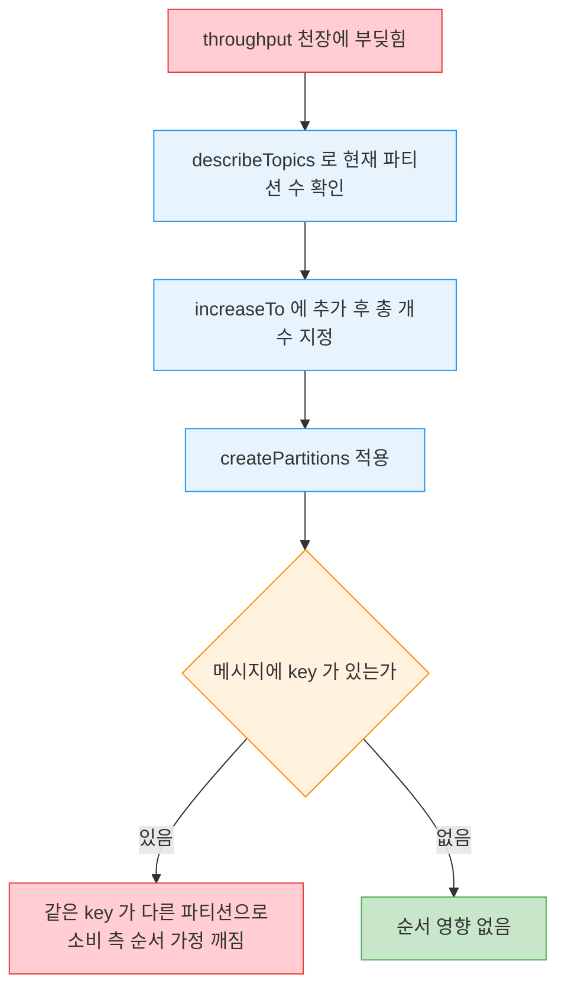
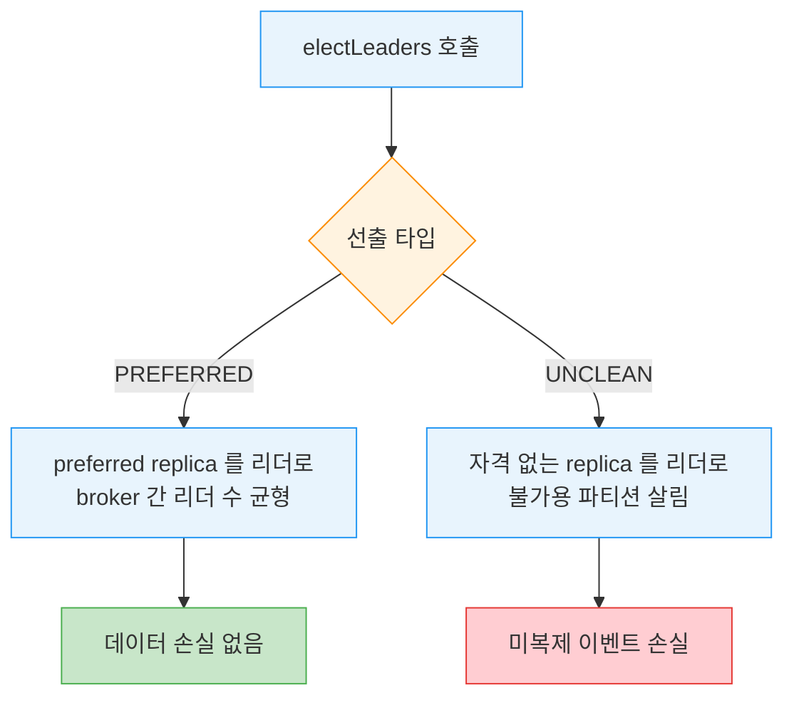

# AdminClient 고급 작업과 테스트


> [06-02.AdminClient 설정·컨슈머그룹·클러스터](06-02.AdminClient%20설정·컨슈머그룹·클러스터.md)까지가 일상적으로 쓰는 관리 작업이었다면, 이 글은 드물게 쓰지만 필요할 때 결정적인 작업을 모읍니다. 파티션 추가, 레코드 삭제, 리더 선출, replica 재배치는 주로 SRE가 장애 대응에 씁니다. 위험할 수 있어 장애가 터진 다음 배우면 늦습니다. 마지막으로 실제 클러스터 없이 이 코드를 검증하는 MockAdminClient도 함께 봅니다.


## 학습 목표

> 파티션 추가·레코드 삭제·리더 선출·replica 재배치가 각각 무엇을 하고 왜 위험한지 설명하고, MockAdminClient로 AdminClient 사용 코드를 테스트할 수 있는 것이 이 장의 목표입니다.

이 장을 다 읽고 다음 다섯 가지에 자신 있게 답할 수 있으면 학습이 완료됩니다.

1. createPartitions에 넘기는 수가 "추가할 개수"가 아니라 "총 개수"인 이유를 말할 수 있습니다.
2. deleteRecords가 무엇을 하고 디스크 정리가 언제 일어나는지 설명할 수 있습니다.
3. preferred와 unclean 리더 선출의 차이와 unclean이 데이터를 잃는 이유를 말할 수 있습니다.
4. alterPartitionReassignments로 replica를 옮길 때 주의할 점을 설명할 수 있습니다.
5. MockAdminClient의 한계와 Mockito로 미구현 메서드를 채우는 방법을 말할 수 있습니다.


## 1. 고급 작업이라는 카테고리

> 여기 모인 메서드는 드물게 쓰고 위험할 수 있지만 필요할 때 요긴합니다. 서로 관련은 없고 같은 위험도 카테고리에 묶일 뿐입니다.

이 절에서 다루는 메서드는 드물게 쓰이고 잘못 쓰면 위험할 수 있지만, 정말 필요할 때는 요긴합니다. 대부분 장애 중 SRE에게 중요한데, 장애가 닥칠 때까지 사용법을 미루지 말고 미리 읽고 연습해 두는 편이 좋습니다. 여기 모인 메서드들은 서로 별 관련이 없고, 단지 이 카테고리에 들어맞는다는 공통점만 있습니다.


## 2. 파티션 추가 — createPartitions

> 파티션 수는 보통 토픽 생성 시 정하며, 추가는 드물고 위험합니다. key 기반 순서 보장이 깨질 수 있기 때문입니다.

보통 토픽의 파티션 수는 토픽을 만들 때 정합니다. 각 파티션의 throughput이 워낙 높아 토픽 용량 한계에 부딪히는 일은 드뭅니다. 게다가 메시지에 key가 있으면 컨슈머는 같은 key의 모든 메시지가 항상 같은 파티션으로 가서 같은 컨슈머가 같은 순서로 처리한다고 가정합니다. 이런 이유로 파티션 추가는 드물게 필요하고 위험할 수 있습니다. 토픽을 소비하는 어떤 앱도 깨뜨리지 않는지 확인해야 합니다. 그래도 때로는 기존 파티션으로 처리할 수 있는 throughput의 천장에 정말 부딪혀 추가 외에 선택지가 없을 때가 있습니다.

`createPartitions` 메서드로 토픽 컬렉션에 파티션을 추가합니다. 여러 토픽을 한 번에 확장하려 하면 일부는 성공하고 일부는 실패할 수 있습니다.

```java
// 파티션 추가 — 추가할 개수가 아니라 추가 후 '총' 개수를 지정
Map<String, NewPartitions> newPartitions = new HashMap<>();
newPartitions.put(TOPIC_NAME, NewPartitions.increaseTo(NUM_PARTITIONS+2));
admin.createPartitions(newPartitions).all().get();
```

여기서 핵심은 토픽을 확장할 때 추가할 파티션 개수가 아니라 **추가가 끝난 뒤 토픽이 가질 총 파티션 수**를 지정한다는 것입니다. `createPartitions`가 총 개수를 받기 때문에, 확장 전에 먼저 토픽을 describe해서 현재 파티션이 몇 개인지 파악해야 할 수도 있습니다.

> 💬 **비유**: createPartitions에 총 개수를 주는 것은 주차장 확장 공사에 "몇 면 더"가 아니라 "최종 몇 면"을 적어내는 것과 같습니다. 현재 면 수를 모르면 최종 수를 못 적으니 먼저 세어 봐야 합니다. 이 비유는 "목표 총량을 지정한다"까지 유효하지만, 주차장은 면을 늘려도 기존 차의 자리가 그대로인 반면, 파티션을 늘리면 key 해시가 바뀌어 같은 key가 다른 파티션으로 갈 수 있다는 점에서 단순화된 것입니다. 그래서 파티션 추가는 소비 측 순서 가정을 깰 수 있습니다.

확장 절차와 그때 깨질 수 있는 가정을 그림으로 보면 이렇습니다.




## 3. 레코드 삭제 — deleteRecords

> deleteRecords는 지정 offset보다 오래된 레코드를 삭제 표시해 컨슈머가 접근할 수 없게 합니다. 디스크 정리는 비동기로 따로 일어납니다.

현행 개인정보법은 데이터에 특정 보존 정책을 강제합니다. 안타깝게도 Kafka에 토픽 보존 정책이 있긴 하지만, 법적 준수를 보장하는 방식으로 구현되지는 않았습니다. 보존 기간이 30일인 토픽도, 각 파티션의 데이터가 단일 세그먼트에 다 들어가면 더 오래된 데이터를 그대로 저장할 수 있습니다.

`deleteRecords` 메서드는 호출할 때 지정한 offset보다 오래된 모든 레코드를 삭제된 것으로 표시하고, Kafka 컨슈머가 접근할 수 없게 만듭니다. 이 메서드는 가장 높은 삭제 offset을 반환해 삭제가 예상대로 일어났는지 확인하게 해줍니다. 디스크에서의 완전한 정리는 비동기로 따로 일어납니다. [06-02 §3](06-02.AdminClient%20설정·컨슈머그룹·클러스터.md)에서 본 `listOffsets`로 특정 시각에 또는 그 직후에 쓰인 레코드의 offset을 구할 수 있으니, 두 메서드를 합치면 특정 시점보다 오래된 레코드를 삭제할 수 있습니다.

```java
// 특정 시점보다 오래된 레코드 삭제 — listOffsets로 경계 offset을 먼저 구한다
Map<TopicPartition, ListOffsetsResult.ListOffsetsResultInfo> olderOffsets =
        admin.listOffsets(requestOlderOffsets).all().get();
Map<TopicPartition, RecordsToDelete> recordsToDelete = new HashMap<>();
for (Map.Entry<TopicPartition, ListOffsetsResult.ListOffsetsResultInfo>  e:
        olderOffsets.entrySet())
    // 그 offset 이전 레코드를 삭제 대상으로
    recordsToDelete.put(e.getKey(),
            RecordsToDelete.beforeOffset(e.getValue().offset()));
admin.deleteRecords(recordsToDelete).all().get();
```


## 4. 리더 선출 — electLeaders

> 이 메서드는 두 종류의 리더 선출을 트리거합니다. preferred는 리더 균형을 맞추고, unclean은 데이터 손실을 감수하고 불가용 파티션을 살립니다.

`electLeaders`는 서로 다른 두 종류의 리더 선출을 트리거합니다.

**Preferred leader election**. 각 파티션에는 preferred leader로 지정된 replica가 있습니다. 모든 파티션이 자신의 preferred leader replica를 리더로 쓰면 broker마다 리더 수가 균형을 이루므로 "preferred"입니다. 기본적으로 Kafka는 5분마다 preferred leader replica가 실제 리더인지 확인하고, 아니지만 리더가 될 자격이 있으면 그 replica를 리더로 선출합니다. `auto.leader.rebalance.enable`이 false이거나 이 과정을 더 빨리 일으키고 싶으면 `electLeader()`로 트리거할 수 있습니다.

**Unclean leader election**. 파티션의 리더 replica가 불가용해지고 다른 replica들도 리더가 될 자격이 없으면(보통 데이터가 누락돼서), 파티션은 리더 없이 불가용해집니다. 이를 푸는 한 방법이 unclean leader election으로, 원래 리더가 될 자격이 없는 replica를 그래도 리더로 선출하는 것입니다. 이는 **데이터 손실**을 일으킵니다. 옛 리더에 쓰였지만 새 리더로 복제되지 않은 이벤트가 전부 사라집니다. `electLeader()`로 unclean 선출도 트리거할 수 있습니다.

이 메서드는 비동기라, 성공적으로 반환한 뒤에도 모든 broker가 새 상태를 알기까지 시간이 걸려 `describeTopics()` 호출이 비일관적인 결과를 줄 수 있습니다. 여러 파티션에 리더 선출을 트리거하면 일부는 성공하고 일부는 실패할 수 있습니다.

```java
// 특정 토픽 파티션 0의 preferred 리더 선출
Set<TopicPartition> electableTopics = new HashSet<>();
electableTopics.add(new TopicPartition(TOPIC_NAME, 0));
try {
    admin.electLeaders(ElectionType.PREFERRED, electableTopics).all().get();
} catch (ExecutionException e) {
    if (e.getCause() instanceof ElectionNotNeededException) {
        // 이미 모두 preferred 리더면 할 일이 없다
        System.out.println("All leaders are preferred already");
    }
}
```

흐름을 짚습니다. 위 코드는 특정 토픽의 단일 파티션에 preferred 리더를 선출합니다. 파티션과 토픽은 원하는 만큼 지정할 수 있습니다. 파티션 컬렉션 대신 null을 주면 선택한 선출 타입을 모든 파티션에 트리거합니다. 클러스터가 건강한 상태이면 이 명령은 아무것도 하지 않습니다. preferred·unclean 선출은 preferred가 아닌 replica가 현재 리더일 때만 효과가 있습니다.



리더와 replica·ISR의 기본 개념은 [01-02.리더 선출](01-02.리더%20선출.md)에서 다룹니다.


## 5. replica 재배치 — alterPartitionReassignments

> 모든 replica의 배치를 세밀하게 제어합니다. broker 간 대량 데이터 복사가 따르므로 대역폭과 quota throttle을 신경 써야 합니다.

가끔 일부 replica의 현재 위치가 마음에 들지 않을 때가 있습니다. broker가 과부하라 일부 replica를 옮기고 싶거나, replica를 더 추가하고 싶거나, 머신을 제거하려고 한 broker의 모든 replica를 옮기고 싶거나, 시끄러운 토픽 몇 개를 나머지 워크로드에서 격리하고 싶을 수 있습니다. 이 모든 경우에 `alterPartitionReassignments`가 파티션의 모든 단일 replica 배치를 세밀하게 제어하게 해줍니다. replica를 한 broker에서 다른 broker로 재배치하는 일은 대량의 데이터 복사를 수반할 수 있다는 점을 기억해야 합니다. 가용 네트워크 대역폭에 유의하고, 필요하면 quota로 복제를 throttle합니다. quota는 broker 설정이므로 AdminClient로 describe하고 업데이트할 수 있습니다.

다음 예에서는 ID가 0인 broker 하나가 있고, 토픽의 여러 파티션이 모두 이 broker에 replica 하나씩을 둔다고 합니다. 새 broker(ID 1)를 추가한 뒤 토픽 replica 일부를 거기에 저장하려 합니다. 각 파티션을 조금씩 다르게 배치합니다.

```java
// 파티션마다 다른 방식으로 replica 재배치
Map<TopicPartition, Optional<NewPartitionReassignment>> reassignment = new HashMap<>();
// 파티션 0: replica 추가(새 broker 1), 리더는 그대로
reassignment.put(new TopicPartition(TOPIC_NAME, 0),
        Optional.of(new NewPartitionReassignment(Arrays.asList(0,1))));
// 파티션 1: 기존 1개 replica를 새 broker로 이동(유일 replica라 리더이기도 함)
reassignment.put(new TopicPartition(TOPIC_NAME, 1),
        Optional.of(new NewPartitionReassignment(Arrays.asList(1))));
// 파티션 2: replica 추가 + 새 replica를 preferred 리더로
reassignment.put(new TopicPartition(TOPIC_NAME, 2),
        Optional.of(new NewPartitionReassignment(Arrays.asList(1,0))));
// 파티션 3: 빈 Optional — 진행 중 재배치가 있었다면 취소하고 이전 상태로 복귀
reassignment.put(new TopicPartition(TOPIC_NAME, 3), Optional.empty());

admin.alterPartitionReassignments(reassignment).all().get();

// 진행 중 재배치 조회
System.out.println("currently reassigning: " +
        admin.listPartitionReassignments().reassignments().get());
demoTopic = admin.describeTopics(TOPIC_LIST);
topicDescription = demoTopic.values().get(TOPIC_NAME).get();
// 새 상태 출력 — 일관된 결과가 나오기까지 시간이 걸릴 수 있다
System.out.println("Description of demo topic:" + topicDescription);
```

각 파티션 처리를 짚습니다. 파티션 0에는 새 broker 1에 replica를 추가하되 리더는 바꾸지 않았습니다. 파티션 1에는 replica를 더하지 않고 기존 하나를 새 broker로 옮겼는데, replica가 하나뿐이라 그것이 리더이기도 합니다. 파티션 2에는 replica를 추가하고 그것을 preferred 리더로 만들었습니다. 다음 preferred 리더 선출이 일어나면 리더십이 새 broker의 새 replica로 넘어가고 기존 replica는 follower가 됩니다. 파티션 3은 진행 중인 재배치가 없지만, 만약 있었다면 빈 Optional이 그것을 취소하고 재배치 시작 전 상태로 되돌렸을 것입니다. 마지막으로 진행 중인 재배치를 나열하고 새 상태를 출력할 수 있는데, 일관된 결과를 보이기까지는 시간이 걸릴 수 있습니다.


## 6. 테스트 — MockAdminClient

> MockAdminClient는 실제 클러스터 없이 AdminClient 사용 코드를 테스트하게 해줍니다. 다만 모든 메서드가 mock되어 있지는 않아 Mockito로 미구현 메서드를 채웁니다.

Apache Kafka는 **MockAdminClient** 라는 테스트 클래스를 제공합니다. 임의 개수의 broker로 초기화해, 실제 Kafka 클러스터를 띄우고 거기에 admin 작업을 정말로 실행하지 않고도 앱이 올바르게 동작하는지 테스트할 수 있습니다. MockAdminClient는 Kafka API의 일부가 아니라 경고 없이 바뀔 수 있지만, mock하는 메서드가 public이라 메서드 시그니처는 호환을 유지합니다. 이 클래스의 편의가 변경되어 테스트가 깨질 리스크만큼 값어치가 있는지에 대한 trade-off가 있으니 염두에 둡니다.

이 테스트 클래스가 특히 쓸 만한 점은 일부 흔한 메서드가 충실하게 mocking된다는 것입니다. MockAdminClient로 토픽을 만들면 이어지는 `listTopics()` 호출이 "만든" 토픽을 나열합니다. 그러나 모든 메서드가 mock되어 있지는 않습니다. AdminClient 2.5 이하에서 MockAdminClient의 `incrementalAlterConfigs()`를 부르면 `UnsupportedOperationException`이 나는데, 자기 구현을 주입해 처리할 수 있습니다.

MockAdminClient로 테스트하는 법을 보이기 위해, admin client를 받아 토픽을 만드는 클래스를 먼저 구현합니다.

```java
// 이름이 "test"로 시작하면 토픽을 만드는 메서드
public TopicCreator(AdminClient admin) {
    this.admin = admin;
}

public void maybeCreateTopic(String topicName)
        throws ExecutionException, InterruptedException {
    Collection<NewTopic> topics = new ArrayList<>();
    topics.add(new NewTopic(topicName, 1, (short) 1));
    if (topicName.toLowerCase().startsWith("test")) {
        admin.createTopics(topics);
        // 미구현 메서드 처리 시연을 위해 설정도 함께 변경한다
        ConfigResource configResource =
                  new ConfigResource(ConfigResource.Type.TOPIC, topicName);
        ConfigEntry compaction =
                  new ConfigEntry(TopicConfig.CLEANUP_POLICY_CONFIG,
                          TopicConfig.CLEANUP_POLICY_COMPACT);
        Collection<AlterConfigOp> configOp = new ArrayList<AlterConfigOp>();
        configOp.add(new AlterConfigOp(compaction, AlterConfigOp.OpType.SET));
        Map<ConfigResource, Collection<AlterConfigOp>> alterConf = new HashMap<>();
        alterConf.put(configResource, configOp);
        admin.incrementalAlterConfigs(alterConf).all().get();
    }
}
```

로직은 단순합니다. `maybeCreateTopic`은 토픽 이름이 "test"로 시작하면 토픽을 만듭니다. 토픽 설정도 함께 바꿔, mock 클라이언트에 구현되지 않은 메서드를 다루는 법을 보여줍니다. 여기서는 **Mockito** 테스트 프레임워크로 MockAdminClient 메서드가 기대대로 호출되는지 검증하고 미구현 메서드를 채웁니다. Mockito는 단순하고 좋은 API를 가진 mocking 프레임워크라 작은 단위 테스트 예제에 잘 맞습니다.

mock 클라이언트를 인스턴스화하며 테스트를 시작합니다.

```java
// MockAdminClient 준비 — 가짜 broker, incrementalAlterConfigs는 Mockito로 채움
@Before
public void setUp() {
    Node broker = new Node(0,"localhost",9092);
    this.admin = spy(new MockAdminClient(Collections.singletonList(broker), broker));

    // 이게 없으면 테스트가 'Not implemented yet'으로 던진다
    AlterConfigsResult emptyResult = mock(AlterConfigsResult.class);
    doReturn(KafkaFuture.completedFuture(null)).when(emptyResult).all();
    doReturn(emptyResult).when(admin).incrementalAlterConfigs(any());
}
```

짚어 보면, MockAdminClient는 broker 리스트(여기선 하나)와 controller가 될 broker 하나로 인스턴스화합니다. broker는 broker ID·hostname·port뿐이고 모두 가짜입니다. 테스트를 실행하는 동안 어떤 broker도 돌지 않습니다. Mockito의 spy 주입을 써서, 나중에 TopicCreator가 올바르게 실행됐는지 확인할 수 있습니다. 그리고 Mockito의 `doReturn`으로 mock admin client가 예외를 던지지 않게 합니다. 테스트 대상 메서드는 `all()`이 KafkaFuture를 반환하는 `AlterConfigsResult` 객체를 기대하므로, 가짜 `incrementalAlterConfigs`가 정확히 그것을 반환하게 만듭니다.

이제 제대로 된 가짜 AdminClient가 있으니 `maybeCreateTopic()`이 올바르게 동작하는지 테스트합니다.

```java
// "test"로 시작 → createTopics 1회 호출되어야 함
@Test
public void testCreateTestTopic()
        throws ExecutionException, InterruptedException {
    TopicCreator tc = new TopicCreator(admin);
    tc.maybeCreateTopic("test.is.a.test.topic");
    verify(admin, times(1)).createTopics(any());
}

// "test"로 시작 안 함 → createTopics 호출 안 되어야 함
@Test
public void testNotTopic() throws ExecutionException, InterruptedException {
    TopicCreator tc = new TopicCreator(admin);
    tc.maybeCreateTopic("not.a.test");
    verify(admin, never()).createTopics(any());
}
```

토픽 이름이 "test"로 시작하니 `maybeCreateTopic()`이 토픽을 만들 것으로 기대하고, `createTopics()`가 한 번 호출됐는지 확인합니다. 토픽 이름이 "test"로 시작하지 않으면 `createTopics()`가 전혀 호출되지 않았는지 검증합니다.

마지막으로, Apache Kafka는 MockAdminClient를 test jar로 published하므로 pom.xml에 test 의존성을 넣어야 합니다.

```xml
<dependency>
    <groupId>org.apache.kafka</groupId>
    <artifactId>kafka-clients</artifactId>
    <version>2.5.0</version>
    <classifier>test</classifier>
    <scope>test</scope>
</dependency>
```


## 7. 실무 적용

> 이 작업들은 평시 코드보다 SRE 런북에 더 어울립니다. 위험한 작업일수록 미리 연습하고, 검증은 MockAdminClient로 자동화합니다.

이 절의 작업들은 평시 애플리케이션 코드보다 SRE 런북에 더 어울립니다. 파티션 추가는 소비 측 순서 가정을 깰 수 있으니 사전에 영향 범위를 확인하고, replica 재배치는 대량 복제를 부르니 quota throttle을 함께 겁니다. unclean 리더 선출은 데이터 손실을 감수하는 마지막 수단이라 런북에 조건을 못 박아 두는 편이 안전합니다. 이렇게 위험한 작업일수록 장애 전에 한 번 돌려 봐야 하는데, 실제 클러스터를 건드리지 않고 연습·검증하는 자리가 MockAdminClient입니다. createTopics 같은 흔한 메서드는 포괄적으로 mock되어 동작을 그대로 확인할 수 있고, 미구현 메서드는 Mockito로 채워 호출 그래프만 검증합니다.

상황별 선택을 정리하면 다음과 같습니다.

| 상황 | 방식 | 이유 |
|------|------|------|
| 파티션 확장 | createPartitions(총 개수) | describe로 현재 수 확인 후 총량 지정 |
| 시점 기준 레코드 삭제 | listOffsets + deleteRecords | 시각을 offset 경계로 변환해 삭제 |
| 불가용 파티션 복구 | electLeaders UNCLEAN | 데이터 손실 감수하는 최후 수단 |
| AdminClient 코드 검증 | MockAdminClient + Mockito | 실제 클러스터 없이 호출 검증 |

> ⚠️ **주의**: 이 메서드들은 비동기라 성공 반환 후에도 모든 broker가 새 상태를 알기까지 시간이 걸립니다. 작업 직후의 `describeTopics()`나 재배치 조회가 비일관적일 수 있으니, 결과를 즉시 단정하지 말고 잠시 뒤 다시 확인합니다. 여러 파티션을 한 번에 다루면 일부만 성공할 수 있다는 점도 함께 염두에 둡니다.


## 8. 면접 대비 Q&A

> 답을 보지 않고 먼저 입으로 답해 본 뒤 비교해 보면 좋습니다.

### Q1. createPartitions에 넘기는 수가 "총 개수"인 이유는?

`createPartitions`의 `increaseTo`는 추가가 끝난 뒤 토픽이 가질 총 파티션 수를 받기 때문입니다. "몇 개 더"가 아니라 "최종 몇 개"라서, 현재 파티션 수를 모르면 총량을 정할 수 없습니다. 그래서 확장 전에 토픽을 describe해 현재 수를 파악해야 할 수 있습니다. 여러 토픽을 한 번에 확장하면 일부만 성공할 수도 있습니다.

### Q2. deleteRecords는 무엇을 하고 디스크 정리는 언제 일어나나요?

지정한 offset보다 오래된 모든 레코드를 삭제된 것으로 표시해 컨슈머가 접근할 수 없게 합니다. 가장 높은 삭제 offset을 반환해 삭제가 예상대로 됐는지 확인하게 해줍니다. 디스크에서의 완전한 정리는 비동기로 따로 일어납니다. `listOffsets`로 특정 시각의 경계 offset을 구해 함께 쓰면 특정 시점보다 오래된 레코드를 지울 수 있습니다.

### Q3. preferred와 unclean 리더 선출의 차이는?

preferred는 각 파티션의 preferred replica를 리더로 만들어 broker 간 리더 수 균형을 맞춥니다. 데이터 손실이 없습니다. unclean은 리더가 불가용하고 다른 replica도 자격이 없을 때, 자격 없는 replica를 그래도 리더로 세워 불가용 파티션을 살립니다. 옛 리더에 쓰였지만 복제되지 않은 이벤트가 사라져 데이터 손실이 납니다. 둘 다 preferred 아닌 replica가 현재 리더일 때만 효과가 있습니다.

### Q4. replica 재배치 시 가장 신경 써야 할 것은?

broker 간 대량 데이터 복사가 따른다는 점입니다. 가용 네트워크 대역폭에 유의하고 필요하면 quota로 복제를 throttle해야 합니다. quota는 broker 설정이라 AdminClient로 describe·update할 수 있습니다. 또 빈 Optional을 주면 진행 중 재배치가 취소되고 이전 상태로 돌아가며, 작업이 비동기라 새 상태가 일관되게 보이기까지 시간이 걸립니다.

### Q5. MockAdminClient의 한계와 그 대처는?

Kafka API가 아니라 경고 없이 바뀔 수 있고(단 public 메서드라 시그니처는 호환), 모든 메서드가 mock되어 있지는 않습니다. 2.5 이하에서 `incrementalAlterConfigs()`를 부르면 `UnsupportedOperationException`이 납니다. 이때 Mockito의 `doReturn`으로 그 메서드가 적절한 결과(예: `all()`이 완료된 KafkaFuture를 반환하는 AlterConfigsResult)를 돌려주도록 자기 구현을 주입해 채웁니다.


## 9. 관련 문서

- [06-01.AdminClient 기초와 토픽 관리](06-01.AdminClient%20기초와%20토픽%20관리.md) — AdminClient 설계 원칙·생명주기와 토픽 CRUD
- [06-02.AdminClient 설정·컨슈머그룹·클러스터](06-02.AdminClient%20설정·컨슈머그룹·클러스터.md) — 설정 수정·컨슈머 그룹 offset·클러스터 메타데이터
- [01-02.리더 선출](01-02.리더%20선출.md) — 리더·replica·ISR의 기본 개념(여기서 선출하는 그 리더)
