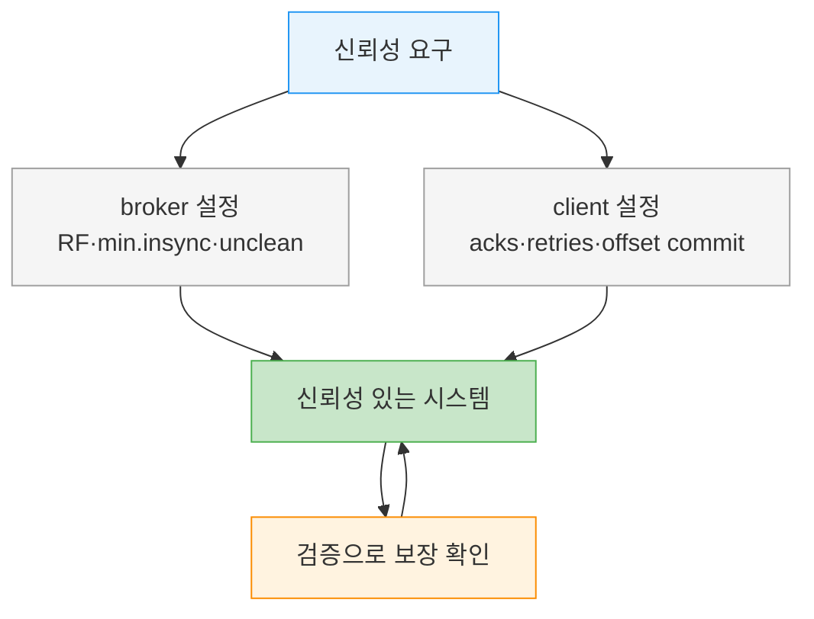
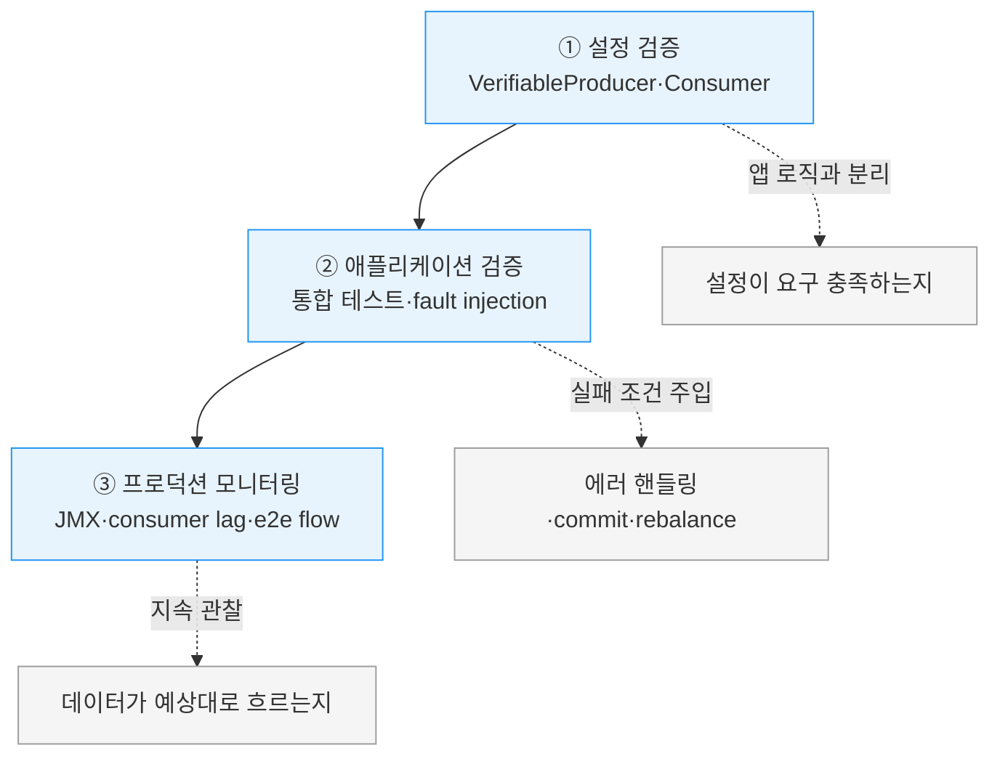

# 신뢰성 검증과 모니터링


> [01-01.메시지 큐 아키텍처](01-01.메시지%20큐%20아키텍처.md)가 복제·ISR·acks로 *신뢰성을 어떻게 설정하는가*를 다뤘다면, 이 글은 그 설정이 정말 신뢰성을 주는지 *어떻게 확인하는가*를 다룹니다. 신뢰성은 한 컴포넌트의 속성이 아니라 시스템 전체의 속성이라, 설정만 잘했다고 안심할 수 없습니다. Kafka가 무엇을 보장하는지 명확히 알고, 그 보장이 실제로 지켜지는지 설정·애플리케이션·프로덕션 세 계층에서 검증해야 비로소 신뢰할 수 있습니다.


## 학습 목표

> Kafka의 4대 신뢰성 보장을 설명하고, 설정·애플리케이션·프로덕션 세 계층에서 신뢰성을 검증·모니터링하는 방법을 말할 수 있는 것이 이 장의 목표입니다.

이 장을 다 읽고 다음 다섯 가지에 자신 있게 답할 수 있으면 학습이 완료됩니다.

1. 신뢰성이 컴포넌트가 아니라 시스템의 속성이라는 말의 의미를 설명할 수 있습니다.
2. Kafka의 4대 보장을 말할 수 있고, "committed"가 disk flush와 다른 이유를 설명할 수 있습니다.
3. VerifiableProducer·VerifiableConsumer로 무엇을 어떻게 검증하는지 말할 수 있습니다.
4. 설정 검증과 애플리케이션 검증이 각각 무엇을 확인하는지 구분할 수 있습니다.
5. producer error-rate·consumer lag·broker FailedProduceRequests가 각각 무엇을 알려주는지 설명할 수 있습니다.


## 1. 신뢰성은 시스템의 속성이다

> 신뢰성은 단일 컴포넌트가 아니라 시스템 전체의 속성입니다. Kafka와 통합되는 모든 부분이 함께 신뢰성을 만들고, 설정의 유연함은 곧 발을 쏠 여지이기도 합니다.

신뢰성을 말할 때 흔히 ACID를 떠올립니다. 관계형 데이터베이스가 보편적으로 지원하는 표준 신뢰성 보장으로, atomicity·consistency·isolation·durability의 약자입니다. 사람들이 가장 중요한 애플리케이션을 관계형 데이터베이스에 맡기는 이유는 시스템이 무엇을 약속하고 다양한 조건에서 어떻게 동작할지를 정확히 알기 때문입니다. 보장을 이해하면 그 보장에 기대어 안전한 애플리케이션을 작성할 수 있습니다.

같은 맥락에서 Kafka가 무엇을 보장하는지 이해하는 것이 신뢰성 있는 애플리케이션을 만드는 출발점입니다. 그런데 한 가지 중요한 전제가 있습니다. **신뢰성은 시스템의 속성이지 단일 컴포넌트의 속성이 아닙니다.** Kafka의 신뢰성 보장을 말할 때는 전체 시스템과 그 use case를 함께 염두에 둬야 합니다. Kafka와 통합되는 시스템이 Kafka 자체만큼 중요합니다. 신뢰성은 시스템 관심사라 한 사람의 책임일 수 없습니다. Kafka 관리자, Linux 관리자, 네트워크·스토리지 관리자, 애플리케이션 개발자가 모두 협력해야 신뢰성 있는 시스템이 됩니다.

Kafka는 신뢰성을 폭넓게 조정할 수 있습니다. use case가 웹사이트 클릭 추적부터 신용카드 결제까지 다양하기 때문입니다. 어떤 경우는 최고의 신뢰성을 요구하고, 어떤 경우는 신뢰성보다 속도와 단순함을 우선합니다. Kafka는 설정이 충분히 유연하고 client API가 충분히 유연해 온갖 신뢰성 trade-off를 허용하도록 만들어졌습니다. 바로 이 유연함 때문에 발을 쏘기도 쉽습니다. 시스템이 신뢰성 있다고 믿지만 실제로는 아닌 상황에 빠지기 쉽습니다.

> 💬 **비유**: 신뢰성은 사슬과 같습니다. 사슬의 강도는 가장 약한 고리가 정합니다. broker를 RF=3·acks=all로 단단히 묶어도 producer가 acks=1이면 그 고리에서 끊깁니다. 이 비유는 "전체가 가장 약한 곳에서 무너진다"까지 유효하지만, 사슬은 약한 고리가 눈에 보이는 반면 신뢰성의 약한 고리(잘못된 acks, 처리 전 commit)는 평소엔 멀쩡해 보이다가 장애 때만 드러난다는 점에서 단순화된 것입니다. 그래서 보이지 않는 고리를 *검증*으로 미리 당겨 봐야 합니다.


## 2. Kafka의 4대 보장

> Kafka는 파티션 내 순서, committed의 정의, 무손실 조건, consumer 가시성 네 가지를 보장합니다. 이 보장을 정확히 알아야 어떤 trade-off가 안전한지 판단할 수 있습니다.

Kafka가 보장하는 것은 다음 넷입니다.

첫째, **파티션 내 메시지 순서**입니다. 같은 producer가 같은 파티션에 메시지 B를 A 뒤에 썼다면, Kafka는 B의 offset이 A보다 크다는 것과 consumer가 B를 A 뒤에 읽는다는 것을 보장합니다.

둘째, **committed의 정의**입니다. produced 메시지는 파티션의 모든 in-sync replica에 쓰였을 때 "committed"로 간주됩니다. 단 여기서 중요한 점은 **반드시 디스크에 flush된 것은 아니라는 것**입니다. producer는 ack를 받는 시점을 셋 중에 고를 수 있습니다. 메시지가 완전히 committed됐을 때, leader에 쓰였을 때, 또는 네트워크로 보내졌을 때입니다.

셋째, **committed 메시지는 replica가 최소 하나만 살아 있어도 잃지 않습니다.**

넷째, **consumer는 committed된 메시지만 읽을 수 있습니다.**

이 기본 보장만으로 시스템이 완전히 신뢰성 있게 되지는 않습니다. 신뢰성 있는 시스템을 만드는 데는 trade-off가 따르고, Kafka는 그 trade-off를 제어하는 설정을 제공해 관리자와 개발자가 필요한 만큼의 신뢰성을 직접 정하게 합니다. trade-off는 보통 메시지를 신뢰성 있고 일관되게 저장하는 일의 중요도와, 가용성·고처리량·저지연·하드웨어 비용 같은 다른 고려사항 사이에서 일어납니다.

신뢰성이 어떻게 설정되는지(복제·ISR·acks·min.insync.replicas)는 [01-01.메시지 큐 아키텍처](01-01.메시지%20큐%20아키텍처.md) §3과 [05-02.Producer 생성과 전송 모드](05-02.Producer%20생성과%20전송%20모드.md)에서 다룹니다. 이 글의 나머지는 그 설정이 실제로 보장을 지키는지 *검증*하는 데 집중합니다.




## 3. 세 계층으로 검증한다

> 요구를 파악하고 broker·client를 설정하고 API를 알맞게 썼더라도, 그냥 프로덕션에 올리고 안심하면 안 됩니다. 설정·애플리케이션·프로덕션 세 계층으로 검증합니다.

신뢰성 요구를 정하고 broker를 설정하고 client를 설정하고 use case에 맞게 API를 썼다면, 이제 안심하고 프로덕션에 올려 어떤 이벤트도 놓치지 않으리라 믿어도 될까요? 그 전에 검증을 먼저 하길 권합니다. 검증은 세 계층으로 나뉩니다. 설정을 검증하고, 애플리케이션을 검증하고, 프로덕션에서 애플리케이션을 모니터링하는 것입니다.




## 4. 설정 검증 — VerifiableProducer와 VerifiableConsumer

> broker·client 설정은 애플리케이션 로직과 분리해 테스트할 수 있고, 그렇게 하길 권합니다. 선택한 설정이 요구를 충족하는지 확인하고, 시스템의 예상 동작을 추론하는 좋은 연습이 됩니다.

broker와 client 설정은 애플리케이션 로직에서 떼어 따로 테스트하기 쉽고, 그렇게 하는 것이 좋습니다. 두 가지 이유가 있습니다. 선택한 설정이 요구를 충족할 수 있는지 확인하게 해주고, 시스템의 예상 동작을 차근차근 추론하는 좋은 연습이 됩니다.

Kafka는 이 검증을 돕는 두 도구를 `org.apache.kafka.tools` 패키지에 담아 제공합니다. `VerifiableProducer`와 `VerifiableConsumer`입니다. 둘 다 명령줄 도구로 실행하거나 자동 테스트 프레임워크에 임베드할 수 있습니다.

`VerifiableProducer`는 1부터 우리가 고른 값까지의 숫자를 담은 메시지 시퀀스를 produce합니다. 우리 producer를 설정하듯 acks·retries·delivery.timeout.ms와 메시지 produce 속도를 똑같이 설정할 수 있습니다. 실행하면 받은 ack를 기준으로 broker에 보낸 메시지마다 success 또는 error를 출력합니다. `VerifiableConsumer`는 그 보완 검사를 합니다. 보통 verifiable producer가 produce한 이벤트를 consume해 순서대로 출력하고, commit과 rebalance에 관한 정보도 출력합니다.

어떤 테스트를 돌릴지 정하는 것이 중요합니다. 예를 들면 이런 것들입니다.

| 시나리오 | 확인할 질문 |
|----------|-------------|
| Leader election | leader를 죽이면? producer·consumer가 정상 동작으로 돌아오기까지 얼마나 걸리나? |
| Controller election | controller를 restart하면 시스템이 재개하기까지 얼마나 걸리나? |
| Rolling restart | broker를 하나씩 restart해도 메시지를 잃지 않나? |
| Unclean leader election | 한 파티션의 모든 replica를 하나씩 죽여 각각 out-of-sync로 만든 뒤, out-of-sync였던 broker를 시작하면? 재개하려면 무엇이 필요하고, 그것이 수용 가능한가? |

그다음 시나리오를 하나 골라 verifiable producer와 verifiable consumer를 시작하고 시나리오를 실행합니다. 예컨대 데이터를 produce하던 파티션의 leader를 죽입니다. 짧은 pause 후 메시지 손실 없이 정상 재개되리라 기대했다면, producer가 produce한 메시지 수와 consumer가 consume한 메시지 수가 일치하는지 확인합니다. Apache Kafka 소스 저장소의 광범위한 테스트 suite도 같은 원리로 verifiable producer·consumer를 써서 rolling upgrade가 동작하는지 확인합니다.


## 5. 애플리케이션 검증 — fault injection과 Trogdor

> 설정이 요구를 충족함을 확인했으면, 애플리케이션이 필요한 보장을 제공하는지 테스트합니다. 다양한 실패 조건을 주입해 에러 핸들링·offset commit·rebalance 처리를 검증합니다.

broker와 client 설정이 요구를 충족함을 확인했으면, 이제 애플리케이션이 우리가 필요로 하는 보장을 제공하는지 테스트할 차례입니다. custom 에러 핸들링 코드, offset commit, rebalance listener처럼 애플리케이션 로직이 Kafka client 라이브러리와 맞닿는 곳을 확인하게 됩니다.

애플리케이션 로직은 제각각이라 테스트 방법에 대한 안내에는 한계가 있습니다. 개발 과정의 일부로 통합 테스트를 두길 권하고, 다양한 실패 조건에서 그 테스트를 돌리길 권합니다. client가 broker 하나와 연결이 끊기는 상황, client와 broker 사이 고지연, disk full, 응답이 멈춘 디스크(이른바 "brown out"), leader election, broker rolling restart, consumer rolling restart, producer rolling restart 같은 조건입니다.

네트워크와 디스크 fault를 주입하는 도구는 많고 훌륭한 것이 여럿이라 특정 추천은 하지 않겠습니다. Apache Kafka 자체에도 fault injection을 위한 **Trogdor** 테스트 프레임워크가 들어 있습니다. 각 시나리오마다 예상 동작이 있습니다. 애플리케이션을 개발할 때 보리라 계획한 동작입니다. 그다음 테스트를 돌려 실제로 무슨 일이 일어나는지 봅니다. 예를 들어 consumer rolling restart를 계획할 때 consumer가 rebalance하는 짧은 pause 뒤 중복값 1,000개 이하로 소비를 이어가리라 계획했다면, 테스트는 애플리케이션이 offset을 commit하고 rebalance를 다루는 방식이 실제로 그렇게 동작하는지 보여 줍니다.


## 6. 프로덕션 모니터링 — JMX·consumer lag·e2e flow

> 테스트가 프로덕션 모니터링을 대체하지는 못합니다. producer error-rate·retry-rate, consumer lag, broker 실패 요청 메트릭, 그리고 데이터가 적시에 흐르는지를 지속해서 봐야 합니다.

애플리케이션을 테스트하는 것은 중요하지만, 데이터가 예상대로 흐르는지 프로덕션 시스템을 지속해서 모니터링하는 일을 대체하지는 못합니다. 클러스터 건강을 모니터링하는 것에 더해 client와 시스템을 통과하는 데이터 흐름도 모니터링해야 합니다. Kafka의 Java client는 client 쪽 상태와 이벤트를 모니터링하는 JMX 메트릭을 포함합니다.

producer에서 신뢰성에 가장 중요한 두 메트릭은 레코드당 집계된 **error-rate**와 **retry-rate**입니다. 이 값이 올라가면 시스템에 문제가 있다는 신호이니 주의 깊게 봐야 합니다. producer 로그에서 이벤트를 보내는 중 WARN 레벨로 찍히는 에러도 봅니다. "Got error produce response with correlation id 5689 on topic-partition [topic-1,3], retrying (two attempts left). Error: …" 같은 식입니다. attempts가 0 남았다는 이벤트가 보이면 producer가 재시도를 소진하고 있는 것입니다. delivery.timeout.ms와 retries를 잘 설정하면 재시도를 조기에 소진하는 것을 막을 수 있습니다(상세는 [05-02](05-02.Producer%20생성과%20전송%20모드.md)). 물론 애초에 에러를 일으킨 문제를 푸는 것이 늘 더 낫습니다. producer의 ERROR 레벨 로그는 nonretriable 에러, 재시도를 소진한 retriable 에러, 또는 timeout으로 메시지 전송이 완전히 실패했음을 가리킬 가능성이 큽니다.

consumer에서 가장 중요한 메트릭은 **consumer lag**입니다. 이 메트릭은 consumer가 broker의 파티션에 committed된 최신 메시지에서 얼마나 떨어져 있는지를 나타냅니다. 이상적으로는 lag이 늘 0이고 consumer가 늘 최신 메시지를 읽습니다. 실제로는 `poll()`이 여러 메시지를 반환하고 consumer가 더 가져오기 전에 그것을 처리하느라 시간을 쓰므로 lag은 늘 조금씩 변동합니다. 중요한 것은 consumer가 점점 더 뒤처지지 않고 결국 따라잡는지입니다. lag이 본래 변동하는 탓에 전통적인 alert를 걸기는 까다로운데, LinkedIn의 **Burrow**라는 consumer lag checker가 이를 쉽게 해줍니다.

데이터 흐름을 모니터링한다는 것은 produced 데이터가 모두 적시에(보통 비즈니스 요구 기준) consume되는지 확인하는 것이기도 합니다. 그러려면 데이터가 언제 produce됐는지 알아야 합니다. Kafka가 이를 돕습니다. 0.10.0 버전부터 모든 메시지는 이벤트가 produce된 시점을 나타내는 timestamp를 포함합니다(단 이벤트를 보내는 애플리케이션이나 그렇게 설정된 broker가 덮어쓸 수 있습니다). 모든 produced 메시지가 합리적인 시간 안에 consume되는지 확인하려면, produce하는 애플리케이션이 produce한 이벤트 수(보통 초당 이벤트)를 기록하고, consumer가 단위 시간당 consume한 이벤트 수와 이벤트 timestamp로 잰 produce-consume 지연을 기록해야 합니다. 그다음 양쪽의 초당 이벤트 수를 맞춰 보고(중간에 메시지를 잃지 않았는지) produce 시각과 consume 시각의 간격이 합리적인지 확인하는 시스템이 필요합니다. 이런 e2e 모니터링 시스템은 구현이 까다롭고 시간이 많이 듭니다. 알려진 오픈소스 구현은 없고, Confluent가 Confluent Control Center의 일부로 상용 구현을 제공합니다.

broker도 client에 보낸 error 응답 rate 메트릭을 포함합니다. `kafka.server:type=BrokerTopicMetrics,name=FailedProduceRequestsPerSec`와 `kafka.server:type=BrokerTopicMetrics,name=FailedFetchRequestsPerSec`를 수집하길 권합니다. 때로는 어느 정도의 error 응답이 예상됩니다. 예컨대 유지보수로 broker를 끄면 다른 broker에 새 leader가 선출되어 producer가 NOT_LEADER_FOR_PARTITION 에러를 받고, 그러면 producer가 메타데이터를 갱신한 뒤 평소처럼 이벤트 produce를 이어갑니다. 설명되지 않는 실패 요청 증가는 늘 조사해야 합니다. 이런 조사를 돕도록, 실패 요청 메트릭은 broker가 보낸 특정 error 응답으로 태깅됩니다.

```java
// producer 신뢰성 JMX 메트릭 (레코드당 집계)
// kafka.producer:type=producer-metrics,client-id=...
//   record-error-rate   — 전송 실패율, 오르면 시스템 이상 신호
//   record-retry-rate   — 재시도율, 함께 모니터링
// consumer lag — records-lag-max 또는 외부 Burrow
// broker 실패 요청
//   kafka.server:type=BrokerTopicMetrics,name=FailedProduceRequestsPerSec
//   kafka.server:type=BrokerTopicMetrics,name=FailedFetchRequestsPerSec
```


## 7. 실무 적용

> 검증은 한 번 하고 끝이 아니라 설정→앱→프로덕션으로 이어지는 절차입니다. 각 계층에서 무엇을 어떤 도구로 확인할지 미리 정해 둡니다.

실무에서는 세 계층을 순서대로 밟습니다. 먼저 설정 검증으로 broker·client 설정이 요구를 충족하는지 VerifiableProducer·VerifiableConsumer로 확인합니다. leader 죽이기·rolling restart·unclean election 같은 시나리오를 돌려 produce 수와 consume 수가 맞는지 봅니다. 다음으로 애플리케이션 검증에서 통합 테스트에 fault를 주입해(Trogdor 등) 에러 핸들링과 offset commit, rebalance 처리가 계획대로인지 봅니다. 마지막으로 프로덕션에서 producer error-rate·retry-rate, consumer lag(Burrow), broker FailedProduceRequestsPerSec·FailedFetchRequestsPerSec를 지속해서 모니터링합니다.

계층별 도구를 정리하면 다음과 같습니다.

| 계층 | 도구 | 확인 대상 |
|------|------|-----------|
| 설정 검증 | VerifiableProducer·VerifiableConsumer | 설정이 요구를 충족하나(produce 수 == consume 수) |
| 애플리케이션 검증 | 통합 테스트 + Trogdor fault injection | 에러 핸들링·offset commit·rebalance가 계획대로인가 |
| 프로덕션 모니터링 | JMX(error-rate·lag·FailedRequests) + Burrow | 데이터가 적시에 손실 없이 흐르나 |

> ⚠️ **주의**: 테스트가 통과했다고 모니터링을 생략하면 안 됩니다. 테스트는 계획한 실패 조건만 검증하고, 프로덕션에서는 계획 밖의 조건이 늘 나타납니다. 특히 consumer lag은 본래 변동하므로 단순 임계값 alert보다 "결국 따라잡는가"를 보는 Burrow 같은 도구가 맞습니다. broker 실패 요청도 유지보수 중에는 일부 예상되니, 설명되는 증가와 설명 안 되는 증가를 구분해야 합니다.


## 8. 면접 대비 Q&A

> 답을 보지 않고 먼저 입으로 답해 본 뒤 비교해 보면 좋습니다.

### Q1. "신뢰성은 시스템의 속성"이라는 말은 무슨 뜻인가요?

신뢰성이 Kafka라는 단일 컴포넌트의 기능이 아니라, Kafka와 통합되는 모든 부분이 함께 만들어 내는 시스템 전체의 성질이라는 뜻입니다. broker를 아무리 단단히 설정해도 producer가 acks=1이면 그 고리에서 끊깁니다. 그래서 Kafka 관리자뿐 아니라 Linux·네트워크·스토리지 관리자, 애플리케이션 개발자가 함께 책임져야 합니다.

### Q2. Kafka의 4대 보장은 무엇이고, committed가 disk flush와 다른 이유는?

파티션 내 순서, committed의 정의, 무손실 조건, consumer 가시성입니다. committed는 메시지가 모든 in-sync replica에 쓰였을 때이고, 반드시 디스크에 flush된 것은 아닙니다. Kafka는 디스크 flush 대신 여러 rack·zone의 replica에 복사본을 두는 것이 더 안전하다고 보기 때문입니다. 두 rack이 동시에 죽을 확률은 거의 없으므로, leader 디스크에 쓰는 것보다 replica 복제가 내구성을 줍니다.

### Q3. VerifiableProducer·VerifiableConsumer로 무엇을 검증하나요?

설정이 요구를 충족하는지를 애플리케이션 로직과 분리해 검증합니다. VerifiableProducer는 1부터 정한 값까지 숫자 메시지를 우리 producer와 같은 acks·retries·delivery.timeout.ms로 produce하고 메시지마다 success/error를 출력합니다. VerifiableConsumer는 그것을 consume해 순서·commit·rebalance를 출력합니다. leader 죽이기 같은 시나리오를 돌린 뒤 produce 수와 consume 수가 일치하는지로 무손실을 확인합니다.

### Q4. 설정 검증과 애플리케이션 검증은 무엇이 다른가요?

설정 검증은 broker·client 설정 자체가 요구를 충족하는지를 앱 로직 없이 확인합니다(VerifiableProducer·Consumer). 애플리케이션 검증은 custom 에러 핸들링·offset commit·rebalance listener처럼 앱 로직이 Kafka client와 맞닿는 부분이 실패 조건에서 계획대로 동작하는지 확인합니다. 후자는 연결 단절·고지연·disk full·brown out 같은 fault를 Trogdor 등으로 주입해 통합 테스트로 봅니다.

### Q5. producer error-rate·consumer lag·broker FailedProduceRequests는 각각 무엇을 알려주나요?

producer error-rate(와 retry-rate)는 전송 실패·재시도가 늘고 있는지로 producer 쪽 문제를 알려줍니다. attempts가 0 남으면 재시도 소진입니다. consumer lag은 consumer가 최신 committed 메시지에서 얼마나 뒤처졌는지로, 결국 따라잡는지가 중요합니다(Burrow로 모니터링). broker FailedProduceRequestsPerSec·FailedFetchRequestsPerSec는 broker가 client에 보낸 실패 응답 rate로, 유지보수 중 일부는 예상되지만 설명 안 되는 증가는 조사 대상입니다.


## 9. 관련 문서

- [01-01.메시지 큐 아키텍처](01-01.메시지%20큐%20아키텍처.md) §3 — 복제·ISR·min.insync.replicas·unclean election으로 신뢰성을 *설정*하는 법
- [05-02.Producer 생성과 전송 모드](05-02.Producer%20생성과%20전송%20모드.md) — acks·retries·delivery.timeout.ms로 producer 신뢰성 설정
- [01-05.오프셋 커밋 API](01-05.오프셋%20커밋%20API.md) — committed offset 관리(consumer가 메시지를 잃지 않는 핵심)
- [07-02.Kafka 메트릭 카탈로그 — Infra·Broker](07-02.Kafka%20메트릭%20카탈로그%20—%20Infra·Broker.md) — §6 핵심 3종을 넘어선 infra·broker MBean 메트릭 전체
- [07-03.Kafka 클라이언트·운영 모니터링](07-03.Kafka%20클라이언트·운영%20모니터링%20—%20Client·Streams·배포환경.md) — producer·consumer·Connect·Streams 메트릭과 배포환경별 모니터링
