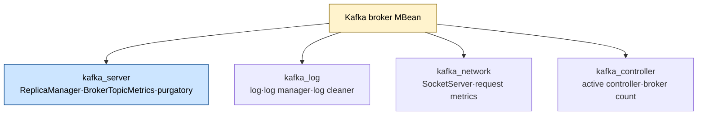
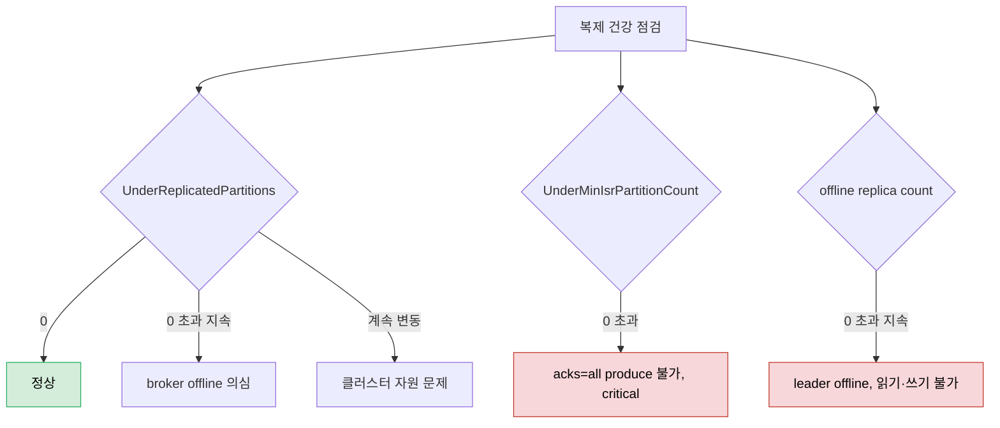

# Kafka 메트릭 카탈로그 — Infra·Broker

> [07-01.신뢰성 검증과 모니터링](07-01.신뢰성%20검증과%20모니터링.md)이 신뢰성을 *어떻게 검증하는가*와 프로덕션 모니터링의 핵심 세 메트릭(producer error-rate·consumer lag·broker 실패 요청)을 다뤘다면, 이 글은 broker가 내보내는 *메트릭 전체 카탈로그*를 정리합니다. Kafka는 fault-tolerant하게 설계됐지만 물리 하드웨어 위에서 돌기에 완전히 무적은 아닙니다. broker가 하나씩 죽을 때마다 남은 fault tolerance가 줄어드므로, 어디가 어떻게 아픈지 빨리 짚으려면 인프라 자원과 broker MBean 메트릭을 함께 봐야 합니다. 이 글은 04_messaging 곳곳에 흩어진 모니터링 내용을 메트릭 관점에서 잇는 허브이기도 합니다.

## 학습 목표

> 인프라 자원 메트릭의 임계값과 broker MBean 메트릭(server·log·network·controller)을 읽고, 무엇이 0이어야 하고 무엇이 위험 신호인지 말할 수 있는 것이 이 장의 목표입니다.

이 장을 다 읽고 다음 다섯 가지에 자신 있게 답할 수 있으면 학습이 완료됩니다.

1. disk·network 사용률 임계값(60%)을 왜 그렇게 잡는지 설명할 수 있습니다.
2. 메트릭 스냅샷 하나로는 왜 상태를 판단할 수 없는지 설명할 수 있습니다.
3. UnderReplicatedPartitions와 UnderMinIsrPartitionCount가 각각 무엇을 뜻하는지 구분할 수 있습니다.
4. NetworkProcessorAvgIdlePercent가 낮을 때 무엇을 해야 하는지 말할 수 있습니다.
5. ActiveControllerCount가 왜 한 broker에서만 1이어야 하는지 설명할 수 있습니다.

## 1. 인프라 메트릭 — Kafka 아래의 하드웨어

> Kafka를 모니터할 때도 그 아래 하드웨어를 잊으면 안 됩니다. disk·network는 rebalancing 여유를 위해 60% 미만으로 두고, 단일 스냅샷이 아니라 추세로 판단합니다.

Kafka를 모니터할 때도 Kafka가 도는 하드웨어와 Kafka가 쓰는 자원을 잊으면 안 됩니다. CPU·메모리·스토리지·네트워크가 부족하면 broker나 client가 금세 성능·신뢰성 문제를 겪습니다. 인프라 모니터링이 없으면 문제 원인을 Kafka 내부에서 찾느라 귀한 시간을 허비할 수 있습니다.

**disk 사용률**은 너무 높으면 안 됩니다. 파티션 rebalancing 때 추가 공간이 필요하므로 버퍼가 중요합니다. 새 디스크를 주문할 시간을 벌도록 **60% 초과 시 alert**를 권장합니다(확장을 분 단위로 할 수 있으면 임계가 60%일 필요는 없습니다). **network 사용률**도 **60% 미만**으로 둡니다. 그러지 않으면 새 broker를 추가하거나 rebalancing할 때 데이터·파티션 이동에 문제가 생기고, broker 실패가 네트워크 용량을 한계로 밀어붙일 수 있습니다.

**메모리**는 예상 밖 부하에 대비해 여유를 둡니다. Kafka는 page cache를 적극 활용해 RAM이 적어도 동작하지만 성능이 떨어집니다. **CPU load**는 짧은 spike면 성능만 줄지만, 장기 高사용률은 요청 처리 자체를 막습니다.

> **한계** — 메트릭 *스냅샷 하나*는 시스템 상태를 거의 말해 주지 않습니다. 파티션 rebalancing 중에는 자원 소비가 일시적으로 오르는데 대개 걱정할 일이 아닙니다. 반면 CPU·메모리·네트워크·스토리지가 *장기간* 높으면 클러스터·서비스의 자연 성장일 가능성이 커서, 그에 맞게 Kafka 클러스터를 scale해야 합니다.

## 2. broker MBean 명명 규약

> Kafka 메트릭은 Java MBeans 명명을 따릅니다. domain(출처)과 속성 리스트로 이뤄져, 이름만 봐도 의미가 드러납니다. broker domain은 kafka_server·kafka_log·kafka_network·kafka_controller입니다.

Kafka는 Java MBeans 명명 형식을 따라 메트릭을 계층 구조로 조직합니다. 메트릭 이름은 출처를 가리키는 **domain**과 더 구체적인 속성 리스트로 이뤄집니다. broker는 `kafka_server`·`kafka_log`·`kafka_network`·`kafka_controller` domain을 씁니다. 이 domain 아래 여러 subtype이 있어 정확한 메트릭 이름으로 이어집니다. 이름이 길고 번거롭지만, 그 verbose함 덕에 별도 문서 없이도 메트릭의 의미가 직접 드러납니다.

아래에서는 가독성을 위해 정확한 메트릭 이름 대신 개념을 설명하되, 특히 중요한 것은 MBean 이름을 함께 짚습니다.

## 3. server 메트릭 — 복제와 ISR 건강

> server 메트릭은 복제 상태를 드러냅니다. UnderReplicatedPartitions는 0이어야 하고, UnderMinIsrPartitionCount가 0을 넘으면 acks=all producer가 produce할 수 없는 위험 상태입니다.

가장 중요한 메트릭 중 하나는 **under-replicated partitions**(`UnderReplicatedPartitions`)로, out-of-sync replica를 가진 파티션 수를 나타냅니다. 이 값은 **항상 0이어야** 합니다. 0을 계속 넘으면 broker가 offline이라는 뜻이고, 끊임없이 변동하면 클러스터 자원 문제를 시사합니다.

부하가 불균형하게 분산된 경우도 잦습니다. 불균형 지표는 broker의 **partition count**와 **leader count**입니다. 보통 모든 broker에 균형을 이뤄야 하며, 아니면 파티션 reassignment를 권합니다. 어떤 토픽은 평균보다 활발한데, broker에 연결된 producer 수는 **producer ID count**로 봅니다.

상황이 critical해지는 것은 최소 ISR을 딱 충족하거나(**at minimum ISR partition count**, `AtMinIsrPartitionCount`) 미달할 때(**under minimum ISR partition count**, `UnderMinIsrPartitionCount`)입니다. 미달하면 **acks=all producer가 produce할 수 없습니다**(RF가 1이면 모든 파티션이 최소 ISR로 예상됨). 최악의 경우 파티션 leader가 offline이라 읽기·쓰기가 불가능해지고(**offline replica count**), 새 leader 선출 과정에서 **reassigning partitions**가 늘어납니다. 이 둘은 이상적으로 0이며, 장기간 0을 넘으면 클러스터에 심각한 문제가 있다는 뜻입니다.

`replica fetcher manager` type의 **max lag**은 broker나 leader replica와 모든 follower 사이의 최대 lag을 보여 줍니다(follower·topic·partition 무관). `fetcher lag` type의 **ConsumerLag**은 follower·topic·partition별 lag을 보여 줍니다. 둘 다 최소여야 하고 produce 시 max batch size를 넘지 않아야 합니다. 짧은 지연은 정상이지만 점진적으로 늘면 안 됩니다.

`broker topic metrics` type에는 토픽별 메트릭이 많습니다. 요청 수(produce·fetch)와 네트워크 트래픽(messages in·bytes in/out·replication bytes in/out·reassignment bytes in/out)입니다. 실제 메시지 produce는 네트워크 부하의 일부일 뿐이고, 특히 파티션 reassignment가 일시적으로 큰 트래픽을 만듭니다. broker의 거부 메시지 통계(compacted 토픽의 key 누락·잘못된 CRC·out-of-sequence offset)도 수집됩니다. `delayed operation purgatory` type의 **purgatory size**는 응답을 기다리는 요청 수입니다. leader가 follower ack를 기다리는 produce 요청이나, `fetch.wait.max.ms`·`fetch.min.bytes`가 아직 충족 안 된 fetch 요청이 여기 들어갑니다.

> **한계** — broker가 overload인지 판정할 때 대부분의 Kafka 메트릭은 *지표*일 뿐입니다. 그래서 CPU·network 같은 일반 메트릭(§1)을 함께 확인해야 합니다.

## 4. log·network·controller 메트릭

> log 메트릭은 디스크 영속화 건강을, network의 NetworkProcessorAvgIdlePercent는 overload 임박을, controller의 ActiveControllerCount는 클러스터에 단일 controller가 있는지를 드러냅니다.

`kafka_log` 메트릭은 broker에 저장된 로그 파일 통계입니다. **log flush stats**는 flush 시간 histogram과 flush 수로, 높으면 영속 스토리지 문제를 시사합니다. `log manager` type의 **offline log directory count**는 도달 불가 디렉토리 수로 **항상 0**이어야 합니다(디스크 실패 시 발생). `log` type에는 size·number of log segments·log start/end offset이 있어 alert엔 덜 중요해도 부하 추세 파악에 유용합니다.

`kafka_network`의 핵심은 `socket server` type의 **network processor average idle percent**(`NetworkProcessorAvgIdlePercent`)입니다. idle 상태인 네트워크 프로세서 비율로, 너무 낮으면 네트워크 지연이 생깁니다. **이 값이 0.3 미만으로 지속되면** 클러스터가 overload 임박이거나 이미 overload라는 신호이므로 가능한 빨리 자원을 scale해야 합니다. `request metrics` type에는 토픽 무관 요청 통계(request·errors·request sizes·request times)가 있어 broker 간 균형과 overload 방지에 중요합니다.

`kafka_controller` 메트릭은 controller 상태를 봅니다. **active controller**(`ActiveControllerCount`)는 현재 controller인 broker를 가리키며 **한 broker에서만 1, 나머지는 0**이어야 합니다. **active broker count**·**fenced broker count**는 active/inactive broker 수를, 그 밖에 topic·partition 총수와 offline partition을 봅니다. **preferred replica imbalance count**는 preferred broker가 leader가 아닌 파티션 수입니다. Kafka는 nonpreferred leader가 있으면 정기적으로 rebalancing하며, 그 임계는 `leader.imbalance.per.broker.percentage`로 기본 **10%**입니다.

| MBean | 의미 | 함의 |
|-------|------|------|
| `ReplicaManager,name=UnderReplicatedPartitions` | out-of-sync replica 파티션 수 | 0이어야, 지속 0 초과면 broker offline |
| `ReplicaManager,name=UnderMinIsrPartitionCount` | 최소 ISR 미달 파티션 수 | critical, acks=all produce 불가·consume 지연 |
| `FetcherLagMetrics,name=ConsumerLag` | follower lag(topic·partition별) | 점진 증가 안 됨, 지속 lag은 성능 문제 |
| `SocketServer,name=NetworkProcessorAvgIdlePercent` | idle 네트워크 프로세서 비율 | >0.3 이상적, 낮으면 overload |
| `KafkaController,name=ActiveControllerCount` | controller인 broker | 한 broker만 1, 나머지 0 |

## 5. 모니터링 허브 — 흩어진 메트릭으로 가는 길

> Kafka 모니터링은 한 문서로 끝나지 않습니다. 신뢰성 검증·Quota·Spring 운영·Connect 상태에 메트릭이 흩어져 있어, 이 절이 메트릭 관점에서 그 문서들로 가는 인덱스 역할을 합니다.

broker 메트릭만으로 모니터링이 끝나지 않습니다. Kafka 모니터링 내용은 주제별 문서에 흩어져 있으므로, 메트릭 관점에서 어디를 펴야 하는지 정리합니다.

- **프로덕션 모니터링 핵심 3종**(producer error-rate·retry-rate, consumer lag/Burrow, broker FailedProduceRequestsPerSec) → [07-01 §6](07-01.신뢰성%20검증과%20모니터링.md). 검증 3계층의 마지막 계층입니다.
- **client·Connect·Streams 메트릭 상세**(connection-count·time-between-poll·records-lag/lead·dropped-records 등) → [07-03.Kafka 클라이언트·운영 모니터링](07-03.Kafka%20클라이언트·운영%20모니터링%20—%20Client·Streams·배포환경.md).
- **produce/fetch throttle-time 메트릭**(quota 위반 신호) → [05-04.Quota와 Throttling](05-04.Quota와%20Throttling.md).
- **trace 전파·Micrometer Observation**(메트릭·로그·트레이스 3축) → [03-02 §6 Observability](03-02.Spring%20Kafka%20운영%20고급.md).
- **Connect task status 모니터링**(REST API `/status`·RUNNING/FAILED) → [01_Connect/04-02 §REST API](../01_Connect/04-02.Kafka%20Connect%20REST%20API·worker%20설정·SMT.md).
- **alert 설계 일반론**(alert fatigue·임계값·playbook·SLO·Burn Rate) → [06_observability/01-04.SLO와 알림](../../06_observability/01_Foundations/01-04.SLO와%20알림%20—%20Error%20Budget,%20Burn%20Rate.md). 이 글은 Kafka 메트릭을 *어떻게* alert로 연결할지만 다루고, alert 설계 원리는 그쪽이 SSOT입니다.

## 6. 면접 대비 Q&A

> broker 모니터링 질문은 "무엇이 0이어야 하나", "스냅샷만 보면 왜 안 되나" 같은 *건강 판정 기준*을 파고듭니다.

### Q1. disk·network 사용률을 60% 미만으로 두라는 이유는?

파티션 rebalancing이나 broker 추가·실패 시 데이터·파티션을 이동할 여유가 필요하기 때문입니다. disk는 새 디스크 주문 시간을 벌도록 60% 초과 시 alert를 권하고(확장이 분 단위면 더 높여도 됨), network는 60%를 넘으면 broker 실패 시 용량이 한계에 닿아 이동이 막힙니다.

### Q2. 메트릭 스냅샷 하나로 상태를 판단하면 안 되는 이유는?

rebalancing 중에는 자원 소비가 일시적으로 오르는데 대개 정상입니다. 반대로 CPU·메모리·네트워크·스토리지가 장기간 높으면 자연 성장이라 scale이 필요합니다. 같은 高사용률이라도 일시적인지 지속적인지에 따라 의미가 완전히 달라지므로 추세로 봐야 합니다.

### Q3. UnderReplicatedPartitions와 UnderMinIsrPartitionCount는 무엇이 다른가요?

UnderReplicatedPartitions는 out-of-sync replica를 가진 파티션 수로, 0을 지속해서 넘으면 broker offline을 시사합니다. UnderMinIsrPartitionCount는 최소 ISR에 미달한 파티션 수로, 0을 넘으면 acks=all producer가 produce할 수 없고 consume도 지연되는 critical 상태입니다.

### Q4. NetworkProcessorAvgIdlePercent가 낮으면 무엇을 해야 하나요?

이 값은 idle 상태인 네트워크 프로세서 비율로 이상적으로 0.3보다 커야 합니다. 0.3 미만으로 지속되면 클러스터가 overload 임박이거나 이미 overload라는 신호이므로, 성능 저하나 outage를 막기 위해 가능한 빨리 자원을 scale해야 합니다.

### Q5. ActiveControllerCount가 왜 한 broker에서만 1이어야 하나요?

controller는 클러스터에 하나만 있어야 파티션 leader 선출·메타데이터 관리가 일관되게 이뤄집니다. 그래서 ActiveControllerCount는 controller인 broker에서만 1이고 나머지는 0이어야 합니다. 둘 이상이 1이면 split-brain 같은 비정상 상태를 의미합니다.

## 관련 문서

> 이 글이 broker·infra 메트릭 카탈로그라면, 검증 철학과 client·운영 모니터링은 아래 문서가 맡습니다.

- [07-01.신뢰성 검증과 모니터링](07-01.신뢰성%20검증과%20모니터링.md) — 신뢰성 검증 3계층과 프로덕션 모니터링 핵심 3종 (이 글의 메트릭이 쓰이는 맥락)
- [07-03.Kafka 클라이언트·운영 모니터링](07-03.Kafka%20클라이언트·운영%20모니터링%20—%20Client·Streams·배포환경.md) — producer·consumer·Connect·Streams 메트릭과 배포환경별 모니터링
- [01-01.메시지 큐 아키텍처](01-01.메시지%20큐%20아키텍처.md) — UnderReplicated·ISR·controller가 가리키는 복제 구조
- [06_observability/01-04.SLO와 알림](../../06_observability/01_Foundations/01-04.SLO와%20알림%20—%20Error%20Budget,%20Burn%20Rate.md) — 메트릭을 alert로 연결하는 일반 원리(SSOT)
