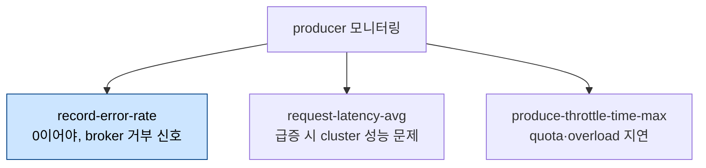
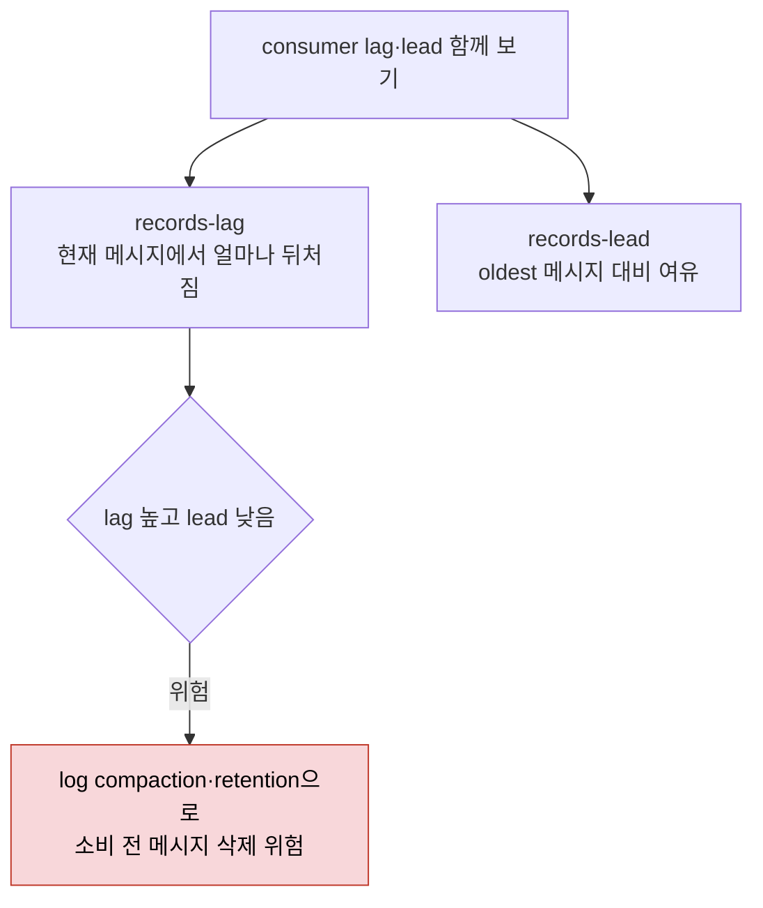

# Kafka 클라이언트·운영 모니터링 — Client·Streams·배포환경

> [07-02.Kafka 메트릭 카탈로그 — Infra·Broker](07-02.Kafka%20메트릭%20카탈로그%20—%20Infra·Broker.md)가 broker 쪽 메트릭을 다뤘다면, 이 글은 client(producer·consumer·Connect·Streams) 메트릭과 alerting, 그리고 배포 환경별 모니터링을 정리합니다. 아무리 강한 broker라도 데이터를 produce·consume하는 client 없이는 쓸모가 없습니다. consumer가 얼마나 뒤처졌는지(lag), producer가 거부당하는지(error-rate), Streams thread가 죽는지를 봐야 마지막 몇 퍼센트의 신뢰성을 챙길 수 있습니다. alert 설계 원리 자체는 06_observability가 SSOT이므로, 여기서는 Kafka 메트릭을 alert로 잇는 부분만 다룹니다.

## 학습 목표

> client 메트릭(producer·consumer·Streams)을 읽고, consumer lag과 lead의 차이, 그리고 배포 환경별 모니터링 초점을 말할 수 있는 것이 이 장의 목표입니다.

이 장을 다 읽고 다음 다섯 가지에 자신 있게 답할 수 있으면 학습이 완료됩니다.

1. connection-count가 자주 변하면 무엇을 의심해야 하는지 설명할 수 있습니다.
2. records-lag와 records-lead가 각각 무엇을 알려주고 왜 함께 봐야 하는지 설명할 수 있습니다.
3. time-between-poll이 늘면 왜 rebalance로 이어지는지 설명할 수 있습니다.
4. Kafka Streams에서 dropped-records와 failed-stream-threads가 왜 critical인지 말할 수 있습니다.
5. VM·cloud·managed 환경에서 각각 무엇을 추가로 모니터해야 하는지 구분할 수 있습니다.

## 1. 일반 client 메트릭

> client도 infra(CPU·network·memory)가 부족하면 처리가 밀립니다. client domain별 메트릭에 더해 connection-count와 failed-authentication-total이 rebalance·인증 문제를 드러냅니다.

broker처럼 client도 infra 모니터링이 중요합니다. CPU·network가 부족하면 메시지를 충분히 빨리 처리하지 못해, producer(단순 producer·Connect·Streams 포함)가 뒤처지고 데이터가 stale해져 그 데이터의 모든 consumer에 영향을 줍니다. 메모리가 부족하면 잘해야 느려지고, 최악엔 OOM이나 crash가 반복됩니다. 개별 consumer 문제는 보통 그 애플리케이션만 영향받지만, 의존하는 애플리케이션까지 번질 수 있습니다.

client 메트릭도 domain을 갖는데, 여기서 domain은 client 타입입니다(`kafka producer`·`kafka consumer`·`kafka connect`·`kafka streams`). type은 각각 producer/consumer/connect/stream metrics이며 Prometheus는 type을 생략합니다. 모든 client 메트릭은 client ID label로 해당 client와 연결됩니다.

client 비특정 메트릭으로 클러스터 연결 수와 인증 성공·실패가 있습니다. **connection-count**는 client가 통신하는 파티션·broker 수에 의존해 대체로 안정적이어야 하며, consumer group 내에서 고르게 분산되는 것이 이상적입니다. consumer의 연결 수가 자주 바뀌면 해당 그룹에서 rebalance가 잦다는 뜻이고, 이는 개별 consumer 문제를 시사합니다. rebalance 중에는 데이터를 소비할 수 없어 애플리케이션 데이터가 stale해집니다. **failed-authentication-total**은 자격 오류 외에 인증 시스템 문제를 가리키므로 즉시 조사해야 합니다. 잠재적 공격이나 설정 문제를 조기에 잡는 보안 메트릭입니다.

## 2. producer·consumer 메트릭

> producer는 record-error-rate·request-latency-avg로 전송 문제를, consumer는 records-lag로 뒤처짐을 봅니다. lag은 못 따라잡음 신호이고, records-lead는 메시지가 소비 전 삭제될 위험을 드러냅니다.

producer 메트릭은 broker 쪽에 대응물이 많습니다. **record-error-rate**는 broker가 produce 요청을 거부했는지 알려줍니다. 이런 에러는 그 지점에서 차단되어 새 메시지를 produce하지 못하게 하므로 빨리 원인을 찾아 해결해야 합니다. 흔한 원인은 producer의 max batch size가 broker의 max message size와 안 맞는 경우, 일시적 네트워크 단절, overload, broker offline입니다. **requests in flight**는 아직 응답 안 온 요청 수로 acks=all일 때 일시 지연이 보입니다. **produce-throttle-time-max**는 overload나 quota로 인한 지연을 드러냅니다. 성능 모니터링에는 **record send rate**와 **request-latency-avg**가 특히 중요합니다.

consumer에서 **time between poll max**와 **last poll seconds ago**는 마지막으로 메시지를 가져온 시점을 알려줍니다. poll이 느려져 `max.poll.interval.ms` 한계에 닿으면 consumer가 그룹 관점에서 inactive로 간주되어 전체 그룹 rebalance가 트리거됩니다. `coordinator metrics` type에는 rebalance 통계(**rebalances total**·**failed rebalances total**·**rebalance latency total/max**)가 있습니다. rebalance 중에는 partition assignment 전략에 따라 새 메시지를 소비하지 못하는데, CooperativeStickyAssignor를 쓰면 다른 consumer는 끊김 없이 계속 소비합니다. Kafka Streams 같은 복잡한 애플리케이션은 rebalance가 수 분 걸리기도 합니다. **assigned partitions**는 그룹 내 균등 분배가 이상적이며, 한 consumer가 장기간 0 파티션이면 미탐지 에러를 의심합니다.

가장 중요한 consumer 메트릭은 `fetch manager metrics` type의 **consumer lag**(**records lag**)입니다. consumer가 토픽·파티션별로 현재 상태에서 얼마나 뒤처졌는지를 메시지 수나 시간으로 나타냅니다. 이상적으로 0이거나 0 근처여야 하고, 지속해서 높으면 소비 애플리케이션의 병목입니다. **records lead**는 파티션의 oldest 메시지 대비 consumer의 lead를 나타냅니다.

> **한계** — records lag은 consumer가 못 따라잡는다는 신호일 뿐이지만, records lead가 낮으면 log compaction이나 retention으로 메시지가 소비되기 전에 삭제될 위험이 있습니다(cleanup 메커니즘은 [08-01](08-01.메시지%20정리%20—%20Log%20Retention·Compaction·Tombstone.md)). lead의 정상값은 토픽 크기에 크게 의존하므로 보편 임계를 잡기 어렵고, lag과 함께 보거나 토픽별 임계를 두길 권합니다.

## 3. Kafka Connect·Streams 메트릭

> Connect는 connector-failed-task-count로 task 중단을, Streams는 failed-stream-threads와 dropped-records로 처리 중단·실패를 드러냅니다. 둘 다 메시지 처리가 멈췄다는 critical 신호입니다.

Kafka Connect는 여러 메트릭을 제공합니다. **connect worker metrics**에 worker별 connector·task 수가, connector별 메트릭에 task 수와 status가 있습니다. **task error metrics**에는 에러 수나 dead-letter queue 기록 수가 담깁니다. 최소한 connector status는 봐야 하는데, connector가 제3자 시스템 의존으로 일시 문제를 겪을 수 있음을 고려합니다. retry 간격을 늘리면 일시 문제는 자동 재시도로 넘기지만, connector·task가 failed 상태로 전환되기까지의 시간도 함께 늘어납니다.

Kafka Streams 메트릭은 애플리케이션 성능·동작을 봅니다. running·failed thread 수에 더해 여러 subtype이 있습니다. `thread` 메트릭에는 thread별 정보(task 생성/종료 수·처리 record 수·처리 시간·consumed 수·latency)가 있습니다. 정상 운영에서 시작·정지·topology 변경을 빼면 task 종료·재생성은 보통 에러나 rebalance를 가리키므로, 너무 잦으면 애플리케이션을 자세히 분석합니다. `task` 메트릭은 개별 task 정보와 함께 처리되지 못한 메시지(**dropped records total**)를 담는데 이는 critical합니다. `processor node metrics`는 task 안 processor별 정보를, `state`는 state store(RocksDB의 엔트리 수·크기 등) 정보를 제공합니다.

| MBean | 의미 | 함의 |
|-------|------|------|
| `connect ... connector-failed-task-count` | 실패한 connector task 수 | task 멈춤 = 메시지 미처리, 재시작 필요 |
| `streams ... failed-stream-threads` | 실패한 stream thread 수 | 처리 중단, 심각 |
| `streams ... process-rate` | 처리 record rate | anomaly 탐지 |
| `streams ... dropped-records-rate` | drop된 record rate | critical, 처리 실패 |

## 4. alerting — Kafka 메트릭을 alert로 잇기

> alert는 메트릭 임계값 기반 자동 알림입니다. alert 설계 원리(alert fatigue·smoothing·playbook·SLO)는 06_observability가 SSOT이므로, 여기서는 Kafka 메트릭을 alert로 연결하는 부분만 다룹니다.

alert는 메트릭이나 메트릭 집계의 사전 정의 임계값에 기반한 자동 알림입니다. 모든 메트릭에 alert를 걸 필요는 없습니다. good/bad 두 상태인 메트릭은 alert가 쉽지만(예: UnderReplicatedPartitions가 0인가), consumer lag처럼 본래 변동하는 메트릭은 단순 임계 alert가 까다롭습니다. 이런 경우 "결국 따라잡는가"를 보는 Burrow 같은 도구가 더 맞습니다([07-01 §6](07-01.신뢰성%20검증과%20모니터링.md)).

alert에 부적합한 메트릭도 다른 alert의 근본 원인 파악에 도움이 됩니다. 예를 들어 produced records는 단독으로는 의미가 적지만, consumer lag alert가 떴을 때 "consumer 문제인가, 아니면 처리할 record가 평소보다 많은가"를 가르는 데 쓰입니다.

> **주의** — alert 설계의 일반 원리(alert fatigue를 피하는 임계 설정, 초당 변동 smoothing, self-healing 대기, alert에 컨텍스트·playbook 첨부, SLO·Error Budget·Burn Rate)는 [06_observability/01-04.SLO와 알림](../../06_observability/01_Foundations/01-04.SLO와%20알림%20—%20Error%20Budget,%20Burn%20Rate.md)이 SSOT입니다. 이 글은 그 원리를 Kafka 메트릭(lag·UnderMinIsr·error-rate)에 적용하는 출발점만 제공합니다. alert를 과민하게 걸면 false positive가 쌓여 결국 무시하게 되는 alert fatigue가 Kafka 모니터링에서도 똑같이 위험합니다.

## 5. 배포 환경별 모니터링

> Kafka가 도는 환경(on-premise·VM·cloud·K8s·managed)마다 추가로 봐야 할 것이 다릅니다. VM은 CPU steal, cloud는 network latency, managed는 SLA·quota가 핵심입니다.

Kafka가 어디에 배포됐느냐에 따라 운영 과제와 모니터링 요구가 달라집니다.

| 환경 | 추가 모니터링 초점 |
|------|-------------------|
| on-premise(자체 하드웨어) | disk health·CPU·memory·network bandwidth + redundancy·backup·DR. 하드웨어 실패가 직접 영향 |
| VM(가상화) | hypervisor 성능·자원 할당. 같은 호스트 VM 간 경합 → **CPU steal time·disk I/O latency·memory swapping** |
| public cloud | **network latency·throughput·autoscaling**·instance health·storage performance·inter-region traffic. ephemeral 인스턴스 → 복제·backup·복구 |
| Kubernetes | JMX 메트릭(broker health·producer/consumer) + Prometheus 수집·Grafana 시각화 + pod health·node resource·cluster performance |
| managed(Confluent Cloud·Amazon MSK) | 인프라는 provider, **app 레벨**(partition distribution·throughput·consumer lag·latency) + service 한계·quota·**SLA** |

on-premise는 하드웨어 실패(디스크/전원/네트워크)가 Kafka에 직접 영향을 주므로 Kafka와 하드웨어를 함께 봐야 합니다. VM은 가상화 층이 더해져, hypervisor가 여러 VM에 CPU·메모리·I/O를 나눠 주는 과정의 경합을 봐야 합니다. cloud는 탄력적이지만 멀티테넌트 분산 시스템이라 네트워크 지연·인스턴스 성능 변동·리전 장애가 Kafka에 영향을 줄 수 있습니다. managed service는 운영 부담을 provider에 넘기지만, app 레벨 신뢰성과 service 한계·quota·SLA 모니터링은 여전히 운영자 책임입니다.

환경과 무관하게 **보안**도 봐야 합니다. on-premise는 네트워크·하드웨어 레벨 정책을 강제하고, cloud·managed는 인프라 보안은 provider가 맡되 broker·topic·전송 데이터 보안은 운영자가 모니터합니다. failed authentication·unauthorized access·encryption overhead 메트릭으로 보안 침해나 취약점을 조기에 잡습니다.

## 6. 면접 대비 Q&A

> client 모니터링 질문은 "lag과 lead를 왜 함께 보나", "VM에서 왜 CPU steal을 보나" 같은 *환경·메트릭의 상호작용*을 파고듭니다.

### Q1. connection-count가 자주 변하면 무엇을 의심하나요?

connection-count는 파티션·broker 수에 의존해 대체로 안정적이어야 합니다. consumer의 연결 수가 자주 바뀌면 해당 consumer group에서 rebalance가 잦다는 신호이고, 이는 개별 consumer 문제를 시사합니다. rebalance 중에는 소비가 멈춰 데이터가 stale해지므로 조사 대상입니다.

### Q2. records-lag와 records-lead는 왜 함께 봐야 하나요?

records-lag는 consumer가 최신 메시지에서 얼마나 뒤처졌는지로 못 따라잡음을 알려줍니다. records-lead는 oldest 메시지 대비 여유입니다. lag이 높고 lead가 낮으면, consumer가 따라가기 전에 log compaction·retention으로 메시지가 삭제될 위험이 있습니다. lead 정상값은 토픽 크기에 의존하므로 lag과 함께 보거나 토픽별 임계를 둡니다.

### Q3. time-between-poll이 늘면 왜 rebalance로 이어지나요?

consumer는 보통 직전 fetch 메시지를 다 처리하면 새 메시지를 가져옵니다. 처리가 느려져 `max.poll.interval.ms`를 넘기면 그룹 관점에서 inactive로 간주되어 전체 그룹 rebalance가 트리거됩니다. rebalance는 다시 소비를 멈추므로 성능 문제를 키웁니다. 그래서 늘어나는 추세를 조기에 잡아야 합니다.

### Q4. Kafka Streams의 dropped-records와 failed-stream-threads가 왜 critical인가요?

failed-stream-threads는 stream thread가 죽어 메시지 처리가 멈췄다는 뜻이고, dropped-records는 record가 올바르게 처리되지 못하고 버려졌다는 뜻입니다. 둘 다 데이터 처리가 중단·유실되는 상태라 즉시 조사해야 합니다. task의 잦은 종료·재생성도 에러나 rebalance 신호입니다.

### Q5. VM·cloud·managed 환경에서 각각 무엇을 추가로 보나요?

VM은 같은 물리 호스트의 다른 워크로드와 자원을 경합하므로 CPU steal time·disk I/O latency·memory swapping을 봅니다. cloud는 멀티테넌트라 network latency·throughput·instance health·inter-region traffic을 봅니다. managed는 인프라를 provider가 맡으므로 app 레벨(consumer lag·throughput)과 service quota·SLA를 모니터합니다.

## 관련 문서

> 이 글이 client·운영 모니터링이라면, broker 메트릭과 alert 설계 원리는 아래 문서가 맡습니다.

- [07-02.Kafka 메트릭 카탈로그 — Infra·Broker](07-02.Kafka%20메트릭%20카탈로그%20—%20Infra·Broker.md) — infra·broker MBean 메트릭과 모니터링 허브
- [07-01.신뢰성 검증과 모니터링](07-01.신뢰성%20검증과%20모니터링.md) — 프로덕션 모니터링 핵심 3종(error-rate·lag·FailedRequests)과 Burrow
- [01-07.Consumer 설정 심화](01-07.Consumer%20설정%20심화.md) — `max.poll.interval.ms` 등 rebalance에 영향을 주는 consumer 설정
- [06_observability/01-04.SLO와 알림](../../06_observability/01_Foundations/01-04.SLO와%20알림%20—%20Error%20Budget,%20Burn%20Rate.md) — alert 설계·alert fatigue·SLO·Burn Rate 일반 원리(SSOT)
