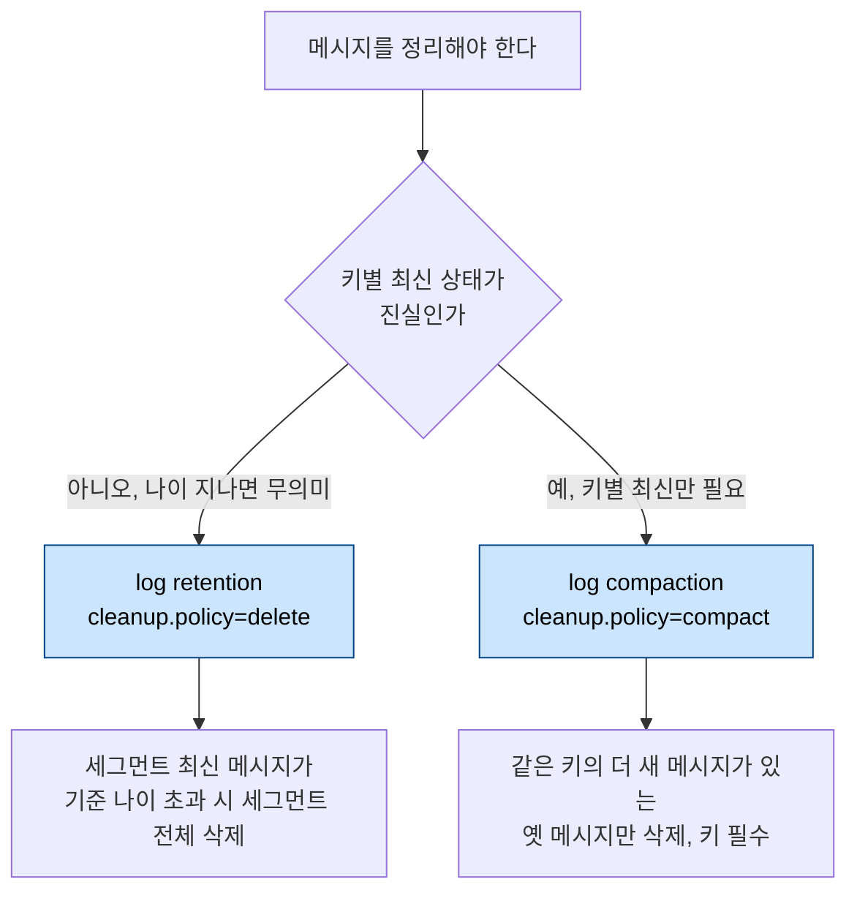
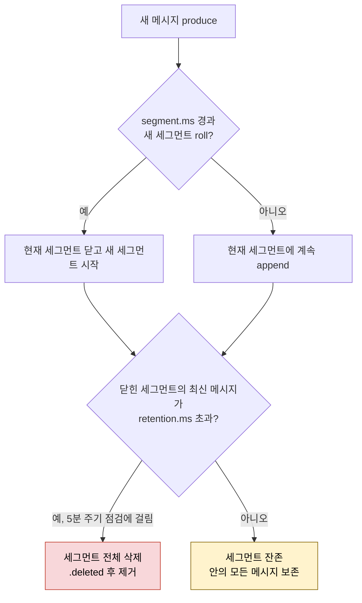
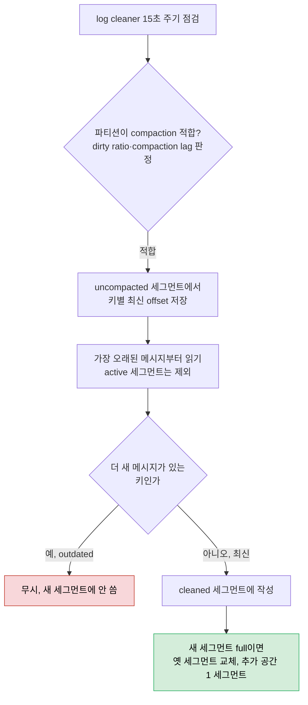

# 메시지 정리 — Log Retention·Compaction·Tombstone

> [03_TopicDesign/01-01.토픽 디자인](../03_TopicDesign/01-01.토픽%20디자인.md)이 *어떤 토픽에 어떤 cleanup 정책을 줄지*(Entity는 compact, Event는 delete)를 결정했다면, 이 글은 그 정책이 브로커 안에서 *어떻게 작동하는지*를 다룹니다. Kafka는 메시지를 영원히 쌓아 둘 수 없어 두 가지 방식으로 정리합니다. 나이로 지우는 log retention과 키별 최신만 남기는 log compaction입니다. 둘 다 log cleaner가 세그먼트 단위로 움직인다는 공통 축을 이해하면, retention period가 왜 7일로 안 끝나는지, compaction한 메시지가 왜 바로 안 지워지는지가 풀립니다.

## 학습 목표

> log retention과 log compaction이 세그먼트 단위로 어떻게 동작하는지, 그리고 두 방식을 언제 고르는지 설명할 수 있는 것이 이 장의 목표입니다.

이 장을 다 읽고 다음 다섯 가지에 자신 있게 답할 수 있으면 학습이 완료됩니다.

1. log retention과 log compaction이 무엇을 기준으로 메시지를 지우는지 구분할 수 있습니다.
2. `retention.ms`가 7일이어도 메시지가 7일보다 오래 남을 수 있는 이유를 `segment.ms`와 엮어 설명할 수 있습니다.
3. log cleaner가 `min.cleanable.dirty.ratio`로 언제 compaction을 시작하는지 설명할 수 있습니다.
4. compaction이 현재 세그먼트를 건드리지 않고 offset·순서를 보존하는 이유를 설명할 수 있습니다.
5. tombstone이 무엇이고 `delete.retention.ms` 뒤에 왜 tombstone까지 삭제되는지 설명할 수 있습니다.

## 1. 왜 메시지를 정리하는가

> 메시지를 영원히 쌓으면 저장소가 차고 처리 성능이 떨어지며, 법적으로 보관할 수 없는 데이터까지 남습니다. 다만 정리의 진짜 어려움은 *아직 필요한 메시지를 실수로 지우지 않는 것*입니다.

메시지를 정리해야 하는 이유는 세 가지입니다. 첫째는 저장 용량입니다. 이론적으로 모든 메시지를 영원히 보관할 수 있지만, 그러면 로그가 무한히 커져 금세 가용 저장소 한계에 닿습니다. 둘째는 성능입니다. 로그가 클수록 전체 메시지를 처리하는 데 걸리는 시간이 늘고, 용도에 따라서는 더 이상 의미 없는 메시지까지 잔뜩 처리하게 됩니다. 셋째이자 가장 중요한 이유는 그 데이터가 더 이상 필요 없거나 법적으로 보관할 수 없는 경우입니다.

그러나 정리에는 반대 방향의 위험이 따릅니다. 오래됐다는 이유만으로 아직 필요한 메시지를 지워 버리면 안 됩니다. 이 긴장이 두 정리 방식을 가르는 출발점입니다. 나이만 보고 단순하게 지울 것인가, 아니면 무엇이 최신인지 따져 가며 지킬 것은 지킬 것인가.

## 2. 두 가지 정리 방식 — Retention과 Compaction

> Kafka는 나이로 지우는 log retention과 키별 최신만 남기는 log compaction 두 방식을 씁니다. retention은 구현이 단순하고 오버헤드가 작은 대신 선택적 삭제가 안 되고, compaction은 키별 최신을 보장하는 대신 전체 로그를 훑어야 해 오버헤드가 큽니다.

**log retention**은 일정 나이에 도달한 메시지, 즉 특정 시점 이전에 생산된 메시지를 단순히 지웁니다. **log compaction**은 키를 기준으로 오래된 데이터를 지우고 *키마다 최신 메시지만* 남깁니다. 그래서 compaction은 메시지에 키를 할당했을 때만 쓸 수 있습니다.

두 방식은 장단점이 갈리고 함께 쓸 수도 있습니다. retention의 장점은 구현이 쉽고 브로커 오버헤드가 작다는 점입니다. 지울지 말지 결정하려면 메시지의 나이만 확인하면 되기 때문입니다. 데이터 보호를 위해 일정 시간 후 반드시 지워야 하는 메시지를 자동으로 삭제하거나, 시간이 지나면 무의미해지는 센서 데이터, 영원히 보관할 필요 없는 프로그램 로그를 정리하는 데 알맞습니다. 단점은 *선택적으로* 지울 수 없다는 점입니다. 오래됐다는 이유만으로 중요한 데이터를 함께 지우지 않도록 조심해야 합니다.

여기서 compaction이 등장합니다. 고객 주소를 저장하는 토픽을 떠올려 봅니다. 주소가 바뀔 때마다 해당 고객 키로 새 메시지를 발행합니다. 옛 주소는 그 시점부터 무의미해지지만, *현재 주소를 단지 나이 때문에 지우면 안 됩니다*. compaction은 이런 경우에 이상적입니다. 키별로 항상 최신 메시지를 유지하면서 오래된 정보를 자동으로 지우기 때문입니다. 대신 compaction은 어떤 메시지를 지울 수 있는지 판단하려고 전체 로그를 훑어야 해서 retention보다 오버헤드가 큽니다.

retention을 쓰든 compaction을 쓰든 둘 다 쓰든, 토픽별로는 `cleanup.policy`로, 전 토픽 기본값은 `log.cleanup.policy`로 설정합니다. **Kafka의 기본값은 log retention(`log.cleanup.policy=delete`)입니다.**

> **비유** — retention은 "선반에서 유통기한 지난 물건을 칸째로 비우는 것"이고, compaction은 "같은 상품의 옛 가격표를 떼고 최신 가격표만 남기는 것"입니다. 칸째 비우기는 빠르지만 그 칸의 멀쩡한 물건도 같이 사라지고, 가격표 정리는 최신을 지키지만 선반 전체를 돌며 확인해야 합니다.

## 3. Log Retention의 메커니즘

> retention은 세그먼트 단위로 동작하며, 두 기준(`retention.bytes` 크기, `retention.ms` 나이)으로 가장 오래된 세그먼트를 지웁니다. 결정적인 함정은 `retention.ms`가 세그먼트 *전체*가 아니라 *세그먼트 안 최신 메시지*를 기준으로 한다는 점입니다.

retention은 두 가지로 설정합니다. 하나는 `retention.bytes`로, 파티션 크기가 이 값을 넘으면 가장 오래된 세그먼트를 지웁니다. 기본값은 `-1`이라 크기 기반 retention은 비활성입니다. 크기 기준이 유용한 경우가 드물기 때문입니다. 다른 하나는 `retention.ms`로, 보존 기간을 밀리초로 정합니다. **기본값은 7일**이며, 세그먼트의 *최신 메시지*가 7일보다 오래되면 그 세그먼트를 지웁니다. 전역으로는 `log.retention.bytes`·`log.retention.ms`로 같은 값을 조정하고, 둘은 병행할 수 있습니다.

여기서 retention이 *세그먼트 생성 빈도에 의존*한다는 점이 핵심 함정입니다. 규제상 메시지를 최대 7일만 보관할 수 있다고 합시다. `retention.ms`를 7일에 맞추는 것은 자연스러워 보이지만 충분하지 않습니다. 보존 기간은 *세그먼트 안 최신 메시지*를 기준으로 하기 때문입니다. 한 세그먼트에 계속 메시지를 쓰는 한 그 세그먼트는 지워지지 않고, 그 안의 모든 메시지가 함께 남습니다.

그래서 두 가지를 함께 챙겨야 합니다. 첫째, `segment.ms`로 정기적으로 새 세그먼트를 roll합니다. 둘째, `retention.ms`를 세그먼트 안 *가장 오래된 메시지*가 최대 허용 기간 안에 지워지도록 잡습니다. 결국 `segment.ms`와 `retention.ms`의 합이 7일을 넘으면 안 됩니다. 다만 Kafka가 기본 *5분마다만* 세그먼트 삭제 가능 여부를 확인하므로 5분을 더 빼야 합니다. 이 주기는 `log.retention.check.interval.ms`로 조정합니다.

이 둘을 7일(정확히는 7일에서 5분)에 어떻게 나누느냐가 실제 보존 기간을 정합니다. 6일마다 세그먼트를 roll하면 `retention.ms`는 최대 23시간 55분까지 둘 수 있고, 이때 메시지는 삭제 시점에 1일에서 7일 사이의 나이를 갖습니다. 반대로 매일 roll하고 `retention.ms`를 5일 23시간 55분으로 잡으면 6일에서 7일 사이의 메시지만 지워집니다. 즉 세그먼트를 자주 roll할수록 더 정밀하게 지울 수 있고, `retention.ms`를 더 높게 잡아 메시지를 더 오래 보존할 수 있습니다.

> **한계** — `retention.ms`만 7일로 잡으면 "최대 7일 보존"이 지켜지지 않습니다. `segment.ms`까지 함께 잡고 둘의 합을 7일 - 5분 안으로 맞춰야 비로소 규제 요건을 만족합니다.

토픽의 모든 메시지를 지우고 싶을 때, 옛 Kafka 버전에서는 보존 기간을 0으로 두고 삭제될 때까지 기다린 뒤 원래 값으로 되돌리는 방법이 쓰였습니다. 동작은 했지만, 지금은 **Kafka Admin API로 토픽 메시지를 지우는 쪽을 권장합니다**(상세는 [06-03.AdminClient 고급 작업과 테스트](06-03.AdminClient%20고급%20작업과%20테스트.md)의 `deleteRecords`).

## 4. Log Compaction의 메커니즘

> compaction은 log cleaner가 15초마다 확인하되, `min.cleanable.dirty.ratio`(기본 0.5)와 compaction lag 조건을 만족할 때만 동작합니다. 현재(active) 세그먼트는 항상 제외하고, offset과 순서는 그대로 보존합니다.

compaction 토픽은 `cleanup.policy=compact`로 만듭니다. compaction은 키가 필수라, 키 없는 메시지를 보내면 브로커가 `org.apache.kafka.common.InvalidRecordException: Compacted topic cannot accept message without key`로 거부합니다. 그래서 produce할 때 `parse.key=true`·`key.separator`로 키를 붙여야 합니다.

compaction을 켰는데도 오래된 메시지가 한동안 남습니다. compaction이 retention처럼 연속적으로 일어나지 않기 때문입니다. log cleaner는 기본 **15초마다(`log.cleaner.backoff.ms`)** 지울 수 있는지 확인하는데, 15초마다 전체 로그를 훑는 것은 비효율적이고 사실상 불가능합니다. 그래서 두 종류의 파라미터로 compaction 여부를 판정합니다.

`min.cleanable.dirty.ratio`는 dirty 로그와 전체 로그의 최소 비율입니다. **dirty란 한 번도 compact되지 않은 세그먼트**를 말합니다. 기본값은 0.5라, dirty 세그먼트와 전체 로그의 비율이 최소 0.5는 되어야 다시 compact합니다(전역 `log.cleaner.min.cleanable.dirty.ratio`). 이 값을 낮출수록 더 자주 compact하고 오래된 메시지가 차지하는 저장 공간이 줄어듭니다. 0.5면 필요한 공간의 두 배까지 쓰고, 0.2면 저장 공간 오버헤드가 최대 25%입니다. 그런데도 0에 가깝게 두지 않는 이유는 compaction이 매번 전체 파티션을 읽는 자원 집약적 작업이라, 그러면 브로커가 compaction에만 매달리기 때문입니다.

`max.compaction.lag.ms`·`min.compaction.lag.ms`는 메시지를 *최대 얼마 후에는 compact*하고 *최소 얼마 동안은 compact하지 않을지*를 정합니다. 전자는 데이터 유입이 적은 로그를 정기적으로 compact하는 데 쓰고, 후자는 컨슈머가 이론상 outdated인 메시지까지 다 읽도록 최소 기간을 보장합니다. 기본값은 최소 0(`log.cleaner.min.compaction.lag.ms=0`), 최대는 사실상 무제한인 약 3억 년(`log.cleaner.max.compaction.lag.ms=9223372036854775807`)입니다. 파티션이 compact 적합으로 판정되는 조건은 *uncompacted 메시지가 max compaction lag보다 오래됐거나*, *dirty ratio가 임계를 넘으면서 uncompacted 메시지가 min compaction lag보다 오래된* 경우입니다. dirty ratio는 여러 파티션이 동시에 적합할 때 compaction 우선순위를 정하는 데도 쓰입니다.

log cleaner의 동작은 이렇습니다. 먼저 uncompacted 세그먼트를 보고 키별 최신 offset을 저장합니다. 그다음 가장 오래된 메시지부터 읽으며, outdated 키(더 새 항목이 있는 키)는 무시하고 cleaned 메시지를 새 세그먼트에 씁니다. 새 세그먼트가 차면 옛 세그먼트를 새 세그먼트로 교체합니다. 그래서 log cleaner는 최대 세그먼트 하나 분량의 추가 공간만 필요합니다. compacted 세그먼트에는 키당 최대 하나의 메시지만 남고, active 세그먼트에는 키당 임의 개수가 남을 수 있습니다.

여기서 **현재(active) 세그먼트는 항상 제외**된다는 점이 중요합니다. compaction은 세그먼트를 바꾸고 파티션을 재구성하는데, 새 메시지를 쓰는 현재 세그먼트에 적용하면 불일치가 생기기 쉽기 때문입니다. 그래서 compaction이 일어나려면 새 세그먼트가 생겨야 하고, `segment.ms`나 `max.compaction.lag.ms`(가장 오래된 메시지가 이 값보다 오래되면 자동으로 새 세그먼트 생성)로 roll을 유도합니다. 단 둘 다 새 메시지를 produce해야 roll 여부를 확인합니다.

compaction의 또 하나 중요한 성질은 **offset과 메시지 순서가 바뀌지 않는다**는 점입니다. compaction은 outdated 항목을 지우고 세그먼트를 병합할 뿐이라 당연하지만, 이 성질은 consistency에 결정적입니다. 그러면 컨슈머가 지워진 offset을 읽으려 하면 어떻게 될까요. Kafka는 간단히 *다음 사용 가능한 메시지로 점프*합니다. offset 0이 지워졌다면 offset 0 요청은 offset 1 요청과 같아집니다.

> **한계** — compaction은 "이 토픽의 최신 상태"를 보장할 뿐, "과거에 무슨 일이 있었는지"는 보장하지 않습니다. 같은 키의 옛 이벤트가 사라지므로, 이벤트 시퀀스 자체가 진실인 Event Topic에는 compaction을 쓰면 안 됩니다(설계 판단은 [03_TopicDesign/01-01 §4](../03_TopicDesign/01-01.토픽%20디자인.md)).

## 5. Tombstone — 키를 완전히 지우기

> tombstone은 payload가 null인 메시지로, 특정 키의 데이터를 선택적으로 삭제합니다. compaction이 그 키의 옛 메시지를 지운 뒤, tombstone 자체도 `delete.retention.ms`(기본 1일) 후에 삭제해 키가 로그에서 완전히 사라집니다.

compaction은 오래된 데이터를 덮어쓰는 것뿐 아니라 *선택적 삭제*도 가능하게 합니다. payload가 null인 메시지, 곧 **tombstone**을 발행하면 됩니다. compaction은 평소처럼 그 키의 outdated 메시지를 지웁니다. 다른 점은 tombstone 메시지 *자신도 일정 시간 후 삭제*된다는 것이라, 그 뒤에는 해당 키의 메시지를 로그에서 더 이상 찾을 수 없습니다.

tombstone이 삭제되는 시점은 **기본 1일**이며, 토픽별 `delete.retention.ms` 또는 전역 `log.cleaner.delete.retention.ms`로 바꿉니다. tombstone을 즉시 지우지 않는 이유는 컨슈머가 자기 프로세스에서 그 삭제를 반영할 기회를 주기 위해서입니다. 그렇다고 영원히 두면 더 이상 쓰지 않는 키의 tombstone만 모인 세그먼트가 로그를 불필요하게 비대하게 만들기 때문에, Kafka는 일정 시간 뒤 tombstone도 지웁니다.

> **비유** — tombstone은 "이 키는 삭제됨"이라고 적은 빈 묘비입니다. 묘비를 한동안 세워 둬야 지나가는 사람(컨슈머)이 "아, 이게 사라졌구나"를 알아보고, 충분히 알려진 뒤에는 묘비마저 치워 묘지(로그)가 빈 묘비로 가득 차지 않게 합니다.

## 6. 실무 적용

> 보존 기간을 규제로 못 박아야 한다면 `segment.ms`와 `retention.ms`를 함께 잡고, compaction 토픽은 키 일관성과 active 세그먼트 제외 동작을 전제로 운영합니다.

규제상 최대 보존 기간이 있는 토픽은 `retention.ms` 하나만 믿으면 안 됩니다. `segment.ms`를 함께 잡아 둘의 합(+ 점검 주기 5분)이 한계 안에 들도록 설계합니다. 세그먼트를 자주 roll할수록 삭제가 정밀해지지만 세그먼트 파일 수가 늘어 메타데이터 부담이 커지므로, 보존 정밀도와 파일 수의 균형을 봅니다.

compaction 토픽은 키가 없으면 produce 자체가 거부되므로, 발행 측이 항상 키를 채우는지 먼저 확인합니다. 또 compaction을 켰는데 "옛 메시지가 안 지워진다"는 신고가 들어오면 대개 정상입니다. active 세그먼트는 제외되고 `min.cleanable.dirty.ratio`(0.5)에 도달해야 compact되기 때문입니다. 즉시 정리가 필요하면 `max.compaction.lag.ms`를 낮춰 새 세그먼트 roll과 compaction을 앞당깁니다. 단 값을 너무 낮추면 브로커가 compaction에 자원을 과하게 쓰므로 처리량 영향을 먼저 확인합니다.

tombstone으로 삭제를 운영할 때는 컨슈머가 `delete.retention.ms`(1일) 안에 그 삭제를 반영하는지 확인합니다. 컨슈머가 1일보다 오래 멈춰 있으면 tombstone이 사라진 뒤 살아나 삭제를 영영 놓칠 수 있습니다. offset 보존(`offsets.retention.minutes`, 기본 7일)과 같은 결의 함정이므로, 장기 중단이 예정되면 보존 값을 함께 점검합니다(상세는 [01-07.Consumer 설정 심화 §5](01-07.Consumer%20설정%20심화.md)).

## 7. 면접 대비 Q&A

> cleanup의 메커니즘을 묻는 질문은 "왜 7일이 7일이 아닌가", "왜 바로 안 지워지나" 같은 *동작의 빈틈*을 파고듭니다.

### Q1. log retention과 log compaction은 무엇을 기준으로 메시지를 지우나요?

retention은 *나이*를 기준으로 세그먼트 단위로 지웁니다. 세그먼트의 최신 메시지가 `retention.ms`보다 오래되면 그 세그먼트를 통째로 삭제합니다. compaction은 *키*를 기준으로 같은 키의 더 새 메시지가 있는 옛 메시지만 지워 키별 최신만 남깁니다. 그래서 compaction은 키가 있는 메시지에만 쓸 수 있습니다.

### Q2. `retention.ms`를 7일로 잡았는데 메시지가 7일보다 오래 남는 이유는?

`retention.ms`는 세그먼트 *전체*가 아니라 *세그먼트 안 최신 메시지*를 기준으로 하기 때문입니다. 한 세그먼트에 계속 메시지를 쓰면 그 세그먼트는 닫히지 않아 지워지지 않고, 안의 오래된 메시지까지 함께 남습니다. `segment.ms`로 세그먼트를 정기적으로 roll하고, `segment.ms + retention.ms`의 합을 7일(점검 주기 5분까지 빼서)보다 작게 잡아야 합니다.

### Q3. log cleaner는 언제 compaction을 시작하나요?

기본 15초마다(`log.cleaner.backoff.ms`) 확인하되, `min.cleanable.dirty.ratio`(기본 0.5, dirty=한 번도 compact 안 된 세그먼트 비율)에 도달하거나 compaction lag 조건을 만족해야 동작합니다. 0에 가깝게 두지 않는 이유는 compaction이 매번 전체 파티션을 읽는 자원 집약적 작업이라 브로커가 그것에만 매달리기 때문입니다.

### Q4. compaction이 현재 세그먼트를 건드리지 않고 offset을 보존하는 이유는?

active 세그먼트는 새 메시지를 쓰는 중이라, 거기에 세그먼트를 바꾸고 파티션을 재구성하는 compaction을 적용하면 불일치가 생기기 때문에 항상 제외합니다. 그리고 compaction은 outdated 삭제와 세그먼트 병합만 하므로 offset과 순서가 그대로 보존됩니다. 지워진 offset을 읽으려 하면 다음 사용 가능한 메시지로 점프합니다.

### Q5. tombstone은 무엇이고 왜 `delete.retention.ms` 뒤에 tombstone까지 지워지나요?

tombstone은 payload가 null인 메시지로, 특정 키의 삭제를 표현합니다. compaction이 그 키의 옛 메시지를 지운 뒤 tombstone 자체도 기본 1일(`delete.retention.ms`) 후 지웁니다. 즉시 지우지 않는 이유는 컨슈머가 그 삭제를 자기 프로세스에 반영할 시간을 주기 위해서이고, 끝내 지우는 이유는 빈 tombstone만 모인 세그먼트가 로그를 비대하게 만들기 때문입니다.

## 관련 문서

> 이 글이 cleanup *메커니즘*이라면, 어떤 정책을 어디에 쓸지(설계)와 세그먼트·offset의 토대는 아래 문서가 맡습니다.

- [03_TopicDesign/01-01.토픽 디자인](../03_TopicDesign/01-01.토픽%20디자인.md) — Entity는 compact, Event는 delete를 *왜* 고르는가 (cleanup 정책 설계 결정)
- [01-01.메시지 큐 아키텍처](01-01.메시지%20큐%20아키텍처.md) — active/closed 세그먼트 구조와 보존 정책의 토대
- [01-07.Consumer 설정 심화](01-07.Consumer%20설정%20심화.md) — `offsets.retention.minutes`로 컨슈머 그룹 offset이 정리되는 같은 결의 동작
- [06-03.AdminClient 고급 작업과 테스트](06-03.AdminClient%20고급%20작업과%20테스트.md) — retention=0 트릭 대신 `deleteRecords`로 메시지를 지우는 Admin API
