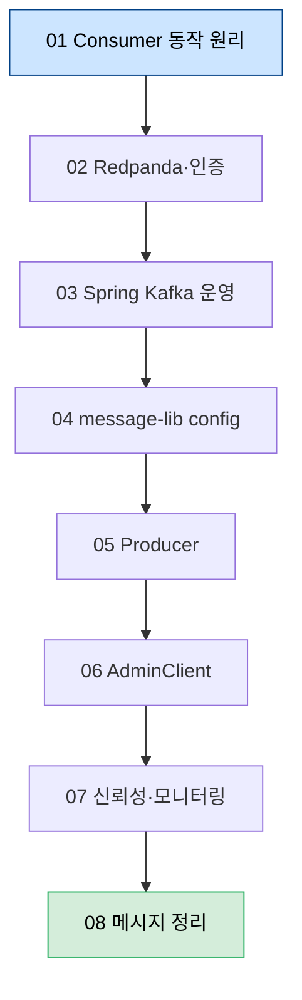

# 04_BrokerArchitecture — 브로커 아키텍처와 Spring Kafka 운영

---

> 큐 아키텍처·리더 선출·Consumer Group 같은 *브로커 도구 원리*와, Spring Kafka 측 *운영 디테일*(concurrency, Manual Ack, Batch Listener, config 5종, Producer, AdminClient, 신뢰성 검증)을 한 폴더에 함께 둔다. 같은 개념을 Kafka와 Redpanda가 어떻게 다르게 구현하는지도 곳곳에서 비교한다.

## 학습 흐름

> 01 Consumer 동작 원리부터 시작해 02 Redpanda·인증, 03 Spring Kafka 운영, 04 message-lib config, 05 Producer, 06 AdminClient, 07 신뢰성 검증으로 나아간다. 처음 읽을 때는 각 그룹의 첫 문서(`01-01`, `02-01` …)만 따라가도 골격이 잡힌다.

## 01. Consumer 동작 원리

> 분산 커밋 로그·리더 선출·Consumer Group 프로토콜부터 raw KafkaConsumer API(오프셋 커밋·poll 루프·종료·설정)까지 소비 측 동작 원리를 다룬다.

| 문서 | 범위 |
|------|------|
| [01-01.메시지 큐 아키텍처](01-01.메시지%20큐%20아키텍처.md) | 분산 커밋 로그·파티셔닝·복제/ISR·실무 설계, Kafka vs Redpanda 구현 비교 |
| [01-02.리더 선출](01-02.리더%20선출.md) | Raft 합의 프로토콜의 3가지 역할과 Write Path |
| [01-03.Consumer Group](01-03.Consumer%20Group.md) | 발행·소비 기본 구조, 그룹 프로토콜, 파티션 분배, 오프셋 추적 |
| [01-04.리밸런스 프로토콜](01-04.리밸런스%20프로토콜.md) | Stop-the-World vs 점진적 리밸런스, static membership ([시각화](01-04-rebalance.html)) |
| [01-05.오프셋 커밋 API](01-05.오프셋%20커밋%20API.md) | commitSync·commitAsync·지정 offset 커밋과 중복·유실 방향성 ([시각화](01-05-offset-commit.html)) |
| [01-06.Consumer poll 루프와 종료](01-06.Consumer%20poll%20루프와%20종료.md) | poll 루프·1 consumer per thread·seek·wakeup 종료 |
| [01-07.Consumer 설정 심화](01-07.Consumer%20설정%20심화.md) | fetch 크기·타임아웃·client.rack·오프셋 보존 |

## 02. Redpanda·인증

> 단일 바이너리·thread-per-core 같은 Redpanda 아키텍처와, Console UI·브로커 본체에 인증을 거는 두 평면을 다룬다.

| 문서 | 범위 |
|------|------|
| [02-01.Redpanda 아키텍처](02-01.Redpanda%20아키텍처.md) | 단일 바이너리·Raft per partition·thread-per-core |
| [02-02.Redpanda Console 인증](02-02.Redpanda%20Console%20인증.md) | 무료 라이선스에서 Console UI 앞에 게이트를 세우는 4가지 옵션 |
| [02-03.Kafka·Redpanda SASL 인증](02-03.Kafka·Redpanda%20SASL%20인증.md) | 브로커 본체에 SASL/ACL/TLS로 인증·인가 |

## 03. Spring Kafka 운영

> 공통 정책 starter·concurrency·Manual Ack·Batch Listener·다중 직렬화 같은 Spring Kafka 클라이언트 운영 디테일을 다룬다.

| 문서 | 범위 |
|------|------|
| [03-01.Kafka 공통 정책 스타터 패턴](03-01.Kafka%20공통%20정책%20스타터%20패턴.md) | retry·DLT·로그·메트릭 정책을 starter로 묶기 |
| [03-02.Spring Kafka 운영 고급](03-02.Spring%20Kafka%20운영%20고급.md) | Vertical scaling(`concurrency`), 런타임 컨슈머, blocking vs non-blocking retry |
| [03-03.Manual Ack와 Offset Commit 정책](03-03.Manual%20Ack와%20Offset%20Commit%20정책.md) | Auto commit vs Manual ack 결정 기준 |
| [03-04.Batch Listener와 부분 실패 처리](03-04.Batch%20Listener와%20부분%20실패%20처리.md) | 단건 vs Batch, 부분 실패 패턴 3가지 |
| [03-05.다중 직렬화 컨슈머 구성 3방식](03-05.다중%20직렬화%20컨슈머%20구성%203방식.md) | 한 앱에서 Avro·JSON 동시 소비: 빈 정의 / 어노테이션 / 설정 런타임 생성 |

## 04. message-lib config

> TPS `message-lib`의 config 다섯 클래스를 *정의 → 학습 검증 → 운영 이식* 순으로 익힌다. 04-01이 reference, 04-02가 Q&A·실습, 04-03이 이식 체크리스트다.

| 문서 | 범위 |
|------|------|
| [04-01.message-lib config 5개 클래스 종합](04-01.message-lib%20config%205개%20클래스%20종합.md) | config 다섯 클래스의 기동 순서·책임·상호작용 (reference) |
| [04-02.message-lib config 학습 검증](04-02.message-lib%20config%20학습%20검증.md) | 04-01 본문을 Q&A 10개와 실습 3개로 검증 |
| [04-03.message-lib config 운영 이식 가이드](04-03.message-lib%20config%20운영%20이식%20가이드.md) | 다른 프로젝트로 옮길 때의 결정 체크리스트 |

## 05. Producer

> send-path 파이프라인·전송 모드·파티셔너·Quota까지 발행 측 클라이언트 동작을 다룬다.

| 문서 | 범위 |
|------|------|
| [05-01.Producer 아키텍처](05-01.Producer%20아키텍처.md) | send-path 파이프라인과 ProducerRecord·RecordMetadata 해부 |
| [05-02.Producer 생성과 전송 모드](05-02.Producer%20생성과%20전송%20모드.md) | 3 필수 설정과 fire-and-forget·동기·비동기 전송, retriable 오류 구분 |
| [05-03.Producer 파티셔너](05-03.Producer%20파티셔너.md) | key 기반 매핑·sticky(2.4+)·사용자 정의 파티셔너, Consumer 할당과의 구분 |
| [05-04.Quota와 Throttling](05-04.Quota와%20Throttling.md) | produce·consume·request quota, 동적 설정과 throttling 동작 |

## 06. AdminClient

> 명령형 raw AdminClient로 토픽·설정·컨슈머 그룹·클러스터를 비동기로 관리하고, 고급 SRE 작업과 테스트까지 다룬다.

| 문서 | 범위 |
|------|------|
| [06-01.AdminClient 기초와 토픽 관리](06-01.AdminClient%20기초와%20토픽%20관리.md) | 비동기·결과적 일관성 설계, 생명주기, 토픽 list·describe·create·delete |
| [06-02.AdminClient 설정·컨슈머그룹·클러스터](06-02.AdminClient%20설정·컨슈머그룹·클러스터.md) | 설정 describe·수정, 컨슈머 그룹 offset·lag·reset, 클러스터 메타데이터 |
| [06-03.AdminClient 고급 작업과 테스트](06-03.AdminClient%20고급%20작업과%20테스트.md) | 파티션 추가·레코드 삭제·리더 선출·replica 재배치·MockAdminClient |

## 07. 신뢰성·모니터링

> 신뢰성을 시스템 속성으로 보는 framing과 3계층 검증, 그리고 infra·broker·client 메트릭 카탈로그와 배포환경별 모니터링을 다룬다.

| 문서 | 범위 |
|------|------|
| [07-01.신뢰성 검증과 모니터링](07-01.신뢰성%20검증과%20모니터링.md) | Kafka 4대 보장, VerifiableProducer/Consumer·Trogdor·Burrow·JMX 3계층 검증 |
| [07-02.Kafka 메트릭 카탈로그 — Infra·Broker](07-02.Kafka%20메트릭%20카탈로그%20—%20Infra·Broker.md) | infra 60% 임계, broker MBean(UnderReplicated·UnderMinIsr·NetworkProcessorAvgIdle·ActiveController), 모니터링 허브 |
| [07-03.Kafka 클라이언트·운영 모니터링](07-03.Kafka%20클라이언트·운영%20모니터링%20—%20Client·Streams·배포환경.md) | producer·consumer(lag/lead)·Connect·Streams 메트릭, alerting(06_observability 위임), 배포환경별 모니터링 |

## 08. 메시지 정리

> 쌓인 메시지를 브로커가 어떻게 정리하는지, log retention(나이 기반)·log compaction(키별 최신)·tombstone(선택 삭제)의 메커니즘을 다룬다.

| 문서 | 범위 |
|------|------|
| [08-01.메시지 정리 — Log Retention·Compaction·Tombstone](08-01.메시지%20정리%20—%20Log%20Retention·Compaction·Tombstone.md) | log cleaner의 세그먼트 단위 동작, retention.ms 7일 함정, dirty ratio·compaction lag, tombstone 삭제 |

## 관련 문서

> 이 폴더의 상위 인덱스와, 동선이 이어지는 형제 폴더를 연결한다.

- [04_messaging MOC](../README.md) — 메시징 영역 전체 인덱스와 학습 흐름
- [05_ConsistencyPattern](../05_ConsistencyPattern/) — Saga·Outbox·Inbox·EOS 같은 일관성 패턴 (브로커 위에서 도는 애플리케이션 패턴)
- [03_TopicDesign](../03_TopicDesign/) — 토픽 명명·파티션·키 선택 (브로커에 올리기 전 설계)
