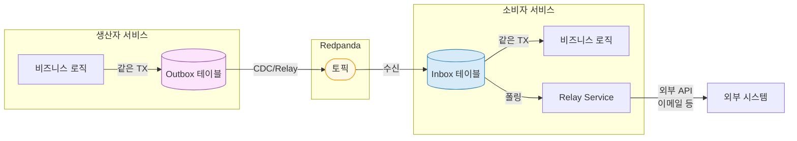
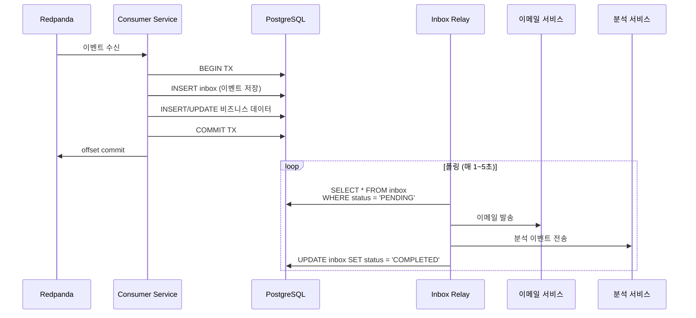
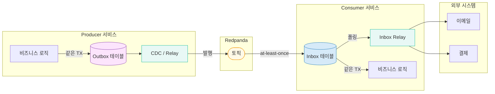

# Inbox(중복 처리 해결)

---

> Inbox 패턴은 *Consumer 측 멱등성*을 DB 트랜잭션 한 묶음으로 만든다. 메시지가 두 번 도착해도 같은 PK 위반으로 두 번째가 차단된다. Outbox(발행 측)와 거울처럼 대칭이라, 두 패턴을 함께 적용하면 *Kafka가 at-least-once만 약속해도 시스템 전체가 effectively-once*로 동작한다.


## 학습 목표

> Inbox 패턴이 *Outbox와 거울처럼 대칭*되는 이유와, Consumer 측 트랜잭션이 어떻게 멱등성을 만드는지 이해한다.

이 장을 다 읽고 다음 다섯 가지에 자신 있게 답할 수 있으면 학습이 완료된다.

1. Outbox·Inbox 대칭이 end-to-end 원자성을 어떻게 완성하는지 설명할 수 있다.
2. `(message_id, consumer_group)` PK가 PK 위반으로 멱등성을 만드는 메커니즘을 설명할 수 있다.
3. Inbox INSERT와 비즈니스 로직을 같은 transaction에 묶어야 하는 이유를 설명할 수 있다.
4. Idempotent Consumer와 Inbox 패턴의 미세한 차이를 설명할 수 있다.
5. CloudEvents `ce_id` 헤더를 message_id로 쓰는 이유를 말할 수 있다.


# Inbox(중복 처리 해결)

---

> DB 저장은 성공했지만, 이메일 발송이 실패하는등 "이벤트는 이미 소비되었는데 로직이 실행되지 않았다면 재시도할 방법이 없고, 이벤트가 소비되지 못했는데, 로직이 실행되었다면 중복 실행된다." 이를 해결하기 위해 Inbox 패턴을 사용합니다.

이벤트를 수신하면 먼저 Inbox 테이블에 저장하고, 후속 처리는 별도 Relay가 담당하게 합니다.

## Outbox와의 대칭

Outbox와 Inbox는 동일한 원리(DB 트랜잭션의 원자성 활용)를 생산자/소비자 측에 각각 적용한 대칭 패턴이다. 한 시스템에 둘 다 도입하면 end-to-end 원자성이 완성된다.



| 측면          | Outbox                                    | Inbox                                          |
| ------------- | ----------------------------------------- | ---------------------------------------------- |
| **위치**      | 생산자(Producer) 측                       | 소비자(Consumer) 측                            |
| **해결 문제** | DB 저장 + 이벤트 발행의 원자성            | 이벤트 수신 + 후속 처리의 원자성               |
| **핵심 원리** | 비즈니스 데이터와 이벤트를 같은 TX에 저장 | 수신 이벤트와 비즈니스 데이터를 같은 TX에 저장 |
| **전달 주체** | Debezium CDC 또는 Relay                   | Relay Service (폴링)                           |
| **정리 대상** | 발행 완료 레코드                          | 처리 완료 레코드                               |

| 상황                        | 패턴                               | 이유                      |
| --------------------------- | ---------------------------------- | ------------------------- |
| DB 저장 + Kafka 발행        | **Outbox**                         | 생산자의 dual write 해결  |
| 이벤트 수신 + 외부 API 호출 | **Inbox**                          | 소비자의 후속 처리 안정성 |
| 이벤트 수신 + DB 저장만     | Inbox 없이 **Idempotent Consumer** | 같은 DB TX에서 처리 가능  |
| 양쪽 모두                   | **Outbox + Inbox**                 | 완전한 end-to-end 원자성  |

Outbox 패턴 자체의 상세는 [05-03.Outbox](04-03.Outbox.md) 참조.

```java
@Transactional
@KafkaListener(topics = "order-events", groupId = "payment-service")
public void handleOrderEvent(ConsumerRecord<String, String> record) {
    JsonNode message = objectMapper.readTree(record.value());
    String eventId = message.get("id").asText();

    // 멱등성: event_id UNIQUE 제약으로 중복 INSERT 방지
    if (inboxRepository.existsByEventId(eventId)) return;

    // 1. Inbox에 저장 (같은 TX)
    inboxRepository.save(InboxEvent.builder()
            .eventId(eventId)
            .eventType(message.get("event_type").asText())
            .payload(message.get("payload"))
            .status(InboxStatus.PENDING)
            .retryCount(0)
            .maxRetries(3)
            .createdAt(Instant.now())
            .build());

    // 2. 핵심 비즈니스 로직도 같은 TX에서 처리
    orderService.processOrder(message);
}
```

```java
@Scheduled(fixedDelay = 2000)  // 2초마다 폴링
@Transactional
public void processInbox() {
    // 행 잠금으로 워커 간 중복 처리 방지
    List<InboxEvent> pending = inboxRepository
            .findPendingWithLock(50);  // LIMIT 50 FOR UPDATE SKIP LOCKED

    for (InboxEvent event : pending) {
        try {
            event.setStatus(InboxStatus.PROCESSING);
            dispatch(event);
            event.setStatus(InboxStatus.COMPLETED);
            event.setProcessedAt(Instant.now());
        } catch (Exception e) {
            event.setRetryCount(event.getRetryCount() + 1);
            if (event.getRetryCount() >= event.getMaxRetries()) {
                event.setStatus(InboxStatus.FAILED);  // DLQ 대상
                event.setErrorMessage(e.getMessage());
            } else {
                event.setStatus(InboxStatus.PENDING);  // 다음 폴링에서 재시도
            }
        }
        inboxRepository.save(event);
    }
}

private void dispatch(InboxEvent event) {
    switch (event.getEventType()) {
        case "order-created" -> {
            emailService.sendOrderConfirmation(event.getPayload());
            analyticsService.trackOrderCreated(event.getPayload());
        }
        // 다른 이벤트 타입 추가...
    }
}
```

Lock에 대해서 단일 인스턴스라면 단순 조회로 충분하지만, 인스턴스가 2개 이상이라면 FOR UPDATE SKIP LOCKED를 사용해서 트랜잭션이 잠근 행을 기다리지 않고 건너뛰게 해서 병렬처리를 하게 합니다.

```sql
SELECT * FROM inbox
WHERE status = 'PENDING'
ORDER BY created_at
LIMIT 50;

# 다중 인스턴스시 Lock 적용
SELECT * FROM inbox
WHERE status = 'PENDING'
ORDER BY created_at
LIMIT 50
FOR UPDATE SKIP LOCKED;
```

### 아키텍쳐



Inbox는 Outbox와 달리 CDC가 아닌 relay방식이 더 적합한데, 목적이 "수신한 이벤트를 기반으로 외부 시스템 호출"하는 것입니다. CDC는 DB 변경을 다른 Kafka 토픽으로 스트리밍할 뿐, 외부 API를 호출하지 않습니다.

- CDC로 Inbox INSERT를 감지하더라도 결국 이벤트를 소비하는 또 다른 Consumer가 필요해집니다.

### 테이블 설계

```sql
CREATE TABLE inbox (
    id UUID PRIMARY KEY DEFAULT gen_random_uuid(),
    event_id VARCHAR(255) NOT NULL UNIQUE,  -- 원본 이벤트 ID (멱등성 키)
    event_type VARCHAR(255) NOT NULL,
    payload JSONB NOT NULL,
    status VARCHAR(50) NOT NULL DEFAULT 'PENDING',  -- PENDING → PROCESSING → COMPLETED / FAILED
    retry_count INTEGER NOT NULL DEFAULT 0,
    max_retries INTEGER NOT NULL DEFAULT 3,
    error_message TEXT,
    created_at TIMESTAMP NOT NULL DEFAULT NOW(),
    processed_at TIMESTAMP
);

CREATE INDEX idx_inbox_status ON inbox(status) WHERE status = 'PENDING';
CREATE UNIQUE INDEX idx_inbox_event_id ON inbox(event_id);
```


## 1. Idempotent Consumer와 Inbox의 차이

>  Inbox 패턴과 Idempotent Consumer 패턴은 둘 다 "중복 처리 방지"를 다루지만 목적과 구조가 다릅니다.

```bash
Inbox:              수신 → DB에 메시지 저장 → (비동기) 폴러가 처리 → 완료 마킹
Idempotent Consumer: 수신 → 중복 확인 → 즉시 처리 → ID 마킹
```

### **Inbox 패턴**

메시지 본문(payload)을 DB에 저장하고 별도 폴러가 비동기로 처리합니다. 

- 수신 시점에 DB 트랜잭션으로 메시지를 확보하므로 Kafka offset commit이 실패해도 메시지가 유실되지 않습니다. 
- "수신 보장 + 멱등성"을 함께 제공하며, 외부 시스템 호출(이메일, 결제)처럼 실패 시 재시도가 필요한 후속 처리에 적합합니다.

**Idempotent Consumer**

메시지를 수신하면 즉시 비즈니스 로직을 실행하고, 처리 여부만 마커 테이블에 기록합니다. 

- 메시지 본문은 저장하지 않으며, 수신 보장은 Kafka의 at-least-once와 `@RetryableTopic` 같은 재시도 메커니즘에 위임합니다. 
- 구조가 단순하고 DB 저장 비용이 적어, 비즈니스 로직이 DB 내에서 완결되는 경우에 적합합니다.


### 멱등성 키 선택 — 복합 키 vs 범용 키

Idempotent Consumer에서 어떤 값을 멱등성 키로 쓰느냐에 따라 커버 범위가 달라집니다.

**복합 키 (correlationId, eventType)**

correlationId는 하나의 비즈니스 흐름(예: 주문 1건, 파이프라인 실행 1회)을 관통하는 추적 ID입니다. 

- 같은 흐름에서 여러 이벤트 타입이 발생하므로 eventType을 합쳐야 구분됩니다. 
- 문제는 같은 타입의 이벤트가 한 흐름에서 여러 번 발생하면(예: STEP_CHANGED가 스텝마다 발생) 첫 번째 이후가 전부 중복으로 무시된다는 점입니다. 
- stepOrder 같은 컬럼을 계속 추가해야 하므로 키 설계가 이벤트 구조에 종속됩니다.

**범용 키 `eventId`**

Outbox 패턴에서 발행하는 모든 메시지는 outbox 테이블의 auto-increment PK를 가집니다. 

- 이 값을 CloudEvents `ce_id` 헤더로 전달하면 컨슈머는 이벤트 구조를 몰라도 단일 컬럼으로 중복 검사가 가능합니다. 
- 이벤트 타입이 반복되든, 새로운 이벤트가 추가되든 멱등성 로직을 수정할 필요가 없습니다.

```sql
-- 범용 키 테이블
CREATE TABLE processed_event (
    event_id VARCHAR(100) NOT NULL PRIMARY KEY,
    processed_at TIMESTAMP NOT NULL DEFAULT NOW()
);

-- 컨슈머 멱등성 검사
SELECT EXISTS(SELECT 1 FROM processed_event WHERE event_id = #{eventId});
INSERT INTO processed_event (event_id, processed_at) VALUES (#{eventId}, NOW())
ON CONFLICT (event_id) DO NOTHING;
```

| 방식    | 키                          | 장점                          | 단점                              |
| ------- | --------------------------- | ----------------------------- | --------------------------------- |
| 복합 키 | (correlationId, eventType)  | Outbox 없이도 사용 가능       | 동일 타입 반복 시 추가 컬럼 필요  |
| 범용 키 | eventId (Outbox PK / ce_id) | 이벤트 구조 무관, 수정 불필요 | Outbox처럼 고유 ID 발급 체계 필요 |

Outbox 패턴을 사용한다면 범용 키가 단순하고 안전합니다. 복합 키는 Outbox 없이 이벤트 ID가 보장되지 않는 환경에서의 차선책입니다.


## 2. Preemptive Acquire 패턴

> 앞선 코드에서 `existsByEventId(eventId)`로 중복을 검사하는 부분에는 TOCTOU(Time-of-Check-to-Time-of-Use) 경쟁 조건이 숨어 있습니다. 
>
> - 두 Consumer 스레드가 동시에 같은 `eventId`를 조회하면 둘 다 "존재하지 않음"을 받고, 둘 다 INSERT를 시도합니다. 
> - UNIQUE 제약 조건이 있으면 한쪽에서 예외가 발생하는데, 이 예외가 Hibernate 세션을 오염시켜 같은 트랜잭션 내 후속 쿼리까지 실패할 수 있습니다.

**Preemptive Acquire**는 조회와 삽입을 하나의 원자적 SQL로 합치는 방식입니다.

```java
public interface InboxRepository extends JpaRepository<InboxEvent, UUID> {

    @Modifying
    @Query(value = """
        INSERT INTO inbox (id, event_id, event_type, payload, status, retry_count, max_retries, created_at)
        SELECT gen_random_uuid(), :eventId, :eventType, :payload::jsonb, 'PENDING', 0, 3, NOW()
        WHERE NOT EXISTS (
            SELECT 1 FROM inbox WHERE event_id = :eventId
        )
        """, nativeQuery = true)
    int insertIfAbsent(
            @Param("eventId") String eventId
            , @Param("eventType") String eventType
            , @Param("payload") String payload
    );
}
```

- `INSERT...WHERE NOT EXISTS` 네이티브 쿼리를 사용하면 DB 수준에서 중복을 차단하면서도 예외를 발생시키지 않습니다. 
- 반환값이 1이면 신규 삽입 성공, 0이면 이미 처리된 이벤트입니다.

Listener 코드에서는 반환값만 확인하면 됩니다. 예외가 발생하지 않으므로 트랜잭션이 rollback-only로 마킹될 위험이 없고, 같은 트랜잭션 안에서 비즈니스 로직을 안전하게 이어갈 수 있습니다.

```java
@Transactional
@KafkaListener(topics = "order-events", groupId = "payment-service")
public void handleOrderEvent(ConsumerRecord<String, String> record) {
    JsonNode message = objectMapper.readTree(record.value());
    String eventId = message.get("id").asText();

    int inserted = inboxRepository.insertIfAbsent(
            eventId
            , message.get("event_type").asText()
            , message.get("payload").toString()
    );
    if (inserted == 0) return;  // 이미 처리된 이벤트

    orderService.processOrder(message);
}
```

- `existsByEventId()` 방식과 비교하면 차이가 명확합니다. check-then-insert는 SELECT와 INSERT 사이에 시간 간격이 있어 동시 요청이 끼어들 수 있지만, `insertIfAbsent()`는 단일 SQL 실행이므로 DB 엔진이 원자성을 보장합니다. 
- 동시성 테스트에서 5개 스레드가 같은 `eventId`로 동시에 호출해도 정확히 1개만 삽입에 성공하는 것을 검증할 수 있습니다.


## 3. Offset 커밋 전략

> Kafka Consumer가 메시지를 수신한 뒤 offset 커밋과 Inbox INSERT의 순서에 따라 장애 시 결과가 달라집니다. 
>
> - 이 순서를 잘못 설계하면 메시지 유실이나 무한 중복이 발생할 수 있으므로, Inbox 패턴에서 offset 전략은 핵심 설계 결정입니다.

### offset 먼저 커밋하는 경우

offset을 먼저 커밋하고 Inbox에 저장하는 순서에서는, offset 커밋 후 Inbox INSERT 전에 프로세스가 크래시하면 해당 메시지가 영구 유실됩니다. Kafka 입장에서는 이미 소비 완료된 offset이므로 리밸런싱 후에도 다시 전달하지 않습니다. Inbox에는 레코드가 없으니 Relay도 처리할 수 없는 사각지대가 생깁니다.

### Inbox 먼저 저장하는 경우

Inbox INSERT를 먼저 수행하고 offset을 나중에 커밋하면, INSERT 성공 후 offset 커밋 전에 크래시가 발생했을 때 Kafka는 같은 메시지를 다시 전달합니다. 이때 Inbox 테이블의 `event_id` UNIQUE 제약이 중복 INSERT를 차단하므로 메시지가 두 번 처리되지 않습니다. 유실 없이 중복만 발생하고, 그 중복마저 멱등성 키가 흡수하는 구조입니다.

Inbox 패턴에서는 **"Inbox 먼저 저장 + 멱등성으로 중복 방어"**가 정답입니다. 이를 위해 Spring Kafka의 `enable.auto.commit`을 `false`로 설정하고, `AckMode.RECORD`로 메시지 단위 수동 커밋을 사용합니다. Listener 메서드가 정상 반환한 후에만 offset이 커밋되므로, Inbox INSERT와 비즈니스 로직이 모두 성공한 시점에서 offset이 전진합니다.

```yaml
spring:
  kafka:
    consumer:
      enable-auto-commit: false
    listener:
      ack-mode: record
```

- 정리하면, at-least-once 전달과 Inbox의 UNIQUE 제약이 조합되어 "최소 한 번 수신, 정확히 한 번 저장"을 달성합니다. 
- offset이 커밋되지 않아 중복 수신이 발생해도 `insertIfAbsent()`가 0을 반환하며 조용히 무시합니다.


## 4. Relay 트랜잭션 범위 설계

> 앞선 코드의 `processInbox()` 메서드는 전체를 `@Transactional`로 감싸고 있습니다. 이 구조에는 Outbox의 `pollAndPublish()`와 동일한 함정이 있으며, Inbox Relay에서는 외부 API 호출이 포함되므로 문제가 더 심각합니다.

### 전체 트랜잭션의 문제

50건 처리 중 30번째 이벤트에서 DB 예외가 발생하면, 이미 호출된 E1~E29의 이메일 발송은 회수할 수 없습니다. 

- DB 롤백으로 E1~E29의 상태가 PENDING으로 되돌아가면 다음 폴링에서 이메일이 중복 발송됩니다. 
- Outbox Relay는 Kafka send만 하므로 Consumer 측 멱등성으로 방어할 수 있지만, Inbox Relay의 이메일 발송은 수신자가 같은 메일을 여러 번 받게 되는 실질적 문제를 일으킵니다.

### 이벤트별 트랜잭션 분리

해결책은 Outbox의 3절(트랜잭션 범위 설계)과 동일합니다. `@Transactional`을 메서드에서 제거하고 `TransactionTemplate`으로 이벤트마다 개별 트랜잭션 경계를 제어합니다.

```java
@Scheduled(fixedDelay = 2000)
public void processInbox() {
    List<InboxEvent> pending = txTemplate.execute(status ->
            inboxRepository.findPendingWithLock(50));
    if (pending == null || pending.isEmpty()) return;

    for (InboxEvent event : pending) {
        try {
            dispatch(event);  // 외부 API 호출 (이메일, 분석 등)
            txTemplate.executeWithoutResult(status -> {
                event.setStatus(InboxStatus.COMPLETED);
                event.setProcessedAt(Instant.now());
                inboxRepository.save(event);
            });
        } catch (Exception e) {
            txTemplate.executeWithoutResult(status -> {
                event.setRetryCount(event.getRetryCount() + 1);
                if (event.getRetryCount() >= event.getMaxRetries()) {
                    event.setStatus(InboxStatus.FAILED);
                    event.setErrorMessage(e.getMessage());
                } else {
                    event.setStatus(InboxStatus.PENDING);
                }
                inboxRepository.save(event);
            });
        }
    }
}
```

- 이 구조에서 E30이 실패해도 E1~E29의 COMPLETED 상태는 이미 개별 커밋되었으므로 롤백되지 않습니다. 
- trade-off가 하나 있는데, `dispatch()` 성공 후 `COMPLETED` 마킹 DB 커밋이 실패하면 다음 폴링에서 외부 API가 재호출됩니다. 
- 따라서 외부 API 호출 자체도 멱등하게 설계하거나, 외부 시스템이 중복 요청을 허용하는지 확인해야 합니다.


## 5. 프로덕션 고려사항

> 기본 구현을 프로덕션에 배포하기 전에 검토해야 할 항목이 있습니다. Outbox의 프로덕션 고려사항과 대칭되는 부분이 많지만, Inbox 고유의 차이도 존재합니다.

### 재시도 지수 백오프

실패한 이벤트가 매 폴링 주기(2초)마다 즉시 재시도되면, 외부 API 장애처럼 복구에 시간이 필요한 상황에서 `maxRetries`가 빠르게 소진됩니다. Outbox와 동일하게 `next_retry_at` 컬럼을 추가하고 `1초 x 2^retryCount`로 간격을 늘리면, 복구 가능한 이벤트가 FAILED로 전이되는 것을 방지할 수 있습니다.

```sql
ALTER TABLE inbox ADD COLUMN next_retry_at TIMESTAMP;

UPDATE inbox
SET retry_count = retry_count + 1
    , next_retry_at = NOW() + INTERVAL (POWER(2, retry_count)) SECOND
WHERE id = #{id};
```

조회 쿼리에도 백오프 시간이 지나지 않은 이벤트를 건너뛰는 조건을 추가합니다:

```sql
SELECT * FROM inbox
WHERE status = 'PENDING'
  AND (next_retry_at IS NULL OR next_retry_at <= NOW())
ORDER BY created_at
LIMIT 50
FOR UPDATE SKIP LOCKED;
```

### 메트릭과 모니터링

PENDING 큐 깊이, 처리 성공/실패 횟수, FAILED 이벤트 발생을 모니터링할 수 없으면 장애 인지가 늦어집니다. Micrometer Counter/Gauge를 추가하면 Grafana 대시보드와 알림 연동이 가능합니다. Inbox Relay의 핵심 메트릭은 네 가지입니다:

- `inbox.events.processed` — 처리 성공 카운터
- `inbox.events.failed` — 처리 실패 카운터
- `inbox.events.dead` — FAILED 전이 카운터 (maxRetries 초과)
- `inbox.queue.pending` — PENDING 큐 깊이 게이지

Outbox의 `outbox.events.published`와 대칭되는 구조입니다. PENDING 게이지가 지속적으로 증가하면 Relay 처리 속도가 유입 속도를 따라가지 못한다는 신호이므로, 폴링 간격 단축이나 인스턴스 확장을 검토해야 합니다.

### COMPLETED 레코드 정리

COMPLETED 상태의 레코드가 무한히 쌓이면 테이블 크기가 증가하고, Partial Index(`WHERE status = 'PENDING'`)의 효율도 점차 떨어집니다. 별도 `@Scheduled` 메서드로 일 1회 정리 작업을 수행하되, 보존 기간은 Kafka retention보다 길게 설정합니다. Kafka retention이 7일이라면 14일 이상을 권장하는데, 장애 조사 시 Kafka 메시지와 Inbox 레코드를 대조해야 할 수 있기 때문입니다.

```sql
DELETE FROM inbox
WHERE status = 'COMPLETED'
  AND processed_at < NOW() - INTERVAL '14 days'
LIMIT 1000;
```

`LIMIT 1000`으로 배치 삭제하는 이유는 한 번에 수만 건을 삭제하면 테이블 락이 길어져 Relay 폴링에 영향을 줄 수 있기 때문입니다.

### Partial Index 최적화

Inbox 테이블에서 Relay가 조회하는 대상은 항상 `status = 'PENDING'`인 레코드뿐입니다. 테이블에 수십만 건의 COMPLETED 레코드가 쌓여 있어도 Partial Index가 PENDING 레코드만 인덱싱하므로 인덱스 크기가 작게 유지됩니다. 앞선 테이블 설계의 `idx_inbox_status`가 이미 이 구조를 적용하고 있습니다.

```sql
-- 이미 존재하는 인덱스 (테이블 설계 섹션 참고)
CREATE INDEX idx_inbox_status ON inbox(status) WHERE status = 'PENDING';
```


## 6. Outbox + Inbox End-to-End

> Outbox와 Inbox는 Pat Helland의 *Life Beyond Distributed Transactions*(2007)에서 제시한 동일한 원리를 생산자/소비자 측에 각각 적용한 대칭 패턴입니다. 
>
> - Helland의 핵심 주장은 "메시지를 엔티티 내부에 저장하고, 별도 메커니즘이 전달한다"는 것입니다.
> - Outbox 테이블과 Inbox 테이블이 바로 그 "엔티티 내부 저장소"에 해당합니다.

### End-to-End 흐름

Producer가 비즈니스 데이터와 Outbox 레코드를 같은 트랜잭션으로 커밋하면, CDC 또는 Polling Relay가 Outbox를 읽어 브로커로 발행합니다. Consumer는 브로커에서 메시지를 수신하면 Inbox 테이블에 저장하고 offset을 커밋합니다. Inbox Relay가 PENDING 레코드를 폴링하여 외부 API를 호출하고 COMPLETED로 전이합니다.



- 이 흐름에서 at-least-once 의미론이 양단에서 작동합니다. 
- Outbox 측에서는 CDC/Relay가 발행에 실패하면 레코드가 PENDING으로 남아 다음 주기에 재발행합니다. 
- Inbox 측에서는 offset 커밋이 실패하면 Kafka가 메시지를 재전달하지만, `event_id` UNIQUE 제약이 중복 INSERT를 차단합니다. 양쪽 모두 "최소 한 번 전달, 정확히 한 번 처리"를 달성합니다.

### Inbox가 필요한 경우와 불필요한 경우

모든 Consumer에 Inbox가 필요한 것은 아닙니다. 핵심 판단 기준은 "후속 처리에 외부 시스템 호출이 포함되는가"입니다. 비즈니스 로직이 DB 내에서 완결되면 Consumer의 `@Transactional` 메서드 안에서 처리 완료와 멱등성 마킹을 원자적으로 수행할 수 있으므로 Idempotent Consumer만으로 충분합니다.

반면 이메일 발송, 결제 API 호출, 외부 분석 서비스 전송처럼 DB 트랜잭션 밖의 부수 효과가 있을 때 Inbox가 필요합니다. 이런 호출은 실패 시 재시도해야 하고, DB 롤백으로 회수할 수 없으므로, 수신 시점에 메시지를 확보해 두고 별도 Relay가 안전하게 처리하는 구조가 적합합니다.

선택 기준을 정리하면 다음과 같습니다:

- **Idempotent Consumer로 충분한 경우**: 이벤트 수신 → DB 상태 갱신(INSERT/UPDATE)으로 완결되는 로직. 예를 들어 재고 차감, 주문 상태 변경, 사용자 프로필 동기화처럼 단일 DB 트랜잭션 안에서 처리와 멱등성 마킹이 함께 커밋되는 경우입니다.
- **Inbox가 필요한 경우**: 이벤트 수신 후 외부 API 호출이 포함된 로직. 예를 들어 주문 확인 이메일, 결제 게이트웨이 호출, 외부 분석 서비스 전송처럼 실패 시 재시도가 필요하고 DB 롤백으로 회수 불가능한 부수 효과가 있는 경우입니다.
- **Outbox + Inbox 양쪽 모두**: Producer가 DB 저장과 이벤트 발행의 원자성을 보장해야 하고, Consumer도 외부 API 호출의 안정성을 보장해야 하는 경우입니다. 완전한 end-to-end 원자성이 필요한 결제, 정산 도메인에서 주로 사용합니다.


---

> **TPS 적용 사례** — `okestro/tps-gitlab2` (PoC 도입 진행 중)
>
> - **상태**: example 모듈(`ExampleMessageConsumer`, `MultiRecordExampleConsumer`) PoC에 `TB_TRB_OX_002` 멱등 테이블 + `IdempotencyGuard` 헬퍼 도입. 운영 핸들러는 검증 후 확장.
> - **테이블**: `TB_TRB_OX_002` — PK `(MSG_ID, CONSUMER_GROUP)`. `MSG_ID`는 CloudEvents `ce_id` 헤더(= `TB_TRB_OX_001.OX_ID`). INSERT-only 라이프사이클이라 `MDFCN_DT`/`MDFR_ID` 미포함.
> - **헬퍼**: `message-lib/.../application/inbox/IdempotencyGuard.java` — `@Transactional(MANDATORY)`로 호출자 트랜잭션 강제. 호출자 핸들러에 `@Transactional` 누락 시 즉시 예외.
> - **상세**: 본 시리즈의 [`04-08.Exactly-once 의미론과 Consumer Idempotency`](04-09.Exactly-once%20의미론과%20Consumer%20Idempotency.md), TPS 코드 측 계획은 `message-lib/docs/inbox-idempotency-plan.md`.
