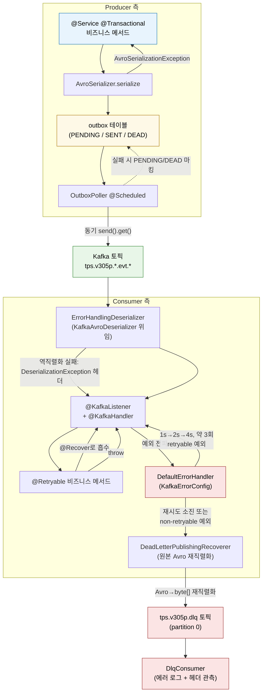

# Kafka 예외 처리를 한 장에서 보기

---

> *이 글은 TPS `message-lib`가 Kafka 실패를 어떻게 처리하는지 한 장에서 모두 보이게 만든 통합 가이드다. `KafkaErrorConfig`를 중심에 두고, 그 주변에 흩어진 컨셉들(`@Retryable`, `@RetryableTopic`, `@DltHandler`, `ErrorHandlingDeserializer`, Outbox 상태머신, `DlqConsumer`)이 어디에서 어떻게 맞물리는지 한 줄로 잇는다. 다섯 보조 문서의 결론을 한곳에 모아 운영 의사결정용 단일 참조로 만들기 위해 쓴다.*

흩어진 문서들에서 같은 부품이 반복해서 등장한다. `03-01`가 `KafkaErrorConfig`의 정체를 가장 깊이 다루고, `03-02`가 그 끝단인 `DlqConsumer`를 다루며, `02-05`가 Avro 역직렬화 실패가 어떻게 즉시 DLQ로 가는지 보여준다. `05-01`은 Blocking vs Non-blocking retry의 선택 기준을 다루고, *상위* `../03-04` 는 한 토픽에 여러 record를 부었을 때 옵션 C 컨슈머가 운영 안전망 안에 들어와 있다고 말한다 (혼동 주의 — `spring/03-04` 는 KafkaErrorConfig 사고 회고이고, *상위* `../03-04` 가 다중 record 패턴). 다섯 문서가 서로의 결론을 참조하지만 한 장에 모인 적은 없었다. 이 글이 그 모음이다.


## 한눈에 보는 전체 파이프라인

> 이 그림 하나로 시작한다. Producer에서 메시지가 토픽에 들어가고, Consumer가 그것을 받아 처리하다 실패하면 어디로 가는지 — 다섯 보조 문서의 모든 부품이 한 그림 안에 있다.



이 그림이 말하는 핵심은 둘이다. 

1. 첫째, **Producer 측 실패와 Consumer 측 실패가 다른 통로**로 처리된다. Producer 측은 outbox 테이블 상태(`PENDING`/`SENT`/`DEAD`)로 관리되고, Consumer 측만 Kafka DLQ로 간다. 
2. 둘째, **Consumer 측 안전망은 두 겹**이다. `ErrorHandlingDeserializer`가 listener 진입 전 역직렬화 실패를 잡고, `DefaultErrorHandler`가 listener 진입 후 실패를 잡는다. 이 두 겹이 합쳐져 "역직렬화 실패는 즉시 DLQ, 비즈니스 예외는 재시도 후 DLQ" 정책이 한 흐름으로 동작한다.


## 부품 카탈로그

> 이름이 비슷한 다섯 가지(`@Retryable`, `@RetryableTopic`, `@DltHandler`, `DefaultErrorHandler`, `KafkaErrorConfig`)가 한 시스템 안에 같이 등장한다. 어느 계층에 사는 누구인지 먼저 분리한다.

| 부품 | 계층 | 책임 | TPS 사용 여부 |
|---|---|---|---|
| `@Retryable` (Spring Retry) | 비즈니스 메서드 AOP | 메서드 호출을 N회 재시도 | 선택적 사용 가능 (외부 API 짧은 흔들림 흡수) |
| `@Recover` (Spring Retry) | 비즈니스 메서드 AOP | `@Retryable` 최종 실패의 fallback | `@Retryable`과 짝 |
| `DefaultErrorHandler` (Spring Kafka) | 리스너 컨테이너 | 레코드 처리 실패의 retry + recoverer 진입 | **`KafkaErrorConfig`로 등록 — 전역 표준** |
| `DeadLetterPublishingRecoverer` (Spring Kafka) | 리스너 컨테이너 | retry 소진 시 DLT/DLQ 토픽으로 발행 | **`KafkaErrorConfig` 내부에서 사용** |
| `ErrorHandlingDeserializer` (Spring Kafka) | deserializer | 역직렬화 실패를 헤더로 변환해 listener까지 정상 흐름 유지 | 권장 (현재 도입 단계) |
| `@RetryableTopic` (Spring Kafka) | 메서드 어노테이션 | retry topic 체인 + DLT를 선언적으로 자동 생성 | **Command 컨슈머에서 사용 중** (`Build`/`Deploy`/`Test`Consumer). 글로벌 `DefaultErrorHandler`와 *별도 경로*로 동작 — 상세는 [03-04 §4](04-13.KafkaErrorConfig%20DLT%20헤더%20폭증%20사고.md) |
| `@DltHandler` (Spring Kafka) | 메서드 어노테이션 | `@RetryableTopic`이 만든 DLT 토픽의 핸들러 | `@RetryableTopic`과 짝. `@Header(required=true)` 인자가 헤더 누락 시 throw하면 retry 사이클 재진입 위험 — 03-04 사례 |
| `DlqConsumer` (TPS message-lib) | 애플리케이션 컨슈머 | DLQ 토픽 끝단에서 로그·관측 | **현재 미배포** (관측은 알람·외부 시스템으로 위임) |

- 다섯 부품이 같은 영역에 있지만 계층이 모두 다르다. `@Retryable`은 메서드 호출의 재시도이고, `DefaultErrorHandler`는 Kafka 레코드의 재시도이며, `@RetryableTopic`은 토픽 자체의 재시도다. 
- 이 세 계층이 직렬화 실패 처리(`ErrorHandlingDeserializer`)와 끝단 관측(`DlqConsumer`)으로 둘러싸여 한 시스템을 이룬다.


## `KafkaErrorConfig` 한 클래스 들여다보기

> `message-lib`의 `KafkaErrorConfig` 한 클래스가 전체 정책의 90%를 결정한다. 코드 자체는 한 화면이고, 그 안에 들어 있는 결정들이 운영 정책을 정한다.
>
> **1차 소스**: 라인 단위 정독 + 운영 사고 회고는 [03-04 §2](04-13.KafkaErrorConfig%20DLT%20헤더%20폭증%20사고.md). 본 절은 다섯 결정의 *요약*만 둔다.

`message-lib/src/main/java/org/okestro/tps/messaging/config/KafkaErrorConfig.java`의 핵심을 발췌하면 다음과 같다.

```java
// KafkaErrorConfig.java
@AutoConfiguration
public class KafkaErrorConfig {

    @Bean
    public CommonErrorHandler kafkaErrorHandler(
            KafkaTemplate<String, byte[]> kafkaTemplate
            , ObjectProvider<AvroSerializer> avroSerializerProvider
    ) {
        AvroSerializer avroSerializer = avroSerializerProvider.getIfAvailable();

        DeadLetterPublishingRecoverer recoverer = new DeadLetterPublishingRecoverer(
                kafkaTemplate
                , (record, ex) -> new TopicPartition(Topics.DLQ.getValue(), 0)
        ) {
            @Override
            protected ProducerRecord<Object, Object> createProducerRecord(
                    ConsumerRecord<?, ?> record
                    , TopicPartition topicPartition
                    , Headers headers, byte[] key, byte[] value
            ) {
                Object originalValue = record.value();
                if (originalValue instanceof SpecificRecord specificRecord
                        && avroSerializer != null) {
                    byte[] avroBytes = avroSerializer.serialize(
                            topicPartition.topic(), specificRecord);
                    return super.createProducerRecord(
                            record, topicPartition, headers, key, avroBytes);
                }
                return super.createProducerRecord(
                        record, topicPartition, headers, key, value);
            }
        };

        ExponentialBackOff backOff = new ExponentialBackOff(1000L, 2.0);
        backOff.setMaxElapsedTime(7000L);  // 1s → 2s → 4s, 약 3회

        DefaultErrorHandler errorHandler = new DefaultErrorHandler(recoverer, backOff);
        errorHandler.addNotRetryableExceptions(
                IllegalArgumentException.class
                , AvroSerializationException.class
                , DeserializationException.class
        );
        return errorHandler;
    }
}
```

이 한 클래스에 들어 있는 다섯 가지 결정을 풀어 본다.

### 결정 1 — DLQ 토픽은 `tps.v305p.dlq` 단일, 파티션은 0 고정

모든 실패 메시지가 `Topics.DLQ.getValue()`(`tps.v305p.dlq`)의 0번 파티션으로 모인다. 

- 장점은 **알람 룰이 단순**해진다는 점이다. 컨슈머·운영자가 한 토픽만 보면 모든 실패가 보이고, DLQ lag 임계치를 1로 잡아 두면 한 건만 들어와도 알림을 받는다. 
- 단점은 **실패량이 많아지면 0번 파티션이 병목**이 된다는 점이다. 이 트레이드오프는 `03-01`와 `03-02` 두 문서가 모두 "작은 시스템에는 맞지만 규모가 커지면 토픽별·원본 파티션별 분리가 필요하다"고 정리해 둔 부분이다.

### 결정 2 — 재시도는 1s → 2s → 4s 지수 백오프, 최대 7초

`ExponentialBackOff(1000L, 2.0)` + `setMaxElapsedTime(7000L)`이 만드는 시퀀스가 1초·2초·4초로 약 3회다.

- 이 정책은 **모든 리스너에 같이 적용되는 전역 정책**이다. 토픽별로 다르게 가져가려면 `@RetryableTopic`을 쓰거나 토픽별 container factory를 따로 만들어야 한다.
- 곡선 선택의 근거(Fixed/Exponential/WithMaxRetries 비교, jitter, 외부 시스템 자가 회복 시간) 는 [03-05.Backoff 전략 비교와 선택](04-14.Backoff%20전략%20비교와%20선택.md) 이 1차 소스.

### 결정 3 — 재시도 안 하는 예외 셋

`addNotRetryableExceptions`에 세 가지가 등록되어 있다.

- `IllegalArgumentException` — 잘못된 인자는 재시도해도 같은 결과다.
- `AvroSerializationException` — Avro 직렬화 실패는 바이트 그대로 다시 시도해도 동일하다.
- `DeserializationException` — `ErrorHandlingDeserializer`가 변환해 listener에 전달하는 역직렬화 실패 신호다.

이 셋은 **백오프를 건너뛰고 즉시 recoverer로** 간다. 컨슈머 무한루프 방지가 핵심이다. `02-05`가 이 부분을 "역직렬화 실패는 즉시 DLQ"로 정리해 둔 정책의 코드 근거가 여기에 있다.

### 결정 4 — Avro 객체를 byte[]로 재직렬화해 DLQ 발행

`createProducerRecord`를 오버라이드한 이유가 여기에 있다. 

- 컨슈머가 이미 `SpecificRecord`로 역직렬화한 객체를 그대로 DLQ로 보내면 `KafkaTemplate<String, byte[]>`의 `ByteArraySerializer`가 `ClassCastException`을 던진다. 
- AvroSerializer`로 schema-registry 기반 byte[]로 재직렬화한 뒤 발행한다. **`avroSerializer`가 빈으로 등록되어 있지 않으면 원본 byte[] 그대로 발행**하는 fallback도 같이 들어 있어, message-lib만 단독 사용하는 환경에서도 깨지지 않는다.

### 결정 5 — `@AutoConfiguration`으로 라이브러리에서 자동 등록

`@AutoConfiguration` 어노테이션이 붙어 있어 `META-INF/spring.factories` 또는 `AutoConfiguration.imports`에 등록되면 message-lib를 의존하는 모든 모듈에 자동 적용된다. 

- 즉 **operator/executor/notificator 어느 모듈을 띄워도 같은 retry/DLQ 정책**이 켜진다. 모듈별로 다른 정책이 필요해지는 순간이 곧 자동 설정을 꺼야 하는 시점이다.


## Producer 측 안전망 — Outbox 상태머신

> Producer 측 실패는 Kafka DLQ에 가지 않는다. DB outbox 테이블의 상태값으로 관리된다. 두 안전망이 어떻게 갈라지는지를 분명히 한다.
>
> **1차 소스**: outbox 패턴 일반론 + 상태 전이 다이어그램 + 폴러 동작은 상위 [../05-03.Outbox](04-03.Outbox.md) 가 정본. 본 절은 *Consumer 측 DLQ 흐름과의 경계*만 짚는다.

`OutboxPoller`가 outbox 테이블을 폴링해 Kafka로 발행한다. 각 row는 다음 상태를 갖는다.

- `PENDING` — 비즈니스 트랜잭션에서 생성됨. 아직 발행 안 됨.
- `PROCESSING` — OutboxPoller가 골라 발행 시도 중.
- `SENT` — Kafka 발행 성공.
- `DEAD` — 발행 N회 재시도 후 영구 실패.

핵심은 **비즈니스 트랜잭션 안에서 outbox row를 만든다**는 점이다. 

- `AvroSerializer.serialize` 호출이 트랜잭션 안에서 실행되며, Avro 직렬화가 실패하면 `AvroSerializationException`이 던져져 **outbox row 자체가 만들어지지 않고 트랜잭션이 롤백**된다. 
- 이 점이 outbox 패턴이 직렬화 실패에 대해 가지는 가장 큰 미덕이다 — *부분 실패 상태를 만들지 않는다*. 직렬화 실패 흔적은 애플리케이션 로그와 호출자 응답에만 남고, outbox 테이블에는 row가 없으며, Kafka 토픽에도 메시지가 없고, OutboxPoller가 재시도할 대상도 없다.

발행 단계(`PENDING → PROCESSING → SENT`)에서 실패하면 `OutboxPoller`가 row를 다시 `PENDING`으로 돌리거나 N회 초과 시 `DEAD`로 마킹한다. 

여기는 Kafka DLQ가 개입할 여지가 없다 — 애초에 토픽에 도달하지 못한 메시지이기 때문이다. `DEAD` 상태 row의 운영은 DB 쿼리·재처리 잡으로 다루며, DLQ 컨슈머의 책임이 아니다.


## Consumer 측 안전망 — 두 겹의 방어선

> Consumer 측은 두 겹이다. 역직렬화 실패는 첫째 겹이 잡고, 비즈니스 예외는 둘째 겹이 잡는다. 두 겹의 결과는 같은 DLQ 토픽으로 합류한다.

### 첫째 겹 — `ErrorHandlingDeserializer`

listener 진입 이전에 역직렬화를 시도한다. 실제 역직렬화는 `KafkaAvroDeserializer`가 위임받아 수행하고, 그 호출을 `ErrorHandlingDeserializer`가 try/catch로 감싼다. 실패 시 listener에 `null` payload + 헤더에 직렬화된 `DeserializationException`을 담아 정상 흐름으로 전달한다.

```yaml
# application.yml
spring:
  kafka:
    consumer:
      key-deserializer: org.springframework.kafka.support.serializer.ErrorHandlingDeserializer
      value-deserializer: org.springframework.kafka.support.serializer.ErrorHandlingDeserializer
    properties:
      spring.deserializer.key.delegate.class: org.apache.kafka.common.serialization.StringDeserializer
      spring.deserializer.value.delegate.class: io.confluent.kafka.serializers.KafkaAvroDeserializer
      schema.registry.url: ${SCHEMA_REGISTRY_URL}
```

이 한 겹을 두는 이유는 두 가지다.

1. **컨슈머 스레드가 예외로 죽지 않는다**. 역직렬화 예외가 그대로 던져지면 일부 환경에서 컨슈머 thread가 멈출 수 있다. 
2. 둘째, **listener에서 raw bytes에 직접 접근**해 진단 로직을 짤 수 있다 — payload 첫 5바이트의 magic byte와 Schema ID를 직접 확인해 "어느 버전의 Producer가 보낸 것인가"를 즉시 판별할 수 있다.

Spring Kafka가 이 헤더를 자동으로 인지해 listener에서 헤더를 throw하지 않더라도 `DeserializationException`을 재발생시켜 둘째 겹으로 보낸다. 그래서 첫째 겹과 둘째 겹이 자연스럽게 연결된다.

### 둘째 겹 — `DefaultErrorHandler` (`KafkaErrorConfig`)

listener가 예외를 던지면 이 핸들러가 받는다. 분기는 두 갈래다.

- **재시도 가능 예외** — 1s → 2s → 4s 지수 백오프로 같은 컨테이너에서 같은 offset 재처리. 이 동안 같은 파티션의 *그 뒤 메시지*는 처리되지 못한다(blocking retry).
- **재시도 불가능 예외**(`IllegalArgumentException`, `AvroSerializationException`, `DeserializationException`) 또는 **재시도 소진** — 즉시 `DeadLetterPublishingRecoverer`로 진입한다. recoverer는 메시지를 `tps.v305p.dlq` 토픽으로 발행하고 컨슈머는 다음 offset으로 진행한다.

`DeserializationException`이 둘째 겹에서도 non-retryable 목록에 들어 있는 이유는 첫째 겹에서 변환된 예외가 둘째 겹을 통해 DLQ로 갈 때 백오프 시간을 낭비하지 않기 위해서다. 첫째 겹과 둘째 겹의 정책이 정합적이다.


## DLQ 끝단 — 메시지가 도착한 다음은?

> DLQ에 들어간 메시지는 자동 재처리되지 않는다. 사람이 보고 결정해야 한다. 현재 TPS는 끝단 컨슈머조차 명시적으로 두지 않은 최소 상태다.

### 현재 상태

`03-02`가 정확히 말하듯, `DlqConsumer.java`는 현재 코드베이스에 **존재하지 않는다**. DLT 토픽 발행은 `KafkaErrorConfig`가 그대로 처리하지만, 그것을 소비하는 끝단 클래스는 운영 정책상 미배포 상태다. 즉 DLQ로 메시지가 가지만 그 뒤를 잇는 애플리케이션 컨슈머가 없다.

이 상태가 의미하는 바는 두 가지다.

- **DLQ 토픽 자체의 lag으로 실패를 감지**해야 한다. 외부 모니터링(Grafana, Kafka exporter 등)이 `tps.v305p.dlq` 토픽의 lag·메시지 수를 보고 알람을 발화한다.
- **메시지 본문의 내용 진단은 수동**이다. Redpanda Console 같은 도구로 DLQ 토픽을 열어 헤더·payload를 확인하고 원인을 분석한다.

### DLT 헤더로 진단하기

`DeadLetterPublishingRecoverer`는 발행 시 표준 `kafka_dlt-*` 헤더 6~7종(원본 토픽·파티션·offset·timestamp·예외 클래스·메시지·스택)을 자동으로 채운다. **본 시스템은 `excludeHeader(EX_STACKTRACE)` 로 스택트레이스 헤더를 제외**한다 — 풀 스택은 logback 로그에서 같은 시각으로 조회한다는 운영 약속이다.

> **1차 소스**: 헤더 전체 표 + 제외 이유 + `setStripPreviousExceptionHeaders(true)` 와의 보완 관계는 [03-04 §2-3, §2-4](04-13.KafkaErrorConfig%20DLT%20헤더%20폭증%20사고.md) 참조. 운영자가 한 메시지를 열어 봤을 때 `fqcn` + `message` 헤더만 있으면 "어디서 어떻게 실패한 메시지"인지 즉시 알 수 있다.

### 확장 단계

운영 성숙도가 올라가면 보통 다음 순서로 확장한다.

1. **로그 전용 `DlqConsumer` 부활** — 토픽, key, payload 크기, 헤더를 에러 로그로 남긴다. `03-02`가 다루는 "당시 설계"가 여기에 해당한다.
2. **DB 저장** — 원본 토픽·key·헤더·payload·실패 시각·예외 분류를 DB에 적재해 검색·통계가 가능하게 만든다.
3. **알림 연동** — 특정 예외나 특정 토픽의 DLQ 메시지는 Slack/이메일/PagerDuty로 알림을 보낸다.
4. **재처리 도구** — 운영자가 DLQ 저장소에서 메시지를 골라 다시 publish하는 엔드포인트를 만든다.
5. **자동 분류** — 일시 장애형 실패는 자동 재발행, 영구 데이터 오류는 격리하는 정책으로 분리한다.

각 단계는 독립적이라서, 운영 압력이 커지는 만큼만 단계적으로 도입할 수 있다.


## 세 가지 재시도 패턴 — 어디에 무엇을 쓰는가

> `@Retryable`, `DefaultErrorHandler`, `@RetryableTopic`을 헷갈리지 않게 분리한다. 셋은 같은 "재시도"라는 단어를 쓰지만 계층과 비용이 다르다.

`03-01`가 정리한 비교를 한 표로 압축한다.

| 측면 | `@Retryable` (Spring Retry) | `DefaultErrorHandler` (TPS 현재) | `@RetryableTopic` (Spring Kafka) |
|---|---|---|---|
| 재시도 단위 | 메서드 호출 | Kafka 레코드 | Kafka 토픽 (별도 retry 토픽 체인) |
| 재시도 동안 같은 파티션 다음 메시지 | 영향 없음(메서드 안에서 끝) | **차단**(같은 컨테이너에서 반복) | 즉시 진행(다른 토픽으로 옮김) |
| 메시지 순서 | 영향 없음 | 보존 | **깨짐** (retry/dlt 토픽 이동 중 재정렬) |
| 최종 실패 처리 | `@Recover` 메서드 | `DeadLetterPublishingRecoverer` → DLQ | `@DltHandler` → DLT 토픽 |
| 토픽 수 | 동일 | 동일 + DLQ 1개 | 원본 + retry N개 + DLT (4~5배 증가) |
| 정책 적용 단위 | 메서드별 | **전역** | 리스너/토픽별 |
| TPS 사용 | 선택적 | **표준** | 미사용 |

### 언제 무엇을 쓰는가

- **`@Retryable`** — 외부 API 호출, DB 조회, 외부 SDK 호출 같은 *짧고 흔들리는 메서드 단위 재시도*에 쓴다. Kafka DLT를 최종 안전망으로 두고 메서드 안에서 빠르게 흡수하고 싶을 때 적합하다.
- **`DefaultErrorHandler`** — *전역 공통 정책*으로 충분할 때 쓴다. 토픽별 정책 차이가 작고, 메시지 순서 보존이 비즈니스적으로 중요할 때 적합하다. **TPS 현재 정책의 베이스라인이다.**
- **`@RetryableTopic`** — *토픽별로 다른 정책*이 필요할 때 쓴다. 메시지 순서가 비즈니스적으로 중요하지 않고, 한 메시지의 실패가 전체 처리량을 막으면 안 될 때(알림, 메트릭 등) 적합하다.

셋을 조합할 수도 있다. 가장 흔한 조합은 `@Retryable` + `DefaultErrorHandler`로, 메서드 안에서 짧게 흡수하다 안 되면 Kafka 레코드 차원으로 올라가 DLQ로 보내는 형태다. `@Retryable` + `@RetryableTopic`은 중첩 재시도가 되어 전체 지연이 커지므로 의도적으로 설계하지 않으면 운영 예측이 어려워진다.


## Blocking vs Non-blocking — 한 줄 결정 기준

> `05-01`이 정리한 결정 기준이 이 문서의 마지막 의사결정 축이다. 결국 "**한 메시지의 재시도가 같은 파티션의 다른 메시지를 막아도 되는가**" 한 줄로 압축된다.

| 상황 | 추천 모드 | 이유 |
|---|---|---|
| 같은 키의 메시지 순서가 비즈니스적으로 중요 (예: 같은 주문의 상태 변경) | Blocking (`DefaultErrorHandler`) | 순서가 깨지면 비즈니스 로직이 깨짐. 헤드 차단은 의도된 동작 |
| 메시지가 서로 독립적이고 한 건의 실패가 처리량을 막으면 안 됨 (예: 알림, 메트릭) | Non-blocking (`@RetryableTopic`) | 헤드를 비워 처리량 유지 |
| 외부 API 일시 실패가 잦고 짧은 backoff로 대부분 복구되는 시나리오 | Non-blocking | 같은 파티션을 막지 않으면서 retry 토픽이 자연스럽게 분산 |
| 정합성·순서가 모두 중요하지만 재시도 시간이 매우 짧을 것이 보장됨 | Blocking | 헤드 차단 비용이 작음. 운영 단순성 우선 |

TPS는 현재 **Blocking + DLQ** 형태다. 디폴트는 Blocking으로 유지하고, **일부 토픽만 Non-blocking으로 명시적 전환**하는 것이 자연스러운 진화 경로다. 전체를 한 번에 Non-blocking으로 전환하면 토픽 수가 4~5배가 되고, 순서가 중요한 토픽까지 재정렬되어 비즈니스 로직이 깨질 수 있다.


## 옵션 C 컨슈머는 이 안전망 안에 있는가

> 상위 [`../03-04.한 토픽 다수 message 형태`](../01_MessageContract/01-07.한%20토픽%20다수%20message%20형태.md) 가 다룬 한 토픽 다수 record 패턴의 옵션 C(`@KafkaHandler` 다중 메서드 + `@RetryableTopic` 미적용)가 이 안전망의 사각지대에 들어가지 않는다는 점을 명시해 둔다.

옵션 C 컨슈머는 `@RetryableTopic`을 일부러 빼고 `@KafkaHandler` dispatch 명료성을 우선한다. 그렇다고 retry/DLQ가 사라지지는 않는다. **기본 `ErrorHandler`로 떨어진 메시지는 `KafkaErrorConfig`의 `DefaultErrorHandler`가 받는다**. 즉 옵션 C 컨슈머도 다음 흐름을 그대로 탄다.

- `onAlpha`/`onBeta` 메서드에서 예외가 던져지면 1s → 2s → 4s 지수 백오프로 3회 재시도한다.
- 재시도 소진 또는 non-retryable 예외면 `tps.v305p.dlq` 토픽으로 자동 발행한다.
- `DeserializationException`/`AvroSerializationException`은 재시도 없이 즉시 DLQ로 떨어진다.

이 안전망이 message-lib 수준에서 자동으로 제공되기 때문에, PoC 컨슈머가 명시적 retry/DLT 토폴로지를 두지 않아도 운영 안전망의 사각지대로 새지 않는다. 한편 `@RetryableTopic`을 쓰지 않으므로 `RetryableTopicConfigurationGuardTest`(`kafkaTemplate="retryKafkaTemplate"` 강제 검사)의 검사 대상에도 들어가지 않는다 — 운영 정책 위반 신호가 떠오를 자리 자체가 없다.

옵션 C가 옵션 A/B로 진화해야 하는 시점은 **타입별 retry 정책 분리가 필요해질 때**다. 모든 record가 같은 1s→2s→4s 정책으로 충분하면 옵션 C가 가장 단순한 선택이고, Alpha는 빠른 재시도·Beta는 느린 재시도가 필요한 순간이 곧 옵션 B로 재설계할 시점이다.


## 운영 의사결정 체크리스트

> 같은 질문이 문서마다 반복해서 나온다. 한 곳에서 답을 결정할 수 있게 정리한다.

**Q1. 새 컨슈머를 만들 때 retry/DLQ 정책을 따로 적어야 하는가?**
→ 아니다. `KafkaErrorConfig`가 자동 적용된다. 1s → 2s → 4s 재시도 + `tps.v305p.dlq` 발행이 디폴트다.

**Q2. 토픽별로 다른 재시도 정책이 필요하면?**
→ 두 가지 선택지가 있다. 그 토픽의 리스너만 별도 `container factory`로 분리해 `DefaultErrorHandler`의 backoff를 다르게 주입하거나, 그 토픽만 `@RetryableTopic` 선언적 구성으로 전환한다. 후자의 경우 전역 `DefaultErrorHandler`와 중복되지 않도록 그 리스너에서는 전역 핸들러가 적용되지 않게 주의해야 한다.

**Q3. 외부 API 호출이 일시적으로 실패할 때 어떻게 다루나?**
→ `@Retryable`로 메서드 단위에서 짧게 흡수한다. `@Recover`로 fallback을 둔다. 그래도 안 되면 예외를 다시 던져 `DefaultErrorHandler`로 보낸다. 이 조합이 가장 흔하다.

**Q4. Avro 스키마가 호환되지 않는 메시지가 들어오면?**
→ 첫째 겹(`ErrorHandlingDeserializer`)이 잡아 `DeserializationException`으로 변환한다. 둘째 겹(`DefaultErrorHandler`)이 non-retryable 목록에 따라 즉시 DLQ로 발행한다. 컨슈머는 다음 offset으로 진행한다. 같은 파티션의 정상 메시지는 막히지 않는다.

**Q5. DLQ에 메시지가 쌓이면 어떻게 보나?**
→ 현재는 외부 모니터링 도구로 `tps.v305p.dlq` 토픽 lag을 보고, Redpanda Console로 토픽을 열어 헤더(`kafka_dlt-*`)와 payload를 수동 진단한다. `DlqConsumer` 부활이 첫 확장 단계다.

**Q6. 한 토픽에 여러 record를 부어도 안전망이 동일하게 작동하는가?**
→ 그렇다. 옵션 C(`@KafkaHandler` 다중 메서드)도 `KafkaErrorConfig`의 보호를 그대로 받는다. retry/DLQ가 추가 설정 없이 자동 적용된다.


## 한계와 다음 단계

> 현재 구조의 한계를 `03-01`·`03-02`가 이미 정리했다. 통합 관점에서 다시 한 번 줄여 둔다.

| 한계 | 영향 | 다음 단계 |
|---|---|---|
| DLQ 토픽 1개 + 파티션 0 고정 | 실패량 증가 시 병목, 토픽별 격리 어려움 | 원본 토픽별 DLT 분리, 또는 해시 기반 파티셔닝 |
| DLQ 끝단 컨슈머 부재 | 메시지 본문 진단이 수동 | `DlqConsumer` 부활 → DB 저장 → 알림 연동 단계적 확장 |
| 전역 정책 단일 | 토픽별 튜닝 어려움 | 토픽별 container factory 분리, 또는 일부 토픽만 `@RetryableTopic` |
| Blocking retry 디폴트 | 같은 파티션 head-of-line blocking | 순서 무관 토픽만 Non-blocking 선택적 도입 |
| 설정 클래스 책임 혼재(`KafkaProducerConfig`가 producer + listener + scheduling) | 책임 분리 약함 | `KafkaProducerConfiguration` / `KafkaListenerInfrastructureConfiguration` / `OutboxSchedulingConfiguration` 분리 |

지금 모두 도입할 필요는 없다. 위 한계 중 하나가 운영에서 실제로 아프게 느껴지는 순간이 그 단계로 넘어가는 시점이다.


## 다시 처음 질문으로

> "이 시스템에서 Kafka 예외가 어떻게 처리되는가?"의 답을 한 단락으로 정리한다.

Producer 측 실패는 **outbox 상태머신**(`PENDING`/`PROCESSING`/`SENT`/`DEAD`)이 처리하고, Consumer 측 실패는 **두 겹의 방어선**(첫째 `ErrorHandlingDeserializer`, 둘째 `DefaultErrorHandler`)이 처리한다. 두 겹의 모든 출구는 **`tps.v305p.dlq` 토픽 0번 파티션**으로 합류하며, 그 끝단 관측은 현재 *외부 모니터링·수동 진단*에 위임되어 있다. 정책의 핵심은 `KafkaErrorConfig` 한 클래스에 들어 있고, **1s → 2s → 4s 지수 백오프 + 세 가지 non-retryable 예외 즉시 격리 + Avro 객체 byte[] 재직렬화 + AutoConfiguration 자동 등록**이 그 클래스가 결정하는 다섯 가지다. 한 토픽에 여러 record를 부어도(상위 [`../03-04`](../01_MessageContract/01-07.한%20토픽%20다수%20message%20형태.md) 옵션 C), 새 컨슈머를 추가해도 이 정책이 자동 적용되므로 운영 안전망의 사각지대가 생기지 않는다.

확장이 필요해지는 시점은 한 가지로 압축된다 — **DLQ 단일 토픽·단일 파티션이 병목이 되는 순간, 또는 토픽별 재시도 정책이 다르게 필요해지는 순간**. 그 전까지는 이 구조가 단순함과 안전함을 동시에 준다.


## 관련 문서

- [03-01.Spring Kafka DLT와 Producer Config](04-10.Spring%20Kafka%20DLT와%20Producer%20Config.md) — `KafkaErrorConfig`와 `KafkaProducerConfig`의 가장 깊은 분석. 세 가지 재시도 패턴 비교도 여기에 있다.
- [03-02.DlqConsumer](04-11.DlqConsumer.md) — DLQ 끝단 컨슈머의 설계 의도와 현재 미배포 상태에 대한 정리.
- [05-01.Spring Kafka 운영 고급](../03_BrokerArchitecture/03-09.Spring%20Kafka%20운영%20고급.md) — Blocking vs Non-blocking 재시도 선택 기준, Observability 통합.
- [../02-05.Avro 직렬화 예외처리 전략](../01_MessageContract/01-05.Avro%20직렬화%20예외처리%20전략.md) — Producer/Consumer 양쪽 Avro 직렬화 실패 흐름.
- [../03-04.한 토픽 다수 message 형태](../01_MessageContract/01-07.한%20토픽%20다수%20message%20형태.md) — 옵션 C 컨슈머가 이 안전망 안에 있다는 점의 PoC.


---

> **TPS 적용 사례** — `okestro/tps-gitlab2`
>
> - **모듈/위치**: `message-lib/src/main/java/org/okestro/tps/messaging/config/KafkaErrorConfig.java`, `message-lib/src/main/java/org/okestro/tps/messaging/serialization/AvroSerializer.java`, `message-lib/src/main/java/org/okestro/tps/messaging/outbox/OutboxPoller.java`, `message-lib/src/main/java/org/okestro/tps/messaging/topic/Topics.java`(DLQ)
> - **요점**: `KafkaErrorConfig`가 `@AutoConfiguration`으로 등록되어 모든 모듈에 동일 정책(1s→2s→4s 지수 백오프 + `tps.v305p.dlq` 즉시 격리 3종 예외 + Avro 재직렬화)이 자동 적용된다. Producer 측은 outbox 상태머신, Consumer 측은 두 겹 방어선으로 실패 통로를 분리했고, `DlqConsumer`는 현재 미배포 상태로 외부 모니터링에 위임한다.
> - **상세**: `RetryableTopicConfigurationGuardTest`가 `@RetryableTopic` 사용 시 `kafkaTemplate="retryKafkaTemplate"`를 강제하며, **CICD Command/Result 컨슈머 5개**(`executor/engine` 의 `Build`/`Deploy`/`Test`/`Example` + `operator/cicd` 의 `DeployResult`) 가 실제로 `@RetryableTopic + @DltHandler` 를 사용한다. 상위 [`../03-04`](../01_MessageContract/01-07.한%20토픽%20다수%20message%20형태.md) 의 옵션 C 컨슈머(`MultiRecordExampleConsumer`)는 `@RetryableTopic` 미적용이므로 글로벌 `DefaultErrorHandler` 안전망의 보호를 받는다.
