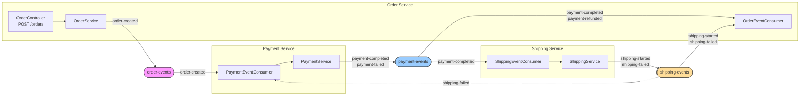

# Choreography-based Saga

---

> 코레오그래피는 *중앙 조정자 없이* 각 서비스가 독립적으로 반응하여 워크플로우를 완성하는 방식이다. 분산 환경에서 여러 서비스가 협력해야 하지만 중앙 조정자를 두면 단일 장애점이 되고 결합도가 높아진다. 코레오그래피는 각 서비스가 자율적으로 판단하고 행동하므로 유연하고 확장 가능해진다.


## 학습 목표

> 코레오그래피 SAGA가 *2PC의 대안*으로서 어떤 트레이드오프를 만드는지 이해한다.

이 장을 다 읽고 다음 다섯 가지에 자신 있게 답할 수 있으면 학습이 완료된다.

1. 2PC의 단일 장애점과 가용성 문제 때문에 SAGA가 필요해진 맥락을 설명할 수 있다.
2. 코레오그래피 SAGA의 보상 트랜잭션(compensation)이 무엇을 되돌리는지 설명할 수 있다.
3. 각 서비스가 자율적으로 반응하는 구조의 *추적 비용*과 *결합도 비용*을 비교할 수 있다.
4. 단계가 많아질 때 코레오그래피가 빠르게 가독성을 잃는 이유를 설명할 수 있다.
5. 코레오그래피 vs 오케스트레이션 선택 기준을 *가시성·자율성*으로 정리할 수 있다.

## 왜 SAGA 인가? - 2PC의 한계

### 2PC(Two-Phase Commit)란?

분산 트랜잭션의 전통적인 해결책은 2PC입니다. 모든 참여자가 Prepare → Commit/Rollback을 지시하여 원자성을 보장합니다.

```bash
Coordinator → Service A: PREPARE
Coordinator → Service B: PREPARE
Coordinator → Service C: PREPARE

모두 OK → Coordinator → 모든 서비스: COMMIT
하나라도 FAIL → Coordinator → 모든 서비스: ROLLBACK
```

2PC는 마이크로 서비스에서 아래와 같은 이유들로 부적절합니다.

| 한계                   | 설명                                                         |
| ---------------------- | ------------------------------------------------------------ |
| **블로킹**             | Prepare 후 Commit/Rollback을 기다리는 동안 참여 DB의 행이 잠기므로 처리량이 급감합니다. |
| **확장성 부족**        | DB가 수십 개로 늘어나면 행 잠금의 복잡도가 폭증하고 지연이 기하급수적으로 증가합니다. |
| **서비스 자율성 위반** | 마이크로서비스는 각자 DB를 소유하는데, 2PC는 모든 DB가 하나의 트랜잭션에 참여해야 합니다. |
| **Coordinator SPoF**   | Coordinator 장애 시 참여자들이 Prepare 상태에서 영원히 대기할 수 있습니다. |

### Saga(2PC 대안)

Saga는 하나의 분산 트랜잭션을 분해합니다. 각 서비스는 자신의 DB에서 로컬 트랜잭션만 실행하고, 실패 시 이전 단계를 보상 트랜잭션으로 되돌립니다.

- 2PC: 모든 서비스를 하나의 큰 트랜잭션으로 묶는다
- Saga: 각 서비스가 로컬 트랜잭션 + 보상으로 최종 일관성을 달성한다.

**정상 흐름**

```bash
사용자 → Order Service: POST /orders
Order Service → Order 생성 (PENDING)
Order Service → Redpanda: order-created 이벤트 발행
Order Service → 사용자: 201 Created

# 주문생성
Redpanda → Payment Service: order-created 수신
Payment Service → 결제 처리
Payment Service → Redpanda: payment-completed 발행

# 결제완료
Redpanda → Order Service: payment-completed 수신
Order Service → Order 상태 → PAID

# 결제 완료
Redpanda → Shipping Service: payment-completed 수신
Shipping Service → 배송 준비
Shipping Service → Redpanda: shipping-started 발행

# 배송 시작 
Redpanda → Order Service: shipping-started 수신
Order Service → Order 상태 → SHIPPED
```

**보상 트랜잭션 흐름**

```bash
Shipping Service → 배송 실패 발생
Shipping Service → Redpanda: shipping-failed 발행

Redpanda → Payment Service: shipping-failed 수신
Payment Service → 결제 환불 처리
Payment Service → Redpanda: payment-refunded 발행

Redpanda → Order Service: payment-refunded 수신
Order Service → Order 상태 → CANCELLED
```

## 장점과 한계

### 장점

| 장점            | 설명                        | 이유                                                         |
| --------------- | --------------------------- | ------------------------------------------------------------ |
| **느슨한 결합** | 서비스 간 직접 의존 없음    | 이벤트를 통해서만 통신하므로 서비스 변경이 다른 서비스에 영향을 주지 않습니다. |
| **독립 배포**   | 각 서비스 독립 배포 가능    | 중앙 조정자가 없으므로 각 서비스를 독립적으로 배포/스케일할 수 있습니다. |
| **장애 격리**   | 한 서비스 장애가 전파 안 됨 | Payment Service가 다운되어도 Order Service는 정상 동작합니다. 이벤트는 Redpanda에 저장되어 나중에 처리됩니다. |
| **확장성**      | 새 서비스 추가 용이         | 새로운 서비스가 필요하면 관심 있는 이벤트를 구독하기만 하면 됩니다. 기존 서비스 수정 불필요. |
| **이벤트 소싱** | 모든 상태 변화 기록         | 이벤트가 로그로 남아 감사(Audit), 디버깅, 이벤트 재생이 가능합니다. |

### 단점

| 한계                       | 설명                               | 완화 방법                                                    |
| -------------------------- | ---------------------------------- | ------------------------------------------------------------ |
| **워크플로우 추적 어려움** | 전체 흐름을 한눈에 보기 어려움     | Correlation ID를 모든 이벤트에 포함하고, Distributed Tracing(Jaeger, Zipkin) 도입. 워크플로우가 복잡해지면 오케스트레이션 방식으로 전환하여 중앙 Orchestrator가 상태 머신으로 전체 흐름을 관리할 수 있다 ([01-02 참조](01-02.Orchestration%20Saga.md)) |
| **순환 의존 위험**         | 이벤트 체인이 복잡해지면 순환 발생 | 이벤트 다이어그램을 그려 순환 체크, 명확한 이벤트 네이밍 규칙 |
| **최종 일관성**            | 즉시 일관성 보장 안 됨             | 사용자에게 "처리 중" 상태를 명확히 표시, 비즈니스 요구사항에 따라 오케스트레이션 고려 |
| **중복 처리 위험**         | At-least-once 전달로 중복 가능     | Idempotent Consumer 패턴 적용 (이벤트 ID 기반 중복 제거)     |
| **디버깅 복잡도**          | 분산 환경에서 원인 추적 어려움     | 구조화된 로깅, Correlation ID, Observability 도구 활용       |

## 코레오그래피 vs 오케스트레이션 선택 기준

Saga 패턴을 구현할 때 코레오그래피와 오케스트레이션 중 어떤 방식을 선택할지는 워크플로우의 특성에 따라 달라진다. 아래 4가지 관점으로 판단한다.

| 관점 | 코레오그래피 | 오케스트레이션 |
| --- | --- | --- |
| **장애 허용(Fault Tolerance)** | 각 서비스가 독립적으로 실패를 처리하므로 단일 장애점이 없다. 하지만 보상 흐름이 이벤트 체인으로 분산되어 실패 복구 로직이 파악하기 어렵다 | Orchestrator가 실패를 감지하고 보상 Command를 순차적으로 발행하므로 복구 흐름이 명시적이다. 대신 Orchestrator 자체가 SPoF가 될 수 있다 |
| **상태 가시성(State Visibility)** | 전체 워크플로우 상태를 파악하려면 각 서비스의 이벤트를 Correlation ID로 추적해야 한다. Distributed Tracing 없이는 "지금 주문이 어디까지 진행됐는가?"에 답하기 어렵다 | Orchestrator의 상태 머신이 현재 상태를 DB에 저장하므로 단일 쿼리로 진행 상황을 확인할 수 있다 |
| **느슨한 결합(Loose Coupling)** | 서비스 간 직접 의존이 없고 이벤트로만 통신하므로 결합도가 가장 낮다. 새 서비스를 추가해도 기존 서비스를 수정하지 않는다 | Orchestrator가 모든 서비스를 알아야 하므로 결합도가 중간 수준이다. 서비스 추가 시 Orchestrator 수정이 필요하다 |
| **유지보수성(Maintainability)** | 워크플로우가 3단계 이하일 때 각 서비스가 독립적이어서 유지보수가 쉽다. 단계가 늘어나면 이벤트 체인 추적이 어려워져 유지보수 비용이 급증한다 | 상태 전이 로직이 한 곳에 집중되어 워크플로우 변경이 용이하다. MassTransit 같은 프레임워크를 사용하면 DSL과 상태 다이어그램의 1:1 대응으로 가독성이 더 높아진다 ([01-02 참조](01-02.Orchestration%20Saga.md)) |

선택 가이드를 요약하면 다음과 같다:

- **코레오그래피**: 참여 서비스가 3개 이하이고, 워크플로우가 선형적이며, 서비스 간 최대한의 독립성이 필요할 때
- **오케스트레이션**: 참여 서비스가 4개 이상이거나, 분기/보상 경로가 복잡하거나, 워크플로우 상태를 한눈에 파악해야 할 때

두 방식은 배타적이지 않다. 하나의 시스템에서 단순한 워크플로우는 코레오그래피로, 복잡한 워크플로우는 오케스트레이션으로 구현하는 혼합 전략도 흔하다.

# 실제 구현

----

| 토픽명            | 발행자           | 구독자                         | 이벤트 타입                        | 설명                  |
| ----------------- | ---------------- | ------------------------------ | ---------------------------------- | --------------------- |
| `order-events`    | Order Service    | Payment Service                | order-created order-cancelled      | 주문 생성/취소 이벤트 |
| `payment-events`  | Payment Service  | Order Service Shipping Service | payment-completed payment-refunded | 결제 완료/환불 이벤트 |
| `shipping-events` | Shipping Service | Order Service                  | shipping-started shipping-failed   | 배송 시작/실패 이벤트 |



3가지 서비스 모두 동일한 구조를 따릅니다. "로컬 DB 저장 -> 이벤트 발행"이 핵심이고 나머지는 표준 코드입니다.

```bash
┌─────────────────────────────────────────┐
│  @KafkaListener (이벤트 수신)             │
│    └→ @Transactional Service 메서드      │
│         ├─ 1. 엔티티 생성/상태 변경         │
│         ├─ 2. repository.save()        │
│         └─ 3. kafkaTemplate.send()     │
│              ⚠️ DB 트랜잭션 밖 (비동기)    │
└─────────────────────────────────────────┘
```

## Order Service

```java
@Component
@RequiredArgsConstructor
public class OrderEventConsumer {

    private final OrderService orderService;

  	// 결제 이벤트 컨슈머
    @KafkaListener(topics = "payment-events", groupId = "order-service")
    public void handlePaymentEvent(PaymentEvent event) {
        switch (event.getEventType()) {
            case "payment-completed" ->
                orderService.updateOrderStatus(event.getOrderId(), OrderStatus.PAID);
            case "payment-refunded" ->
                orderService.updateOrderStatus(event.getOrderId(), OrderStatus.CANCELLED);
        }
    }

  	// 배송 이벤트 컨슈머
    @KafkaListener(topics = "shipping-events", groupId = "order-service")
    public void handleShippingEvent(ShippingEvent event) {
        if ("shipping-started".equals(event.getEventType())) {
            orderService.updateOrderStatus(event.getOrderId(), OrderStatus.SHIPPED);
        }
    }
}
```

```java
@Service
@RequiredArgsConstructor
public class OrderService {

    private final OrderRepository orderRepository;
    private final KafkaTemplate<String, OrderEvent> kafkaTemplate;

    @Transactional
    public Order createOrder(CreateOrderRequest request) {
        // 1. 엔티티 생성 + DB 저장
        Order order = Order.create(request);  // status = PENDING
        orderRepository.save(order);

        // 2. 이벤트 발행 — DB 트랜잭션과 별개로 비동기 실행
        kafkaTemplate.send("order-events", order.getOrderId(),
                OrderEvent.orderCreated(order));

        return order;
    }

    @Transactional
    public void updateOrderStatus(String orderId, OrderStatus newStatus) {
        Order order = orderRepository.findById(orderId).orElseThrow();
        order.setStatus(newStatus);
        orderRepository.save(order);
    }
}
```

## Payment Service

```java
@Component
@RequiredArgsConstructor
public class PaymentEventConsumer {

    private final PaymentService paymentService;

    @KafkaListener(topics = "order-events", groupId = "payment-service")
    public void handleOrderEvent(OrderEvent event) {
        if ("order-created".equals(event.getEventType())) {
            paymentService.processPayment(event);
        }
    }

    @KafkaListener(topics = "shipping-events", groupId = "payment-service")
    public void handleShippingEvent(ShippingEvent event) {
        if ("shipping-failed".equals(event.getEventType())) {
            paymentService.refundPayment(event.getOrderId());
        }
    }
}
```

```java
@Service
@RequiredArgsConstructor
public class PaymentService {

    private final PaymentRepository paymentRepository;
    private final KafkaTemplate<String, PaymentEvent> kafkaTemplate;

    /** order-created 이벤트 수신 시 호출 */
    @Transactional
    public void processPayment(OrderEvent orderEvent) {
        Payment payment = Payment.from(orderEvent);  // status = PROCESSING
        paymentRepository.save(payment);

        boolean success = paymentGateway.charge(payment);

        if (success) {
            payment.complete();
            paymentRepository.save(payment);
            kafkaTemplate.send("payment-events", payment.getOrderId(),
                    PaymentEvent.completed(payment));
        } else {
            payment.fail("Insufficient funds");
            paymentRepository.save(payment);
            kafkaTemplate.send("payment-events", payment.getOrderId(),
                    PaymentEvent.failed(payment));
        }
    }

    /** shipping-failed 이벤트 수신 시 호출 (보상 트랜잭션) */
    @Transactional
    public void refundPayment(String orderId) {
        Payment payment = paymentRepository.findByOrderId(orderId).orElseThrow();

        if (payment.getStatus() != PaymentStatus.COMPLETED) return;

        payment.refund();
        paymentRepository.save(payment);
        kafkaTemplate.send("payment-events", orderId,
                PaymentEvent.refunded(payment));
    }
}
```

## Shipping Service

```java
@Component
@RequiredArgsConstructor
public class ShippingEventConsumer {

    private final ShippingService shippingService;

    @KafkaListener(topics = "payment-events", groupId = "shipping-service")
    public void handlePaymentEvent(PaymentEvent event) {
        if ("payment-completed".equals(event.getEventType())) {
            shippingService.processShipping(event);
        }
    }
}
```

```java
@Service
@RequiredArgsConstructor
public class ShippingService {

    private final ShippingRepository shippingRepository;
    private final KafkaTemplate<String, ShippingEvent> kafkaTemplate;

    /** payment-completed 이벤트 수신 시 호출 */
    @Transactional
    public void processShipping(PaymentEvent paymentEvent) {
        Shipping shipping = Shipping.from(paymentEvent);  // status = PREPARING
        shippingRepository.save(shipping);

        boolean success = warehouseClient.prepare(shipping);

        if (success) {
            shipping.ship();
            shippingRepository.save(shipping);
            kafkaTemplate.send("shipping-events", shipping.getOrderId(),
                    ShippingEvent.started(shipping));
        } else {
            shipping.fail("Out of stock");
            shippingRepository.save(shipping);
            kafkaTemplate.send("shipping-events", shipping.getOrderId(),
                    ShippingEvent.failed(shipping));
        }
    }
}
```


## 면접 대비 Q&A

> 면접에서 자주 나오는 형태로 5개. 답을 보지 않고 먼저 입으로 답해 본 뒤 비교한다.

### Q1. 2PC를 두고 굳이 SAGA를 쓰는 이유는?

2PC는 모든 참여자가 Prepare → Commit/Rollback을 동기적으로 따라야 한다. 한 참여자가 응답을 안 하면 *Coordinator는 결정을 못 하고 모든 참여자가 락을 들고 대기*한다. 가용성이 모든 참여자의 가용성의 곱으로 줄어든다. SAGA는 이 동기 잠금을 포기하고, *부분 실패 시 보상 트랜잭션으로 되돌리는* 방식으로 결합을 푼다. 응답성과 가용성을 얻는 대신 일관성은 *최종 일관성*으로 약해진다.

### Q2. 코레오그래피의 보상 트랜잭션이 단순 rollback과 다른 이유는?

이미 *커밋된 작업*을 외부 시스템에 *다른 작업으로* 무효화해야 하기 때문이다. 결제 승인을 rollback할 수 없으니 *환불* 작업을 별도로 발행한다. 재고 차감을 rollback할 수 없으니 *재고 복원* 이벤트를 발행한다. 보상 트랜잭션은 *원본과 역방향의 의미*를 가진 별도 도메인 이벤트이고, 코드 양도 두 배가 된다. 그래서 SAGA는 "되돌릴 수 있는 도메인"에서만 의미가 있다.

### Q3. 코레오그래피가 단계 추가에 약한 이유는?

각 서비스가 *다음에 무엇이 일어나는지*를 자기 코드 안에 박아 두기 때문이다. 단계 5를 추가하려면 단계 4의 서비스가 새 이벤트를 발행하도록 코드를 바꿔야 하고, 그 변경이 단계 5 서비스의 구독 추가와 *동시 배포*되어야 한다. 단계 수가 늘수록 이런 *암묵적 체인 의존*이 폭발해 가시성과 변경 비용이 함께 커진다.

### Q4. 코레오그래피 SAGA의 추적은 어떻게 만드나?

correlation ID(transaction ID)를 모든 이벤트에 박아 흘려보낸다. 분산 트레이싱(traceparent) 헤더가 자동 전파되면 Jaeger/Zipkin에서 한 흐름으로 볼 수 있다. 도메인 측에서도 SagaInstance 같은 *경량 상태 추적 테이블*을 두고 단계 진행을 기록할 수 있지만, 그 순간 코레오그래피와 *오케스트레이션 사이의 중간 형태*가 된다. 추적을 강화할수록 오케스트레이션에 가까워지는 게 본질적 경향이다.

### Q5. 코레오그래피와 오케스트레이션 중 어느 쪽을 골라야 하나?

기준은 *가시성 요구*와 *서비스 자율성*의 균형이다. 단계 수가 3~4개 이하이고 도메인이 각자 독립적인 의미를 가지면 코레오그래피의 *자율성·결합도 분산*이 의미가 크다. 단계 수가 많거나, 단계 간 *분기·승인·재시도 정책*이 다르면 가시성 부족이 운영 비용으로 돌아온다. 그때는 명시적 상태 머신을 가진 오케스트레이션이 맞다. TPS의 빌드→테스트→배포처럼 단계 분기와 가시성이 중요한 도메인은 오케스트레이션이 자연스러운 선택이다.


## 관련 문서

- [01-02.Orchestration Saga](01-02.Orchestration%20Saga.md) — 명시적 상태 머신 대안
- [02-01.Outbox](02-01.Outbox.md) — 코레오그래피 이벤트 발행의 안전 보장
- [03-01.Inbox](03-01.Inbox.md) — 보상 이벤트 수신 측 멱등성
- [03-04.Exactly-once 의미론과 Consumer Idempotency](03-04.Exactly-once%20의미론과%20Consumer%20Idempotency.md) — SAGA에서 효과적 EOS


---

> **TPS 적용 사례** — `okestro/tps-gitlab2` (오케스트레이션 채택)
>
> - **상태**: TPS는 코레오그래피 대신 오케스트레이션을 선택했다. operator의 `PipelineExcnService`가 명시적 상태 머신으로 빌드 → 테스트 → 배포 단계를 지시하고, 각 executor의 결과 이벤트를 받아 다음 단계를 호출한다.
> - **선택 이유**: 파이프라인 가시성(현재 어느 단계인지 단일 쿼리로 확인), 단계 간 분기·승인이 필요한 비즈니스 요구. 코레오그래피였다면 단계가 늘어날 때마다 이벤트 체인이 분산되어 추적 비용이 급증.
> - **상세**: [01-02.Orchestration Saga](01-02.Orchestration%20Saga.md).
