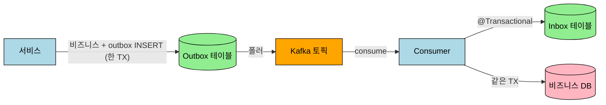

# Exactly-once 의미론과 Consumer Idempotency

> Kafka 단독으로 "정확히 한 번 consume"을 보장한다는 표현은 정확하지 않다. Kafka가 묶어줄 수 있는 범위는 Kafka 안에서 읽고, 처리하고, 다시 Kafka에 쓰는 흐름까지다. DB나 외부 API가 끼는 순간 정확히 한 번은 깨지므로, 실무 목표는 "정확히 한 번 받는다"가 아니라 **"같은 메시지를 여러 번 받아도 결과가 한 번만 반영되게 만든다"** 가 된다. 이게 멱등성(idempotency)이다.


## 학습 목표

> Kafka EOS의 *경계*와 *멱등성으로 보강해야 하는 영역*을 구분해 이해한다.

이 장을 다 읽고 다음 다섯 가지에 자신 있게 답할 수 있으면 학습이 완료된다.

1. at-most/at-least/exactly-once 의미론의 차이와 운영 시 의미를 설명할 수 있다.
2. Kafka EOS가 *Kafka 내부*에만 닫혀 있는 보장이고 외부 시스템에 닿으면 깨지는 이유를 설명할 수 있다.
3. Idempotent Producer(`enable.idempotence=true`)가 막아주는 중복의 정확한 범위를 말할 수 있다.
4. Consumer Idempotency를 Inbox 테이블로 강제하는 패턴의 핵심을 설명할 수 있다.
5. `isolation.level=read_committed`가 Consumer 쪽에서 무엇을 보장하는지 설명할 수 있다.

## 1. 전달 의미론 세 가지

Kafka 메시지 전달은 세 가지 의미론으로 갈린다.

| 의미론 | 의미 | 위험 |
|--------|------|------|
| at-most-once | 최대 한 번 처리 | 유실 가능 |
| at-least-once | 최소 한 번 처리 | 중복 가능 |
| exactly-once | 정확히 한 번 처리처럼 보이게 보장 | 보장 범위가 좁다 |

Spring Kafka의 기본 consumer 동작은 at-least-once에 가깝다. consume 후 비즈니스 처리 → offset commit 순서인데, 2번과 3번 사이에서 장애가 나면 offset이 commit되지 않아 재시작 후 같은 메시지를 다시 가져온다. 즉 **중복 consume 가능성은 항상 존재**한다고 보는 게 안전하다.

```text
1. 메시지 poll
2. 비즈니스 처리 (DB 저장 성공)
3. offset commit 전에 애플리케이션 종료
4. 재시작 → 같은 메시지 재처리
```

## 2. Kafka 내부 exactly-once — 어디까지 보장되는가

Kafka가 단독으로 보장하는 EOS의 범위는 **Kafka 안에서만**이다.

```text
Topic A consume → 처리 → Topic B produce → offset commit
```

이 네 단계를 하나의 Kafka transaction으로 묶을 수 있다. 조건은 세 가지다.

- **idempotent producer**: `enable.idempotence=true`. 브로커 재시도 시 중복 발행 방지.
- **transactional producer**: `transaction-id-prefix` 지정. KafkaTemplate이 transaction에 참여 가능.
- **consumer offset을 transaction에 포함**: `KafkaTransactionManager`로 위 produce와 같은 transaction에 묶기.

```text
1. transaction 시작
2. Topic A 메시지 consume
3. Topic B로 결과 produce
4. consume한 offset을 transaction에 포함
5. transaction commit (성공 시 둘 다 반영, 실패 시 둘 다 안 반영)
```

consumer 쪽에는 `isolation.level=read_committed`가 짝이다. 다른 producer가 abort한 메시지를 읽지 않으려는 목적.

이 구조가 의미 있는 경우는 *consume → 처리 → produce*가 한 단위로 묶이는 흐름이다. Kafka Streams가 대표적이다. 거꾸로 *consume → DB*만 있는 단순 소비자는 Kafka transaction을 쓸 이유가 없다.

## 3. DB가 끼면 정확히 한 번은 깨진다

실무에서 더 흔한 흐름은 이것이다.

```text
Kafka consume → DB insert/update → offset commit
```

여기서 Kafka transaction은 DB까지 못 묶는다. DB 트랜잭션 매니저와 Kafka 트랜잭션 매니저가 분리되어 있고, XA를 도입하지 않는 한 두 커밋 사이는 원자적이지 않다. 시나리오는 다음과 같다.

```text
DB update 성공
offset commit 실패 → 재시작 → 같은 메시지 재처리
```

결과는 **DB에 같은 변경이 두 번 반영**이다. 잔액이 두 번 증가하거나, 같은 알림이 두 번 발송된다. 결제·정산 도메인에서는 치명적이다.

## 4. 실무 목표 — 멱등 처리

XA의 운영 부담을 피하면서도 안전을 확보하는 길은 *exactly-once consume*을 포기하고 **idempotent processing**으로 내려가는 것이다.

> 같은 메시지를 여러 번 받아도 **결과가 한 번만 반영되게** 만든다.

핵심 도구는 두 가지다.

1. **메시지마다 고유 ID**: `eventId`, `commandId`, `messageId`, CloudEvents의 `ce_id`. 같은 메시지면 같은 ID여야 한다.
2. **처리 이력 테이블**: 처리한 ID를 DB에 박아두고, 같은 ID가 다시 들어오면 skip.

```sql
CREATE TABLE processed_message (
    msg_id          VARCHAR(64)  NOT NULL,
    consumer_group  VARCHAR(120) NOT NULL,
    topic           VARCHAR(200) NOT NULL,
    partition_no    INT          NOT NULL,
    offset_no       BIGINT       NOT NULL,
    reg_dt          DATETIME(6)  NOT NULL DEFAULT CURRENT_TIMESTAMP(6),
    PRIMARY KEY (msg_id, consumer_group)
);
```

**PK가 `(msg_id, consumer_group)` 컴포지트인 이유**: 같은 메시지를 여러 consumer-group이 각자 한 번씩 처리할 수 있어야 한다. group마다 멱등 검사가 독립적으로 일어난다.

처리 흐름은 다음과 같다.

```text
1. Kafka 메시지 consume
2. @Transactional 시작
3. processed_message에 INSERT 시도
4-A. 성공 → 비즈니스 처리
4-B. DuplicateKey 예외 → 이미 처리됨, skip
5. transaction commit (성공 시 INSERT + 비즈니스 변경이 같이 반영)
```

select-후-insert 방식은 race condition에 취약하다. 같은 메시지를 거의 동시에 두 consumer가 잡으면 둘 다 "없음"으로 판정하고 두 번 INSERT/처리할 위험이 있다. **insert를 먼저 시도하고 unique constraint 위반을 catch**하는 방식이 단단하다.

```java
@Transactional
public void handle(EventAvro event, ConsumerRecord<?, ?> record) {
    String ceId = HeaderUtils.headerString(record, "ce_id");
    try {
        inboxRepository.insert(ceId, "my-consumer-group", record.topic(),
                                record.partition(), record.offset());
    } catch (DataIntegrityViolationException e) {
        return;  // 이미 처리됨
    }
    // 비즈니스 처리
}
```

## 5. Manual ack는 만능이 아니다

Manual ack(`ack-mode: MANUAL`)도 자주 거론되지만 멱등성을 완전히 대체하지는 못한다.

```java
@KafkaListener(topics = "...", containerFactory = "manualAckFactory")
public void consume(EventAvro event, Acknowledgment acknowledgment) {
    handle(event);
    acknowledgment.acknowledge();  // 처리 성공 후 ack
}
```

순서는 다음과 같다.

```text
1. consume
2. DB 처리 성공
3. acknowledge() 호출
4. offset commit
```

여전히 3번과 4번 사이에서 죽으면 재처리가 발생한다. 차이는 *재처리 빈도가 줄어드는 것*이지 *재처리가 사라지는 것*이 아니다. manual ack를 도입해도 멱등 테이블은 여전히 필요하다.

manual ack가 진짜 의미 있는 시점은 다음 둘이다.

- 핸들러가 *비동기*로 일을 시작하고 콜백에서 ack해야 할 때
- 외부 응답이 도착해야 처리 완료라고 부를 수 있을 때

핸들러가 동기 위임만 한다면 Spring Kafka의 기본 자동 ack로도 충분하다. 메서드 return = 처리 완료 = ack 자동 수행이라는 흐름이 깔끔하다.

## 6. Outbox와 Inbox는 짝이다

Producer 측 신뢰성과 Consumer 측 멱등성은 따로 풀어야 한다.

- **Producer at-least-once**는 Outbox 패턴으로 해결한다. DB 트랜잭션과 발행 의도를 같은 transaction에 묶고, 별도 폴러가 메시지를 Kafka로 옮긴다. 발행 누락 없음.
- **Consumer 멱등**은 Inbox(processed_message) 테이블로 해결한다. 같은 메시지를 두 번 받아도 결과는 한 번만 반영.



Outbox의 발행 ID(예: outbox row의 PK)가 그대로 메시지 헤더로 박혀 consumer 측 멱등 key가 된다. 별도의 ID 채번 인프라가 필요 없다.

## 7. 상황별 가능한 보장

| 상황 | 가능한 보장 | 방법 |
|------|-------------|------|
| Kafka → Kafka | exactly-once processing | Kafka transaction (transactional producer + read_committed + offset 포함) |
| Kafka → DB | exactly-once 불가능 | at-least-once + Inbox 멱등 테이블 |
| Kafka → 외부 API | exactly-once 거의 불가능 | idempotency key를 API에 전달 + Inbox |
| Kafka → DB → Kafka | XA 부재 시 어려움 | Outbox + Inbox 짝 사용이 현실적 |
| 일반 실무 | at-least-once + idempotent consumer | 가장 흔하고 단단한 조합 |

## 8. 좋은 실무 조합

다음 7가지를 갖추면 운영 환경에서 안정적으로 동작한다.

1. 메시지에 `eventId` / `commandId` / `ce_id` 같은 고유 ID 부여
2. consumer는 자동 ack 그대로 두되, 핸들러가 동기 위임으로 처리 완료를 명확히 표시
3. 처리 이력 테이블(`(msg_id, consumer_group)` PK)에 unique insert
4. 비즈니스 처리와 이력 INSERT를 **같은 @Transactional**에 묶기
5. `DuplicateKeyException`(또는 `DataIntegrityViolationException`)을 catch하여 skip
6. 실패 메시지는 retry 토픽으로 자동 재시도 후 DLT로 격리 (`@RetryableTopic` + `@DltHandler`)
7. 보존기간이 지난 이력 row는 스케줄러로 일괄 삭제 (토픽 retention과 짝)

## 9. 학습 정리

1. **Kafka 단독 EOS는 Kafka 안에서만 성립**한다. 외부 시스템이 끼는 순간 깨진다.
2. **`enable.idempotence=true`는 producer 측 EOS만 보장**한다. consumer 중복을 막아주지 않는다.
3. **Inbox 멱등 테이블이 실무의 현실적 답**이다. PK는 `(msg_id, consumer_group)` 컴포지트.
4. **Insert-시도 후 catch가 select-후-insert보다 안전**하다. race condition 없음.

## 참고

- [01-03.Consumer Group](./../04_BrokerArchitecture/01-03.Consumer%20Group.md) — 오프셋 추적, auto.offset.reset 정책
- [02-01.Outbox](02-01.Outbox.md) — Producer at-least-once 짝
- [03-01.Inbox](03-01.Inbox.md) — 본 문서의 개념 배경, 외부 API 호출이 끼는 경우의 변형
- [01-02.Kafka Streams Spring Boot](./../06_StreamProcessing/01-02.Kafka%20Streams%20Spring%20Boot.md) — Kafka → Kafka 흐름에서의 EOS 설정


---

> **TPS 적용 사례** — `okestro/tps-gitlab2`
>
> **현재 갖춰진 것**
>
> - Producer 측 EOS 트리오: `acks=all` + `retries=3` + `enable.idempotence=true` — `message-lib/.../KafkaDefaultsEnvironmentPostProcessor.java:42~44`
> - Outbox 패턴 (`TB_TRB_OX_001`) — `message-lib/.../outbox/OutboxPoller.java`
> - `@RetryableTopic` + `@DltHandler` 일관 적용 — 운영·example consumer 다수
> - ErrorHandlingDeserializer + DLQ로 역직렬화 실패 격리 — `KafkaErrorConfig.java`
> - **CloudEvents `ce_id` 헤더** — 모든 발행 메시지에 outbox event PK가 박힘 (`OutboxPoller.java:203~210`). 별도 ID 채번 없이 멱등 key로 활용 가능
>
> **본 문서가 다루는 도입 — Inbox `TB_TRB_OX_002`**
>
> - PK `(MSG_ID, CONSUMER_GROUP)` 컴포지트. INSERT-only 라이프사이클이라 `MDFCN_DT`/`MDFR_ID` 미포함
> - `MSG_ID` 출처 = consumer 측에서 `ConsumerRecord.headers().lastHeader("ce_id")` 한 줄로 추출
> - 헬퍼 `IdempotencyGuard` (`message-lib/.../application/inbox/`) — `@Transactional(MANDATORY)`로 호출자 트랜잭션 강제
> - 첫 PoC 적용 대상: `executor/engine/.../example/{ExampleMessageConsumer, MultiRecordExampleConsumer}` — 검증 후 운영 핸들러로 확장
> - 상세: `message-lib/docs/inbox-idempotency-plan.md`
>
> **미도입 결정 항목**
>
> - `transaction-id-prefix` (transactional producer) — 발행이 모두 Outbox 폴러를 거치므로 *consume과 produce가 같은 transaction에 들어갈 수 없음*. 효과 없음
> - `isolation-level=read_committed` — 위와 짝. 발행 측이 transactional이 아니므로 차이 없음
> - manual ack — 핸들러가 동기 위임이라 Spring Kafka 자동 ack로 충분. `@RetryableTopic`이 retry/DLT 흐름까지 안전 처리


## 면접 대비 Q&A

> 면접에서 자주 나오는 형태로 5개. 답을 보지 않고 먼저 입으로 답해 본 뒤 비교한다.

### Q1. "Kafka로 정확히 한 번 처리"가 잘못된 표현인 이유는?

Kafka EOS가 보장하는 범위가 *Kafka 내부*에 닫혀 있기 때문이다. consume → 처리 → produce가 모두 같은 Kafka transaction 안이라면 정확히 한 번이 성립한다. 하지만 처리 단계에 *DB 쓰기·외부 API 호출·로컬 파일 시스템*이 끼는 순간 그 외부 시스템은 Kafka transaction에 묶이지 않으므로 정확히 한 번은 깨진다. 그래서 실무 목표는 "정확히 한 번 수신"이 아니라 *"여러 번 받아도 결과가 한 번만 반영되게"*, 즉 Consumer 측 멱등성이다.

### Q2. Idempotent Producer가 정확히 막아주는 중복은?

*Producer 재전송에 의한 같은 메시지의 브로커 측 중복*만 막는다. `enable.idempotence=true`를 켜면 Producer가 각 메시지에 PID·시퀀스 번호를 박고, 브로커가 같은 시퀀스를 두 번 보면 무시한다. 막아주지 않는 것은 *Producer 인스턴스가 죽고 다른 인스턴스가 같은 데이터를 다시 만든 경우*, 그리고 *Consumer 측 재처리*다. 후자는 Inbox 같은 별도 메커니즘이 필요하다.

### Q3. Inbox 테이블이 Consumer 멱등성을 강제하는 메커니즘은?

핸들러 진입 시 `(message_id, consumer_group)` 조합을 PK로 가지는 Inbox 테이블에 *insert*를 먼저 시도한다. 이미 존재하면 PK 위반으로 실패하고, 그 메시지는 *이전 처리 결과가 있다는 신호*이므로 핸들러를 건너뛴다. 신규 메시지면 insert가 성공하고 같은 transaction 안에서 비즈니스 로직을 실행한다. 결과적으로 Kafka가 같은 메시지를 100번 다시 줘도 *DB transaction이 99번 롤백*되고 한 번만 반영된다.

### Q4. `isolation.level=read_committed`가 Consumer 쪽에서 보장하는 것은?

*Producer가 transactional하게 발행했을 때만 의미가 있다*. Producer가 transaction 안에서 여러 메시지를 보내고 commit 전이면, `read_committed` Consumer는 그 메시지들을 보지 않는다. commit이 일어나면 한꺼번에 보이고, abort되면 영영 안 보인다. 따라서 transactional Producer + `read_committed` Consumer 조합이 EOS의 "정확히 한 번 처리·발행" 한 사이클을 만든다. Outbox 폴러처럼 발행 측이 transactional이 아닌 환경에서는 효과가 없다.

### Q5. Outbox + Inbox 패턴이 EOS의 *실용적 대체*인 이유는?

EOS가 Kafka 안에서만 닫혀 있는 반면, Outbox+Inbox는 *DB transaction*을 통합 지점으로 삼아 외부 시스템까지 일관성을 확장한다. 발행 측: 도메인 변경과 outbox row insert가 같은 DB transaction → 부분 실패 없음. 폴러: 이미 직렬화된 byte[]를 그대로 발행 → 발행 시점에 새 직렬화 실패 자리 없음. 수신 측: Inbox insert + 비즈니스 로직이 같은 transaction → 중복 수신은 PK 위반으로 차단. 결과적으로 *Kafka가 at-least-once만 약속해도* 시스템 전체가 effectively-once로 동작한다.


## 관련 문서

- [01-03.Consumer Group](../04_BrokerArchitecture/01-03.Consumer%20Group.md) — 오프셋 커밋과 EOS의 비대칭
- [01-04.리밸런스 프로토콜](../04_BrokerArchitecture/01-04.리밸런스%20프로토콜.md) — 리밸런스 중 중복 처리의 발생 지점
- [02-01.Outbox](02-01.Outbox.md) — 발행 측 멱등성
- [03-01.Inbox](03-01.Inbox.md) — 수신 측 멱등성
- [01-02.Kafka Streams Spring Boot](../06_StreamProcessing/01-02.Kafka%20Streams%20Spring%20Boot.md) — Streams의 EOS 모드
