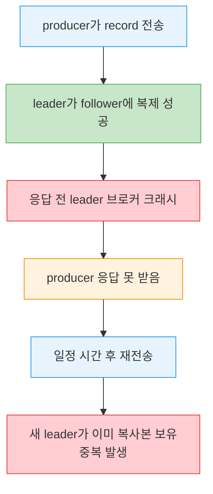
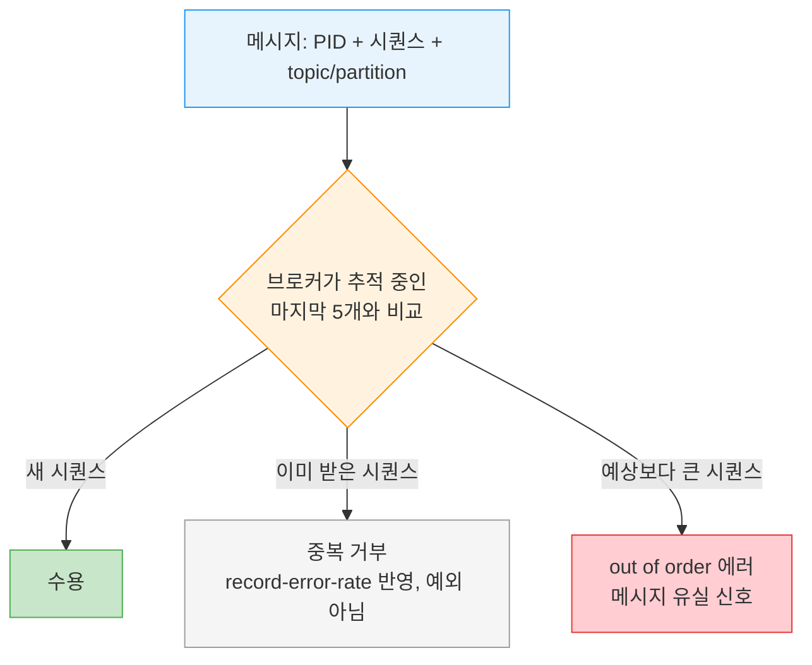

# Idempotent Producer — PID·시퀀스·중복 방지


> [03-04.Exactly-once 의미론과 Consumer Idempotency](03-04.Exactly-once%20의미론과%20Consumer%20Idempotency.md)가 *소비 측*에서 같은 메시지를 여러 번 받아도 결과를 한 번만 반영하는 법을 다뤘다면, 이 글은 *발행 측*에서 retry가 만드는 중복을 Kafka가 자동으로 막는 법을 다룹니다. at-least-once는 메시지를 잃지 않는 대신 중복을 남기는데, 그 중복의 가장 흔한 출처가 producer의 재전송입니다. idempotent producer는 메시지마다 고유 식별자를 붙여 브로커가 같은 메시지를 두 번 받으면 걸러 내게 합니다. 무엇을 막아 주고 무엇은 못 막는지 경계를 아는 것이 이 장의 핵심입니다.


## 학습 목표

> producer retry가 중복을 만드는 과정과, PID·시퀀스 번호로 그 중복을 거르는 원리, 그리고 idempotent producer가 막지 못하는 경계를 설명할 수 있는 것이 이 장의 목표입니다.

이 장을 다 읽고 다음 다섯 가지에 자신 있게 답할 수 있으면 학습이 완료됩니다.

1. at-least-once retry가 중복을 만드는 고전 시나리오를 설명할 수 있습니다.
2. PID·시퀀스 번호·max.inflight≤5가 함께 중복을 거르는 원리를 말할 수 있습니다.
3. out-of-order sequence 에러가 무엇을 신호하는지 설명할 수 있습니다.
4. producer restart와 broker failure에서 idempotence가 각각 어떻게 동작하는지 구분할 수 있습니다.
5. idempotent producer가 막지 못하는 중복(send 두 번·다중 인스턴스)을 말할 수 있습니다.


## 1. 멱등성과 중복의 출처

> 멱등 연산은 여러 번 실행해도 한 번 실행과 결과가 같습니다. producer가 at-least-once로 동작하면 불확실할 때 재전송하므로 중복이 생기는데, idempotent producer가 이를 자동으로 해결합니다.

서비스가 멱등(idempotent)하다는 것은 같은 연산을 여러 번 수행해도 한 번 수행한 것과 결과가 같다는 뜻입니다. 데이터베이스로 보면 `UPDATE t SET x=x+1 where y=5`와 `UPDATE t SET x=18 where y=5`의 차이입니다. 앞은 멱등하지 않습니다. 세 번 호출하면 한 번 호출한 것과 전혀 다른 결과가 됩니다. 뒤는 멱등합니다. 몇 번을 실행하든 x는 18입니다.

이것이 Kafka producer와 어떻게 연결될까요? producer를 멱등 의미론이 아니라 at-least-once 의미론으로 설정하면, 불확실한 상황에서 producer가 메시지를 재전송해 적어도 한 번은 도착하게 합니다. 이 재전송이 중복으로 이어질 수 있습니다.

고전적인 경우는 이렇습니다. 파티션 leader가 producer에게서 record를 받아 follower에 성공적으로 복제했는데, producer에게 응답을 보내기 전에 leader가 있는 브로커가 크래시합니다. producer는 일정 시간 응답이 없으면 메시지를 다시 보냅니다. 그 메시지는 새 leader에 도착하는데, 새 leader는 이전 시도에서 받은 복사본을 이미 가지고 있어 중복이 됩니다.



어떤 앱에서는 중복이 큰 문제가 아니지만, 어떤 앱에서는 재고 오산, 잘못된 재무제표, 주문한 우산 하나 대신 두 개 배송 같은 사고로 이어집니다. Kafka의 idempotent producer는 이런 중복을 자동으로 감지하고 해결해 줍니다.

> 💬 **비유**: idempotent producer는 택배 송장 번호와 같습니다. 같은 송장 번호의 소포가 두 번 도착하면 물류 센터가 "이미 받은 것"으로 걸러 냅니다. 이 비유는 "고유 번호로 같은 것을 식별해 거른다"까지 유효하지만, 송장 번호는 사람이 붙이는 반면 PID·시퀀스는 producer가 자동으로 박고 *재전송에 한해서만* 같은 번호가 되며, 사람이 같은 소포를 두 번 부치면(= `send()` 두 번 호출) 다른 번호가 매겨져 걸러지지 않는다는 점에서 단순화된 것입니다. 이 경계가 §5의 한계입니다.


## 2. 동작 원리 — PID·시퀀스·max.inflight

> idempotent producer는 메시지마다 PID와 시퀀스 번호를 붙이고, 브로커가 파티션마다 마지막 5개를 추적해 중복을 거릅니다. 추적 부담을 제한하려고 max.inflight는 5 이하여야 합니다.

idempotent producer를 켜면 각 메시지에 고유한 **producer ID(PID)** 와 **시퀀스 번호**가 들어갑니다. 이 둘은 대상 topic·partition과 함께 각 메시지를 고유하게 식별합니다. 브로커는 이 식별자로 자신의 모든 파티션마다 마지막 다섯 개 메시지를 추적합니다. 파티션마다 추적해야 할 이전 시퀀스 번호의 개수를 제한하기 위해, producer가 **`max.inflight.requests`를 5 이하(기본 5)** 로 쓰도록 요구합니다.

브로커가 이미 받았던 메시지를 다시 받으면 적절한 에러로 중복을 거부합니다. 이 에러는 producer가 로깅하고 메트릭에 반영하지만 **예외를 일으키지 않으며 경보할 일도 아닙니다**. producer client에서는 `record-error-rate` 메트릭에 더해지고, 브로커에서는 RequestMetrics 타입의 `ErrorsPerSec` 메트릭에 에러 종류별 카운트로 잡힙니다.



브로커가 예상보다 한참 큰 시퀀스 번호를 받으면 어떻게 될까요? 브로커는 메시지 2 다음에 3이 오리라 기대하는데, 27이 오면 "out of order sequence" 에러로 응답합니다. transaction 없이 idempotent producer만 쓰는 경우라면 이 에러는 무시해도 됩니다.

> ⚠️ **out-of-order는 유실 신호**: producer는 "out of order sequence number" 예외 뒤에도 정상 진행하지만, 이 에러는 보통 producer와 브로커 사이에서 메시지가 유실됐다는 신호입니다. 브로커가 메시지 2 다음 27을 받았다면 3부터 26까지 무언가 일어난 것입니다. 로그에서 이 에러를 보면 producer·topic 설정이 고신뢰성 권장값인지 다시 살피고, unclean leader election이 일어났는지 확인하는 편이 좋습니다.


## 3. 실패 시나리오 — producer restart와 broker failure

> producer가 재시작하면 새 PID를 받아 옛 메시지를 zombie로 감지하지 못합니다. 반면 broker가 실패해도 follower가 in-memory state와 snapshot으로 시퀀스를 이어받아 중복을 계속 거릅니다.

분산 시스템이 늘 그렇듯 실패 조건에서의 동작이 흥미롭습니다. 두 경우를 봅니다.

**producer 재시작**. producer가 실패하면 보통 새 producer가 그것을 대체합니다. 사람이 수동으로 머신을 재부팅하든, Kubernetes 같은 프레임워크가 자동으로 복구하든 마찬가지입니다. 핵심은 producer가 시작할 때 idempotent producer가 켜져 있으면 producer가 초기화하며 브로커에 PID 생성을 요청한다는 것입니다. **각 초기화는 완전히 새로운 ID를 받습니다**(transaction을 켜지 않았다고 가정). 따라서 producer가 실패하고 그것을 대체한 producer가 옛 producer가 이미 보낸 메시지를 보내면, 브로커는 중복을 감지하지 못합니다. 두 메시지는 PID와 시퀀스 번호가 달라 서로 다른 메시지로 간주됩니다. 옛 producer가 얼었다가 대체 producer가 시작한 뒤 살아나도 같습니다. **원래 producer는 zombie로 인식되지 않습니다.** ID가 완전히 다른 두 producer이기 때문입니다.

**broker 실패**. 브로커가 실패하면 controller가 그 브로커에 있던 파티션의 새 leader를 선출합니다. topic A의 partition 0이 leader replica는 broker 5에, follower replica는 broker 3에 있었다고 합시다. broker 5가 실패하면 broker 3이 새 leader가 됩니다. producer는 metadata 프로토콜로 새 leader가 broker 3임을 발견하고 거기에 produce합니다. 그런데 broker 3은 어떤 시퀀스가 이미 produce됐는지 어떻게 알고 중복을 거부할까요?

leader는 새 메시지가 produce될 때마다 in-memory producer state를 마지막 다섯 시퀀스 ID로 갱신합니다. follower replica도 leader에서 새 메시지를 복제할 때마다 자기 in-memory buffer를 갱신합니다. 그래서 follower가 leader가 되면 이미 최신 시퀀스 번호를 메모리에 가지고 있어, 새로 produce된 메시지 검증을 지연 없이 이어 갈 수 있습니다.

옛 leader가 복귀하면 어떻게 될까요? 재시작 후에는 옛 in-memory producer state가 사라집니다. 복구를 돕기 위해 브로커는 종료할 때와 세그먼트가 생성될 때마다 producer state를 파일에 **snapshot**합니다. 브로커가 시작하면 파일에서 최신 state를 읽고, 현재 leader에서 복제하며 따라잡는 동안 state를 계속 갱신해, 다시 leader가 될 준비가 되면 최신 시퀀스 ID를 메모리에 가집니다. 브로커가 크래시해 마지막 snapshot이 갱신되지 않았다면, PID와 시퀀스 ID가 Kafka 로그 메시지 포맷의 일부이기도 하므로, crash recovery 때 옛 snapshot과 각 파티션 최신 세그먼트의 메시지를 읽어 producer state를 복구합니다. 복구가 끝나면 곧바로 새 snapshot을 저장합니다.

메시지가 하나도 없으면 어떻게 될까요? retention이 두 시간인 토픽에 지난 두 시간 동안 새 메시지가 없었다면, 브로커가 크래시했을 때 state를 복구할 메시지가 없습니다. 다행히 메시지가 없다는 것은 곧 중복도 없다는 뜻입니다. state가 없다는 warning을 로깅하면서 메시지를 즉시 수용하기 시작하고, 도착하는 새 메시지로 producer state를 만듭니다.


## 4. 사용법 — enable.idempotence=true

> producer 설정에 enable.idempotence=true만 추가하면 됩니다. acks=all이면 성능 차이가 없고, 각 batch에 96bit가 더해지는 정도의 오버헤드입니다.

설정은 쉬운 부분입니다. producer 설정에 `enable.idempotence=true`를 더하면 됩니다. producer가 이미 acks=all로 설정돼 있으면 성능 차이는 없습니다. idempotent producer를 켜면 다음이 달라집니다.

```java
// idempotent producer 활성화 — 이미 acks=all이면 성능 동일
Properties props = new Properties();
props.put(ProducerConfig.ENABLE_IDEMPOTENCE_CONFIG, true);
props.put(ProducerConfig.ACKS_CONFIG, "all");
// max.in.flight.requests.per.connection는 기본 5 (idempotent 최대값)
```

첫째, PID를 받으려고 시작할 때 API 호출을 한 번 더 합니다. 둘째, 보내는 각 record batch에 PID와 batch 첫 메시지의 시퀀스 ID가 들어갑니다(batch 내 각 메시지의 시퀀스 ID는 첫 시퀀스 ID에 delta를 더해 도출). 이 새 필드는 각 record batch에 **96bit를 더하는데**(PID는 long, sequence는 integer), 대부분 워크로드에 거의 부담이 없습니다. 셋째, 브로커가 단일 producer 인스턴스의 시퀀스 번호를 검증해 중복 메시지가 없음을 보장합니다. 넷째, **`max.in.flight.requests.per.connection`이 1보다 커도(5가 기본이자 idempotent producer가 지원하는 최댓값) 모든 실패 시나리오에서 파티션에 produce되는 메시지의 순서가 보장됩니다.**

> 📌 **KIP-360 (2.5 개선)**: idempotent producer의 로직과 에러 핸들링이 2.5에서 producer·브로커 양쪽 모두 크게 개선됐습니다. 2.5 이전에는 producer state가 늘 충분히 오래 유지되지 않아 여러 시나리오에서 치명적 `UNKNOWN_PRODUCER_ID` 에러가 났습니다(partition reassignment에서 특정 producer의 쓰기가 일어나기 전 새 replica가 leader가 되면 그 파티션 state가 없는 edge case가 알려져 있었습니다). 또 이전 버전은 일부 에러 상황에서 시퀀스 ID 재작성을 시도해 중복을 부를 수 있었습니다. 새 버전에서는 record batch에 치명적 에러가 나면 그 batch와 in-flight batch를 모두 거부하고, 앱 작성자가 예외를 처리해 해당 record를 skip할지 retry(중복·reorder 위험)할지 결정합니다.


## 5. 한계 — 무엇을 막지 못하는가

> idempotent producer는 producer 자신의 retry 메커니즘으로 생긴 중복만 막습니다. send를 두 번 호출하거나 여러 인스턴스가 같은 데이터를 보내면 막지 못합니다.

Kafka의 idempotent producer는 **producer 내부 로직이 일으킨 retry로 인한 중복만** 방지합니다. 같은 메시지로 `producer.send()`를 두 번 호출하면 중복이 생기고, idempotent producer는 이를 막지 못합니다. producer가 보낸 두 record가 사실 같은 record임을 알 방법이 없기 때문입니다. 앱에서 producer 예외를 잡아 직접 재시도하기보다 producer의 내장 retry 메커니즘을 쓰는 편이 늘 좋은데, idempotent producer는 이 패턴을 더 매력적으로 만듭니다. retry 시 중복을 피하는 가장 쉬운 방법이기 때문입니다.

또 앱이 여러 인스턴스를 갖거나 한 인스턴스가 여러 producer를 갖는 경우도 흔합니다. 이 가운데 둘이 동일한 메시지를 보내면 idempotent producer는 중복을 감지하지 못합니다. source(예컨대 파일이 든 디렉토리)에서 데이터를 받아 Kafka에 produce하는 앱에서 꽤 흔합니다. 두 인스턴스가 같은 파일을 읽어 record를 produce하면 그 파일의 record가 여러 벌 생깁니다.

소비 측 재처리로 생기는 중복은 또 다른 영역입니다. 그것은 idempotent producer가 아니라 [03-04](03-04.Exactly-once%20의미론과%20Consumer%20Idempotency.md)의 Inbox 같은 소비 측 멱등 메커니즘으로 막습니다. 정리하면, idempotent producer는 producer/네트워크/브로커 에러로 인한 *producer 자신의 retry* 중복만 막고, 그 외에는 아무것도 막지 않습니다.


## 6. 실무 적용

> producer 신뢰성을 원하면 acks=all과 함께 enable.idempotence=true를 켜고, 중복 방어의 나머지 절반인 소비 측 멱등성과 짝지어 설계합니다.

실무에서 idempotent producer는 단독으로 쓰기보다 신뢰성 설정의 한 축으로 들어갑니다. 유실을 막는 acks=all·retries와 함께 켜야 "유실도 중복도 없는" 발행에 가까워지기 때문입니다([03-04](03-04.Exactly-once%20의미론과%20Consumer%20Idempotency.md)의 EOS 트리오). 그리고 idempotent producer가 막는 것은 *발행 측 retry 중복*까지이므로, 다중 인스턴스 중복이나 소비 측 재처리는 Inbox 같은 소비 측 멱등성으로 함께 막아야 전체 중복 방어가 닫힙니다.

상황별 선택을 정리하면 다음과 같습니다.

| 상황 | 방식 | 이유 |
|------|------|------|
| 발행 측 retry 중복 방지 | enable.idempotence=true | producer 내부 retry 중복을 브로커가 거름 |
| 순서까지 보장 | idempotence + max.inflight 5 | 실패 시나리오에서도 파티션 순서 유지 |
| 다중 인스턴스·소비 측 중복 | Inbox 등 소비 측 멱등성 | idempotent producer 경계 밖 |

> ⚠️ **주의**: 앱에서 producer 예외를 잡아 직접 `send()`를 다시 호출하는 패턴은 피합니다. idempotent producer는 이를 같은 메시지로 인식하지 못해 중복이 생깁니다. 재시도는 producer 내장 retry에 맡기고, out-of-order sequence 에러가 로그에 보이면 유실 신호로 보고 설정과 unclean election을 점검합니다.


## 7. 면접 대비 Q&A

> 답을 보지 않고 먼저 입으로 답해 본 뒤 비교해 보면 좋습니다.

### Q1. at-least-once retry가 중복을 만드는 고전 시나리오는?

leader가 record를 받아 follower에 복제까지 성공했는데 producer에게 응답을 보내기 전에 leader 브로커가 크래시하는 경우입니다. producer는 응답이 없어 메시지를 재전송하고, 새 leader는 이전 시도의 복사본을 이미 가지고 있어 중복이 됩니다. 메시지를 잃지 않으려는 재전송이 중복을 만든 것입니다.

### Q2. PID·시퀀스 번호·max.inflight≤5는 어떻게 함께 동작하나요?

각 메시지에 PID와 시퀀스 번호가 붙고, 이 둘이 topic·partition과 함께 메시지를 고유 식별합니다. 브로커는 파티션마다 마지막 5개 메시지를 추적해 이미 받은 시퀀스면 거부합니다. 추적할 이전 시퀀스 개수를 제한하려고 producer가 max.inflight를 5 이하로 쓰도록 요구합니다. 그래서 5가 idempotent producer의 최댓값입니다.

### Q3. out-of-order sequence 에러는 무엇을 신호하나요?

브로커가 기대한 다음 시퀀스(예: 3)가 아니라 한참 큰 값(예: 27)을 받았다는 것이고, 보통 그 사이(3~26) 메시지가 producer와 브로커 사이에서 유실됐다는 신호입니다. idempotent만 쓰면 producer는 정상 진행하지만, 로그에서 보면 고신뢰성 설정인지·unclean leader election이 났는지 점검해야 합니다.

### Q4. producer 재시작과 broker 실패에서 idempotence는 어떻게 다르게 동작하나요?

producer 재시작은 매번 새 PID를 받으므로, 교체된 producer가 옛 메시지를 다시 보내도 PID·시퀀스가 달라 브로커가 중복으로 감지하지 못합니다(옛 producer도 zombie로 인식 안 됨). 반면 broker 실패는 follower가 복제하며 in-memory state를 최신 시퀀스로 갱신해 두므로, leader가 되면 지연 없이 중복 거부를 이어 갑니다. 옛 leader 복귀 시에는 snapshot 파일과 로그로 state를 복구합니다.

### Q5. idempotent producer가 막지 못하는 중복은?

producer 자신의 retry로 인한 중복만 막으므로, 같은 메시지로 `send()`를 두 번 호출하거나(다른 record로 봄), 여러 인스턴스·여러 producer가 동일 메시지를 보내거나(다른 PID), 소비 측에서 재처리하는 경우는 막지 못합니다. 소비 측 중복은 Inbox 같은 멱등 메커니즘으로 따로 막아야 합니다.


## 8. 관련 문서

- [03-04.Exactly-once 의미론과 Consumer Idempotency](03-04.Exactly-once%20의미론과%20Consumer%20Idempotency.md) — 소비 측 멱등성(이 글의 발행 측 멱등과 짝)
- [03-06.Kafka Transactions 내부 — Zombie Fencing·2PC](03-06.Kafka%20Transactions%20내부%20—%20Zombie%20Fencing·2PC.md) — EOS의 다른 축, 스트림 처리 트랜잭션
- [05-02.Producer 생성과 전송 모드](../04_BrokerArchitecture/05-02.Producer%20생성과%20전송%20모드.md) — acks·retries와 함께 idempotence를 켜는 자리
