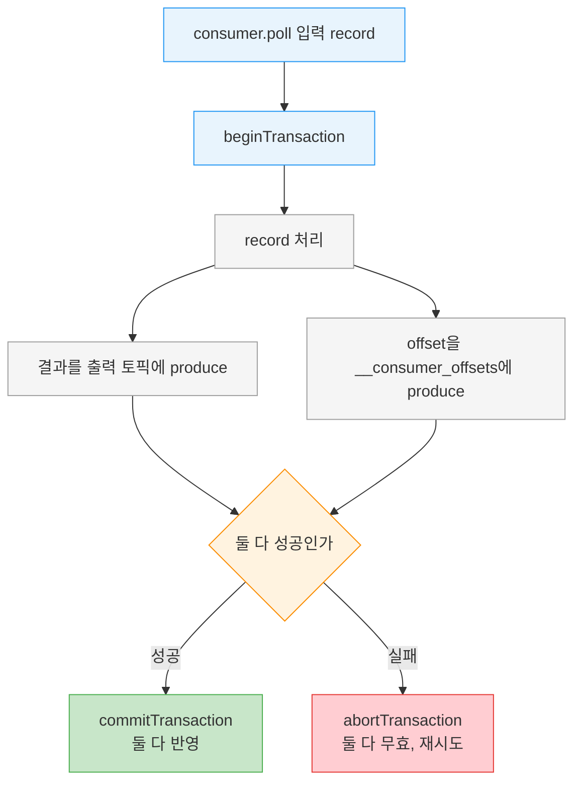
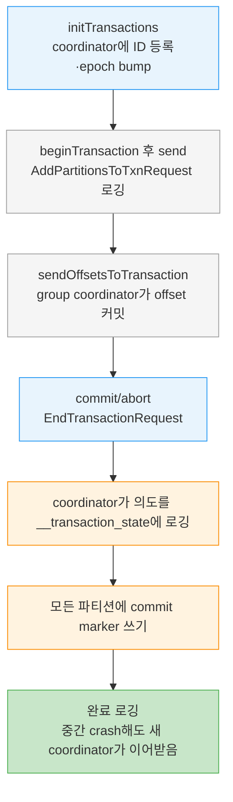

# Kafka Transactions 내부 — Zombie Fencing·2PC


> [03-05.Idempotent Producer](03-05.Idempotent%20Producer%20—%20PID·시퀀스·중복%20방지.md)가 발행 측 retry 중복을 막았다면, 이 글은 그보다 강한 보장인 트랜잭션을 다룹니다. 트랜잭션은 스트림 처리 앱이 "읽고-처리하고-쓰는(consume-process-produce)" 흐름에서 정확히 한 번 처리하도록 Kafka에 추가됐습니다. 결과 발행과 offset 커밋을 한 원자 단위로 묶고, 죽었는데 살아 돌아온 zombie 인스턴스가 중복을 만들지 못하게 막습니다. API 호출만으로도 쓸 수 있지만, 내부에서 무슨 일이 일어나는지 알아야 기대대로 동작하지 않을 때 진단할 수 있습니다.


## 학습 목표

> 트랜잭션이 어떤 재처리 문제를 푸는지, atomic multipartition write와 zombie fencing이 어떻게 동작하는지, 그리고 트랜잭션이 풀지 못하는 경계를 설명할 수 있는 것이 이 장의 목표입니다.

이 장을 다 읽고 다음 다섯 가지에 자신 있게 답할 수 있으면 학습이 완료됩니다.

1. EOS(behavior)와 transactions(mechanism)의 구분, 그리고 트랜잭션이 푸는 두 재처리 문제를 설명할 수 있습니다.
2. atomic multipartition write가 무엇을 한 원자 단위로 묶는지 말할 수 있습니다.
3. epoch 기반 zombie fencing과 KIP-447 consumer group metadata fencing을 구분할 수 있습니다.
4. read_committed·LSO·transaction.timeout.ms가 consumer 가시성에 주는 영향을 설명할 수 있습니다.
5. 트랜잭션이 풀지 못하는 문제(side effect·DB·MirrorMaker·pub/sub)를 말할 수 있습니다.


## 1. 목적과 푸는 문제

> 트랜잭션은 Kafka Streams의 정확성을 위해 consume-process-produce 패턴에 맞춰 만들어졌습니다. app 크래시와 zombie app이 일으키는 두 가지 재처리 중복을 막습니다.

트랜잭션은 Kafka Streams로 개발한 앱의 정확성을 보장하려고 Kafka에 추가됐습니다. 스트림 처리 앱이 정확한 결과를 내려면 각 입력 record가 정확히 한 번 처리되고 그 결과가 정확히 한 번 반영돼야 합니다, 실패 상황에서도. 한 가지 구분을 짚고 갑니다. **트랜잭션(transactions)은 밑바탕 메커니즘의 이름이고, exactly-once semantics는 스트림 처리 앱의 동작입니다.** Kafka Streams는 트랜잭션으로 EOS를 구현하고, Spark Streaming이나 Flink는 다른 메커니즘으로 EOS를 제공합니다. 트랜잭션은 스트림 처리 앱 전용으로, "consume-process-produce" 패턴에 맞춰 설계됐습니다. 이 맥락에서 각 입력 record 처리는 앱 내부 state가 갱신되고 결과가 출력 토픽에 성공적으로 produce된 뒤 완료로 간주됩니다.

단순한 스트림 처리 앱을 봅니다. source 토픽에서 이벤트를 읽고 처리해 다른 토픽에 결과를 씁니다. 무엇이 잘못될 수 있을까요? 두 가지 재처리 시나리오가 있습니다.

**app 크래시로 인한 재처리**. 메시지를 consume해 처리한 뒤 앱은 두 가지를 합니다. 결과를 출력 토픽에 produce하고, consume한 메시지의 offset을 커밋합니다. 이 순서로 진행하던 중 출력은 produce됐지만 입력 offset은 커밋되기 전에 앱이 크래시하면? rebalance로 파티션이 다른 consumer에 재배정되고, 그 consumer는 마지막 커밋된 offset부터 다시 읽습니다. 마지막 커밋부터 크래시까지의 record가 다시 처리되고 결과가 다시 쓰여 중복이 됩니다.

**zombie app으로 인한 재처리**. 앱이 record batch를 consume한 직후 아무것도 하기 전에 얼거나 Kafka 연결을 잃으면? heartbeat를 여러 번 놓쳐 dead로 간주되고 파티션이 다른 consumer에 재배정됩니다. 그 consumer가 그 batch를 다시 읽어 처리하고 결과를 출력합니다. 그 사이 얼었던 첫 인스턴스가 활동을 재개해 방금 consume한 batch를 처리하고 결과를 출력할 수 있습니다. poll이나 heartbeat로 자기가 dead이고 다른 인스턴스가 그 파티션을 가졌음을 알아채기 전에 말입니다. 죽었는데 그것을 모르는 consumer를 **zombie**라 합니다. 추가 보장이 없으면 zombie가 출력 토픽에 중복 결과를 만듭니다.


## 2. atomic multipartition write

> 트랜잭션은 결과 발행과 offset 커밋을 한 원자 단위로 묶습니다. 둘 다 파티션에 쓰기이므로, 결과 토픽과 __consumer_offsets에 함께 쓰고 함께 커밋하거나 함께 중단합니다.

exactly-once 처리는 consume·process·produce가 원자적이라는 뜻입니다. 원본 메시지의 offset이 커밋되고 결과가 성공적으로 produce되거나, 둘 다 일어나지 않거나입니다. offset은 커밋됐는데 결과는 produce되지 않은(또는 그 반대인) 부분 결과가 생기면 안 됩니다.

이를 위해 Kafka 트랜잭션은 **atomic multipartition write**를 도입합니다. offset 커밋과 결과 produce는 둘 다 파티션에 메시지를 쓰는 일입니다. 결과는 출력 토픽에, offset은 `__consumer_offsets` 토픽에 쓰입니다. 트랜잭션을 열어 두 메시지를 쓰고 둘 다 성공하면 커밋하고, 아니면 중단해 재시도하면, 우리가 원하던 exactly-once 의미론을 얻습니다.



이를 쓰려면 **transactional producer**를 씁니다. `transactional.id`를 설정하고 `initTransactions()`로 초기화한 producer입니다. producer.id는 브로커가 자동 생성하지만, **transactional.id는 producer 설정의 일부이고 재시작 사이에 유지될 것으로 기대됩니다.** transactional.id의 주된 역할은 재시작을 넘어 같은 producer를 식별하는 것입니다. 브로커는 transactional.id와 producer.id의 매핑을 유지하므로, 기존 transactional.id로 `initTransactions()`를 다시 호출하면 새 랜덤 번호 대신 같은 producer.id가 할당됩니다.


## 3. Zombie Fencing — epoch와 KIP-447

> zombie가 출력에 쓰지 못하게 막는 것이 fencing입니다. initTransaction이 epoch를 올려 낮은 epoch의 옛 producer를 FencedProducer 에러로 거부하고, KIP-447은 consumer group metadata를 fencing에 더합니다.

zombie 인스턴스가 출력 스트림에 결과를 쓰지 못하게 막으려면 zombie fencing 메커니즘이 필요합니다. 흔히 쓰는 방법이 epoch입니다. Kafka는 transactional producer를 초기화하는 `initTransaction()`이 호출될 때 transactional.id에 연결된 **epoch 번호를 증가**시킵니다. 같은 transactional.id이지만 더 낮은 epoch를 가진 producer의 send·commit·abort 요청은 **`FencedProducer` 에러로 거부**됩니다. 옛 producer는 출력 스트림에 쓰지 못하고 `close()`를 강제당해, zombie가 중복 record를 만들지 못합니다.

Apache Kafka 2.5부터는 consumer group metadata를 transaction metadata에 더하는 옵션이 있습니다(KIP-447). 이 metadata도 fencing에 쓰여, 서로 다른 transactional ID를 가진 producer들이 같은 파티션에 쓰면서도 zombie 인스턴스를 막을 수 있게 합니다.

transactional.id를 잘 고르는 일은 보기보다 까다롭습니다. 잘못 할당하면 앱 에러가 나거나 exactly-once 보장을 잃습니다. 핵심 요건은 **같은 앱 인스턴스는 재시작 사이에 일관된 transactional.id를 갖고, 다른 인스턴스는 다른 ID를 갖는 것**입니다. 그래야 브로커가 zombie 인스턴스를 막을 수 있습니다.

2.5 이전에는 fencing을 보장하는 유일한 길이 transactional.id를 파티션에 정적으로 매핑하는 것이었습니다. 각 파티션이 항상 같은 transactional.id로 consume되게 보장하는 방식입니다. producer A(transactional ID A)가 topic T를 처리하다 연결을 잃고 교체 producer가 ID B를 가지면, 나중에 A가 zombie로 복귀해도 ID가 B와 달라 fencing되지 않습니다. producer A는 항상 producer A로 교체돼야 새 A가 더 높은 epoch를 갖고 zombie A가 제대로 막힙니다. KIP-447은 transactional ID에 더해 consumer group metadata 기반 fencing을 도입했습니다. offset 커밋 메서드에 consumer group ID 대신 group metadata를 인자로 넘기면, 새 generation의 consumer group에서 온 트랜잭션은 통과하고 옛 generation(zombie)의 것은 막힙니다.


## 4. isolation.level과 LSO

> consumer가 read_committed로 설정돼야 abort된 트랜잭션을 거릅니다. read_committed는 LSO 이후 메시지를 보류해 순서를 지키고, 오래 열린 트랜잭션은 e2e 지연을 키웁니다.

트랜잭션은 대부분 producer 기능입니다. 그런데 그것만으로는 부족합니다. 트랜잭션으로 쓴 record는, 결국 중단된 트랜잭션의 것이라도, 다른 record처럼 파티션에 쓰입니다. **consumer가 올바른 isolation으로 설정돼야** 기대한 exactly-once 보장이 성립합니다.

`isolation.level=read_committed`로 설정하면, 토픽을 subscribe한 뒤 `consumer.poll()`은 성공적으로 커밋된 트랜잭션에 속하거나 비트랜잭션으로 쓰인 메시지만 반환합니다. 중단된 트랜잭션이나 아직 열린 트랜잭션의 메시지는 반환하지 않습니다. 기본값 `read_uncommitted`는 열리거나 중단된 트랜잭션을 포함해 모든 record를 반환합니다. read_committed 모드라도 특정 트랜잭션의 모든 메시지를 받는다는 보장은 없습니다. 트랜잭션에 속한 토픽의 일부만 subscribe하면 메시지의 일부만 받습니다. 또 앱은 트랜잭션이 언제 시작·끝나는지, 어떤 메시지가 어느 트랜잭션의 것인지 알 수 없습니다.

순서를 보장하기 위해 read_committed 모드는 **첫 still-open 트랜잭션이 시작된 지점(Last Stable Offset, LSO) 이후 produce된 메시지를 반환하지 않습니다.** 그 메시지는 트랜잭션이 producer에 의해 커밋·중단되거나, `transaction.timeout.ms`(기본 15분)에 도달해 브로커가 중단할 때까지 보류됩니다. 트랜잭션을 오래 열어 두면 consumer를 지연시켜 end-to-end latency가 커집니다.

단순 스트림 잡은 입력이 비트랜잭션으로 쓰였더라도 출력에 exactly-once 보장을 갖습니다. atomic multipartition produce가, 출력 record가 출력 토픽에 커밋됐다면 그 consumer의 입력 record offset도 커밋됐음을 보장하기 때문입니다. 그 결과 입력 record는 다시 처리되지 않습니다.


## 5. 트랜잭션이 풀지 못하는 문제

> 트랜잭션은 Kafka 안 multipartition 원자 쓰기와 zombie fencing만 합니다. 외부 side effect, DB 쓰기, 클러스터 복사, pub/sub에는 exactly-once를 주지 못합니다.

트랜잭션은 multipartition 원자 쓰기(읽기는 아님)와 스트림 처리 앱의 zombie producer fencing을 제공합니다. 그 결과 consume-process-produce 체인 안에서 exactly-once를 보장합니다. 다른 맥락에서는 아예 동작하지 않거나 원하는 보장을 위해 추가 노력이 필요합니다. 두 가지 흔한 오해가 있습니다. exactly-once 보장이 Kafka에 produce하는 것 외의 동작에도 적용된다는 오해, 그리고 consumer가 항상 트랜잭션 전체를 읽고 경계 정보를 안다는 오해입니다.

**Side effect**. 처리 단계가 사용자에게 이메일을 보내는 일을 포함하면, EOS를 켜도 이메일이 한 번만 보내진다고 보장하지 못합니다. 보장은 Kafka에 쓴 record에만 적용됩니다. 시퀀스 번호로 dedup하거나 marker로 트랜잭션을 중단하는 것은 Kafka 안에서만 작동하고, 이미 보낸 이메일을 되돌리지는 못합니다. REST API 호출이나 파일 쓰기 등 외부 효과가 있는 모든 동작이 마찬가지입니다.

**Kafka에서 읽어 DB에 쓰기**. 외부 DB에 쓰면 producer가 관여하지 않습니다. record는 DB driver(보통 JDBC)로 쓰이고 offset은 consumer가 Kafka에 커밋합니다. 외부 DB 쓰기와 Kafka offset 커밋을 한 트랜잭션에 묶는 메커니즘은 없습니다. 대신 offset을 DB에서 관리하고 데이터와 offset을 DB 한 트랜잭션에 함께 커밋할 수 있는데, 이는 Kafka가 아니라 DB의 트랜잭션 보장에 의존합니다. 마이크로서비스가 DB 갱신과 Kafka 발행을 한 원자 트랜잭션으로 묶고 싶을 때 흔히 쓰는 해법이 **Outbox 패턴**입니다([02-01](02-01.Outbox.md)). 마이크로서비스는 Kafka 토픽("outbox")에만 발행하고, 별도 relay 서비스가 그것을 읽어 DB를 갱신합니다. Kafka가 DB의 exactly-once 갱신을 보장하지 않으므로 그 갱신을 멱등으로 만드는 것이 중요합니다.

**DB→Kafka→DB**, **클러스터 복사(MirrorMaker)**, **pub/sub**도 트랜잭션만으로는 end-to-end 보장을 주지 못합니다. read_committed consumer는 일부 토픽에 lag이 있거나 트랜잭션 경계를 식별할 정보가 없어 한 트랜잭션의 모든 record를 봤다고 보장하지 못하기 때문입니다. pub/sub에서는 consumer가 자기 offset 커밋 로직에 따라 메시지를 한 번 이상 처리할 수 있어 exactly-once에 못 미칩니다.

> ⚠️ **pub/sub deadlock 경고**: 메시지를 발행한 뒤 다른 앱의 응답을 기다렸다가 트랜잭션을 커밋하는 패턴은 피해야 합니다. 다른 앱은 트랜잭션이 커밋된 뒤에야 그 메시지를 받으므로, 서로를 기다리는 deadlock에 빠집니다.


## 6. 사용법 — Kafka Streams와 직접 API

> 가장 권장하는 길은 Kafka Streams의 processing.guarantee를 켜는 것입니다. 직접 쓸 때는 transactional API로 begin·send·sendOffsets·commit/abort를 한 흐름으로 묶습니다.

트랜잭션은 브로커 기능이자 Kafka 프로토콜의 일부라 여러 client가 지원합니다. 가장 흔하고 권장하는 길은 **Kafka Streams에서 exactly-once를 켜는 것**입니다. 이러면 트랜잭션을 직접 쓰지 않고 Kafka Streams가 뒤에서 알아서 씁니다. `processing.guarantee`를 `exactly_once` 또는 `exactly_once_beta`로 설정하면 끝입니다(exactly_once_beta는 in-flight 트랜잭션이 있는 크래시·hang 인스턴스를 다루는 다른 방법으로, 브로커 2.5·Streams 2.6에 도입돼 단일 transactional producer로 더 많은 파티션을 다뤄 확장성을 높입니다). Spring 설정으로 표현하는 법은 [06_StreamProcessing/01-02](../06_StreamProcessing/01-02.Kafka%20Streams%20Spring%20Boot.md)에서 다룹니다.

Kafka Streams 없이 직접 쓰려면 transactional API를 씁니다.

```java
// 직접 transactional API — consume-process-produce를 한 트랜잭션으로
producerProps.put(ProducerConfig.TRANSACTIONAL_ID_CONFIG, transactionalId); // 앱 인스턴스 식별, 고유·장수명
consumerProps.put(ConsumerConfig.ENABLE_AUTO_COMMIT_CONFIG, "false");        // offset은 트랜잭션이 쓴다
consumerProps.put(ConsumerConfig.ISOLATION_LEVEL_CONFIG, "read_committed");  // 중단·진행 중 트랜잭션 무시

producer.initTransactions();  // ID 등록·epoch bump(같은 ID는 zombie)·옛 in-flight 트랜잭션 중단
consumer.subscribe(Collections.singleton(inputTopic));

while (true) {
  try {
    ConsumerRecords<Integer, String> records = consumer.poll(Duration.ofMillis(200));
    if (records.count() > 0) {
      producer.beginTransaction();  // 여기부터 commit/abort까지가 한 원자 트랜잭션
      for (ConsumerRecord<Integer, String> record : records) {
        producer.send(transform(record));  // 비즈니스 로직 처리 후 결과 발행
      }
      // offset을 트랜잭션의 일부로 커밋 — 다른 방법으로 커밋하면 트랜잭션 보장 없음
      producer.sendOffsetsToTransaction(consumerOffsets(), consumer.groupMetadata());
      producer.commitTransaction();  // 성공하면 결과·offset이 함께 확정
    }
  } catch (ProducerFencedException | InvalidProducerEpochException e) {
    // 우리가 zombie다 — 새 인스턴스가 우리 ID로 돌고 있다. 곱게 종료
    throw new KafkaException("transactional.id가 다른 프로세스에서 사용 중");
  } catch (KafkaException e) {
    producer.abortTransaction();          // 쓰기 중 에러면 중단하고
    resetToLastCommittedPositions(consumer); // consumer 위치 되돌려 재시도
  }
}
```

핵심 주의는 **offset을 반드시 `sendOffsetsToTransaction`으로만 커밋**하는 것입니다. auto-commit을 끄고 consumer의 commit API를 호출하지 않습니다. 다른 방법으로 커밋하면 트랜잭션 보장이 없어, 결과 발행에 실패해도 미처리 record의 offset이 커밋될 수 있습니다. `ProducerFencedException`을 받으면 우리가 zombie라는 뜻이므로 곱게 종료하고, 다른 `KafkaException`은 중단·되돌림·재시도합니다.

> 💬 **비유**: 트랜잭션은 식당의 주문 전표 한 장과 같습니다. 음식(결과)과 계산서(offset)를 한 전표에 묶어, 둘 다 확정되거나 둘 다 취소됩니다. 전표 번호(transactional.id)가 같으면 같은 테이블로 인식하고, 새 점원이 오면 번호의 세대(epoch)를 올려 옛 점원(zombie)의 전표를 거절합니다. 이 비유는 "한 단위로 묶고 옛 세대를 거른다"까지 유효하지만, 식당 전표는 종이 한 장에 다 적히는 반면 Kafka 트랜잭션은 여러 파티션에 흩어 쓰고 marker로 묶으므로, 그 묶음을 마무리하는 데 §7의 2단계 커밋이 필요하다는 점에서 단순화된 것입니다.


## 7. 내부 동작 — Chandy-Lamport marker와 2단계 커밋

> 트랜잭션은 Chandy-Lamport marker에서 영감을 받아, transaction coordinator가 __transaction_state 로그에 의도를 기록하고 모든 파티션에 marker를 쓰는 2단계 커밋으로 원자성을 보장합니다.

트랜잭션의 기본 알고리즘은 Chandy-Lamport snapshot에서 영감을 받았습니다. "marker" control 메시지를 통신 채널에 보내고 marker의 도착으로 일관된 state를 판단하는 방식입니다. Kafka 트랜잭션은 marker 메시지로 여러 파티션에 걸쳐 트랜잭션이 커밋·중단됐음을 표시합니다. producer가 커밋을 결정하면 transaction coordinator에 "commit"을 보내고, coordinator가 트랜잭션에 관여한 모든 파티션에 commit marker를 씁니다. producer가 일부 파티션에만 쓰고 크래시하면 어떻게 될까요? Kafka는 이를 **2단계 커밋(two-phase commit)과 transaction log**로 해결합니다. 알고리즘은 네 단계입니다. 진행 중 트랜잭션의 존재와 관여 파티션을 로깅하고, 커밋·중단 의도를 로깅하고(이게 로깅되면 결국 커밋·중단이 확정됩니다), 모든 파티션에 transaction marker를 쓰고, 트랜잭션 완료를 로깅합니다. 이 transaction log가 내부 토픽 **`__transaction_state`** 입니다.



API 호출의 내부를 짚습니다. `initTransaction()`은 transactional producer의 **transaction coordinator** 브로커에 요청을 보냅니다. consumer group coordinator처럼 각 브로커가 producer 일부의 coordinator이고, transactional ID의 coordinator는 그 ID가 매핑된 transaction log 파티션의 leader입니다. 이 호출은 새 transactional ID를 등록하거나 기존 ID의 epoch를 증가시켜 zombie가 됐을 수 있는 이전 producer를 막습니다. epoch가 증가하면 pending 트랜잭션이 중단됩니다. `beginTransaction()`은 프로토콜이 아니라 producer에 트랜잭션이 진행 중임을 알릴 뿐입니다. producer가 record를 보내기 시작해 새 파티션을 감지할 때마다 `AddPartitionsToTxnRequest`로 브로커에 그 파티션이 트랜잭션의 일부임을 알리고, 이것이 transaction log에 기록됩니다.

커밋할 때가 되면 먼저 처리한 record의 offset을 커밋합니다. `sendOffsetsToTransaction()`이 offset과 consumer group ID를 coordinator에 보내고, coordinator가 group ID로 group coordinator를 찾아 consumer group처럼 offset을 커밋합니다. `commitTransaction()`이나 `abortTransaction()`은 `EndTransactionRequest`를 coordinator에 보냅니다. coordinator는 커밋·중단 의도를 transaction log에 로깅하고, 성공하면 책임지고 커밋을 완료합니다. 관여한 모든 파티션에 commit marker를 쓰고 transaction log에 완료를 로깅합니다. coordinator가 의도를 로깅한 뒤 완료 전에 크래시하면 새 coordinator가 선출돼 로그에서 의도를 집어 완료합니다. `transaction.timeout.ms` 안에 커밋·중단되지 않으면 coordinator가 자동으로 중단합니다.

> ⚠️ **메모리 누수 위험**: transactional·idempotent producer의 record를 받는 각 브로커는 producer/transactional ID를 마지막 다섯 batch 관련 state와 함께 메모리에 저장하고, producer가 비활성된 뒤 `transactional.id.expiration.ms`(기본 7일) 동안 유지합니다. 새 idempotent producer나 새 transactional ID를 고속으로 만들고 재사용하지 않으면 브로커 메모리 누수와 비슷해집니다. 초당 3개씩 한 주를 쌓으면 180만 producer state·900만 batch metadata로 약 5GB RAM을 써 OOM이나 심한 GC를 부릅니다. 앱 시작 시 소수의 장수명 producer를 초기화해 재사용하길 권하고, 불가능하면(FaaS 등) expiration.ms를 낮춰 빨리 만료시킵니다.


## 8. 성능

> 트랜잭션 오버헤드는 메시지 수와 무관하므로 트랜잭션당 메시지를 많이 묶을수록 상대 오버헤드가 줍니다. consumer는 read_committed로 인한 지연만 늘 뿐 처리량은 줄지 않습니다.

트랜잭션은 producer에 적당한 오버헤드를 더합니다. transactional ID 등록은 producer 생애에 한 번이고, 파티션 등록은 트랜잭션당 파티션당 최대 한 번이며, 트랜잭션마다 commit 요청이 파티션마다 commit marker 하나를 더 씁니다. 초기화와 commit 요청은 동기라 완료·실패·timeout까지 데이터가 나가지 않아 오버헤드를 더합니다. 중요한 점은 **이 오버헤드가 트랜잭션 내 메시지 수와 무관하다는 것**입니다. 그래서 트랜잭션당 메시지가 많을수록 상대 오버헤드가 줄고 동기 정지 횟수도 줄어 전체 처리량이 오릅니다.

consumer 쪽에서는 commit marker를 읽는 약간의 오버헤드가 있습니다. 트랜잭션이 consumer 성능에 주는 핵심 영향은 read_committed consumer가 열린 트랜잭션의 record를 반환하지 않는다는 데서 옵니다. 트랜잭션 커밋 간격이 길면 consumer가 메시지를 반환받기까지 더 기다려 end-to-end latency가 커집니다. 다만 consumer가 열린 트랜잭션 메시지를 buffer할 필요는 없습니다. 브로커가 fetch 응답에 그것을 반환하지 않으므로, 트랜잭션을 읽는 데 추가 작업이 없어 처리량 감소도 없습니다.


## 9. 면접 대비 Q&A

> 답을 보지 않고 먼저 입으로 답해 본 뒤 비교해 보면 좋습니다.

### Q1. EOS와 transactions의 구분, 그리고 트랜잭션이 푸는 두 재처리 문제는?

transactions는 밑바탕 메커니즘이고 exactly-once semantics는 스트림 처리 앱의 동작입니다. Kafka Streams가 트랜잭션으로 EOS를 구현합니다. 푸는 두 문제는 app 크래시 재처리(출력은 produce됐는데 offset 커밋 전 크래시 → rebalance 후 재처리)와 zombie app 재처리(dead로 간주됐는데 얼었던 인스턴스가 살아나 같은 batch를 또 출력)입니다.

### Q2. atomic multipartition write는 무엇을 묶나요?

결과 발행과 offset 커밋을 한 원자 단위로 묶습니다. 결과는 출력 토픽에, offset은 `__consumer_offsets`에 쓰이는데, 둘 다 파티션 쓰기이므로 한 트랜잭션으로 열어 둘 다 성공이면 커밋하고 아니면 중단합니다. offset만 커밋되고 결과는 안 된(또는 그 반대인) 부분 결과를 막습니다.

### Q3. epoch fencing과 KIP-447 fencing은 어떻게 다른가요?

epoch fencing은 initTransaction이 transactional.id의 epoch를 올려, 낮은 epoch의 옛 producer 요청을 FencedProducer로 거부합니다. 단 같은 transactional.id가 같은 파티션에 정적 매핑돼야 하므로, ID가 바뀌면 zombie를 못 막습니다. KIP-447(2.5)은 consumer group metadata를 트랜잭션에 붙여, 새 generation의 그룹에서 온 트랜잭션은 통과시키고 옛 generation(zombie)은 막습니다. 정적 매핑 없이도 fencing이 됩니다.

### Q4. read_committed·LSO·transaction.timeout.ms는 consumer 가시성에 어떤 영향을 주나요?

read_committed는 커밋된 트랜잭션과 비트랜잭션 메시지만 반환하고 중단·열린 트랜잭션은 거릅니다. 순서를 지키려고 첫 열린 트랜잭션 시작점(LSO) 이후 메시지를 보류하는데, 그 메시지는 트랜잭션이 커밋·중단되거나 transaction.timeout.ms(기본 15분)에 도달해 브로커가 중단할 때까지 안 보입니다. 그래서 트랜잭션을 오래 열어 두면 consumer 지연이 커집니다.

### Q5. 트랜잭션이 exactly-once를 주지 못하는 경우는?

Kafka에 produce하는 것 외의 동작입니다. 이메일·REST 같은 side effect는 되돌릴 수 없고, 외부 DB 쓰기는 offset 커밋과 한 트랜잭션에 묶이지 않습니다(Outbox 패턴 + 멱등 갱신으로 우회). DB→Kafka→DB나 MirrorMaker 클러스터 복사는 consumer가 트랜잭션 경계를 알 수 없어 원자성이 보존되지 않고, pub/sub은 consumer 자기 offset 로직에 따라 한 번 이상 처리될 수 있습니다.


## 10. 관련 문서

- [03-04.Exactly-once 의미론과 Consumer Idempotency](03-04.Exactly-once%20의미론과%20Consumer%20Idempotency.md) — EOS 경계와 소비 측 멱등성(트랜잭션이 닿지 못하는 영역)
- [03-05.Idempotent Producer — PID·시퀀스·중복 방지](03-05.Idempotent%20Producer%20—%20PID·시퀀스·중복%20방지.md) — EOS의 다른 축, 발행 측 retry 중복 방지
- [01-02.Kafka Streams Spring Boot](../06_StreamProcessing/01-02.Kafka%20Streams%20Spring%20Boot.md) — processing.guarantee로 트랜잭션을 간접 사용
- [02-01.Outbox](02-01.Outbox.md) — DB 쓰기를 트랜잭션이 못 묶을 때의 해법
