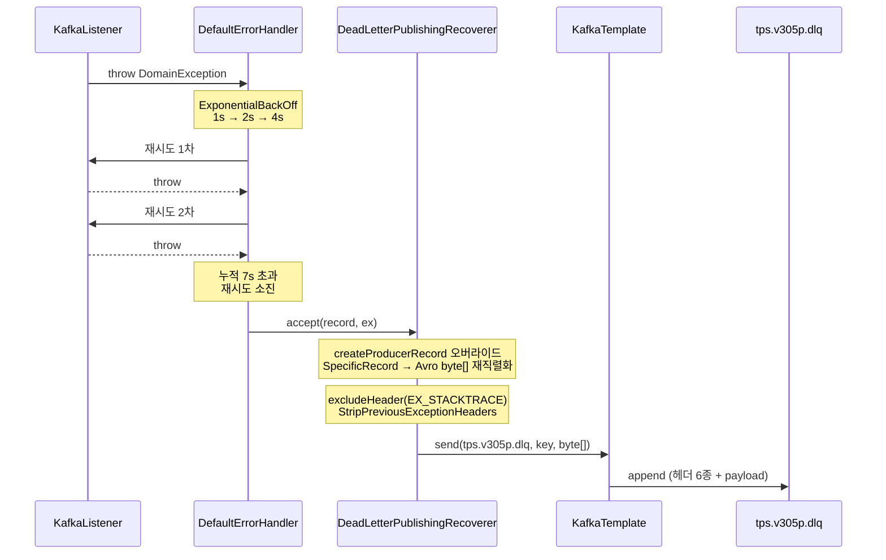
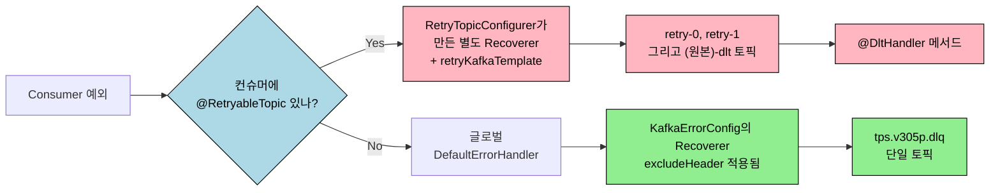
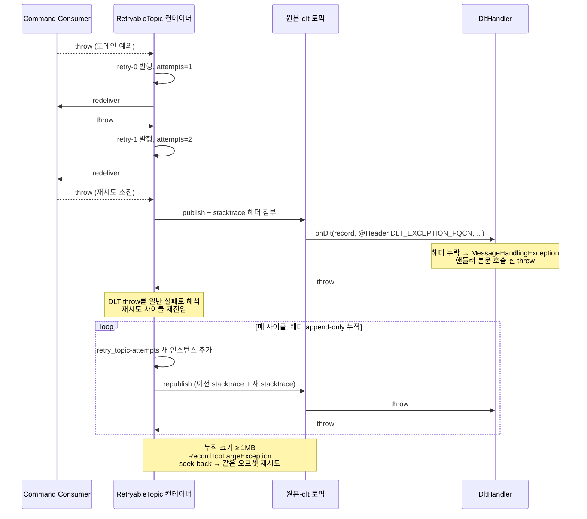
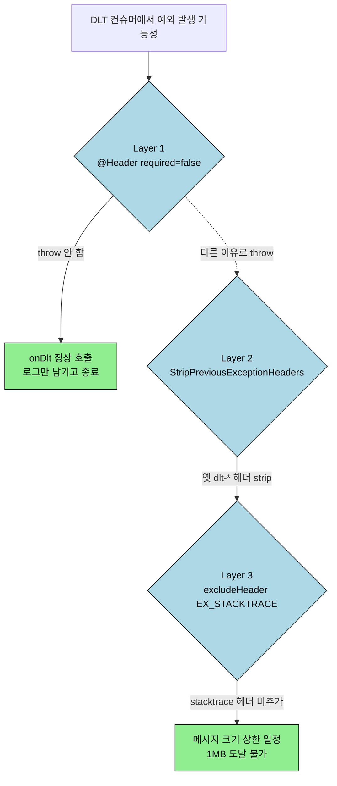

# KafkaErrorConfig DLT 헤더 폭증 사고 회고

---

> Spring Kafka의 `DeadLetterPublishingRecoverer`는 매 발행마다 헤더를 *추가*만 한다. 헤더가 새는 자리(retry attempts, stacktrace)와 발행이 throw하는 자리(`@DltHandler`)가 만나면 한 메시지가 1MB(`max.request.size`)를 돌파해 DLT 발행 자체가 실패한다. 이 문서는 `message-lib/KafkaErrorConfig.java` 한 파일의 동작을 라인 단위로 풀고, 그 위에서 실제로 발생한 무한 루프 사고를 시간순으로 재구성한다.

`02-01.Avro 직렬화 예외처리 전략`이 "왜 즉시 DLQ로 격리하는가"를 다룬다면, 본 문서는 "그 DLQ 격리 코드가 실제로 어떻게 동작하며, 어떤 가정이 깨지면 시스템이 어떻게 부서지는가"를 다룬다. 한쪽이 전략 일반론이라면 다른 쪽은 운영 디테일과 회고다.


## 1. 왜 이 문서가 필요한가

2026-05-14에 305p 개발계 executor에서 한 오프셋(`tps.v305p.operator.cmd.deploy-dlt-0@10308`)이 무한 재시도 사이클에 빠지며 `RecordTooLargeException`을 분당 수십 번씩 던지는 사고가 발생했다. 단일 버그가 아니라 세 가지 메커니즘이 겹쳐 만든 증폭 구조였고, 이 구조를 이해하려면 `KafkaErrorConfig.java`의 모든 라인이 *왜 그 모양인지* 알아야 했다.

문서가 답해야 할 질문은 셋이다.

- 글로벌 `CommonErrorHandler`(빈 한 개)와 `@RetryableTopic`(어노테이션 한 개)이 같은 컨슈머에서 동시에 살아 있을 때 어느 쪽이 발동하는가
- `DeadLetterPublishingRecoverer`가 헤더를 어떻게 다루는가 — 기본 동작이 *덮어쓰기*가 아니라 *append* 인 이유와 그 함정
- 이번 사고에서 메시지가 1MB를 어떻게 돌파했는가 — 트리거, 증폭, 임계 초과 세 지점을 분리하기

뒤에서 사용하는 코드는 모두 실제 `okestro/tps-gitlab2/message-lib`의 운영 코드이며, 다이어그램은 사고 직후 실측한 로그·헤더 덤프를 기반으로 재구성했다.


## 2. KafkaErrorConfig 한 파일 정독

> 파일은 한 개의 `@Bean` 메서드로 이루어진다. 안에서 만드는 객체는 `DefaultErrorHandler` 하나뿐이지만, 그 안에 들어가는 부품 네 가지(`Recoverer`, 헤더 정책 두 개, 백오프, 재시도 분류)가 각각 운영 의미를 가진다. 이 절에서는 부품마다 *왜 그 자리에 그 설정이 들어갔는지*를 추적한다.

### 2-1. CommonErrorHandler 빈의 구성요소

```java
@AutoConfiguration
public class KafkaErrorConfig {

    @Bean
    public CommonErrorHandler kafkaErrorHandler(KafkaTemplate<String, byte[]> kafkaTemplate
            , ObjectProvider<AvroSerializer> avroSerializerProvider) {
        // 1) Recoverer — 어디로, 어떻게 보낼지
        // 2) BackOff   — 얼마나, 몇 번 재시도할지
        // 3) errorHandler — 위 둘을 묶고, 어떤 예외는 백오프 없이 즉시 recover 할지
    }
}
```

- `CommonErrorHandler`는 Spring Kafka 컨테이너가 리스너 예외를 받아 처리하는 표준 인터페이스다. 빈 하나가 등록되면 *동일 application의 모든 `@KafkaListener`*가 그 핸들러를 공유한다. 즉 본 빈은 시스템 전체의 기본 에러 정책이며, 개별 리스너에 `@RetryableTopic`이 따로 붙으면 그쪽이 우선 동작하는 구조다(§4 참조).

핵심 의존성은 두 가지다. `KafkaTemplate<String, byte[]>`는 outbox 발행 경로와 동일한 byte[] 직렬화 템플릿이라 DLQ로 보낼 때도 같은 라인을 탄다. `ObjectProvider<AvroSerializer>`는 선택적 의존성으로, schema-registry가 설정되지 않은 환경(테스트 등)에서는 빈이 없을 수 있고 그때는 byte[] fallback이 동작한다.

### 2-2. DeadLetterPublishingRecoverer — Avro 재직렬화 트릭

```java
DeadLetterPublishingRecoverer recoverer = new DeadLetterPublishingRecoverer(
        kafkaTemplate,
        (record, ex) -> new TopicPartition(Topics.DLQ.getValue(), 0)
) {
    @Override
    protected ProducerRecord<Object, Object> createProducerRecord(ConsumerRecord<?, ?> record
            , TopicPartition topicPartition
            , org.apache.kafka.common.header.Headers headers
            , byte[] key, byte[] value) {
        Object originalValue = record.value();
        if (originalValue instanceof SpecificRecord specificRecord && avroSerializer != null) {
            byte[] avroBytes = avroSerializer.serialize(topicPartition.topic(), specificRecord);
            return super.createProducerRecord(record, topicPartition, headers, key, avroBytes);
        }
        return super.createProducerRecord(record, topicPartition, headers, key, value);
    }
};
```

생성자의 두 번째 인자(`BiFunction`)는 *어떤 토픽-파티션으로 보낼지*를 결정한다. `Topics.DLQ.getValue()`는 `"tps.v305p.dlq"` 단일 토픽이며, 파티션도 항상 0번이다. 단일 DLQ 정책의 장점과 단점은 `02-01 §3-5`에서 다룬다 — 본 문서는 그 선택을 *이미 한 상태*에서 출발한다.

`createProducerRecord` 오버라이드가 비자명한 부분이다. 컨슈머가 `KafkaAvroDeserializer` + `specific.avro.reader=true`로 역직렬화하므로 `record.value()`는 `SpecificRecord` 인스턴스다. 그런데 발행 쪽 `KafkaTemplate<String, byte[]>`는 `ByteArraySerializer`로 묶여 있어 Java 객체를 그대로 넘기면 `ClassCastException`이 난다. 오버라이드는 이 미스매치를 해결한다 — Avro 객체를 다시 schema-registry 기반 byte[]로 직렬화한 뒤 부모 메서드에 넘긴다.

이 트릭은 outbox 경로의 직렬화 일관성을 유지하기 위한 비용이다. outbox는 *이미 byte[]*인 메시지를 폴러로 흘려보내야 하므로 KafkaTemplate이 byte[]여야 하고, 그러면 DLQ recoverer는 SpecificRecord를 다시 byte[]로 변환해야 한다. 직렬화기 두 벌을 운영하지 않기 위한 의도된 선택이다.

### 2-3. excludeHeader(EX_STACKTRACE) — 스택트레이스 헤더 차단

```java
recoverer.excludeHeader(DeadLetterPublishingRecoverer.HeaderNames.HeadersToAdd.EX_STACKTRACE);
```

`DeadLetterPublishingRecoverer`는 DLT로 메시지를 보낼 때 기본으로 7종의 헤더를 추가한다(`02-01 §3-5` 표 참조). 그중 `kafka_dlt-exception-stacktrace`가 *풀 스택트레이스 문자열을 통째로* 헤더 값에 넣는다. 일반 도메인 예외는 그 자체로 수십 KB가 되고, 복잡한 프레임워크 스택은 100KB를 넘기기도 한다.

문제는 헤더가 *발행마다 추가만 된다*는 점이다. 같은 메시지가 두 번 발행되면 stacktrace 헤더가 두 개 생기고, 그 메시지가 또 DLT로 들어오면 세 개가 된다. 일반적인 운영 흐름에서는 한 메시지가 두 번 DLT 발행되는 일이 드물지만, §5의 사고 시나리오에서는 이게 매번 일어났다.

이 설정 한 줄로 stacktrace 헤더 자체를 출력 목록에서 빼버린다. 운영 진단에 필요한 정보는 `kafka_dlt-exception-fqcn`(예외 클래스명)과 `kafka_dlt-exception-message`(예외 메시지)만으로도 충분하고, 풀 스택은 서비스 로그(logback)에서 조회한다는 약속이다.

### 2-4. setStripPreviousExceptionHeaders(true) — 이전 예외 헤더 strip

```java
recoverer.setStripPreviousExceptionHeaders(true);
```

`excludeHeader`가 *새로 추가하는 stacktrace 헤더를 막는다면*, 이 설정은 *원본 ConsumerRecord에 이미 붙어 있던 옛 dlt-* 헤더를 발행 전에 제거*한다. 두 설정은 서로 보완 관계다.

DLT 메시지가 어쩌다 한 번 더 DLT 사이클로 들어가는 상황을 가정해 보자. 첫 번째 사이클에서 붙은 헤더가 두 번째 사이클의 입력에 그대로 있고, recoverer가 새 헤더를 또 추가하면 같은 종류의 헤더가 두 벌이 된다. `true`로 두면 새 사이클 진입 시 옛 헤더를 닦아내고 새로 붙이므로 누적이 끊긴다.

### 2-5. ExponentialBackOff — 1초·2초·4초 백오프 곡선

```java
ExponentialBackOff backOff = new ExponentialBackOff(1000L, 2.0);
backOff.setMaxElapsedTime(7000L);
```

초기 간격 1초, 배수 2.0, 최대 누적 7초다. 실제 호출 간격은 1초·2초·4초로 늘어나며, 누적 7초가 넘으면 추가 재시도를 중단하고 recoverer에 넘긴다. 결과적으로 약 3회 재시도다.

이 곡선이 합리적인 이유는 외부 호출에 의존하는 실패(외부 API 일시 단절, DB deadlock 등)가 보통 수초 안에 자가 회복하기 때문이다. 더 길게 늘리면 head-of-line blocking 비용이 커지고, 더 짧게 줄이면 재시도가 거의 의미 없는 패턴이 된다.

> **1차 소스**: Fixed / Exponential / WithMaxRetries 곡선 비교, jitter, 외부 시스템 SLA 기준 곡선 결정 절차는 [05-05.Backoff 전략 비교와 선택](05-05.Backoff%20전략%20비교와%20선택.md).

### 2-6. addNotRetryableExceptions — 재시도 분류

```java
errorHandler.addNotRetryableExceptions(
        IllegalArgumentException.class
        , AvroSerializationException.class
        , DeserializationException.class
);
```

세 가지 예외는 백오프를 거치지 않고 *즉시* recoverer로 넘긴다. 공통점은 "재시도해도 결과가 동일"하다는 것이다. 잘못된 인자, Avro 스키마 위반, ErrorHandlingDeserializer가 변환한 역직렬화 실패는 시간이 지나도 같은 바이트를 같은 코드가 보면 같은 예외가 난다.

`DeserializationException`이 목록에 있는 이유는 미묘하다. `ErrorHandlingDeserializer`는 역직렬화 실패를 raw bytes + 헤더 형태로 listener까지 전달하는데, Spring Kafka는 이 헤더가 있으면 자동으로 `DeserializationException`을 재발생시킨다(상세는 `02-01 §3-4`). 그 시점에 백오프를 태우면 의미 없이 컨슈머가 멈춰 있으므로 즉시 격리해야 한다.


## 3. 정상 DLT 흐름

> 도메인 예외가 발생했을 때 글로벌 `CommonErrorHandler` 경로가 어떻게 동작하는지를 한 호흡으로 본다. 이 흐름이 표준이고, §5의 사고는 이 흐름의 가정 두 가지가 무너졌을 때 어떻게 깨지는지의 사례다.



도착한 DLQ 메시지에는 stacktrace를 제외한 6종의 표준 헤더(`kafka_dlt-original-topic`, `-partition`, `-offset`, `-timestamp`, `-exception-fqcn`, `-exception-message`)와 원본 payload가 그대로 담긴다. 운영자는 `fqcn`을 알람 라벨로 쓰고, 풀 스택은 서비스 로그에서 같은 시각으로 조회한다.

이 흐름의 두 가지 가정은 다음과 같다.

- recoverer는 *한 번만 호출된다* — 메시지가 DLQ로 옮겨지면 컨슈머는 다음 오프셋으로 진행하므로 같은 메시지에 대한 추가 호출은 없다
- DLQ에 도달한 메시지는 *별도 운영자가 처리하거나 폐기*한다 — 자동 재처리는 안 된다

§5에서 보겠지만 첫 번째 가정이 무너지면 헤더 누적이 시작된다.


## 4. @RetryableTopic과 글로벌 errorHandler — 이중 경로

> 같은 컨슈머에 `@RetryableTopic`이 붙어 있으면 글로벌 `CommonErrorHandler`가 발동하지 않고, `@RetryableTopic`이 만든 *별도의* `DeadLetterPublishingRecoverer`가 동작한다. 같은 클래스(DeadLetterPublishingRecoverer)지만 *인스턴스가 다르다*. 이 차이가 사고의 출발점이다.



두 경로의 차이를 한 표로 정리한다.

| 항목 | 글로벌 `CommonErrorHandler` | `@RetryableTopic` |
|------|------------------------------|--------------------|
| 발동 조건 | 컨슈머에 `@RetryableTopic` 없음 | 컨슈머 메서드에 어노테이션 부착 |
| 재시도 방식 | in-place 재호출 (같은 partition 보유) | retry-N 토픽으로 이동 후 별도 컨슈머가 처리 |
| 대기 동안 partition 점유 | 점유 (head-of-line blocking 위험) | 비점유 (다음 메시지 즉시 진행) |
| DLT 토픽 | `Topics.DLQ` 단일 (`tps.v305p.dlq`) | 원본 토픽명 + `-dlt` suffix |
| Recoverer 인스턴스 | KafkaErrorConfig의 빈 | RetryTopicConfigurer가 내부 생성 |
| excludeHeader 적용 | ✅ | ❌ (별도 인스턴스라 본 빈의 설정과 무관) |
| Producer template | byte[] 기본 template | `retryKafkaTemplate` (Avro 전용) |

마지막 두 줄이 함정의 핵심이다. `KafkaErrorConfig.excludeHeader(EX_STACKTRACE)`는 글로벌 경로의 recoverer에만 적용되고, `@RetryableTopic`이 만드는 내부 recoverer는 그 설정을 전혀 보지 못한다. 같은 토픽이라도 어느 경로로 들어가느냐에 따라 헤더 정책이 달라진다.

이 시스템에서 Command 컨슈머(`Build`, `Deploy`, `Test`)는 `@RetryableTopic`을 쓴다. retry-0/-1 토픽으로 head-of-line blocking을 피하고 싶었기 때문이다. 그러면 글로벌 KafkaErrorConfig는 그 컨슈머들에 대해선 *대기 상태*가 되고, 사고도 그 경로에서 일어났다.


## 5. 사고 회고 — DLT 무한 루프

> 한 메시지(`tps.v305p.operator.cmd.deploy-dlt-0@10308`)가 모든 메시지 처리를 막은 사건의 시간순 재구성. 트리거 한 줄, 증폭 한 줄, 임계 초과 한 줄로 풀린다.

### 5-1. 시작 트리거 — @Header(required=true) 누락 throw

패치 전 `DeployCommandConsumer.onDlt` 시그니처는 다음과 같았다.

```java
@DltHandler
public void onDlt(
        ConsumerRecord<String, DeployCommandAvro> record,
        @Header(KafkaHeaders.DLT_EXCEPTION_FQCN) String exceptionClass,
        @Header(KafkaHeaders.DLT_EXCEPTION_MESSAGE) String exceptionMessage
) { ... }
```

`@Header`는 기본값 `required=true`다. Spring Messaging은 인자 바인딩 단계에서 해당 헤더가 없으면 `MessageHandlingException("Missing header 'kafka_dlt-exception-fqcn' ...")`을 던진다. *핸들러 본문이 호출되기 전*에 발생하는 예외라 try/catch로 잡을 수도 없다.

문제 상황은 DLT 토픽 메시지가 어떤 이유로든 *해당 헤더 없이 들어왔을 때*다. 예를 들어 누군가 수동으로 메시지를 적재했거나, 옛 버전의 producer가 다른 헤더 셋으로 발행했거나, 한 번 DLT를 거쳐 헤더가 변형된 메시지가 다시 들어왔을 때다.

### 5-2. 증폭 메커니즘 — @RetryableTopic이 DLT throw를 일반 실패로 해석

`@DltHandler` 메서드의 throw는 Spring Kafka 입장에서는 *그 DLT 토픽의 일반 처리 실패*다. retry-DLT 토폴로지는 DLT 토픽도 `@RetryableTopic` 컨테이너 안에서 처리되므로, 거기서 throw가 나면 retry 사이클의 입력으로 되돌아간다.

매 사이클에서 일어나는 일을 추적해 보면 다음과 같다.

- recoverer가 `retry_topic-attempts` 헤더를 새로 추가 — 단 값은 *덮어쓰기*가 아니라 *append*다. 헤더는 multi-value 컬렉션이므로 같은 키가 여러 개 공존한다
- recoverer가 `kafka_dlt-exception-stacktrace` 헤더에 *현재 사이클의 스택트레이스*를 추가 — `StripPreviousExceptionHeaders(true)`가 적용되지 않은 별도 인스턴스라 이전 헤더는 그대로 남는다

실제 사고 시점에 사용자가 캡처한 헤더 덤프는 다음과 같았다.

```
retry_topic-attempts: 0x00   (48번째 attempt)
retry_topic-attempts: 0x00
retry_topic-attempts: 0x00
retry_topic-attempts: 0x01   (49번째)
retry_topic-attempts: 0x01
... (수십~수백 회 반복)
```

같은 키의 헤더 인스턴스가 수십 개씩 공존하고 있었다. 이게 진짜 누적의 증거다.

### 5-3. 임계 초과 — 1MB 돌파

원본 `DeployCommandAvro` payload는 스키마상 수백 바이트(필드 9개, 대부분 짧은 문자열) 수준이다. 그러나 stacktrace 헤더 1개당 수십 KB이고 매 사이클마다 누적된다. 사이클 ~50회를 돌면 헤더만 1MB에 도달한다.

`max.request.size` 기본값이 1,048,576 bytes(1MB)다. 메시지가 그 한도를 넘으면 producer가 `RecordTooLargeException`을 던지고 DLT 발행 자체가 실패한다. 그 시점부터 흐름은 다음과 같이 바뀐다.

- recoverer가 publish 실패하면 DefaultErrorHandler가 seek-back으로 같은 오프셋을 다시 polling
- 다음 polling에서 동일 메시지를 또 받아 다시 사이클 진입
- 사이클이 돌수록 헤더가 더 누적되어 더 빨리 실패
- 컨슈머는 영원히 그 오프셋에서 진행하지 못함

### 5-4. 무한 루프 형성 시점



세 가지 메커니즘이 모이는 지점은 명확하다. *DLT가 throw하지 않았다면*, *@RetryableTopic이 DLT throw를 재진입으로 해석하지 않았다면*, *헤더가 append가 아니라 overwrite였다면* 어느 하나만 빠져도 사이클은 끊긴다. 셋이 동시에 성립해야 폭증이 발생한다.


## 6. 패치 — 세 계층 차단

> 사고 직후 적용한 수정은 세 군데다. 한 곳만 막아도 사이클이 끊기지만, 세 곳을 다 막은 이유는 *향후 다른 트리거가 등장해도 폭증으로 가지 않는 방어선*을 두기 위함이다.



### 6-1. EX_STACKTRACE 제외 (글로벌 KafkaErrorConfig)

```java
recoverer.excludeHeader(DeadLetterPublishingRecoverer.HeaderNames.HeadersToAdd.EX_STACKTRACE);
```

가장 큰 헤더(수십~수백 KB)를 출력 목록에서 빼버린다. 진단 정보는 `fqcn`과 `exception-message`로 충분하고, 풀 스택은 logback 로그에서 같은 시각으로 조회한다는 운영 약속을 코드에 박았다.

남는 약점은 §4 표에서 짚었다 — 본 설정은 *글로벌 경로의 recoverer*에만 적용되므로 `@RetryableTopic`이 만드는 내부 recoverer는 영향을 안 받는다. 다만 §6-3의 차단이 트리거 자체를 막기 때문에 실제 운영 위험은 사라진다.

### 6-2. setStripPreviousExceptionHeaders(true)

```java
recoverer.setStripPreviousExceptionHeaders(true);
```

DLT 메시지가 다른 경로로 한 번 더 사이클에 들어와도, 발행 직전에 옛 `kafka_dlt-*` 헤더를 모두 제거하고 새로 붙인다. §6-1과 같은 인스턴스 한정성을 가지지만, 두 설정을 함께 두면 *글로벌 경로*에서 헤더 누적이 발생할 자리가 없다.

### 6-3. @Header(required=false) — 트리거 차단

```java
@DltHandler
public void onDlt(ConsumerRecord<String, DeployCommandAvro> record) {
    log.error("[DeployCmd] DLT received: topic={}, key={}, partition={}, offset={}"
            , record.topic(), record.key(), record.partition(), record.offset());
}
```

Build/Deploy/Test 세 Command 컨슈머의 `@DltHandler` 시그니처를 `ConsumerRecord` 단독으로 단순화했다. `@Header` 의존 자체를 제거하면 헤더 누락이 throw로 이어질 자리가 없다. 예외 클래스/메시지는 record header에 그대로 들어 있으므로 필요한 곳에서 `record.headers().lastHeader("...")` 로 직접 꺼낸다.

이 변경이 *진짜 핵심*이다. §6-1, §6-2는 글로벌 경로 한정이라 `@RetryableTopic` 경로의 폭증을 직접 막지 못한다. 그러나 트리거가 사라지면 어느 경로든 사이클이 시작되지 않는다.


## 7. 운영 체크리스트

> 같은 사고가 다시 발생하지 않게 하는 점검 항목. 코드 리뷰와 운영 모니터링 양쪽에서 쓴다.

코드 리뷰 시점:

- `@DltHandler` 메서드는 절대 throw하지 않는다 — 외부 호출이나 DB 작업이 들어가야 하면 try/catch + log로 감싸 throw가 컨테이너로 새지 않게 한다
- `@Header` 인자를 추가할 때는 `required = false`를 기본값으로 둔다 — `@DltHandler`의 어떤 인자도 헤더 누락으로 throw를 만들면 안 된다
- 새 컨슈머에 `@RetryableTopic`을 붙일 때, 본 시스템의 글로벌 `CommonErrorHandler`가 그 컨슈머에 대해선 발동하지 않는다는 점을 인지한다

운영 모니터링:

- DLT 토픽의 메시지 크기 분포를 알람으로 잡는다 — 단일 메시지가 256KB를 넘으면 즉시 알림(1MB 임계의 25%)
- DLT 토픽의 publish 실패 카운터(`kafka.producer.record-error-rate`)에 임계치 1을 잡는다 — DLT 발행 실패는 사이클 시작 신호
- 컨슈머 lag이 한 오프셋에서 정체될 때 알람 — 무한 루프의 가장 직접적 증상은 *같은 오프셋의 반복 polling*이고, lag 진행이 멈추는 게 그 외부 신호
- `retry_topic-attempts` 헤더 인스턴스 수를 샘플링 — 한 메시지에 두 개 이상의 인스턴스가 있으면 비정상


## 8. 정리

`KafkaErrorConfig`는 한 파일에 짧게 들어 있지만, 그 안에서 결정되는 운영 정책은 네 가지다 — 어디로(`Topics.DLQ`), 어떻게(Avro 재직렬화), 얼마나(`ExponentialBackOff`), 무엇을 빼고(`excludeHeader`). 네 가지 모두 *글로벌 경로*에 한정되며, `@RetryableTopic`을 쓰는 컨슈머는 자기만의 별도 recoverer로 동작한다는 점이 함정이었다.

이번 사고는 트리거(`@Header(required=true)`), 증폭(append-only 헤더), 임계(1MB)가 한 줄로 만났을 때 어떻게 부서지는지의 실증이다. 세 계층 패치는 트리거를 끊고(`required=false`), 증폭의 가장 큰 기여를 빼고(`excludeHeader`), 옛 헤더가 다시 끌려오는 경로를 막는다(`StripPreviousExceptionHeaders`). 한 줄만 막아도 사이클은 끊기지만, 세 줄을 다 막은 이유는 *어떤 트리거가 새로 등장해도 같은 폭증을 만들지 않는 방어선*을 두기 위함이다.

다음 학습 단계로는 [../02-01.Avro 직렬화 예외처리 전략](../02_MessageContract/02-01.Avro%20직렬화%20예외처리%20전략.md)으로 돌아가 "재시도 분류" 결정 기준을 다시 확인하고, [../03-04.Exactly-once 의미론과 Consumer Idempotency](03-04.Exactly-once%20의미론과%20Consumer%20Idempotency.md)의 Inbox 패턴이 `@DltHandler` 무게를 어떻게 덜어주는지 점검한다. 5개 config 클래스 전체의 동작 흐름은 [04-01.message-lib config 5개 클래스 종합](../04_BrokerArchitecture/04-01.message-lib%20config%205개%20클래스%20종합.md)에 정리되어 있다.


---

> **TPS 적용 사례** — `okestro/tps-gitlab2`
>
> - **모듈/위치**: `message-lib/src/main/java/org/okestro/tps/messaging/config/KafkaErrorConfig.java`, `executor/engine/src/main/java/org/okestro/tps/common/messaging/{Build,Deploy,Test}CommandConsumer.java`
> - **요점**: 글로벌 `CommonErrorHandler`의 `DeadLetterPublishingRecoverer`는 `Topics.DLQ`(`tps.v305p.dlq`) 단일 토픽 + Avro 재직렬화 + `excludeHeader(EX_STACKTRACE)` + `setStripPreviousExceptionHeaders(true)`로 구성한다. `@RetryableTopic`을 쓰는 Command 컨슈머는 자기만의 내부 recoverer로 동작하므로, `@DltHandler`는 `ConsumerRecord` 단독 시그니처로 두어 헤더 누락 throw가 retry 사이클 재진입을 트리거하지 못하게 한다.
> - **사고 이력**: 2026-05-14 305p 개발계 `tps.v305p.operator.cmd.deploy-dlt-0@10308` 오프셋이 `RecordTooLargeException`으로 무한 재시도. 원인은 `@Header(DLT_EXCEPTION_FQCN) String`의 `required=true` 기본값이 헤더 누락 시 throw를 일으키고, `@RetryableTopic`이 그 throw를 재진입으로 해석하면서 매 사이클마다 stacktrace + retry-attempts 헤더가 누적되어 1MB 초과. 세 계층 패치(`excludeHeader`, `StripPreviousExceptionHeaders`, `@Header(required=false)`)로 동시 차단.
> - **상세**: 커밋 `message-lib/fe42fdc`, `executor/9546373`
