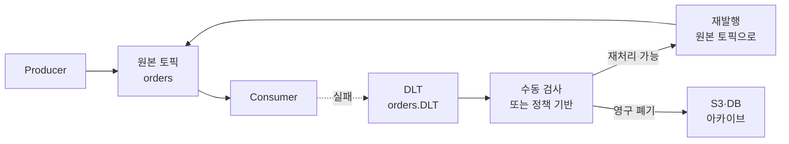

# Poison Message 처리 — DLT 흡수의 한계와 격리 큐

---

> *Poison Message* (또는 *poison pill*) 는 *컨슈머가 처리할 수 없는 메시지* 입니다. *역직렬화 실패*, *비즈니스 로직 영구 거부*, *외부 의존성과 영구 불일치* 같은 형태. 본 편은 *왜 일반 retry·DLT 만으로 부족한지*, *Spring Kafka 의 DefaultErrorHandler 가 무엇을 받칠 수 없는지*, 그리고 *격리 큐 (quarantine queue) 패턴* 의 운영 모델을 봅니다.


## Poison Message 가 무엇인가

> *재시도가 의미 없는 실패* 를 일으키는 메시지가 Poison Message 입니다. 일시 장애는 재시도로 풀리지만 *영구 실패* 는 풀리지 않습니다. 영구 실패의 메시지를 *큐 앞단에 두면* 컨슈머가 *영원히 그 메시지에서 막힙니다*.

영구 실패의 형태 세 가지입니다.

**1. 역직렬화 실패** — Avro 스키마와 메시지 형식이 안 맞아 `DeserializationException` 발생. 재시도해도 같은 메시지가 같은 예외를 던집니다. *메시지 자체가 잘못된* 케이스.

**2. 비즈니스 로직 영구 거부** — `IllegalArgumentException`, `IllegalStateException`, custom `ValidationException`. *입력이 도메인 규칙에 어긋남*. 외부 시스템 상태가 바뀌어 *다시 적용 불가* 한 경우도 포함.

**3. 외부 의존성과의 영구 불일치** — 메시지가 *존재하지 않는 외부 entity* 를 참조. 예: orderId 가 *이미 삭제된 주문* 을 가리킴. 시간이 지난다고 풀리는 문제가 아님.

이 셋은 *재시도가 의미 없습니다*. 그런데 *기본 컨슈머 정책* 은 *예외 발생 시 재시도* 라 *영구 막힘* 을 만듭니다.


## DLT 가 1차 답인 이유

> Spring Kafka 의 `DefaultErrorHandler` 가 *예외 발생 시 retry → 최종 실패 시 DLT 발행* 의 표준 흐름을 제공합니다. `05-01.Spring Kafka DLT와 Producer Config.md` 가 그 흐름을 다룹니다.

DLT (Dead Letter Topic) 가 푸는 것은 *컨슈머가 막히는 문제* 입니다. *영구 실패 메시지를 DLT 로 옮겨* 정상 토픽의 처리를 *진행시킵니다*. 컨슈머가 *그 메시지에서 멈추지 않습니다*.

```yaml
spring:
  kafka:
    consumer:
      properties:
        spring.deserializer.key.delegate.class: org.apache.kafka.common.serialization.StringDeserializer
        spring.deserializer.value.delegate.class: io.confluent.kafka.serializers.KafkaAvroDeserializer
```

`ErrorHandlingDeserializer` 가 *역직렬화 실패를 예외로 변환* 해 DLT 흐름에 흡수합니다. `DefaultErrorHandler` 가 *예외 분류 + retry 결정 + DLT 발행* 을 책임집니다.


## DLT 가 받칠 수 없는 자리 — 흡수의 한계

> DLT 가 *모든 영구 실패의 답* 이 아닙니다. 운영에서 자주 부딪히는 한계 4가지입니다.

### 1. DLT 가 *그 자체로* poison 이 되는 경우

DLT 의 발행이 *DLT Producer 의 직렬화 또는 네트워크 오류* 로 실패할 수 있습니다. 이 경우 *원본 메시지가 처리도 안 되고 DLT 로도 못 가서* 영원히 막힙니다. `05-04.KafkaErrorConfig DLT 헤더 폭증 사고.md` 가 그 사고의 사후 분석입니다.

답은 *DLT 의 DLT* (DLT-of-DLT) 를 별도 모니터링하거나, *영구 실패 시 메시지를 외부 저장소 (S3·DB) 로 옮기는* 패턴.

### 2. *영구 실패 메시지가 너무 많음*

비즈니스 거절률이 *수 %* 인 토픽에서는 DLT 가 *원본 토픽만큼* 커집니다. *DLT 의 운영 비용* (저장, 재처리 시도, 분석) 이 *원본 처리 비용에 근접* 합니다. 이 자리에서 *DLT 가 적합한 격리 모델이 아닐 수* 있습니다.

답은 *비즈니스 거절을 ack* (정상 처리) 로 표시하고 *별도 audit log* 만 남기는 패턴. *컨슈머 측에서 정상 종료 후 audit 발행*.

### 3. *재시도 가능 vs 영구 실패 의 구분이 모호*

`05-04` 의 사고가 정확히 이 자리입니다. *일시 장애로 인한 예외* 와 *영구 실패의 예외* 가 *같은 클래스* (예: `RuntimeException`) 라 *DefaultErrorHandler 가 구분 못 함*. 결과는 *재시도가 의미 없는 메시지를 N 번 재시도* 후 DLT 로.

답은 *재시도 가능 예외만 별도 표시* 하는 정책. `@RetryableTopic` 의 `include` 와 `exclude` 로 분리.

```java
@RetryableTopic(
    attempts = "4",
    include = { TransientException.class },
    exclude = { ValidationException.class, DeserializationException.class }
)
@KafkaListener(topics = "orders")
public void process(Order order) {
    // ...
}
```

`include` 의 예외만 retry 대상. *영구 실패의 예외는 *즉시* DLT 로* 보내 retry 자체를 안 합니다.

### 4. *Poison 의 *영향이 단일 메시지 이상*** 인 경우

한 메시지가 *공유 자원* (DB 락, 파일 핸들, 외부 세션) 을 *부분적으로 점유* 한 채 실패한 경우. *그 메시지를 DLT 로 보내도* 자원은 점유된 채입니다. *다음 메시지가 같은 자원을 못 잡아* *연쇄 실패* 가 발생합니다.

답은 *컨슈머 트랜잭션 경계 안에서* 자원 점유와 메시지 처리를 *원자적으로* 묶기. Outbox 패턴 (`02-01.Outbox.md`) 의 사고와 같은 자리.


## 격리 큐 (Quarantine Queue) 패턴

> *DLT 가 *최종 종착지* 가 아닌 *대기소* 가 되는* 운영 모델입니다. DLT 에 들어온 메시지를 *수동 또는 정책 기반* 으로 *원본 토픽으로 재발행* 합니다.



이 모델의 핵심은 *DLT 가 마지막이 아니다* 는 인식입니다. *DLT 가 격리 + 검사 자리* 입니다. 검사 결과에 따라 *재처리* 또는 *아카이브* 로 갑니다.

### 운영 구성

**DLT 컨슈머** — `05-02.DlqConsumer.md` 가 다루는 자리입니다. DLT 를 소비해 *메시지 분석·재발행·아카이브* 정책을 적용합니다.

**아카이브 저장소** — S3 가 흔합니다. 원본 메시지 + 실패 원인 헤더 + 타임스탬프 를 *영구 보관*. 운영자가 *문제 패턴 분석* 에 사용.

**재발행 정책** — *시간 기반 재시도* (1 시간 후 다시 시도), *수동 검토 후 재발행*, *외부 시스템 복구 알림 후 자동 재발행* 등.


## Poison Message 분류별 답

운영에서 *Poison Message 종류별로 다른 정책* 이 자연스럽습니다.

| 종류 | 정책 | 자리 |
|------|------|------|
| 역직렬화 실패 | DLT 로 발행 + 아카이브 | 메시지 자체가 잘못. 수동 검사 후 폐기 |
| 비즈니스 영구 거부 | 컨슈머 측 ack + audit log | DLT 거치지 않고 정상 종료. 통계만 |
| 외부 의존 불일치 | DLT + 재발행 정책 (외부 복구 시) | 외부 시스템 복구 후 자동 재처리 |
| 일시 장애 | retry + backoff | DLT 안 거침. `05-05.Backoff 전략 비교와 선택.md` |
| 알 수 없음 | DLT + 수동 검사 | 운영자 분석 후 정책 결정 |

이 분류가 *컨슈머 코드의 try-catch 블록 설계* 에 반영됩니다.

```java
@KafkaListener(topics = "orders")
public void process(Order order, Acknowledgment ack) {
    try {
        orderProcessor.handle(order);
        ack.acknowledge();
    } catch (ValidationException e) {
        // 비즈니스 영구 거부 — audit 후 ack
        auditService.logRejection(order, e);
        ack.acknowledge();
    } catch (TransientException e) {
        // 일시 장애 — ack 안 함, retry 정책 동작
        throw e;
    } catch (ExternalDependencyMissingException e) {
        // 외부 의존 불일치 — DLT 로
        dltService.send(order, e);
        ack.acknowledge();
    }
    // 알 수 없는 예외 — DefaultErrorHandler 가 retry + DLT
}
```

이 코드가 *Poison 분류를 컨슈머 측에서 명시* 하는 형태입니다. *DLT 흐름은 마지막 안전망* 으로 남깁니다.


## 운영 관측성

> Poison Message 의 *발생 빈도와 분류* 가 운영의 진실 공급원입니다.

세 가지 메트릭이 표준입니다.

**1. DLT 발행 비율** — `kafka_producer_record_send_total{topic="orders.DLT"}` / `kafka_consumer_records_consumed_total{topic="orders"}`. *0.1% 이상* 이면 알람 대상.

**2. Poison 분류별 카운트** — `audit.rejection.count{reason="validation"}`, `audit.rejection.count{reason="external_missing"}`. 어느 분류가 *늘어나는지* 가 운영 신호.

**3. DLT 적재 후 미처리 시간** — DLT 메시지가 *재발행 또는 아카이브로 가지 않고 쌓이는* 시간. 1 시간 이상이면 *DLT 컨슈머가 동작 안 함* 의 신호.

알람 룰은 *DLT 발행 비율이 평소 대비 10배 이상* 또는 *DLT 미처리 시간 1시간 초과* 가 일반적입니다.


## 함정 — 자주 막히는 자리들

**1. *모든 RuntimeException 을 retry 함*** — DefaultErrorHandler 디폴트가 이 동작. *영구 실패의 RuntimeException* (예: `IllegalArgumentException`) 도 N 번 재시도 후 DLT. 처리 시간과 다운스트림 부하 모두 낭비. *`addNotRetryableExceptions` 로 영구 실패 예외 명시* 필요.

**2. DLT 컨슈머가 *원본 컨슈머와 같은 클러스터·같은 인스턴스* 에 있음** — *원본 컨슈머가 다운되면 DLT 컨슈머도 다운*. *DLT 가 막혀* 검사·재발행이 안 됨. *별도 배포 단위* 가 답.

**3. *재발행이 무한 루프*** — DLT 메시지를 원본 토픽으로 재발행했는데 *같은 원인으로 다시 실패* → 다시 DLT → 다시 재발행. *재발행 횟수 헤더* (`kafka_dlt_retry_count`) 로 *최대 횟수* 정책을 명시.

**4. *역직렬화 실패가 DefaultErrorHandler 를 우회*** — `ErrorHandlingDeserializer` 안 쓰면 *역직렬화 실패가 컨슈머 메서드 호출 전에 발생* 해 DefaultErrorHandler 가 못 잡습니다. 의존성 추가와 설정이 필수.

**5. *DLT 도 retry policy 적용*** — DLT 컨슈머가 *DLT 자체에 또 retry·DLT* 를 적용하면 *무한 중첩*. DLT 컨슈머는 *재시도 없이 단순 처리* 가 표준.


## 관련 문서

- [`./05-01.Spring Kafka DLT와 Producer Config.md`](05-01.Spring%20Kafka%20DLT와%20Producer%20Config.md) — DefaultErrorHandler 와 DeadLetterPublishingRecoverer 의 기본 흐름. 본 편이 그 위에서 *DLT 흡수의 한계* 를 다룹니다
- [`./05-02.DlqConsumer.md`](05-02.DlqConsumer.md) — DLT 컨슈머 측 코드. 본 편의 *격리 큐 패턴* 의 검사·재발행 자리
- [`./05-04.KafkaErrorConfig DLT 헤더 폭증 사고.md`](05-04.KafkaErrorConfig%20DLT%20헤더%20폭증%20사고.md) — *재시도 가능 vs 영구 실패 구분 모호* 의 실제 사고. 본 편의 *DLT 한계* 절에 직결
- [`./06-02.Retry Storm 방지 — 백오프 jitter·동시성 제한·서킷.md`](06-02.Retry%20Storm%20방지%20—%20백오프%20jitter·동시성%20제한·서킷.md) — Poison 의 한 형태가 *재시도 폭주를 만드는* 자리. 본 편과 짝편으로 *컨슈머 측 회복탄력성* 의 두 축
- [`../../11_spring/03_network/resilience/01-01.Resilience4j 개요 — 5가지 모듈과 도입 결정.md`](../../11_spring/03_network/resilience/01-01.Resilience4j%20개요%20—%205가지%20모듈과%20도입%20결정.md) — HTTP 호출 측 회복탄력성. *컨슈머 측 정책 (이 시리즈)* 과 *HTTP 호출 측 정책 (Resilience4j)* 의 분담을 같이 보면 *애플리케이션 회복탄력성의 전체 그림* 이 잡힙니다
