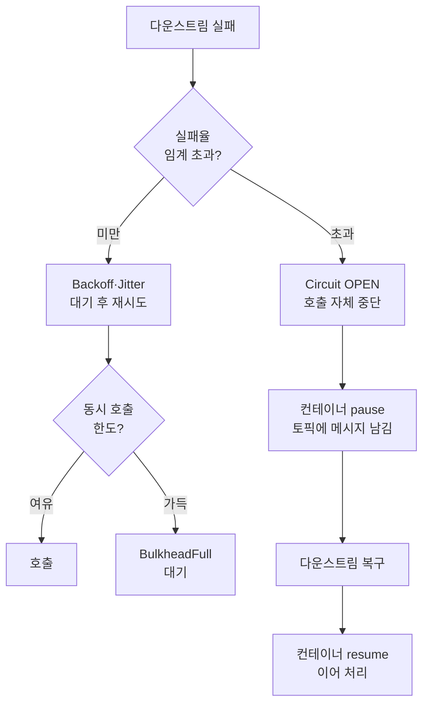

# Retry Storm 방지 — 백오프 jitter·동시성 제한·서킷

---

> *Retry Storm* 은 *재시도가 다운스트림 복구를 방해하는* 사고입니다. 일시 장애로 N 개 컨슈머가 동시에 실패 → 모두 같은 시점에 재시도 → 다운스트림이 *복구 중인데 다시 부하* → 다시 다운. *재시도 자체가 장애의 일부* 가 되는 자기 강화 루프입니다. 본 편은 *Kafka 컨슈머 측에서 Retry Storm 을 막는 세 가지 축* — 백오프와 jitter, 동시성 제한, 그리고 *서킷 패턴의 컨슈머 측 적용* 을 정리합니다.


## Retry Storm 이 발생하는 메커니즘

> 같은 시점 + 같은 백오프 = 같은 재시도 시각. 이 결정성이 사고의 핵심입니다.

상황 시나리오입니다.

1. *T 시점* — 외부 API (예: Payment Gateway) 가 일시 다운
2. *T 시점* — 컨슈머 인스턴스 10 개 × 각자 컨슈머 스레드 4 개 = *40 개 처리 스레드* 가 동시에 실패
3. *DefaultErrorHandler* 의 `FixedBackOff(1000ms, 3)` 정책 — *1초 후 재시도*
4. *T + 1초* — *40 개 호출이 동시에* Payment Gateway 로 향함
5. Payment Gateway 가 *복구 중* — 40 동시 호출에 다시 다운
6. *T + 2초* — 동일 패턴. 무한 반복

이 흐름이 *Retry Storm* 입니다. *복구가 안 되거나 더 오래 걸립니다*.


## 축 1 — Backoff + Jitter

> [`./05-05.Backoff 전략 비교와 선택.md`](05-05.Backoff%20전략%20비교와%20선택.md) 가 다룬 *백오프 곡선과 jitter* 의 사고가 그대로 본 편 답의 첫 축입니다.

### Exponential Backoff

`FixedBackOff` 대신 `ExponentialBackOff` 를 씁니다.

```java
@Bean
public DefaultErrorHandler errorHandler(KafkaTemplate<String, Object> template) {
    ExponentialBackOff backOff = new ExponentialBackOff(500L, 2.0);
    backOff.setMaxInterval(60_000L);     // 최대 60초
    backOff.setMaxElapsedTime(300_000L); // 총 5분
    return new DefaultErrorHandler(
            new DeadLetterPublishingRecoverer(template),
            backOff
    );
}
```

`500ms × 2 ^ n` 의 곡선. *짧은 장애* 는 초기 빠른 재시도로, *긴 장애* 는 후속 긴 대기로 받칩니다. `maxInterval` 이 *상한* — 무한히 길어지지 않게 막습니다.

### Jitter — 결정성 깨기

ExponentialBackOff 만으로도 *동일 시점에 실패한 컨슈머들이 같은 시각에 재시도* 합니다. *jitter (무작위 노이즈)* 가 그 결정성을 깹니다.

```java
ExponentialBackOffWithMaxRetries backOff = new ExponentialBackOffWithMaxRetries(5);
backOff.setInitialInterval(500L);
backOff.setMultiplier(2.0);
backOff.setMaxInterval(60_000L);
// Spring Kafka 가 jitter 직접 제공은 없음 → 커스텀 BackOff 또는 Resilience4j IntervalFunction 응용
```

Spring Kafka 자체 `BackOff` 는 *jitter 옵션이 없습니다*. 두 가지 답입니다.

**답 1: 커스텀 BackOff 구현** — `BackOff` 인터페이스의 `BackOffExecution.nextBackOff()` 에 *무작위 노이즈* 를 더한 값을 리턴.

```java
public class JitteredExponentialBackOff implements BackOff {

    private final long initialInterval;
    private final double multiplier;
    private final long maxInterval;
    private final double jitter;   // 0.0 ~ 1.0

    @Override
    public BackOffExecution start() {
        return new BackOffExecution() {
            long current = initialInterval;
            int attempt = 0;

            @Override
            public long nextBackOff() {
                long base = Math.min(current, maxInterval);
                long noise = (long) (base * jitter * (Math.random() * 2 - 1));
                current = (long) (current * multiplier);
                attempt++;
                return Math.max(0, base + noise);
            }
        };
    }
}
```

**답 2: Resilience4j IntervalFunction 차용** — Kafka 컨슈머 외부에서 *IntervalFunction.ofExponentialRandomBackoff* 를 호출해 *각 컨슈머가 직접 sleep*. 컨슈머가 *직접 재시도 루프를 짤 때* 적합.

### 효과

jitter 가 있으면 *40 개 호출이 동시에가 아니라 *분산된 시각에* 다운스트림으로 향합니다. *복구 중인 다운스트림* 이 *점진적 부하* 만 받아 *재시도가 복구를 방해하지 않습니다*.


## 축 2 — 동시성 제한

> 같은 토픽을 *너무 많은 스레드* 가 동시에 처리하면 *다운스트림 호출 동시성도 같이 늘어납니다*. 컨슈머 측 동시성 제한이 *다운스트림 부하 제한* 으로 직결됩니다.

### Kafka 컨슈머의 동시성 제어

Spring Kafka 의 `@KafkaListener` 의 `concurrency` 가 *컨테이너당 스레드 수* 입니다.

```java
@KafkaListener(
    topics = "orders",
    concurrency = "2"   // 컨슈머 스레드 2개
)
public void process(Order order) {
    // ...
}
```

`concurrency` 가 *파티션 수 이하* 여야 의미가 있습니다. 파티션 수 = 8, concurrency = 10 이면 *2 개 스레드는 idle*. concurrency 가 8 이상이면 *각 스레드가 1 개 파티션* 을 담당합니다.

### 호출 동시성을 줄이는 방법

다운스트림 부하를 줄이려면 *처리 동시성 자체를 낮춥니다*.

| 조정 | 효과 |
|------|------|
| `concurrency` 감소 | 처리 스레드 수 감소 → 다운스트림 호출 동시성 감소 |
| 컨슈머 인스턴스 수 감소 | 전체 처리량 감소 → 동시성 감소 |
| `max.poll.records` 감소 | 한 번에 가져오는 메시지 수 감소 → 처리 시간 분산 |

운영에서 *Retry Storm 의심 신호* 가 보이면 *임시로 concurrency 를 낮춰* 다운스트림 부하를 줄이는 게 *초기 대응* 입니다.

### Bulkhead 적용

[`../../11_spring/03_network/resilience/01-04.Bulkhead — Semaphore vs ThreadPool 격리.md`](../../11_spring/03_network/resilience/01-04.Bulkhead%20—%20Semaphore%20vs%20ThreadPool%20격리.md) 의 *Semaphore Bulkhead* 를 *Kafka 컨슈머 메서드 안의 외부 호출* 에 적용합니다.

```java
@KafkaListener(topics = "orders")
public void process(Order order) {
    // Resilience4j Bulkhead 적용
    paymentService.charge(order);  // @Bulkhead(name = "payment") 가 붙음
}
```

`paymentService.charge` 메서드에 `@Bulkhead(name = "payment", maxConcurrentCalls = 30)` 이 붙어 있다면 *전체 컨슈머 처리 스레드 수와 무관하게* Payment 호출은 *최대 30개 동시* 로 제한됩니다.

이 조합이 *컨슈머 처리량은 유지하면서 외부 호출 동시성만 제한* 하는 답입니다. 메시지 처리 중 *외부 호출 부분만* 격리.


## 축 3 — Circuit Breaker 컨슈머 측 적용

> 일시 장애가 *영구 다운으로 길어지는* 경우 *재시도 자체를 중단* 하는 게 답입니다. Resilience4j Circuit Breaker 를 *컨슈머 측 외부 호출* 에 적용합니다.

```java
@KafkaListener(topics = "orders")
public void process(Order order, Acknowledgment ack) {
    try {
        paymentService.charge(order);
        // paymentService.charge 가 @CircuitBreaker 로 감싸져 있음
        ack.acknowledge();
    } catch (CallNotPermittedException e) {
        // 서킷 OPEN — 다운스트림 다운. 재시도해도 의미 없음
        // 두 가지 답:
        // (A) ack 안 함 → DefaultErrorHandler 의 다음 backoff 사이클로
        // (B) DLT 로 직접 발행 후 ack
        throw e;
    }
}
```

`@CircuitBreaker` 가 *N% 실패율 초과 시 OPEN* 으로 전이합니다. OPEN 동안에는 호출이 *즉시 CallNotPermittedException 으로 거부* — 다운스트림에 호출이 *안 갑니다*.

### 컨슈머 측 서킷의 효과

| 상황 | 서킷 없음 | 서킷 있음 |
|------|---------|---------|
| 다운스트림 다운 직후 | 모든 메시지 retry → DLT | 서킷 CLOSED 동안 N 건 실패 |
| 다운스트림 다운 1 분 후 | 계속 retry → 폭주 | 서킷 OPEN — *호출 안 함* |
| 다운스트림 복구 | 자연스럽게 복구 | HALF_OPEN 시험 호출로 점진 복구 |

핵심은 *OPEN 동안 호출이 안 가는 시간* 입니다. 다운스트림이 *호출 없이 복구* 할 시간을 확보합니다.

### Pause/Resume 통합

Spring Kafka 의 `KafkaListenerEndpointRegistry` 로 *컨슈머 컨테이너를 일시 정지* 할 수 있습니다.

```java
@Autowired
private KafkaListenerEndpointRegistry registry;

public void onCircuitOpen() {
    registry.getListenerContainer("ordersListener").pause();
}

public void onCircuitClosed() {
    registry.getListenerContainer("ordersListener").resume();
}
```

서킷 상태 전이 이벤트와 연결합니다. *OPEN 으로 전이 → 컨테이너 pause*, *CLOSED 로 전이 → resume*. *재시도 자체가 정지* 되어 *원본 메시지가 토픽에 그대로 남습니다*. 다운스트림 복구 후 그대로 이어 처리.

이 패턴이 *재시도를 폭주가 아닌 흐름 제어* 로 바꿉니다.


## 세 축의 통합

> 본 편의 세 축은 *각자 다른 측면* 을 풉니다. 셋을 같이 적용해야 *완전한 Retry Storm 방지* 가 됩니다.

| 축 | 답하는 측면 | 도구 |
|----|----------|------|
| Backoff + Jitter | *동시 재시도 시각 분산* | Spring Kafka BackOff (커스텀 jitter) |
| 동시성 제한 | *호출 동시성 자체 줄임* | `concurrency`, Resilience4j Bulkhead |
| Circuit Breaker | *호출 자체 중단* | Resilience4j CircuitBreaker + Container pause |

각 축이 *다른 시점에 동작* 합니다.



세 축의 조합이 *jitter 로 동시성 분산* + *Bulkhead 로 호출량 제한* + *서킷으로 다운 시 호출 중단* 의 3중 안전망을 만듭니다.


## 운영 관측성

세 가지 메트릭 + 알람이 표준입니다.

**1. 재시도 빈도** — `spring_kafka_listener_retry_total` 같은 카운터. *평소 대비 10배 이상* 이 알람 신호. Spring Kafka 가 자동 노출.

**2. Circuit Breaker 상태 전이** — `resilience4j_circuitbreaker_state` 가 1 (OPEN) 으로 *5분 이상 지속* 이면 알람. [`../../11_spring/03_network/resilience/01-02.Circuit Breaker 상세 — 상태 전이와 Sliding Window.md`](../../11_spring/03_network/resilience/01-02.Circuit%20Breaker%20상세%20—%20상태%20전이와%20Sliding%20Window.md) 의 운영 관측과 같은 룰.

**3. Consumer Lag** — `kafka_consumergroup_lag` 가 *증가 추세* 면 *처리 속도가 발행 속도를 못 따라옴*. Retry Storm 의 결과 신호. *Lag 알람* 이 *후행 지표* 로서 가치.

알람 규칙은 *재시도 빈도 + 서킷 OPEN* 의 *조합* 이 일반적입니다. *재시도만 늘면 일시 장애*, *서킷도 OPEN 으로 가면 영구 다운* 의 분리.


## 함정 — 자주 막히는 자리들

**1. *Backoff 없이 즉시 재시도*** — `RetryTemplate` 의 `RetryPolicy` 디폴트가 이 동작인 경우가 있습니다. *Backoff 명시* 가 필수.

**2. *jitter 가 없는 ExponentialBackOff* 만으로 충분하다고 생각** — 1 ~ 2 인스턴스 환경이면 차이가 작지만 *수십 컨슈머 환경* 에서는 *동시 재시도* 가 폭주를 만듭니다.

**3. *Circuit Breaker 가 컨슈머 메서드 자체에 붙음*** — `@CircuitBreaker` 가 `@KafkaListener` 메서드에 직접 붙으면 *서킷이 컨슈머 처리 자체에 영향* . 답은 *외부 호출 메서드에만* 서킷 적용. 컨슈머는 외부 호출 메서드를 호출하기만.

**4. *Container pause 후 resume 누락*** — 서킷이 CLOSED 로 돌아왔는데 *컨테이너 resume 이 안 일어남*. 컨슈머가 영원히 정지. *상태 전이 이벤트 리스너* 의 양방향 (OPEN → pause, CLOSED → resume) 모두 구현 필수.

**5. *컨슈머 측 회복탄력성과 HTTP 측 회복탄력성을 따로 따로* 설정** — 둘이 *같은 다운스트림* 을 가리키면 *정책이 일관성 없음*. 한 도메인의 Resilience4j 인스턴스를 *컨슈머와 HTTP 호출이 공유* 하는 게 답.


## 시리즈 마무리

본 편이 *컨슈머 측 회복탄력성 시리즈 (06-NN)* 의 마무리입니다. *Resilience4j 시리즈 (`11_spring/03_network/resilience/`)* 가 *HTTP 호출 측* 을, *본 시리즈가 메시징 측* 을 분담합니다. 두 시리즈를 같이 봐야 *애플리케이션 회복탄력성의 전체 그림* 이 잡힙니다.


## 관련 문서

- [`./05-05.Backoff 전략 비교와 선택.md`](05-05.Backoff%20전략%20비교와%20선택.md) — Backoff 곡선과 jitter 의 기본 모델. 본 편의 *축 1* 의 토대
- [`./06-01.Poison Message 처리 — DLT 흡수의 한계와 격리 큐.md`](06-01.Poison%20Message%20처리%20—%20DLT%20흡수의%20한계와%20격리%20큐.md) — 본 편의 짝편. *영구 실패의 메시지를 어떻게 격리* 와 *재시도가 폭주를 만드는 흐름* 의 두 축이 컨슈머 측 회복탄력성을 완성
- [`../../11_spring/03_network/resilience/01-02.Circuit Breaker 상세 — 상태 전이와 Sliding Window.md`](../../11_spring/03_network/resilience/01-02.Circuit%20Breaker%20상세%20—%20상태%20전이와%20Sliding%20Window.md) — 본 편의 *축 3* 인 Circuit Breaker 의 깊이. OPEN/CLOSED/HALF_OPEN 전이 메커니즘
- [`../../11_spring/03_network/resilience/01-04.Bulkhead — Semaphore vs ThreadPool 격리.md`](../../11_spring/03_network/resilience/01-04.Bulkhead%20—%20Semaphore%20vs%20ThreadPool%20격리.md) — 본 편의 *축 2* 의 핵심. Bulkhead 가 *호출 동시성 제한* 의 표준 도구
- [`../04_BrokerArchitecture/03-02.Spring Kafka 운영 고급.md`](../04_BrokerArchitecture/03-02.Spring%20Kafka%20운영%20고급.md) — `concurrency`, container pause/resume, blocking vs non-blocking retry 의 상세. 본 편의 *축 2* 와 *축 3* 의 Kafka 측 도구 베이스
