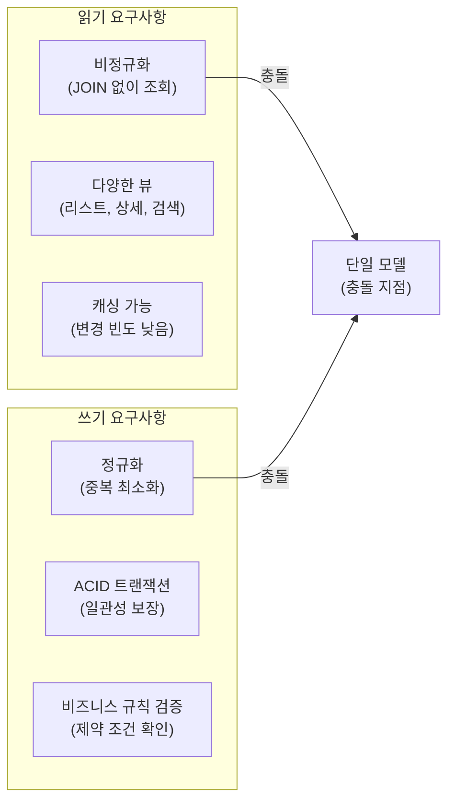
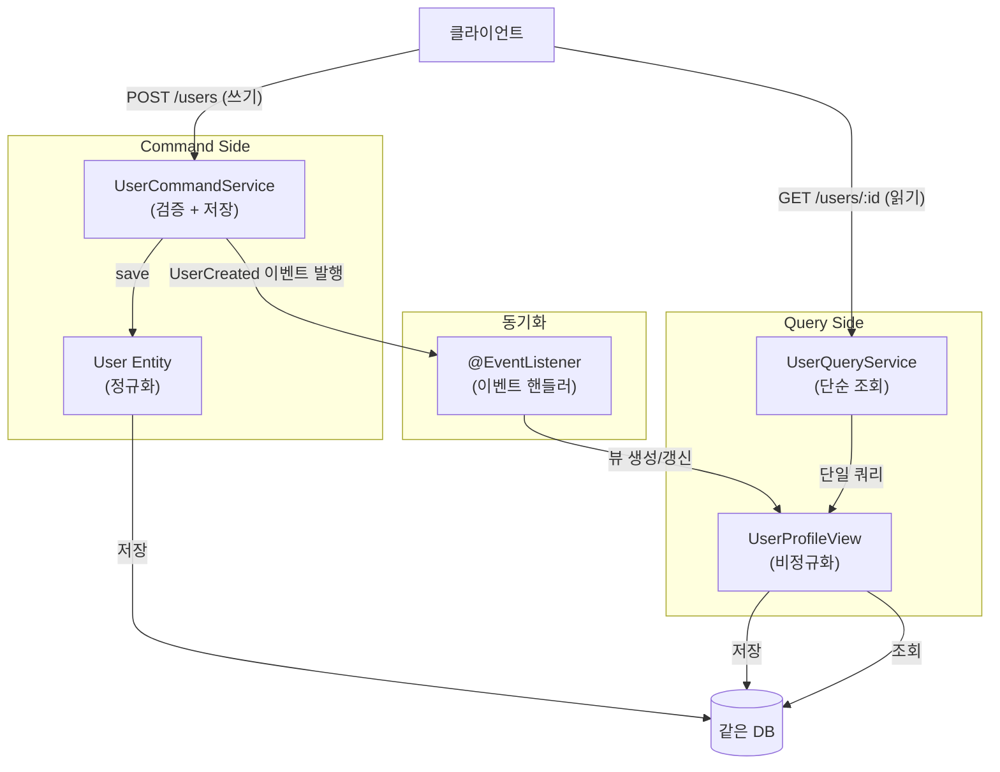
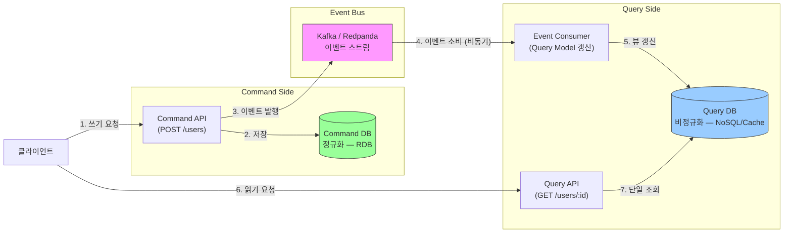
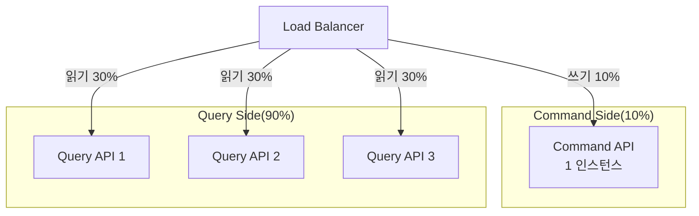
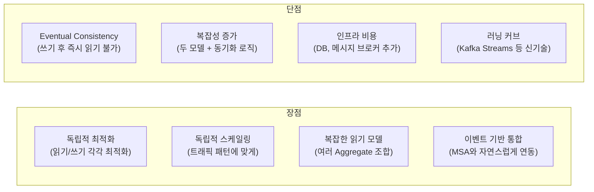

# Kafka CQRS — 읽기와 쓰기 분리

---

> CQRS(Command Query Responsibility Segregation)는 *읽기 모델*과 *쓰기 모델*을 다른 자료구조·다른 저장소로 분리하는 패턴이다. Kafka 환경에서는 쓰기 측 도메인 이벤트가 토픽으로 발행되고, *Projection 컨슈머*가 그 이벤트로 read 모델을 갱신한다. 읽기 측은 자기 도메인에 최적화된 형태(검색·집계·캐시)로 자유롭게 진화한다.


## 학습 목표

> CQRS가 *읽기와 쓰기의 형상 불일치*를 어떻게 분리·해결하는지 이해한다.

이 장을 다 읽고 다음 다섯 가지에 자신 있게 답할 수 있으면 학습이 완료된다.

1. Command·Query·Event의 관계와 *쓰기 모델 → 이벤트 → 읽기 모델* 흐름을 설명할 수 있다.
2. CQRS가 만드는 *eventual consistency*가 사용자 UX에 미치는 영향을 설명할 수 있다.
3. Read Model을 *Materialized View·검색 인덱스·캐시* 등 다양한 형태로 두는 이유를 설명할 수 있다.
4. Projection 컨슈머가 *멱등성*과 *순서 보장*을 어떻게 다루는지 설명할 수 있다.
5. CQRS를 *언제 도입하면 안 되는지*의 기준을 말할 수 있다.

# 왜 읽기와 쓰기를 분리하는가?

------

> *전통적인 CRUD 애플리케이션에서는 하나의 데이터 모델로 읽기와 쓰기를 모두 처리합니다. 단순하지만 읽기와 쓰기의 요구사항이 근본적으로 다르다는 사실을 무시합니다.*



- 읽기는 빠른 응답 속도를 위해 비정규화된 데이터와 JOIN없는 단일 조회를 원합니다.
- 쓰기는 데이터 정합성을 위해 정규화된 구조와 ACID 트랜잭션을 필요로합니다.

## 단일 모델의 문제점

다음과 같이 User 엔티티로 읽기/쓰기를 모두 처리할 때 어떤 비효율이 나오는지 보여줍니다.



```java
// 단일 모델: User 엔티티로 읽기/쓰기 모두 처리
@Entity
public class User {
    @Id private Long id;
    private String name;
    private String email;

    @OneToMany
    private List<Post> posts;  // 쓰기에는 불필요, 읽기에만 필요

    @ManyToMany
    private Set<User> followers;  // JOIN 비용 높음
}

// 쓰기: 사용자 생성 — posts, followers는 전혀 필요 없지만 엔티티가 들고 있음
public void createUser(String name, String email) {
    User user = new User(name, email);
    userRepository.save(user);
}

// 읽기: 사용자 프로필 조회 — N+1 문제 발생
public UserProfile getUserProfile(Long userId) {
    User user = userRepository.findById(userId);
    return new UserProfile(
        user.getName(),
        user.getPosts().size(),      // 별도 쿼리 발생 (비효율적)
        user.getFollowers().size()   // 별도 쿼리 발생 (비효율적)
    );
}
```

- 쓰기 시 불필요한 posts, followers 관계를 엔티티가 항상 가지며 호출에 N+1 이슈가 발생한다.
- 물론 위의 문제는 JPA의 ORM에서 비롯되며, Mybatis를 사용하게되면 대부분 해결되는 이슈입니다.

## CQRS란 무엇인가

> *CQRS 패턴을 처음 제시한 Greg Young은 CQRS는 동일한 데이터에 대해 읽기/쓰기 모델을 분리하는 것이다. 핵심은 “책임”의 분리이지, 기술적 구현이 아니라고 말합니다.*

이 말이 중요한 이유는 CQRS를 도입하기 위해 반드시 다른 DB나 메시지 브로커가 필요한게 아니라는 의미입니다. CQRS는 구현 수준에 따라 2가지 형태가 존재합니다.

1. 단순한 형태: 같은 DB를 쓰되, 읽기/쓰기 모델을 코드 레벨에서 분리합니다.
2. 완전한 형태: 읽기/쓰기 DB를 물리적으로 분리하고, 이벤트 스트림으로 동기화한다.

# CQRS의 형태

------

## 단순한 형태(같은 DB, 다른 모델)

> *같은 DB를 쓰더라도, 읽기/쓰기 객체를 코드레벨에서 분리하면 최적화할 수 있습니다.*


## 완전한 형태(다른 DB, 이벤트로 동기화)

> *읽기/쓰기를 물리적으로 완전히 분리하면, 각자의 특성에 맞는 DB를 선택하고, 독립적으로 스케일링 할 수 있습니다. Command가 토픽에 발행 → Query Side가 소비하여 읽기 전용 DB갱신*



1. **Command 처리 (동기)**: 클라이언트가 유효성 검증이후 정규화된 DB에 저장하고, UserCreated 이벤트를 Kafka 토픽에 발행합니다.
2. **Query Model 갱신(비동기)**: Kafka Consumer가 이벤트를 소비하여 비정규화된 읽기 전용 DB를 갱신합니다.
3. **Query 처리(동기)**: 클라이언트가 GET /users/:id를 호출하면 Query Service가 읽기 전용 DB에서 JOIN없이 즉시 데이터를 반환합니다.

```java
// Command Side — REST 요청을 이벤트로 변환하여 발행
@RestController
@RequestMapping("/api/commands")
public class UserCommandController {
    private final UserCommandService commandService;
    private final KafkaTemplate<String, Event> kafkaTemplate;

    @PostMapping("/users")
    public ResponseEntity<Void> createUser(@RequestBody CreateUserRequest req) {
        // 1. 검증 및 Command DB 저장
        User user = commandService.createUser(req.getName(), req.getEmail());

        // 2. 이벤트 발행 — Query Side가 비동기로 수신
        UserCreated event = new UserCreated(
            user.getId(),
            user.getName(),
            user.getEmail(),
            Instant.now()
        );
        kafkaTemplate.send("user.events", event);

        return ResponseEntity.accepted().build();  // 202 Accepted: 아직 읽기 모델 반영 전
    }
}

// Query Side — 이벤트를 소비하여 읽기 전용 뷰를 갱신하고, HTTP 조회 요청을 처리
@Service
public class UserQueryService {
    private final UserProfileViewRepository viewRepository;

    @KafkaListener(topics = "user.events")
    public void handleUserEvent(UserCreated event) {
        // Query Model 생성 — 비정규화된 뷰로 저장
        UserProfileView view = new UserProfileView(
            event.getUserId(),
            event.getName(),
            event.getEmail(),
            0,  // postCount 초기값
            0,  // followerCount 초기값
            event.getTimestamp()
        );
        viewRepository.save(view);
    }

    public UserProfileView getUserProfile(Long userId) {
        return viewRepository.findById(userId).orElseThrow();
    }
}
```

# CQRS 장단점

---

## CQRS 필요 이유

CQRS가 풀려는 진짜 문제는 단일 DB + SQL로 해결할 수 없는 영역을 해결하기 위해 있습니다.

| **문제**                                 | **MyBatis SQL로 해결 가능?**     | **CQRS가 필요한 이유**                                 |
| ---------------------------------------- | -------------------------------- | ------------------------------------------------------ |
| **MSA에서 여러 서비스 데이터 합치기**    | 단일 DB가 아니면 JOIN 불가       | 이벤트로 각 서비스 데이터를 하나의 읽기 모델에 집계    |
| **실시간 사전 집계 뷰 (타임라인, 피드)** | 매 요청마다 복잡한 JOIN은 느려짐 | 이벤트 발생 시 미리 계산해서 저장                      |
| **읽기/쓰기 독립 스케일링**              | DB replica로 일부 해소           | Query Side를 별도 기술 스택(NoSQL, 캐시)으로 수평 확장 |
| **이벤트 재생으로 상태 복구**            | SQL 이력 테이블은 가능하나 한계  | Event Store에서 처음부터 재생하면 어떤 시점이든 재구축 |
| **감사 로그 / 시점 복원**                | 별도 이력 테이블로 가능          | Event Sourcing이면 모든 변경이 자연스럽게 기록         |

- CQRS는 서비스 간 데이터 통합, 실시간 사전 집계, 이벤트 기반 상태 복구처럼 단일 DB경계를 넘어서는 요구사항이 있을때 가치를 발휘합니다.

## 독립적 스케일링

CQRS의 실용적인 이점 중 하나는 읽기/쓰기를 트래픽에 따라 독립적으로 스케일링 할 수 있습니다. 읽기 트래픽에 대해서 Query Side만 수평확장하면 됩니다.



## 트레이드오프

CQRS는 공짜가 아닙니다. 적용하면 얻는 이익과 치러야하는 비용을 명확히 이해해야합니다.



- 장점
  1. 읽기/쓰기 모델에 각각 집중할 수 있습니다.
  2. 읽기 트래픽이 증가해도 Query Side만 증가시키면 됩니다.

- 단점
  1. 쓰기 후, Query Model 반영까지 짧은 지연 시간이 존재합니다.
  2. 2개의 모델을 동기화하고, 디버깅이 복잡해집니다.


---

> **TPS 적용 사례** — `okestro/tps-gitlab2` (현재 미적용)
>
> - **상태**: 단일 도메인 모델 사용. 파이프라인 조회와 명령이 같은 JPA 엔티티를 공유한다.
> - **적용 후보**: 파이프라인 상태 조회 폭증 시 read 모델 분리(예: `pipeline_summary_view` projection을 별도 테이블로 비동기 갱신). 빌드 결과 이벤트를 받아 read 모델만 갱신하는 별도 컨슈머가 진입점.
> - **트레이드오프**: 일관성 지연(eventual)을 사용자에게 어떻게 설명할지가 도입 결정의 핵심.


## 면접 대비 Q&A

> 면접에서 자주 나오는 형태로 5개. 답을 보지 않고 먼저 입으로 답해 본 뒤 비교한다.

### Q1. CQRS를 도입해야 할 *실제 신호*는?

세 가지가 동시에 모일 때다. (1) *읽기와 쓰기의 형상이 본질적으로 다름* — 쓰기는 정규화된 트랜잭션 모델, 읽기는 화면 단위로 집계된 데이터. (2) *읽기/쓰기 부하의 비대칭* — 99% 읽기, 1% 쓰기. (3) *read 측 최적화 요구* — 검색 엔진, 캐시, 멀티 차원 집계. 하나만 만족하면 보통 *복잡도가 이득을 넘는다*. 시기상조 도입이 가장 흔한 함정이다.

### Q2. Eventual Consistency를 사용자에게 어떻게 설명·노출하나?

UI 측에서 *작업 진행 상태*를 명확히 보여준다. POST 직후 "잠시 후 반영됩니다" 토스트, 그리고 read 모델 폴링으로 반영 확인. 또는 *낙관적 UI 업데이트* — 클라이언트가 자신의 쓰기 결과를 즉시 화면에 반영하고, 서버 read 모델이 따라잡으면 그 결과로 검증·교체. 강한 일관성이 필요하다면 *그 쿼리만 write 측에서 직접 읽기*(CQRS에서 escape hatch)도 패턴이다.

### Q3. Read Model을 여러 형태로 두는 이유는?

같은 쓰기 이벤트로 *질문에 따라 다른 인덱스*를 만든다. "현재 상태"는 RDB Materialized View, "키워드 검색"은 Elasticsearch, "최근 N개 캐시"는 Redis, "시계열 집계"는 ClickHouse. 각 read 모델은 자기 도메인에 최적화돼 있어 *쿼리 응답이 ms 단위*로 빠르다. 단점은 *projection 컨슈머가 모델 수만큼 늘어나*고 일관성 검증이 복잡해진다는 것이다.

### Q4. Projection 컨슈머가 멱등성과 순서를 어떻게 다루나?

(1) 멱등성 — Inbox 패턴으로 `(message_id, consumer_group)` PK 위반을 활용한다. (2) 순서 — 같은 aggregate 키(예: `orderId`)를 메시지 키로 쓰면 *같은 파티션·같은 컨슈머*에 보장된다. 다른 aggregate끼리는 순서가 깨질 수 있지만 자기 aggregate 내에서는 안전하다. read 모델에 따라 *upsert 시 timestamp 비교*로 out-of-order 메시지를 추가 방어할 수도 있다.

### Q5. CQRS를 *도입하면 안 되는* 경우는?

(1) *읽기와 쓰기의 형상이 사실상 동일*한 단순 CRUD. (2) *읽기·쓰기 부하가 비슷*해 분리 이득이 작은 경우. (3) *eventual consistency를 도메인이 허용하지 않을 때* — 결제 잔액·재고 차감처럼 강한 일관성이 필수면 CQRS의 비동기 projection이 적합하지 않다. 이 경우는 *읽기 부하 최적화는 캐시·인덱스* 같은 더 단순한 도구로 풀고 CQRS는 보류한다.


## 관련 문서

- [06-01.Kafka Streams](../06_StreamProcessing/01-01.Kafka%20Streams.md) — Streams로 만드는 read 모델
- [07-02.Event Sourcing](06-02.Event%20Sourcing.md) — CQRS와 자주 결합되는 짝
- [02-01.EIP Message Pattern](../02_MessageContract/01-01.EIP%20Message%20Pattern.md) — Command·Event 분류
- [05-03.Outbox](../05_ConsistencyPattern/01-03.Outbox.md) — 쓰기 이벤트의 안전한 발행
