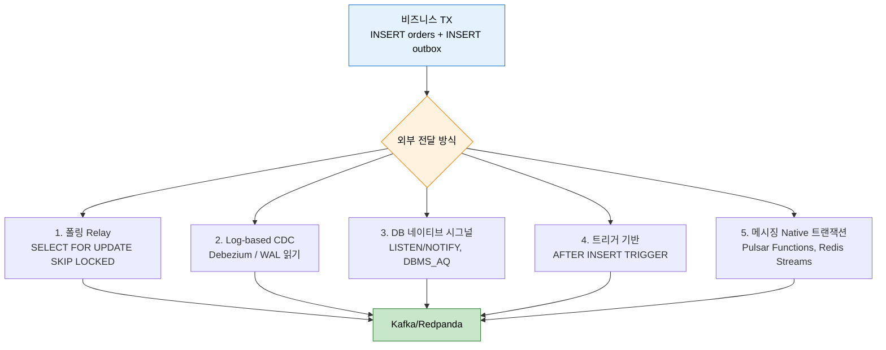
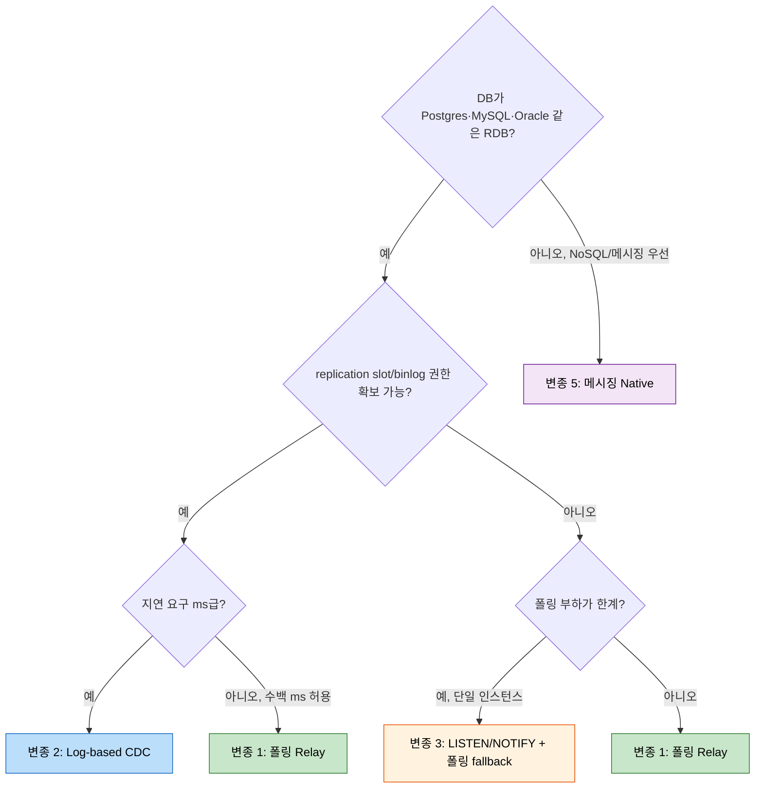

# Outbox 변종 비교 — 폴링부터 log-based CDC까지

---

> Outbox 패턴의 핵심은 "비즈니스 데이터 INSERT와 이벤트 INSERT를 같은 DB 트랜잭션에 묶어 원자성을 확보한 뒤, 별도 컴포넌트가 그 이벤트를 외부 브로커로 옮기는 것"이다. 이 "별도 컴포넌트"가 무엇이냐에 따라 운영 비용·지연·정합성 강도·DB 결합도가 크게 달라진다. 본 문서는 5가지 변종을 비교하고, 각 변종이 어느 회사에서 어떤 이유로 채택됐는지를 정리한다.

상위 `05-03.Outbox`가 폴링 Relay 기반 구현을 다뤘다면, 여기서는 그 외 선택지를 운영 시점에서 비교한다.

## 1. 변종 5종 개관



각 변종의 정체성을 한 줄로:

| 변종 | 이벤트 추출 트리거 | 핵심 의존 |
|---|---|---|
| 폴링 Relay | 시간(`@Scheduled`) | DB SELECT 권한 |
| Log-based CDC | DB의 commit log(WAL) | logical replication slot 권한 |
| DB 네이티브 시그널 | DB가 던지는 이벤트 (Postgres `pg_notify`) | 시그널 수신 클라이언트 |
| 트리거 기반 | INSERT 트리거 | 트리거 작성·테스트 부담 |
| 메시징 Native | 브로커 transactional buffering | 비-Kafka 브로커 채택 |

## 2. 변종 1: 폴링 Relay

### 작동 방식

상위 `05-03.Outbox`에 자세히 다룬 형태. `@Scheduled(fixedDelay = N)`이 outbox 테이블에서 PENDING 행을 `FOR UPDATE SKIP LOCKED`로 클레임 → Kafka 발행 → 상태 업데이트.

### 장점

- **인프라 단순함**: Kafka Connect, Debezium, replication slot 모두 불필요. 애플리케이션 프로세스 안에서 모든 흐름이 끝난다.
- **권한 단순함**: 일반 DB 사용자 권한으로 충분 (CRUD + 인덱스). DBA 협조 없이도 도입 가능.
- **로컬 개발 용이**: 통합 테스트에서 Embedded Postgres + 표준 Spring Boot로 끝까지 검증 가능.

### 단점

- **지연**: 폴링 간격에 비례. 500ms 폴링이면 평균 250ms 추가 지연.
- **DB 부하**: 빈 폴링도 SELECT 비용. 폴링 간격을 줄이면 idle 시에도 부하가 발생한다.
- **순서 보장 비용**: 같은 aggregate의 head 이벤트만 클레임하는 인덱스·쿼리 설계가 필요. CDC는 WAL 순서를 자연 보장하지만 폴링은 추가 설계가 필수.

### 사례

- **TPS `message-lib`**: `OutboxPoller`(500ms fixedDelay), `JpaOutboxEventRepository`의 `FOR UPDATE SKIP LOCKED`. 본 학습 트리의 기준점.
- **Milan Jovanović "Scaling the Outbox Pattern"** (개인 블로그, 2024): 단일 서버에서 1,350 MPS → 32,500 MPS까지 끌어올리는 단계별 벤치마크. 출처: <https://www.milanjovanovic.tech/blog/scaling-the-outbox-pattern>
- **eventuate-tram-events** (Chris Richardson, OSS): 자바 진영의 표준 폴링 Outbox 라이브러리. 출처: <https://github.com/eventuate-tram/eventuate-tram-core>

## 3. 변종 2: Log-based CDC (Debezium)

### 작동 방식

DB의 commit log(Postgres WAL, MySQL binlog, SQL Server transaction log)를 읽는 Debezium 커넥터가 outbox 테이블의 INSERT를 감지하고, 변경 이벤트를 Kafka로 자동 발행. Debezium의 [Outbox Event Router SMT](https://debezium.io/documentation/reference/stable/transformations/outbox-event-router.html)가 outbox 행의 컬럼을 Kafka 헤더·키·값으로 매핑한다.

```mermaid
sequenceDiagram
    participant App as Application
    participant DB as Postgres
    participant Slot as Replication Slot
    participant Deb as Debezium Connector
    participant K as Kafka

    App->>DB: BEGIN; INSERT orders, INSERT outbox; COMMIT
    DB->>DB: WAL에 기록
    Slot-->>Deb: WAL 스트리밍 (logical replication)
    Deb->>Deb: Outbox Event Router SMT 적용
    Deb->>K: 이벤트 발행 (헤더/키/값 분리)
```

### 장점

- **저지연**: WAL 스트리밍은 ms 단위. 폴링과 달리 idle 시 DB 부하 없음.
- **순서 자연 보장**: WAL 순서가 곧 transaction 순서.
- **at-least-once 보장**: Debezium이 자체 offset을 Kafka에 저장. 커넥터 재시작 시 마지막 처리 위치부터 재개.
- **outbox 클린업 단순화**: row를 INSERT 후 즉시 DELETE해도 WAL에는 양쪽 다 기록되므로 retention 비용이 없다.

### 단점

- **운영 인프라 부담**: Kafka Connect 클러스터 운영, 커넥터 모니터링, lag 알림.
- **권한 비용**: Postgres logical replication slot은 superuser 또는 `REPLICATION` 권한 필요. 사내 DBA 정책에서 차단되는 경우가 많다.
- **slot lifecycle 위험**: Connect가 죽고 slot이 살아 있으면 WAL이 무한 누적되어 디스크가 터진다.
- **스키마 변경 영향**: outbox 테이블 컬럼 변경 시 Debezium 스냅샷·SMT 설정 갱신 필요.

### 사례

- **Shopify "Capturing Every Change From Shopify's Sharded Monolith"**: 수십 개 샤드의 MySQL을 Debezium으로 통합 캡처. binlog가 운영 어떻게 변하는지에 대한 깊은 회고. 출처: <https://shopify.engineering/capturing-every-change-shopifys-sharded-monolith>
- **Wix "From Pub/Sub to Outbox to CDC"**: 폴링 Outbox에서 Debezium으로 이행한 회고. 처리량 증가가 폴링 한계에 부딪혔던 시점, 마이그레이션 단계, 운영 트러블 정리. 출처: <https://medium.com/wix-engineering/from-pubsub-to-outbox-pattern-to-cdc-the-evolution-of-event-driven-microservices-9e234a55ee72>
- **Netflix DBLog**: Debezium 영감을 받아 자체 구축한 CDC 프레임워크. dump + log를 합치는 "watermark" 알고리즘 논문이 유명. 출처: <https://netflixtechblog.com/dblog-a-generic-change-data-capture-framework-7c45b6e6f1fc>

## 4. 변종 3: DB 네이티브 시그널 (Postgres LISTEN/NOTIFY)

### 작동 방식

Postgres `pg_notify('channel', payload)` 함수가 트리거 또는 함수 호출에서 발행되면, 같은 채널을 `LISTEN`하는 클라이언트가 push로 받는다. outbox 테이블의 AFTER INSERT 트리거 안에서 `pg_notify`를 던지면 폴링 없이도 application이 즉시 깨어난다.

### 장점

- **저지연 + 인프라 가벼움**: Debezium처럼 ms급 지연이지만 별도 커넥터 클러스터가 없다.
- **권한 가벼움**: replication slot 권한 불필요. 일반 권한으로 가능.
- **JDBC 표준**: PgJDBC의 `getNotifications()` API로 받음.

### 단점

- **단일 인스턴스 친화적**: NOTIFY는 모든 LISTEN 클라이언트에 broadcast. 워커 N대가 모두 받으면 중복 처리되므로, 워커 측에서 다시 `FOR UPDATE SKIP LOCKED`로 클레임하는 패턴이 필요하다 (결국 폴링 Relay와 비슷해짐).
- **Postgres 한정**: Oracle은 DBMS_AQ, MS SQL은 Service Broker, MySQL은 사실상 없음. 멀티-DB 추상화가 어렵다.
- **payload 8KB 제한**: Postgres `pg_notify` payload는 8000자로 제한. 큰 이벤트는 outbox 행 ID만 던지고 워커가 다시 SELECT.
- **트랜잭션 commit 후 발행**: COMMIT 시점에 NOTIFY가 flush되므로, 발행 실패 시 비즈니스 데이터는 이미 commit된 상태. 폴링 fallback이 필수.

### 사례

- **Yelp `pyramid-listenbrainz`** 등의 패턴: 작은 시스템에서 폴링 + LISTEN/NOTIFY 하이브리드. NOTIFY가 오면 즉시 처리, 안 오면 1초 폴링.
- **Postgres 공식 문서 "Asynchronous Notification"**: 사용 예제와 8KB payload 제한 명시. 출처: <https://www.postgresql.org/docs/current/sql-notify.html>
- **HN 토론 "Postgres LISTEN/NOTIFY does not scale"** (2024): 클라이언트 수 증가 시 Postgres 측 lock contention 보고. 출처: <https://news.ycombinator.com/item?id=39175873>

## 5. 변종 4: 트리거 기반

### 작동 방식

비즈니스 테이블의 AFTER INSERT 트리거가 outbox 테이블에 직접 INSERT. 애플리케이션 코드는 outbox를 인지하지 않고 비즈니스 INSERT만 한다.

### 장점

- **애플리케이션 코드 변경 없음**: 레거시 시스템에 outbox를 도입할 때 빠르다. JPA `@PostPersist` 같은 ORM 훅보다 DB 레벨이라 더 강한 보장.
- **외부 시스템 INSERT도 캡처**: rpk, 외부 ETL이 비즈니스 테이블에 INSERT해도 자동으로 outbox에 들어간다.

### 단점

- **트리거 디버깅 비용**: 트리거 로직은 애플리케이션 로그에 안 나타나고 DB 슬로우쿼리·deadlock에 갑자기 등장한다.
- **테이블당 트리거**: 비즈니스 테이블이 N개면 트리거도 N개. 스키마 변경 시 트리거 갱신을 잊기 쉽다.
- **이벤트 변환 표현력 부족**: 트리거는 SQL/PL/pgSQL로 작성되므로 복잡한 enrichment(예: 다른 테이블 join, JSON 변환)에 부적합.
- **CDC 변종과 비교 시**: 트리거 기반은 곧 "Outbox 테이블만 logical replication으로 보는" Debezium Outbox SMT의 단순한 버전인 경우가 많다. CDC가 가능하면 트리거 없이도 같은 효과.

### 사례

- 트리거 단독으로 outbox를 운영하는 회사는 발표 자료가 드물다 — 대부분 polling/CDC와 함께 보조 수단으로 쓰인다. 트리거의 안티패턴 정리는 [Brandur Leach "What's the difference between AFTER INSERT triggers and outbox?"](https://brandur.org/idempotency-keys) 같은 글에서 다뤄진다.

## 6. 변종 5: 메시징 Native 트랜잭션

### 작동 방식

Kafka 외 브로커가 제공하는 transactional buffering을 사용. 대표적으로:

- **Apache Pulsar Transactions**: Producer가 transaction을 시작하고 여러 토픽에 발행 후 commit. DB transaction과 결합하기는 어렵지만, "여러 토픽에 한꺼번에" 가는 다중 발행에서 원자성을 줌.
- **Redis Streams + PEL**: XADD로 stream에 적재, consumer는 XREADGROUP + XACK. PEL(Pending Entries List)이 in-flight 이벤트를 추적해서 consumer 죽어도 재처리.
- **NATS JetStream**: stream에 적재 후 ack. exactly-once delivery semantics 옵션 제공.

### 장점

- **별도 outbox 테이블 불필요**: 브로커 자체가 transactional buffer 역할.
- **동일 브로커 내 multi-topic 원자성**: 결제 토픽과 알림 토픽에 동시에 발행하는 시나리오에 적합.

### 단점

- **DB ↔ 브로커 사이 원자성은 여전히 미해결**: Kafka transactions가 DB transaction을 묶어주는 게 아니다. 결국 DB 실패 시 발행 취소가 안 된다. 메시징 native 트랜잭션은 "발행 측 다중 토픽" 원자성에 한정.
- **Kafka가 아닌 브로커로 가야 함**: TPS 같이 Redpanda를 쓰면 Pulsar/NATS 도입 비용은 큰 결정.

### 사례

- **Apache Pulsar 공식 문서 "Transactions"**: 다중 토픽 transaction과 read-committed isolation. 출처: <https://pulsar.apache.org/docs/concepts-transactions/>
- **Redis Streams Consumer Groups**: PEL 기반 at-least-once. 출처: <https://redis.io/docs/data-types/streams-tutorial/>
- **NATS JetStream**: <https://docs.nats.io/nats-concepts/jetstream>

## 7. 비교 매트릭스

| 변종 | 지연 | 운영 부담 | 정합성 | DB 결합도 | DB 권한 | 멀티 인스턴스 |
|---|---|---|---|---|---|---|
| 1. 폴링 Relay | 폴링 간격 (수백 ms) | 낮음 | 강함 (TX + SKIP LOCKED) | 낮음 | 일반 | 자연 지원 |
| 2. Log-based CDC | ms 단위 | 높음 (Connect 운영) | 강함 (WAL 순서) | 중간 (replication slot) | superuser/REPLICATION | 자연 지원 |
| 3. DB 네이티브 시그널 | ms 단위 | 중간 | 보통 (NOTIFY 누락 가능) | 중간 (DB-specific) | 일반 | broadcast → 추가 클레임 필요 |
| 4. 트리거 기반 | INSERT 직후 | 중간 | 강함 (DB 트랜잭션 안) | 높음 (스키마 종속) | 트리거 권한 | 자연 지원 |
| 5. 메시징 Native | ms 단위 | 브로커 변경 비용 | DB-브로커 원자성 미보장 | 낮음 | 일반 | 자연 지원 |

지연 = idle 시점부터 최초 발행까지의 평균. 운영 부담 = 추가 인프라·모니터링 점수. 정합성 = "비즈니스 INSERT 성공 시 이벤트가 결국 발행됨"의 보장 강도.

## 8. 의사결정 트리



## 9. 운영 사례 깊게 보기 — Wix의 마이그레이션

Wix Engineering Blog "From Pub/Sub to Outbox to CDC" (2022)는 본 비교에서 가장 직관적인 사례 자료다. 요약:

1. **Stage 1 — 단순 Pub/Sub**: 비즈니스 코드가 직접 Kafka send. dual-write 문제로 일관성 사고 발생.
2. **Stage 2 — 폴링 Outbox**: 같은 트랜잭션에 outbox INSERT, 폴러가 발행. 처리량이 늘면서 폴링 간격을 줄이자 DB 부하 증가.
3. **Stage 3 — Debezium CDC**: 폴러 제거. 평균 지연 ms급으로 단축. 단, Connect 운영·slot 모니터링·스키마 진화 운영 비용이 추가됨.

이행에서 흥미로운 점: Wix는 Stage 2를 "서비스 수가 적을 때는 가성비 최강"으로 평가한다. 즉 폴링 Outbox는 임시 단계가 아니라 적정 규모에서는 정답.

출처: <https://medium.com/wix-engineering/from-pubsub-to-outbox-pattern-to-cdc-the-evolution-of-event-driven-microservices-9e234a55ee72>

## 10. TPS 적용 가능성

`okestro/tps-gitlab2`는 현재 변종 1(폴링 Relay)을 사용한다(`message-lib`의 `OutboxPoller`).

### 변종 2(Debezium) 도입 시그널

다음 중 둘 이상이 충족될 때 검토 가치가 있다.

- **폴러 한계 도달**: 폴링 간격을 100ms 이하로 줄여도 평균 발행 지연이 운영 SLA를 못 맞춘다.
- **다중 인스턴스 폴링 충돌**: `FOR UPDATE SKIP LOCKED`에도 lock contention이 측정된다.
- **외부 ETL이 비즈니스 테이블에 직접 INSERT**: 애플리케이션을 거치지 않은 INSERT를 캡처해야 한다 (현재 TPS는 해당 없음).
- **outbox 테이블 retention 비용**: SENT 행 클린업 작업이 운영 부담이 된다 (현재 TPS는 90일 retention + 야간 cleanup으로 안정).

### 도입 단계 (가설)

1. dev 환경에 Postgres logical replication slot + Kafka Connect + Debezium 띄움.
2. `TB_TRB_OX_001`에 Debezium Outbox Event Router SMT 설정.
3. 기존 `OutboxPoller`와 병행 가동(shadow mode) — Debezium 발행 결과를 로깅만, 실 토픽엔 폴러가 발행.
4. 두 발행 결과의 일치율 측정.
5. 일정 기간 경과 후 폴러를 비활성화하고 Debezium만 사용. 롤백 경로로 폴러는 코드에 남겨둔다.

### 비도입 결정의 근거

현재 TPS 트래픽 규모(파이프라인 단위 이벤트, 분당 수십~수백 건 예상)에서는 폴링 Relay가 운영 부담 대비 충분하다. CDC 도입은 트래픽이 10x 이상 증가하거나 ms급 지연 요구가 명시될 때까지 대기하는 것이 합리적이다.

## 11. 정리

Outbox 변종 선택은 **"폴링이 충분한가"** 한 가지 질문으로 압축할 수 있다. 충분하면 변종 1, 부족하면 변종 2(Debezium)가 정답이고, 변종 3·4·5는 특수 상황(단일 인스턴스, 레거시 트리거 활용, 비-Kafka 브로커)에서만 후보가 된다.

본 학습 트리의 정상 흐름에서 `05-03.Outbox`를 마쳤다면, 도입 후 운영 시그널을 수집하기 시작한 시점에 본 문서를 다시 읽으면 된다. 도입 시 검증·메트릭 설계는 [09-04.스키마 거버넌스](09-04.스키마%20거버넌스.md)와 함께 본다.
