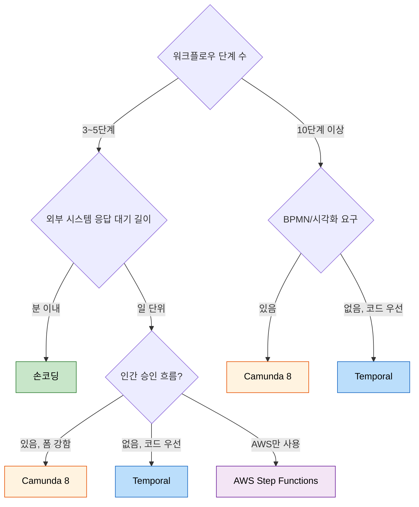

# Saga 엔진 비교 — 손코딩 vs Temporal vs Cadence vs Camunda 8 vs Conductor vs Step Functions

---

> 상위 `01-02.Orchestration Saga`가 Saga의 일반 구조를 다뤘다면, 여기서는 그 Saga 로직을 어디에 두느냐의 선택지를 비교한다. 직접 코드로 구현하는 손코딩 오케스트레이션과 외부 워크플로우 엔진(Temporal, Cadence, Camunda 8, Conductor, AWS Step Functions, Axon Saga, eventuate-tram-sagas) 사이의 트레이드오프를 정리하고, 도입 시그널·마이그레이션 비용을 사례 중심으로 본다.

## 1. 출발점 — 손코딩 오케스트레이션

대부분의 시스템은 손코딩 오케스트레이션으로 시작한다. TPS도 그렇다 — `operator/cicd/.../pipeline/application/pipeline/service/PipelineExcnService.java`가 빌드 → 테스트 → 배포 단계를 명시적으로 호출하고, 각 결과 컨슈머(`BuildResultConsumer` 등)가 다음 단계를 트리거하는 형태.

### 손코딩의 본질

```java
@Service
public class PipelineExcnService {
    @Transactional
    public void onBuildResult(BuildResultEvent ev) {
        Pipeline p = repo.findById(ev.pipelineId);
        if (ev.status == SUCCESS) {
            p.advanceTo(TEST_PENDING);
            commandPublisher.publish(p, OPERATOR_CMD_TEST);
        } else {
            p.markFailed(ev.error);
            // 보상 로직
        }
    }
}
```

상태 머신을 자체 코드로 짠다. 워크플로우 정의 = 도메인 서비스의 메서드 그래프.

### 손코딩이 잘 맞는 경우

- 워크플로우가 짧다 (3~5단계 이하).
- 상태가 단순하다 (RDBMS 한 행으로 표현 가능).
- 분기·재시도·타임아웃이 단순하다.
- 팀이 워크플로우 엔진 운영 경험이 없다.

### 손코딩이 무너지는 시점

- 분기·반복·인간 승인 같은 복잡한 흐름이 늘어난다.
- "현재 어디까지 진행됐나"를 답하는 디버깅 도구가 코드 베이스에 흩어진다.
- 재시도·타임아웃·dead-letter 정책을 매 단계마다 손으로 관리해야 한다.
- 워크플로우가 며칠~몇 주 단위로 살아있어야 한다 (인간 승인, 외부 시스템 응답 대기).

이 시점이 외부 엔진 도입 신호다.

## 2. 비교 대상 7가지

| 엔진 | 출신/소유 | 모델 | 언어 SDK |
|---|---|---|---|
| 손코딩 | — | 도메인 서비스 + 컨슈머 | 호스팅 언어 |
| Temporal | Temporal Inc. (Cadence 포크) | Workflow as code (결정성) | Go, Java, TS, Python, .NET, PHP, Ruby |
| Cadence | Uber 오픈소스 | Workflow as code | Go, Java |
| Camunda 8 (Zeebe) | Camunda BPMN 진화 | BPMN 2.0 + Job Workers | Go, Java, JS, Python (gRPC 기반) |
| Conductor | Netflix 오픈소스 | JSON DSL | REST API (모든 언어) |
| AWS Step Functions | AWS managed | Amazon States Language (JSON) | AWS SDK |
| Axon Saga | Axon Framework (자바) | Annotation 기반 | Java |
| eventuate-tram-sagas | Chris Richardson | DSL | Java |

이 표는 본문 내내 참조한다.

## 3. 비교 축

### 3-1. Workflow as code vs DSL

- **Workflow as code (Temporal, Cadence)**: 일반 프로그래밍 언어로 워크플로우를 기술한다. `if/else`, 루프, 함수 호출이 그대로 워크플로우 문법. 디버깅·테스트가 익숙한 도구로 가능.
- **DSL (Camunda BPMN, Conductor JSON, Step Functions ASL)**: 워크플로우를 데이터로 표현. 비-개발자(BA)와 협업 가능, 시각적 다이어그램과 1:1 대응. 단 코드 표현력이 약해 복잡한 비즈니스 로직은 외부 worker로 빠진다.

### 3-2. 결정성(determinism)

Temporal·Cadence의 핵심 개념. 워크플로우 코드는 동일 입력으로 항상 같은 결정을 내려야 한다. 이를 위반하면(예: 워크플로우 안에서 `new Random()`, `Instant.now()` 직접 호출) 재시도 시 history replay가 깨져 워크플로우가 영구히 stuck.

이 제약은 학습 비용이 크지만, 그 대가로:

- 워크플로우 프로세스가 죽어도 복구 시 history만 replay하면 정확한 상태로 돌아감.
- 며칠 동안 살아있는 워크플로우도 코드 변경 없이 재시작 가능.

Camunda 8과 Conductor는 결정성 제약 대신 **상태를 외부 저장소(Postgres, Cassandra)에 직접 저장**한다. 학습 곡선은 낮지만 워크플로우 정의를 코드처럼 다루기는 어렵다.

### 3-3. 워크플로우 수명

- 분 단위: 손코딩으로 충분.
- 시간~일 단위: 손코딩도 가능하지만 timeout·persistence 관리 비용이 늘어난다.
- 주 단위 이상 (인간 승인, 결제 합의 같은 장기 흐름): 워크플로우 엔진이 명확한 우위. Temporal은 1년+ 워크플로우도 일상.

### 3-4. 운영 인프라

- **Temporal**: 별도 클러스터(server + Cassandra/Postgres + Elasticsearch). Temporal Cloud로 관리형 사용 가능.
- **Camunda 8 (Zeebe)**: 별도 클러스터(브로커 + Elasticsearch). Camunda SaaS로 관리형 사용 가능.
- **Conductor**: 별도 서버 + Cassandra/MySQL/Postgres + Elasticsearch.
- **Step Functions**: AWS managed. 다른 AWS 서비스 묶음 안에서만 의미.
- **Axon, eventuate-tram**: 자바 라이브러리만 추가. 별도 클러스터 불필요. 단 워크플로우 상태 저장용 DB 필요.

손코딩은 이 운영 인프라 비용이 0이다.

### 3-5. Human-in-the-loop

승인·거절·수동 개입이 흐름에 있는가.

- **Camunda BPMN**: 가장 강력 (User Tasks, Forms, BPMN의 핵심 시나리오).
- **Temporal**: signals와 외부 events로 가능. 단 UI는 직접 만든다.
- **Step Functions**: Wait for Callback Token 패턴. 외부 시스템이 SDK로 token 보내야 다음 단계 진행.
- **Conductor**: HUMAN task type 제공.
- **손코딩**: API 엔드포인트로 간단히 구현 가능, 단 흩어진다.

### 3-6. 분기·병렬·동적 fan-out

복잡한 워크플로우는 정적 그래프로 표현 어려움. 워크플로우 내부에서 N개 자식 워크플로우를 spawn해야 하는 경우.

- **Temporal·Cadence**: 워크플로우 코드 안에서 `Promise.allOf` 등으로 동적 fan-out. 가장 강력.
- **Camunda 8**: BPMN의 multi-instance subprocess. 가능하지만 표현력 제약.
- **Step Functions**: Map state로 fan-out. 동적 input이 ASL 안에서만 다뤄짐.

## 4. 사례 1 — Uber Cadence: 배송 워크플로우

Uber는 자체 워크플로우 엔진 Cadence를 만들고 오픈소스화했다. 배송, 결제, 데이터 마이그레이션 같은 장기 흐름에 폭넓게 사용.

논문/발표:
- "Uber's Tech Stack 2.0" 발표 (QCon 2018): Cadence가 어떻게 마이크로서비스 간 워크플로우를 통합하는지. 출처: <https://www.infoq.com/presentations/uber-cadence/>
- Cadence GitHub: <https://github.com/uber/cadence>

흥미로운 점: Cadence가 너무 잘 되니 창업자(Maxim Fateev)가 Temporal로 분사. Uber는 이후에도 Cadence를 유지하지만 일부 팀은 Temporal로 이동했다는 보고도 있다.

## 5. 사례 2 — Coinbase: Temporal로 자산 이동

Coinbase는 사용자 지갑 간 자산 이동·외부 블록체인 인터랙션 같은 결정성이 핵심인 흐름을 Temporal로 운영한다.

블로그 포스트 "Building distributed Saga workflows with Temporal":
- 결제 합의·블록체인 confirmation 대기 같은 시간 단위 워크플로우.
- 인간 개입(KYC 승인, 컴플라이언스 보류)이 흐름에 들어가는 시나리오.
- 출처: <https://www.coinbase.com/blog/coinbase-and-temporal>

이 사례는 워크플로우 수명·결정성·human-in-the-loop가 모두 동시 요구되는 환경에서 Temporal이 자연스러운 선택임을 보여준다.

## 6. 사례 3 — Netflix Conductor: 콘텐츠 인코딩 파이프라인

Netflix는 자체 오픈소스 Conductor로 콘텐츠 인코딩·메타데이터 추출·CDN 배포 같은 데이터 파이프라인을 운영한다.

자료:
- "Netflix Conductor: A microservices orchestrator" (Netflix Tech Blog, 2017): <https://netflixtechblog.com/netflix-conductor-a-microservices-orchestrator-2e8d4771bf40>
- Conductor 공식 문서: <https://conductor.netflix.com/>

선택 배경: Netflix 사내 다양한 언어가 섞여 있어 언어별 SDK가 아니라 REST 기반이 적합. JSON DSL이 비-개발자도 워크플로우 정의에 참여하기 쉬움.

## 7. 사례 4 — Camunda 8: 금융권 BPMN 워크플로우

Camunda는 BPMN 2.0 표준의 가장 성숙한 구현체. 금융·보험 같은 규제 강한 산업에서 흔하다.

자료:
- Camunda Customer Stories: 24 Hour Fitness, Goldman Sachs, NASA 사례. 출처: <https://camunda.com/customers/>
- "BPMN with Camunda 8" 공식 문서: <https://docs.camunda.io/>

선택 배경: 워크플로우 정의가 BPMN 다이어그램과 1:1 대응. 컴플라이언스 감사·BA(business analyst) 협업이 BPMN 표준을 요구하는 환경에서 자연스럽다.

## 8. 사례 5 — eventuate-tram-sagas: 자바 마이크로서비스의 가벼운 옵션

Chris Richardson이 만든 라이브러리. 별도 클러스터 없이 자바 코드 안에서 Saga 정의.

자료:
- eventuate-tram-sagas GitHub: <https://github.com/eventuate-tram/eventuate-tram-sagas>
- "Microservices Patterns" (Manning, 2018) 책 4장에서 자세히 다룸.

특징: Saga 정의를 SagaDefinition DSL로 작성. 보상 트랜잭션 매핑이 명시적. 라이브러리만 추가하면 되므로 도입 비용이 낮다.

## 9. 비교 매트릭스

| 축 | 손코딩 | Temporal/Cadence | Camunda 8 | Conductor | Step Functions | Axon | eventuate-tram |
|---|---|---|---|---|---|---|---|
| 학습 곡선 | 낮음 | 높음 (결정성) | 중간 (BPMN) | 낮음 | 낮음 | 중간 | 낮음 |
| 운영 인프라 | 없음 | 별도 클러스터 | 별도 클러스터 | 별도 클러스터 | AWS managed | 라이브러리 | 라이브러리 |
| 코드 표현력 | 최강 | 강 | 약 (DSL) | 약 (JSON) | 약 (ASL) | 중 | 중 |
| 시각화 | 없음 | Web UI 제공 | BPMN 다이어그램 | Web UI | AWS Console | 부족 | 부족 |
| 인간 개입 | 직접 구현 | signals | User Tasks (강력) | HUMAN task | Wait for Callback | 직접 구현 | 직접 구현 |
| 동적 fan-out | 자유 | 자유 | 제한적 | 제한적 | Map state | 자유 | 제한적 |
| 워크플로우 수명 | 분~시간 | 무제한 | 무제한 | 무제한 | 1년 한도 | 시간~일 | 시간~일 |
| 멀티 언어 | 호스팅 언어 | 6개 SDK | gRPC (4개) | REST (모두) | AWS SDK | Java | Java |
| 라이선스 | — | MIT | (Camunda 8 SaaS는 상용) | Apache 2.0 | AWS 과금 | Apache 2.0 | Apache 2.0 |

## 10. 의사결정 트리



## 11. 도입 마이그레이션 비용

손코딩 → 워크플로우 엔진 이행은 일반적으로 다음 단계를 거친다.

1. **POC 1주**: 단일 워크플로우 한 개를 새 엔진으로 옮긴다. 현재 손코딩 버전과 병행 운영. 결정성 제약(Temporal), BPMN 표현 제약(Camunda) 같은 학습 비용이 여기서 드러난다.
2. **shadow mode 2~4주**: 새 엔진 워크플로우 결과를 로깅만, 실 작업은 손코딩이 수행. 결과 일치율 측정.
3. **canary 1~2주**: 트래픽의 1~10%를 새 엔진으로. 모니터링 강화.
4. **전면 이행**: 손코딩 비활성화. 단 롤백 경로로 코드는 일정 기간 보존.
5. **운영 안정화**: Temporal Web UI / Camunda Operate 같은 대시보드를 팀에 학습.

전체 8~12주 소요가 흔하다. 단순 손코딩으로 잘 돌아가는 워크플로우를 굳이 옮기는 것은 비추.

## 12. TPS 적용 가능성

`operator`의 파이프라인 흐름은 현재 손코딩 오케스트레이션. 도입 시그널을 정리하면:

### Temporal 도입 시그널

- **분기 복잡도 증가**: 빌드 결과에 따라 테스트 종류 분기, 테스트 결과에 따라 배포 환경 분기 같은 패턴이 늘어난다.
- **승인 흐름 도입**: 운영 환경 배포 전 운영자 승인 같은 인간 개입.
- **재시도 정책 다양화**: 단계마다 재시도·백오프·timeout 정책이 다르다.
- **워크플로우 가시성 요구**: "지금 모든 진행 중 파이프라인이 어디까지 갔나"를 단일 UI로 보고 싶다.

### Camunda 8 도입 시그널

- **BPMN 표현 요구**: 비-개발자(QA, 운영팀)가 워크플로우를 그림으로 보고 동의해야 한다.
- **승인 폼 강하게 필요**: User Tasks의 Form 기능이 직접 구현보다 압도적으로 효율적.

### 비도입 결정의 근거

현재 TPS 파이프라인 단계 수와 분기 복잡도는 손코딩으로 충분히 표현된다. 워크플로우 엔진 운영 인프라 비용(Cassandra/Elasticsearch + 별도 클러스터)이 현재 가치 대비 과한 단계.

도입 검토 트리거: 파이프라인 단계가 6단계 이상으로 늘어나고, 동적 분기·승인 흐름이 추가되는 시점.

## 13. 정리

워크플로우 엔진은 "더 나은" 도구가 아니라 **"다른 종류의 문제"** 를 해결한다. 짧고 단순한 워크플로우는 손코딩이 거의 항상 더 가성비 좋다. 길고·분기 많고·인간 개입이 있는 워크플로우는 엔진 없이는 운영 비용이 폭발적으로 증가한다.

선택은 학습 곡선이 아니라 **"6개월 후 이 워크플로우가 어떻게 자랄 것인가"** 를 추정한 결과로 결정된다.

본 학습 트리의 정상 흐름에서 `01-02.Orchestration Saga`를 마쳤다면, 운영 워크플로우의 단계 수와 수명을 분기마다 측정해 본 문서를 다시 읽는다. 도입 검토 시점에는 [01-04.스키마 거버넌스](01-04.스키마%20거버넌스.md)와 함께 — 새 엔진 도입은 곧 새 스키마 진화 정책 도입이다.
