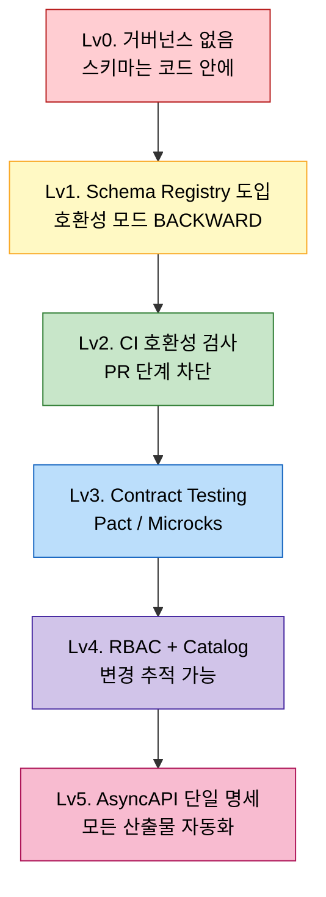

# 스키마 거버넌스 — 호환성 자동화부터 데이터 카탈로그까지

---

> 상위 `02-02.Schema Registry`와 `02-06.Avro 스키마 진화 패턴`이 "어떤 스키마 변경이 안전한가"의 규칙을 다뤘다면, 본 문서는 그 규칙을 **운영 규모에서 강제하는 방법**과 **변경 영향을 자동으로 추적하는 도구**를 정리한다. 호환성 검사 자동화, subject naming strategy, RBAC, contract testing(Pact, Microcks, Spring Cloud Contract), 데이터 카탈로그 연계 5가지 축으로 본다.

## 1. 거버넌스가 부재했을 때의 실패 모드

스키마 거버넌스가 없으면 일어나는 일:

1. **호환성 위반 PR이 머지된다**. 새 reader가 옛 메시지를 못 읽거나, 옛 reader가 새 메시지에서 깨진다. 운영 환경에서 처음 발견된다.
2. **subject 이름이 흩어진다**. 같은 도메인 이벤트인데 팀마다 다른 strategy를 써서 호환성 검사가 다른 그룹으로 흘러간다.
3. **누가 이 스키마를 쓰는지 모른다**. 필드를 deprecate해도 어느 컨슈머가 영향받는지 알 수 없다.
4. **인증·권한이 없다**. 누구나 모든 subject에 새 버전을 등록할 수 있어 운영 사고의 entry point가 된다.
5. **계약과 코드가 다르다**. AsyncAPI 명세는 v3, Schema Registry는 v5, 실 코드는 v4. 어느 것이 진실인가?

본 문서는 이 5가지 실패 모드를 도구로 잡는 방법.

## 2. 축 1 — 호환성 검사 자동화

### CI 단계 검증

스키마 변경 PR이 호환성을 깨면 머지를 막는다. 가장 흔한 도구:

#### Confluent `schema-registry-maven-plugin`

```xml
<plugin>
  <groupId>io.confluent</groupId>
  <artifactId>kafka-schema-registry-maven-plugin</artifactId>
  <version>7.6.0</version>
  <configuration>
    <schemaRegistryUrls>
      <param>https://schema-registry.dev.example.com</param>
    </schemaRegistryUrls>
    <subjects>
      <orders.order.created-value>src/main/avro/OrderCreated.avsc</orders.order.created-value>
    </subjects>
  </configuration>
</plugin>
```

```bash
mvn schema-registry:test-compatibility
```

이 명령이 실패하면 PR도 실패. CI 표준 패턴.

#### Gradle confluent-schema-registry-gradle-plugin

Gradle 진영의 등가. JBOSCH/imflog 같은 커뮤니티 플러그인 다수.

#### Buf for Protobuf

Protobuf 사용 시 Buf의 `breaking change detection`이 강력. 출처: <https://buf.build/docs/breaking>

### Ephemeral Schema Registry

PR마다 일회성 Registry를 띄우고 새 스키마를 등록 시뮬레이션. Docker로 spin up 후 테스트 후 destroy.

```bash
docker run -d --name sr-pr-${PR_NUMBER} -p 8081 confluentinc/cp-schema-registry
mvn schema-registry:register
mvn schema-registry:test-compatibility -DexpectedCompatibility=BACKWARD
docker rm -f sr-pr-${PR_NUMBER}
```

장점: 운영 Registry에 영향 없음. 네트워크 격리.

### 사례

- **Adidas "Schema Evolution Strategy"** (2022, Adidas Engineering Blog): 100+ 마이크로서비스의 Schema Registry 운영. PR 단계 호환성 자동화 + 운영 Registry 등록 분리. 출처: <https://medium.com/adidoescode/schema-evolution-strategy-with-kafka-and-spring-boot-bc23ec0a1b3b>
- **Funding Circle "Continuous Delivery for Avro Schemas"**: GitHub Actions + Schema Registry compatibility + 자동 deploy pipeline. 출처: 사내 블로그(검색으로 접근). 
- **Confluent "Schema Compatibility Testing in Practice"** (2021): 공식 가이드. 출처: <https://www.confluent.io/blog/schema-compatibility-testing/>

## 3. 축 2 — Subject Naming Strategy

Schema Registry는 subject 단위로 호환성을 검사한다. subject를 어떻게 정의하느냐가 호환성 의미를 바꾼다.

### 3가지 표준 strategy

#### TopicNameStrategy (기본)

```
subject = <topic>-value, <topic>-key
```

- **장점**: 가장 단순. 토픽 = 계약.
- **단점**: 한 토픽에 여러 record 타입을 보내고 싶으면 호환성이 어색해진다 (모든 record가 같은 subject 안에서 호환).

#### RecordNameStrategy

```
subject = <full-record-name>  // 예: com.example.OrderCreated
```

- **장점**: 같은 record는 모든 토픽에서 호환성 공유. record 중심 설계.
- **단점**: 다른 토픽에서 같은 이름 record를 다른 의미로 쓸 수 없음.

#### TopicRecordNameStrategy

```
subject = <topic>-<full-record-name>
```

- **장점**: 가장 유연. 토픽별 + record별 독립.
- **단점**: subject 수가 폭증.

### 선택 기준

- 한 토픽에 한 record만? → TopicNameStrategy.
- 여러 record를 한 토픽으로? → 도메인 record가 토픽과 무관하게 진화하면 RecordNameStrategy. 그렇지 않으면 TopicRecordNameStrategy.
- 일반적으로 신규 시스템은 RecordNameStrategy를 기본값으로 추천. record가 도메인 의미의 정체이고 토픽은 전송 채널일 뿐이라는 관점.

### 사례

- TPS `message-lib`은 운영 환경에서 명시적으로 RecordNameStrategy를 채택했을 가능성이 높다(02-02 본문이 그 이유를 정리). 한 토픽(`tps.jenkins.build`)에 여러 record 타입 발행을 허용.
- Confluent 공식 비교 글: <https://www.confluent.io/blog/put-several-event-types-kafka-topic/>

## 4. 축 3 — Schema Registry RBAC

스키마는 토픽보다 더 핵심적인 자산이다. 잘못 등록된 v2가 운영 reader를 모두 깨뜨릴 수 있다. RBAC이 필수.

### 옵션

#### Confluent Schema Registry RBAC

- Confluent Server 또는 Confluent Cloud 라이선스 필요.
- subject별 read/write/delete 권한 분리.
- LDAP/OAuth 통합.

출처: <https://docs.confluent.io/platform/current/security/rbac/rbac-overview.html>

#### AWS Glue Schema Registry

- AWS IAM으로 권한 관리.
- AWS-내 Kafka(MSK) 사용 시 기본 옵션.
- Cross-account access는 IAM 정책으로.

출처: <https://docs.aws.amazon.com/glue/latest/dg/schema-registry.html>

#### Karapace (Aiven 오픈소스)

- Confluent Schema Registry 호환 OSS 구현.
- 라이선스 비용 회피.
- ACL 기능은 상용 Confluent보다 약하지만 reverse proxy로 보강 가능.

출처: <https://github.com/Aiven-Open/karapace>

### 운영 패턴

- **개발 환경**: 누구나 등록 가능. PR 단계 호환성 검사로 사고 차단.
- **운영 환경**: subject별 owner 팀만 등록 가능. 자동화는 service account로.
- **삭제 권한**: 거의 항상 차단. Schema Registry는 등록된 버전을 영구 삭제하기 어렵고(`compatibility: NONE`으로 잠시 풀고 hard delete), 흔적이 남는다.

### 사례

- **Adidas Schema Evolution Strategy** (위 §2 참조): Schema Registry RBAC + 토큰 자동 발급.
- **HelloFresh "Schema Governance"** (2021): subject ownership 매트릭스 자동화. 출처: HelloFresh Engineering Blog 검색.

## 5. 축 4 — Contract Testing

Schema Registry는 "스키마끼리" 호환성 검사를 한다. 그러나 **producer가 정말 스키마를 따라 보내는가**, **consumer가 정말 그 스키마를 처리할 수 있는가**는 별개다. 이를 보장하는 것이 contract testing.

### Pact

가장 유명한 contract testing 도구. consumer가 "이런 메시지를 받을 것"을 pact 파일로 선언 → producer가 그 pact를 검증.

```javascript
// Consumer 쪽
new MessageConsumerPact()
  .given('주문이 생성됨')
  .receivesMessage({
    contents: { orderId: 'ORD-001', amount: 15000 },
    metadata: { contentType: 'application/avro' },
  });
```

```java
// Producer 쪽
@PactBroker
@VerificationReports("console")
class OrderProducerPactTest {
    @PactVerification
    void verifyPact() {
        // 실제 publish 코드가 pact를 만족하는지 검증
    }
}
```

장점: producer-consumer 간 결합이 명시적. CI에서 깨지면 머지 차단.

단점: 메시징보다 HTTP REST에서 더 성숙. Avro 통합은 추가 작업 필요.

출처: <https://docs.pact.io/getting_started/how_pact_works>

### Microcks

AsyncAPI 명세 기반 mocking + contract testing. AsyncAPI 문서 자체가 진실의 출처.

```yaml
# AsyncAPI 명세
channels:
  orders/created:
    publish:
      message:
        $ref: '#/components/messages/OrderCreated'
```

Microcks가 이 명세에서 mock server를 띄우고, producer 출력이 명세를 만족하는지 검증.

출처: <https://microcks.io/>

### Spring Cloud Contract

Spring 진영. Groovy DSL로 contract 작성, producer 측에서 자동으로 stub 서버와 verifier 생성.

```groovy
Contract.make {
  description 'returns OrderCreated event'
  input { triggeredBy('createOrder()') }
  outputMessage {
    sentTo 'orders.created'
    body([orderId: 'ORD-001', amount: 15000])
  }
}
```

출처: <https://spring.io/projects/spring-cloud-contract>

### Schema Registry vs Contract Testing

| 대상 | Schema Registry | Contract Testing |
|---|---|---|
| 검증 시점 | 등록 시점 | CI/머지 시점 |
| 검증 대상 | 스키마끼리 호환성 | producer/consumer 코드의 스키마 준수 |
| 발견 가능한 사고 | "v2가 v1과 호환 안 됨" | "producer가 필드를 빼먹음", "consumer가 새 필드 처리 안 함" |
| 운영 부담 | Registry 운영 | Pact Broker / CI 통합 |

둘은 보완 관계. 호환성 검사 + contract testing 둘 다 있어야 완전.

## 6. 축 5 — 데이터 카탈로그 연계

스키마는 "어떤 데이터인지"의 시작점일 뿐이다. **누가 만드는지, 누가 쓰는지, PII를 포함하는지, 보관 정책은 무엇인지**를 추적해야 운영 거버넌스가 완성된다.

### 도구

#### Confluent Stream Catalog

- Confluent Cloud 통합.
- 토픽·스키마·필드 단위 메타데이터.
- 자동으로 lineage 추적(어느 stream job이 어느 토픽을 input으로 쓰는가).

출처: <https://docs.confluent.io/cloud/current/stream-governance/stream-catalog.html>

#### LinkedIn DataHub

- 오픈소스 데이터 카탈로그.
- Kafka, Snowflake, BigQuery, Airflow 등 폭넓은 source 통합.
- 메타데이터를 GraphQL API로 노출.

출처: <https://datahubproject.io/>

#### Apache Atlas

- Hadoop 생태계 출신. Cloudera 등에서 폭넓게 사용.
- 정책 엔진 통합 가능 (Apache Ranger).

출처: <https://atlas.apache.org/>

#### OpenLineage

- lineage 표준 프로토콜.
- 도구 간 호환성 (Marquez, DataHub, Atlas 모두 OpenLineage emitter 지원).

출처: <https://openlineage.io/>

### 운영 통합 패턴

1. **Schema Registry → Catalog**: 스키마 등록 webhook이 Catalog에 자동 메타데이터 push.
2. **AsyncAPI → Catalog**: AsyncAPI 명세를 단일 진실의 출처로 두고, Catalog가 그 명세를 import.
3. **PII 태그 자동화**: 필드명·타입 패턴(`email`, `phone`, `ssn`)으로 PII 감지 → Catalog 태그 자동 부착.

### 사례

- **LinkedIn DataHub 내부 사용기**: <https://engineering.linkedin.com/blog/2019/data-hub>
- **Adyen "Data Catalog at Adyen"**: PCI-DSS 준수 환경에서 카탈로그가 어떻게 거버넌스 도구가 됐는가. 출처: Adyen Engineering Blog 검색.

## 7. AsyncAPI를 진실의 출처로

스키마 거버넌스의 종착점은 **"하나의 명세 파일이 모든 것의 진실"** 패턴이다.

```yaml
# asyncapi.yaml
asyncapi: 3.0.0
info:
  title: TPS Operator API
channels:
  operator/cmd/build:
    address: tps.v305p.operator.cmd.build
    messages:
      buildCommand:
        $ref: '#/components/messages/BuildCommand'
operations:
  publishBuildCommand:
    action: send
    channel:
      $ref: '#/channels/operator~1cmd~1build'
components:
  messages:
    buildCommand:
      payload:
        $ref: 'operator/BuildCommand.avsc'
```

이 단일 YAML이:

- Schema Registry에 자동 등록 (Microcks, AsyncAPI Studio)
- 코드 자동 생성 (`asyncapi-codegen`이 Java/TS 클래스 생성)
- 문서 자동 생성 (`@asyncapi/html-template`이 HTML 문서)
- Mock server 자동 생성 (Microcks)
- Contract testing 기준 (Microcks, Spring Cloud Contract)
- 데이터 카탈로그 메타데이터 source

PR 단계에서 이 YAML이 호환성 검사를 통과하면, 위 6가지 산출물이 모두 자동 갱신된다.

### 한계

- AsyncAPI 3.0이 아직 도구 생태계 적응 중 (2024 기준). 일부 코드 생성기는 2.x만 지원.
- 모든 팀이 YAML을 다룰 수 있다고 가정 — 실제로는 학습 곡선 있음.

### 사례

- **Slack의 AsyncAPI 채택기** (AsyncAPI Conf 2022 발표): <https://www.asyncapi.com/blog>의 case studies 섹션.
- **AsyncAPI 공식 case studies**: <https://www.asyncapi.com/case-studies>

## 8. 거버넌스 성숙도 모델



각 단계의 도입 비용:

- L0 → L1: 1주 (Registry 띄우고 producer/consumer 설정).
- L1 → L2: 2~4주 (CI 통합, 팀 교육).
- L2 → L3: 4~8주 (Pact Broker 운영, 첫 contract 작성).
- L3 → L4: 8~12주 (RBAC 정책 정의, Catalog 도입).
- L4 → L5: 무기한 (AsyncAPI를 단일 진실의 출처로 만드는 조직 합의).

대부분 회사는 Lv2~Lv3에서 한참 머문다. Lv4 이상은 데이터 거버넌스 조직(Chief Data Officer)이 있는 환경에서 의미.

## 9. TPS 적용 가능성

`okestro/tps-gitlab2`의 현재 거버넌스 성숙도 추정: **Lv1**.

- ✅ Schema Registry 사용 (`spring.kafka.properties.schema.registry.url`).
- ❌ PR 단계 호환성 자동 검사 미설정 (02-06 박스 참조).
- ❌ Contract testing 도입 안 됨.
- ❌ Schema Registry RBAC 미설정 추정.
- ❌ 데이터 카탈로그 미사용.

### Lv2 이행 — 가장 가성비 좋은 다음 단계

작업 범위:

1. `message-lib`의 Gradle build에 schema-registry compatibility plugin 추가.
2. CI 파이프라인에 `./gradlew testSchemaCompatibility` 단계 추가.
3. dev Schema Registry를 검증 대상으로 사용.
4. 팀 룰북에 "스키마 변경 PR은 호환성 검사 통과 필수" 명시.

비용: 1~2주. 효과: `.avdl` 변경 시 운영 사고 가능성 차단.

### Lv3 이행 — Contract testing

빌드 명령(`OPERATOR_CMD_BUILD`) → 결과(`EXECUTOR_EVT_BUILD_RESULT`) 흐름은 contract 의미가 명확. operator(consumer of result, producer of command)와 executor(producer of result, consumer of command) 사이에 Pact contract 도입.

비용: 4~8주. 효과: producer/consumer 코드가 정말 스키마를 따르는지 보장.

### Lv4 이상

조직 규모가 커지고 PII/감사 요구가 들어오는 시점에 검토. 현재 TPS 단일 팀 환경에서는 과투자.

## 10. 정리

스키마 거버넌스는 **"호환성 검사 → 컨트랙트 테스트 → 인증·카탈로그 → 단일 명세"** 4단계 사다리. 각 단계는 이전 단계가 안정된 후에 의미를 갖는다.

가장 큰 지렛대는 Lv1 → Lv2 (CI 호환성 검사). 비용 1~2주에 운영 사고 가능성을 크게 줄인다. 본 학습 트리의 정상 흐름에서 `02-02.Schema Registry`와 `02-06.Avro 스키마 진화 패턴`을 마쳤다면, 다음 작업으로 가장 강하게 추천되는 한 가지가 이 자동화다.

Lv3 이상은 도메인 복잡도와 조직 규모에 따라 결정된다. AsyncAPI 단일 명세(Lv5)는 매력적이지만 도구 생태계가 아직 무르익는 중이라, 큰 조직에서도 빠르게 정착시키긴 어렵다.

자료 — 거버넌스 분야의 입문 정리:

- "Designing Data-Intensive Applications" (Martin Kleppmann, O'Reilly, 2017): 스키마 진화·호환성 챕터가 표준 reference.
- "Building Event-Driven Microservices" (Adam Bellemare, O'Reilly, 2020): 스키마 거버넌스 관점에서 메시징 아키텍처 정리.
- AsyncAPI 공식 자료: <https://www.asyncapi.com/docs>
- Confluent Schema Registry 공식 가이드: <https://docs.confluent.io/platform/current/schema-registry/index.html>
