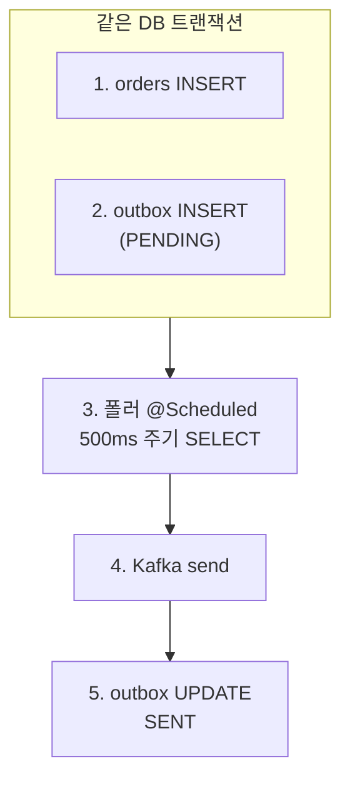

# Outbox 폴러의 0건 SELECT 와 polling cadence
---
> Transactional Outbox 패턴의 핵심 운영 결정 중 하나가 폴링 주기다. 500ms `fixedDelay` 는 발행 지연을 낮추는 안전한 기본값으로 보이지만, PENDING 0건일 때도 매 주기 SELECT 가 발행돼 DB 부하·로그 폭주·다른 비용을 부른다. 본 글은 0건 SELECT 의 진짜 비용을 분해하고, cadence 를 결정하는 변수와 adaptive backoff·CDC 대안을 정리한다.


## 1. Outbox 패턴이란?

### 정의 한 줄

비즈니스 데이터와 발행할 메시지를 **같은 RDBMS 트랜잭션 안에서 함께 커밋** 하고, 별 폴러가 그 메시지 테이블을 읽어 broker (Kafka 등) 로 보내는 패턴이다.

### 왜 필요한가 — dual-write 문제

서비스가 주문을 저장하면서 "주문이 생성됐다" 이벤트를 Kafka 에 보내야 한다고 하자. 단순 코드는 다음과 같다:

```java
orderRepository.save(order);     // (a) DB INSERT
kafkaTemplate.send(orderEvent);  // (b) broker 발행
```

(a) 와 (b) 가 분리된 두 시스템이라 원자성이 깨진다 — (a) 성공 후 (b) 실패하면 "DB 에는 주문이 있는데 다른 서비스는 모름", (b) 성공 후 (a) 가 rollback 되면 "발행은 됐는데 DB 에는 주문이 없음". XA 분산 트랜잭션으로 묶을 수 있지만 비용이 크고 broker 가 지원해야 한다 (Kafka 는 XA 미지원).

Transactional Outbox 가 이 문제를 푼다:

1. 같은 DB TX 안에서 `orders` 테이블과 `outbox` 테이블 (`TB_TRB_OX_001` 등) 에 함께 INSERT 하고 커밋한다. 두 INSERT 가 같은 트랜잭션이므로 원자성 보장.
2. 별도 폴러 스레드가 `outbox` 의 `PENDING` 행을 주기적으로 SELECT 해서 broker 로 발행한다.
3. broker 발행이 성공하면 그 행을 `SENT` 로 UPDATE. 실패하면 다음 주기에 재시도 (최소 once 보장).

### 동작 흐름



이 모델의 정합성은 두 가지에 의존한다 — outbox INSERT 가 비즈니스 TX 와 같은 커밋에 묶이는 원자성, 그리고 폴러가 `SENT` 마킹 전까지 무한 재시도하는 최소 once 보장. 그래서 "발행 지연" 은 폴러의 polling cadence (얼마나 자주 SELECT 하는지) 와 broker 응답 시간의 합으로 결정된다. cadence 가 본 글의 주제다.

> **여기 등장한 식별자 한 줄 소개:**
> - **@Scheduled** — Spring 의 메서드 어노테이션. 빈의 메서드를 `TaskScheduler` 가 주기적으로 실행한다. `fixedDelay` 는 "이전 실행 종료 후 N ms", `fixedRate` 는 "이전 실행 시작 후 N ms", `cron` 은 표준 cron 식.
> - **TaskScheduler / ThreadPoolTaskScheduler** — `@Scheduled` 메서드가 실제로 도는 스레드 풀. Spring Boot 기본은 단일 스레드 (풀 사이즈 1) 라 여러 `@Scheduled` 가 같은 스레드에서 직렬 실행된다. 풀을 따로 만들고 `threadNamePrefix` 를 박으면 logback 에서 thread name 기반 차단이 가능해진다.
> - **FOR UPDATE SKIP LOCKED** — SELECT 가 잠근 행을 다른 트랜잭션이 만나면 대기하는 대신 건너뛴다. PostgreSQL 9.5 / MariaDB 10.6 부터 지원. 폴러 다중 인스턴스가 같은 PENDING 행을 중복 점유하지 않게 만드는 핵심.


## 2. 0건 SELECT 의 진짜 비용 세 가지

폴러는 PENDING 깊이가 0 이어도 주기마다 같은 SELECT 를 발행한다. 이 "비어있는 폴링" 이 운영에서 진짜로 만드는 비용은 세 가지다.

**(1) DB 부하 — 커넥션 점유 + 락 평가.** SELECT 자체는 빠르지만 (보통 1~5ms), `FOR UPDATE SKIP LOCKED` 를 포함하면 트랜잭션 내 락 평가가 매번 발생한다. 동시에 여러 폴러 인스턴스가 떠 있으면 락 대기는 SKIP LOCKED 가 회피해주지만 락 매니저 진입은 매번 일어난다. 폴러 인스턴스 N개 × 500ms = 분당 N × 120 개 커넥션 사이클. 커넥션 풀 maxSize 가 작은 환경에서는 정상 트래픽과 풀을 두고 경쟁한다.

**(2) 로그 폭주 — wrap 라이브러리와 만나면.** driver 가 log4jdbc 같은 wrap 일 때 폴링 한 사이클이 약 20+ 줄을 INFO 로 쏟는다. 500ms 주기로 분당 약 2,400 줄. 같은 SQL 이 반복되므로 Elasticsearch 인덱스가 의미 없는 카디널리티로 부풀고, Kibana/Grafana 패널에서 진짜 에러 신호가 묻힌다. 차단 방법은 `04-01.JDBC 드라이버 wrap 로깅의 운영 비용` 참조.

**(3) 발행 지연 SLA 와의 트레이드오프.** polling interval 이 짧을수록 평균 발행 지연이 짧다 (이론값은 interval/2). 짧게 두는 게 SLA 측면에서 안전하지만 (1)·(2) 비용이 같은 비율로 커진다. 반대로 길게 두면 비용은 줄지만 PENDING 이 발생한 직후 평균 지연이 늘어난다. cadence 결정은 이 두 곡선의 교점을 찾는 일이다.


## 3. cadence 결정 변수

운영에서 실제로 cadence 를 정할 때 봐야 할 변수는 네 가지다.

**발행 지연 SLA.** "outbox INSERT 부터 broker 도달까지 P99 가 몇 ms 이내" 를 SLA 로 박는 게 우선. 100ms 가 SLA 면 polling interval 은 50ms 이하 + broker 응답 시간 마진. 1초가 SLA 면 500ms 면 충분.

**동시 폴러 인스턴스 수.** k8s 에서 Deployment replicas N 이면 폴러가 N 개 동시 돈다. 같은 SELECT 가 N × (1/interval) 회 발행되므로 DB 부하가 비례한다. SKIP LOCKED 가 충돌은 회피하지만 락 평가 회수 자체는 줄지 않는다.

**OX 테이블 평균 PENDING 깊이.** 트래픽 패턴이 spiky 한지 균일한지에 따라 다르다. 평균이 0 에 가까우면 (idle 시간 99%) 짧은 interval 은 거의 다 헛수고. 평균이 항상 N>>0 이면 polling interval 보다 batch size 가 throughput 결정 변수가 된다.

**DB 커넥션 풀 여유.** 폴러가 트랜잭션 한 번에 커넥션 한 개를 잠시 잡는다. 풀 maxSize 가 정상 트래픽으로 거의 차 있으면 폴러가 풀 경쟁을 일으킨다. 짧은 interval + 큰 풀 vs 긴 interval + 작은 풀의 균형.

위 네 변수 중 (발행 지연 SLA) 가 1순위 결정 변수다. 나머지는 비용 항이다.


## 4. adaptive backoff — N 회 empty 시 늦추기

대부분의 outbox 폴러는 트래픽이 spiky 다. 업무 시간만 활성, 새벽은 거의 idle. 이런 패턴에서 고정 interval 은 항상 최악의 SLA 를 가정한 비용을 지불한다. adaptive backoff 가 이를 푼다.

기본 아이디어는 단순하다. N 회 연속 empty (PENDING 0건 SELECT) 면 다음 interval 을 2배 또는 4배로 늘린다. PENDING 이 한 건이라도 잡히면 즉시 base interval (예: 500ms) 로 복귀. PostgreSQL 환경이면 `LISTEN/NOTIFY` 를 hybrid 로 결합 — outbox INSERT 트리거가 NOTIFY 를 쏘고 폴러가 그걸 깨워 즉시 SELECT. 폴링은 보험 역할로만 길게 (예: 5초) 돌린다.

backoff 의 함정은 동시 폴러 인스턴스가 같은 박자로 같이 깨어나 thundering herd 가 되는 것이다. jitter 를 더해 (예: interval × (0.8 + random × 0.4)) 인스턴스별로 깨는 시점을 분산해야 한다. jitter 없는 backoff 는 N개 인스턴스가 같은 ms 에 같은 SELECT 를 쏘는 부작용을 만든다.

Spring 의 `@Scheduled` 단독으로는 adaptive backoff 를 표현하기 어렵다. `ThreadPoolTaskScheduler.schedule(Runnable, Trigger)` + custom `Trigger` 구현으로 다음 실행 시점을 동적으로 결정하는 게 표준 길. 그게 비용이 크면 폴러 메서드 안에서 `Thread.sleep` 으로 흉내내는 단순 변형도 가능하다 — 단 sleep 동안 스레드가 점유된다는 단점.


## 5. CDC (Debezium) 와의 비교

polling 자체를 없애는 길이 log-based CDC 다. Debezium 이 대표 — MySQL/PostgreSQL/MongoDB 등의 transaction log (binlog, WAL, oplog) 를 직접 읽어 변경을 Kafka 로 흘려보낸다. 애플리케이션 코드에 polling 로직이 사라지고, DB 가 커밋한 순간 broker 로 사실상 실시간 (수십 ms) 도달한다.

CDC 의 트레이드오프 표:

| 항목 | polling Outbox | log-based CDC (Debezium) |
|------|----------------|--------------------------|
| 발행 지연 | polling interval/2 + broker | 수십 ms (binlog 처리) |
| DB 부하 | SELECT 회수 비례 | binlog 읽기만 (대부분 무시 가능) |
| 코드 결합도 | 애플리케이션 안에 폴러 빈 필요 | 애플리케이션 코드 0 — DB 만 보면 됨 |
| 운영 복잡도 | Spring `@Scheduled` 만 | Debezium connector + Kafka Connect 인프라 |
| binlog 권한 | 불필요 | DB replication 권한 필요 |
| 멱등성/순서 | application 책임 | Debezium 이 offset 으로 보장 |
| 멀티 broker | 가능 | connector 추가 |
| 학습 곡선 | 낮음 | 중간 — Kafka Connect + Debezium 운영 지식 필요 |

핵심은 CDC 가 "공짜가 아니다" 라는 점이다. Kafka Connect 클러스터, connector 모니터링, schema registry 통합, snapshot 처리, replication slot 관리 (PostgreSQL) 같은 운영 면이 추가된다. 트래픽 규모와 지연 요구가 일정 임계점을 넘을 때 CDC 가 합리화된다 — 그 전까지는 잘 튜닝된 polling outbox 가 더 단순하다.


## 6. 결론 — cadence 부터 점검하라

운영에서 outbox 폴러의 "로그가 너무 많아요" 같은 신호는 자주 logback 차단으로 막힌다. 차단 자체는 옳지만, 그 한 단계 앞 — cadence 가 워크로드에 맞게 정해졌는지 — 가 사실 1순위 점검 포인트다. 500ms `fixedDelay` 는 발행 지연 SLA 가 100ms~1s 인 환경에서만 정답이고, idle 시간 비율이 90% 를 넘는 워크로드에서는 거의 항상 비용을 낭비한다.

권고 순서는 다음과 같다. 먼저 (발행 지연 SLA) 와 (실측 PENDING 깊이 분포) 를 측정한다. polling interval 이 SLA 가 허용하는 가장 큰 값으로 올라갈 수 있는지 본다. idle 비율이 높으면 adaptive backoff + jitter 로 가고, 그래도 cadence 가 비용을 만들면 CDC 로의 졸업을 검토한다. 로그 폭주 차단은 그 다음 안전망 — `01-01` 의 logback 차단 레이어로 외과적으로 끈다.

본 글의 동기인 operator k8s 사건 상세 시퀀스는 `runners-high/issue/2026-05-21/operator-outbox-log-flood.md` 참조.


## 7. 면접 대비 요약

### 한 줄 정의

Transactional Outbox 패턴이란 비즈니스 데이터와 발행할 메시지를 같은 DB 트랜잭션 안에서 함께 커밋하고, 별 폴러가 그 메시지 테이블을 broker 로 흘려보내 dual-write 문제를 푸는 방식이다.

### 핵심 포인트 3가지

1. **0건 SELECT 도 비용이다.** 폴러는 PENDING 깊이가 0 이어도 매 주기 SELECT 를 발행한다. 500ms `fixedDelay` 면 분당 120 회. DB 부하·로그 폭주·발행 지연 SLA 세 변수의 트레이드오프가 cadence 결정의 본질이다.
2. **adaptive backoff + jitter 가 일반 해법이다.** idle 시간이 90% 를 넘는 워크로드에서는 N 회 연속 empty 시 interval 을 2~4 배로 늘리고 PENDING 이 잡히면 base 로 복귀. 다중 인스턴스 thundering herd 를 피하려면 jitter 가 필수.
3. **polling 의 졸업이 CDC (Debezium) 다.** log-based CDC 는 polling 자체를 없애고 binlog/WAL 을 직접 읽어 broker 로 흘린다. 발행 지연 수십 ms + DB 부하 거의 0 의 이득이 있지만 Kafka Connect 운영 복잡도가 따라온다.

### 자주 묻는 질문

**Q. Outbox 와 단순 메시지 큐의 차이는?**
A. 단순 `kafkaTemplate.send()` 는 broker 가 외부 시스템이라 DB TX 와 원자성이 깨진다 (dual-write). Outbox 는 발행할 메시지를 같은 DB 에 임시 저장해 원자성을 DB TX 안으로 가져온 뒤, broker 발행 실패는 폴러 재시도로 풀어 결과적으로 "at-least-once" 를 보장한다.

**Q. 폴러 인스턴스를 여러 개 띄워도 메시지가 중복 발행되지 않는 이유는?**
A. 폴링 SELECT 에 `FOR UPDATE SKIP LOCKED` 를 걸어 한 행을 한 인스턴스만 잠그게 한다. 다른 인스턴스는 잠긴 행을 건너뛰고 그 다음 PENDING 을 처리한다. SKIP LOCKED 가 락 대기 자체를 회피하므로 throughput 손실 없이 동시 폴링이 가능하다.

**Q. 500ms 주기를 그냥 10ms 로 줄이면 더 빨리 발행되니까 좋지 않나?**
A. 발행 지연 평균은 5ms 로 짧아지지만 (1) DB 커넥션 한 개를 50배 자주 잡고 (2) log4jdbc 같은 wrap 라이브러리와 결합되면 로그가 50배 폭주하고 (3) 인스턴스 N 개면 N×50 배 부하가 된다. SLA 가 100ms 가 아니라 1초여도 충분하다면 그 차이는 거의 다 헛수고. cadence 는 SLA 의 함수이지 "짧을수록 좋은" 변수가 아니다.

**Q. CDC 와 Outbox 중 무엇을 선택해야 하나?**
A. 다음 조건이 모두 만족되면 Outbox 가 단순해서 유리: (a) Kafka Connect 인프라가 아직 없음, (b) 발행 지연 SLA 가 1초 이상으로 여유, (c) 트래픽이 spiky 해서 cadence 튜닝으로 충분히 비용을 통제 가능. 반대로 (d) Kafka Connect 가 이미 있음, (e) 발행 지연 SLA 가 100ms 이하, (f) DB 변경 발생률이 높아 polling 비용이 항상 무겁다면 CDC 졸업이 정답.
