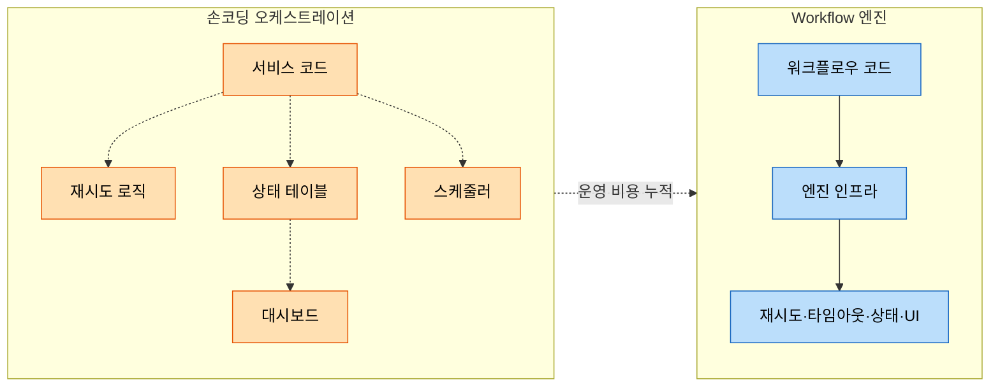
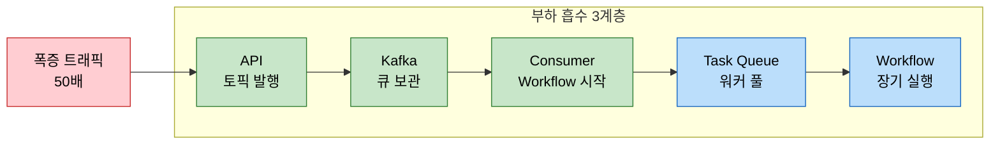

# Workflow 오케스트레이션의 필요성

---

> 단순 이벤트 컨슈머만으로는 *분기 많은 긴 흐름*과 *부분 실패의 보상*을 운영하기 어렵다. Workflow 엔진은 그 흐름을 "코드로 작성된 상태 머신"으로 끌어올려, 재시도·타임아웃·가시성·장기 수명을 인프라 수준에서 처리한다. 본 문서는 강의 §6의 "폭증 트래픽 대응" 동기를 기존 EDA·Saga 학습 트리와 연결해, 언제 손코딩에서 엔진으로 옮길지를 다룬다.


## 학습 목표

> Workflow 엔진을 *서비스 코드와 분리된 흐름 제어층*으로 이해한다.

이 장을 다 읽고 다음 다섯 가지에 자신 있게 답할 수 있으면 학습이 완료된다.

1. 손코딩 오케스트레이션이 무너지는 네 가지 시그널(분기 복잡도, 가시성, 재시도, 워크플로우 수명)을 설명할 수 있다.
2. Saga 패턴과 Workflow 엔진의 관계를 "패턴 대 도구" 관점에서 구분할 수 있다.
3. EDA 환경에서 "이벤트가 실패하면 어떻게 할까"라는 질문을 Workflow 엔진이 어떻게 푸는지 설명할 수 있다.
4. 트래픽 폭증 시 Workflow 엔진이 부하 흡수와 재시도를 어떻게 분리하는지 설명할 수 있다.
5. Workflow 엔진 도입의 운영 비용 세 가지를 설명할 수 있다.


## 1. 출발점 — EDA 컨슈머의 한계

`[01-01.EDA 기초](../../../03_architecture/04_edd/05-01.EDA%20기초.md)`에서 본 모델은 단순했다. 프로듀서가 토픽에 이벤트를 발행하고, 컨슈머가 받아 자기 책임을 수행한다. 이 그림은 "한 이벤트 = 한 컨슈머의 짧은 처리"라는 가정 위에서 깔끔하게 동작한다.

그런데 실무 흐름은 종종 그 가정을 벗어난다. 주문 한 건이 결제·재고 차감·배송 예약·알림 발송으로 이어지고, 각 단계가 다른 서비스의 응답을 기다린다. 중간 단계가 실패하면 이미 끝난 단계를 되돌려야 한다. 결제 합의 같은 단계는 외부 시스템의 응답에 며칠이 걸리기도 한다.

이런 흐름을 "단순 컨슈머 여러 개"로 풀면 곧 다음과 같은 코드가 쌓인다.

```java
@KafkaListener(topics = "order-events")
public void onOrderCreated(OrderCreatedEvent event) {
    try {
        paymentClient.charge(event.orderId);
        inventoryClient.reserve(event.orderId);
        shippingClient.schedule(event.orderId);
        notificationClient.send(event.orderId);
    } catch (PaymentException e) {
        // 보상? 어디까지 진행됐는지 어떻게 알지?
    } catch (InventoryException e) {
        // 결제는 이미 끝났는데 환불해야 하나?
    }
    // 5시간 후 외부 응답이 오면? 이 메서드는 이미 떠난 상태인데?
}
```

한 메서드 안에 모든 분기와 보상이 들어가면 코드는 점점 다음 네 가지 문제를 동시에 안는다. 각 문제는 "기능 추가"가 아니라 *운영 부담의 누적*이라는 점이 본질이다.


## 2. 손코딩 오케스트레이션이 무너지는 네 시그널

> 강의 §6의 "워크플로우 도입 동기"를 운영 관점으로 풀어 본다.

### 2-1. 분기 복잡도

처음에는 빌드 → 테스트 → 배포 같은 직선 흐름이지만, 곧 빌드 결과에 따라 테스트 종류가 갈리고, 테스트 결과에 따라 다른 환경으로 배포된다. 한 컨슈머 안의 `if/else`로 분기를 처리하면 흐름의 진실이 코드 사이에 흩어진다. 6개월 뒤 "이 단계 다음에는 어디로 가는가?"를 코드 베이스 grep으로 추적해야 하는 상태가 된다.

### 2-2. 가시성

운영팀은 보통 "지금 진행 중인 주문이 어느 단계에 있는가"를 묻는다. 손코딩에서는 이걸 답하려면 별도 상태 테이블을 만들고 단계마다 update를 박는다. 그 테이블이 곧 새로운 진실의 출처가 되고, 코드 흐름과 테이블 상태가 어긋날 때 디버깅이 시작된다.

### 2-3. 재시도와 타임아웃

외부 API 호출은 실패한다. 단순 재시도라면 Spring Retry로 충분하지만, "결제는 3번 재시도하되 60초 간격 + 멱등 키 동봉, 배송 예약은 1번만 즉시 재시도, 알림은 실패해도 무시"처럼 단계마다 정책이 갈라지는 순간 컨슈머 코드는 정책 분기로 뒤덮인다. 단계마다 `@Retryable` 애너테이션을 다는 방법도 있지만, 정책 변경마다 코드를 다시 배포해야 한다.

### 2-4. 워크플로우 수명

가장 미묘한 시그널이다. 흐름이 5초 안에 끝나면 단순 컨슈머가 답이다. 30분이 걸리면 컨슈머 인스턴스가 그 사이 죽지 않기를 빌어야 한다. 며칠이 걸리는 흐름(예: 결제 합의 대기, 사람의 승인)은 컨슈머 메서드의 수명을 벗어나므로 별도 스케줄러·DB 폴링·상태 머신을 짜야 한다.

| 시그널 | 손코딩 가능 한계 | 엔진 필요 임계 |
|--------|-----------------|---------------|
| 분기 복잡도 | 5단계, 단순 if/else | 10단계 이상 또는 동적 fan-out |
| 가시성 | 별도 상태 테이블로 가능 | 단계 변경마다 테이블 마이그레이션 부담 |
| 재시도 정책 | 단계별 단일 정책 | 단계마다 정책이 다르고 자주 바뀜 |
| 워크플로우 수명 | 분 단위 | 시간~일 단위 이상 |

네 시그널 중 두 개 이상이 동시에 끓어오르면 손코딩의 운영 비용이 엔진 운영 비용을 넘어서기 시작한다.


## 3. Workflow 엔진이 푸는 네 운영 문제

> 같은 네 시그널을 엔진은 *인프라 수준에서* 다룬다.

Workflow 엔진은 흐름을 "코드로 작성한 상태 머신"으로 본다. 한 워크플로우 인스턴스는 자신의 진행 상태를 엔진의 영속 저장소에 둔다. 코드가 실행 중인 프로세스가 죽어도, 다른 워커가 같은 상태를 이어 받아 다음 단계를 진행한다. 이 한 가지 모델이 네 가지 운영 문제를 동시에 푼다.

**가시성**은 엔진의 Web UI가 답한다. 어느 인스턴스가 어느 단계에 있고, 무엇을 기다리고 있으며, 다음 단계가 무엇인지가 코드와 분리된 자료로 노출된다. 운영팀은 별도 대시보드를 만들 필요가 없다.

**재시도·타임아웃**은 각 단계의 *선언*으로 표현된다. "이 단계는 최대 3번, 지수 백오프, 시작에서 60초 안에 끝나야 함" 같은 정책이 코드 옆에 데이터로 붙는다. 정책 변경은 워크플로우 재배포 한 번으로 끝나고, 진행 중인 인스턴스도 다음 단계부터 새 정책을 따른다.

**장기 수명**은 엔진의 진행 상태 영속화로 자연스럽게 해결된다. "이 단계에서 7일을 기다린 뒤 타임아웃이면 보상" 같은 표현이 한 줄 코드로 가능하다. 워커 프로세스가 7일 동안 메모리에 머무를 필요가 없다. 7일이 지난 시점에 어느 워커가 깨워서 그 인스턴스의 다음 줄을 실행한다.

**분기 복잡도**는 워크플로우 코드 자체가 일반 프로그래밍 언어로 작성되기에 `if/else`, 루프, 함수 호출이 그대로 흐름의 문법이 된다. DSL을 새로 배울 필요 없이 자바·코틀린·고로 흐름을 쓰고, 그 코드 흐름이 곧 운영 시각화에 1:1 대응된다.



핵심은 "흐름의 책임"이 서비스 코드에서 엔진 인프라로 옮겨 간다는 점이다. 그 책임 이동이 운영 비용의 곡선 자체를 바꾼다.


## 4. Saga 패턴과 Workflow 엔진 — 패턴 대 도구

> 자주 혼동되는 두 용어를 한 번에 정리한다.

`[01-02.Orchestration Saga](../../05_ConsistencyPattern/01-02.Orchestration%20Saga.md)`가 Saga의 일반 구조(여러 서비스 트랜잭션을 명시적 조정자가 묶는 방식)를 다뤘다. Saga는 *패턴*이다. 분산 트랜잭션의 부분 실패를 보상으로 풀자는 발상이고, 어떤 도구로 구현하느냐는 별개 결정이다.

손코딩으로도 Saga를 짤 수 있다. TPS의 `PipelineExcnService`가 단계마다 결과 이벤트를 받아 다음 명령을 보내는 패턴이 바로 손코딩 오케스트레이션 Saga다. 같은 패턴을 Temporal·Camunda 8·Conductor·Step Functions 같은 엔진으로도 구현할 수 있다.

| 측면 | Saga 패턴 | Workflow 엔진 |
|------|----------|--------------|
| 정체 | 분산 트랜잭션의 보상 모델 | Saga(와 그 외)를 구현하는 인프라 |
| 책임 | "부분 실패를 어떻게 보상할 것인가" | "흐름을 어떻게 영속화·재시도·시각화할 것인가" |
| 선택 시점 | 도메인 설계 단계 | 운영 비용 곡선이 손코딩을 넘어선 시점 |
| 예 | Order Saga = 결제+재고+배송의 보상 묶음 | Temporal로 그 Order Saga를 실행 |

따라서 "Saga를 도입할까?"와 "Workflow 엔진을 도입할까?"는 같은 질문이 아니다. Saga는 분산 트랜잭션이 있으면 패턴으로 채택할 수 있고, 그 위에 손코딩으로 충분한지 엔진이 필요한지는 §2의 네 시그널로 따로 판단한다.

엔진 선택 자체는 `[09-02.Saga 엔진 비교](../01_variants/01-02.Saga%20엔진%20비교.md)`에 정리되어 있다. 본 시리즈는 그중 Temporal에 집중한다.


## 5. 폭증 트래픽 대응 — 부하 흡수와 재시도의 분리

> 강의의 핵심 동기다. 트래픽이 폭증해도 모듈이 다 죽지 않으려면 흐름을 어디서 끊어야 하는가.

문제 상황을 구체화한다. 이커머스에서 블랙 프라이데이 같은 이벤트로 주문 트래픽이 평소의 50배로 튄다. 모든 주문이 결제·재고·배송·알림을 순차로 호출해야 하는데, 그중 결제 서비스가 외부 PG사에 의존해 응답 시간이 평소의 5배로 늘어난다. 단순 동기 구조라면 주문 API가 결제 응답을 기다리다 타임아웃을 일으키고, 클라이언트는 재시도를 하며 더 큰 트래픽을 만든다. 결국 모든 모듈이 함께 무너진다.

### 5-1. 한 가지 도구만으로는 충분하지 않은 이유

EDA만 도입해도 첫 부담은 줄어든다. 주문 API가 결제 호출을 토픽 발행으로 바꾸면 API는 빠르게 응답하고, 컨슈머가 자기 속도로 처리한다. 다만 컨슈머 측의 결제 시도가 *언제* 성공하느냐는 여전히 외부 PG사에 달려 있고, 컨슈머가 일정 시간 안에 끝나지 않으면 리밸런스가 발생한다.

Workflow 엔진을 더하면 두 번째 부담이 분리된다. 컨슈머는 이벤트를 받아 *Workflow를 시작·시그널하기만* 하고 즉시 끝난다. 결제 시도, 응답 대기, 재시도, 보상은 모두 엔진 안의 Workflow 인스턴스가 책임진다. 컨슈머는 메시지 큐의 backpressure로 보호되고, Workflow는 자신의 Task Queue로 또 한 번 backpressure를 받는다.



세 단계의 큐가 직렬로 붙는다. API는 Kafka 큐에 던지고, 컨슈머는 Task Queue에 던지고, 워커가 자기 속도로 꺼낸다. 각 큐가 자기 깊이만큼 부하를 흡수하므로 한쪽이 잠시 느려져도 그 영향이 다른 쪽으로 즉시 번지지 않는다.

### 5-2. 재시도는 어디서 일어나는가

이 구조의 또 다른 이점은 재시도가 흐름과 분리된다는 점이다. Activity 단계의 PG사 호출이 실패하면 Workflow는 자기 재시도 정책에 따라 그 Activity만 다시 호출한다. Kafka는 그 사실을 모른다. 이벤트는 이미 한 번 소비되었고 Workflow가 자기 책임 안에서 끝까지 처리한다.

반대로 손코딩 컨슈머에서 재시도하면 컨슈머가 메시지를 ack하지 못한 채 시간을 끌게 되고, 리밸런스 위험과 큐 적체가 함께 늘어난다. 폭증 트래픽 상황에서는 이 차이가 시스템 전체의 생존을 가른다.

자세한 재시도 3계층 설계는 `[02-01.EDA + CDC + Temporal 통합 아키텍처](02-01.EDA%20%2B%20CDC%20%2B%20Temporal%20%ED%86%B5%ED%95%A9%20%EC%95%84%ED%82%A4%ED%85%8D%EC%B2%98.md)`에서 다룬다.


## 6. Workflow 엔진 도입의 운영 비용

> 장점만 본 결정은 6개월 뒤 후회한다. 도입 비용 세 가지를 명시한다.

### 6-1. 별도 인프라 운영

엔진은 자체 서버 클러스터와 영속 저장소를 요구한다. Temporal의 경우 Temporal Server + Cassandra/Postgres + Elasticsearch 조합이 표준이고, 운영 환경에서는 다중 노드와 백업·모니터링이 필요하다. SaaS(Temporal Cloud)를 쓰면 운영 부담은 줄지만 비용 청구가 새로 생긴다.

손코딩에는 이 인프라가 0이다. 기존 DB 한 행 추가로 상태를 표현하던 시스템이 갑자기 별도 클러스터를 띄워야 한다는 점이 처음 도입 시 가장 큰 저항이다.

### 6-2. 학습 곡선

특히 Temporal·Cadence 계열은 *결정성* 제약을 요구한다. Workflow 코드 안에서 `Instant.now()`, `Random()`, 직접적인 HTTP 호출 같은 비결정적 작업을 하면 안 된다. 이를 위반하면 재시도 시 Event History replay가 깨져 워크플로우가 영구히 stuck 된다. 이 제약이 학습 비용을 만들고, 팀이 적응할 때까지 몇 주에서 몇 달이 걸린다.

상세는 `[01-02.Temporal 핵심 개념](01-02.Temporal%20%ED%95%B5%EC%8B%AC%20%EA%B0%9C%EB%85%90%20-%20Workflow%EC%99%80%20Activity.md)`에서 본다.

### 6-3. 디버깅·모니터링의 새로운 표면

엔진이 흐름의 상태를 들고 있다는 점은 가시성 측면에서는 이점이지만, 운영 측면에서는 새로운 *지식 부담*이다. 워커가 왜 멈췄는지, Task Queue가 왜 비어 있는지, Workflow가 왜 timeout 되었는지를 추적하려면 엔진의 메트릭과 로그를 읽을 줄 알아야 한다. 기존 Spring Boot · Kafka 로그만 보던 팀은 새로운 관측 도구 한 세트를 학습해야 한다.


## 7. 도입 시그널 정리

> 네 시그널과 세 비용을 같은 표로 정렬하면 의사결정이 단순해진다.

| 단계 | 손코딩 비용 | 엔진 비용 | 결정 |
|------|------------|----------|------|
| 흐름 5단계 이하, 분 단위 | 낮음 | 인프라 부담만 큼 | 손코딩 유지 |
| 흐름 10단계 이상, 시간 단위 | 상태 테이블·스케줄러 누적 | 인프라 + 학습 곡선 | 엔진 도입 검토 |
| 흐름 5단계지만 *사람 승인* 포함 | 알림·재진입 로직 복잡 | signals/timers로 자연스러움 | 엔진 도입 |
| 재시도 정책이 단계마다 다름 | 분기 코드 누적 | 정책 = 데이터 | 엔진 도입 |
| 폭증 트래픽 대응 | 컨슈머 리밸런스 위험 | Task Queue로 분리 | 엔진 도입 |

세 가지 비용은 도입 시점부터 계속 발생한다. 네 시그널 중 두 개 이상이 동시에 끓을 때까지는 인프라 비용이 더 크다. 두 개 이상이 동시에 시작되면 운영 비용 곡선이 역전된다.


## TPS 적용 검토

> `okestro/tps-gitlab2` (CDC 미사용, 손코딩 오케스트레이션 기반)

`operator` 모듈의 `PipelineExcnService`는 현재 *손코딩 오케스트레이션 Saga*다. 빌드 → 테스트 → 배포 단계를 명시적으로 호출하고, 각 결과 컨슈머가 다음 단계를 트리거한다. 평가:

- **분기 복잡도**: 단계 수 5개 이하, 분기는 성공/실패의 단일 축. 손코딩으로 충분.
- **가시성**: 별도 상태 테이블(`TB_TRB_*`)로 단계 추적. 현재 운영 가능.
- **재시도 정책**: 단계별 단일 정책, 정책 변경 빈도 낮음.
- **워크플로우 수명**: 분~시간 단위. 컨슈머 인스턴스 수명 안에서 처리.

네 시그널 모두 임계 미달이며, Workflow 엔진 운영 인프라(Cassandra/Elasticsearch + 별도 클러스터)의 비용이 이득을 넘어선다. 도입 검토 트리거는 (a) 파이프라인 단계가 6단계 이상으로 늘어남, (b) 동적 분기·사람 승인 추가, (c) 단일 폴러로 잡히지 않는 처리량 증가다.


## 면접 대비 Q&A

> 면접에서 자주 나오는 형태로 5개. 답을 보지 않고 먼저 입으로 답해 본 뒤 비교한다.

### Q1. 손코딩 오케스트레이션이 무너지기 시작하는 시그널은?

네 가지를 든다. 분기 복잡도가 5단계를 넘어 if/else 미로가 시작될 때, 운영팀이 "어디까지 진행됐나"를 묻는 빈도가 늘어 별도 상태 테이블을 만들기 시작할 때, 재시도 정책이 단계마다 갈리기 시작할 때, 흐름 수명이 컨슈머 인스턴스 수명을 벗어날 때. 한두 개만 끓으면 손코딩 보강으로 버텨지지만, 두 개 이상이 동시에 끓으면 엔진의 인프라 비용보다 손코딩 보강 비용이 더 커진다.

### Q2. Saga와 Workflow 엔진의 관계는?

Saga는 분산 트랜잭션의 부분 실패를 보상으로 푸는 *패턴*이고, Workflow 엔진은 그 패턴을 실행하는 *도구* 중 하나다. Saga는 손코딩으로도, Temporal·Camunda 같은 엔진으로도 구현할 수 있다. "Saga를 쓸까"는 도메인 설계 결정이고, "엔진을 쓸까"는 운영 비용 결정으로 분리된다.

### Q3. EDA만으로 폭증 트래픽이 다 풀리지 않는 이유는?

EDA는 *발행 측*의 부하만 빠르게 풀어 준다. 컨슈머가 외부 의존(PG사, 외부 API)이 느려질 때 처리 시간이 늘어나면, 리밸런스 위험과 큐 적체가 함께 시작된다. Workflow 엔진을 더하면 컨슈머는 *Workflow를 시작·시그널만 하고 즉시 끝난다*. 실제 외부 호출·재시도·대기는 엔진 안의 Workflow 인스턴스가 자기 Task Queue 안에서 처리하므로, 컨슈머와 분리된 백프레셔가 한 번 더 생긴다.

### Q4. Workflow 엔진의 재시도가 컨슈머 재시도보다 운영 측면에서 안전한 이유는?

컨슈머가 재시도하면 메시지를 ack하지 못한 채 시간을 끌게 되고, Kafka 입장에서 그 컨슈머가 응답 없는 상태로 보여 리밸런스가 일어날 수 있다. 리밸런스가 발생하면 그 파티션의 다른 메시지 처리도 멈춘다. Workflow 엔진은 컨슈머가 이벤트를 받자마자 Workflow를 시작·시그널하고 ack를 보내며, 재시도는 엔진의 Activity 단위에서 일어난다. Kafka 측 부하와 도메인 재시도가 다른 시간 축에서 독립적으로 흐른다.

### Q5. Workflow 엔진 도입의 비용 세 가지는?

별도 인프라 운영(Temporal Server + Cassandra/Postgres + Elasticsearch 같은 추가 클러스터), 학습 곡선(특히 Temporal·Cadence의 결정성 제약), 디버깅·관측 도구의 새로운 표면(엔진 메트릭과 Web UI를 읽을 수 있어야 함). 이 세 가지 비용은 도입 시점부터 계속 발생하므로, 네 시그널 중 두 개 이상이 동시에 끓는 시점까지는 손코딩 유지가 더 가성비 좋다.


## 관련 문서

- [01-02.Temporal 핵심 개념](01-02.Temporal%20%ED%95%B5%EC%8B%AC%20%EA%B0%9C%EB%85%90%20-%20Workflow%EC%99%80%20Activity.md) — Workflow/Activity/Worker와 결정성 제약
- [02-01.EDA + CDC + Temporal 통합 아키텍처](02-01.EDA%20%2B%20CDC%20%2B%20Temporal%20%ED%86%B5%ED%95%A9%20%EC%95%84%ED%82%A4%ED%85%8D%EC%B2%98.md) — 5단 파이프라인과 3계층 재시도
- [01-02.Orchestration Saga](../../05_ConsistencyPattern/01-02.Orchestration%20Saga.md) — Saga 패턴의 일반 구조
- [09-02.Saga 엔진 비교](../01_variants/01-02.Saga%20%EC%97%94%EC%A7%84%20%EB%B9%84%EA%B5%90.md) — Temporal·Camunda·Conductor·Step Functions 비교 매트릭스
- [01-01.EDA 기초](../../../03_architecture/04_edd/05-01.EDA%20기초.md) — EDA의 기본 모델
