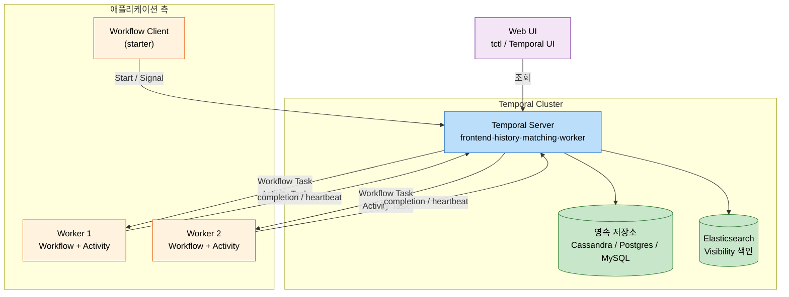
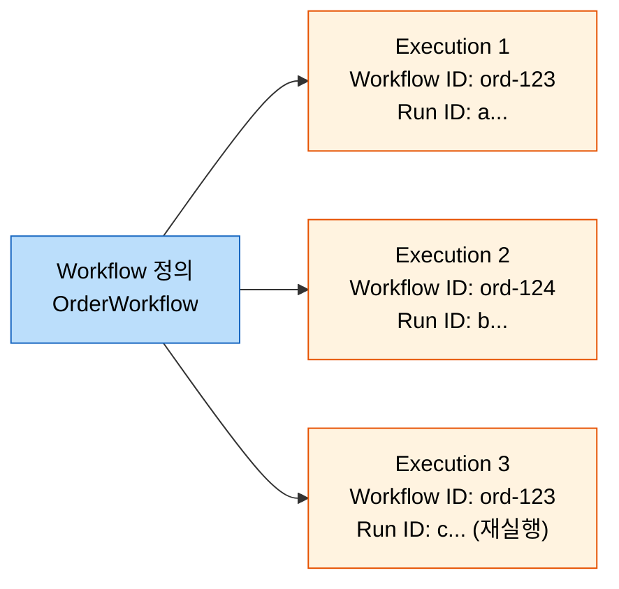
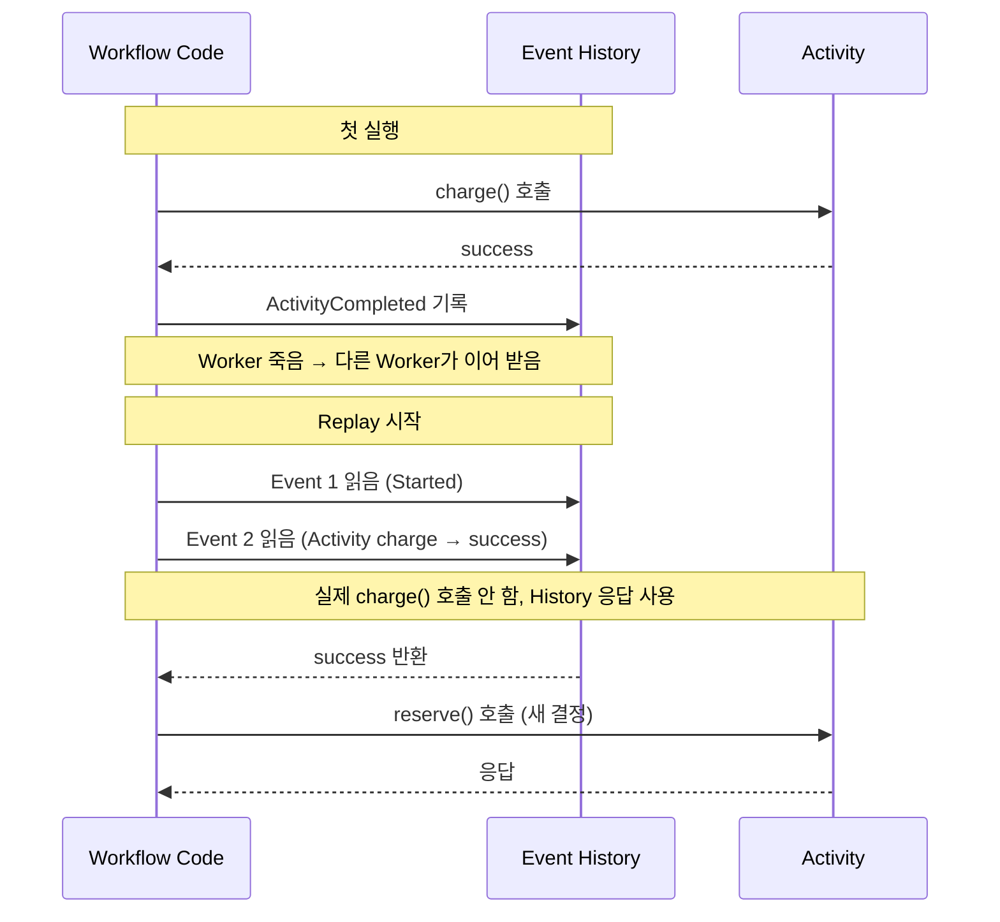

# Temporal 핵심 개념 — Workflow와 Activity

---

> Temporal은 흐름을 *Workflow*와 *Activity* 두 추상으로 가른다. Workflow는 결정적 코드의 영역이고, Activity는 외부 세계와 부수 효과를 다루는 영역이다. 이 분리가 Event History 기반 replay·재시도·장기 수명을 가능하게 한다. 본 문서는 Worker/Task Queue/Workflow Execution의 관계, 결정성 제약, Signal·Query·Timer의 용도를 정리한다.


## 학습 목표

> Temporal의 *두 추상 분리*와 *Event History replay*가 어떻게 장기 흐름의 복구를 가능하게 하는지 이해한다.

이 장을 다 읽고 다음 다섯 가지에 자신 있게 답할 수 있으면 학습이 완료된다.

1. Workflow와 Activity의 책임 분리(결정성 대 외부 부수 효과)를 설명할 수 있다.
2. Worker, Task Queue, Workflow Execution 사이의 관계를 설명할 수 있다.
3. Event History와 Replay 메커니즘이 어떻게 "프로세스가 죽어도 복구"를 가능하게 하는지 설명할 수 있다.
4. 결정성 위반(`Random()`, `Instant.now()` 직접 호출 등)의 결과와 회피 방법을 설명할 수 있다.
5. Signal, Query, Timer의 용도 차이와 각각의 사용 시점을 설명할 수 있다.


## 1. 전체 구조 — 다섯 구성요소

> Temporal을 처음 볼 때 가장 헷갈리는 것은 등장 인물이 많다는 점이다. 다섯 명만 기억하면 된다.



다섯 구성요소의 책임은 다음과 같다.

| 구성요소 | 책임 | 위치 |
|----------|------|------|
| Temporal Server | Task 분배, History 영속화, Timer 발사 | 별도 클러스터 |
| 영속 저장소 | Workflow 상태와 Event History 저장 | Cassandra / Postgres / MySQL |
| Elasticsearch | Visibility 색인(Web UI 검색용) | 권장(선택) |
| Worker | Workflow / Activity 코드 실행 | 애플리케이션 프로세스 |
| Client | Workflow 시작 · Signal · Query 발행 | 애플리케이션 어디든 |

Server는 흐름의 *어디까지 진행됐는지*를 영속 저장소에 보관하고, Worker는 그 진행을 *실제로 실행*한다. 두 책임이 분리되어 있으므로 Worker 프로세스가 죽어도 다른 Worker가 같은 Workflow를 이어 받을 수 있다.


## 2. Workflow — 결정성의 영역

> Workflow 코드는 일반 코드처럼 보이지만, *결정적이어야 한다*. 이 한 가지 제약이 Temporal 전체를 이해하는 출발점이다.

### 2-1. 결정성이 무엇인가

결정성(determinism)은 *같은 입력으로 같은 결정 순서를 반환*해야 한다는 성질이다. Workflow 코드 안에서 `Random()`을 호출하거나 `Instant.now()`로 현재 시각을 읽거나 직접 HTTP 호출을 하면 같은 입력이라도 매번 다른 결정을 낼 수 있다. Temporal은 이를 결정성 위반으로 간주한다.

왜 이 제약이 필요한가? Temporal은 Workflow 실행 중간에 Worker가 죽으면, 다른 Worker가 *Event History를 처음부터 replay*해 같은 진행 상태를 재구성한다. 이 replay가 매번 다른 결정을 낸다면 재구성 자체가 불가능하다. 결정성은 이 replay를 일관되게 만드는 계약이다.

### 2-2. 결정성을 지키는 방법

Temporal SDK는 비결정적 작업을 위한 결정적 대체 API를 제공한다.

| 비결정적 호출 | 결정적 대체 |
|--------------|------------|
| `Instant.now()` | `Workflow.currentTimeMillis()` |
| `Math.random()` / `UUID.randomUUID()` | `Workflow.randomUUID()` / `Workflow.newRandom()` |
| `Thread.sleep(ms)` | `Workflow.sleep(Duration)` |
| 직접 HTTP / DB 호출 | Activity로 위임 |
| 외부 서비스 응답 대기 | `Workflow.await(condition)` + Signal |

대체 API의 공통점은 *호출과 응답이 Event History에 기록된다*는 것이다. replay 시에는 실제 호출이 다시 일어나지 않고, History에 기록된 응답을 그대로 돌려받는다. 이 메커니즘이 "같은 입력 = 같은 결정"을 보장한다.

### 2-3. Workflow 코드의 모양

자바 기준 Workflow 코드는 다음과 같이 보인다.

```java
@WorkflowInterface
public interface OrderWorkflow {
    @WorkflowMethod
    void process(OrderRequest req);

    @SignalMethod
    void cancel(String reason);

    @QueryMethod
    OrderStatus currentStatus();
}

public class OrderWorkflowImpl implements OrderWorkflow {

    private final PaymentActivity payment = Workflow.newActivityStub(
        PaymentActivity.class,
        ActivityOptions.newBuilder()
            .setStartToCloseTimeout(Duration.ofSeconds(30))
            .setRetryOptions(RetryOptions.newBuilder()
                .setMaximumAttempts(3)
                .build())
            .build());

    private OrderStatus status = OrderStatus.STARTED;

    @Override
    public void process(OrderRequest req) {
        status = OrderStatus.PAYMENT_PENDING;
        PaymentResult pr = payment.charge(req.orderId, req.amount);

        if (!pr.success) {
            status = OrderStatus.FAILED;
            return;
        }

        status = OrderStatus.SHIPPING_PENDING;
        // ... 다음 단계
    }

    @Override
    public void cancel(String reason) {
        // signal로 도착하는 외부 이벤트 처리
    }

    @Override
    public OrderStatus currentStatus() {
        return status;
    }
}
```

`process` 메서드 안의 `payment.charge(...)` 호출이 평범한 메서드 호출처럼 보이지만, 실제로는 Activity Task 생성·Worker 호출·결과 수신을 모두 거쳐 결정적으로 돌아온다. 호출자는 그 내부를 신경 쓰지 않고 `PaymentResult`만 받는다.


## 3. Activity — 외부 세계와의 인터페이스

> Activity는 *비결정적이어도 되는* 영역이다. 외부 API 호출, DB 쓰기, 파일 입출력 같은 부수 효과는 모두 Activity 안으로 들어간다.

Activity가 Workflow와 다른 점 세 가지를 짚는다.

첫째, **Activity는 결정성 제약이 없다**. 내부에서 `Random()`, `Instant.now()`, HTTP 호출이 자유롭다. 결과만 Workflow로 돌려주면 된다.

둘째, **Activity는 단위로 재시도된다**. 실패 시 Workflow는 Activity의 RetryOptions에 따라 같은 Activity를 다시 호출한다. Workflow 전체가 다시 도는 게 아니라 *그 Activity만* 다시 돌아간다. Activity가 멱등하지 않으면 중복 부수 효과 위험이 생기므로, 외부 호출에는 idempotency key를 동반하는 것이 표준이다.

셋째, **Activity는 별도 타임아웃 4종을 가진다**. 각 타임아웃의 의미가 다르므로 따로 정리한다.

| 타임아웃 | 의미 | 기본 권장 |
|----------|------|----------|
| `ScheduleToStart` | Task Queue에 들어간 뒤 Worker가 집어 갈 때까지 | 짧게 (Worker 부족 감지) |
| `StartToClose` | Worker가 실행을 시작한 뒤 완료까지 | Activity 실제 처리 시간 기준 |
| `ScheduleToClose` | 전체(스케줄 + 실행 + 재시도) | 합계 상한 |
| `Heartbeat` | 진행 중인 Activity가 살아 있다는 신호 간격 | 긴 Activity에서 5~30초 |

`StartToClose`만 설정하면 가장 단순하다. 짧은 Activity는 그것으로 충분하고, 분 단위 이상 걸리는 Activity는 Heartbeat를 추가해 *실행 중에 Worker가 죽었는지*를 감지하게 만든다.

```java
@ActivityInterface
public interface PaymentActivity {
    @ActivityMethod
    PaymentResult charge(String orderId, BigDecimal amount);
}

@Component
public class PaymentActivityImpl implements PaymentActivity {

    private final PgClient pgClient;

    @Override
    public PaymentResult charge(String orderId, BigDecimal amount) {
        // 외부 PG 호출 — 비결정적이어도 됨
        return pgClient.requestCharge(
            orderId,
            amount,
            idempotencyKey(orderId)
        );
    }

    private String idempotencyKey(String orderId) {
        return "charge-" + orderId;
    }
}
```

`idempotencyKey`가 핵심이다. 같은 `orderId`에 대한 재시도는 같은 키로 PG사를 호출하므로, PG사 측에서 두 번째 요청을 중복으로 인식해 단일 결과만 반환한다. Activity 단위 재시도가 안전해진다.


## 4. Worker, Task Queue, Workflow Execution

> Worker는 Workflow 코드와 Activity 코드를 *실행하는 프로세스*다. Server가 일감을 만들고 Worker가 받아 처리한다.

### 4-1. Task Queue 개념

Server는 Worker에게 직접 일을 시키지 않는다. *Task Queue*라는 논리적 큐에 Task를 쌓아 두고, Worker가 자기가 처리할 큐를 polling 한다. 한 Task Queue에는 여러 Worker가 붙을 수 있고, 한 Worker는 여러 Task Queue를 처리할 수 있다.

Task에는 두 종류가 있다.

- **Workflow Task**: Workflow 코드를 한 줄(또는 한 블록) 진행시키는 일감. 결과는 Event History에 새 이벤트로 추가된다.
- **Activity Task**: Activity 메서드를 한 번 호출하는 일감. 결과는 Workflow에 응답으로 돌아간다.

Worker는 이 두 종류 Task를 각각의 폴러로 받아 처리한다.

### 4-2. Workflow Execution

Workflow Execution은 *한 Workflow 인스턴스의 실행 단위*다. `OrderWorkflow`라는 Workflow 정의가 있고, `orderId=ord-123`으로 시작된 인스턴스가 하나의 Execution이다. 각 Execution은 고유한 Workflow ID와 Run ID를 가진다.



Workflow ID는 *비즈니스 식별자*다. 보통 `orderId`나 그것을 포함한 문자열을 쓴다. 같은 Workflow ID로 두 번 시작하려 하면 Temporal이 기본으로 `WorkflowExecutionAlreadyStartedException`을 던진다(중복 방지). 이 성질이 `[01-03 Spring 통합](01-03.Temporal%20Spring%20Boot%20%ED%86%B5%ED%95%A9.md)`에서 이벤트 멱등성의 기반이 된다.

Run ID는 *한 실행의 식별자*다. 같은 Workflow ID라도 일정 시점 이후 새 실행으로 시작되면 새 Run ID를 받는다.


## 5. Event History와 Replay

> Temporal의 영혼은 Event History다. 모든 Workflow의 모든 결정이 *추가 전용 로그*로 기록되고, replay가 그 로그를 그대로 재생한다.

### 5-1. Event History의 구조

한 Workflow Execution이 진행되면 Server는 그 진행을 이벤트 시퀀스로 영속화한다.

```
[1] WorkflowExecutionStarted        (입력: orderId, amount)
[2] WorkflowTaskScheduled
[3] WorkflowTaskStarted              (Worker가 받음)
[4] WorkflowTaskCompleted
[5] ActivityTaskScheduled            (charge)
[6] ActivityTaskStarted
[7] ActivityTaskCompleted            (응답: success=true)
[8] WorkflowTaskScheduled
[9] WorkflowTaskStarted
[10] WorkflowTaskCompleted
[11] ActivityTaskScheduled           (reserve)
...
```

각 이벤트는 *결정의 결과*다. Activity를 호출했는가, 응답이 무엇이었는가, Timer가 발사되었는가, Signal이 도착했는가 같은 모든 외부 영향이 이벤트로 박힌다.

### 5-2. Replay 메커니즘

Worker가 새 Workflow Task를 받으면 다음 절차로 진행한다.

1. 해당 Workflow의 Event History를 처음부터 읽는다.
2. Workflow 코드를 처음부터 다시 실행한다.
3. Activity 호출 지점에 도달하면 History의 해당 응답을 *즉시* 반환한다(실제 호출 X).
4. History의 마지막 이벤트에 도달하면 그 다음 줄부터 *실제로* 실행한다.

이 절차의 결과로 Worker가 도중에 죽어도 다른 Worker가 같은 진행 상태로 이어 받는다. 같은 입력으로 같은 결정 순서가 나오는지(결정성)가 이 replay의 전제다.



### 5-3. History 크기 관리

Event History는 추가 전용이므로 Workflow가 오래 살수록 커진다. Temporal 기본 한도는 한 Workflow Execution당 50,000 이벤트 또는 50MB다. 장기 흐름이거나 루프가 많은 Workflow는 이 한도를 넘기지 않도록 *Continue-As-New*를 쓴다. 현재 Workflow를 같은 Workflow ID로 새 Execution(새 Run ID)으로 이어 가게 만드는 API로, History를 새로 시작한다.

대표적 사용처는 무한 루프 Workflow다. 매 N회 반복마다 Continue-As-New를 호출하면 History가 끝없이 커지지 않는다.


## 6. Signal, Query, Timer — 외부 상호작용 3종

> Workflow가 외부와 상호작용하는 통로는 세 가지다. 각각의 용도가 분명하다.

### 6-1. Signal — Workflow에 외부 이벤트를 주입

Signal은 *돌고 있는 Workflow에 외부 이벤트를 던지는* 호출이다. 결과를 받지 않는다(fire-and-forget). 응답이 필요 없는 단방향 알림이다.

대표 사용처:
- 사용자가 "주문 취소" 버튼을 누름 → `cancel(reason)` Signal
- 외부 시스템이 "결제 합의 완료" 콜백을 보냄 → `paymentConfirmed(...)` Signal
- 다른 Workflow가 자식 Workflow에 진행 신호를 보냄

Signal은 History에 기록되므로 replay가 가능하다. Signal이 도착한 순간 Workflow는 다음 결정 지점에서 그 Signal을 인식한다.

### 6-2. Query — Workflow의 현재 상태 조회

Query는 *돌고 있는 Workflow의 상태를 읽는* 호출이다. Signal과 달리 응답을 받는다. 단, *부수 효과를 일으키지 않아야* 한다(읽기 전용).

대표 사용처:
- 운영팀이 "현재 어느 단계까지 진행됐나" 조회
- API가 `GET /orders/{id}/status` 요청을 받아 Workflow에 직접 묻기
- 디버깅 도중 Workflow의 내부 변수 확인

Query는 *History에 기록되지 않는다*. 단순히 현재 메모리 상태를 노출할 뿐이다.

### 6-3. Timer — 시간 기반 결정

Timer는 *"N 시간/일 뒤에 깨워 줘"*라는 결정이다. `Workflow.sleep(Duration.ofDays(7))` 같은 호출이 Timer를 만든다.

Workflow는 sleep 동안 Worker 메모리에 머무르지 않는다. Server가 Timer를 자체적으로 보관하고 있다가 만료 시점에 Workflow Task를 다시 만든다. Worker가 그 Task를 받아 sleep 다음 줄부터 진행한다. 7일짜리 Workflow가 가능한 이유가 이 메커니즘이다.

| 통로 | 방향 | 응답 | History 기록 | 사용처 |
|------|------|------|--------------|--------|
| Signal | 외부 → Workflow | 없음 | 기록됨 | 외부 이벤트 주입 |
| Query | Workflow → 외부 | 있음 | 기록 안 됨 | 상태 조회 (읽기 전용) |
| Timer | 내부 결정 | 없음 | 기록됨 | 시간 기반 진행 |


## 7. Workflow가 stuck 되는 패턴들

> 실무에서 가장 자주 만나는 함정 세 가지를 정리한다.

### 7-1. 결정성 위반

Workflow 코드 안에서 `Instant.now()`, `Math.random()`, 직접 HTTP 호출, 직접 DB 호출, `Thread.sleep()` 같은 호출이 일어나면 replay가 깨진다. 깨진 직후의 Workflow는 *영구히 stuck* 상태로 남는다 — 새 Worker가 replay를 시도할 때마다 같은 자리에서 다른 결과가 나오기 때문이다.

회피: Temporal SDK의 결정적 대체 API만 사용. 외부 호출은 모두 Activity로 위임. 코드 리뷰 시 `@WorkflowImpl` 클래스 안의 비결정적 호출을 정적 검사로 잡는다(많은 SDK가 `Workflow.getCurrentTimeMillis()` 같은 헬퍼를 강제하기 위한 lint를 제공).

### 7-2. Event History 무한 증가

루프가 많거나 수많은 자식 Workflow를 spawn하는 Workflow는 History가 50,000 이벤트 또는 50MB를 초과한다. Temporal은 한도에 가까워지면 경고를 띄우고, 한도 초과 시 강제로 종료한다.

회피: Continue-As-New로 주기적으로 History를 끊는다. 한 Execution에 너무 많은 단계를 묶지 말고, 비즈니스 단위로 자식 Workflow로 분리한다.

### 7-3. 버전 호환성

배포로 Workflow 코드가 바뀌면 진행 중인 Execution이 replay 시 새 코드와 기존 History의 결정 순서가 어긋날 수 있다. 예를 들어 기존 코드에 `if (a) call A else call B`가 있었고 어느 Execution이 `A`로 진행 중인데, 새 코드에서 그 분기가 `call C`로 바뀌면 replay가 깨진다.

회피: `Workflow.getVersion()` API로 *코드 변경 지점에 버전 마커*를 박는다. 진행 중인 Execution은 옛 버전으로, 새 Execution은 새 버전으로 동작하게 분기한다.

```java
int version = Workflow.getVersion("payment-rework", Workflow.DEFAULT_VERSION, 1);
if (version == Workflow.DEFAULT_VERSION) {
    payment.chargeLegacy(req);
} else {
    payment.chargeV2(req);
}
```

이 패턴이 익숙해지면 무중단 Workflow 배포가 가능해진다. 익숙하지 않으면 배포 한 번에 운영 중인 모든 Workflow가 stuck 된다.


## 면접 대비 Q&A

> 면접에서 자주 나오는 형태로 5개. 답을 보지 않고 먼저 입으로 답해 본 뒤 비교한다.

### Q1. Workflow와 Activity의 차이를 한 문장으로?

Workflow는 *결정적 코드의 영역*이고 외부 부수 효과가 금지된다. Activity는 *비결정적 작업의 영역*이고 HTTP 호출·DB 쓰기 같은 부수 효과가 허용된다. 둘이 분리되어 있어야 Workflow가 Event History replay로 복구 가능해지고, Activity는 단위로 재시도된다.

### Q2. Event History가 Workflow 복구를 가능하게 하는 원리는?

Workflow의 모든 결정과 외부 응답이 Event History에 추가 전용으로 기록된다. Worker가 죽으면 다른 Worker가 그 Workflow의 Workflow Task를 받고, Workflow 코드를 처음부터 다시 실행하며 History의 해당 응답을 *즉시 돌려받는다*(실제 호출은 다시 일어나지 않음). History 끝에 도달하면 그 다음 줄부터 실제로 실행한다. 결정성 제약이 같은 입력 = 같은 결정 순서를 보장하므로 이 replay가 일관되게 동작한다.

### Q3. Workflow 안에서 `Instant.now()`나 `Random()`을 직접 호출하면 어떻게 되나?

해당 Workflow가 stuck 된다. replay 시점에 같은 호출이 *다른 값*을 반환하므로 History와 결정이 어긋나고, Worker가 그 지점을 통과하지 못한다. 회피하려면 Temporal SDK의 결정적 대체 API(`Workflow.currentTimeMillis()`, `Workflow.randomUUID()`)를 쓰거나, 그 호출 자체를 Activity로 위임한다.

### Q4. Signal과 Query의 차이는?

Signal은 외부에서 Workflow로 *이벤트를 던지는* 호출로 응답이 없고 History에 기록되며 fire-and-forget이다. Query는 Workflow의 *현재 상태를 읽는* 호출로 응답이 있고 History에 기록되지 않으며 부수 효과를 일으키지 않아야 한다. "취소해 줘"는 Signal, "지금 어디까지 진행됐나"는 Query.

### Q5. Workflow를 7일 동안 살려 두려면 Worker 프로세스도 7일 동안 살아 있어야 하나?

아니다. `Workflow.sleep(Duration.ofDays(7))`를 호출하면 Worker 메모리에서 그 Workflow가 해제된다. Server가 Timer를 자체 영속 저장소에 보관하고 7일 뒤 만료 시점에 Workflow Task를 새로 만들어, *그 시점에 살아 있는* Worker에게 분배한다. Worker는 sleep 다음 줄부터 실행한다. Timer 메커니즘이 Workflow의 수명과 Worker 프로세스의 수명을 분리한다.


## 관련 문서

- [01-01.Workflow 오케스트레이션의 필요성](01-01.Workflow%20%EC%98%A4%EC%BC%80%EC%8A%A4%ED%8A%B8%EB%A0%88%EC%9D%B4%EC%85%98%EC%9D%98%20%ED%95%84%EC%9A%94%EC%84%B1.md) — 손코딩 한계와 엔진 도입 시그널
- [01-03.Temporal Spring Boot 통합](01-03.Temporal%20Spring%20Boot%20%ED%86%B5%ED%95%A9.md) — Bean 4종 + Kafka 통합
- [02-01.EDA + CDC + Temporal 통합 아키텍처](02-01.EDA%20%2B%20CDC%20%2B%20Temporal%20%ED%86%B5%ED%95%A9%20%EC%95%84%ED%82%A4%ED%85%8D%EC%B2%98.md) — 5단 파이프라인
- [01-02.Saga 엔진 비교](../01_variants/01-02.Saga%20%EC%97%94%EC%A7%84%20%EB%B9%84%EA%B5%90.md) — Temporal·Cadence·Camunda 트레이드오프
