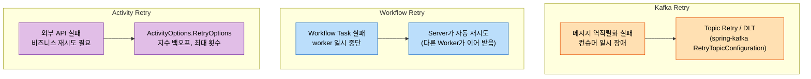

# EDA + CDC + Temporal 통합 아키텍처

---

> MySQL → Debezium → Kafka → Spring → Temporal 다섯 구간이 직렬로 붙는 통합 패턴이다. 각 구간은 자기 영역의 책임만 진다 — DB는 *진실의 출처*, CDC는 *변경 캡처*, Kafka는 *비동기 버퍼*, Spring 컨슈머는 *Workflow 트리거*, Temporal은 *흐름 실행과 재시도*. 본 문서는 이 분리가 폭증 트래픽 대응·실패 격리·가시성을 어떻게 동시에 만드는지, 운영에서 만나는 네 함정과 대응까지 정리한다. 강의 §2와 §8의 시그니처 패턴을 학습 자산화한다.


## 학습 목표

> 다섯 구간의 *책임 분리*가 만드는 운영 이점을 이해한다.

이 장을 다 읽고 다음 다섯 가지에 자신 있게 답할 수 있으면 학습이 완료된다.

1. MySQL → Debezium → Kafka → Spring → Temporal 다섯 구간 각각이 담당하는 책임을 설명할 수 있다.
2. CDC 이벤트로 Workflow를 시작하거나 시그널하는 두 패턴의 차이를 설명할 수 있다.
3. 실패 처리를 Kafka 재시도·Workflow 재시도·Activity 재시도 세 계층으로 분리하는 이유와 각 계층의 책임을 설명할 수 있다.
4. 트래픽 폭증 시 Task Queue가 어떻게 부하 흡수 역할을 하는지 설명할 수 있다.
5. 통합 아키텍처에서 발생하는 네 가지 운영 함정(중복 실행, 순서 보장, 스키마 진화, 가시성 격차)과 대응을 설명할 수 있다.


## 1. 한 장 아키텍처

> 다섯 구간이 한 흐름으로 이어진다. 각자 자기 역할만 하므로 한 구간이 느려져도 옆 구간으로 즉시 번지지 않는다.

```mermaid
flowchart LR
    subgraph src["진실의 출처"]
        api["API / Service<br>(주문 생성)"]
        db[("MySQL<br>orders + outbox")]
        api -->|"트랜잭션 1건"| db
    end

    subgraph cdc["변경 캡처"]
        dbz["Debezium Connector<br>(Kafka Connect)"]
        db -->|"binlog 구독"| dbz
    end

    subgraph mq["비동기 버퍼"]
        kafka[("Kafka<br>order-events<br>payment-events")]
        dbz -->|"발행"| kafka
    end

    subgraph spring["Workflow 트리거"]
        consumer["@KafkaListener<br>WorkflowClient"]
        kafka -->|"구독"| consumer
    end

    subgraph temporal["흐름 실행"]
        srv["Temporal Server<br>Event History"]
        worker["Worker<br>Workflow + Activity"]
        ext["외부 시스템<br>PG · 재고 · 알림"]
        consumer -->|"start / signal"| srv
        srv <-->|"Task 분배"| worker
        worker -->|"Activity 호출"| ext
    end

    style api fill:#fff3e0,color:#000,stroke:#e65100
    style db fill:#c8e6c9,color:#000,stroke:#2e7d32
    style dbz fill:#bbdefb,color:#000,stroke:#1565c0
    style kafka fill:#bbdefb,color:#000,stroke:#1565c0
    style consumer fill:#fff3e0,color:#000,stroke:#e65100
    style srv fill:#e1bee7,color:#000,stroke:#6a1b9a
    style worker fill:#e1bee7,color:#000,stroke:#6a1b9a
    style ext fill:#ffcdd2,color:#000,stroke:#c62828
```



서비스 코드는 자기 DB만 책임진다. 그 뒤로는 *DB가 만들어 낸 변경*이 다섯 구간을 흘러가며 비즈니스 흐름을 끝낸다. 각 구간은 자기 큐·자기 영속 저장소를 갖고 있어 backpressure가 세 번 일어난다.


## 2. 구간별 책임 분리

> 같은 이벤트라도 어느 구간에서 *언제* 다루느냐가 다르다. 책임이 명확하면 디버깅과 변경이 쉬워진다.

| 구간 | 책임 | 책임이 아닌 것 |
|------|------|---------------|
| MySQL + outbox | 비즈니스 트랜잭션의 *원자성*. 도메인 이벤트를 outbox 테이블에 *같은 트랜잭션*으로 기록 | 이벤트 발행, 외부 시스템 호출 |
| Debezium | binlog에서 outbox row 변경 *캡처*. EventRouter로 토픽 라우팅 | 도메인 의미 해석, 재시도 정책 |
| Kafka | 발행된 이벤트의 *영속 버퍼*. at-least-once 전달 | 도메인 흐름 실행, 보상 트랜잭션 |
| Spring 컨슈머 | 이벤트 수신 → *Workflow 시작/시그널*만 수행하고 ack | 비즈니스 로직, 재시도, 외부 API 호출 |
| Temporal | Workflow 실행, Activity 재시도, 상태 영속화, 가시성 | 이벤트 발행, DB 진실의 출처 |

가장 큰 실수는 Spring 컨슈머에 비즈니스 로직을 넣는 것이다. 컨슈머는 ack를 빨리 보내고 떠나야 Kafka 리밸런스 위험과 큐 적체를 피한다. 비즈니스 로직(외부 호출, 보상, 재시도)은 모두 Temporal Activity 안으로 옮겨진다.

기존 학습 트리와의 연결:

- outbox 테이블 자체의 설계는 `[02-01.Outbox](../../05_ConsistencyPattern/02-01.Outbox.md)`
- Debezium 설정과 EventRouter는 `[04-01.CDC](../../05_ConsistencyPattern/04-01.CDC.md)`
- 컨슈머 측 멱등성과 Inbox 패턴은 `[03-01.Inbox](../../05_ConsistencyPattern/03-01.Inbox.md)`
- Workflow 자체는 `[01-02.Temporal 핵심 개념](01-02.Temporal%20%ED%95%B5%EC%8B%AC%20%EA%B0%9C%EB%85%90%20-%20Workflow%EC%99%80%20Activity.md)`


## 3. CDC 이벤트가 Workflow로 도달하는 두 경로

> outbox 테이블을 CDC가 읽는 경로와 비즈니스 테이블을 직접 읽는 경로. 둘의 *도메인 의미 표현력*이 다르다.

### 3-1. 권장 경로 — outbox 테이블 CDC

서비스가 비즈니스 트랜잭션 안에서 outbox 테이블에 명시적 이벤트 row를 쓴다. Debezium은 outbox 테이블만 읽고, EventRouter SMT가 `aggregate_type`을 토픽으로 라우팅한다.

```sql
-- 비즈니스 트랜잭션 안
INSERT INTO orders (id, ...) VALUES ('ord-123', ...);
INSERT INTO outbox (id, aggregate_type, aggregate_id, event_type, payload)
VALUES (UUID(), 'Order', 'ord-123', 'order-created', '{...}');
COMMIT;
```

이 경로의 장점은 *도메인 의도가 보존된다*는 것이다. `event_type=order-created`라는 비즈니스 이벤트가 그대로 토픽에 도달하므로 Spring 컨슈머가 그 의미를 바로 인식할 수 있다.

```java
@KafkaListener(topics = "order-events")
public void onOrderEvent(ConsumerRecord<String, OutboxEvent> record) {
    String eventType = record.value().eventType();
    switch (eventType) {
        case "order-created"   -> startOrderWorkflow(record.value());
        case "order-cancelled" -> signalOrderCancel(record.value());
        case "order-refunded"  -> startRefundWorkflow(record.value());
    }
}
```

### 3-2. 대안 경로 — 비즈니스 테이블 직접 CDC

Debezium이 `orders` 테이블 자체를 읽는다. 이벤트는 `op=c|u|d`와 `before`/`after` 상태로 도달하고, 컨슈머가 그것을 도메인 이벤트로 *해석*해야 한다.

```java
public void onOrderRowChange(DebeziumEvent event) {
    if (event.op().equals("c")) {
        // 새 row → 주문 생성
        startOrderWorkflow(event.after());
    } else if (event.op().equals("u") &&
               event.before().status().equals("PENDING") &&
               event.after().status().equals("CANCELLED")) {
        // 상태 전이 → 취소
        signalOrderCancel(event.after());
    }
}
```

이 경로는 *애플리케이션 코드 변경 없이* CDC를 도입할 수 있다는 장점이 있지만, 도메인 의도가 컨슈머의 상태 비교 로직에 묻혀 결합도가 강해진다. 컬럼 추가/이름 변경이 즉시 컨슈머 코드를 깬다.

### 3-3. 선택 기준

| 측면 | outbox CDC | 비즈니스 테이블 CDC |
|------|-----------|--------------------|
| 도메인 의미 | 명시적 | 추론 필요 |
| 스키마 변경 영향 | outbox 스키마만 안정 유지 | 비즈니스 컬럼 변경마다 컨슈머 영향 |
| 도입 비용 | 서비스 코드에 outbox INSERT 추가 | 0 (기존 테이블 그대로) |
| 도입 후 비용 | 낮음 | 컬럼 변경 영향 누적 |

신규 시스템이라면 outbox CDC가 거의 항상 답이다. 레거시 시스템에 빠르게 CDC를 얹어야 한다면 비즈니스 테이블 CDC로 시작하고, 도메인 의도가 필요한 토픽부터 outbox로 옮기는 점진적 이행이 가능하다.


## 4. Start Workflow vs Signal 선택

> `[01-03 §5](01-03.Temporal%20Spring%20Boot%20%ED%86%B5%ED%95%A9.md)`에서 패턴 코드를 봤다. 여기서는 *언제 어느 쪽을 쓰는지*를 도메인 관점으로 정리한다.

기준은 단순하다. *이벤트가 새 흐름의 시작인가, 기존 흐름에 정보를 주는가*.

| 이벤트 | 의도 | 호출 | Workflow ID |
|--------|------|------|-------------|
| `order-created` | 새 주문 흐름 시작 | `WorkflowClient.start` | `order-{orderId}` |
| `order-cancelled` | 진행 중인 주문에 취소 주입 | `workflow.cancel()` Signal | `order-{orderId}` (기존) |
| `payment-confirmed` (외부 콜백) | 결제 합의 완료 알림 | `workflow.paymentConfirmed()` Signal | `order-{orderId}` (기존) |
| `order-refund-requested` | 새 환불 흐름 | `WorkflowClient.start` | `refund-{orderId}` |
| `order-row-updated` (CDC) | 상태 변화 알림 | 케이스에 따라 분기 | 의미에 따라 |

같은 토픽에 여러 종류 이벤트가 섞이는 경우 컨슈머가 `event_type`을 보고 분기한다 (§3-1의 switch 패턴). `[01-06.CDC §1-3](../../05_ConsistencyPattern/04-01.CDC.md)`의 Envelope 스키마 전략과 결합하면 이 분기가 자연스럽다.

`[01-02.Orchestration Saga](../../05_ConsistencyPattern/01-02.Orchestration%20Saga.md)`의 *명령-응답* 모델과는 결이 다르다. Saga 오케스트레이터는 매 단계마다 *명령*을 보내고 *응답 이벤트*를 기다리지만, Temporal에서는 Workflow가 직접 Activity를 호출하고 그 응답을 결정적으로 받는다. 외부 시스템이 이벤트로 응답하는 경우(예: 결제 합의가 별도 콜백으로 옴)에만 Signal로 응답을 주입한다.


## 5. 실패 격리 — 3계층 재시도

> 같은 "실패"라도 어느 계층에서 일어났느냐에 따라 재시도 정책이 다르다.



### 5-1. Kafka Retry — 컨슈머 측 일시 장애

대상은 *Workflow 시작 자체에 도달하지 못한 실패*다. 메시지 역직렬화 실패, Temporal Server 일시 단절, 컨슈머 NPE 같은 케이스.

대응: `spring-kafka`의 `RetryTopicConfiguration`으로 지수 백오프와 DLT(Dead Letter Topic)를 설정한다. 도메인 로직 실패는 여기서 처리하지 않는다 — 도메인 실패는 Workflow가 책임진다.

```java
@RetryableTopic(
    attempts = "3",
    backoff = @Backoff(delay = 1000, multiplier = 2),
    dltTopicSuffix = ".dlt"
)
@KafkaListener(topics = "order-events")
public void onOrderEvent(OutboxEvent event) {
    workflowClient.start(...);   // 도메인 로직은 여기 없음
}
```

### 5-2. Workflow Retry — 인프라 측 일시 장애

대상은 *Worker가 Workflow Task를 처리하는 도중에 죽거나 응답하지 않는* 케이스. Temporal Server가 자동으로 그 Task를 다른 Worker에게 재분배한다. 별도 설정 없이 동작한다.

이 계층은 *결정성 위반이 없는 한* 투명하게 복구된다. Event History replay로 같은 진행 상태가 재구성되고 다음 Task부터 다시 진행된다.

### 5-3. Activity Retry — 도메인 측 외부 의존 실패

대상은 *PG사 호출 실패, 재고 시스템 timeout, 알림 발송 거부* 같은 비즈니스 외부 실패. `ActivityOptions.RetryOptions`로 단계마다 정책을 잡는다.

```java
ActivityOptions paymentOptions = ActivityOptions.newBuilder()
    .setStartToCloseTimeout(Duration.ofSeconds(30))
    .setRetryOptions(RetryOptions.newBuilder()
        .setInitialInterval(Duration.ofSeconds(1))
        .setBackoffCoefficient(2.0)
        .setMaximumAttempts(5)
        .setNonRetryableErrorTypes("PaymentDeclinedException")
        .build())
    .build();
```

`setNonRetryableErrorTypes`가 중요하다. 결제 거절(잔액 부족)은 재시도해도 결과가 같으므로 즉시 실패로 처리해야 한다. 일시 장애만 재시도 대상으로 둔다.

### 5-4. 계층 분리의 이득

| 실패 유형 | 책임 계층 | 재시도 가시성 |
|----------|----------|---------------|
| 메시지 깨짐 | Kafka Retry | DLT 토픽 모니터링 |
| Worker 죽음 | Workflow Retry | Server가 투명하게 복구 |
| 외부 API 실패 | Activity Retry | Temporal Web UI의 Pending Activities |

같은 토큰이 세 계층 중 정확히 한 곳에서만 재시도되므로 *재시도 폭주*(같은 실패를 여러 계층이 동시에 다시 시도)가 발생하지 않는다. 운영팀은 실패가 어디서 일어났는지를 *계층별 도구*로 확인한다.


## 6. 폭증 트래픽 대응 — Task Queue 백프레셔

> `[01-01 §5](01-01.Workflow%20%EC%98%A4%EC%BC%80%EC%8A%A4%ED%8A%B8%EB%A0%88%EC%9D%B4%EC%85%98%EC%9D%98%20%ED%95%84%EC%9A%94%EC%84%B1.md)`에서 본 부하 흡수 3계층의 구체 메커니즘을 본다.

### 6-1. 세 계층의 큐 깊이

| 큐 | 위치 | 깊이 결정 | 폭증 시 동작 |
|----|------|----------|-------------|
| Kafka 토픽 | 디스크 | retention(시간) | 큐가 깊어지지만 손실 없음 |
| Spring 컨슈머 내부 큐 | JVM 메모리 | `max.poll.records` | 깊지 않음, 빠르게 처리하고 ack |
| Temporal Task Queue | Server DB | 제한 없음 | Worker 풀이 자기 속도로 소비 |

가장 중요한 점은 *컨슈머 내부 큐가 깊지 않다*는 것이다. 컨슈머는 받자마자 Workflow를 start/signal만 하고 떠나므로 처리 시간이 ms 단위다. 외부 의존(PG사, 재고)이 느려져도 컨슈머는 영향을 받지 않는다.

### 6-2. Worker 풀 튜닝

Task Queue 깊이가 늘어나면 Worker 수를 늘려 처리량을 확보한다. Temporal SDK는 `maxConcurrentActivityExecutionSize`, `maxConcurrentWorkflowTaskExecutionSize` 옵션으로 한 Worker 안의 동시성을 조절한다.

```yaml
temporal:
  worker:
    max-concurrent-activity-execution-size: 100
    max-concurrent-workflow-task-execution-size: 50
```

이 값은 Worker JVM의 CPU·메모리 한계와 외부 의존의 처리량 한계 중 작은 쪽으로 잡는다. PG사가 초당 50 TPS만 받는다면 Worker가 100 동시 호출을 해도 의미가 없고 오히려 외부 시스템에 부담을 준다.

### 6-3. 외부 시스템 부하 격리

Activity 단위로 *rate limit*을 설정할 수 있다. Workflow 코드 안에서 의미적으로 호출하는 그룹마다 별도 Activity로 나누고, 호출이 잦은 Activity는 별도 Task Queue·별도 Worker 풀에 둔다. PG 호출 Worker는 50 동시성, 알림 발송 Worker는 500 동시성처럼 *외부 시스템마다 동시성 분리*가 가능하다.

이 분리가 강의 §2의 "트래픽이 폭증해도 모든 모듈이 다 죽지는 않는" 구조를 만든다.


## 7. 운영 함정 네 가지와 대응

> 통합 아키텍처가 잘 굴러가다가 만나는 함정들이다. 미리 알면 첫 사고를 피할 수 있다.

### 7-1. 중복 실행

증상: 같은 비즈니스 이벤트로 두 Workflow가 시작되어 결제가 두 번 일어남.

원인: Kafka의 at-least-once 전달, 컨슈머 rebalance 직후 같은 메시지 재배달.

대응: Workflow ID를 비즈니스 키(`order-{orderId}`)로 잡고 `WorkflowIdReusePolicy.ALLOW_DUPLICATE_FAILED_ONLY`를 사용. 같은 ID로 두 번째 start 시도가 자동 거부된다. 추가로 Activity 안의 외부 호출은 idempotency key 동봉. 두 방어선이 결합되어야 안전하다.

### 7-2. 순서 보장

증상: 같은 주문에 대한 `created`와 `cancelled` 이벤트가 다른 파티션에 들어가 cancel이 먼저 처리됨.

원인: Kafka 파티션 키 설정이 비즈니스 키와 다름.

대응: outbox CDC에서 EventRouter의 `route.by.field=aggregate_id`로 파티션 키를 비즈니스 키와 일치시킴. 같은 `orderId`의 이벤트는 같은 파티션에 들어가고, 같은 컨슈머가 *순서대로* 받는다. 컨슈머는 그 순서대로 start/signal을 호출하므로 Workflow도 순서를 본다.

상세는 `[01-06.CDC §1-1](../../05_ConsistencyPattern/04-01.CDC.md)`의 Aggregate 단위 토픽 권장 이유와 같다.

### 7-3. 스키마 진화

증상: outbox payload에 새 필드를 추가했더니 기존 컨슈머가 역직렬화 실패.

원인: Avro/JSON 스키마 호환성 정책 미설정.

대응: Schema Registry로 호환성 모드를 *backward*로 강제. 새 필드는 default 값과 함께 추가하고, 기존 필드 제거는 금지. 컨슈머는 새 필드를 모른 채 옛 스키마로 읽어도 동작해야 한다.

상세는 `[01-02.Schema Registry](../../02_MessageContract/01-02.Schema%20Registry.md)`와 `[02-02.Avro 스키마 진화 패턴](../../02_MessageContract/02-02.Avro%20스키마%20진화%20패턴.md)` 참조.

### 7-4. 가시성 격차

증상: 주문이 어디서 멈췄는지 알 수 없음 — Kafka 측은 ack 완료, Temporal 측에서 Workflow가 보이지 않음.

원인: 컨슈머가 Workflow를 start한 직후 예외로 죽어, Workflow는 시작됐는데 Kafka 토픽에서 추적 단서가 사라짐.

대응: 컨슈머가 start 호출 후 Workflow ID를 *로그·메트릭·DB 기록*에 남긴다. Kafka 메시지의 `correlation-id` 헤더와 Workflow ID를 1:1로 매핑해 두면 두 도구를 동일 식별자로 추적 가능. Temporal Web UI의 Search Attribute 기능으로 비즈니스 키로 Workflow를 검색할 수 있게 등록한다.

```java
WorkflowOptions.newBuilder()
    .setWorkflowId("order-" + orderId)
    .setSearchAttributes(Map.of(
        "OrderId", orderId,
        "CorrelationId", correlationId
    ))
    .build();
```


## 8. Temporal/Docker 디버깅 — 강의 §9

> 실습 환경에서 가장 자주 보는 증상 다섯 가지와 첫 확인 지점이다.

| 증상 | 첫 확인 지점 | 자주 보는 원인 |
|------|-------------|---------------|
| Workflow가 안 시작됨 | 컨슈머 ack 로그, Temporal Web UI의 Pending Workflows | `target` 설정 오타, namespace 불일치 |
| Activity가 안 진행됨 | Web UI의 Event History 마지막 이벤트 | Worker가 Task Queue를 polling 안 함, Activity 빈 미등록 |
| Workflow가 stuck | Event History의 `WorkflowTaskFailed` | 결정성 위반 (`Instant.now()`, `Random()`, 비결정 의존 주입) |
| Activity 재시도 무한 | Event History의 Activity Attempt 수 | 재시도 정책 max 미설정, non-retryable 분류 누락 |
| Worker가 죽음 반복 | Worker 컨테이너 로그 | 메모리 부족, gRPC 연결 풀 한계, Temporal Server 단절 |

Docker 컴포즈 환경에서 자주 보는 추가 함정:

- `temporal-ui`가 `TEMPORAL_ADDRESS=temporal:7233`를 못 잡으면 빈 페이지가 뜬다. depends_on 확인.
- `auto-setup` 이미지는 처음 부팅 시 DB 스키마를 만들기 때문에 첫 기동이 30초~1분 걸린다. healthcheck를 추가하면 다음 서비스가 너무 빨리 기동되어 연결 실패하는 일이 줄어든다.
- Temporal Server와 Kafka가 같은 docker network에 있어야 컨슈머가 둘 다 접근할 수 있다.


## TPS 적용 사례

> `okestro/tps-gitlab2` — 현재 손코딩 + 폴링 Outbox, CDC와 Temporal 미사용

TPS의 현재 패턴과 강의 패턴을 비교한다.

| 측면 | TPS 현재 | 강의 패턴 |
|------|---------|----------|
| 이벤트 발행 | `EventPublisher` (Outbox INSERT + 폴러 SELECT) | Outbox INSERT만, Debezium이 캡처 |
| 흐름 제어 | `PipelineExcnService` 손코딩 | Temporal Workflow |
| 재시도 | 단계마다 손코딩 retry | Activity RetryOptions |
| 가시성 | `TB_TRB_*` 상태 테이블 | Temporal Web UI |
| 부하 흡수 | Kafka 큐 + 컨슈머 풀 | Kafka 큐 + Task Queue 백프레셔 |

도입 검토 트리거는 `[01-01 §7](01-01.Workflow%20%EC%98%A4%EC%BC%80%EC%8A%A4%ED%8A%B8%EB%A0%88%EC%9D%B4%EC%85%98%EC%9D%98%20%ED%95%84%EC%9A%94%EC%84%B1.md)`에서 본 네 시그널이 동시에 끓는 시점이다. 현재 TPS는 시그널 강도가 임계 미달이며, Cassandra/Elasticsearch 추가 운영 비용이 도입 이득을 넘는다.

부분 도입 경로는 두 가지가 있다.

1. **Debezium만 먼저**: 폴링 Outbox를 Debezium CDC로 교체해 발행 지연을 ms 단위로 줄임. Temporal은 도입하지 않음. `[04-01.CDC](../../05_ConsistencyPattern/04-01.CDC.md)`의 패턴 그대로.
2. **Temporal만 먼저**: 가장 분기 복잡한 한 흐름(예: 운영 환경 배포)만 Temporal로 옮김. 나머지는 손코딩 유지. 운영팀 학습 비용을 한 흐름에 집중.

둘 다 동시 도입은 한 분기에 새 인프라 두 개를 운영해야 하는 부담이 크다. 시그널이 끓는 흐름부터 단계적 도입이 안전하다.


## 면접 대비 Q&A

> 면접에서 자주 나오는 형태로 5개. 답을 보지 않고 먼저 입으로 답해 본 뒤 비교한다.

### Q1. MySQL → Debezium → Kafka → Spring → Temporal 다섯 구간의 책임 분리를 한 문장씩 설명하라.

MySQL은 비즈니스 트랜잭션의 원자성과 outbox 기록을 담당한다. Debezium은 binlog를 구독해 outbox 변경을 캡처하고 EventRouter로 토픽 라우팅을 수행한다. Kafka는 발행된 이벤트의 영속 버퍼 역할로 at-least-once 전달을 보장한다. Spring 컨슈머는 이벤트를 받아 *Workflow start 또는 signal만 호출하고 즉시 ack*한다. Temporal은 Workflow 실행, Activity 재시도, 상태 영속화, 운영 가시성을 책임진다. 핵심은 컨슈머가 비즈니스 로직을 두지 않는다는 점이다.

### Q2. outbox 테이블 CDC와 비즈니스 테이블 직접 CDC의 차이는?

outbox CDC는 서비스가 명시적으로 도메인 이벤트 row를 쓰므로 `event_type`이 토픽에 그대로 전달된다. 컨슈머가 도메인 의미를 바로 인식할 수 있고 스키마 변경 영향이 outbox 안에 갇힌다. 비즈니스 테이블 직접 CDC는 `op=c|u|d`와 `before`/`after` 상태로 도달해 컨슈머가 상태 비교로 의미를 *해석*해야 한다. 도입 비용은 낮지만 컬럼 변경마다 컨슈머가 깨지는 결합도가 생긴다. 신규 시스템이라면 outbox CDC가 거의 항상 답이다.

### Q3. Kafka 재시도·Workflow 재시도·Activity 재시도를 세 계층으로 분리하는 이유는?

각 계층이 *다른 종류의 실패*를 다루기 때문이다. Kafka 재시도는 메시지 역직렬화 실패나 컨슈머 일시 장애 같은 *Workflow 시작 자체에 도달하지 못한 실패*. Workflow 재시도는 Worker가 Task 처리 중 죽었을 때 Server가 다른 Worker에 재분배하는 *인프라 측 일시 장애*. Activity 재시도는 PG사 호출 실패 같은 *도메인 측 외부 의존 실패*. 한 토큰이 정확히 한 계층에서만 재시도되므로 재시도 폭주가 일어나지 않고, 운영팀은 계층별 도구로 실패 위치를 추적한다.

### Q4. 폭증 트래픽 시 Task Queue가 어떻게 부하 흡수 역할을 하는가?

Spring 컨슈머가 받자마자 Workflow start/signal만 호출하고 ms 단위로 ack를 보내므로 Kafka 측에 메시지가 쌓이지 않는다. 외부 의존(PG·재고)이 느려져도 그 영향은 Temporal Task Queue 안에서 멈춘다. Worker는 자기 동시성 한도 안에서 Task를 꺼내 처리하므로 외부 시스템에 *제어된 부하*만 보낸다. 즉 Kafka 큐가 받은 폭증을 컨슈머가 빠르게 흡수해 Task Queue로 보내고, Task Queue가 외부 시스템에 맞춘 속도로 소비함으로써 모든 계층이 자기 속도로 동작한다.

### Q5. 같은 비즈니스 이벤트가 두 번 도착해 결제가 두 번 일어나는 사고를 어떻게 막나?

두 방어선을 결합한다. 첫째, Workflow ID를 `order-{orderId}` 같은 비즈니스 키로 잡고 `WorkflowIdReusePolicy.ALLOW_DUPLICATE_FAILED_ONLY`를 사용한다. 같은 ID로 두 번째 start 시도가 자동 거부되므로 Workflow 차원에서 중복 실행이 막힌다. 둘째, Activity 안의 외부 호출(PG사)에는 idempotency key를 동봉한다. 만에 하나 Activity가 자동 재시도되어 같은 호출이 두 번 가도 PG사 측이 중복을 인식해 단일 결과를 반환한다. 두 방어선이 동시에 작동해야 안전한 멱등성을 얻는다.


## 관련 문서

- [01-01.Workflow 오케스트레이션의 필요성](01-01.Workflow%20%EC%98%A4%EC%BC%80%EC%8A%A4%ED%8A%B8%EB%A0%88%EC%9D%B4%EC%85%98%EC%9D%98%20%ED%95%84%EC%9A%94%EC%84%B1.md) — 도입 시그널과 비용
- [01-02.Temporal 핵심 개념](01-02.Temporal%20%ED%95%B5%EC%8B%AC%20%EA%B0%9C%EB%85%90%20-%20Workflow%EC%99%80%20Activity.md) — Workflow/Activity의 추상
- [01-03.Temporal Spring Boot 통합](01-03.Temporal%20Spring%20Boot%20%ED%86%B5%ED%95%A9.md) — Bean 4종과 컨슈머 코드
- [02-01.Outbox](../../05_ConsistencyPattern/02-01.Outbox.md) — outbox 테이블 설계
- [04-01.CDC](../../05_ConsistencyPattern/04-01.CDC.md) — Debezium 설정과 EventRouter
- [03-01.Inbox](../../05_ConsistencyPattern/03-01.Inbox.md) — 컨슈머 측 멱등성의 일반 패턴
- [03-04.Exactly-once 의미론과 Consumer Idempotency](../../05_ConsistencyPattern/03-04.Exactly-once%20의미론과%20Consumer%20Idempotency.md) — at-least-once 위 멱등 처리
