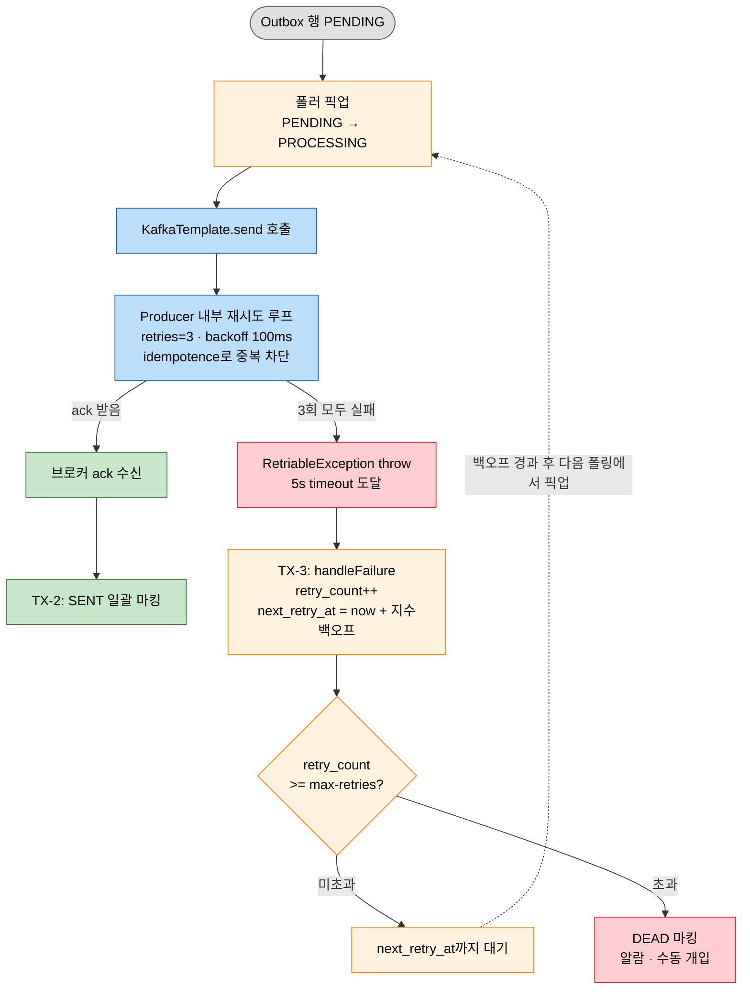

# Outbox 재시도 레이어 분리 — Kafka Producer retries vs DB Outbox retry

---

> **Outbox 패턴을 폴링 Relay로 구현하면 재시도가 의도적으로 두 레이어로 갈라진다.** 
>
> - Kafka Producer 클라이언트의 `retries=3`이 한 발행 호출 안에서 짧은 hiccup을 흡수하고, 그래도 끝내 실패한 이벤트는 DB outbox 행의 `retry_count`/`next_retry_at`에 박혀 다음 폴링 주기에 다시 시도된다. 
> - 두 레이어는 다른 시간 척도와 다른 영속성을 담당하며, 한쪽을 빼면 다른 쪽이 그 책임을 효율적으로 흡수하지 못한다. 본 문서는 이 분리가 왜 합리적인지, 그리고 어떤 시그널이 보일 때 단순화할 수 있는지를 정리한다.

상위 `05-03.Outbox`의 "재시도 지수 백오프" 절과 `05-04.Outbox 스케일링`의 TPS 적용 사례 박스에서 두 레이어가 동시에 등장하지만, 둘이 어떻게 책임을 나누는지는 본 문서에서 따로 다룬다.

## 1. 두 레이어의 정체성

두 재시도는 이름이 비슷해서 "이중 재시도"로 묶이기 쉽지만, 작동 위치·시간 척도·영속성·실패 회복 모델이 모두 다르다.

| 구분 | Kafka Producer `retries=3` | DB Outbox `OutboxRetryPolicy` |
|---|---|---|
| 작동 위치 | Producer 클라이언트 메모리 | DB 행의 `retry_count` + `next_retry_at` |
| 트리거 | `send()` 호출 직후 브로커가 retriable 예외 응답 | `send().get(5s)`이 최종 실패해 catch까지 도달 |
| 시간 척도 | ms 단위 (`retry.backoff.ms` 기본 100ms) | 초 ~ 분 ~ 시간 (지수 백오프) |
| 영속성 | 프로세스 메모리 — 죽으면 사라짐 | DB에 영속 — 재시작·인스턴스 교체 후에도 유지 |
| 다루는 실패 | 짧은 네트워크 hiccup, 리더 재선출, ISR 일시 부족 | 브로커 전체 다운, Schema Registry 다운, DNS 장애 |
| 중복 제거 | `enable.idempotence=true`의 PID + 시퀀스로 브로커가 거름 | 한 행이 SENT가 될 때까지 폴링됨 — Consumer 측 멱등성 필수 |
| 종착지 | 3회 실패 후 RetriableException throw | max-retries 초과 시 DEAD 마킹 (수동 개입) |

- 핵심은 "어디까지 실패가 흡수되는가"의 시간 경계가 다르다는 점이다. 한 호출 스택 안에서 끝낼 수 있는 실패는 메모리 레이어가, 호출 스택 밖으로 넘어가는 실패는 DB 레이어가 담당한다.

## 2. 한 호출 안에서 일어나는 일과 그 밖에서 일어나는 일

흐름을 그리면 두 시간 척도의 차이가 명확해진다.

- 실선은 모두 같은 호출 스택 안에서 즉시 일어난다. `KafkaTemplate.sen d().get(5s)` 한 줄 안에서 Producer가 1차 시도 → 실패 → 100ms 대기 → 2차 시도 → 실패 → 3차 시도까지 모두 끝낸다. catch에 도달했다는 것은 이 메모리 레이어 재시도가 모두 소진됐다는 뜻이다.

- 반면 점선은 시간 척도가 분 단위로 바뀌는 경계다. `next_retry_at`까지 폴러는 이 행을 잠시 잊어 두며, 그 사이 프로세스가 재시작되거나 폴러 인스턴스가 다른 노드로 옮겨가도 행은 그대로 살아 있다. 영속 레이어가 메모리 레이어로 흡수하지 못하는 영역을 책임지는 지점이 바로 이 점선이다.

## 3. 비용 비대칭 — 오버엔지니어링이 아닌 이유

>  "이중 재시도"라는 표현이 부담스럽게 들리지만, 두 레이어의 추가 비용은 비대칭이다. 같은 무게로 비교하면 잘못된 결론에 도달한다.

### 3.1 Kafka Producer retries=3의 비용

설정 3줄. `acks=all`, `retries`, `enable.idempotence` 트리오는 Spring Boot Kafka의 표준 신뢰성 설정이고, idempotence가 켜져 있으면 retries로 인한 메시지 중복도 브로커가 PID + 시퀀스로 걸러낸다. 인지 부담 거의 없음.

뺀다면? 모든 짧은 hiccup이 catch로 떨어져 DB UPDATE가 발생한다. 100ms짜리 리더 재선출에도 `retry_count++`가 일어나고 `next_retry_at` 백오프가 걸리므로, 실제로는 ms 단위에서 끝났을 회복이 분 단위로 늘어난다. DB 부하도 동시에 증가한다.

### 3.2 DB Outbox retry의 비용

진짜 복잡도가 발생하는 쪽이다. 테이블 컬럼(`retry_count`, `next_retry_at`, `status`), 폴러의 백오프 SELECT 조건, `OutboxRetryPolicy` 클래스, DEAD 마킹 후 수동 개입 절차까지 패키지로 따라온다.

다만 이 비용은 Outbox 패턴 자체를 채택한 시점에 이미 포함된 비용이다. 일시 실패에 대한 정책 없이 폴러를 돌릴 수는 없으므로, "Outbox는 채택하되 retry 정책은 빼자"는 선택지가 존재하지 않는다. 그러므로 이 레이어를 따로 떼어 비용을 평가하면 항상 과대평가된다.

### 3.3 사고실험으로 검증

두 레이어 중 하나를 뺀 세계를 상상하면 분리의 정당성이 더 분명해진다.

- **Kafka retries만 있고 Outbox가 없는 세계**: dual-write 문제로 돌아간다. 5s timeout 안에 못 끝나는 장애에서 메시지 손실이 발생하고, 프로세스 재시작 시 in-flight 컨텍스트가 증발한다. Outbox를 채택할 도메인 정합성 요구가 있는 한 이 세계는 선택지가 아니다.
- **Outbox만 있고 Kafka retries=0인 세계**: 짧은 hiccup도 catch → DB UPDATE → 백오프로 처리되어, 메모리에서 흡수됐을 회복이 분 단위로 늘어진다. 동시에 DB는 무의미한 UPDATE 부하를 떠안는다.
- **둘 다 있는 현재**: 짧은 실패는 메모리에서 흡수, 긴 실패는 DB로 영속. 각 레이어가 자기 시간 척도의 실패만 다룬다.

세 시나리오 중 현재 구조가 가장 비용 대비 가치가 높다. "이중"이라는 표현은 오해를 부르고, "두 시간 척도"라고 부르는 것이 정확하다.

## 4. 단순화 가능 지점 — 깎고 싶다면

> 복잡도가 거슬릴 때 깎을 수 있는 지점은 다음 순서로 평가한다. 운영 메트릭이 뒷받침되지 않은 단순화는 거의 항상 신뢰성 손실로 귀결된다.

### 4.1 DEAD 마킹 제거

`outboxMetrics.incrementDead()`가 운영 중 0건이 지속되면 max-retries 분기와 DEAD 마킹 코드는 죽은 코드일 가능성이 높다. 모든 실패가 결국 회복된다면 max-retries는 영원히 도달하지 않으며, DEAD 분기 자체가 코드와 운영 절차의 부담만 만든다. 단순화하면 무한 재시도 + 알람으로 대체 가능 — 큐 깊이가 일정 시간 임계 초과면 알람을 울리고, 실제 메시지는 지수 백오프로 무한히 시도한다. 부하는 약간 늘지만 분기 한 개와 운영 절차 한 개가 사라진다.

### 4.2 지수 백오프를 고정 간격으로

`OutboxRetryPolicy.nextRetryAt()`이 `now + 30s` 같은 고정값을 반환하도록 단순화한다. 회복 속도의 지수성을 잃지만 정책 코드와 SQL이 단순해진다. 트래픽 패턴이 단조롭고 회복 시간 분포가 좁다면 트레이드 가치가 있다.

### 4.3 Kafka retries 줄이기

`retries=3` → `retries=0`으로 바꾸면 메모리 레이어가 사라지고 모든 실패가 DB 레이어로 떨어진다. 이 단순화는 §3에서 다룬 비용 비대칭 때문에 거의 항상 손해다. retries=3을 빼서 얻는 비용 절감은 0에 가깝지만, 잃는 회복 속도는 분 단위로 측정된다.

### 4.4 Outbox 자체 제거

DB ↔ Kafka 정합성 요구 자체를 다시 평가한다. 도메인이 read-model 업데이트나 분석용 이벤트 정도라면 Outbox 없이 fire-and-forget이 더 적절할 수 있다. 가장 큰 변경이며, 단순한 코드 다이어트가 아니라 도메인 정합성 정책 변경이다.

## 5. 어떤 시그널이 보일 때 깎을지

> 운영 메트릭으로 단순화 시점을 판단한다. `05-03.Outbox`에서 도입한 4종 메트릭(`outbox.events.published/failed/dead`, `outbox.queue.pending`)을 그대로 활용한다.

| 메트릭 | 임계 신호 | 함의 |
|---|---|---|
| `outbox.events.dead` | 한 분기 0건 지속 | DEAD 분기가 죽은 코드일 가능성 — §4.1 검토 대상 |
| `outbox.events.failed` / `outbox.events.published` 비율 | 0.1% 미만 | 실패가 거의 없음 — 백오프 정책 단순화 후보 (§4.2) |
| 실패 이벤트의 `retry_count` 분포 | 1로 끝나는 비율이 압도적 | 메모리 레이어가 잘 흡수 중 — Kafka retries 효과 확인됨 |
| `outbox.queue.pending` 게이지 추세 | 지속 증가 | 폴러 처리량 부족 — `05-04.Outbox 스케일링` 항목으로 이동 |

위 메트릭들이 측정되지 않으면 단순화 결정도 측정되지 않은 추측이 된다. 단순화 전에 메트릭 수집부터 보장한다.

## 6. 외부 자료 비교 — 다른 시스템도 동일하게 분리한다

다른 폴링 Outbox 구현체와 공식 문서를 살펴봐도, 두 레이어가 분리된 형태가 표준이다.

- **Apache Kafka 공식 문서 — `enable.idempotence`**: idempotence가 켜져 있으면 retries로 인한 중복이 브로커에서 제거되며, retries는 idempotence와 묶여 한 단위로 평가된다는 설계가 명시된다. 즉 Producer retries는 그 자체로 안전한 흡수 메커니즘으로 정의된다. 출처: <https://kafka.apache.org/documentation/#producerconfigs_enable.idempotence>
- **eventuate-tram-events** (Chris Richardson, OSS): Producer 레벨 retry는 Kafka 클라이언트 기본값에 위임하고, framework 레벨에서 별도의 백오프와 max attempts를 둔다. 본 문서가 정리한 구조와 동일. 출처: <https://github.com/eventuate-tram/eventuate-tram-core>
- **Milan Jovanović "Outbox Pattern For Reliable Microservices Messaging"**: 폴링 Outbox에서 Producer retries는 "Kafka 클라이언트의 표준 신뢰성 설정"으로 짧게 언급되고, framework 레벨 재시도가 별도 항목으로 다뤄진다. 두 레이어를 합쳐 다루는 자료가 드물다는 사실 자체가 분리가 자연스러운 설계임을 시사한다. 출처: <https://www.milanjovanovic.tech/blog/outbox-pattern-for-reliable-microservices-messaging>

## 7. TPS 적용 사례

> `okestro/tps-gitlab2`

- **모듈/위치**: `message-lib/src/main/java/org/okestro/tps/messaging/application/outbox/OutboxPoller.java`(폴러 + handleFailure), `domain/outbox/OutboxRetryPolicy.java`(지수 백오프 + DEAD 판정), `config/KafkaDefaultsEnvironmentPostProcessor.java`(Producer 트리오 강제)
- **두 레이어 위치**: 메모리 레이어는 `KafkaDefaultsEnvironmentPostProcessor`가 강제하는 `acks=all` + `retries=3` + `enable.idempotence=true` 트리오. 영속 레이어는 `OutboxPoller.handleFailure()`가 별도 트랜잭션(TX-3..N)으로 처리하는 `OutboxRetryPolicy.nextRetryAt()` + `markAsDead()`.
- **경계 코드**: `OutboxPoller`의 `kafkaTemplate.send(record).get(5, TimeUnit.SECONDS)` 한 줄 안에서 메모리 레이어가 모두 끝난다. catch까지 흘러오면 `handleFailure(event)`로 영속 레이어 진입.
- **운영 시그널 확인 우선순위 (가설)**: TPS는 파이프라인 도메인이라 분당 수십~수백 건 수준의 트래픽으로 추정된다. 이 규모에서는 §4의 단순화 옵션 중 §4.1(DEAD 마킹 제거)이 가장 검토 가치가 클 가능성이 있다. `outbox.events.dead`가 한 분기 단위로 0건이면 검토 시작점.
- **상세 설계 의도**: 트랜잭션 분리(TX-1 / 비-TX / TX-2 / TX-3) 설계는 `OutboxPoller` 클래스 javadoc에 명시되어 있다. 패키지 구조와 자동 설정은 `message-lib/README.md` 참조.

## 8. 정리

Outbox 폴링 Relay에서 재시도가 두 레이어로 분리되는 것은 "이중 안전망"이 아니라 "두 시간 척도의 책임 분리"다. ms 단위 메모리 레이어와 분 단위 영속 레이어는 흡수하는 실패의 종류가 다르며, 한쪽을 빼면 다른 쪽이 그 책임을 효율적으로 흡수하지 못한다.

단순화는 "이중 재시도가 부담스러우니 한쪽을 빼자"가 아니라 "운영 메트릭이 특정 분기가 비활성임을 보여줄 때 그 분기만 빼자"의 순서로 접근한다. 메트릭 없이 깎으면 단순화가 아니라 신뢰성 손실이다.

## 관련 문서

- [05-03.Outbox](../04_ConsistencyPattern/04-03.Outbox.md) — 폴링 Relay 기본 구현, 트랜잭션 분리, 지수 백오프 SQL이 처음 등장하는 문서
- [05-04.Outbox 스케일링](../04_ConsistencyPattern/04-04.Outbox%20스케일링.md) — TPS 적용 사례 박스에서 두 레이어가 동시 언급되는 출발점
- [09-01.Outbox 변종 비교](09-01.Outbox%20변종%20비교.md) — 폴링이 아닌 다른 변종을 골랐을 때 재시도 레이어가 어떻게 달라지는지의 배경
