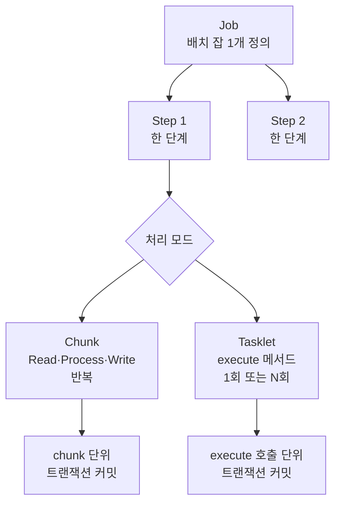

# Spring Batch 골격 — Job·Step·Chunk·Tasklet

---

> Spring Batch 5.x 의 핵심 구조는 *Job 안에 Step 이 있고, Step 안에서 Chunk 또는 Tasklet 으로 처리한다* 한 줄입니다. 본 편은 그 한 줄을 풀어 *각 계층이 무엇을 책임지는지, 트랜잭션 경계가 어디인지, Chunk 와 Tasklet 이 언제 갈리는지* 를 정리합니다. 다음 편부터 등장하는 ItemReader 3종·메타테이블·재시작·병렬 처리는 모두 본 골격 위에 올라갑니다.


## 한 장으로 보는 도메인 모델

Spring Batch 가 다루는 단위는 세 계층입니다. *Job → Step → (Chunk 반복 또는 Tasklet 실행)* 입니다.



Job 은 *언제 끝나는가* 까지 포함한 1개 배치 잡의 정의입니다. Step 은 그 잡 안의 단계 하나입니다. Step 한 개 안에서 처리 모델이 두 갈래로 갈립니다. 데이터를 읽어 변환하고 쓰는 반복 작업이면 **Chunk** 모델, 그렇지 않은 단일 작업이면 **Tasklet** 모델입니다.


## Job — 배치 잡의 정의

> Job 은 *잡의 골격* 입니다. 어떤 Step 들이 어떤 순서로 실행되는지, 첫 Step 이 실패하면 어디로 갈지를 담습니다. JobBuilder 로 만듭니다.

Spring Batch 5.x 에서 Job 은 다음처럼 선언합니다.

```java
@Configuration
public class MyJobConfig {

    @Bean
    public Job personJob(JobRepository jobRepository,
                         PlatformTransactionManager txManager,
                         ItemReader<Person> reader,
                         ItemWriter<Person> writer) {
        return new JobBuilder("personJob", jobRepository)
                .start(personStep(jobRepository, txManager, reader, writer))
                .build();
    }

    @Bean
    public Step personStep(JobRepository jobRepository,
                           PlatformTransactionManager txManager,
                           ItemReader<Person> reader,
                           ItemWriter<Person> writer) {
        return new StepBuilder("personStep", jobRepository)
                .<Person, Person>chunk(200, txManager)
                .reader(reader)
                .writer(writer)
                .build();
    }
}
```

`JobBuilder` 가 받는 인자는 *이름* 과 `JobRepository` 두 개입니다. 이름은 `JobInstance` 의 식별자에 들어가고 (자세한 모델은 `01-03` 에서), `JobRepository` 는 잡의 메타데이터를 저장하는 인프라입니다. `start(Step)` 으로 첫 Step 을 지정하면 그 뒤로 `next(Step)` 또는 분기(`on("FAILED").to(...)`) 를 이어 붙일 수 있습니다.

JobLauncher 가 Job 을 실행하면 Spring Batch 는 `JobInstance` 를 생성하거나 기존 인스턴스를 찾고, 그 위에 새 `JobExecution` 을 만들어 Step 들을 차례로 돌립니다. *Job 자체에는 비즈니스 로직이 없습니다.* 비즈니스 로직은 Step 의 Chunk 또는 Tasklet 안에 있습니다.


## Step — 단계의 단위

> Step 은 *Job 안에서 실행되는 한 단계* 입니다. 한 Step 안에서 처리 모델이 결정됩니다. Chunk 또는 Tasklet 중 정확히 하나입니다.

`StepBuilder("name", jobRepository)` 가 출발점입니다. 그다음 `.chunk(...)` 를 부르면 Chunk Step 이 되고, `.tasklet(...)` 을 부르면 Tasklet Step 이 됩니다. 같은 Step 에 두 모드를 섞을 수 없습니다.

```java
// Chunk Step — 데이터 반복 처리
@Bean
public Step chunkStep(JobRepository jobRepository,
                      PlatformTransactionManager txManager,
                      ItemReader<String> reader,
                      ItemProcessor<String, String> processor,
                      ItemWriter<String> writer) {
    return new StepBuilder("chunkStep", jobRepository)
            .<String, String>chunk(100, txManager)
            .reader(reader)
            .processor(processor)
            .writer(writer)
            .build();
}

// Tasklet Step — 단일 작업
@Bean
public Step taskletStep(JobRepository jobRepository,
                        PlatformTransactionManager txManager) {
    return new StepBuilder("taskletStep", jobRepository)
            .tasklet((contribution, chunkContext) -> {
                JobParameters params = chunkContext.getStepContext()
                        .getStepExecution().getJobParameters();
                String inputFile = params.getString("inputFile");
                // 단일 작업 수행
                return RepeatStatus.FINISHED;
            }, txManager)
            .build();
}
```

Step 마다 `PlatformTransactionManager` 를 따로 받습니다. 트랜잭션 경계는 *Step 전체* 가 아니라 *Step 안의 처리 모델 단위* 라는 점이 중요합니다. Chunk Step 은 chunk 한 묶음마다 커밋하고, Tasklet Step 은 `execute` 호출 한 번이 한 트랜잭션입니다.


## Chunk — Read·Process·Write 의 반복

> Chunk 모델은 *한 번에 한 건씩 읽어 모았다가, 모인 묶음을 한 번에 처리·쓰기* 합니다. 트랜잭션은 *묶음 단위* 입니다.

내부 동작은 다음 pseudo-code 와 같습니다 (Spring Batch 5.x 공식 문서 인용).

```java
// commit-interval = chunk size
List items = new ArrayList();
for (int i = 0; i < commitInterval; i++) {
    Object item = itemReader.read();
    if (item != null) {
        items.add(item);
    }
}

List processedItems = new ArrayList();
for (Object item : items) {
    Object processedItem = itemProcessor.process(item);
    if (processedItem != null) {
        processedItems.add(processedItem);
    }
}

itemWriter.write(processedItems);
```

Reader 가 N 건을 한 건씩 읽어 리스트에 모읍니다. Processor 는 그 리스트의 각 건을 변환합니다 (Processor 는 선택입니다 — 없으면 Reader 가 읽은 것이 그대로 Writer 로 갑니다). Writer 는 변환된 리스트를 한 번에 받아 씁니다. **이 한 사이클이 한 트랜잭션** 입니다. Writer 의 `write` 가 끝나면 커밋, 도중 예외가 나면 롤백입니다.

`chunk(100, txManager)` 의 `100` 이 *commit interval* 입니다. 100건씩 묶어 커밋한다는 뜻이지, 100건씩 한 번에 읽는다는 뜻이 아닙니다. 읽기는 항상 한 건씩입니다.

> 왜 묶어 커밋합니까? 1건마다 커밋하면 트랜잭션 오버헤드 (commit fsync·로그 기록) 가 폭증합니다. 100만 건이면 100만 번 커밋입니다. 반대로 한 트랜잭션에 전부 담으면 중간 실패 시 100만 건이 통째로 롤백됩니다. 그래서 *중간 묶음 단위로 커밋* 하는 chunk 모델이 디폴트가 됐습니다. 묶음 크기 = 처리량과 실패 영향 범위의 트레이드오프입니다.

Chunk Step 에는 `faultTolerant()` 를 붙여 skip·retry 정책을 추가할 수 있습니다. 자세한 내용은 `01-04` 의 멱등 Step 설계에서 다시 다룹니다.


## Tasklet — 단일 작업

> Tasklet 은 *한 번 또는 N 번 호출* 되는 `execute` 메서드 하나입니다. Reader·Processor·Writer 가 없습니다. 저장 프로시저 호출, 임시 파일 정리, 외부 명령 실행 같은 *단일 동작* 에 씁니다.

`Tasklet` 인터페이스는 메서드 한 개입니다.

```java
public interface Tasklet {
    RepeatStatus execute(StepContribution contribution,
                         ChunkContext chunkContext) throws Exception;
}
```

리턴값이 `RepeatStatus.FINISHED` 면 Step 이 끝나고, `RepeatStatus.CONTINUABLE` 이면 다시 호출합니다. 예외를 던지면 Step 이 실패 상태로 끝납니다. **`execute` 호출 한 번이 한 트랜잭션** 입니다. `CONTINUABLE` 로 반복하면 호출마다 별개 트랜잭션이 새로 시작합니다.

```java
@Bean
public Step cleanupStep(JobRepository jobRepository,
                        PlatformTransactionManager txManager) {
    return new StepBuilder("cleanupStep", jobRepository)
            .tasklet((contribution, chunkContext) -> {
                Files.deleteIfExists(Path.of("/tmp/last-run.lock"));
                return RepeatStatus.FINISHED;
            }, txManager)
            .build();
}
```

이런 작업에 Chunk 모델을 쓰면 *읽을 게 없는 Reader* 와 *쓸 게 없는 Writer* 를 억지로 만들어야 합니다. Tasklet 이 더 자연스럽습니다.


## Chunk 인가 Tasklet 인가 — 선택 기준

> 다음 세 가지 질문 중 한 개라도 *예* 면 Chunk, 모두 *아니오* 면 Tasklet 입니다.

1. *입력이 컬렉션·스트림 형태로 여러 건* 인가? (예: 파일의 N 줄, 테이블의 N 행, 큐의 N 메시지)
2. *각 건마다 같은 변환 또는 쓰기 동작* 이 반복되는가?
3. *중간 묶음 단위로 커밋해 부분 진행을 보존* 하고 싶은가?

세 질문 모두 *예* 인 전형적 케이스가 *CSV 파일을 한 줄씩 읽어 DB 에 INSERT* 같은 ETL 입니다. *아니오* 인 전형적 케이스가 *스토어드 프로시저 1회 호출* 또는 *S3 디렉토리 정리* 같은 단일 작업입니다.

| 기준 | Chunk | Tasklet |
|------|-------|---------|
| 입력 형태 | 컬렉션·스트림 (N 건) | 단일 동작 또는 명령 |
| 처리 패턴 | Read → Process → Write 반복 | `execute` 1회 또는 N회 |
| 트랜잭션 경계 | chunk 묶음 1개 | `execute` 호출 1회 |
| 부분 진행 보존 | 묶음 단위로 커밋되어 보존 | 호출 1회가 통째로 커밋·롤백 |
| 적합한 예 | CSV → DB, DB → S3, 메시지 큐 → DB | SP 호출, 파일 정리, 외부 API 1회 호출 |

> *Chunk 를 Tasklet 안에서 흉내* 내고 싶을 수 있지만 권하지 않습니다. Spring Batch 의 retry·skip·메타데이터 (`readCount`, `writeCount`, `commitCount`) 는 Chunk 모델 위에서만 동작합니다. Tasklet 안에 직접 루프를 짜면 그 카운터가 채워지지 않고, 재시작 시 처음부터 다시 돕니다. 입력이 N 건이면 Chunk 가 답입니다.


## 한 잡 안에 여러 Step

> 한 Job 은 보통 *여러 Step* 으로 구성됩니다. 순차 실행과 조건부 분기가 가능합니다.

```java
@Bean
public Job migrationJob(JobRepository jobRepository,
                        Step extractStep,
                        Step transformStep,
                        Step loadStep) {
    return new JobBuilder("migrationJob", jobRepository)
            .start(extractStep)
            .next(transformStep)
            .next(loadStep)
            .build();
}
```

세 Step 이 순서대로 돕니다. 한 Step 이 실패하면 다음 Step 으로 가지 않고 Job 이 실패합니다. *재시작* 하면 실패한 Step 부터 (또는 그 Step 의 마지막 커밋 시점부터) 다시 시작합니다. 이 동작은 `JobRepository` 가 메타테이블에 *어디까지 했는지* 를 기록해 둔 덕분입니다. 자세한 내용은 `01-03`·`01-04` 에서 다룹니다.

조건부 분기는 다음처럼 씁니다.

```java
.start(stepA)
.on("FAILED").to(stepFailureHandler)
.from(stepA).on("*").to(stepB)
.end()
```

`stepA` 가 FAILED 면 `stepFailureHandler` 로, 그 외 모든 ExitStatus 면 `stepB` 로 갑니다. ExitStatus 와 BatchStatus 의 차이는 `01-03` 에서 다룹니다.


## 관련 문서

- [`./README.md`](./README.md) — 본 시리즈 진입점. 9편 학습 순서와 경계 기준
- [`../theory/03-01.배치 처리.md`](../theory/03-01.배치%20처리.md) — 이론 측. *왜 배치가 가치 있는가*, MapReduce·Shuffle 같은 일반 메커니즘. Spring Batch 로 들어오기 전 한 번 읽으면 *chunk 모델이 왜 이렇게 설계됐는지* 가 자연스럽게 이어집니다
- [`../jpa/04-01.스프링 트랜잭션.md`](../jpa/04-01.스프링%20트랜잭션.md) — chunk 트랜잭션 경계가 어떻게 동작하는지의 토대. `PlatformTransactionManager` 와 트랜잭션 전파 규칙을 모르면 chunk 의 *묶음 단위 커밋·롤백* 설명이 추상적으로 남습니다
- [`../../11_spring/05_aop/01-02.스프링 스케줄링 — @Scheduled에서 Quartz까지.md`](../../11_spring/05_aop/01-02.스프링%20스케줄링%20—%20%40Scheduled에서%20Quartz까지.md) — Job 을 *언제 띄울 것인가* 의 일반 스케줄링 측면. Spring Batch 의 운영 인프라는 본 시리즈 `01-07` 에서 따로 다룹니다
