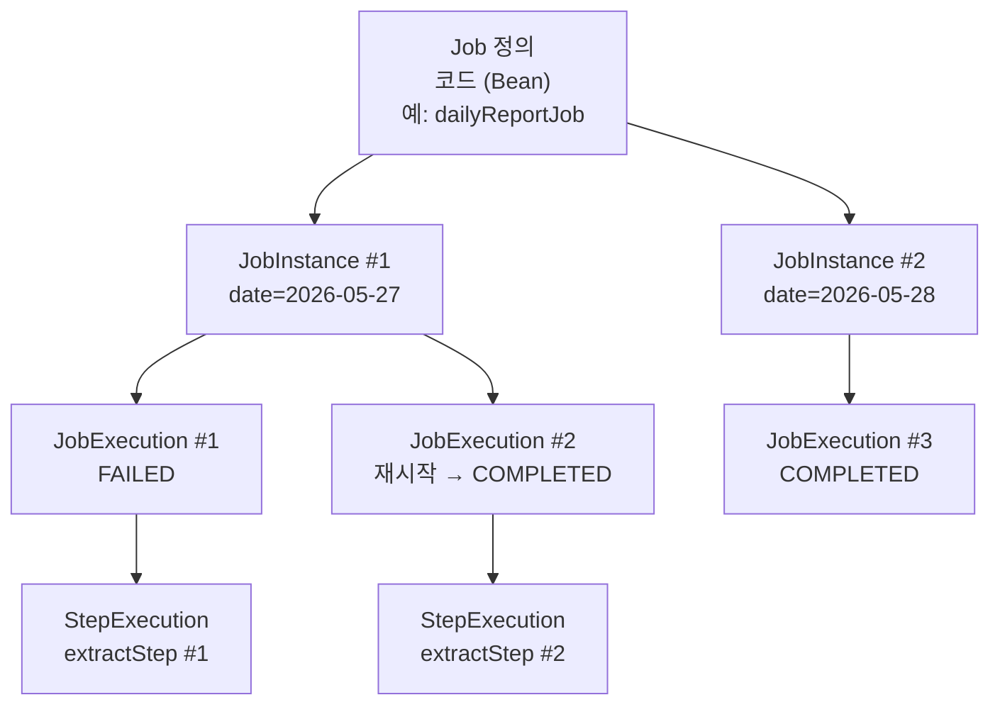

# JobRepository와 메타테이블 — JobInstance·JobExecution·StepExecution

---

> Spring Batch 가 *실패 추적·재실행·중복 방지* 같은 운영 기능을 가질 수 있는 이유는 *모든 잡 실행을 메타테이블에 기록* 하기 때문입니다. 본 편은 그 메타 모델을 정리합니다. JobInstance·JobExecution·StepExecution 의 3계층 관계, 6개 테이블의 책임, BatchStatus 와 ExitStatus 의 차이, 그리고 *같은 JobParameters 로 두 번 실행하면 왜 막히는가* 의 동작 원리까지 봅니다.


## JobRepository 가 무엇을 하는가

> JobRepository 는 *잡의 메타데이터를 저장하는 인터페이스* 입니다. JobLauncher 가 Job 을 실행할 때, Step 이 chunk 를 커밋할 때, 모두 JobRepository 를 통해 메타테이블에 기록합니다.

`JobBuilder` 와 `StepBuilder` 가 첫 인자로 받는 `JobRepository` 가 바로 그 인터페이스입니다. Spring Boot 와 함께 쓰면 `BATCH_*` 테이블 6개가 자동 생성되고 `JobRepository` 빈도 자동 구성됩니다. 직접 설정해야 한다면 `@EnableBatchProcessing` 또는 `DefaultBatchConfiguration` 을 상속해 DataSource·PlatformTransactionManager 를 명시합니다.

JobRepository 의 *물리적 저장소* 는 보통 RDBMS 입니다. 인메모리 (Map 기반) 구현체도 있지만 운영에서는 안 씁니다. **메타테이블이 사라지면 재시작이 불가능합니다.** 잡이 어디까지 갔는지 모르기 때문입니다. 그래서 *애플리케이션 DB 와 같은 인스턴스* 에 두는 것이 일반적입니다. 같은 DataSource·같은 트랜잭션 매니저 안에서 *비즈니스 데이터 커밋과 메타데이터 커밋이 한 트랜잭션에 묶이게* 하기 위함입니다.


## 3계층 모델 — JobInstance·JobExecution·StepExecution

> 한 줄로 정리하면 *Job 정의는 코드, JobInstance 는 한 번의 논리적 잡, JobExecution 은 한 번의 실행 시도, StepExecution 은 그 시도 안의 Step 한 번* 입니다.



위 예시는 *일일 리포트 잡* 입니다. *2026-05-27* 분 인스턴스가 한 번 실패해 두 번째 실행 시도로 성공했고, *2026-05-28* 분 인스턴스는 한 번에 성공했습니다.

**Job 정의** 는 코드 (Bean) 입니다. 같은 Job 정의로 여러 JobInstance 가 만들어집니다.

**JobInstance** 는 *논리적인 한 번의 잡* 입니다. 식별자는 `(JOB_NAME, JOB_KEY)` 조합이며, JOB_KEY 는 *식별 가능한 JobParameters* 의 해시입니다. **같은 JOB_NAME + 같은 식별 JobParameters 로는 같은 JobInstance 가 재사용됩니다.** 일일 리포트 잡을 `date=2026-05-28` 파라미터로 두 번 실행해도 JobInstance 는 한 개입니다.

**JobExecution** 은 *한 번의 실행 시도* 입니다. JobInstance 1개에 여러 JobExecution 이 붙을 수 있습니다 (실패 → 재시작 시 새 JobExecution). 시작·종료 시각, BatchStatus, ExitStatus 가 여기에 기록됩니다.

**StepExecution** 은 *한 JobExecution 안의 Step 한 번* 입니다. readCount·writeCount·filterCount·commitCount 같은 운영 카운터가 여기에 쌓입니다.


## 식별 vs 비식별 JobParameters

> JobInstance 가 재사용될지 여부는 *JobParameters 중 어떤 것을 식별자로 포함했는지* 가 결정합니다.

JobParameters 의 각 파라미터는 *식별자 (identifying)* 또는 *비식별자 (non-identifying)* 입니다. 식별 파라미터들의 해시가 JOB_KEY 가 됩니다.

```java
JobParameters params = new JobParametersBuilder()
        .addString("date", "2026-05-28")             // 식별 (디폴트)
        .addString("runMode", "dryRun", false)       // 비식별
        .toJobParameters();
```

세 번째 인자 `false` 가 *비식별* 표시입니다. `runMode` 를 바꿔도 *같은 날짜의 같은 JobInstance* 로 인식됩니다. 반대로 `date` 를 바꾸면 *새 JobInstance* 입니다.

이 설계가 *중복 실행 방지* 의 토대입니다. *완료된 JobInstance 를 같은 파라미터로 다시 실행하면 `JobInstanceAlreadyCompleteException`* 이 던져집니다. 일일 리포트 잡을 같은 날짜로 두 번 돌릴 수 없는 안전장치입니다.

> 자주 막히는 함정: 매 실행마다 *현재 시각* 을 식별 파라미터로 넣으면 *항상 새 JobInstance* 가 됩니다. *재실행 불가* 라는 보호가 무의미해집니다. 식별 파라미터는 *그 잡의 의미상 단위* (예: `date`, `tenantId`, `cohortId`) 만 담아야 합니다.


## 6개 메타테이블 — 책임과 관계

> Spring Batch 5.x 의 메타테이블은 6개입니다. 3개는 *잡 메타* (instance + execution + execution_context), 2개는 *Step 메타*, 1개는 *JobParameters 저장* 입니다.

```
BATCH_JOB_INSTANCE
  ├─ BATCH_JOB_EXECUTION (N개)
  │    ├─ BATCH_JOB_EXECUTION_PARAMS (N개)
  │    ├─ BATCH_JOB_EXECUTION_CONTEXT (1개)
  │    └─ BATCH_STEP_EXECUTION (N개)
  │         └─ BATCH_STEP_EXECUTION_CONTEXT (1개)
```

| 테이블 | 책임 | 핵심 컬럼 |
|--------|------|----------|
| `BATCH_JOB_INSTANCE` | JobInstance 의 식별자 보관 | JOB_INSTANCE_ID, JOB_NAME, JOB_KEY |
| `BATCH_JOB_EXECUTION` | JobExecution 의 실행 시도 1건 | JOB_EXECUTION_ID, STATUS, EXIT_CODE, CREATE_TIME, START_TIME, END_TIME |
| `BATCH_JOB_EXECUTION_PARAMS` | JobExecution 의 JobParameters 값 | JOB_EXECUTION_ID, PARAMETER_NAME, PARAMETER_TYPE, PARAMETER_VALUE, IDENTIFYING |
| `BATCH_JOB_EXECUTION_CONTEXT` | JobExecution 의 키-값 컨텍스트 (재시작용) | JOB_EXECUTION_ID, SHORT_CONTEXT, SERIALIZED_CONTEXT |
| `BATCH_STEP_EXECUTION` | StepExecution 의 통계와 상태 | STEP_EXECUTION_ID, STEP_NAME, STATUS, READ_COUNT, WRITE_COUNT, FILTER_COUNT, COMMIT_COUNT, ROLLBACK_COUNT, EXIT_CODE |
| `BATCH_STEP_EXECUTION_CONTEXT` | StepExecution 의 키-값 컨텍스트 (재시작용) | STEP_EXECUTION_ID, SHORT_CONTEXT, SERIALIZED_CONTEXT |

### BATCH_JOB_INSTANCE — 한 줄짜리 식별자 테이블

```sql
CREATE TABLE BATCH_JOB_INSTANCE (
    JOB_INSTANCE_ID BIGINT PRIMARY KEY,
    VERSION         BIGINT,
    JOB_NAME        VARCHAR(100) NOT NULL,
    JOB_KEY         VARCHAR(32)  NOT NULL,
    UNIQUE (JOB_NAME, JOB_KEY)
);
```

`UNIQUE (JOB_NAME, JOB_KEY)` 가 *같은 잡 + 같은 식별 파라미터 = 같은 JobInstance* 라는 규칙을 DB 수준에서 강제합니다.

### BATCH_STEP_EXECUTION — 운영의 진실 공급원

```sql
CREATE TABLE BATCH_STEP_EXECUTION (
    STEP_EXECUTION_ID BIGINT PRIMARY KEY,
    STEP_NAME         VARCHAR(100) NOT NULL,
    JOB_EXECUTION_ID  BIGINT NOT NULL,
    STATUS            VARCHAR(10),
    COMMIT_COUNT      BIGINT,
    READ_COUNT        BIGINT,
    FILTER_COUNT      BIGINT,
    WRITE_COUNT       BIGINT,
    READ_SKIP_COUNT   BIGINT,
    WRITE_SKIP_COUNT  BIGINT,
    PROCESS_SKIP_COUNT BIGINT,
    ROLLBACK_COUNT    BIGINT,
    EXIT_CODE         VARCHAR(20),
    EXIT_MESSAGE      VARCHAR(2500),
    -- ... 시각 컬럼들
    constraint JOB_EXECUTION_STEP_FK foreign key (JOB_EXECUTION_ID)
    references BATCH_JOB_EXECUTION(JOB_EXECUTION_ID)
);
```

운영 시 *어디서 무엇이 멈췄는지* 를 가장 먼저 보는 테이블입니다. `READ_COUNT - WRITE_COUNT - FILTER_COUNT - ?_SKIP_COUNT` 의 차이로 *예상치 못한 누락* 을 찾아냅니다.

### EXECUTION_CONTEXT 두 개

`BATCH_JOB_EXECUTION_CONTEXT` 와 `BATCH_STEP_EXECUTION_CONTEXT` 는 *재시작용 키-값 저장소* 입니다. `ItemStream.update(ctx)` 가 호출되면 chunk 커밋 직전 *현재 진행 위치* 가 여기에 직렬화돼 들어갑니다. 재시작 시 `ItemStream.open(ctx)` 가 같은 컨텍스트를 꺼내 *마지막 커밋 지점부터* 복구합니다. 상세 메커니즘은 `01-04` 에서 다룹니다.

`SHORT_CONTEXT` 는 가벼운 키-값을, `SERIALIZED_CONTEXT` (CLOB) 는 큰 객체 시리얼라이제이션을 보관합니다.


## BatchStatus 와 ExitStatus 의 차이

> 둘 다 잡·Step 의 *끝났을 때의 상태* 를 나타내지만 *층위가 다릅니다*.

**BatchStatus** 는 enum 이며 *Spring Batch 가 내부적으로 사용하는 상태* 입니다.

```
STARTING → STARTED → STOPPING → STOPPED
              ↓
          COMPLETED | FAILED | ABANDONED
```

| 값 | 의미 |
|----|------|
| `STARTING` | JobExecution 생성됐지만 아직 시작 전 |
| `STARTED` | 실행 중 |
| `STOPPING` | 외부에서 정지 요청 받은 상태 |
| `STOPPED` | 정지 완료 |
| `COMPLETED` | 정상 종료 |
| `FAILED` | 예외로 종료 |
| `ABANDONED` | 중단된 상태로 *재시작 대상에서 제외* 표시 |

**ExitStatus** 는 *Flow 분기 조건에 쓰이는 라벨* 입니다. 기본값은 `COMPLETED`, `FAILED`, `STOPPED`, `EXECUTING`, `NOOP` 이며 *문자열로 커스텀 라벨* 을 만들어 분기에 쓸 수 있습니다.

```java
return new JobBuilder("flowJob", jobRepository)
        .start(stepA)
        .on("FAILED").to(failureHandler)
        .from(stepA).on("COMPLETED WITH WARNING").to(reviewStep)
        .from(stepA).on("*").to(stepB)
        .end()
        .build();
}
```

위에서 `"COMPLETED WITH WARNING"` 은 *커스텀 ExitStatus* 입니다. StepExecutionListener 의 `afterStep` 에서 *커스텀 ExitStatus 를 리턴* 하면 분기가 그 라벨로 이동합니다. **BatchStatus 는 내부 enum, ExitStatus 는 분기용 라벨이라는 책임 분리** 가 핵심입니다.


## 재시작이 가능한 조건

> JobExecution 의 BatchStatus 가 *FAILED* 또는 *STOPPED* 일 때만 같은 JobInstance 로 새 JobExecution 을 띄울 수 있습니다.

`COMPLETED` 인 JobInstance 를 다시 실행하면 `JobInstanceAlreadyCompleteException` 이 던져집니다. *같은 JobInstance 를 의도적으로 다시 돌려야* 한다면 두 길이 있습니다.

1. *다른 식별 JobParameters* 로 새 JobInstance 를 만든다 (예: `runId` 라는 식별 파라미터를 매번 증가)
2. 기존 JobExecution 의 상태를 *ABANDONED* 로 표시해 *재시작 대상에서 빼고* 새로 시작 (운영 도구 사용)

`ABANDONED` 는 *재시작이 불가능한 종료* 를 표시하는 라벨입니다. 보통은 *부분적으로 실패했지만 수동 복구가 끝나* 새로 시작해야 하는 자리에서 씁니다.


## 코드로 메타데이터 접근

> JobRepository 를 통해 메타데이터를 프로그램적으로 조회할 수 있습니다. 운영 대시보드·정합성 검증·외부 시스템 동기화에 쓰입니다.

```java
JobExecution jobExecution = jobRepository.getJobExecution(executionId);

BatchStatus status = jobExecution.getStatus();
ExitStatus exitStatus = jobExecution.getExitStatus();
LocalDateTime startTime = jobExecution.getStartTime();
LocalDateTime endTime = jobExecution.getEndTime();
JobParameters parameters = jobExecution.getJobParameters();
ExecutionContext context = jobExecution.getExecutionContext();
List<Throwable> failures = jobExecution.getFailureExceptions();

for (StepExecution stepExecution : jobExecution.getStepExecutions()) {
    System.out.printf("Step: %s%n", stepExecution.getStepName());
    System.out.printf("  Read: %d, Write: %d, Filter: %d, Skip: %d%n",
            stepExecution.getReadCount(),
            stepExecution.getWriteCount(),
            stepExecution.getFilterCount(),
            stepExecution.getReadSkipCount()
                    + stepExecution.getWriteSkipCount()
                    + stepExecution.getProcessSkipCount());
    System.out.printf("  Commit: %d, Rollback: %d%n",
            stepExecution.getCommitCount(),
            stepExecution.getRollbackCount());
}
```

`JobExplorer` 인터페이스는 *읽기 전용* 으로 같은 데이터를 노출합니다. 메타데이터를 *쓰지 않고 보기만* 한다면 `JobExplorer` 가 더 적합합니다 (예: 모니터링 대시보드).


## 메타테이블 운영 주의점

운영 환경에서 메타테이블 관리는 몇 가지 정해진 패턴이 있습니다.

**보관 정책** — `BATCH_JOB_EXECUTION_CONTEXT` 와 `BATCH_STEP_EXECUTION_CONTEXT` 가 시간에 따라 커집니다. 잡이 자주 도는 환경에서 *수개월 분 메타데이터* 를 그대로 두면 테이블 크기가 부풀어 조회가 느려집니다. *완료된 N 일 이전 JobExecution 을 주기적으로 삭제* 하는 운영 잡을 따로 둡니다. 외래 키 cascade 가 없으므로 *자식 테이블부터 역순으로* 삭제합니다.

**DataSource 분리 여부** — *비즈니스 DB 와 같은 인스턴스* 가 일반적입니다. 같은 트랜잭션에 메타데이터 커밋이 묶여야 *부분 실패 시 데이터 정합성* 이 깨지지 않기 때문입니다. *별도 인스턴스* 로 분리하면 잡 실행 중 메타 DB 장애 시 비즈니스 트랜잭션이 영향받습니다.

**스키마 초기화** — Spring Boot 자동 구성은 `spring.batch.jdbc.initialize-schema` 가 `embedded` (디폴트) 일 때만 자동 DDL 실행합니다. 운영 RDBMS 에서는 `never` 로 두고 *명시적 마이그레이션 도구* (Flyway, Liquibase) 로 관리합니다.


## 관련 문서

- [`./README.md`](./README.md) — 본 시리즈 진입점. 9편 학습 순서와 경계 기준
- [`./01-01.Spring Batch 골격 — Job·Step·Chunk·Tasklet.md`](01-01.Spring%20Batch%20골격%20—%20Job·Step·Chunk·Tasklet.md) — Job·Step 의 *코드 레벨* 정의. 본 편은 그 *실행 시 메타* 측면. 둘을 같이 봐야 *Job 빈 정의 1개에서 JobInstance·JobExecution 이 어떻게 갈라지는지* 가 한 그림에 잡힙니다
- [`./01-02.ItemReader·ItemProcessor·ItemWriter 3종 — 기본 구현체와 커스텀.md`](01-02.ItemReader·ItemProcessor·ItemWriter%203종%20—%20기본%20구현체와%20커스텀.md) — StepExecution 의 readCount·writeCount·filterCount 카운터는 본 편 Reader·Processor·Writer 가 채웁니다. ItemStream 의 `update` 가 `BATCH_STEP_EXECUTION_CONTEXT` 에 직렬화되는 경로를 같이 보면 운영 모델이 닫힙니다
- [`../jpa/04-01.스프링 트랜잭션.md`](../jpa/04-01.스프링%20트랜잭션.md) — JobRepository 가 메타테이블에 쓰는 트랜잭션은 *비즈니스 트랜잭션과 같은 PlatformTransactionManager* 를 공유합니다. 두 트랜잭션이 같이 묶이는 조건을 모르면 *왜 별도 DB 로 분리하면 안 되는가* 가 추상적으로 남습니다
