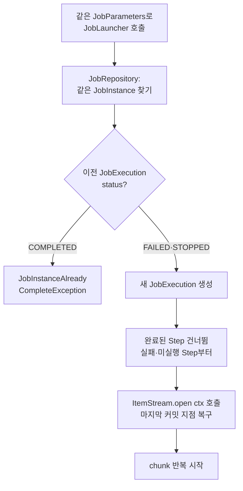

# 재시작과 Checkpoint — ExecutionContext·Restartable·idempotent Step

---

> Spring Batch 의 *재시작* 은 *마지막 chunk 커밋 시점부터 이어서 시작* 하는 기능입니다. 코드 한 줄 안 짜고 *자동으로* 되는 것처럼 보이지만 그 뒤에는 *ExecutionContext 직렬화*, *ItemStream open/update*, *chunk 트랜잭션 경계가 메타 커밋과 같이 묶이는 구조* 가 있습니다. 본 편은 그 구조를 따라가고, *재시작이 안 되는 함정 3가지* 와 *멱등 Step 설계 원칙* 까지 봅니다.


## 재시작이 풀고자 하는 문제

배치 잡이 실패하는 자리는 다양합니다. DB 연결 끊김, 외부 API 일시 장애, OOM, 디스크 부족. 한 가지 공통점은 *N 시간 동안 처리한 결과가 날아가면 안 된다* 는 운영 요구입니다. 100 만 건 처리 잡이 99 만 건째에서 실패했을 때 처음부터 다시 도는 건 받아들이기 어렵습니다.

배치의 본질적 답은 *입력이 불변이면 코드를 고쳐 다시 돌리면 된다* 입니다 ([`../theory/03-01.배치 처리.md`](../theory/03-01.배치%20처리.md) 의 Human Fault Tolerance 가 그 이야기). Spring Batch 가 더해주는 답은 *마지막 성공한 chunk 다음부터* 다시 시작입니다. 이 답이 가능한 이유는 *chunk 커밋과 메타데이터 커밋이 같은 트랜잭션* 이기 때문입니다.


## 재시작의 한 사이클

> 재시작은 *같은 JobInstance 의 새 JobExecution* 으로 시작합니다. JobRepository 가 *이전 JobExecution 의 StepExecution* 을 읽어 *마지막 커밋 지점* 을 알아냅니다.



핵심 분기 두 곳입니다. 첫째, *이전 실행이 COMPLETED 이면 재시작 자체가 막힙니다*. 둘째, *재시작 시 완료된 Step 은 자동으로 건너뜁니다*. 같은 잡 안 첫 Step 이 성공하고 두 번째 Step 에서 실패했다면 재시작 시 두 번째 Step 부터 돕니다.


## ExecutionContext — chunk 커밋 직전 직렬화

> ExecutionContext 는 *Map<String, Object> 같은 키-값 저장소* 입니다. ItemStream 의 `update` 가 chunk 커밋 직전 호출되어 *현재 진행 위치* 를 여기에 넣고, 그 직후 `BATCH_STEP_EXECUTION_CONTEXT` 테이블에 직렬화 저장됩니다.

```java
public class CustomItemReader<T> implements ItemReader<T>, ItemStream {
    private static final String CURRENT_INDEX = "current.index";
    private int currentIndex = 0;
    private List<T> items;

    @Override
    public T read() {
        if (currentIndex < items.size()) {
            return items.get(currentIndex++);
        }
        return null;
    }

    @Override
    public void open(ExecutionContext ctx) {
        if (ctx.containsKey(CURRENT_INDEX)) {
            currentIndex = (int) ctx.getLong(CURRENT_INDEX);
        }
    }

    @Override
    public void update(ExecutionContext ctx) {
        ctx.putLong(CURRENT_INDEX, currentIndex);
    }

    @Override
    public void close() {}
}
```

`open` 은 Step 시작 시 한 번 호출됩니다. 이전 실행의 `BATCH_STEP_EXECUTION_CONTEXT` 가 비어 있으면 (첫 실행) 키가 없고, 재시작이면 키가 있어 `currentIndex` 가 복구됩니다.

`update` 는 chunk 가 트랜잭션을 커밋하기 *직전* 호출됩니다. 컨텍스트 저장과 chunk 커밋이 *같은 트랜잭션* 에 들어 있어야 *둘 다 성공* 또는 *둘 다 롤백* 이 보장됩니다. 만약 컨텍스트 저장이 chunk 커밋 *후* 별도 트랜잭션으로 일어난다면, chunk 가 100 건 커밋된 직후 컨텍스트 저장이 실패할 때 재시작 시 같은 100 건이 다시 처리될 위험이 생깁니다.


## 기본 구현체가 자동으로 받쳐주는 이유

> `01-02` 에서 본 *기본 Reader 구현체* (`FlatFileItemReader`, `JdbcCursorItemReader`, `JpaPagingItemReader`, `KafkaItemReader` 등) 는 모두 *내부에서 ItemStream 을 구현* 합니다. 그래서 별도 코드 없이 재시작이 됩니다.

| 기본 구현체 | ExecutionContext 키 | 복구 메커니즘 |
|------------|-------------------|------------|
| `FlatFileItemReader` | `read.count` | 파일을 *처음부터* 다시 열고 N 줄 건너뜀 |
| `JdbcCursorItemReader` | `read.count` | 같은 SQL 다시 실행, N 행 fetch 후 시작 |
| `JdbcPagingItemReader` | `read.count`, page 번호 | 페이지 N 부터 SQL 재실행 |
| `KafkaItemReader` | 토픽-파티션별 offset | 컨슈머가 저장된 offset 부터 polling |

`JdbcCursorItemReader` 의 복구가 *N 행 fetch 후 시작* 이라는 점이 중요합니다. *재시작 시 같은 ORDER BY 순서가 보장되지 않으면* 다른 행을 N 번째로 인식해 잘못 건너뛸 수 있습니다. `01-02` 에서 *ORDER BY 가 재시작 일관성에 핵심* 이라고 한 이유입니다.

**커스텀 Reader 가 `ItemReader` 만 구현하고 `ItemStream` 을 빠뜨리면 재시작 시 처음부터 다시 돕니다.** Spring Batch 입장에서는 *어디까지 갔는지 모르는 Reader* 이기 때문입니다.


## allowStartIfComplete 와 startLimit

> 디폴트는 *Step 이 COMPLETED 면 재시작 시 건너뜀* 입니다. 두 설정으로 이 동작을 조정할 수 있습니다.

**`allowStartIfComplete(true)`** — Step 이 이전에 성공했어도 재시작 시 *항상 다시 실행* 합니다. *검증·정리·초기화* 같은 Step (예: 입력 디렉토리 비우기, 임시 테이블 생성) 에 씁니다.

```java
@Bean
public Step gameLoad(JobRepository jobRepository,
                     PlatformTransactionManager txManager) {
    return new StepBuilder("gameLoad", jobRepository)
            .allowStartIfComplete(true)
            .<String, String>chunk(10, txManager)
            .reader(gameFileItemReader())
            .writer(gameWriter())
            .build();
}
```

**`startLimit(N)`** — Step 을 *N 번까지만 실행 시도* 가능합니다. 디폴트는 `Integer.MAX_VALUE`. *반복 실패가 데이터를 손상시킬 수 있는* Step 에 *2~3 회* 같은 작은 값으로 보호막을 둡니다.

```java
@Bean
public Step playerSummarization(JobRepository jobRepository,
                                PlatformTransactionManager txManager) {
    return new StepBuilder("playerSummarization", jobRepository)
            .startLimit(2)
            .<String, String>chunk(10, txManager)
            .reader(playerSummarizationSource())
            .writer(summaryWriter())
            .build();
}
```

`startLimit` 을 초과하면 `StartLimitExceededException` 이 던져지고 잡이 실패합니다.


## Skip 과 Retry — fault-tolerant 정책

> 재시작과 다른 축으로 *chunk 도중 예외를 어떻게 다룰지* 가 있습니다. `.faultTolerant()` 를 켜고 *skip 할 예외*, *retry 할 예외*, *각각의 limit* 을 지정합니다.

```java
return new StepBuilder("step", jobRepository)
        .<String, String>chunk(100, txManager)
        .reader(reader)
        .processor(processor)
        .writer(writer)
        .faultTolerant()
        .skip(ValidationException.class)
        .skip(FlatFileParseException.class)
        .skipLimit(10)
        .retry(DeadlockLoserDataAccessException.class)
        .retryLimit(3)
        .build();
```

**Skip** — 지정된 예외가 발생하면 *그 건만 버리고 다음 건으로* 넘어갑니다. 누적이 `skipLimit` 을 넘으면 Step 이 실패합니다. *형식 오류 같은 입력 측 문제* 에 씁니다.

**Retry** — 지정된 예외가 발생하면 *같은 건을 N 번까지 재시도* 합니다. *일시적 장애* (데드락, 네트워크 일시 단절) 에 씁니다. retry 한 건이 성공하면 정상 진행, 모두 실패하면 (skip 정책에 걸리지 않는 한) Step 이 실패합니다.

**중요 차이** — skip 은 *그 건을 버리고* 가고, retry 는 *그 건을 다시* 합니다. 둘은 같이 쓸 수 있습니다. *3 번 retry 후에도 실패하면 skip* 같은 정책이 흔합니다.

### Skip 의 트랜잭션 영향

`.faultTolerant()` 가 켜진 chunk 에서 *Writer 가 예외를 던지면* 어떻게 될까. 답은 *그 chunk 의 트랜잭션이 롤백되고, Spring Batch 가 같은 items 를 한 건씩 다시 시도* 합니다. 어느 건에서 예외가 났는지 식별하기 위함입니다. 한 건씩 retry 한 결과 *그 건만 실패* 면 skip, *모두 실패* 면 chunk 전체 실패입니다.

이 동작이 *Writer 가 멱등하지 않으면* 문제를 키웁니다. 첫 시도에서 절반이 INSERT 됐는데 롤백되지 않은 외부 시스템 호출이 있다면, 한 건씩 retry 시 *이미 처리된 건을 다시 처리* 합니다. 멱등 설계가 그래서 필요합니다.


## Idempotent Step — 멱등 설계 원칙

> 멱등 (idempotent) 은 *같은 입력에 같은 결과* 라는 뜻입니다. *한 번 실행한 결과* 와 *두 번 실행한 결과* 가 같아야 합니다. 재시작·retry 가 *데이터를 망치지 않는* 보장입니다.

세 가지 자리에서 멱등성을 챙겨야 합니다.

**1. Writer 의 INSERT 는 *조건부 INSERT* 또는 *UPSERT*** — 단순 `INSERT` 는 두 번째 시도에서 *primary key conflict* 또는 *중복 데이터* 를 만듭니다. PostgreSQL 의 `INSERT ... ON CONFLICT DO NOTHING/UPDATE`, MySQL 의 `INSERT ... ON DUPLICATE KEY UPDATE` 같은 *멱등 INSERT* 가 답입니다. JPA 라면 `merge` 의 의미가 *조건부* 라 자연스럽지만 *id 가 비어있는 새 엔티티* 는 매번 INSERT 가 되므로 *id 를 입력 데이터에서 결정* 해야 멱등이 됩니다.

**2. 외부 API 호출은 *멱등 키* 동반** — Stripe·Toss 같은 결제 API 가 `Idempotency-Key` 헤더를 받는 이유가 여기입니다. 같은 키로 두 번 호출하면 *두 번째는 첫 번째의 결과를 그대로 리턴* 합니다. Spring Batch 의 retry 와 정확히 맞물립니다. 멱등 키는 *입력 데이터에서 결정 가능한 값* (예: `tradeId`) 로 두어야 재시작 시에도 같은 키가 나옵니다.

**3. 부수 효과 (파일 쓰기·이메일·이벤트 발행) 는 *조건부 또는 큐잉*** — *이미 한 일을 안 다시 하는* 체크 (예: 처리 완료 마커 테이블 조회) 또는 *외부 큐를 거쳐 dedup 컨슈머* 가 받게 합니다. Outbox 패턴이 정확히 이 자리에 맞습니다 ([`../../04_messaging/05_ConsistencyPattern/02-01.Outbox.md`](../../04_messaging/05_ConsistencyPattern/02-01.Outbox.md) 참조).


## 재시작이 안 되는 함정 3가지

운영에서 *재시작이 동작 안 한다* 는 신고는 보통 다음 셋 중 하나입니다.

**1. 커스텀 Reader 가 `ItemStream` 을 안 구현** — 가장 흔합니다. `01-02` 와 본 편에서 반복한 이야기. 외부 API 페이지네이션 Reader 를 짤 때 `ItemReader` 만 구현하고 `ItemStream` 을 빠뜨리면 재시작 시 첫 페이지부터 다시 시작합니다.

**2. JobParameters 에 *현재 시각* 포함** — `currentTime=System.currentTimeMillis()` 를 식별 파라미터로 넣으면 매번 새 JobInstance 가 됩니다. *같은 JobInstance 의 재시작* 이 아니라 *새 JobInstance 의 첫 실행* 이 되어 처음부터 다시 합니다. *시각* 은 비식별 파라미터로, 식별은 *그 잡의 의미 단위* (예: `targetDate`) 로 둡니다.

**3. `JobRepository` 가 메모리 기반** — 인메모리 Map 구현체로 *개발 환경에서만 쓰는* 형태. 애플리케이션이 죽으면 메타데이터가 사라져 재시작 자체가 불가능합니다. 운영 RDBMS 를 메타 저장소로 두지 않으면 *재시작* 이라는 기능 자체가 없는 셈입니다.


## 관련 문서

- [`./README.md`](./README.md) — 본 시리즈 진입점. 9편 학습 순서와 경계 기준
- [`./01-02.ItemReader·ItemProcessor·ItemWriter 3종 — 기본 구현체와 커스텀.md`](01-02.ItemReader·ItemProcessor·ItemWriter%203종%20—%20기본%20구현체와%20커스텀.md) — ItemStream 인터페이스의 *왜* 가 본 편의 *어떻게* 와 짝입니다. 부품의 인터페이스를 먼저 잡고 본 편을 읽으면 *open/update/close 가 누구를 받쳐주는지* 가 한 줄에 보입니다
- [`./01-03.JobRepository와 메타테이블 — JobInstance·JobExecution·StepExecution.md`](01-03.JobRepository와%20메타테이블%20—%20JobInstance·JobExecution·StepExecution.md) — `BATCH_STEP_EXECUTION_CONTEXT` 가 본 편의 *현재 진행 위치* 가 직렬화되는 자리. 메타테이블 구조를 먼저 잡으면 *왜 ExecutionContext 가 chunk 커밋 직전 update 되어야 하는지* 가 트랜잭션 그림으로 닫힙니다
- [`../../04_messaging/05_ConsistencyPattern/03-04.Exactly-once 의미론과 Consumer Idempotency.md`](../../04_messaging/05_ConsistencyPattern/03-04.Exactly-once%20의미론과%20Consumer%20Idempotency.md) — 멱등 Step 설계는 *Kafka Exactly-once* 와 같은 사고 모델에서 출발합니다. 분산 시스템에서 *재시도가 안 깨는 결과* 를 만드는 일반 원칙
