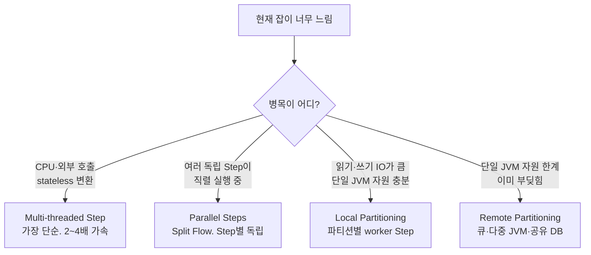

# Parallel·Partition Batch — TaskExecutor·PartitionStep·Remote Partitioning

---

> Chunk Step 한 개를 *직렬* 로 돌리면 100 만 건이 1 시간 걸립니다. 두 시간이면 *수직 확장 한계* 입니다. Spring Batch 는 같은 잡을 *병렬로 처리* 하는 네 가지 모델을 제공합니다. 단일 JVM 의 멀티스레드 Step, 여러 Step 의 동시 실행, 단일 JVM 의 파티셔닝, 다중 JVM 의 Remote Partitioning. 본 편은 *각 모델이 어떤 자리에 맞는지* 와 *선택 기준* 을 정리합니다.


## 네 가지 병렬 모델

> Spring Batch 공식 분류는 *single-process* 와 *multi-process* 두 갈래입니다. Single-process 안에 *multi-threaded step* 과 *parallel steps* 와 *partitioning* 셋, multi-process 에 *remote chunking* 과 *remote partitioning* 둘이 있습니다.

| 모델 | 프로세스 | 병렬 단위 | 인프라 요구 |
|------|---------|----------|-----------|
| Multi-threaded Step | 단일 JVM | 한 Step 안의 chunk | TaskExecutor 빈 |
| Parallel Steps (Split Flow) | 단일 JVM | 여러 Step 동시 | TaskExecutor 빈 |
| Partitioning (Local) | 단일 JVM | 데이터 파티션별 worker Step | TaskExecutor 빈 |
| Remote Chunking | 다중 JVM | chunk 단위 워커로 분산 | 메시지 큐 |
| Remote Partitioning | 다중 JVM | 파티션 단위 워커로 분산 | 메시지 큐 |

처음 세 모델은 *한 프로세스 안에서 끝* 입니다. 마지막 두 모델은 *Kafka·RabbitMQ 같은 메시지 큐* 를 인프라로 요구합니다. 자원 트레이드오프와 운영 복잡도가 다릅니다.


## Multi-threaded Step — 한 Step 안의 멀티스레드

> 가장 단순한 형태입니다. Step 한 개에 TaskExecutor 를 붙이면 *chunk 처리가 여러 스레드에서 동시* 진행됩니다.

```java
@Bean
public Step sampleStep(TaskExecutor taskExecutor,
                       JobRepository jobRepository,
                       PlatformTransactionManager txManager) {
    return new StepBuilder("sampleStep", jobRepository)
            .<String, String>chunk(10, txManager)
            .reader(itemReader())
            .writer(itemWriter())
            .taskExecutor(taskExecutor)
            .build();
}
```

이 모델의 *함정* 은 Reader·Writer 의 스레드 안전성입니다.

- **Reader 가 thread-safe 해야 함** — `FlatFileItemReader` 같은 *상태가 있는* Reader 는 thread-safe 가 아닙니다. 여러 스레드가 한 파일을 동시에 읽으면 같은 줄을 여러 번 읽거나 줄이 섞입니다. *SynchronizedItemStreamReader* 로 감싸거나 *원래 thread-safe 한 Reader* (예: 큐 폴링) 만 안전합니다.
- **Writer 의 멱등성** — 여러 스레드가 같은 chunk 묶음을 다른 순서로 커밋합니다. 외부 시스템 호출이 *호출 순서에 의존* 하면 결과가 비결정적입니다.
- **재시작 어려움** — 여러 스레드가 *어디까지 갔는지* 가 단일 `read.count` 로 표현 안 됩니다. 공식 문서는 *multi-threaded step 은 재시작 호환성을 일반적으로 보장하지 않는다* 고 명시합니다.

이 모델은 *단순한 변환·외부 호출 같은 stateless 한 chunk* 에 잘 맞습니다. 잡 시간을 *2~4 배* 줄이는 정도가 일반적 목표이며, 그 이상은 다른 모델이 답입니다.


## Parallel Steps — 여러 Step 동시 실행

> 한 잡 안의 *서로 의존이 없는* Step 들을 동시에 돌립니다. Split Flow 로 표현합니다.

```java
@Bean
public Job job(JobRepository jobRepository) {
    return new JobBuilder("job", jobRepository)
            .start(splitFlow())
            .next(step4())
            .build()
            .build();
}

@Bean
public Flow splitFlow() {
    return new FlowBuilder<SimpleFlow>("splitFlow")
            .split(taskExecutor())
            .add(flow1(), flow2())
            .build();
}

@Bean
public Flow flow1() {
    return new FlowBuilder<SimpleFlow>("flow1")
            .start(step1())
            .next(step2())
            .build();
}

@Bean
public Flow flow2() {
    return new FlowBuilder<SimpleFlow>("flow2")
            .start(step3())
            .build();
}
```

`step1 → step2` 와 `step3` 가 동시에 진행되고, 둘 다 끝난 후 `step4` 가 돕니다. *서로 다른 입력 소스를 읽는* Step 들 (예: *고객 파일 로딩* 과 *주문 파일 로딩*) 에 자연스럽게 맞습니다.

같은 데이터를 *나눠* 처리하는 형태는 아닙니다. 그 자리는 다음 *Partitioning* 입니다.


## Local Partitioning — 데이터 파티션별 worker Step

> 데이터를 *논리적 파티션* 으로 나누고, 각 파티션을 *같은 worker Step* 이 처리합니다. *master Step* 이 파티셔닝을 조율하고, *worker Step* 이 실제 데이터를 다룹니다.

```java
@Bean
public Step partitionedStep(JobRepository jobRepository,
                            Step workerStep,
                            Partitioner partitioner) {
    return new StepBuilder("partitionedStep", jobRepository)
            .partitioner("workerStep", partitioner)
            .step(workerStep)
            .gridSize(10)
            .taskExecutor(new SimpleAsyncTaskExecutor())
            .build();
}
```

- **`partitioner`** — 데이터를 N 개 파티션으로 나누는 로직. `Partitioner` 인터페이스의 `partition(int gridSize)` 가 *파티션별 ExecutionContext 맵* 을 리턴합니다.
- **`workerStep`** — 각 파티션을 처리할 Step. 같은 Step 정의가 N 번 실행됩니다.
- **`gridSize`** — 파티션 개수 (논리적 분할 수).
- **`taskExecutor`** — 파티션을 *동시 실행* 할 executor. 없으면 직렬.

### Partitioner 의 분할 방법

`Partitioner` 가 *데이터를 어떻게 나누는가* 는 도메인에 달려 있습니다. 일반적인 패턴 세 가지입니다.

**범위 분할** — PK 또는 id 범위를 균등하게 나눕니다.

```java
public class RangePartitioner implements Partitioner {
    @Override
    public Map<String, ExecutionContext> partition(int gridSize) {
        Map<String, ExecutionContext> map = new HashMap<>();
        long min = 1, max = 1_000_000;
        long range = (max - min) / gridSize + 1;
        for (int i = 0; i < gridSize; i++) {
            ExecutionContext ctx = new ExecutionContext();
            ctx.putLong("minId", min + i * range);
            ctx.putLong("maxId", min + (i + 1) * range - 1);
            map.put("partition" + i, ctx);
        }
        return map;
    }
}
```

각 worker Step 의 Reader 는 *해당 ExecutionContext 의 minId·maxId* 를 받아 *그 범위만* 읽습니다. `@StepScope` 와 `@Value("#{stepExecutionContext['minId']}")` 로 주입받습니다.

**파일 분할** — 입력 디렉토리의 파일 N 개를 각 파티션에 하나씩 할당. `MultiResourcePartitioner` 가 표준 구현체입니다.

**해시 분할** — 도메인 키 (예: `customerId`) 의 해시 mod gridSize 로 분할. 컨슈머 그룹의 파티션 배분과 같은 발상.

### 재시작과 파티셔닝

각 worker Step 은 *독립된 StepExecution* 을 가집니다. 한 파티션이 실패해도 *그 파티션만* 재시작 가능합니다. master Step 의 메타데이터가 *어느 worker 가 어디까지 했는지* 를 기록합니다.

이 모델은 *읽기·쓰기 IO 가 병목* 인 잡에 잘 맞습니다. *DB 한 테이블의 10 억 행* 을 *10 개 파티션* 으로 나눠 처리하면 *각 파티션이 다른 키 범위* 를 읽어 *경합 없이* 진행됩니다.


## Remote Partitioning — 다중 JVM 으로 확장

> Local Partitioning 의 *worker Step 들을 다른 JVM·다른 머신* 에 분산합니다. 메시지 큐를 통해 *master 가 파티션 메타데이터를 발행* 하고 *worker JVM 들이 받아 실행* 합니다.

기본 흐름은 다음과 같습니다.

1. master Step 이 `Partitioner` 로 파티션 N 개를 생성
2. 각 파티션 메타데이터를 *메시지 큐* 로 발행 (`outbound channel`)
3. worker JVM 들이 큐에서 메시지를 수신해 *각자 worker Step 실행*
4. worker 가 완료하면 결과를 *응답 큐* 로 발행 (`inbound channel`)
5. master 가 모든 worker 완료를 기다린 뒤 master Step 종료

인프라 요구는 명확합니다. ***durable 한 메시지 큐* 가 있어야 합니다.** 보통 Kafka·RabbitMQ. master 와 worker 가 *같은 메타테이블* (`BATCH_*`) 를 공유해야 worker 의 StepExecution 이 master 와 묶입니다. 즉 *공유 DB* 도 필수입니다.

이 모델은 *단일 JVM 의 리소스 한계* 에 부딪힐 때 답입니다. 100 GB 메모리, 64 vCPU 가 한 머신으로 안 나올 때 *10 개 머신에 각 10 GB 씩* 분산하면 됩니다. 운영 비용은 *큐·다중 JVM 배포·메타 DB 부하* 가 늘어납니다.


## Remote Chunking — 비교용 모델

> Remote Partitioning 과 헷갈리기 쉬운 *Remote Chunking* 이 따로 있습니다. 차이는 *워커가 무엇을 받는가* 입니다.

| 모델 | 워커가 받는 것 | 워커가 하는 일 |
|------|--------------|--------------|
| Remote Partitioning | *어디서 읽을지의 메타데이터* (예: id 범위) | Reader·Processor·Writer 모두 워커가 실행 |
| Remote Chunking | *이미 읽힌 items 묶음* | Processor·Writer 만 워커가 실행. Reader 는 master 에 |

Remote Chunking 은 *Processor·Writer 가 무거운 연산이고* *Reader 는 단일 머신에서 처리 가능* 한 자리에 맞습니다. *대량의 외부 API 호출* 같은 자리. 단점은 *master 가 모든 items 를 읽어 큐로 보내야* 해 *Reader 가 또 다른 병목* 이 될 수 있습니다.

대부분의 *데이터 양이 큰 문제* 는 Remote Partitioning 이 답입니다. Reader 도 분산되기 때문입니다.


## 선택 기준 — 4가지 모델 중 어느 것

> 답은 *문제의 병목이 어디인가* 와 *인프라 복잡도를 어디까지 받아들일 수 있는가* 입니다.



세 가지 추가 고려사항입니다.

**재시작 보장** — Multi-threaded Step 만 *재시작 호환성이 일반적으로 안 됩니다*. 나머지 세 모델은 재시작 가능합니다.

**Reader·Writer 의 thread-safety** — Multi-threaded Step 만 *동시 접근* 이 일어납니다. 나머지 모델은 *각 워커가 독립된 Reader·Writer 인스턴스* 를 가져 thread-safety 가 자연스럽게 해결됩니다.

**운영 복잡도** — Multi-threaded · Parallel Steps · Local Partitioning 은 *코드 변경* 만으로 끝납니다. Remote Partitioning 은 *메시지 큐 + 다중 JVM 배포 + 공유 DB* 가 추가됩니다. 잡 시간을 *10 시간 → 1 시간* 으로 줄이는 비용으로는 합리적이지만, *1 시간 → 10 분* 줄이려고 도입하면 비용이 더 큽니다.


## 관련 문서

- [`./README.md`](./README.md) — 본 시리즈 진입점. 9편 학습 순서와 경계 기준
- [`./01-04.재시작과 Checkpoint — ExecutionContext·Restartable·idempotent Step.md`](01-04.재시작과%20Checkpoint%20—%20ExecutionContext·Restartable·idempotent%20Step.md) — 병렬 모델별 *재시작 보장 여부* 가 본 편의 핵심 선택 기준 중 하나. 재시작 메커니즘을 먼저 잡으면 *왜 Multi-threaded Step 만 재시작 호환성이 약한지* 가 트랜잭션 그림으로 닫힙니다
- [`../theory/03-01.배치 처리.md`](../theory/03-01.배치%20처리.md) — 이론 측. *MapReduce 의 분산 분할* 과 *Shuffle* 이 본 편 Partitioning 의 사고 모델. *왜 데이터를 키로 나누면 경합이 사라지는가* 의 일반 원칙
- [`../../08_cloud/kubernetes/09-03.배치 워크로드.md`](../../08_cloud/kubernetes/09-03.배치%20워크로드.md) — Remote Partitioning 의 worker JVM 들을 K8s Job 으로 띄울 때의 자원 관리·실패 처리. Spring Batch 의 *논리적 병렬* 이 K8s 의 *물리적 스케줄링* 과 만나는 지점
