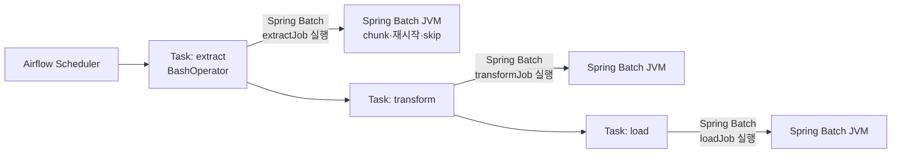

# Airflow DAG 모델 — Spring Batch와의 책임 분담 비교

---

> Airflow 와 Spring Batch 는 자주 *경쟁 도구* 처럼 비교되지만 *계층이 다른* 도구입니다. Airflow 는 *Job 외부* 의 *워크플로우 오케스트레이션* 을, Spring Batch 는 *Job 내부* 의 *대용량 처리* 를 책임집니다. 본 편은 *비교 편* 입니다. Airflow 의 깊이를 학습하는 자리가 아니라, *어디서 Airflow 가 시작하고 Spring Batch 가 끝나는지* 의 경계를 잡습니다.


## 한 줄로 본 차이

| 도구 | 책임 | 표현 단위 | 흔한 자리 |
|------|------|----------|----------|
| Airflow | 잡들 사이의 흐름 (DAG) | Task (Operator) | ETL 파이프라인의 단계 연결 |
| Spring Batch | 한 잡 안의 처리 | Step·Chunk·Tasklet | 1억 건 INSERT 의 chunk 처리 |

Airflow 의 *Task* 한 개가 *Spring Batch 잡 전체* 일 수 있습니다. *DAG 가 Spring Batch 잡 3개를 Extract → Transform → Load 로 묶는* 형태가 정확히 두 도구의 자연스러운 조합입니다.


## Airflow 가 DAG 로 표현하는 것

> DAG (Directed Acyclic Graph) 는 *작업들의 의존 그래프* 입니다. *A 가 끝나야 B 시작*, *A 와 B 가 동시*, *A 와 B 모두 끝나야 C 시작* 같은 의존을 *그래프 노드* 와 *엣지* 로 표현합니다.

```python
from airflow import DAG
from airflow.operators.bash import BashOperator
from datetime import datetime

with DAG(
    dag_id="etl_pipeline",
    schedule="0 2 * * *",          # 매일 새벽 2시
    start_date=datetime(2026, 1, 1),
    catchup=False,
) as dag:

    extract = BashOperator(
        task_id="extract",
        bash_command="java -jar app.jar --spring.batch.job.name=extractJob",
    )

    transform = BashOperator(
        task_id="transform",
        bash_command="java -jar app.jar --spring.batch.job.name=transformJob",
    )

    load = BashOperator(
        task_id="load",
        bash_command="java -jar app.jar --spring.batch.job.name=loadJob",
    )

    extract >> transform >> load
```

이 DAG 가 다루는 것은 *언제 새벽 2시인가*, *extract 가 끝나면 transform 시작*, *세 단계 중 어디서 실패했는가* 입니다. *extract 가 안에서 무엇을 어떻게 처리하는가* 는 Spring Batch 의 잡 정의가 책임집니다.

`>>` 가 *의존 표현* 입니다. `extract >> transform` 은 *extract 가 성공해야 transform 시작* 입니다. *분기* 와 *병렬* 도 표현 가능합니다.

```python
extract >> [transform_users, transform_orders] >> load
```

extract 끝난 후 transform_users 와 transform_orders 가 *병렬로* 동작하고, 둘 다 끝나야 load 가 시작합니다.


## Airflow 의 핵심 개념 — 5가지

> Airflow 의 *학습 분량* 은 Spring Batch 와 같은 수준입니다. 본 편은 *Spring Batch 와의 경계* 만 잡기 위한 *5가지 개념의 요약* 입니다.

**1. DAG** — 작업 의존 그래프. *DAG 정의 파일이 SSOT* 이며 Python 코드로 작성합니다.

**2. Task** — DAG 의 노드. *한 단위의 일* 을 표현합니다. *Operator 의 인스턴스* 입니다.

**3. Operator** — Task 의 *템플릿* 입니다. `BashOperator` (셸 명령), `PythonOperator` (Python 함수), `KubernetesPodOperator` (K8s Pod 실행), `SparkSubmitOperator` (Spark 잡 제출) 등 수백 개의 표준 Operator 가 있습니다. *Spring Batch 잡을 띄우는 데는 보통 `BashOperator` 또는 `KubernetesPodOperator`* 가 답입니다.

**4. Scheduler** — DAG 의 *시작 시각·의존 조건* 을 평가해 *Task 를 실행 큐에 넣는* 컴포넌트. 별도 프로세스로 돕니다.

**5. Executor** — 큐에서 Task 를 꺼내 *실제 실행* 하는 컴포넌트. `LocalExecutor` (단일 머신), `CeleryExecutor` (분산 큐), `KubernetesExecutor` (각 Task 를 K8s Pod 로) 등 모드가 갈립니다.


## Spring Batch 가 못 하는 것·Airflow 가 못 하는 것

**Airflow 가 못 하는 것 (Spring Batch 의 영역)** — *한 잡 안에서 1억 건을 chunk 로 처리하면서 재시작·skip·retry 를 보장* 하는 일. Airflow Task 의 *내부 처리 로직* 은 Airflow 의 책임이 아닙니다. Task 가 *Bash 명령 한 줄* 이든 *Python 함수 한 개* 든 *그 안에서 어떻게 처리하는지* 는 Operator 가 정의합니다.

**Spring Batch 가 못 하는 것 (Airflow 의 영역)** — *잡 A 끝나면 잡 B 시작·실패 시 재시도·여러 잡 병렬·DAG 시각화*. Spring Batch 의 *flow* (`on().to()`) 는 *한 잡 안의 Step 사이* 만 표현 가능합니다. *여러 잡 사이* 는 외부 도구입니다.


## 두 도구의 자연스러운 조합

> 운영에서 자주 보는 패턴은 *Airflow 가 DAG 를, Spring Batch 가 각 노드의 처리를* 책임지는 형태입니다.



이 조합의 *데이터 전달* 은 *외부 저장소* 가 합니다. Airflow 가 *데이터를 직접 옮기진 않습니다*.

- extractJob 이 *S3 에 raw 데이터 파일* 을 두고 끝
- Airflow 가 *전 Task 의 출력 경로를 다음 Task 의 입력으로* 전달 (XCom 또는 파라미터)
- transformJob 이 *그 S3 경로를 입력* 으로 받아 처리 후 *다른 S3 경로* 에 출력
- loadJob 이 *Transform 결과 S3 를 읽어 DB 에 적재*

이 패턴이 *각 잡의 재실행 단위 분리* 와 *각 잡의 자원 프로파일 분리* 를 자연스럽게 만듭니다 ([`./01-07`](01-07.스케줄링과%20운영%20—%20%40Scheduled·Quartz·Argo%20Workflows%20연결.md) 의 ETL 분리 이유와 같은 사고).


## Argo Workflows 와의 비교

> Airflow 의 K8s 네이티브 대안이 *Argo Workflows* 입니다. 두 도구의 차이는 *DAG 정의 언어* 와 *실행 모델* 입니다.

| 측면 | Airflow | Argo Workflows |
|------|---------|---------------|
| DAG 정의 | Python 코드 | YAML (Kubernetes CRD) |
| 실행 환경 | Scheduler + Executor (Celery / K8s 등) | K8s 네이티브. 각 Task = Pod |
| 학습 곡선 | Python 친숙하면 빠름 | K8s 익숙해야 빠름 |
| 큰 데이터 처리 | Operator 가 *외부에 위임* | 같음 |
| 운영 UI | 자체 웹 UI | Argo UI |
| 생태계 | 5000+ Operator | K8s 표준 도구와 결합 |

*기존 K8s 인프라가 강하고 GitOps 를 쓰면* Argo Workflows 가 자연스럽습니다. *Python 데이터 엔지니어링 팀이고 Operator 생태계 의존이 크면* Airflow 가 답입니다. **둘 다 Spring Batch 와의 분담은 같습니다.** 워크플로우는 외부, 잡 내부 처리는 Spring Batch.


## 언제 Airflow 가 *과한가*

> 단일 잡이고 다른 잡과 의존이 없다면 Airflow 는 *과한 인프라* 입니다. *Spring `@Scheduled` 한 줄* 또는 *cron + JobLauncher* 가 충분합니다.

Airflow 가 가치 있어지는 분기점은 다음 셋 중 하나입니다.

**1. 잡이 5개 이상이고 그들 사이에 의존이 있을 때** — DAG 의 *시각화* 와 *의존 자동 트리거* 가 코드로 표현하는 비용을 넘는 시점.

**2. 잡 사이의 데이터 전달이 자주 바뀔 때** — *Extract → Transform → Load* 의 *경로 매핑* 을 DAG 파일 한 곳에서 관리하는 가치.

**3. 운영 팀이 잡 흐름을 *그래프로* 보고 싶을 때** — *어디서 막혔는가* 를 시각으로 진단. 메타테이블 SQL 보다 빠릅니다.

이 셋 다 *Spring Batch 잡 자체와 무관* 합니다. *외부 인프라의 가치* 입니다.


## 운영 함정 — XCom 과 큰 데이터

> Airflow 의 함정 중 하나는 *XCom* 으로 잡 사이에 *큰 데이터* 를 전달하려는 시도입니다.

XCom 은 *Task 간 작은 키-값 전달* 용 인터페이스입니다. 내부적으로 *Airflow 의 메타 DB* 에 저장됩니다. *GB 단위 데이터를 XCom 으로 넘기면* Airflow 메타 DB 가 부풉니다.

표준 답은 *XCom 으로는 경로만 전달, 데이터는 S3·GCS·DB* 에 둡니다. extractJob 이 *S3 경로* 를 XCom 으로 push, transformJob 이 *그 경로를 pull 해서 S3 에서 데이터 읽기*.

이 함정이 *Airflow 는 워크플로우 엔진이지 데이터 처리 엔진이 아니다* 라는 정의를 다시 강조합니다.


## 결론 — 경쟁이 아니라 계층

본 편 시작의 표를 다시 보면 답이 명확합니다.

- *DAG 의 노드* 자리에 *Spring Batch 잡* 이 들어갑니다
- *각 노드 안의 처리* 는 *Spring Batch 의 chunk·재시작·skip* 이 받칩니다
- *언제 시작·다음 노드로의 흐름* 은 *Airflow 의 DAG·Scheduler·Executor* 가 받칩니다

이 분담을 인식하지 못한 채 *Airflow vs Spring Batch* 같은 비교를 시작하면 둘 다 어느 한쪽 책임의 *흉내* 를 내게 됩니다. *Spring Batch 안에서 의존 그래프 흉내* 또는 *Airflow Task 안에서 chunk 처리 흉내* 둘 다 운영에서 무너집니다.


## 관련 문서

- [`./README.md`](./README.md) — 본 시리즈 진입점. 9편 학습 순서와 경계 기준
- [`./01-07.스케줄링과 운영 — @Scheduled·Quartz·Argo Workflows 연결.md`](01-07.스케줄링과%20운영%20—%20%40Scheduled·Quartz·Argo%20Workflows%20연결.md) — Spring Batch 의 *운영 인프라 경계*. 본 편 비교의 짝편이며 *Airflow·Argo 가 외부 스케줄링 자리* 라는 분담을 같이 보여줍니다
- [`../theory/03-01.배치 처리.md`](../theory/03-01.배치%20처리.md) — 이론 측. *Unix 파이프의 단계별 단순화* 가 DAG 의 사고 모델. *왜 데이터를 단계로 나누면 운영이 쉬워지는가* 의 일반 원칙
- [`../../08_cloud/kubernetes/05-07.배치 워크로드.md`](../../08_cloud/kubernetes/05-07.배치%20워크로드.md) — Airflow KubernetesExecutor 또는 Argo Workflows 가 *K8s 위에서* 도는 방법. 각 Task 를 K8s Pod 로 띄울 때의 자원 관리·실패 처리
