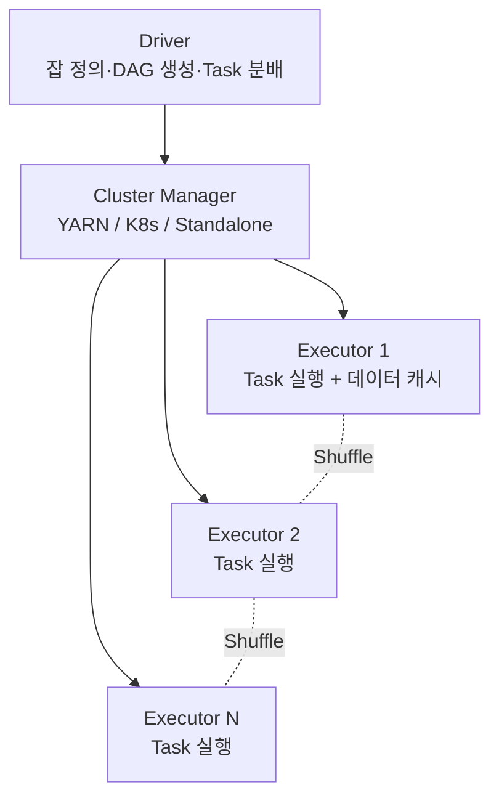
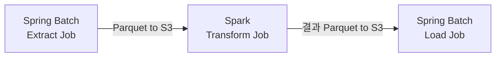

# Apache Spark 입문 — Spring Batch 한계와 분산 처리 전환점

---

> Spring Batch 의 *Remote Partitioning* ([`./01-05`](01-05.Parallel·Partition%20Batch%20—%20TaskExecutor·PartitionStep·Remote%20Partitioning.md)) 까지 가도 *어떤 잡* 은 안 됩니다. 데이터가 *수십 TB* 이고, *복잡한 집계·조인* 이 잡 본체이고, *수백 대 머신을 통합 자원으로* 다뤄야 하는 자리입니다. 그 자리에 *Apache Spark* 가 답입니다. 본 편은 *비교 편* 입니다. Spark 의 깊이가 아니라, *Spring Batch 에서 Spark 로 넘어가야 하는 분기점* 과 *Spark 의 3가지 핵심 모델 (RDD · DataFrame · Structured Streaming)* 의 의미를 잡습니다.


## 한 줄로 본 차이

| 도구 | 처리 모델 | 자원 모델 | 데이터 크기 |
|------|---------|---------|-----------|
| Spring Batch | chunk 단위 직렬·병렬 처리 | 단일 또는 다중 JVM (각자 독립) | GB~수백 GB |
| Spark | 분산 데이터셋의 transformation 그래프 | 클러스터 (수십~수천 노드) 가 *한 자원 풀* | 수 TB~PB |

핵심 차이는 *자원 모델* 입니다. Spring Batch 는 *각 JVM 이 자기 자원만* 다룹니다. Spark 는 *클러스터 전체 메모리·CPU 를 한 풀로* 다룹니다. 잡 하나가 *수십 노드의 메모리를 동시에* 쓸 수 있습니다.


## Spring Batch 에서 Spark 로 넘어가야 하는 분기점

세 가지 신호 중 하나라도 명확하면 Spark 를 검토할 시점입니다.

**1. 단일 JVM 의 메모리 한계** — 데이터 처리에 *한 JVM 에 100 GB 이상 메모리* 가 필요한 자리. 큰 조인, 큰 그룹 by, 큰 정렬. Spring Batch 의 *partition 으로 나눠* 도 *각 partition 안* 의 메모리가 안 줄어드는 경우.

**2. 클러스터 자원의 통합 사용** — *50 대 머신을 같이 쓰는데* 각 머신이 *독립 잡* 으로 도는 게 비효율적인 자리. Spark 는 *Driver 가 잡 전체 자원 사용을 조율* 합니다.

**3. 복잡한 데이터 변환** — *5~10 단계의 조인·집계·필터* 가 잡 본체인 자리. Spring Batch 로 짜면 *각 단계의 chunk 처리* 가 코드의 90% 가 됩니다. Spark 는 SQL 또는 DataFrame API 로 *변환 로직만* 표현하고 *분산 처리는 자동* 입니다.


## Spark 의 3가지 핵심 모델

> Spark 의 학습 분량은 *Spring Batch 와 비교가 안 될 만큼* 큽니다. 본 편은 *3가지 모델의 의미* 만 잡습니다.

### RDD — Spark 의 원형

> RDD (Resilient Distributed Dataset) 가 Spark 의 *가장 낮은 추상화* 입니다. *분산된 불변 컬렉션* 입니다.

```python
# Python 예시 (PySpark)
rdd = sc.textFile("hdfs://path/to/logs")
top_pages = (rdd
    .map(lambda line: line.split()[6])     # URL 컬럼 추출
    .map(lambda url: (url, 1))
    .reduceByKey(lambda a, b: a + b)        # 같은 URL 횟수 합산
    .sortBy(lambda x: x[1], ascending=False)
    .take(10))
```

이 예시가 [`../theory/03-01.배치 처리.md`](../theory/03-01.배치%20처리.md) 의 *MapReduce 가 Unix 파이프를 분산 환경으로 옮긴* 사고를 그대로 보여줍니다. `map` 은 분산 변환, `reduceByKey` 는 shuffle + reduce 입니다.

RDD 의 *기본 동작* 은 *지연 평가* 입니다. `map`, `filter` 같은 *transformation* 은 *실제 계산을 안 합니다*. `take`, `collect`, `count` 같은 *action* 이 호출되어야 *transformation 체인이 한 번에 실행* 됩니다.

RDD 는 *유연하지만 저수준* 입니다. 모든 변환을 *Python·Scala·Java 코드* 로 직접 작성해야 합니다. 대부분의 *분석성 잡* 은 RDD 보다 *DataFrame* 이 더 자연스럽습니다.

### DataFrame · Spark SQL — 분석성 잡의 표준

> DataFrame 은 *컬럼 이름이 있는 분산 테이블* 입니다. *SQL 또는 DSL* 로 변환을 표현합니다. RDD 위의 *고수준 추상화* 이며 *Catalyst Optimizer* 가 자동으로 최적화합니다.

```python
df = spark.read.parquet("s3://logs/2026-05-28/")

top_pages = (df
    .groupBy("url")
    .count()
    .orderBy("count", ascending=False)
    .limit(10))

top_pages.show()
```

또는 SQL 로 같은 일을 표현할 수 있습니다.

```python
df.createOrReplaceTempView("logs")
top_pages = spark.sql("""
    SELECT url, COUNT(*) AS cnt
    FROM logs
    GROUP BY url
    ORDER BY cnt DESC
    LIMIT 10
""")
```

DataFrame 의 *진짜 이점* 은 *Catalyst Optimizer* 입니다. *SQL 처럼 선언적으로 표현하면* 옵티마이저가 *필터 푸시다운, 조인 순서 재배치, 컬럼 프루닝* 을 자동 적용합니다. RDD 처럼 *명령형으로 코드를 쓰면 옵티마이저가 개입할 여지가 없습니다*.

분석성 잡 (BI 리포트·집계·조인) 의 90% 가 DataFrame · Spark SQL 로 충분합니다.

### Structured Streaming — 스트림 처리 모델

> Structured Streaming 은 *DataFrame 위의 스트림 API* 입니다. *무한히 길어지는 테이블* 위에 *같은 변환 SQL* 을 적용하면 *증분 처리* 가 됩니다.

```python
stream = (spark.readStream
    .format("kafka")
    .option("subscribe", "events")
    .load())

word_counts = (stream
    .selectExpr("CAST(value AS STRING) AS line")
    .groupBy("line")
    .count())

query = (word_counts.writeStream
    .outputMode("complete")
    .format("console")
    .start())
```

배치 DataFrame 의 코드가 *그대로* 스트림에 동작합니다. 이 통합이 *Lambda Architecture* (배치 + 스트림 두 코드베이스) 를 *Kappa Architecture* (한 코드베이스) 로 바꾸려는 시도의 핵심입니다.

자세한 스트림 처리 사고는 [`../theory/03-02.스트림 처리.md`](../theory/03-02.스트림%20처리.md) 와 [`../../04_messaging/06_StreamProcessing/`](../../04_messaging/06_StreamProcessing/) 에서 다룹니다.


## 자원 모델 — Driver 와 Executor

> Spark 의 *런타임 토폴로지* 는 *Driver 와 Executor 들* 입니다.



- **Driver** — 사용자 코드가 도는 JVM. *DataFrame 변환 그래프* 를 *Task DAG* 로 컴파일하고 *Executor 들에 분배* 합니다. SparkContext 가 여기서 생성됩니다.
- **Cluster Manager** — YARN / Kubernetes / Spark Standalone 중 하나. Executor 들의 *프로비저닝과 자원 할당* 을 책임.
- **Executor** — Task 가 실제로 도는 JVM. *데이터 파티션을 메모리에 캐시* 하고 *Task 결과를 Driver 에 반환* 합니다. *Shuffle* 은 Executor 들끼리 네트워크로 직접 데이터를 교환합니다.

이 모델이 *Spring Batch 와 가장 다른 점* 입니다. Spring Batch 의 Remote Partitioning 도 *여러 JVM* 을 쓰지만 *각 JVM 이 독립* 입니다. Spark 의 Executor 들은 *Shuffle 단계에서 서로 직접 통신* 합니다. *조인·집계의 키 재분배* 가 이 통신을 통해 일어납니다.


## 메모리·셔플 비용 트레이드오프

Spark 운영의 *가장 큰 함정* 두 가지입니다.

**1. 메모리 부족 (OOM)** — Executor 메모리가 부족하면 *디스크 스필 (spill)* 이 일어나 잡이 *수배 느려집니다*. *broadcast join* 의 데이터가 너무 크거나, *그룹 by 의 partition 이 너무 적어* 한 partition 에 너무 많은 데이터가 몰리는 경우에 발생.

**2. Shuffle 비용** — `groupBy`, `join`, `repartition` 같은 *wide transformation* 이 *Shuffle* 을 트리거합니다. Shuffle 은 *네트워크 + 디스크 IO* 가 모두 들어가 *Spark 잡의 가장 비싼 단계* 입니다. *Shuffle 을 줄이는 설계* (predicate 푸시다운, broadcast join, partition 키 정렬) 가 운영 성능의 핵심.

이 두 함정이 *Spark 가 단순한 도구가 아닌* 이유입니다. 단순 CRUD ETL 에 Spark 를 도입하면 *운영 비용이 처리 가치보다 큽니다*. *분산 처리가 진짜 필요한* 시점에만 Spark 가 답입니다.


## Spark 와 Spring Batch — 같이 쓸 수 있는가

> 한 ETL 파이프라인 안에서 *추출은 Spring Batch, 변환·집계는 Spark, 적재는 Spring Batch* 같은 조합이 가능합니다.



- *Extract* 는 *원본 시스템 API 호출* 이 메인. Spring Batch 의 chunk·재시작·skip 이 적합.
- *Transform* 은 *수십 TB 의 조인·집계*. Spark 가 적합.
- *Load* 는 *목적 DB 에 INSERT*. Spring Batch 의 JdbcBatchItemWriter ([`./01-06`](01-06.Bulk%20Insert·Update%20—%20JdbcBatchItemWriter와%20JPA%20batch_size%20함정.md)) 가 적합.

이 분담을 워크플로우 엔진 (Airflow 또는 Argo) 이 *DAG 의 노드* 로 묶습니다. 각 노드가 *Spring Batch 잡 또는 Spark 잡* 입니다.


## 언제 Spark 를 *안* 도입하는가

Spark 는 *학습·운영 비용이 큰 도구* 입니다. 다음 경우에는 Spring Batch 가 더 적합합니다.

**1. 데이터가 단일 JVM 의 메모리에 들어옴 (~100 GB 이하)** — *partition 으로 나눠서* Spring Batch 의 Local Partitioning 으로 처리 가능.

**2. 잡이 *분석성* 이 아니라 *트랜잭션성*** — 결제 정산·잔액 갱신 같은 *정확성이 중요한 INSERT/UPDATE 중심* 잡. Spark 는 분석에 강하고 트랜잭션에 약합니다.

**3. 운영 팀이 Spark 운영 경험이 없음** — Spark 의 *튜닝* 은 Spring Batch 보다 *훨씬 깊은 전문성* 을 요구합니다. 도입 후 *지속 운영 비용* 이 처리 가치보다 작아야 합니다.

**4. 외부 시스템 호출이 잡 본체** — Spark 가 *Executor 안에서 외부 API 호출* 도 가능하지만 *Spring Batch 의 retry·skip 정책* 이 더 자연스럽습니다.


## Spring Batch 잡의 *상한선*

> 실무에서 *Spring Batch 로 어디까지 가는가* 의 일반적 상한선입니다. 정확한 숫자는 *데이터 모양·DB 성능·네트워크* 에 따라 다르지만 *감각* 으로는 다음 범위입니다.

| 데이터 크기 | Spring Batch 적합도 |
|-----------|-------------------|
| ~10 GB | 단일 JVM·단일 Step 으로 충분 |
| ~100 GB | Local Partitioning 으로 처리 가능 |
| ~1 TB | Remote Partitioning 으로 어렵게 가능 |
| 1 TB 이상 | Spark 가 답 |

*조인·집계의 복잡도* 가 높으면 이 상한선이 더 낮아집니다. *단순 ETL* 이면 더 높아집니다. 분기 신호는 *지금 잡의 운영이 안정적인가* 와 *향후 데이터 성장 추세* 입니다.


## 결론 — 마지막 선택지

본 시리즈가 *Spring Batch 의 깊이* 를 한 편씩 쌓아 *Remote Partitioning* 까지 갔다면, 본 편은 *그 너머* 의 자리입니다. Spark 는 *Spring Batch 를 대체* 하는 도구가 아니라 *Spring Batch 가 닿지 않는 자리* 에 들어옵니다.

**대부분의 운영 잡은 Spring Batch 로 충분합니다.** Spark 가 필요한 자리는 *데이터 규모·복잡도가 명확한 분기점* 을 넘은 자리이며, 그 분기점이 안 보인다면 *아직 Spark 가 필요한 시점이 아닙니다*.


## 관련 문서

- [`./README.md`](./README.md) — 본 시리즈 진입점. 9편 학습 순서와 경계 기준
- [`./01-05.Parallel·Partition Batch — TaskExecutor·PartitionStep·Remote Partitioning.md`](01-05.Parallel·Partition%20Batch%20—%20TaskExecutor·PartitionStep·Remote%20Partitioning.md) — Spring Batch 의 *분산 처리 상한선* 인 Remote Partitioning. 본 편 Spark 가 *그 상한선 너머* 의 자리. 둘을 같이 봐야 *어디서 도구를 바꿔야 하는지* 의 분기점이 명확합니다
- [`./02-01.Airflow DAG 모델 — Spring Batch와의 책임 분담 비교.md`](02-01.Airflow%20DAG%20모델%20—%20Spring%20Batch와의%20책임%20분담%20비교.md) — Spark 잡과 Spring Batch 잡을 *DAG 노드로 묶는* 자리. *Extract = Spring Batch, Transform = Spark, Load = Spring Batch* 같은 조합이 자연스럽습니다
- [`../theory/03-01.배치 처리.md`](../theory/03-01.배치%20처리.md) — 이론 측. *MapReduce·Shuffle·Dataflow 엔진* 의 진화가 Spark RDD·DataFrame 의 직접적인 토대. 본 편을 읽기 전에 그 문서를 읽으면 *왜 RDD 가 MapReduce 의 다음 단계인지* 가 자연스럽게 닫힙니다
- [`../theory/03-02.스트림 처리.md`](../theory/03-02.스트림%20처리.md) — Structured Streaming 의 사고 모델. *무한 테이블 위의 같은 SQL* 이라는 통합 모델의 일반 이론
