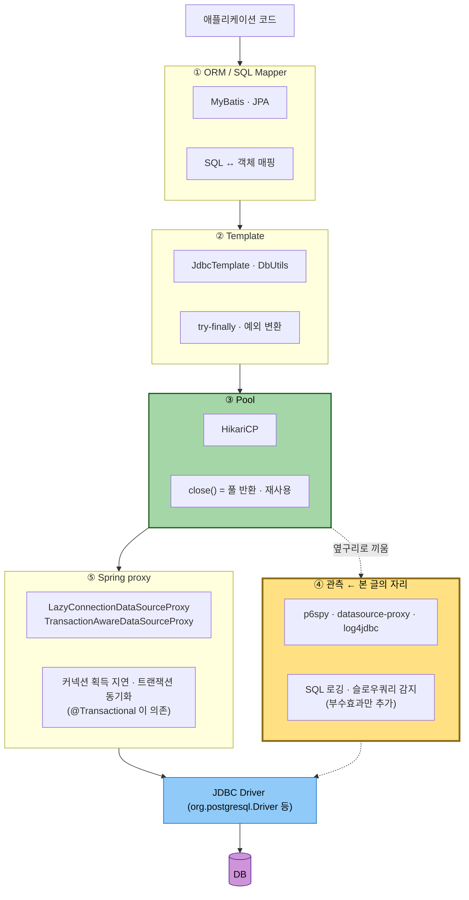
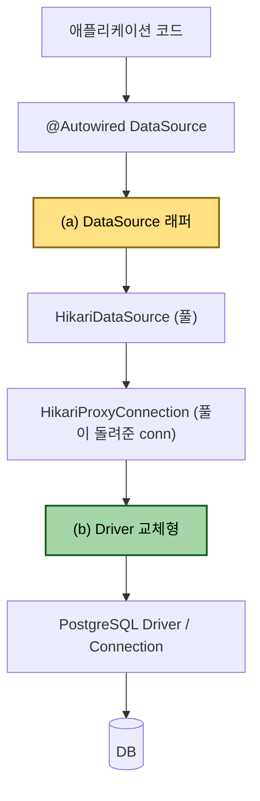

# JDBC 드라이버 wrap 로깅의 운영 비용
---
> **이 문서를 읽고 나면, JDBC wrap 라이브러리 세 종(log4jdbc·p6spy·datasource-proxy)의 출력 모델을 비교하고, 운영 환경에서 폴러형 워크로드가 만든 로그 폭주를 logback 네 곳의 수도꼭지 중 어디서 잠글지 의사결정할 수 있고, 잘못 박힌 underlying driver 설정을 진단해 부팅 잡음을 제거할 수 있다.**
>
> JDBC wrap 라이브러리는 "켜면 SQL 보임" 정도로 가볍게 인식되지만, 실제로는 PreparedStatement·ResultSet 호출 하나마다 INFO 한 줄을 쏟습니다.
>
> - 운영 환경에 단순히 켜두면 폴러형 워크로드와 만나 콘솔/로그 파일이 분당 수천 줄로 폭주합니다.
> - 본 글은 세 가지 대표 wrap (log4jdbc, p6spy, datasource-proxy) 의 출력 모델을 비교하고, logback 의 네 가지 차단 레이어로 노이즈를 외과적으로 끄는 방법을 정리합니다.


## 1. 진입 — 왜 wrapper 라는 게 생겼는가

> Spring AOP 가 메서드 호출 앞뒤에 advice 를 끼우는 발상과 같지만, *AOP 가 자바 메서드 호출 단위*인 반면 *JDBC wrap 은 driver 의 모든 표준 메서드 단위*로 가로채고, 그 가로챔의 산출이 객체 반환이 아니라 SQL·파라미터·실행 시간의 텍스트 로그라는 점이 다르다.

### 1.1 순수 JDBC 의 30 줄 부속 코드

순수 JDBC 로 사용자 한 명을 조회한다고 가정하면, 비즈니스 로직은 사실상 `SELECT name FROM users WHERE id = ?` 한 줄이지만 그 주변에 30 줄 가까운 부속 코드가 따라붙습니다.

```java
// 자원 변수 선언 — finally 에서 close() 하려면 try 바깥 스코프 필요
// null 초기화: 위쪽 라인이 예외 던지면 일부 변수는 미할당 상태
Connection conn = null;
PreparedStatement pstmt = null;
ResultSet rs = null;

try {
    conn = DriverManager.getConnection(URL, USER, PASSWORD);
    pstmt = conn.prepareStatement("SELECT name FROM users WHERE id = ?");
    pstmt.setInt(1, 10);
    rs = pstmt.executeQuery();
    if (rs.next()) {
        String name = rs.getString("name");
        // 비즈니스 로직
    }
} catch (SQLException e) {
    logger.error("DB 에러 발생", e);
} finally {
    // 자원 해제: 역순(rs→pstmt→conn) + null 체크 + close 예외 격리
    // → try-with-resources (Java 7+) 가 이 전체를 자동화함
    if (rs != null)    try { rs.close();    } catch (SQLException e) {}
    if (pstmt != null) try { pstmt.close(); } catch (SQLException e) {}
    if (conn != null)  try { conn.close();  } catch (SQLException e) {}
}
```

- 문제는 단순히 길다는 게 아니라 *누락 시 시스템이 죽는다* 는 점이다. `finally` 에서 `close()` 를 빠뜨리거나 예외가 끼어들어 자원이 안 닫히면 커넥션이 풀에 반환되지 않고, 누적되다 풀이 고갈되면 애플리케이션 전체가 멈춘다. 
- MyBatis · JdbcTemplate · JPA 를 쓰는 입장에선 거의 잊고 있는 위험인데, 그 *잊을 수 있음* 이 곧 wrapper 라는 추상화가 만들어 준 결과입니다. 즉 *wrapper 의 가장 넓은 의미* 는 이 30 줄을 누군가 가져가 한 줄(`jdbcTemplate.queryForObject(...)`) 로 바꿔준 그 모든 도구의 통칭입니다.

### 1.2 그래서 실무 stack 은 4~5 겹 wrapper 양파다

Wrapper는 한 가지가 0.1의 30줄을 모두 흡수하지 않습니다. 각 관심사 (반복 코드 캡슐화 / 커넥션 재사용 / 로깅 / 트랜잭션 동기화)가 서로 다른 라이브러리에 의해 한겹씩 맡겨지기 때문입니다. 각 라이브러리들은 서로를 대체 하는게 아닌 겹쳐서 끼어듭니다.

그래서 실제 운영 환경의 Connection 객체는 순수한 벤더 드라이버 객체가 아니라 4~5겹의 프록시를 감싸진 형태가 됩니다.



```yaml
# Log4jdbc 클래스 적용
spring:
  datasource:
    url: jdbc:log4jdbc:postgresql...
    driver-class-name: net.sf.log4jdbc.sql.jdbcapi.DriverSpy
```

- **DriverSpy 한 줄 소개**: log4jdbc 라이브러리가 제공하는 `java.sql.Driver` 구현체. `jdbc:log4jdbc:` URL 접두사를 보고 실제 driver 를 위임 호출하면서 모든 JDBC 메서드 호출을 log 한다. 



- Hikari는 javax.sql.DataSource 인터페이스의 구현체이며 Connection, Statement, ResultSet, DataSource가 모두 java.sql.Wrapper를 상속합니다.
- 같은 "SQL 가로채기" 결과를 만들어도, wrap 라이브러리가 (a) 자리에 끼느냐 (b) 자리에 끼느냐에 따라 **관찰 방법·끄는 방법·운영 비용** 세 가지가 갈립니다.

| 항목 | (a) DataSource 래퍼형 | (b) Driver 교체형 |
|---|---|---|
| 끼는 자리 | Spring 의 `DataSource` 빈 **바깥** | Hikari 가 들고 있는 **Driver 자리** |
| 끼는 방법 | wrapper bean 등록 (자동 또는 수동) | `application.yml` 의 `driver-class-name` 교체 + `jdbc:log4jdbc:` URL 접두사 |
| Hikari 와의 관계 | Hikari **위** 에 래핑 (Hikari 풀이 만든 conn 을 또 감쌈) | Hikari **아래** 에서 래핑 (Hikari 가 conn 만들 때 그 안에 끼움) |
| `dataSource.getClass()` 결과 | wrap 라이브러리 클래스 (예: `DecoratedDataSource`) | 순정 `HikariDataSource` 그대로 |
| `conn.getClass()` 결과 | wrap 라이브러리 프록시 (예: JDK `$ProxyNN`) | 순정 `HikariProxyConnection` 그대로 |
| 동작 확인 방법 | `getClass()` 만으로 즉시 보임 | `jdbc.*` 로그가 찍히는지로 확인 |
| 풀이 셈하는 *커넥션 객체* | wrap 라이브러리가 만든 객체 | 알맹이 driver 가 만든 객체 |
| 끄는 방법 | wrapper bean 토글 (한 줄) | `driver-class-name` 과 URL 두 줄 yml 복구 |

**(a) DataSource 래퍼형 — datasource-proxy 흐름**

```bash
DataSource.getConnection()
    ↓ DataSource 빈이 DecoratedDataSource — *여기서* 한 번 잡힘
    
DecoratedDataSource.getConnection()
    ↓ 자기 안의 HikariDataSource 에 위임
    
HikariDataSource.getConnection()
    ↓ 풀에서 HikariProxyConnection 받음
    ↓ DecoratedDataSource 가 그 conn 을 JDK Proxy 로 한 번 더 감싸 반환
    
$ProxyNN (handler = ConnectionInvocationHandler)   ◀── 호출자가 받은 conn
    ↓ prepareStatement(...)
    ↓ ConnectionInvocationHandler # *여기서 로그 찍고* HikariProxyConnection 으로 위임
    
PgConnection.prepareStatement(...)                  ← 실제 DB 통신
```

**(b) Driver 교체형 — log4jdbc 흐름**

```bash
DataSource.getConnection()
    ↓ DataSource 빈은 그냥 HikariDataSource (wrap 없음)
    
HikariDataSource.getConnection()
    ↓ 풀이 비었으면 driver-class-name = DriverSpy 라 DriverSpy.connect(...)
    
DriverSpy.connect("jdbc:log4jdbc:postgresql://...")
    ↓ "jdbc:log4jdbc:" 접두사 떼고 진짜 driver 위임
    
PgDriver.connect("jdbc:postgresql://...")
    ↓ 알맹이 PgConnection 반환
    ↓ DriverSpy 가 그걸 자기 ConnectionSpy 로 감싸 반환
    
ConnectionSpy(PgConnection)
    ↓ Hikari 가 이걸 풀에 넣음 + HikariProxyConnection 으로 한 번 더 감쌈
    
HikariProxyConnection( ConnectionSpy( PgConnection ) )   # 호출자가 받은 conn
    ↓ prepareStatement(...) → delegate = ConnectionSpy
    
ConnectionSpy.prepareStatement(...)                       # *jdbc.audit 라인 찍힘*
PgConnection.prepareStatement(...)                        # 실제 DB 통신
```

- **(a) 는 위에서 잡는다** — 호출이 *Hikari 에 닿기 전* 에 가로챈다. Hikari 내부는 안 건드림.
- **(b) 는 아래에서 잡는다** — Hikari 가 *알맹이를 만드는 그 순간* 끼어들어 알맹이 대신 wrap 된 객체를 풀에 넣는다. Hikari 는 자기가 들고 있는 게 wrap 인 줄 모름.

### 1.3 java.sql.Wrapper 와 unwrap() — 양파를 안전하게 까는 표준

§1.2 의 양파를 단순 캐스팅 없이 푸는 표준 메서드가 `unwrap()` 과 그 짝 `isWrapperFor()` 다. 

이 둘이 JDBC 표준에 들어온 것은 JDBC 4.0 (Java 6, JSR 221, 2006) 부터다. 그 이전까지는 Connection Pool 과 DataSource 프록시가 실무에서 확산되면서 *벤더 특화 API (MariaDB 의 스트리밍 ResultSet, Oracle LOB 핸들러 등) 에 닿을 표준 수단이 사라지는* 문제가 표면화됐고, JDBC 4.0 명세가 이를 해결하기 위해 `java.sql.Wrapper` 인터페이스를 새로 정의해 `Connection` · `Statement` · `ResultSet` · `DataSource` 가 모두 이를 상속하도록 못 박았다. 

즉 "여러 겹의 프록시를 안전하게 뚫고 알맹이에 닿는" 행위가 *벤더 구현 디테일* 에서 *표준이 보장하는 동작* 으로 승격된 시점이 JDBC 4.0 입니다.

```java
public interface Wrapper {
    <T> T unwrap(Class<T> iface) throws SQLException;
    boolean isWrapperFor(Class<?> iface) throws SQLException;
}
```

- 호출자가 *어느 겹이 진짜 알맹이를 들고 있는지* 모르더라도, 각 겹의 `unwrap()` 구현이 *자기 타입이 아니면 다음 겹으로 위임* 하는 식으로 재귀를 돌려 명세상 안전하게 알맹이를 반환한다. 

사용 시에는 `isWrapperFor()` 로 알맹이 존재 여부를 먼저 확인한 뒤 `unwrap()` 으로 꺼낸다.

```java
if (conn.isWrapperFor(com.mysql.cj.jdbc.JdbcConnection.class)) {
    var mysqlConn = conn.unwrap(com.mysql.cj.jdbc.JdbcConnection.class);
    // 벤더 특화 API
}
```

- `java.sql.Wrapper` 는 §1 에서 wrapper driver / underlying driver 구분을 이해할 때 한 번 더 등장합니다 — 그쪽 절에서 본 절을 가리키므로 *unwrap 의 의미* 만 여기서 박아두면 됩니다.


## 2. wrap 라이브러리 3종 — 같은 목적, 다른 출력 모델

> log4jdbc·p6spy·datasource-proxy 세 라이브러리가 같은 자리에 끼지만 한 호출당 라인 수가 약 20+ / 1~2 / 1 줄로 갈리며, 이 차이가 운영 비용의 8할을 결정한다. 

세 라이브러리 모두 JDBC `Driver` 또는 `DataSource` 를 wrap 해 호출을 가로채는 것까지는 같습니다. 차이는 출력 형식, logger 이름 정책, 끄는 방법이 모두 다르다는 점입니다.

| 항목 | log4jdbc-log4j2 | p6spy | datasource-proxy |
|------|-----------------|-------|------------------|
| wrap 방식 | Driver 교체 (`net.sf.log4jdbc.sql.jdbcapi.DriverSpy`) | Driver 또는 DataSource (`com.p6spy.engine.spy.P6DataSource`) | DataSource 래퍼 (Builder API) |
| 활성화 트리거 | `driver-class-name` 교체 + `jdbc:log4jdbc:` URL 접두사 | `driver-class-name` 교체 + `jdbc:p6spy:` 접두사, 또는 wrapper bean | wrapper bean 으로 DataSource 한 번 감쌈 |
| logger 이름 | 기본 `log4jdbc.log4j2` (단일) — delegator 교체 시 `jdbc.sqlonly`/`jdbc.sqltiming`/`jdbc.audit`/`jdbc.resultset`/`jdbc.connection` (5분류) | `p6spy` (단일) | 사용자 정의 (`net.ttddyy.dsproxy.listener.logging.SLF4JQueryLoggingListener` 등) |
| 1 사이클당 라인 수 | 약 20+ (audit/resultset 포함) | 약 1~2 (SQL + 실행 시간만) | 1 (한 줄에 SQL+binding+timing 묶음) |
| 설정 위치 | `log4jdbc.log4j2.properties` (classpath) | `spy.properties` (classpath) | Java DSL (Builder) |
| OTel 대체 가능성 | OTel JDBC instrumentation 으로 SQL+timing 모두 대체 가능 | 동일 | 동일 |

- log4jdbc 가 한 호출당 한 줄을 INFO 로 쏟는 이유는 `Connection / PreparedStatement / ResultSet` 의 모든 메서드를 spy 객체로 wrap 해 audit-style 로 기록하기 때문이다. 
- p6spy 는 SQL 본문과 실행 시간만 기록하므로 한 사이클이 2 줄 안쪽으로 끝난다. 
- datasource-proxy 는 listener 모델이라 사용자가 무엇을 기록할지 직접 결정합니다 — 가장 외과적이지만 가장 손이 많이 갑니다.

### 같은 SELECT 한 번이 라이브러리별로 어떻게 찍히는가

같은 `SELECT * FROM users WHERE id = ?` 한 번을 세 라이브러리에서 각각 출력한 모습을 비교하면 *라인 수 8할 차이* 의 의미가 시각적으로 박힙니다.

| 라이브러리       | 1 SELECT 당 줄 수 | SQL+바인딩 한 줄?       | audit/resultset 라인 | 폴러 500ms 분당 추정 |
| ---------------- | ----------------- | ----------------------- | -------------------- | -------------------- |
| log4jdbc-log4j2  | 약 20             | 별 줄에 분리 (7번째 줄) | 포함 (15+ 줄)        | **약 2,400**         |
| p6spy            | 1                 | ✅ 한 줄에 둘 다         | 없음                 | 약 120               |
| datasource-proxy | 1                 | ✅ 한 줄에 둘 다         | 없음                 | 약 120               |

**log4jdbc-log4j2 (약 18~22 줄, Slf4jSpyLogDelegator 기본):**

```text
INFO  log4jdbc.log4j2 - 1. Connection.new Connection returned       org.mariadb.jdbc.MariaDbConnection@7a3d4f
INFO  log4jdbc.log4j2 - 1. Connection.getAutoCommit() returned true
INFO  log4jdbc.log4j2 - 1. Connection.setAutoCommit(false) returned
INFO  log4jdbc.log4j2 - 1. Connection.prepareStatement(SELECT * FROM users WHERE id = ?) returned net.sf.log4jdbc.sql.jdbcapi.PreparedStatementSpy@4a8f

INFO  log4jdbc.log4j2 - 1. PreparedStatement.setLong(1, 42) returned
INFO  log4jdbc.log4j2 - 1. PreparedStatement.executeQuery() returned net.sf.log4jdbc.sql.jdbcapi.ResultSetSpy@9b2c

INFO  log4jdbc.log4j2 - 1. SELECT * FROM users WHERE id = 42   {executed in 3 msec}
INFO  log4jdbc.log4j2 - 1. ResultSet.next() returned true
INFO  log4jdbc.log4j2 - 1. ResultSet.getLong(id) returned 42
INFO  log4jdbc.log4j2 - 1. ResultSet.getString(name) returned "Alice"
INFO  log4jdbc.log4j2 - 1. ResultSet.getString(email) returned "alice@example.com"
INFO  log4jdbc.log4j2 - 1. ResultSet.wasNull() returned false
INFO  log4jdbc.log4j2 - 1. ResultSet.next() returned false
INFO  log4jdbc.log4j2 - 1. ResultSet.close() returned

INFO  log4jdbc.log4j2 - 1. PreparedStatement.close() returned

INFO  log4jdbc.log4j2 - 1. Connection.commit() returned
INFO  log4jdbc.log4j2 - 1. Connection.setAutoCommit(true) returned
INFO  log4jdbc.log4j2 - 1. Connection.close() returned
```

- SELECT 본문 1줄(7번째) + audit 11~12줄 (Connection·PreparedStatement lifecycle) + resultset 4~5줄 (컬럼 getter 마다 1줄). 폴러가 500ms 마다 돌면 분당 약 2,400 줄.

**p6spy (1 줄):**

```text
INFO  p6spy - 1700000000123|3|0|statement|SELECT * FROM users WHERE id = ?|SELECT * FROM users WHERE id = 42
```

- 파이프(`|`) 구분 6필드: 타임스탬프 ms · 실행 시간 ms · category · type · *원본 SQL (placeholder)* · *바인딩 치환된 SQL*. 의도적으로 *한 줄에 grep·awk 친화* 형식으로 설계됐다.

**datasource-proxy (1 줄, 기본 listener):**

```text
INFO  net.ttddyy.dsproxy.listener - Name:dataSource, Connection:1, Time:3, Success:True, Type:Prepared, Batch:False, QuerySize:1, BatchSize:0, Query:["SELECT * FROM users WHERE id = ?"], Params:[(42)]
```

- 명시적 key:value 라벨링 — 사람이 읽기 가장 쉽다. listener 를 커스터마이징하면 timestamp·correlation-id 등 추가 가능.


## 3. log4jdbc 의 delegator 두 갈래 — 한 문단 요약

> log4jdbc 의 출력 채널은 `SpyLogDelegator` 구현이 결정하며, 기본 `Slf4jSpyLogDelegator` 는 5채널(`jdbc.sqlonly` · `sqltiming` · `audit` · `resultset` · `connection`)로 logger 이름을 갈라 출력하고, `Log4j2SpyLogDelegator` 는 단일 채널(`log4jdbc.log4j2`)로 합쳐 출력합니다. 5채널 갈래에서는 `<logger name="jdbc.audit" level="OFF"/>` 한 줄로 audit 만 꺼서 sqlonly/sqltiming SQL 디버깅은 살리는 *카테고리별 OFF* 가 logback 의존성 0 으로 가능하고, 단일 채널 갈래에서는 통째 OFF 만 가능해 카테고리별 차단이 필요하면 EvaluatorFilter 가 필요합니다. 이 차이가 §4 (3) logger level 차단의 *정밀도* 결정의 전제이며, Spring Boot logback 기본 환경에서는 5채널 갈래가 거의 항상 정답입니다.

- 두 delegator 의 채널 raw 로그 예시·log4j2 갈래를 끼는 두 가지 정합 조건은 [04-02.md §5 (3) logback logger level](./04-02.log4jdbc%20로그%20제어%20베스트%20프랙티스.md) 와 [04-02a.md §3 라우팅·드라이버](./04-02a.log4jdbc%20properties%20레퍼런스.md) 에 더 자세히 정리돼 있습니다.


## 4. 노이즈를 끄는 네 곳의 수도꼭지 — 위치와 trade-off

> log4jdbc 운영에서 로그 노이즈를 끄는 결정 위치는 네 곳이며, 그중 (4.1)·(4.2) 는 log4jdbc 설정 자리에서, (4.3)·(4.4) 는 logback 설정 자리에서 잠급니다.
>
> - 외과성(다른 코드 영향 최소화)과 평가 비용은 반비례하며 — 가장 강한 driver 차단은 SQL 디버깅까지 잃고, 가장 외과적인 EvaluatorFilter 는 매 이벤트 Janino 식 평가 비용을 받습니다. 본 절은 네 자리의 *명명과 trade-off* 만 박고, 레이어별 deep-dive·예시·실측 비용·executor 처방은 [04-02.md §2~§9](./04-02.log4jdbc%20로그%20제어%20베스트%20프랙티스.md) 에 모았습니다.

JDBC 호출이 로그로 흘러나오는 경로 위에 네 수도꼭지의 위치를 박으면 다음과 같습니다.

```mermaid
flowchart LR
    jdbc["JDBC 호출<br>(executeQuery 등)"]
    wrap["wrap channel<br>(log4jdbc / p6spy)"]
    logger["logback Logger<br>(level 필터)"]
    filter["Appender Filter<br>(EvaluatorFilter)"]
    out["콘솔 / 파일<br>출력"]

    jdbc -->|"(4.1) Driver 차단<br>= 호출 자체 안 들어옴"| wrap
    wrap -->|"(4.2) properties<br>= 라인 수 형식 조정"| logger
    logger -->|"(4.3) logger level OFF<br>= ILoggingEvent 미생성"| filter
    filter -->|"(4.4) EvaluatorFilter DENY<br>= 매 이벤트 평가 후 차단"| out

    style jdbc fill:#90CAF9,color:#000,stroke:#1565C0
    style out fill:#FFAB91,color:#000,stroke:#BF360C
```



각 수도꼭지가 흐름의 *어느 단계* 에서 잠그는지 보면 외과성과 평가 비용의 차이가 직관적으로 잡힙니다. (4.1)·(4.2) 는 wrap 채널 *자체* 를 손대므로 다른 코드 영향이 크고, (4.3)·(4.4) 는 wrap 은 그대로 두고 logback 에서 *출력 직전* 에 잠그므로 외과적입니다.

| 수도꼭지 | 손대는 자리 | 잠그는 단계 | 비용 | 잃는 것 | deep-dive |
|---|---|---|---|---|---|
| (4.1) Driver 차단 | log4jdbc | wrap 채널 *생성 전* | 0 | 모든 SQL 디버깅 | [04-02 §3](./04-02.log4jdbc%20로그%20제어%20베스트%20프랙티스.md) |
| (4.2) properties | log4jdbc | wrap 채널 *내부 형식* | 0 | 없음 (형식만 정돈) | [04-02 §4](./04-02.log4jdbc%20로그%20제어%20베스트%20프랙티스.md) · [04-02a 전체](./04-02a.log4jdbc%20properties%20레퍼런스.md) |
| (4.3) logger level | logback | ILoggingEvent *생성 전* | ~0μs | 해당 logger 이름 전체 | [04-02 §5](./04-02.log4jdbc%20로그%20제어%20베스트%20프랙티스.md) |
| (4.4) EvaluatorFilter | logback | ILoggingEvent *생성 후* | 0.3~1.5μs/이벤트 | 조건 외 영향 0 (외과적) | [04-02 §6 · §7](./04-02.log4jdbc%20로그%20제어%20베스트%20프랙티스.md) |

각 레이어의 yml/properties/xml 예시·Janino 자동 변수 9개·EvaluatorFilter 패턴 4종(키워드/thread/MDC/복합)·executor 환경 실측 처방·operator k8s 폭주 회고는 모두 04-02 에서 다룹니다. 본 글은 *어디에 수도꼭지가 있는가* 만 박고, *그 수도꼭지를 어떻게 잠그는가* 는 04-02 가 SSOT 입니다.


## 5. MariaDB + log4jdbc 의 흔한 실수

> wrapper driver(`DriverSpy`)와 underlying driver(`log4jdbc.drivers`)는 다른 것이며, MariaDB 환경에 MySQL driver 를 underlying 으로 박는 실수가 `auto.load.popular.drivers=true` 기본값에 가려져 *동작은 하지만 부팅 잡음을 남기는* 형태로 자주 누락됩니다.
>
> - §6의 사고가 폭주한 세 가지 조건(DriverSpy + root INFO + 부정확한 키워드 매칭) 중 첫 번째가 본 절의 실수에서 시작됩니다.

operator k8s 환경의 `log4jdbc.log4j2.properties` 가 운영에 박혀 있었는데, `log4jdbc.drivers=com.mysql.cj.jdbc.Driver` 로 잘못 박혀 있었다. 운영은 MariaDB 인데도 부팅이 동작한 이유는 `auto.load.popular.drivers` 가 기본 `true` 라서 log4jdbc 가 mysql/oracle/postgres/mariadb 등 유명 driver 를 자동으로 탐색해 underlying 후보로 등록하기 때문이다. 우연히 mariadb 가 잡혀 동작했지만 *의도한 driver 가 mysql 인데 실제로는 mariadb 가 쓰이는* 상태가 되어, 나중에 누가 `log4jdbc.drivers` 한 줄을 보고 "이 환경은 mysql 이군" 으로 잘못 판단할 수 있다. 부팅 잡음 raw 로그와 `auto.load.popular.drivers=false` + `log4jdbc.drivers=<순정>` 로 정정한 뒤·후 비교, 그리고 executor 환경 처방 diff 는 [04-02.md §4 (2) properties 위생](./04-02.log4jdbc%20로그%20제어%20베스트%20프랙티스.md) 와 [04-02.md §9.2 처방 1](./04-02.log4jdbc%20로그%20제어%20베스트%20프랙티스.md) 에 정리돼 있습니다.

여기서 `DriverSpy` 와 underlying driver 의 역할이 헷갈리기 쉽습니다. `driver-class-name: net.sf.log4jdbc.sql.jdbcapi.DriverSpy` 는 Spring/Hikari 가 만드는 wrapper driver 의 클래스 이름입니다. 그 wrapper 가 안에서 실제 DB 와 말하는 underlying driver 는 따로 결정됩니다 — properties 의 `log4jdbc.drivers` 가 그 명시 경로입니다. wrapper 자기 자신을 underlying 으로 가리키면 무한 순환에 빠지므로 절대 같은 값을 박으면 안 됩니다. **운영 의존성을 *우연이 아니라 의도* 로 만들기 위해** auto-load 를 끄고 명시하는 패턴이 가치 있는 이유입니다.


## 6. 면접 대비 요약

> 본 글 §1~§5를 *그림 없이 말로 설명할 수 있는 수준*까지 압축합니다. 한 줄 정의는 wrapper 5계층(§1.2) 중 관측 계층 한 칸이라는 좌표를 박는 형태이며, 핵심 포인트 3가지는 출력 모델 차이·네 수도꼭지 trade-off·wrapper/underlying driver 구분으로 §2·§4·§5를 회수합니다.

### 한 줄 정의
JDBC wrap 라이브러리란 ORM·Template·Pool·관측·Spring proxy 로 이어지는 wrapper 5 계층 (§0.3) 중 *관측 계층* 의 한 갈래로, 애플리케이션과 실제 DB 드라이버 사이에 끼어들어 JDBC 호출을 가로채고 SQL 본문·바인딩 파라미터·실행 시간을 로그로 남기는 중간 계층입니다.

### 핵심 포인트 3가지

1. **출력 모델이 라이브러리마다 다르다.** log4jdbc-log4j2 는 호출당 한 줄을 INFO 로 쏟아 한 사이클 20+ 줄이 나오는 반면, p6spy 는 SQL+timing 만 1~2 줄, datasource-proxy 는 listener 모델로 1 줄에 묶는다. 운영 비용의 8할이 이 라인 수 차이에서 나온다.
2. **노이즈는 네 곳에서 끌 수 있다.** driver 자체 / properties / logback logger level / logback EvaluatorFilter. 외과성과 평가 비용이 반비례한다 — driver/level 차단은 빠르지만 다른 코드의 SQL 디버깅까지 같이 잃고, EvaluatorFilter 는 thread/MDC 기반으로 외과적이지만 매 이벤트 평가 비용이 든다. 각 레이어 deep-dive·EvaluatorFilter 패턴 4종·executor 환경 실측 처방은 [04-02.md §2~§9](./04-02.log4jdbc%20로그%20제어%20베스트%20프랙티스.md) 참조.
3. **wrapper driver 와 underlying driver 는 다른 것.** `driver-class-name: DriverSpy` 는 Spring/Hikari 가 만드는 wrapper 의 이름이고, 그 wrapper 안에서 실제 DB 와 말하는 underlying driver 는 `log4jdbc.drivers` 로 따로 명시. MariaDB 환경에 `com.mysql.cj.jdbc.Driver` 를 박는 흔한 실수가 auto-load 에 가려져 동작은 하면서 부팅 잡음을 남깁니다.

### 자주 묻는 질문

**Q. log4jdbc 와 Hibernate `show_sql` 의 차이는?**
A. `show_sql` (또는 `org.hibernate.SQL=DEBUG`) 은 Hibernate 가 만든 JPQL→SQL 변환 결과만 봅니다. 바인딩 파라미터는 `?` 자리표시자로 남고 별 logger (`org.hibernate.orm.jdbc.bind`) 를 켜야 따로 볼 수 있습니다. log4jdbc 같은 wrap 은 driver 단에서 가로채서 바인딩 치환된 평문 SQL 을 한 줄에 같이 찍어 디버깅이 더 쉽습니다.

**Q. 운영에서 wrap 을 켜둬도 되는가?**
A. 폴러형 워크로드 (Outbox·Scheduler·CDC) 가 있으면 거의 항상 후회한다. 분당 수천 줄의 wrap 로그가 진짜 에러 신호를 묻고 인덱스를 부풀린다. 켤 거면 (a) p6spy 같은 라인 수 적은 라이브러리를 고르거나, (b) logback evaluator 로 폴러 스레드만 외과적으로 차단하거나, (c) sampling 으로 N 회 중 1 회만 찍거나, (d) OTel trace 로 졸업.

**Q. JaninoEventEvaluator 가 자동 주입하는 변수는?**
A. `event` (ILoggingEvent 전체) / `level` / `logger` / `message` (치환 전) / `formattedMessage` (치환 후) / `throwable` / `marker` / `mdc` (Map) / `timeStamp` (long). 이 목록에 없는 것 (thread, threadName, host, pid 등) 은 모두 `event.getXxx()` 메서드 호출로 접근해야 합니다. 변수처럼 직접 쓰면 Janino 가 컴파일 에러 (`is not an rvalue`) 를 던지면서 logback 자체가 안 떠 application 기동이 실패합니다.

**Q. wrapper 5계층 (§0.3) 중 본 글이 다루는 칸은 어디고, 옆 칸과 책임이 어떻게 다른가?**
A. *관측(observability) 계층* 한 칸입니다 — ORM/Mapper(MyBatis·JPA), Template(JdbcTemplate), Pool(HikariCP), **관측(p6spy·datasource-proxy·log4jdbc)**, Spring proxy(`LazyConnectionDataSourceProxy`·`TransactionAwareDataSourceProxy`) 다섯 칸 중 네 번째. 옆 칸과의 책임 차이는 *무엇을 감추는가* 로 갈립니다. ORM 은 SQL↔객체 매핑, Template 은 try-finally 와 예외 변환, Pool 은 `close()`를 풀 반환으로 의미 변환, Spring proxy 는 커넥션 획득 지연과 트랜잭션 동기화. 관측 계층만 *기능을 바꾸지 않고 부수효과(로그)만 추가*한다는 점에서 다르며, 그래서 운영에서 끄거나 갈아끼우는 결정이 다른 네 칸보다 더 자주 발생합니다.
