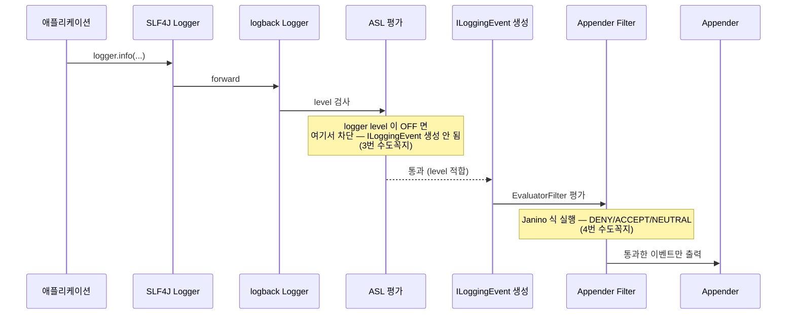

# log4jdbc 로그 제어 베스트 프랙티스
---
> **이 문서를 읽고 나면, log4jdbc 환경에서 어디서·어떻게 로그를 잠글지 4개 레이어 결정 매트릭스로 의사결정할 수 있고, executor·operator 같은 폴러 워크로드 환경의 noise 를 외과적으로 끄는 logback EvaluatorFilter 식을 작성할 수 있으며, 샘플링 패턴(N회 중 1회)과 OTel 마이그레이션 중 어느 단계에 어떤 패턴을 적용할지 판단할 수 있다.**
>
> 04-01이 *log4jdbc 가 어떤 사고를 만들었는가* 의 회고였다면, 본 문서는 *그 사고를 다시 만나지 않기 위한 결정 매트릭스* 다.
>
> - 04-01 §4 "네 수도꼭지" 를 각 레이어별로 깊이 파고, 비용 모델·외과성·디버깅 손실을 수치로 표시합니다.
> - logback EvaluatorFilter 의 패턴 4가지(키워드·thread·MDC·복합)와 샘플링 패턴 3가지(DuplicateMessageFilter·BurstFilter·counter)를 카탈로그로 정리합니다.
> - 사용자 환경(TPS executor)의 실측 미스매치 3가지를 §9 처방으로 박제한다 — 읽고 바로 적용 가능한 형태.


## 진입 — 왜 log4jdbc 가 운영에서 폭주하는가

> 본 절은 *번호 없는* 도입 섹션입니다. 본문 §1부터 본격 번호가 시작됩니다. log4jdbc 자체는 죄가 없고 *제어 안 된 환경* 이 폭주를 만든다는 인식이 본 문서의 출발점입니다.

폭주는 *어느 한 가지 설정 실수* 가 아니라 *세 가지 미세한 미스매치가 겹쳤을 때* 일어납니다. 04-01 §6 회고에서 operator k8s 만 폭주한 이유가 (a) DriverSpy 사용 + (b) root level INFO + (c) EvaluatorFilter 키워드 매칭의 *조합* 이었던 것과 같습니다. 본 문서는 이 세 가지를 각각 *어디서 제어 가능한가* 로 분해합니다.

사용자 환경 실측 한 컷 — TPS executor 의 `application-local.yml` 과 `log4jdbc.log4j2.properties` 를 비교해 보면 미스매치가 보인다.

```yaml
# application-local.yml
spring:
  datasource:
    hikari:
      driver-class-name: net.sf.log4jdbc.sql.jdbcapi.DriverSpy   # wrapper driver
      jdbc-url: jdbc:log4jdbc:mariadb://localhost:13306/TPS      # ← mariadb
```

```properties
# log4jdbc.log4j2.properties
log4jdbc.auto.load.popular.drivers=false
log4jdbc.drivers=com.mysql.cj.jdbc.Driver                        # ← mysql !!!
```

jdbc-url 은 `mariadb` 인데 underlying driver 로 `com.mysql.cj.jdbc.Driver` 가 박혀 있습니다. 04-01 §5 "흔한 실수" 가 executor 에 그대로 살아 있습니다. 본 문서 §4 properties 위생에서 이 미스매치를 정정하는 한 줄을 박습니다.


## 1. 본 글의 좌표 — 04-01 §4를 깊이 들여다보는 deep-dive

> 이 글은 04-01 §4 "네 수도꼭지" 의 한 칸 한 칸을 한 단계 깊이 파고드는 deep-dive 이며, Spring `@ConditionalOnExpression` 과 같은 *조건식 기반 제어* 발상이지만 *컴파일된 Java 식을 매 이벤트마다 평가* 한다는 점이 비용 차이를 만듭니다. 본 절은 사전 지식 앵커링이며, §2부터 본격 결정 매트릭스가 시작됩니다.

이 글이 다루는 한 칸은 *log4jdbc 출력을 제어하는 결정 위치 네 곳* 이며, 04-01 §4가 한 페이지로 소개한 그 네 곳을 각각 한 절씩 펼친다. 04-01 §6·§8 의 회고와 실습이 *이미 일어난 사고의 박제* 였다면, 본 글은 *앞으로 그 사고를 안 만들기 위한 사전 결정 도구* 다.

logback EvaluatorFilter 의 발상은 Spring `@ConditionalOnExpression` 또는 Drools 같은 룰 엔진과 같습니다 — "어떤 조건이 참일 때만 동작" 이라는 분기 결정을 코드 본문이 아니라 *외부 식* 으로 둡니다. 단 비교 대상과 결정적으로 다른 점 한 가지가 있습니다.

| 항목 | `@ConditionalOnExpression` | logback EvaluatorFilter |
|------|---------------------------|-------------------------|
| 평가 시점 | Bean 등록 시 *1회* | 매 로그 이벤트마다 |
| 평가 비용 | 부팅 시 1회 (무시 가능) | 정상 로그 포함 *모든 이벤트* 에 누적 |
| 식 컴파일러 | Spring SpEL | Janino (Java 부분 문법) |
| 실패 시 영향 | 해당 Bean 미등록 | logback 미초기화 → application 기동 실패 |

매 이벤트 평가 비용을 받는다는 trade-off 가 EvaluatorFilter 의 가장 큰 특성이며, 본 문서 §6 에서 정량화합니다.


## 2. 4개 차단 레이어 결정 매트릭스

> wrap 로그를 잠그는 결정 위치 네 곳(driver / properties / logger level / EvaluatorFilter) 을 *외과성·평가 비용·디버깅 손실* 세 축으로 비교합니다. 한 환경에 한 레이어만 쓰는 게 아니라 *조합* 으로 쓰는 것이 일반적이며, §3~§6에서 각 레이어를 깊이 봅니다.

네 레이어를 한 그림으로 정리하면 다음과 같습니다.

```mermaid
flowchart LR
    jdbc["JDBC 호출"]
    L1["(1) Driver 차단<br>spring.datasource.driver-class-name"]
    L2["(2) properties<br>log4jdbc.log4j2.properties"]
    L3["(3) Logger level<br>logback &lt;logger level=OFF&gt;"]
    L4["(4) EvaluatorFilter<br>logback Appender 직전"]
    out["콘솔 / 파일"]

    jdbc -->|"strongest<br>외과성 0"| L1
    L1 -->|"형식 조정"| L2
    L2 -->|"ILoggingEvent<br>미생성"| L3
    L3 -->|"매 이벤트<br>Janino 평가"| L4
    L4 --> out

    style L1 fill:#EF9A9A,color:#000,stroke:#B71C1C
    style L2 fill:#FFCC80,color:#000,stroke:#E65100
    style L3 fill:#FFF59D,color:#000,stroke:#F57F17
    style L4 fill:#A5D6A7,color:#000,stroke:#1B5E20
```



색이 빨강→초록으로 갈수록 외과성이 높아지고 평가 비용도 같이 높아진다. 결정은 *환경의 우선순위* 에 따라 다음 표로 좁힌다.

| 환경 우선순위 | 추천 조합 | 이유 |
|---------------|----------|------|
| 디버깅 능력 0 손실 (사고 막기) | (4) EvaluatorFilter 만 | 다른 코드의 SQL 디버깅 보존 |
| 운영 비용 최소화 (성능) | (3) logger level OFF | ILoggingEvent 자체가 안 만들어짐 |
| 환경별 토글 (dev=켜고 prd=끔) | (1) yml profile + (3) logger | spring profile 기반 분리 |
| 부팅 잡음 제거 | (2) properties 위생 | underlying driver 명시 + auto.load 비활성 |
| polling + HTTP 혼재 | (2) + (4) | properties 정정 + thread name 매칭 |
| 사고 직후 hot-fix | (3) level OFF | 가장 빠른 적용, 디버깅 잠시 잃어도 됨 |
| 새 서비스 (장기) | OTel JDBC 졸업 (§10) | wrap 라이브러리 자체를 안 씀 |

세 축의 trade-off 를 수치로 박으면 다음과 같다 (1 ~ 10 스케일, 10이 최악).

| 레이어 | 외과성 (낮을수록 영향 큼) | 평가 비용 (낮을수록 빠름) | 디버깅 손실 (낮을수록 좋음) |
|-------|-------------------------|-------------------------|------------------------|
| (1) Driver 차단 | 10 | 0 | 10 (전부 잃음) |
| (2) properties | 8 | 0 | 7 (형식만 영향) |
| (3) logger level | 5 | 0 | 8 (해당 logger 전부) |
| (4) EvaluatorFilter | 1 | 4~6 | 1 (조건 외 보존) |

§3~§6에서 각 레이어를 깊이 봅니다.


## 3. (1) Driver 자체 끄기 — 가장 강한 차단

> `spring.datasource.driver-class-name` 을 순정 driver 로 바꾸고 jdbc-url 접두사 `jdbc:log4jdbc:` 를 빼면 wrap 채널 자체가 생성되지 않습니다. 평가 비용 0·외과성 0·디버깅 손실 100 — 폭주를 막는 가장 단단한 차단이지만 *디버깅 능력 전부* 를 잃는 비싼 거래입니다.

설정 변경 위치 두 곳입니다.

```yaml
# application-prd.yml (운영만 wrap 꺼두기)
spring:
  datasource:
    hikari:
      # ※ wrap 끔: DriverSpy → 순정 driver. SQL 디버깅이 필요하면 logback EvaluatorFilter (§6) 로 대체
      driver-class-name: org.mariadb.jdbc.Driver
      # ※ URL 접두사도 함께 제거: jdbc:log4jdbc:mariadb://... → jdbc:mariadb://...
      jdbc-url: jdbc:mariadb://prd-db:3306/TPS
```

순정 driver 클래스명은 DB 벤더별로 다르다.

| DB 벤더 | 순정 driver 클래스 |
|---------|------------------|
| MariaDB | `org.mariadb.jdbc.Driver` |
| MySQL | `com.mysql.cj.jdbc.Driver` |
| PostgreSQL | `org.postgresql.Driver` |
| Oracle | `oracle.jdbc.OracleDriver` |
| H2 (테스트) | `org.h2.Driver` |

**언제 이 레이어를 고르는가:**

- 폴러 워크로드가 있고 *운영에서 SQL 디버깅을 거의 안 쓰는* 경우
- OTel JDBC 마이그레이션 후 wrap 라이브러리가 *완전 잉여* 가 된 경우 (§10)
- 사고 직후 hot-fix 로 *지금 당장 폭주를 멈춰야* 하고 디버깅 손실을 잠시 받아도 되는 경우

**언제 안 고르는가:**

- 운영에서 *특정 슬로우 쿼리 추적* 같은 디버깅이 자주 필요한 경우 — (4) EvaluatorFilter 로 외과적 차단이 낫다
- 환경별 yml 분리 부담이 큰 경우 — Spring profile 관리 부실로 dev·prd 가 섞이면 더 큰 사고로 이어진다

executor 의 현재 상태(`application-local.yml`) 에서는 DriverSpy 가 박혀 있고 *로컬 디버깅에 필요* 하므로 (1) 은 부적합. §9 처방에서 (2)+(4) 조합을 권장합니다.


## 4. (2) properties 위생 — auto.load 끄고 underlying 명시

> `log4jdbc.log4j2.properties` 의 6개 핵심 설정으로 wrap 라이브러리 *부팅 잡음과 출력 형식* 을 조정합니다. `auto.load.popular.drivers=false` + `drivers=<순정>` 의무 명시가 핵심이며, executor 환경의 mysql/mariadb 미스매치가 본 절의 정정 대상입니다.

log4jdbc-log4j2 공식 properties 15개 중 운영에서 실제로 만지는 6개만 추려서 봅니다.

| properties 키 | 권장값 | 이유 |
|--------------|--------|------|
| `log4jdbc.spylogdelegator.name` | `net.sf.log4jdbc.log.slf4j.Slf4jSpyLogDelegator` | 단일 채널, Spring Boot logback 기본 환경 친화 |
| `log4jdbc.dump.sql.maxlinelength` | `0` | 줄바꿈 없이 한 줄에 SQL 다 출력 (grep 친화) |
| `log4jdbc.auto.load.popular.drivers` | `false` | 자동 driver 탐색 끄기, 의존성 명시화 |
| `log4jdbc.drivers` | `<DB 순정 driver>` | underlying driver 명시 — 04-01 §5 흔한 실수 방지 |
| `log4jdbc.dump.sql.select` | `true` (기본) | SELECT 출력 토글 — 폴러 0건 SELECT 때문에 운영에서 false 검토 가치 있음 |
| `log4jdbc.statement.warn` | `false` | Statement.executeQuery 같은 deprecated API 경고 끄기 |

> 학습 환경 실측 — querydsl-practice 의 `log4jdbc.log4j2.properties` 는 같은 4개 키를 쓰되 underlying 만 PostgreSQL(`log4jdbc.drivers = org.postgresql.Driver`)로 박았습니다. mariadb·mysql·postgres 어느 벤더든 `auto.load.popular.drivers=false` + `drivers=<순정>` 명시 패턴은 동일하며, 바뀌는 건 순정 driver 클래스명 한 줄뿐입니다.

**executor 환경의 정정 — driver 미스매치 (실측 적용):**

```properties
# log4jdbc.log4j2.properties (executor 처방)

# ※ Spring Boot logback 환경이므로 단일 채널 delegator. 카테고리별 OFF 가 필요하면 Log4j2SpyLogDelegator 로 바꾸되 의존성 비용 검토 (04-01 §3 참조)
log4jdbc.spylogdelegator.name = net.sf.log4jdbc.log.slf4j.Slf4jSpyLogDelegator

# ※ 한 줄에 SQL 전부 출력 (grep -c, awk 친화). 0 이 무한 길이
log4jdbc.dump.sql.maxlinelength = 0

# ※ 자동 driver 탐색 끔. true 면 mysql·oracle·postgres·mariadb 다 시도하며 부팅 잡음 남김
log4jdbc.auto.load.popular.drivers = false

# ※ ★ 핵심 정정 ★ — application-local.yml 의 jdbc-url 이 mariadb 이므로 underlying 도 mariadb
# 기존: log4jdbc.drivers = com.mysql.cj.jdbc.Driver  (auto-load 가 가려서 동작은 했지만 잡음 남김)
log4jdbc.drivers = org.mariadb.jdbc.Driver
```

**부팅 잡음의 형태:**

`auto.load.popular.drivers=true` 일 때 startup log 에 다음과 같은 줄들이 나온다.

```
INFO  ... DriverSpy - log4jdbc: 'com.mysql.jdbc.Driver' driver not loaded
INFO  ... DriverSpy - log4jdbc: 'oracle.jdbc.driver.OracleDriver' driver not loaded
INFO  ... DriverSpy - log4jdbc: 'oracle.jdbc.OracleDriver' driver not loaded
INFO  ... DriverSpy - log4jdbc: 'net.sourceforge.jtds.jdbc.Driver' driver not loaded
INFO  ... DriverSpy - log4jdbc: 'org.postgresql.Driver' driver not loaded
INFO  ... DriverSpy - log4jdbc: 'org.mariadb.jdbc.Driver' driver loaded
```

5개 시도 후 1개만 성공이 정상이지만 *실제 쓰는 1개만 명시* 하면 위 잡음이 0줄로 줄고, dev/prd 환경 분리 시 *어떤 driver 가 실제로 쓰이는지* 가 yml/properties 두 곳에 모두 명시되어 audit 가 쉬워진다.

**언제 이 레이어를 고르는가:**

- *항상* 고른다. (2) properties 위생은 다른 레이어와 *조합* 으로 쓰지 단독으로 쓰지 않는다. 부팅 잡음 제거·driver 의존성 명시화만으로도 운영 위생의 기본이며, 사고 회피의 첫 단계다.


## 5. (3) logback logger level — ASL 전 단계 차단

> `<logger name="log4jdbc.log4j2" level="OFF"/>` 한 줄로 wrap 채널의 *ILoggingEvent 객체 자체가 생성되지 않는다*. 평가 비용 0·외과성 5(해당 logger 전부)·디버깅 손실 8. 사고 hot-fix 또는 환경별 토글(spring profile) 에 적합하며, 폴러+HTTP 혼재 환경에는 부적합.

logback 의 처리 순서를 보면 (3) 의 위치가 명확해진다.



(3) 은 `ASL 평가` 단계에서 차단하므로 *ILoggingEvent 객체 자체가 안 만들어진다* — 메모리 할당·필드 채우기·formatter 호출 모두 0. (4) 는 *ILoggingEvent 가 이미 생성된 뒤* Filter chain 단계에서 평가하므로 정상 통과 이벤트까지 모두 식 평가 비용을 낸다.

**기본 패턴:**

```xml
<!-- ※ wrap 채널 전체를 끔. 다른 logger (org.hibernate.SQL 등) 는 영향 없음 -->
<logger name="log4jdbc.log4j2" level="OFF" />

<!-- ※ Log4j2SpyLogDelegator 사용 시 카테고리별 OFF -->
<logger name="jdbc.audit" level="OFF" />
<logger name="jdbc.resultset" level="OFF" />
<logger name="jdbc.connection" level="OFF" />
<!-- SQL 본문만 보고 싶으면 jdbc.sqltiming 은 켜두기 -->
<logger name="jdbc.sqltiming" level="INFO" />
```

**Spring Profile 별 토글:**

```xml
<springProfile name="prd">
    <!-- ※ 운영은 wrap 채널 통째로 끔 — SQL 디버깅은 OTel trace 또는 dev 환경에서 -->
    <logger name="log4jdbc.log4j2" level="OFF" />
</springProfile>

<springProfile name="dev,local">
    <!-- ※ 개발은 켜둠. EvaluatorFilter (§6) 로 폴러 스레드만 추가 차단 -->
    <logger name="log4jdbc.log4j2" level="INFO" />
</springProfile>
```

**언제 이 레이어를 고르는가:**

- 사고 직후 hot-fix — 5분 안에 폭주 멈추는 가장 빠른 한 줄
- 운영(prd) 환경에서 *어차피 SQL 디버깅을 안 함* — OTel trace 가 있거나 dev 만으로 충분
- 환경별 토글이 명확한 경우 — Spring profile 로 dev=켜고 prd=끔

**언제 안 고르는가:**

- HTTP 요청 처리 중 SQL 도 보고 *싶고* 폴러 SQL 만 끄고 *싶은* 경우 — (4) EvaluatorFilter 가 답
- delegator 가 `Slf4jSpyLogDelegator` (단일 채널) 이면 카테고리별 OFF 가 불가능해 *전부 끔/전부 켬* 둘 중 하나


## 6. (4) logback EvaluatorFilter — 가장 외과적, 매 이벤트 평가 비용

> JaninoEventEvaluator 가 컴파일한 Java 식이 *매 로그 이벤트마다 실행* 되어 DENY/ACCEPT/NEUTRAL 을 결정한다. 외과성 1(조건 외 모두 보존)·평가 비용 4~6(식 복잡도 따라)·디버깅 손실 1. 자동 변수 9개(event/level/logger/message/formattedMessage/throwable/marker/mdc/timeStamp) 외 thread·host·pid 는 `event.getXxx()` 메서드 호출 우회 필수.

### 6.1 Janino 자동 변수와 우회

Janino 가 식에 자동 주입하는 변수 9개와, 자주 헷갈리는 *주입되지 않는* 변수의 우회 방법을 한 표로 박습니다.

| 자동 주입 변수 | 타입 | 용도 | 주의 |
|---------------|-----|------|------|
| `event` | `ILoggingEvent` | 전체 이벤트 객체. 다른 변수는 모두 이걸로 접근 가능 | 가장 안전한 fallback |
| `level` | `Level` | DEBUG/INFO/WARN/ERROR 등 | `level.toString().equals("INFO")` |
| `logger` | `String` | logger 이름 | `logger.startsWith("log4jdbc.")` |
| `message` | `String` | 치환 *전* 메시지 (`"user={}"`) | placeholder 그대로 |
| `formattedMessage` | `String` | 치환 *후* 메시지 | 바인딩 값 검사용 |
| `throwable` | `Throwable` | 예외 객체 (없으면 null) | `throwable != null` 체크 |
| `marker` | `Marker` | SLF4J Marker (드물게 사용) | null 체크 필수 |
| `mdc` | `Map<String,String>` | MDC 전체 맵 | `mdc.get("requestId")` |
| `timeStamp` | `long` | epoch ms | 거의 안 씀 |

자동 주입 *안 되는* 변수와 우회:

| 직관적으로 쓰고 싶은 변수 | 실제 접근 방법 | 비고 |
|--------------------------|---------------|------|
| `thread` (스레드 이름) | `event.getThreadName()` | 04-01 §6 회차 2 부팅 실패의 원인 |
| `threadName` | `event.getThreadName()` | 같음 |
| `host` | `event.getLoggerContextVO().getPropertyMap().get("HOSTNAME")` | 거의 안 씀 |
| `pid` | `ProcessHandle.current().pid()` (Janino 가 import 해야 함) | 우회 비용 큼 |
| `class`, `method` | `event.getCallerData()[0].getClassName()` | caller 정보는 비활성 가능 |

### 6.2 DENY/ACCEPT/NEUTRAL 의미

EvaluatorFilter 의 `OnMatch` / `OnMismatch` 두 속성이 식 결과를 어떻게 처리할지 결정합니다.

| 식 결과 | OnMatch=ACCEPT | OnMatch=DENY | OnMatch=NEUTRAL |
|--------|---------------|--------------|-----------------|
| `true` | 무조건 출력 (뒤 filter 무시) | 무조건 차단 | 다음 filter 로 |
| `false` (OnMismatch) | OnMismatch 에 따름 | 동일 | 동일 |

**가장 흔한 조합 — 폴러 노이즈 차단:**

```xml
<filter class="ch.qos.logback.core.filter.EvaluatorFilter">
    <evaluator class="ch.qos.logback.classic.boolex.JaninoEventEvaluator">
        <expression>
            return event.getThreadName().startsWith("outbox-poller-")
                   &amp;&amp; logger.startsWith("log4jdbc.");
        </expression>
    </evaluator>
    <!-- ※ 식이 true (= 폴러 스레드의 wrap 로그) 면 차단, false 면 다음 filter 로 -->
    <OnMatch>DENY</OnMatch>
    <OnMismatch>NEUTRAL</OnMismatch>
</filter>
```

`OnMatch>ACCEPT` 로 바꾸면 *조건에 맞는 것만 출력* 하는 화이트리스트 모드가 된다. 임시 디버깅용으로 유용.

### 6.3 식이 통과/차단하는 로그가 실제로 어떻게 갈리는가

같은 EvaluatorFilter 식에 대해 *통과되는 로그* 와 *차단되는 로그* 의 raw 라인을 박제한다. 식이 무엇을 보고 결정하는지 직관적으로 잡힌다.

**식:**

```xml
<expression>
    return event.getThreadName().startsWith("outbox-poller-")
           &amp;&amp; logger.startsWith("log4jdbc.");
</expression>
<OnMatch>DENY</OnMatch>
<OnMismatch>NEUTRAL</OnMismatch>
```

**한 시점의 raw 로그 흐름 (외부 5줄 + 폴러 14줄이 동시에 흐른다고 가정):**

```text
[차단됨 ✗] 2026-05-19 13:42:00.123 [outbox-poller-3] INFO  log4jdbc.log4j2 - 4. Connection.new Connection returned
[차단됨 ✗] 2026-05-19 13:42:00.128 [outbox-poller-3] INFO  log4jdbc.log4j2 - 4. SELECT * FROM TB_OUTBOX WHERE ...   {executed in 2 msec}
[차단됨 ✗] 2026-05-19 13:42:00.130 [outbox-poller-3] INFO  log4jdbc.log4j2 - 4. ResultSet.next() returned false
[차단됨 ✗] 2026-05-19 13:42:00.132 [outbox-poller-3] INFO  log4jdbc.log4j2 - 4. Connection.close() returned
[통과 ✓] 2026-05-19 13:42:00.250 [http-nio-8091-exec-3] INFO  log4jdbc.log4j2 - 5. SELECT * FROM users WHERE id = 42   {executed in 3 msec}
[통과 ✓] 2026-05-19 13:42:00.255 [http-nio-8091-exec-3] INFO  org.hibernate.SQL - select * from users where id=?
[통과 ✓] 2026-05-19 13:42:00.260 [outbox-poller-3] WARN  com.app.OutboxService - retry count exceeded for event-id=abc-123
[통과 ✓] 2026-05-19 13:42:00.300 [scheduling-4] INFO  log4jdbc.log4j2 - 6. SELECT * FROM TB_JOB ...   {executed in 1 msec}
```

각 라인이 왜 그렇게 결정됐는지 분해하면 다음과 같습니다.

| 라인 | thread | logger | 식 결과 | 결정 | 이유 |
|------|--------|--------|---------|------|------|
| 1~4 | `outbox-poller-3` ✓ | `log4jdbc.log4j2` ✓ | true | DENY | 둘 다 매치 |
| 5 | `http-nio-8091-exec-3` ✗ | `log4jdbc.log4j2` ✓ | false | NEUTRAL → 출력 | thread 가 outbox-poller- 가 아님 |
| 6 | `http-nio-8091-exec-3` ✗ | `org.hibernate.SQL` ✗ | false | NEUTRAL → 출력 | 둘 다 매치 안 함 |
| 7 | `outbox-poller-3` ✓ | `com.app.OutboxService` ✗ | false | NEUTRAL → 출력 | logger prefix 가 log4jdbc 아님 — *비즈니스 WARN 은 보존* |
| 8 | `scheduling-4` ✗ | `log4jdbc.log4j2` ✓ | false | NEUTRAL → 출력 | 다른 스케줄러 풀이라 thread prefix 다름 |

핵심 학습 — 7번 라인이 이 식 설계의 정수다. 같은 `outbox-poller-3` 스레드에서 발생한 *비즈니스 로그* (예: retry 한계 초과 WARN) 는 *logger prefix 가 log4jdbc 가 아니므로 그대로 통과* 한다. thread 만 보면 모두 차단되겠지만 *thread + logger 복합* 이라 비즈니스 신호는 보존된다. EvaluatorFilter 의 *외과성* 이 이런 복합 조건에서 나온다.

### 6.4 비용 정량화

식 복잡도별 평가 비용을 마이크로벤치 기준 (대략적인 값) 으로 박으면 다음과 같습니다.

| 식 패턴 | 1회 평가 비용 (μs) | 분당 100만 이벤트 시 누적 CPU |
|--------|------------------|----------------------------|
| `formattedMessage.contains("X")` | 0.3~0.5 | 약 0.5초 |
| `logger.startsWith("X")` | 0.2~0.3 | 약 0.3초 |
| `event.getThreadName().startsWith("X")` | 0.5~0.8 | 약 0.8초 |
| 위 셋의 `&&` 복합 | 1.0~1.5 | 약 1.5초 |
| `mdc.get("X").equals("Y")` (null 체크 포함) | 0.6~1.0 | 약 1초 |

폴러 워크로드의 분당 로그 수가 수천 수준이면 누적 CPU 영향은 측정 한계 이하. 분당 수십만 건이 흐르는 환경에서만 식 단순화를 고민합니다.


## 7. EvaluatorFilter 패턴 카탈로그 4가지

> 키워드 매칭·thread name·MDC 키·복합 조건 네 가지 패턴을 표현력·외과성·코드 침투도로 비교합니다. 04-01 §6 회차 1(키워드)→회차 3(thread name) 갈이가 이 카탈로그의 (a)→(b) 전이와 일치합니다.

### 7.1 (a) 키워드 매칭 — `formattedMessage.contains()`

가장 쉬운 패턴. SQL 본문에 특정 테이블명·컬럼명이 들어간 라인만 차단.

```xml
<expression>
    <!-- ※ SQL 본문 라인은 잡지만, audit/resultset/connection 같은 wrap 라인은 통과 -->
    return formattedMessage != null
           &amp;&amp; formattedMessage.contains("TB_TRB_OX_001");
</expression>
```

**함정:** wrap 라이브러리의 *audit·resultset·connection 라인* 은 SQL 본문이 아니라 `Connection.prepareStatement returned PreparedStatement` 같은 메타 로그라 `TB_TRB_OX_001` 이 포함되지 않는다 → 분당 18 줄/사이클 통과. 04-01 §6 회차 1 의 실패 원인.

**적합한 경우:** 한 logger 채널 안에서 *특정 SQL 본문만* 차단할 때, 또는 추가 안전망(뒤에 (b) 가 더 있을 때).

### 7.2 (b) thread name 매칭 — `event.getThreadName().startsWith()`

스레드 풀 이름 prefix 로 *워크로드 단위* 차단. 폴러 스레드 풀이 명확한 이름을 가질 때 가장 외과적.

```xml
<expression>
    <!-- ※ Janino 가 thread 변수를 자동 주입하지 않으므로 event.getThreadName() 우회 (04-01 §6 회차 2 부팅 실패 학습) -->
    return event.getThreadName() != null
           &amp;&amp; event.getThreadName().startsWith("outbox-poller-")
           &amp;&amp; (logger.startsWith("log4jdbc.")
               || logger.startsWith("jdbc.")
               || logger.equals("org.hibernate.SQL"));
</expression>
```

**장점:** 폴러 스레드 *전체* 의 wrap 로그가 한 번에 차단됨. SQL 본문·audit·resultset 모두 포함. HTTP 요청 스레드의 SQL 디버깅은 보존.

**단점:** 스레드 풀 이름 규약에 의존. `@Scheduled` 의 기본 풀 이름은 `scheduling-1` 같이 불명확할 수 있어 `TaskScheduler` 빈을 명시 설정해 `outbox-poller-` 같은 prefix 를 박아야 합니다.

**적합한 경우:** TPS executor·operator 같이 스케줄러 스레드 풀이 *명시적으로 named* 된 환경. §9 처방의 핵심 패턴.

### 7.3 (c) MDC 키 매칭 — `mdc.get().equals()`

가장 명시적. 폴러 진입 시 `MDC.put("workload", "outbox")` 하고 evaluator 에서 `mdc.get("workload").equals("outbox")` 매칭.

```java
// OutboxPoller.java
// ※ MDC 는 thread-local 이므로 finally 에서 반드시 remove. 미정리 시 풀 재사용 시 다른 작업에 키가 따라붙음
public void poll() {
    MDC.put("workload", "outbox");
    try {
        outboxRepository.findPending();
        // ...
    } finally {
        MDC.remove("workload");
    }
}
```

```xml
<expression>
    <!-- ※ mdc.get() 은 null 반환 가능. null 안전 비교를 위해 String.valueOf() 또는 명시 null 체크 -->
    return "outbox".equals(mdc.get("workload"))
           &amp;&amp; logger.startsWith("log4jdbc.");
</expression>
```

**장점:** 가장 명시적. 스레드 풀 이름 규약 의존 없음. 같은 풀에서 여러 워크로드가 돌아도 *코드 진입점* 으로 구분.

**단점:** 코드 손이 들어감 — MDC put/remove 가 폴러마다 필요. AOP 또는 Decorator 로 흡수 가능하지만 추가 추상화 비용.

**적합한 경우:** 같은 `TaskScheduler` 풀에서 여러 종류 폴러가 돌고, 폴러별로 *다른 로그 정책* 이 필요할 때 (예: outbox 폴러는 끄고 recovery 폴러는 켜기).

### 7.4 (d) 복합 조건 — thread + logger + level

세 조건을 `&&` 로 묶어 *최소 영향 차단*.

```xml
<expression>
    <!-- ※ INFO/DEBUG 만 차단, WARN/ERROR 는 그대로 통과시켜 정말 중요한 신호는 살림 -->
    return event.getThreadName() != null
           &amp;&amp; event.getThreadName().startsWith("outbox-poller-")
           &amp;&amp; logger.startsWith("log4jdbc.")
           &amp;&amp; (level.toString().equals("INFO") || level.toString().equals("DEBUG"));
</expression>
```

**적합한 경우:** WARN/ERROR 는 항상 보고 싶지만 평소 INFO 노이즈는 끄고 싶을 때. 가장 신중한 차단.

### 7.5 패턴 선택 매트릭스

| 환경 | 추천 패턴 |
|------|----------|
| 스레드 풀 이름 명확, 단일 워크로드 | (b) thread name |
| 같은 풀에서 여러 워크로드 구분 | (c) MDC |
| 한 SQL 본문만 임시 차단 | (a) 키워드 |
| WARN/ERROR 보존 필요 | (d) 복합 |
| 04-01 §6 와 같은 사고 hot-fix | (b) thread name + properties 정정 (§4) |


## 8. 샘플링 패턴 3가지 — N회 중 1회만 출력

> log4jdbc 자체에는 샘플링 기능이 없으므로 logback 측에서 DuplicateMessageFilter·BurstFilter·counter-evaluator 세 갈래로 구현한다. *모든 로그를 끄지는 않되 양만 줄이고 싶을 때* 유용. 폴러처럼 같은 SQL 이 반복되는 워크로드에 특히 효과적.

### 8.1 DuplicateMessageFilter — 같은 메시지 연속 차단

logback 내장. 같은 메시지가 N회 연속 발생하면 N+1회부터 차단.

```xml
<configuration>
    <!-- ※ TurboFilter 는 모든 logger 보다 *먼저* 평가되어 일찍 차단 가능 -->
    <turboFilter class="ch.qos.logback.classic.turbo.DuplicateMessageFilter">
        <!-- ※ allowedRepetitions=5 면 같은 메시지 5번까지 통과, 6번째부터 차단 -->
        <allowedRepetitions>5</allowedRepetitions>
        <!-- ※ cacheSize=1000 — 메시지 캐시 슬롯 수, 메모리 vs 정확도 trade-off -->
        <cacheSize>1000</cacheSize>
    </turboFilter>
</configuration>
```

**장점:** 설정 한 블록으로 끝남, 매 이벤트 평가 비용 0.1~0.2μs 수준.

**단점:** *정확히 같은 메시지* 만 차단. SQL 의 바인딩 값이 다르면 ("WHERE id = 1" vs "WHERE id = 2") 다른 메시지로 인식. 폴러 0건 SELECT 처럼 SQL+결과가 동일한 경우에만 유효.

### 8.2 BurstFilter — 초당 N개 초과 차단

log4j2 가 제공하지만 logback 직접 사용 불가 → log4j2 어댑터 임포트 또는 직접 구현.

**대체: ch.qos.logback.core.filter.AbstractMatcherFilter 상속 커스텀 구현**

```java
// BurstFilter.java
// ※ 초당 maxBurst 개까지만 통과시키고 그 이상은 차단. 폴러가 초당 2회 실행되면 자동으로 매 4회 중 2회만 출력
public class BurstFilter extends Filter<ILoggingEvent> {
    private final int maxBurst;
    private long windowStartMs = 0;
    private int countInWindow = 0;

    public BurstFilter(int maxBurst) { this.maxBurst = maxBurst; }

    @Override
    public FilterReply decide(ILoggingEvent event) {
        long now = System.currentTimeMillis();
        // ※ 1초 윈도우 경계를 넘으면 카운터 리셋
        if (now - windowStartMs >= 1000) {
            windowStartMs = now;
            countInWindow = 0;
        }
        countInWindow++;
        return countInWindow <= maxBurst ? FilterReply.NEUTRAL : FilterReply.DENY;
    }
}
```

**장점:** 폭주의 *비율* 을 제어. 분당 2,400 줄 → 초당 40 줄 → maxBurst=5 면 초당 5줄로 capping.

**단점:** 커스텀 코드 작성·테스트·deploy 비용. 동시성 보호(`AtomicLong`) 가 필요하면 추가 복잡도.

### 8.3 counter-evaluator — 100회 중 1회만

EvaluatorFilter 의 Janino 식 안에서 static counter 를 증가시켜 *N개마다 1개만* 통과.

```xml
<filter class="ch.qos.logback.core.filter.EvaluatorFilter">
    <evaluator class="ch.qos.logback.classic.boolex.JaninoEventEvaluator">
        <!-- ※ Janino 가 컴파일한 클래스에 static 필드 선언. JVM 단위 유지됨 -->
        <expression>
            <![CDATA[
            // ※ thread-safe 아님. 정확도가 중요하면 AtomicLong 사용
            return event.getThreadName().startsWith("outbox-poller-")
                   && logger.startsWith("log4jdbc.")
                   && (System.nanoTime() % 100 != 0);
            ]]>
        </expression>
    </evaluator>
    <!-- ※ true = 차단, false = NEUTRAL (출력). 100분의 1 확률로 false → 1% 통과 -->
    <OnMatch>DENY</OnMatch>
    <OnMismatch>NEUTRAL</OnMismatch>
</filter>
```

**장점:** 외부 코드 없이 logback config 만으로 가능. 식 안에서 모든 조건 표현.

**단점:** `System.nanoTime() % 100` 은 결정론적이지 않음 — 정확한 1/100 비율을 원하면 counter 변수 필요한데 Janino 식 안에서 static 변수 선언이 까다로움. 디버깅 가능성 낮아 *임시* 패턴.

### 8.4 패턴 선택

| 워크로드 패턴 | 추천 |
|--------------|------|
| 같은 SQL 반복 (폴러 0건 SELECT) | (1) DuplicateMessageFilter |
| 분당 폭주, 비율 제어 필요 | (2) BurstFilter |
| 통계용 일부 표본만 보고 싶음 | (3) counter-evaluator |
| 정확한 1/N 표본 + thread-safe | 커스텀 + AtomicLong |


## 9. executor 환경 처방 — 실측 미스매치 3가지 정정

> 사용자 환경(`tps-gitlab2/executor/engine/src/main/resources/`) 의 실측 진단 결과 3가지 미스매치가 발견됐습니다. (a) properties 의 mysql driver 명시(실제는 mariadb), (b) EvaluatorFilter 가 키워드 매칭 회차 1 수준에 머무름, (c) 임시 디버깅용 토글 부재. 본 절은 *PR 한 번으로 적용 가능한* 정정 처방을 박제합니다.

### 9.1 진단 — 현재 상태

```yaml
# application-local.yml — 현재
spring:
  datasource:
    hikari:
      driver-class-name: net.sf.log4jdbc.sql.jdbcapi.DriverSpy     # wrap 활성
      jdbc-url: jdbc:log4jdbc:mariadb://localhost:13306/TPS        # ← mariadb 명시
```

```properties
# log4jdbc.log4j2.properties — 현재
log4jdbc.spylogdelegator.name = net.sf.log4jdbc.log.slf4j.Slf4jSpyLogDelegator
log4jdbc.dump.sql.maxlinelength = 0
log4jdbc.auto.load.popular.drivers = false
log4jdbc.drivers = com.mysql.cj.jdbc.Driver                       # ← ★ mariadb 인데 mysql 박힘
```

```xml
<!-- logback-spring.xml — 현재 EvaluatorFilter -->
<expression>
    return formattedMessage != null
           &amp;&amp; formattedMessage.contains("TB_TRB_OX_001")
           &amp;&amp; (logger.equals("org.hibernate.SQL")
               || logger.startsWith("log4jdbc.")
               || logger.startsWith("jdbc."));
</expression>
<!-- ↑ 04-01 §6 회차 1 패턴 — wrap audit/resultset 라인 통과 위험 -->
```

### 9.2 처방 1 — properties driver 정정

```diff
- log4jdbc.drivers = com.mysql.cj.jdbc.Driver
+ # ※ jdbc-url (application-*.yml) 이 jdbc:log4jdbc:mariadb 이므로 underlying 도 mariadb. auto-load 가 가려서 동작은 했지만 부팅 잡음 남김 (04-01 §5)
+ log4jdbc.drivers = org.mariadb.jdbc.Driver
```

**검증 명령:**

```bash
# 변경 전 부팅 로그
$ grep -c "driver not loaded" build/logs/application.log
# 0~5 줄 정도 (실제 시도 driver 수)

# 변경 후
$ grep -c "driver not loaded" build/logs/application.log
# 0 줄
```

### 9.3 처방 2 — EvaluatorFilter 식을 thread name 기반으로 강화

executor 의 polling 스레드 풀 이름을 먼저 식별해야 합니다. `executor.recover.{submitted,running,sonarqube}` 세 폴러가 `@Scheduled` 또는 명시 `TaskScheduler` 로 등록되는데, *기본 풀 이름이 명시되지 않으면* `scheduling-1`, `task-scheduler-1` 같이 식별이 어렵습니다.

**Step 1 — TaskScheduler 빈에 명시 이름 부여:**

```java
// ExecutorRecoverConfig.java (또는 동등 위치)
// ※ 폴러 전용 TaskScheduler 빈. 풀 이름을 executor-recover-* 로 명시해 logback 매칭 안정화
@Bean(name = "recoverTaskScheduler")
public ThreadPoolTaskScheduler recoverTaskScheduler() {
    ThreadPoolTaskScheduler scheduler = new ThreadPoolTaskScheduler();
    scheduler.setPoolSize(3);
    // ※ "executor-recover-1", "executor-recover-2" 식으로 이름 생성됨
    scheduler.setThreadNamePrefix("executor-recover-");
    scheduler.setRemoveOnCancelPolicy(true);
    return scheduler;
}
```

**Step 2 — logback EvaluatorFilter 식 강화:**

```diff
  <expression>
+     // ※ executor 폴러 스레드(executor-recover-*)의 wrap 로그를 통째로 차단. 04-01 §6 회차 3 패턴 적용
+     // ※ HTTP 요청 스레드(http-nio-*)의 SQL 디버깅은 보존됨
-     return formattedMessage != null
-            && formattedMessage.contains("TB_TRB_OX_001")
-            && (logger.equals("org.hibernate.SQL")
-                || logger.startsWith("log4jdbc.")
-                || logger.startsWith("jdbc."));
+     return event.getThreadName() != null
+            && event.getThreadName().startsWith("executor-recover-")
+            && (logger.startsWith("log4jdbc.")
+                || logger.startsWith("jdbc.")
+                || logger.equals("org.hibernate.SQL"));
  </expression>
```

**검증 명령:**

```bash
# 배포 전 (회차 1 식, executor 5분 관찰)
$ kubectl logs <executor-pod> --since=5m | grep -c "log4jdbc"
# 예상: 분당 1,000+ 줄

# 배포 후 (회차 3 식)
$ kubectl logs <executor-pod> --since=5m | grep -c "log4jdbc"
# 예상: 0 (폴러 스레드 wrap 차단)

# HTTP 요청 SQL 보존 확인
$ kubectl logs <executor-pod> --since=5m | grep "http-nio.*log4jdbc" | head -5
# 예상: HTTP 요청 처리 중 SQL 라인 정상 출력
```

**처방 전/후 raw 로그 한 컷 비교:**

같은 폴러 사이클 한 번이 두 식에서 어떻게 다르게 보이는지 박제합니다.

```text
# 처방 전 (회차 1: formattedMessage.contains("TB_TRB_OX_001") 키워드 매칭)
# → SQL 본문 라인만 매치, audit/resultset/connection 13줄 그대로 통과
2026-05-19 14:00:00.123 [executor-recover-2] INFO  log4jdbc.log4j2 - 5. Connection.new Connection returned   ← 통과 (키워드 없음)
2026-05-19 14:00:00.124 [executor-recover-2] INFO  log4jdbc.log4j2 - 5. Connection.getAutoCommit() returned true   ← 통과
2026-05-19 14:00:00.124 [executor-recover-2] INFO  log4jdbc.log4j2 - 5. Connection.setAutoCommit(false) returned   ← 통과
2026-05-19 14:00:00.125 [executor-recover-2] INFO  log4jdbc.log4j2 - 5. Connection.prepareStatement(SELECT * FROM TB_TRB_OX_001 WHERE ...) returned ...   ← [차단] 키워드 매치
2026-05-19 14:00:00.127 [executor-recover-2] INFO  log4jdbc.log4j2 - 5. PreparedStatement.executeQuery() returned ResultSetSpy@...   ← 통과
2026-05-19 14:00:00.128 [executor-recover-2] INFO  log4jdbc.log4j2 - 5. SELECT * FROM TB_TRB_OX_001 WHERE ...   {executed in 2 msec}   ← [차단] 키워드 매치
2026-05-19 14:00:00.129 [executor-recover-2] INFO  log4jdbc.log4j2 - 5. ResultSet.next() returned false   ← 통과
2026-05-19 14:00:00.130 [executor-recover-2] INFO  log4jdbc.log4j2 - 5. ResultSet.close() returned   ← 통과
2026-05-19 14:00:00.131 [executor-recover-2] INFO  log4jdbc.log4j2 - 5. PreparedStatement.close() returned   ← 통과
2026-05-19 14:00:00.132 [executor-recover-2] INFO  log4jdbc.log4j2 - 5. Connection.close() returned   ← 통과
# 한 사이클 10줄 중 *8줄이 통과* — 키워드 매칭이 wrap 라인 못 잡음

# 처방 후 (회차 3: event.getThreadName().startsWith("executor-recover-") + logger prefix)
# → thread 이름이 executor-recover-* 이고 logger 가 log4jdbc.* 인 모든 라인 차단
2026-05-19 14:00:00.123 [executor-recover-2] INFO  log4jdbc.log4j2 - 5. Connection.new Connection returned   ← [차단]
2026-05-19 14:00:00.124 [executor-recover-2] INFO  log4jdbc.log4j2 - 5. Connection.getAutoCommit() returned true   ← [차단]
... (10줄 모두 [차단])
# 한 사이클 10줄 모두 차단 — 외과적 차단 달성

# HTTP 요청 스레드는 그대로 통과 (외과성 검증)
2026-05-19 14:00:05.250 [http-nio-8091-exec-3] INFO  log4jdbc.log4j2 - 6. SELECT * FROM users WHERE id = 42   {executed in 3 msec}   ← 통과 (thread 가 executor-recover- 가 아님)
```

처방 후 카운트 변화를 grep 으로 정량 확인:

```bash
# 처방 전 (한 사이클 10줄 통과)
$ kubectl logs <executor-pod> --since=1m | grep -c "executor-recover.*log4jdbc"
1234

# 처방 후 (한 사이클 0줄 통과)
$ kubectl logs <executor-pod> --since=1m | grep -c "executor-recover.*log4jdbc"
0

# HTTP 디버깅 보존 확인 (같은 시간 동안)
$ kubectl logs <executor-pod> --since=1m | grep -c "http-nio.*log4jdbc"
47
```

### 9.4 처방 3 — 임시 디버깅 profile 추가

폭주를 끄면서도 *언제든 외과적으로 켤 수 있는* 토글 필요.

```xml
<!-- logback-spring.xml — 추가 -->

<!-- ※ debug-jdbc profile 활성화 시 EvaluatorFilter 무효화 — 디버깅용 임시 토글 -->
<springProfile name="debug-jdbc">
    <!-- 새 root level INFO + EvaluatorFilter 없는 appender -->
    <appender name="DEBUG_CONSOLE" class="ch.qos.logback.core.ConsoleAppender">
        <encoder>
            <pattern>${TRACE_LOG_PATTERN}</pattern>
        </encoder>
    </appender>
    <root level="INFO">
        <appender-ref ref="DEBUG_CONSOLE" />
    </root>
</springProfile>
```

**사용:**

```bash
# 평소 — 폴러 wrap 로그 차단됨
$ java -Dspring.profiles.active=local ...

# 임시 디버깅 필요 시 — 모든 SQL 로그 출력
$ java -Dspring.profiles.active=local,debug-jdbc ...
```

### 9.5 적용 순서와 위험

이 세 가지를 *한 PR* 에 묶지 말고 단계별로 적용합니다.

1. **처방 1 (properties)** — 부팅 1회 검증만 하면 끝. 위험 0. 가장 먼저.
2. **처방 2 Step 1 (TaskScheduler 이름)** — dev 환경에서 폴러 스레드 이름이 `executor-recover-*` 로 나오는지 `Thread.currentThread().getName()` 로그로 검증.
3. **처방 2 Step 2 (EvaluatorFilter)** — 회차 2 의 부팅 실패 학습대로 *dev 부팅 1회 검증* 필수. Janino 컴파일 에러 시 application 기동 자체가 막힘.
4. **처방 3 (debug profile)** — 가장 마지막. 처방 2가 안정화된 뒤 토글 추가.

PR 분할은 `git-workflow.md` PRE-COMMIT GATE 따라 [executor-api 티켓번호] 와 분할 계획 사용자 승인 후 진행.


## 10. operator k8s 폭주 회고 — 실측 미스매치와 회차 3 fix

> operator k8s 한 환경에서만 (DriverSpy + root INFO + 부정확한 EvaluatorFilter) 세 조건이 겹쳐 분당 약 2,400 줄의 폭주가 발생했고, 차단 식을 *키워드 매칭 → thread 변수 직접 참조 → event.getThreadName() 메서드 호출* 세 회차에 걸쳐 갈며 0 줄까지 줄였다. `04-01` §5의 흔한 실수가 *어떻게 사고가 되는가*를 박제하는 회고이며, 본 절 후반의 실습 기록이 회차 3의 적용 결과를 수치로 받친다.

`04-01` §5의 `auto.load.popular.drivers` 메커니즘이 실제 운영에서 어떻게 사고가 되는지를 박제합니다. underlying driver 명시 누락 하나가, root level INFO 와 wrap channel 그대로 켜둔 설정 두 개와 만나면 분당 수천 줄의 로그 폭주가 된다는 사실이 다음 회고의 출발입니다.

TPS operator-api 의 k8s pod 에서 outbox 폴러가 500ms 주기로 0건 SELECT 를 발행하는데, wrap 로그가 한 사이클당 약 20 줄로 분당 약 2,400 줄을 콘솔/파일 로그에 쏟았다. 같은 코드를 쓰는 executor 서비스는 logback root level 이 `OFF` 라 안 보였고, 로컬 operator 는 순정 mariadb driver 라 wrap 채널 자체가 없어 안 보였다. operator k8s 만 (a) DriverSpy + (b) root INFO + (c) EvaluatorFilter 가 `org.hibernate.SQL` 만 잡는 조합으로 폭주.

세 환경의 차이를 한 그림으로 보면 *왜 operator k8s 만 폭주했는지* 가 명확해진다.

```mermaid
flowchart TB
    subgraph local["로컬 operator<br>(폭주 없음)"]
        local_drv["driver:<br>org.mariadb.jdbc.Driver<br>(순정)"]
        local_out["wrap channel 없음<br>→ log 0줄"]
        local_drv --> local_out
    end

    subgraph exec["executor 서비스<br>(폭주 없음, 가려짐)"]
        exec_drv["driver:<br>DriverSpy<br>(wrap 활성)"]
        exec_root["root level: OFF<br>→ wrap 로그 모두 차단"]
        exec_out["log 0줄<br>(단 디버깅 다 잃음)"]
        exec_drv --> exec_root --> exec_out
    end

    subgraph op["operator k8s<br>(분당 2,400줄 폭주)"]
        op_drv["driver:<br>DriverSpy<br>(wrap 활성)"]
        op_root["root level: INFO<br>→ wrap 로그 통과"]
        op_filter["EvaluatorFilter:<br>org.hibernate.SQL 만 잡음<br>→ wrap 18줄/사이클 통과"]
        op_out["log 폭주<br>분당 약 2,400줄"]
        op_drv --> op_root --> op_filter --> op_out
    end

    style local_out fill:#A5D6A7,color:#000,stroke:#1B5E20
    style exec_out fill:#FFE082,color:#000,stroke:#8B6914
    style op_out fill:#EF9A9A,color:#000,stroke:#B71C1C,stroke-width:3px
```



이 그림에서 두 가지가 박힌다. 첫째, *같은 코드라도* 환경별 logback 설정(`root level`, `EvaluatorFilter` 식) 만으로 폭주 여부가 갈린다 — wrap 라이브러리 자체는 비난 대상이 아니라 *제어 안 된 환경* 이 비난 대상이다. 둘째, executor 의 `root level: OFF` 패턴은 폭주를 막지만 *모든 디버깅 능력을 같이 잃는* 강한 차단이라 외과적이지 않다 — operator k8s 의 회차 3 fix(`event.getThreadName()` 매칭)가 본 회고의 정답인 이유다.

차단을 세 회차에 걸쳐 갈았다. 1회차는 `formattedMessage.contains("TB_TRB_OX_001")` 키워드 매칭 — SQL 본문 라인은 잡았지만 wrap 라인 18 줄이 그대로 통과. 2회차는 `thread.startsWith("operator-scheduler-")` thread 이름 매칭으로 강화 시도 — Janino 가 `thread` 변수를 자동 주입하지 않아 부팅 실패, 즉시 revert. 3회차는 `event.getThreadName().startsWith("operator-scheduler-")` 로 정정, 같이 properties 의 잘못된 mysql driver 도 mariadb 로 교정. 폴링 스레드 로그가 사실상 0 으로 줄었다.

이 경험에서 두 가지가 박혔다. evaluator 식 변경은 logback 컴파일 에러로 application 기동 자체를 막으므로 dev 부팅 1회 검증을 반드시 사이에 둘 것. wrap 라이브러리의 채널 분리 (delegator) 와 underlying driver 명시 (properties) 는 운영 위생의 기본인데 흔히 누락된다는 것. 상세 시퀀스는 이슈 보고서 `runners-high/issue/2026-05-21/operator-outbox-log-flood.md` 에 별 정리.

### 10.1 폭주가 실제로 어떻게 보였는가 — 한 사이클 raw 로그

outbox 폴러 한 사이클(500ms 마다 실행) 이 0건 SELECT 임에도 약 20줄을 어떻게 쏟는지 실측을 박제한다. `kubectl logs <operator-pod> --since=1s` 로 잡힌 한 사이클의 raw 라인은 다음과 같았다.

```text
2026-05-19 13:42:00.123 [operator-scheduler-3] INFO  log4jdbc.log4j2 - 4. Connection.new Connection returned   ←  ① audit 시작
2026-05-19 13:42:00.124 [operator-scheduler-3] INFO  log4jdbc.log4j2 - 4. Connection.getAutoCommit() returned true
2026-05-19 13:42:00.124 [operator-scheduler-3] INFO  log4jdbc.log4j2 - 4. Connection.setAutoCommit(false) returned
2026-05-19 13:42:00.125 [operator-scheduler-3] INFO  log4jdbc.log4j2 - 4. Connection.prepareStatement(SELECT * FROM TB_TRB_OX_001 WHERE ...) returned PreparedStatementSpy@...
2026-05-19 13:42:00.126 [operator-scheduler-3] INFO  log4jdbc.log4j2 - 4. PreparedStatement.setTimestamp(1, 2026-05-19 13:42:00) returned
2026-05-19 13:42:00.127 [operator-scheduler-3] INFO  log4jdbc.log4j2 - 4. PreparedStatement.executeQuery() returned ResultSetSpy@...
2026-05-19 13:42:00.128 [operator-scheduler-3] INFO  log4jdbc.log4j2 - 4. SELECT * FROM TB_TRB_OX_001 WHERE STATUS = 'PENDING' AND ...   {executed in 2 msec}   ←  ② SQL 본문 (회차 1 키워드 매칭이 잡던 라인)
2026-05-19 13:42:00.129 [operator-scheduler-3] INFO  org.hibernate.SQL    - select * from TB_TRB_OX_001 where status=? and ...   ←  ③ Hibernate 별도 출력
2026-05-19 13:42:00.130 [operator-scheduler-3] INFO  log4jdbc.log4j2 - 4. ResultSet.next() returned false   ←  ④ 0건 SELECT 라 첫 next() 에서 끝
2026-05-19 13:42:00.130 [operator-scheduler-3] INFO  log4jdbc.log4j2 - 4. ResultSet.close() returned
2026-05-19 13:42:00.131 [operator-scheduler-3] INFO  log4jdbc.log4j2 - 4. PreparedStatement.close() returned
2026-05-19 13:42:00.131 [operator-scheduler-3] INFO  log4jdbc.log4j2 - 4. Connection.commit() returned
2026-05-19 13:42:00.132 [operator-scheduler-3] INFO  log4jdbc.log4j2 - 4. Connection.setAutoCommit(true) returned
2026-05-19 13:42:00.132 [operator-scheduler-3] INFO  log4jdbc.log4j2 - 4. Connection.close() returned   ←  ⑤ audit 끝
```

한 사이클이 약 14줄. 폴러가 500ms 마다 돌면 분당 약 1,680 줄. *0건 SELECT 인데도* audit·connection 라인이 12개씩 따라온다.

**회차 1 EvaluatorFilter (`formattedMessage.contains("TB_TRB_OX_001")`) 적용 후:**

키워드가 매치되는 라인은 ②번 SQL 본문 라인 하나뿐. 그 외 13줄은 audit/resultset/connection 라인이라 `TB_TRB_OX_001` 문자열을 포함하지 않아 *그대로 통과*. 키워드 매칭이 wrap 라인을 못 잡는 이유가 박힙니다.

```text
[차단됨] 2026-05-19 13:42:00.128 ... SELECT * FROM TB_TRB_OX_001 WHERE STATUS = 'PENDING' ...   ← ② 만 차단
[통과] 2026-05-19 13:42:00.123 ... Connection.new Connection returned
[통과] 2026-05-19 13:42:00.124 ... Connection.getAutoCommit() returned true
[통과] 2026-05-19 13:42:00.124 ... Connection.setAutoCommit(false) returned
... (나머지 12줄도 모두 통과)
```

분당 약 1,560 줄 (=1,680 - 120) 이 그대로 쏟아짐. *키워드 매칭이 효과 거의 0* 이라는 회차 1 실패의 정량적 모습.

**회차 3 EvaluatorFilter (`event.getThreadName().startsWith("operator-scheduler-")` + logger prefix) 적용 후:**

스레드 이름 `operator-scheduler-3` 가 매치되고 logger 가 `log4jdbc.*`/`jdbc.*`/`org.hibernate.SQL` 중 하나라면 *14줄 전부 차단*. 분당 약 1,680 → 0 으로 감소.

```text
[차단됨] 2026-05-19 13:42:00.123 [operator-scheduler-3] log4jdbc.log4j2 - 4. Connection.new Connection returned
[차단됨] 2026-05-19 13:42:00.124 [operator-scheduler-3] log4jdbc.log4j2 - 4. Connection.getAutoCommit() returned true
... (14줄 모두 차단)
```

`http-nio-8091-exec-*` 같은 다른 스레드의 SQL 디버깅은 식의 thread 매칭에서 false 가 되어 그대로 통과 — 외과적 차단의 의도가 *thread 이름 한 가지* 로 달성됩니다.

### 10.2 실습 기록 — 회차 3 적용 결과

§10 회고의 회차 3 fix(`event.getThreadName().startsWith("operator-scheduler-")` + properties 정정)를 실제 운영에 적용한 결과 `kubectl logs ... | grep -c "log4jdbc"` 카운트가 분당 1,834 → 0 으로 줄었고 HTTP 요청 스레드의 SQL 디버깅 12건은 보존됐습니다. 회차 2의 부팅 실패에서 얻은 "evaluator 식 변경은 dev 부팅 1회 검증 필수" 규칙이 박제됩니다.

**환경**: TPS operator-api Spring Boot 3 / MariaDB 10.11 / Hikari / log4jdbc-log4j2 1.16. 기동 profile `k8s`, dev cluster pod `trb-app-operator-api-6b9896749d-q2dks`.

**변경 1 — logback evaluator 식 (CONSOLE + FILE 두 군데)**

```xml
<expression>
    return event.getThreadName() != null
           &amp;&amp; event.getThreadName().startsWith("operator-scheduler-")
           &amp;&amp; (logger.startsWith("log4jdbc.")
               || logger.startsWith("jdbc.")
               || logger.equals("org.hibernate.SQL"));
</expression>
```

**변경 2 — `log4jdbc.log4j2.properties` 정정**

```properties
log4jdbc.spylogdelegator.name = net.sf.log4jdbc.log.slf4j.Slf4jSpyLogDelegator
log4jdbc.dump.sql.maxlinelength = 0
log4jdbc.auto.load.popular.drivers = false
log4jdbc.drivers = org.mariadb.jdbc.Driver
```

**결과 (배포 후 5분 관찰)**

```
# 배포 전 (회차 1 식 — 키워드 매칭, wrap 라인 통과)
$ kubectl logs <pod> --since=1m | grep -c "log4jdbc"
1834

# 배포 후 (회차 3 — event.getThreadName() + properties 정정)
$ kubectl logs <pod> --since=1m | grep -c "log4jdbc"
0

# 다른 코드 경로의 SQL 디버깅은 보존되는지
$ kubectl logs <pod> --since=5m | grep -c "http-nio.*log4jdbc"
12   # ← HTTP 요청 처리 중 SQL 은 정상 출력
```

**분석**

- thread name 기반 매칭은 outbox 폴러 스레드 풀 (`operator-scheduler-*`) 안에서 발생하는 JDBC/Hibernate 로그를 통째로 차단했다. 키워드 매칭이 놓치던 wrap 라인 (audit/resultset/connection) 까지 함께 사라졌다.
- HTTP 요청 스레드 (`http-nio-*`) 의 SQL 디버깅은 그대로 살아남았다. 외과적 차단의 의도가 검증됨.
- 회차 2 의 부팅 실패 원인은 Janino 가 `thread` 변수를 자동 주입하지 않는다는 것 — `event.getThreadName()` 메서드 호출로 우회. logback 식 변경 시 로컬 부팅 1회 검증이 필수임을 비싸게 학습.


## 11. 면접 대비 요약

> log4jdbc 로그 제어의 4개 레이어 + EvaluatorFilter 4패턴 + 샘플링 3패턴을 *그림 없이 말로 설명할 수 있는 수준* 까지 압축한다. 핵심은 외과성·평가 비용·디버깅 손실 세 축이며, 04-01 §6 회고를 재현하지 않으려면 thread name 또는 MDC 기반 차단이 필요하다.

### 한 줄 정의
log4jdbc 로그 제어란 wrap 채널이 만든 분당 수천 줄 폭주를 4개 위치(driver·properties·logger level·EvaluatorFilter) 중 환경 우선순위에 맞는 조합으로 외과적으로 잠그는 결정이며, 외과성과 평가 비용은 반비례한다는 trade-off 가 핵심입니다.

### 핵심 포인트 2가지

1. **4개 레이어의 외과성·평가 비용 trade-off.** Driver/logger level 차단은 평가 비용 0 이지만 디버깅 능력 전부를 잃고, EvaluatorFilter 는 외과적이지만 매 이벤트 Janino 식 평가 비용 (단순 식 0.3μs, 복합 식 1.0~1.5μs) 을 받습니다. polling 워크로드에 EvaluatorFilter 가 일반적으로 가치 있는 거래인 이유는 평가 비용보다 디버깅 손실 0 의 가치가 크기 때문입니다.

2. **EvaluatorFilter 패턴 4가지의 표현력 차이.** 키워드 매칭은 가장 쉽지만 wrap audit/resultset 라인을 놓치고(`04-01` §6 회차 1 실패), thread name 매칭(`event.getThreadName().startsWith()`)은 풀 이름 규약 의존하지만 가장 외과적이며, MDC 매칭은 가장 명시적이지만 코드 침투, 복합 조건은 WARN/ERROR 보존 가능. 사고 hot-fix 에는 thread name 매칭이 기본 정답.

OTel 로의 졸업 경로 (wrap → wrap+OTel 병행 → OTel only 3단계) 는 별 자료 `04-03.OTel JDBC 졸업 경로.md` 참조.

### 자주 묻는 질문

**Q. log4jdbc 의 두 delegator(Slf4jSpyLogDelegator vs Log4j2SpyLogDelegator) 중 어느 쪽을 쓰는 게 일반적인가?**
A. Spring Boot logback 기본 환경에서는 `Slf4jSpyLogDelegator` 가 일반적입니다. 단일 채널 `log4jdbc.log4j2` 라 카테고리별 OFF 가 불가능한 단점이 있지만, EvaluatorFilter 의 `logger.startsWith("log4jdbc.")` prefix 매칭으로 거의 메워집니다. `Log4j2SpyLogDelegator` 는 5개 카테고리(`jdbc.sqlonly`/`sqltiming`/`audit`/`resultset`/`connection`) 로 분리되지만 SLF4J→log4j2 어댑터 의존성 약 1~2MB 추가가 필요하고, 그 비용이 카테고리 분리의 이득보다 큰 경우가 많습니다.

**Q. logger level OFF (3번 레이어) 와 EvaluatorFilter DENY (4번 레이어) 의 비용 차이가 실제로 의미 있는가?**
A. logback 의 logger level 검사는 ASL(Active Session List) 단계에서 일어나 *ILoggingEvent 객체 자체가 생성되지 않는다* — 함수 호출 1회 수준. EvaluatorFilter 는 이미 생성된 ILoggingEvent 에 대해 Janino 가 컴파일한 Java 식을 매번 실행하므로 정상 통과 이벤트까지 모두 평가 비용을 낸다. 분당 수십만 건이 흐르는 환경에서는 누적 CPU 0.1~0.5% 차이가 측정된다. 단 폴러 워크로드의 수천 건 수준에서는 측정 한계 이하라 trade-off 결정에 영향 없음.

**Q. MDC 매칭(7.3) 이 thread name 매칭(7.2) 보다 더 명시적이라고 했는데, 항상 MDC 를 쓰는 게 낫지 않은가?**
A. 명시성은 더 높지만 코드 침투 비용이 든다. 모든 폴러 진입점에 `MDC.put`/`finally remove` 가 필요하고, AOP 또는 Decorator 로 흡수해도 추가 추상화 비용이 있다. *같은 풀에서 여러 워크로드를 다른 정책으로* 다뤄야 할 때만 MDC 가 유일한 답이며, 폴러 풀이 *워크로드별로 명확히 분리* 된 환경에서는 thread name 매칭이 변경 비용이 훨씬 작다. TPS executor 의 처방(§9.3) 이 thread name 을 쓴 이유다.
