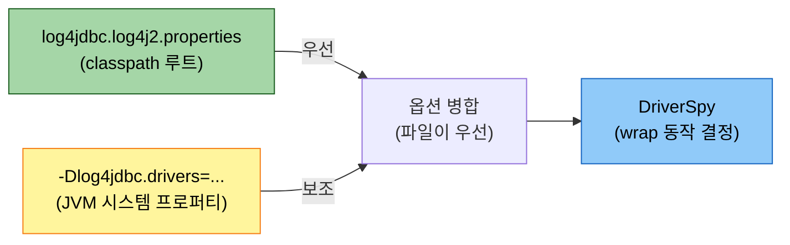
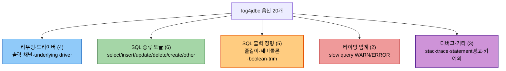

# log4jdbc properties 레퍼런스

---

> 이 문서를 읽고 나면, `log4jdbc.log4j2.properties`에 설정 가능한 공식 옵션 20개를 카테고리별로 짚을 수 있고, slow query 임계·SQL 종류 토글·SQL 정형화 옵션을 각각 언제 켤지 판단할 수 있습니다.

`04-02`가 "운영에서 자주 만지는 6개"를 골라 다뤘다면, 본 문서는 **공식 문서에 정의된 20개 전부**를 한 곳에 모은 레퍼런스입니다. 출처는 원본 라이브러리 [arthurblake/log4jdbc README](https://github.com/arthurblake/log4jdbc/blob/master/README.md)이며, querydsl-practice가 실제 쓰는 [dvarrazzo/log4jdbc-log4j2](https://github.com/dvarrazzo/log4jdbc-log4j2) fork는 이 옵션 세트를 그대로 상속합니다.


## 1. properties가 적용되는 위치 — 파일 vs 시스템 프로퍼티

> log4jdbc 옵션은 classpath 루트의 properties 파일 또는 JVM 시스템 프로퍼티(`-D`)로 지정합니다. 둘 다 있으면 **파일이 우선**합니다.

옵션이 `DriverSpy`에 도달하는 경로를 그리면, 설정 소스가 어디든 결국 한 곳으로 모입니다.



파일명은 fork에 따라 다릅니다. 원본 log4jdbc는 `log4jdbc.properties`, querydsl-practice가 쓰는 log4j2 fork는 `log4jdbc.log4j2.properties`를 classpath 루트(예: `src/main/resources/`, `src/test/resources/`)에서 찾습니다. 키 이름과 의미는 두 fork가 같습니다. 출처는 [arthurblake/log4jdbc README의 Configuration 섹션](https://github.com/arthurblake/log4jdbc/blob/master/README.md)입니다.


## 2. 전체 20개 옵션 — 카테고리별 한눈에

> 20개를 5개 카테고리(라우팅·드라이버 / SQL 종류 토글 / SQL 출력 정형 / 타이밍 임계 / 디버그·기타)로 묶으면 "무엇을 제어하는 옵션인지"가 한눈에 잡힙니다.



20개 전체 표입니다. 모든 키는 `log4jdbc.` prefix가 붙습니다(표에서는 생략). 기본값·타입은 [arthurblake/log4jdbc README](https://github.com/arthurblake/log4jdbc/blob/master/README.md) 기준입니다.

| 키 (`log4jdbc.` 생략) | 타입 | 기본값 | 카테고리 | 한 줄 용도 |
|----------------------|------|--------|----------|-----------|
| `spylogdelegator.name` | String | `Slf4jSpyLogDelegator` | 라우팅 | 출력 delegator 교체 (채널 구조 결정) |
| `drivers` | String | (없음) | 드라이버 | wrap할 underlying JDBC driver 명시 |
| `auto.load.popular.drivers` | Boolean | `true` | 드라이버 | 유명 driver 자동 탐색 on/off |
| `debug.stack.prefix` | String | (없음) | 디버그 | 콜스택 로그에서 앱 코드만 남길 패키지 prefix |
| `sqltiming.warn.threshold` | Integer(ms) | (없음) | 타이밍 | 이 시간 초과 SQL을 WARN으로 |
| `sqltiming.error.threshold` | Integer(ms) | (없음) | 타이밍 | 이 시간 초과 SQL을 ERROR로 |
| `dump.booleanastruefalse` | Boolean | `false` | 정형 | boolean을 `true`/`false`로 (기본은 1/0) |
| `dump.sql.maxlinelength` | Integer | `90` | 정형 | SQL 줄바꿈 최대 길이, `0`이면 한 줄 |
| `dump.fulldebugstacktrace` | Boolean | `false` | 디버그 | 디버그 모드에서 전체 스택트레이스 |
| `dump.sql.select` | Boolean | `true` | SQL토글 | SELECT 로깅 |
| `dump.sql.insert` | Boolean | `true` | SQL토글 | INSERT 로깅 |
| `dump.sql.update` | Boolean | `true` | SQL토글 | UPDATE 로깅 |
| `dump.sql.delete` | Boolean | `true` | SQL토글 | DELETE 로깅 |
| `dump.sql.create` | Boolean | `true` | SQL토글 | CREATE 로깅 |
| `dump.sql.other` | Boolean | `true` | SQL토글 | 위 5종 외 SQL 로깅 |
| `dump.sql.addsemicolon` | Boolean | `false` | 정형 | 로깅 SQL 끝에 세미콜론 추가 |
| `statement.warn` | Boolean | `false` | 기타 | `Statement` 사용 시 경고 표시 |
| `trim.sql` | Boolean | `true` | 정형 | SQL 앞뒤 공백 제거 |
| `trim.sql.extrablanklines` | Boolean | `true` | 정형 | 연속 빈 줄을 한 줄로 축소 |
| `suppress.generated.keys.exception` | Boolean | `false` | 기타 | `getGeneratedKeys()` 예외 무시 |

> 기본값 주의 한 가지 — `dump.sql.maxlinelength`의 공식 **기본값은 90**입니다. [04-02 §4](04-02.log4jdbc%20로그%20제어%20베스트%20프랙티스.md)는 권장값으로 `0`(한 줄 출력, grep 친화)을 제시했는데, 그건 권장값이지 기본값이 아닙니다. 둘을 구분해서 기억합니다.


## 3. 라우팅·드라이버 (4개)

> 출력이 어느 채널로 나가고 어떤 underlying driver를 wrap하는지를 정하는 토대 옵션입니다.

- `spylogdelegator.name` — 출력 delegator를 교체합니다. 기본 `Slf4jSpyLogDelegator`는 `jdbc.audit`/`sqlonly`/`sqltiming`/`resultset`/`connection` 5채널로 logger를 나눠 출력하고, `Log4j2SpyLogDelegator`는 `log4jdbc.log4j2` 단일 채널로 합칩니다. 두 delegator의 채널 구조 차이와 선택 기준은 [04-01 §3](04-01.JDBC%20드라이버%20wrap%20로깅의%20운영%20비용.md)에서 자세히 다룹니다. (원본 키는 `spylogdelegator`이지만 log4j2 fork·실측에서는 `.name` 접미사를 씁니다.)
- `drivers` — wrap할 underlying 실제 JDBC driver를 쉼표로 명시합니다. `auto.load.popular.drivers=false`와 짝으로 써서 의존성을 의도로 박는 패턴이 운영 위생의 기본입니다.
- `auto.load.popular.drivers` — 기본 `true`면 mysql·oracle·postgres·mariadb 등을 자동 탐색해 부팅 로그에 "could not be loaded" 잡음을 남깁니다. 흔한 실수와 정정은 [04-01 §5](04-01.JDBC%20드라이버%20wrap%20로깅의%20운영%20비용.md)에 박제돼 있습니다.
- `debug.stack.prefix` — `dump.fulldebugstacktrace`로 콜스택을 찍을 때, 이 패키지 prefix에 해당하는 프레임만 남겨 커넥션 풀 내부 호출을 걸러냅니다. 예: `-Dlog4jdbc.debug.stack.prefix=com.example.myapp`.


## 4. SQL 종류 토글 (6개)

> `dump.sql.select`/`insert`/`update`/`delete`/`create`/`other` 6개로 SQL 종류별 출력을 켜고 끕니다. 전부 기본 `true`라 특정 종류만 끄는 용도입니다.

폴러형 워크로드가 같은 SELECT를 분당 수천 번 발행하는 환경에서는 `dump.sql.select=false`로 SELECT만 꺼서 노이즈를 줄이는 선택이 가치 있습니다. INSERT/UPDATE/DELETE 같은 상태 변경 SQL은 남기고 조회만 끄는 식입니다.

```properties
# 폴러 0건 SELECT 노이즈만 끄고 변경 SQL은 남김
log4jdbc.dump.sql.select = false
# insert/update/delete/create/other 는 기본 true 라 그대로 출력됨
```

여기서 `dump.sql.other`는 위 5종(SELECT/INSERT/UPDATE/DELETE/CREATE)으로 시작하지 않는 나머지 SQL을 가리킵니다. `ALTER`, `TRUNCATE`, 벤더 전용 구문 등이 여기 해당합니다. 단 SQL 종류 토글은 *로그 양*만 줄일 뿐, wrap 채널이 만드는 audit/resultset/connection 라인까지 끄지는 못합니다. 그 라인까지 외과적으로 차단하려면 logback EvaluatorFilter가 필요하며, 결정 매트릭스는 [04-02 §6](04-02.log4jdbc%20로그%20제어%20베스트%20프랙티스.md)에서 다룹니다.


## 5. SQL 출력 정형 (5개)

> SQL 한 줄이 콘솔에 찍히는 모양을 다듬는 옵션입니다. 로그 양이 아니라 *가독성·도구 친화성*을 바꿉니다.

- `dump.sql.maxlinelength` — SQL을 몇 자에서 줄바꿈할지. 기본 `90`이라 긴 SQL이 여러 줄로 쪼개집니다. `0`으로 두면 줄바꿈 없이 한 줄로 출력돼 `grep`·`awk` 같은 라인 단위 도구와 궁합이 좋습니다.
- `dump.sql.addsemicolon` — 로깅 SQL 끝에 `;`를 붙입니다. 로그에서 SQL을 복사해 콘솔에 바로 붙여 실행할 때 편합니다.
- `dump.booleanastruefalse` — boolean 파라미터를 `1`/`0` 대신 `true`/`false`로 출력합니다. 바인딩 값을 사람이 읽을 때 직관적입니다.
- `trim.sql` — SQL 앞뒤 공백을 제거합니다. 기본 `true`라 보통 그대로 둡니다.
- `trim.sql.extrablanklines` — SQL 안의 연속 빈 줄을 한 줄로 축소합니다. 멀티라인 SQL 템플릿이 만든 빈 줄 노이즈를 줄입니다.

```properties
# grep 친화 + 복붙 실행 친화 조합
log4jdbc.dump.sql.maxlinelength = 0
log4jdbc.dump.sql.addsemicolon = true
log4jdbc.dump.booleanastruefalse = true
```


## 6. 타이밍 임계 (2개)

> `sqltiming.warn.threshold`/`sqltiming.error.threshold`는 SQL 실행 시간이 임계를 넘으면 그 로그를 WARN/ERROR 레벨로 끌어올립니다. slow query를 로그 레벨만으로 골라내는 가장 가벼운 방법입니다.

기본값이 없어서(미설정) 평소엔 동작하지 않습니다. 값을 주면 그 시간(ms)을 초과한 SQL만 상위 레벨로 승격됩니다.

```properties
# 500ms 넘으면 WARN, 2초 넘으면 ERROR 로 승격
log4jdbc.sqltiming.warn.threshold = 500
log4jdbc.sqltiming.error.threshold = 2000
```

이 패턴의 가치는 *로그 레벨 필터만으로 slow query를 분리*할 수 있다는 점입니다. 운영 로그를 WARN 이상만 수집하도록 설정해 두면, 느린 SQL이 자동으로 수집 대상에 들어옵니다. 별도 APM 없이 임계 기반 slow query 감지를 붙이는 최소 비용 방법이며, 출처는 [arthurblake/log4jdbc README의 SQL Timing 섹션](https://github.com/arthurblake/log4jdbc/blob/master/README.md)입니다.


## 7. 디버그·기타 (3개)

> 평소엔 잘 안 켜지만 특정 상황에서 유용한 옵션 셋입니다.

- `dump.fulldebugstacktrace` — 각 SQL이 *코드 어디서* 호출됐는지 전체 스택트레이스를 같이 찍습니다. 로그 양이 폭발하므로 디버깅 시에만 임시로 켜고, `debug.stack.prefix`(§3)와 짝지어 앱 코드 프레임만 남깁니다.
- `statement.warn` — `PreparedStatement` 대신 `Statement`를 쓸 때 경고를 띄웁니다. SQL 인젝션 위험이 있는 `Statement` 사용처를 코드베이스에서 찾아낼 때 켭니다.
- `suppress.generated.keys.exception` — `Statement.getGeneratedKeys()`가 던지는 예외를 무시합니다. 일부 driver가 이 메서드를 제대로 지원하지 않아 발생하는 예외를 우회할 때만 씁니다.


## 8. querydsl-practice 실측 — 최소 설정 4줄 읽기

> 실측 `log4jdbc.log4j2.properties`는 20개 중 **4개만** 명시하고 나머지 16개는 기본값에 맡깁니다. "꼭 필요한 것만 쓴다"는 운영 위생의 한 예입니다.

querydsl-practice의 실측 파일 본문입니다.

```properties
# 1) Routing engine.
# Slf4jSpyLogDelegator  -> 5 channels (jdbc.audit / sqlonly / sqltiming / resultset / connection)
# Log4j2SpyLogDelegator -> 1 channel  (log4jdbc.log4j2). Requires log4j-api + log4j-to-slf4j.
log4jdbc.spylogdelegator.name = net.sf.log4jdbc.log.slf4j.Slf4jSpyLogDelegator

# 2) One SQL = one line (grep/awk friendly)
log4jdbc.dump.sql.maxlinelength = 0

# 3) Disable auto driver scan (removes "could not be loaded" noise)
log4jdbc.auto.load.popular.drivers = false

# 4) Underlying real JDBC driver. NEVER set DriverSpy here (infinite loop).
log4jdbc.drivers = org.postgresql.Driver
```

이 4줄이 20개 중 무엇을 쓰고 무엇을 기본값에 맡기는지 분해하면 다음과 같습니다.

| 명시한 키 | 값 | 기본값 대비 |
|-----------|-----|------------|
| `spylogdelegator.name` | `Slf4jSpyLogDelegator` | 기본값과 같음 (명시적 선언) |
| `dump.sql.maxlinelength` | `0` | 기본 `90` → 한 줄 출력으로 변경 |
| `auto.load.popular.drivers` | `false` | 기본 `true` → 자동 탐색 끔 |
| `drivers` | `org.postgresql.Driver` | 기본 없음 → underlying 명시 |

나머지 16개는 손대지 않습니다. SQL 종류 토글 6개는 전부 기본 `true`라 모든 SQL이 출력되고, 타이밍 임계 2개는 미설정이라 slow query 승격이 없으며, 정형 옵션도 `maxlinelength` 하나만 바꿉니다. 학습·디버깅 환경이라 "다 보이게" 두고 줄바꿈만 grep 친화로 바꾼 셈입니다. 운영 환경이라면 §4 SQL 토글이나 §6 타이밍 임계를 추가로 검토하게 됩니다.


## 관련 문서

- [JDBC 드라이버 wrap 로깅의 운영 비용](04-01.JDBC%20드라이버%20wrap%20로깅의%20운영%20비용.md) — §3 delegator 2갈래 채널 구조, §5 driver 미스매치 흔한 실수
- [log4jdbc 로그 제어 베스트 프랙티스](04-02.log4jdbc%20로그%20제어%20베스트%20프랙티스.md) — §4 운영에서 자주 만지는 6개 발췌, §6 EvaluatorFilter로 wrap 라인까지 차단

## 참고 자료

- [arthurblake/log4jdbc](https://github.com/arthurblake/log4jdbc) — 원본 라이브러리. properties 정의·기본값의 1차 자료
- [arthurblake/log4jdbc README](https://github.com/arthurblake/log4jdbc/blob/master/README.md) — Configuration·SQL Timing·Output Formatting 섹션에 전체 옵션 설명
- [dvarrazzo/log4jdbc-log4j2](https://github.com/dvarrazzo/log4jdbc-log4j2) — querydsl-practice가 쓰는 log4j2 fork (`log4jdbc.log4j2.properties` 파일명)
