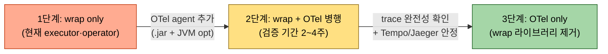

# OTel JDBC 졸업 경로

---

> **이 문서를 읽고 나면, wrap 라이브러리(log4jdbc · p6spy · datasource-proxy)에서 OpenTelemetry JDBC auto-instrumentation 으로 옮기는 3단계 마이그레이션 경로를 그릴 수 있고, 각 단계에서 wrap 을 *언제 끌 수 있는가* 의 결정 기준 4조건을 체크할 수 있으며, wrap 로그 한 줄과 OTel span 한 건의 정보 비교로 졸업 가치를 판단할 수 있다.**
>
> `04-01` 이 *wrap 라이브러리의 운영 비용* 을, `04-02` 가 *그 비용을 logback 으로 잠그는 4 레이어 결정* 을 다뤘다면, 본 문서는 *영구히 그 결정을 안 해도 되는 자리로 가는 졸업 경로* 입니다.
>
> - wrap 라이브러리의 세 가치(SQL 본문 평문 출력·바인딩 파라미터 치환·실행 시간 측정) 가 OTel JDBC auto-instrumentation 으로 어떻게 trace 데이터로 대체되는지 비교합니다.
> - wrap only → wrap+OTel 병행 → OTel only 3단계와 각 단계 검증 체크리스트를 정리합니다.
> - 바인딩 파라미터 가시성·sampling·collector 인프라 비용 같은 *졸업 전환점의 결정 기준* 을 박습니다.


## 1. 왜 OTel 로 졸업하는가

wrap 라이브러리의 가치는 결국 세 가지 — SQL 본문 평문 출력, 바인딩 파라미터 치환, 실행 시간 측정. 이 세 가지를 OpenTelemetry JDBC auto-instrumentation 이 모두 대체합니다. OTel agent 가 `Statement.executeQuery` 같은 호출을 자동 가로채 span 을 만들고 `db.statement` attribute 에 SQL 평문, span duration 에 실행 시간을 넣습니다.

OTel 로 옮기면 wrap 라이브러리를 끄는 결정이 합리화됩니다. 메트릭은 Prometheus·Tempo·Jaeger 어디서든 같은 span 으로 보고, 로그가 아니라 trace 데이터로 SQL 흐름을 봅니다. 콘솔/파일 로그는 진짜 사람이 읽는 로그 (애플리케이션 비즈니스 이벤트, 에러) 만 남습니다. wrap 라이브러리는 "관찰가능성 도구가 없던 시절의 임시방편" 위치로 내려갑니다.

§6 (`04-01` §6) 같은 사고 — 분당 수천 줄의 wrap 로그가 진짜 에러 신호를 묻고 인덱스를 부풀리는 — 가 *구조적으로 발생하지 않는 종착점* 이 OTel 입니다.


## 2. wrap 로그 한 줄 vs OTel span 한 건 — 같은 SQL 이 어떻게 표현되는가

같은 `SELECT * FROM users WHERE id = 42` 한 번이 두 도구에서 어떻게 다르게 표현되는지 박제합니다.

**wrap (log4jdbc, 콘솔/파일 로그):**

```text
INFO  log4jdbc.log4j2 - 1. SELECT * FROM users WHERE id = 42   {executed in 3 msec}
```

텍스트 한 줄. grep·awk 로 찾고 사람 눈으로 읽음. 폴러 워크로드면 분당 수천 줄 누적.

**OTel JDBC auto-instrumentation (Tempo/Jaeger span):**

```json
{
  "traceId": "1a2b3c4d5e6f7890",
  "spanId": "abcdef1234567890",
  "parentSpanId": "0987654321fedcba",
  "name": "SELECT users",
  "kind": "CLIENT",
  "startTime": "2026-05-19T13:42:00.128Z",
  "endTime": "2026-05-19T13:42:00.131Z",
  "duration": "3ms",
  "attributes": {
    "db.system": "mariadb",
    "db.name": "TPS",
    "db.connection_string": "jdbc:mariadb://prd-db:3306/TPS",
    "db.user": "trbuser",
    "db.statement": "SELECT * FROM users WHERE id = ?",
    "db.operation": "SELECT",
    "db.sql.table": "users",
    "net.peer.name": "prd-db",
    "net.peer.port": 3306,
    "thread.name": "http-nio-8091-exec-3"
  },
  "status": { "code": "OK" }
}
```

같은 정보가 구조화된 attribute 로 박힙니다. Tempo/Jaeger UI 에서 traceId 로 검색하면 *이 SQL 이 어떤 HTTP 요청에서 호출됐는지·다른 SQL 과 어떻게 묶여 있는지* 가 함께 보입니다.

두 표현의 운영 비용을 한 표로 비교:

| 항목 | wrap 로그 | OTel span |
|------|----------|----------|
| 표현 형식 | 텍스트 한 줄 | 구조화 JSON span |
| 저장 위치 | 콘솔/파일 logback appender | Tempo/Jaeger/OTLP collector |
| 검색 방법 | `grep "SELECT users"` | trace UI 또는 PromQL/TraceQL |
| 부모 컨텍스트 | thread name 매칭으로 추론 | `parentSpanId` 로 명시 연결 |
| 바인딩 값 가시성 | 평문 (보안 default 위반) | `db.statement.parameters` 옵션 활성 필요 |
| 폴러 워크로드 누적 | 분당 수천 줄 → 디스크/grep 부담 | sampling 으로 조절 (예: 1% 만 추적) |

wrap 의 *바인딩 평문 가시성* 이 가장 큰 장점이자 OTel 졸업의 결정적 분기점입니다. OTel 의 `otel.instrumentation.jdbc.statement-sanitizer.enabled=false` 또는 동등 옵션으로 바인딩 노출을 켤 수 있지만, 보안 정책상 PII (개인정보) 가 trace 에 박히는 게 허용되지 않는 환경에서는 wrap 의 디버깅 가치가 그대로 유지됩니다 — 그래서 wrap+OTel 병행 단계 (§3.2) 가 현실적인 균형이 됩니다.


## 3. 마이그레이션 3단계

wrap 라이브러리에서 OTel 로 옮기는 경로는 한 번에 갈아끼우는 게 아니라 *3단계 직렬 진행* 입니다.



### 3.1 1단계 — wrap only (현재 상태)

executor·operator 의 현재 상태입니다. `DriverSpy` + logback 차단으로 운영 위생을 유지. `04-02` §3~§9 가 이 단계의 운영 매뉴얼입니다.

### 3.2 2단계 — wrap + OTel 병행 (검증 기간)

OTel agent 를 추가하되 wrap 라이브러리는 그대로 둡니다. 검증 체크리스트:

- [ ] OTel agent jar (~30MB) 가 컨테이너 이미지에 포함되는가
- [ ] JVM 옵션 `-javaagent:/path/to/opentelemetry-javaagent.jar` 가 모든 환경(dev/stg/prd) 에 반영되는가
- [ ] env 변수 `OTEL_SERVICE_NAME`, `OTEL_EXPORTER_OTLP_ENDPOINT`, `OTEL_TRACES_EXPORTER`, `OTEL_RESOURCE_ATTRIBUTES` 4개가 set 되는가
- [ ] Tempo/Jaeger 에서 `db.statement` attribute 가 채워진 span 이 보이는가
- [ ] wrap 로그와 OTel trace 가 *같은 SQL 을 모두 잡는지* 샘플 5~10개 비교

검증 기간은 보통 2~4주. trace 완전성과 collector 안정성을 모두 확인한 뒤에만 3단계로 갑니다.

### 3.3 3단계 — OTel only

wrap 라이브러리 제거. 단 *완전 제거* 와 *비활성화* 두 갈래로 갈립니다.

| 옵션 | 변경 | 위험 |
|------|------|------|
| **비활성화 (권장)** | yml `driver-class-name: org.mariadb.jdbc.Driver` + URL 접두사 제거. log4jdbc 의존성은 build 에 남김 | 롤백 시 yml 한 줄 변경으로 복귀 |
| **완전 제거** | build.gradle 에서 `log4jdbc-log4j2-jdbc4.1` 의존성 삭제 + properties 파일 삭제 | 롤백 시 의존성 추가·이미지 재빌드 필요 |

신규 서비스라면 처음부터 OTel only. 기존 서비스는 *비활성화* 로 시작해 *6개월 안정 운영* 후 완전 제거가 권장 흐름입니다.


## 4. wrap 을 끄는 시점 결정 기준

각 단계에서 *wrap 을 꺼도 되는가* 의 체크리스트:

- (a) Tempo/Jaeger 에서 직전 24시간 SQL trace 가 모두 잡히는가 — `count(distinct db.statement) > X`
- (b) OTel sampling rate 가 100% 또는 폴러 trace 가 누락되지 않을 만큼 충분한가
- (c) trace UI 에서 *바인딩 파라미터* 가 보이는가 — `db.statement.parameters` attribute 활성화 필요
- (d) 운영팀이 wrap 로그 보던 모니터링 dashboard 를 OTel 기반으로 이미 옮겼는가

네 조건이 모두 yes 일 때만 wrap 비활성화. 한 조건이라도 no 면 2단계 유지입니다.


## 5. 도입 비용 — 왜 한 분기 단위 작업인가

OTel JDBC auto-instrumentation 한 가지만 켜려면 다음 세 가지가 필요합니다.

- (a) `opentelemetry-javaagent.jar` 다운로드 (약 30MB) → 컨테이너 이미지·k8s deployment·CI 빌드 산출물 셋 다 영향
- (b) JVM 옵션 `-javaagent:/path/to/opentelemetry-javaagent.jar` 추가 + `OTEL_SERVICE_NAME`·`OTEL_EXPORTER_OTLP_ENDPOINT` 같은 env 6~8개 설정
- (c) collector(또는 Tempo/Jaeger 직접) 인프라 준비

사내 Observability 팀과 협업 없이 시작하면 (c) 가 보통 2~4주 걸리고, 인프라 비용도 trace ingestion 양에 따라 월 수십~수백만원 단위로 추가됩니다.

비교 — wrap + EvaluatorFilter 패치는 이미 깔린 logback 위에서 *config 10줄과 dev 부팅 1회 검증* 으로 끝나므로, 폴러 1~2개 서비스에서 *지금 폭주를 멈추는 것* 이 목표면 wrap 패치가 한 자릿수 시간 단위, OTel 졸업은 한 분기 단위 작업입니다. 두 갈래는 *대체* 가 아니라 *직렬* 로 봅니다 — 지금은 wrap 패치, 다음 분기는 OTel 마이그레이션.


## 6. 면접 대비 요약

> wrap 라이브러리에서 OTel 로 가는 3단계 + 졸업 4조건을 *그림 없이 말로 설명할 수 있는 수준* 까지 압축합니다. 한 줄 정의는 *trace 데이터가 SQL 로그를 완전히 대체하는 자리* 이며, 핵심 포인트는 정보 표현 차이·3단계 마이그레이션·바인딩 가시성 전환점입니다.

### 한 줄 정의

OTel JDBC 졸업이란 wrap 라이브러리가 콘솔/파일 로그로 남기던 SQL 본문·바인딩·실행 시간 세 가지 가치를 OpenTelemetry JDBC auto-instrumentation 의 구조화된 trace span 으로 대체하고, wrap 라이브러리를 *비활성화 또는 완전 제거* 하는 단계적 마이그레이션입니다.

### 핵심 포인트 3가지

1. **정보 표현이 텍스트 한 줄에서 구조화 span 으로 바뀐다.** wrap 로그는 `grep "SELECT users"` 로 찾고 사람 눈으로 읽는 텍스트 한 줄이지만, OTel span 은 `db.statement`·`db.operation`·`db.sql.table`·`thread.name` 같은 명시적 attribute 와 `parentSpanId` 로 묶인 trace context 를 가진 구조화 JSON 입니다. trace UI 에서 *어떤 HTTP 요청의 어떤 SQL 인지* 가 한 화면에 박힙니다.

2. **마이그레이션은 3단계 직렬이다.** wrap only → wrap+OTel 병행 → OTel only. 병행 단계가 2~4주 검증 기간이고, 3단계 진입 전에 trace 완전성·sampling rate·바인딩 가시성·dashboard 이관 4조건을 모두 충족해야 합니다. 신규 서비스는 1단계 건너뛰고 처음부터 OTel only 도 합리적입니다.

3. **바인딩 파라미터 가시성이 전환점이다.** OTel JDBC 의 기본 설정은 `db.statement` 에 평문 SQL 만 넣고 바인딩 값은 빼는데(보안 default), wrap 라이브러리는 바인딩 치환된 평문을 한 줄에 같이 찍어 디버깅이 쉽습니다. `otel.instrumentation.jdbc.statement-parameter-names.enabled=true` 같은 옵션으로 바인딩 노출을 켤 수 있지만, *팀 보안 정책상 허용되는지* 가 졸업 시점의 결정 포인트입니다.

### 자주 묻는 질문

**Q. OTel 졸업의 결정적인 전환점은 무엇인가요?**
A. *바인딩 파라미터 가시성* 이 분기점입니다. OTel JDBC auto-instrumentation 의 기본 설정은 `db.statement` 에 평문 SQL 만 넣고 바인딩 값은 빼는데(보안 default), wrap 라이브러리는 바인딩 치환된 평문을 한 줄에 같이 찍어 디버깅이 쉽습니다. OTel agent 의 `otel.instrumentation.jdbc.statement-parameter-names.enabled=true` 또는 동등 옵션으로 바인딩 노출을 켜고, 그게 *팀의 보안 정책상 허용되는지* 확인한 시점이 졸업 전환점입니다. 허용되지 않으면 wrap+OTel 병행을 유지하며 wrap 은 차단한 채 디버깅용 dev 환경에만 풀어두는 변형이 일반적입니다.

**Q. wrap+OTel 병행 단계에서 두 도구가 같은 SQL 을 중복 출력하지 않나요?**
A. 출력 채널이 분리돼 있어 중복으로 *보이지 않습니다*. wrap 은 logback appender 로 콘솔/파일에, OTel 은 OTLP exporter 로 collector(Tempo/Jaeger)에 보냅니다. 같은 SQL 이 두 곳에 동시에 기록되지만 *읽는 자리* 가 다르므로 운영 부담은 *디스크 + collector 양쪽* 으로 갈립니다. 검증 기간이 길어지면 디스크 부담만 누적되므로 2~4주 안에 3단계로 가는 것이 권장됩니다.

**Q. 폴러 워크로드의 OTel trace 가 너무 많이 쌓이지 않나요?**
A. sampling 으로 조절합니다. wrap 로그는 *모든 호출을 1:1 로 남기는* 모델이라 폴러가 500ms 마다 돌면 분당 수천 줄이 누적되지만, OTel 은 sampling rate 를 1%·5%·10% 로 설정해 collector ingestion 양을 직접 조절할 수 있습니다. polling 워크로드는 *같은 SQL 이 반복* 되므로 sampling 1% 만으로도 *어떤 SQL 이 어떤 빈도로 도는지* 가 통계적으로 보입니다. 단 *희귀하게 실패하는 SQL* 을 잡으려면 tail-based sampling (실패 trace 만 100% 보존) 같은 고급 sampling 정책이 필요합니다.

**Q. wrap 라이브러리를 완전 제거하지 않고 비활성화만 권장하는 이유는?**
A. 롤백 비용이 한 줄과 한 분기의 차이입니다. 비활성화는 yml 의 `driver-class-name` 한 줄과 URL 접두사를 되돌리면 끝 — 의존성과 properties 파일은 그대로 남아 있어 *문제 발생 시 한 줄 변경으로 wrap 채널이 부활* 합니다. 완전 제거는 build.gradle 의존성 삭제 + 이미지 재빌드 + 배포 사이클이 필요해 빠른 롤백이 안 됩니다. 따라서 *6개월 OTel only 안정 운영* 후에만 완전 제거가 권장 흐름입니다.
