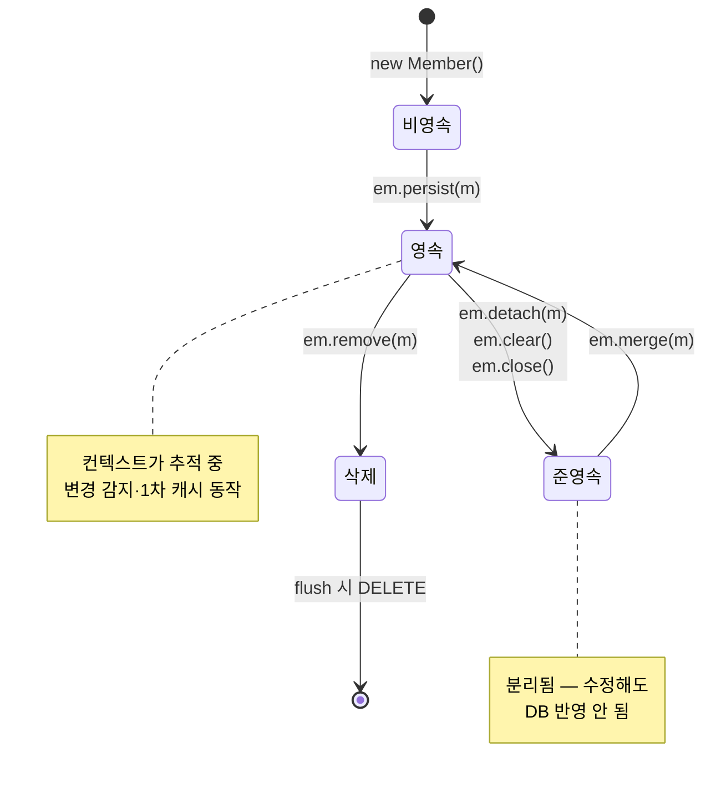
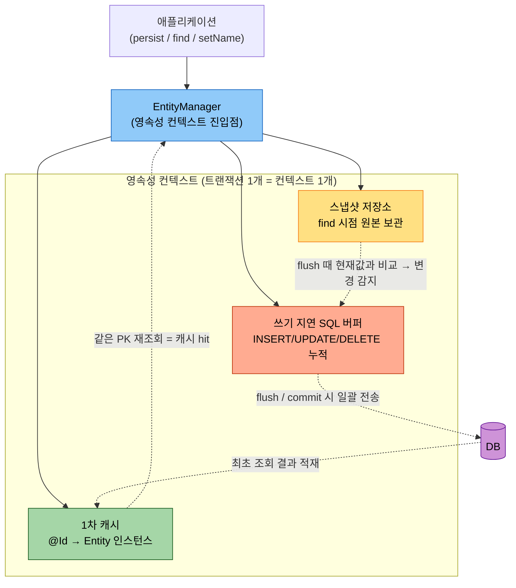
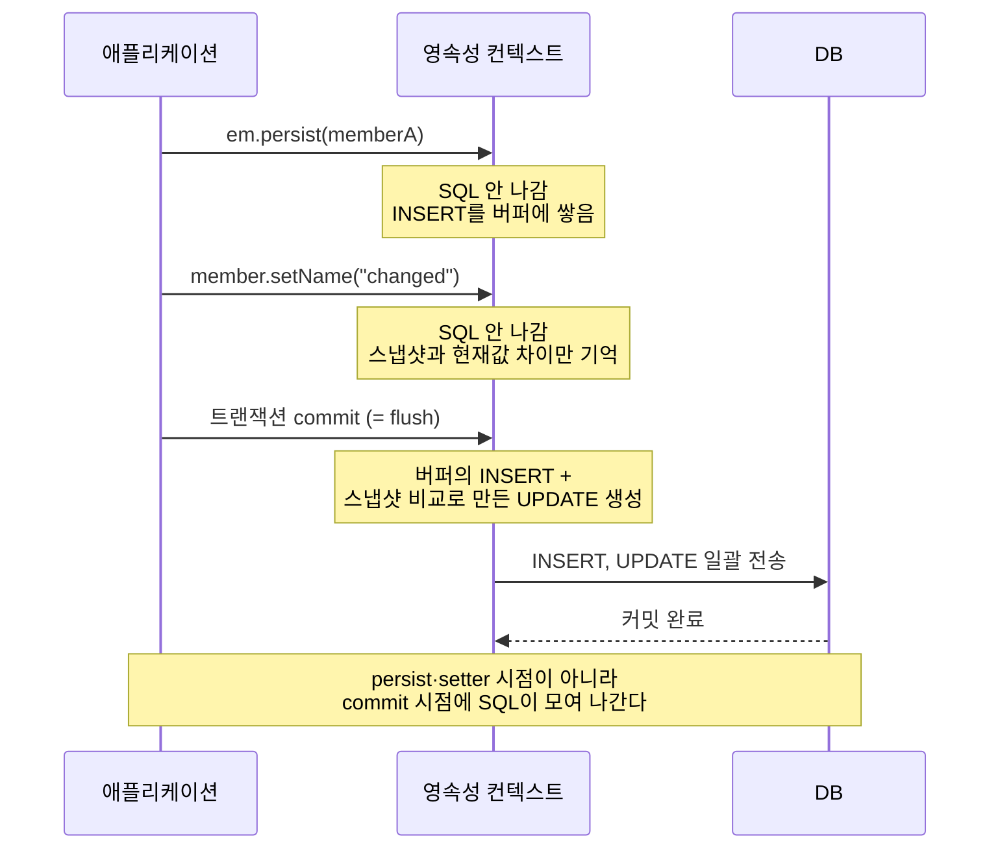
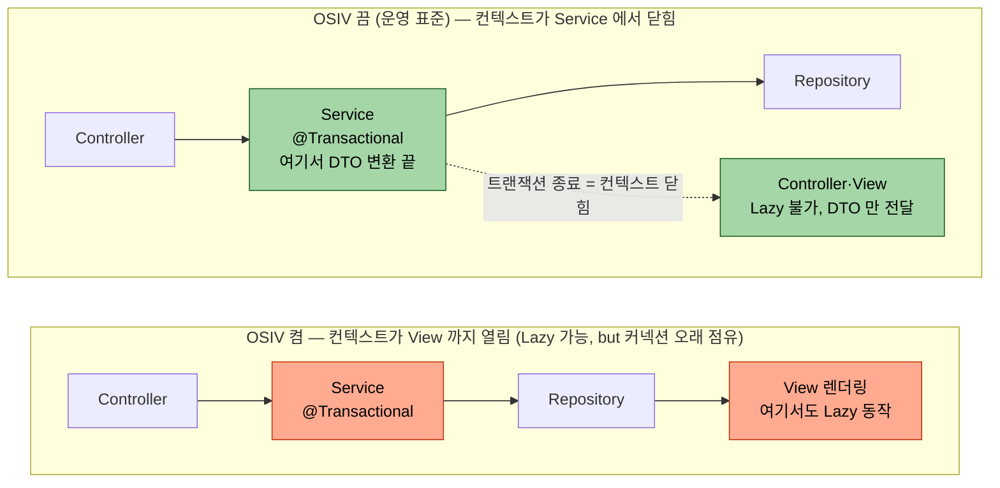

# JPA 시작과 영속성 컨텍스트
---
> **영속성 컨텍스트는 JPA 의 모든 마법의 출처다.** 
>
> 1차 캐시·동일성 보장·쓰기 지연·변경 감지가 모두 이 컨텍스트 위에서 일어난다. 컨텍스트의 동작을 이해하지 못하면 JPA 는 예측 불가능한 도구로 보인다.

## 1. EntityManager 의 기본 CRUD

> JPA 모든 동작의 진입점 — `persist`, `find`, `remove`, `merge` + JPQL.

```java
@Entity
public class Member {
    @Id @GeneratedValue
    private Long id;
    private String name;
    // ...
}

@PersistenceContext
EntityManager em;

@Transactional
public void crud() {
    Member m = new Member("alice");
    em.persist(m);              // INSERT
  
    Member found = em.find(Member.class, m.getId());   // SELECT (1차 캐시)
    found.setName("changed");   // UPDATE — 자동 (변경 감지)
    em.remove(found);           // DELETE
}
```

`persist`/`remove` 는 즉시 SQL 이 아니라 *컨텍스트 변경* 만 한다. SQL 은 flush 시점 (보통 트랜잭션 커밋 직전) 에 일괄 실행.


## 2. Entity 의 생명주기

> 같은 객체라도 컨텍스트와의 관계에 따라 네 상태로 갈린다.

| 상태 | 의미 | 어떻게 되는가 |
|------|------|--------------|
| 비영속 (new/transient) | `new` 로 만든 직후, 컨텍스트와 무관 | DB 영향 없음 |
| 영속 (managed) | `persist` 또는 `find` 후, 컨텍스트가 추적 | 변경이 자동 UPDATE |
| 준영속 (detached) | `detach`/`clear`/`close` 로 컨텍스트에서 분리 | 변경해도 DB 반영 없음 |
| 삭제 (removed) | `remove` 호출 후 | flush 시점에 DELETE |

```
new Member()              → 비영속
em.persist(m)             → 영속
em.detach(m) / em.clear() → 준영속
em.remove(m)              → 삭제
```

상태가 어떤 메서드 호출로 옮겨 가는지 화살표로 보면, 같은 객체가 컨텍스트와의 관계에 따라 어떻게 돌아다니는지 한눈에 들어온다. 

- **핵심은 *영속 상태일 때만* 변경 감지·1차 캐시가 동작한다는 점이다**. 
- 준영속으로 떨어지면 같은 객체를 수정해도 DB에 반영되지 않는다.




## 3. 영속성 컨텍스트의 다섯 가지 이점

> 영속 상태에서만 동작하는 다섯 기능이 JPA 의 핵심 가치.

다섯 기능을 따로 외우기 전에, 이들이 모두 *영속성 컨텍스트라는 한 공간 위에서* 일어난다는 점을 한 그림으로 잡아 둔다. 애플리케이션은 `EntityManager` 하나만 보고 명령하지만, 그 뒤에서 컨텍스트가 1차 캐시·스냅샷·SQL 버퍼를 동시에 굴린다.



이 그림을 머리에 두면 아래 다섯 절이 각각 *이 한 공간의 어느 부품* 을 설명하는지 보인다. 1차 캐시·동일성은 캐시 부품, 변경 감지는 스냅샷 부품, 쓰기 지연은 SQL 버퍼 부품의 이야기다.

### 3-1. 1차 캐시

```java
em.persist(member);             // PK=1 영속화
Member m1 = em.find(Member.class, 1L);   // 1차 캐시 hit — DB 안 감
```

- 같은 트랜잭션 안에서 같은 PK 조회는 한 번만 DB 에 간다. 두 번째부터는 캐시.

### 3-2. 영속 Entity 의 동일성 보장

```java
Member m1 = em.find(Member.class, 1L);
Member m2 = em.find(Member.class, 1L);
assertThat(m1 == m2).isTrue();   // 같은 인스턴스
```

- 자바 컬렉션처럼 `==` 비교가 가능. equals/hashCode 신경 안 써도 됨 (영속 상태에서만).

### 3-3. 트랜잭션을 지원하는 쓰기 지연

```java
@Transactional
public void batch() {
    em.persist(new Member("a"));
    em.persist(new Member("b"));
    em.persist(new Member("c"));
    // 아직 SQL 안 감
}
// 트랜잭션 커밋 시점에 INSERT 3개가 한 번에 전송 (batch insert)
```

- 쓰기 지연으로 DB 호출 횟수를 줄임. 옵션에 따라 진짜 batch SQL 까지.

### 3-4. 변경 감지 (Dirty Checking)

```java
@Transactional
public void update() {
    Member m = em.find(Member.class, 1L);
    m.setName("changed");
    // em.update(m) — 그런 메서드 없음
}
// 트랜잭션 커밋 시점에 UPDATE 자동 생성
```

- 영속 Entity 의 필드 변경이 자동으로 UPDATE SQL 로 변환. 이게 *"JPA 의 마법"* 의 핵심.

여기서 질문 하나 — 변경 감지의 원리는? `find` 시점에 스냅샷을 저장. flush 시점에 현재 값과 스냅샷을 비교, 다른 필드만 UPDATE.

쓰기 지연(3-3)과 변경 감지(3-4)는 따로 보면 헷갈리지만, *언제 SQL이 나가는가* 라는 한 축으로 보면 같은 이야기다. persist도 setter도 그 순간엔 SQL을 보내지 않고 컨텍스트에만 쌓아 두었다가, 커밋(또는 flush) 시점에 한꺼번에 내보낸다. 아래 흐름이 그 시간 순서다.



### 3-5. 지연 로딩 (Lazy Loading)

```java
Member m = em.find(Member.class, 1L);
m.getOrders();   // 이 시점에 SELECT orders WHERE member_id = 1
```

- 연관 객체를 *처음 접근* 할 때 SQL 실행. 자세히는 `./03-03.프록시와 N+1.md`.

## 4. 플러시 (flush)

> 컨텍스트의 변경을 DB 로 동기화 — 자동·수동.

### 자동 flush 시점:

1. 트랜잭션 커밋 직전.
2. JPQL 쿼리 실행 직전 (변경이 쿼리에 보여야 하므로).

### 수동 flush:

```java
em.flush();   // 강제로 지금 SQL 실행
em.clear();   // 1차 캐시 비움
```

테스트에서 *현재 변경을 DB 에 박고 캐시를 비워 다시 조회* 하는 패턴에 사용 (`../ops/02-02.테스트 트랜잭션.md`).

## 5. 영속성 컨텍스트의 수명

> 트랜잭션과 1:1 또는 1:다 — Spring 환경에서는 트랜잭션 단위가 표준.

| 환경 | 컨텍스트 수명 |
|------|--------------|
| 표준 JavaEE | 트랜잭션 단위 또는 요청 단위 |
| Spring (`@PersistenceContext`) | 트랜잭션 단위 (`@Transactional` 메서드 안) |
| OSIV (Open Session In View) 켬 | 컨트롤러 응답까지 — 뷰 렌더링 중 Lazy 가능 |

OSIV 가 켜 있으면 View 에서 Lazy 가 동작하지만 *컨트롤러까지 트랜잭션이 열려 있어* 부하 분산이 어려움. 운영 환경은 OSIV 끄고 DTO 변환을 Service 에서 마치는 것이 표준.

두 방식의 차이는 *컨텍스트(=DB 커넥션)가 어디서 닫히는가* 한 가지다. 같은 요청을 두 줄로 나란히 놓고 컨텍스트가 열려 있는 구간을 비교하면 왜 OSIV가 커넥션을 오래 붙잡는지 보인다.



OSIV 켬(위, 주황)은 뷰 렌더링까지 컨텍스트가 살아 있어 편하지만 그만큼 커넥션을 오래 쥔다. 끔(아래, 초록)은 Service 경계에서 컨텍스트를 닫고 DTO만 넘기므로 커넥션 점유 시간이 짧다 — 트래픽이 많은 운영 환경에서 이 차이가 커넥션 풀 고갈로 직결된다.

## 관련 문서

- [ORM 개념](./01-01.ORM%20개념.md)
- [엔티티 맵핑](./02-01.엔티티%20맵핑.md)
- [프록시와 N+1](./03-03.프록시와%20N%2B1.md)
