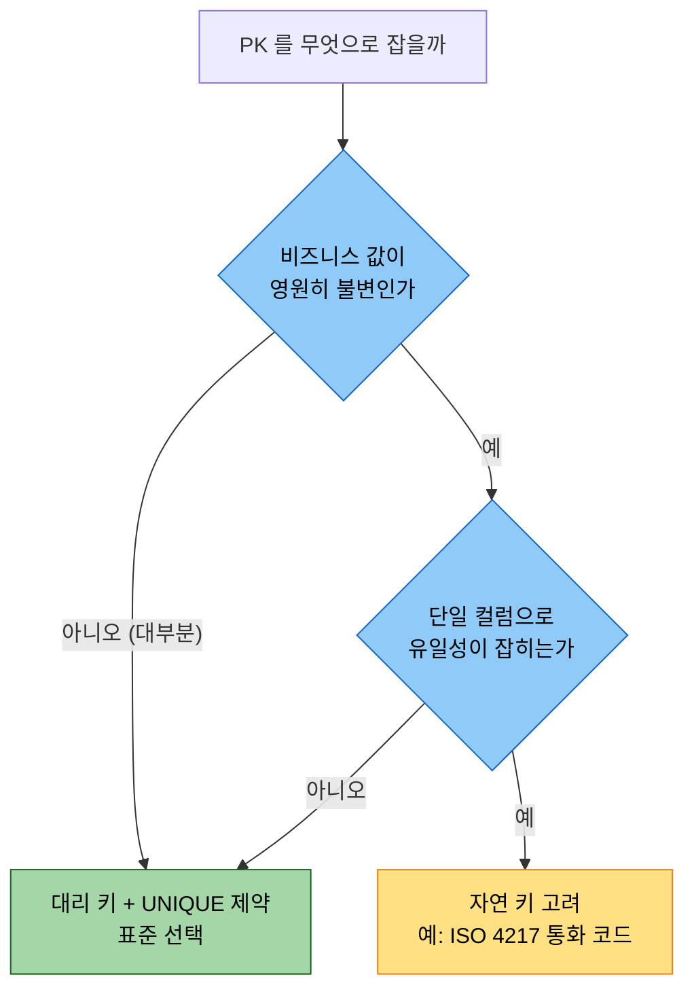
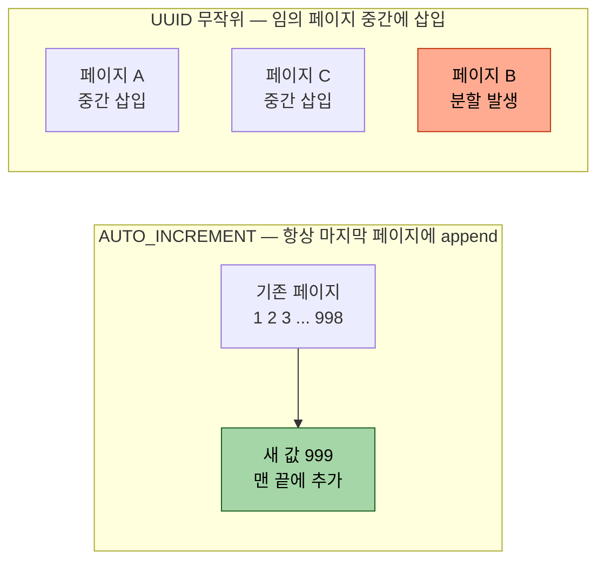

# 식별자 전략 — 자연 키 vs 대리 키
---
> Entity 의 PK 를 비즈니스 의미가 있는 컬럼(자연 키)으로 할지, 의미 없는 인공 컬럼(대리 키)으로 할지의 결정 — 이 한 가지가 모델의 유연성과 성능을 결정합니다.

## 진입 — 왜 식별자를 고민하는가

> 이 문서를 읽고 나면 자연 키와 대리 키의 트레이드오프를 그림 없이 설명하고, 주어진 테이블에 어떤 키 전략이 맞는지 근거를 들어 고를 수 있습니다.

식별자 선택은 테이블을 만드는 첫날 한 번 정하고 마는 결정처럼 보이지만, 실제로는 그 뒤 수년의 변경 비용을 좌우합니다. PK 를 잘못 잡으면 나중에 바꾸기가 가장 어렵기 때문입니다.

### 전 단계 — PK 를 비즈니스 값으로 잡았을 때의 비용 한 컷

```sql
-- 회원 PK 를 이메일(자연 키)로 잡은 테이블
CREATE TABLE member (
    email    VARCHAR(100) PRIMARY KEY,   -- 비즈니스 의미가 PK
    name     VARCHAR(50)
);
CREATE TABLE orders (
    order_id      BIGINT PRIMARY KEY,
    member_email  VARCHAR(100) REFERENCES member(email)   -- FK 가 이메일을 그대로 복제
);
```

회원이 이메일을 바꾸는 순간 `member.email` 하나만 바뀌는 게 아니라, 이 값을 복제해 둔 `orders.member_email` 을 비롯한 모든 참조 테이블의 FK 가 줄줄이 따라 바뀌어야 합니다. 변경 한 번이 여러 테이블의 대량 UPDATE 로 번지는 것, 이것이 식별자 선택이 늦게까지 비용을 청구하는 방식입니다.

### 이 글의 좌표

이 글은 "PK 를 무엇으로 잡을까"라는 한 칸을 다룹니다. PK 값을 *누가 어떻게 만들어 채우는가*(시퀀스·AUTO_INCREMENT 등)는 §4 키 생성 전략에서, PK 를 도메인 타입으로 감싸는 방법은 §5 에서 이어집니다.

## 1. 자연 키 (Natural Key)

> 비즈니스 도메인에서 이미 유일성이 보장된 값을 PK 로 그대로 쓰는 방식입니다 — 주민번호·이메일·ISBN.

```java
@Entity
public class Book {
    @Id
    private String isbn;   // 비즈니스 키를 그대로 PK 로
    private String title;
}
```

장점은 다음 두 가지입니다.

1. 추가 컬럼이 없어 저장 공간을 아낍니다. 이미 있는 비즈니스 값이 PK 역할을 겸하기 때문입니다.
2. 도메인 의미가 PK 에 직접 박혀 있어, 로그나 쿼리 결과만 봐도 어떤 데이터인지 바로 읽힙니다.

단점은 다음 세 가지이며, 실무에서는 이쪽이 더 무겁게 다가옵니다.

1. **변경 가능성** — 이메일 변경, 회사 이전, 정책 변경처럼 비즈니스 값은 언제든 바뀝니다. 바뀌면 진입부 예시처럼 FK 도 전부 따라 바뀌어야 합니다.
2. **노출 위험** — URL 이나 API 응답에 PK 가 실리면 주민번호 같은 민감 정보나 회사 내부 코드가 그대로 새어 나갑니다.
3. **결합 키** — 자연 키가 여러 컬럼의 조합(복합 키)이면, 그 키를 참조하는 모든 FK 도 같은 수의 컬럼을 복제해야 합니다.

## 2. 대리 키 (Surrogate Key)

> 비즈니스 의미가 전혀 없는 인공 컬럼을 PK 로 두는 방식입니다 — AUTO_INCREMENT·UUID·Sequence.

```java
@Entity
public class Book {
    @Id @GeneratedValue(strategy = IDENTITY)
    private Long id;        // 의미 없는 대리 키 — 변경될 일이 없음

    @Column(unique = true)
    private String isbn;    // 비즈니스 키는 살아 있되 PK 는 아님
    private String title;
}
```

장점은 자연 키의 단점을 그대로 뒤집은 형태입니다.

1. **불변** — 비즈니스 의미와 분리돼 있으니 어떤 정책이 바뀌어도 PK 값 자체는 바뀌지 않습니다.
2. **단순** — 어떤 Entity 든 PK 가 항상 단일 컬럼이라 FK 도 단순해집니다.
3. **노출 안전** — `/books/12345` 같은 URL 에 도메인 정보가 담기지 않습니다.

단점도 있습니다.

1. 의미 없는 컬럼이 한 칸 늘어납니다.
2. 자연 키의 UNIQUE 제약을 따로 걸어 줘야 합니다. 빠뜨리면 같은 ISBN 의 책이 중복 저장됩니다.

## 3. 자연 키 vs 대리 키 — 결정

> 결론부터 말하면 *거의 항상 대리 키 + UNIQUE 제약* 이 표준입니다. 자연 키의 변경 위험이 다른 모든 장점을 압도하기 때문입니다.

가장 먼저 던질 질문은 "이 비즈니스 값이 *영원히 안 바뀐다고 보장되는가*"입니다. 이 한 갈래가 전체 결정을 가릅니다.



같은 결정을 네 축으로 정량 비교하면 왜 대리 키로 기우는지가 더 또렷합니다.

| 축 | 자연 키 | 대리 키 |
|------|---------|---------|
| 변경 비용 | 값 변경 시 모든 FK 연쇄 변경 | 변경 없음 |
| 노출 안전성 | 도메인 정보 누출 위험 | 의미 없어 안전 |
| 모델 복합성 | 복합 키면 FK 도 복합 | 항상 단일 컬럼 |
| JPA 궁합 | 수동 할당·복합키 클래스 필요 | `@GeneratedValue` 로 자연스러움 |

**자연 키는 값이 진짜 불변임이 보장될 때만 쓰고, 그 외에는 대리 키 + UNIQUE 제약을 기본값으로 둡니다.** `ISO 4217` 통화 코드처럼 국제 표준으로 고정된 값이 자연 키가 정당한 드문 예입니다.

## 4. 키 생성 전략 (@GeneratedValue)

> 대리 키를 쓰기로 했다면, 그 값을 *누가 만들어 채우는가* 를 정해야 합니다. JPA 는 `@GeneratedValue` 의 네 전략으로 이를 표현합니다.

자연 키는 사람이 값을 알고 직접 넣지만, 대리 키는 의미가 없으니 누군가 자동으로 생성해 줘야 합니다. JPA 의 `@GeneratedValue(strategy = ...)` 가 그 생성 책임을 어디에 둘지 고르는 스위치입니다.

| 전략 | 값 생성 주체 | 동작 | 적합한 DB |
|------|-------------|------|-----------|
| `IDENTITY` | DB | INSERT 시 DB 의 자동 증가 컬럼이 값 부여 | MySQL·MariaDB(AUTO_INCREMENT) |
| `SEQUENCE` | DB 시퀀스 객체 | 시퀀스에서 다음 값을 받아 INSERT | PostgreSQL·Oracle |
| `TABLE` | 별도 키 테이블 | 키 전용 테이블의 행을 증가시켜 사용 | 모든 DB(범용, 느림) |
| `AUTO` | JPA 가 DB 방언 보고 위 중 택1 | 방언에 맞는 전략을 자동 선택 | 기본값 |

각 전략의 결정적 차이는 *INSERT 전에 PK 를 알 수 있는가* 입니다. `IDENTITY` 는 INSERT 가 끝나야 값을 알 수 있어, JPA 의 쓰기 지연(`./01-02.JPA 시작과 영속성 컨텍스트.md` §3-3)이 깨지고 영속화 시점에 곧바로 INSERT 가 나갑니다. 반면 `SEQUENCE` 는 INSERT 전에 시퀀스에서 값을 미리 받아 둘 수 있어 쓰기 지연과 배치 INSERT 가 살아 있습니다. 그래서 PostgreSQL 처럼 시퀀스를 지원하는 DB 에서는 `SEQUENCE` 가 성능상 유리합니다.

```java
@Entity
public class Order {
    @Id
    @GeneratedValue(strategy = GenerationType.SEQUENCE, generator = "order_seq")
    @SequenceGenerator(name = "order_seq", sequenceName = "SQ_ORDER", allocationSize = 50)
    private Long id;
}
```

`allocationSize = 50` 은 시퀀스를 한 번 호출할 때 50개의 값을 미리 받아 메모리에 쌓아 두라는 뜻입니다. INSERT 50건마다 시퀀스를 한 번만 호출하므로 네트워크 왕복이 줄어듭니다. 다만 애플리케이션이 재시작하면 받아 둔 남은 값이 버려져 PK 에 구멍(빈 번호)이 생깁니다. 대리 키는 의미가 없으니 구멍은 문제가 아닙니다.

## 5. ID 자체도 Value Object

> 대리 키를 `Long` 으로 날것 그대로 넘기지 말고, 의미 있는 ID 타입으로 감싸 도메인 어휘를 타입 시스템에 박습니다.

```java
public record MemberId(Long value) {}
public record OrderId(Long value) {}

// 나쁨 — 둘 다 Long 이라 순서를 바꿔도 컴파일이 통과
void grantReward(Long memberId, Long orderId);

// 좋음 — 순서를 틀리면 컴파일 단계에서 막힘
void grantReward(MemberId memberId, OrderId orderId);
```

`Long` 두 개를 받는 메서드는 호출부에서 인자 순서를 바꿔도 컴파일러가 잡아 주지 못해, 엉뚱한 ID 로 보상을 지급하는 버그가 런타임까지 살아남습니다. ID 를 각각 다른 record 로 감싸면 타입이 달라져 컴파일러가 그 실수를 막아 줍니다.

JPA 에서는 단일 키를 감싸는 이 패턴 외에, 복합 키를 하나의 키 클래스로 묶는 `@IdClass`·`@EmbeddedId` 도 같은 발상의 연장입니다. 둘 다 record 또는 `@Embeddable` 클래스와 결합하면 가장 깔끔하며, 실제 사례는 §7 에서 봅니다.

## 6. UUID vs AUTO_INCREMENT

> 대리 키 안에서도 한 번 더 갈립니다 — 단일 DB 면 AUTO_INCREMENT, 분산 환경이면 UUID 입니다.

| 측면 | AUTO_INCREMENT | UUID |
|------|----------------|------|
| 크기 | 8바이트(BIGINT) | 16바이트 |
| 생성 위치 | DB | 애플리케이션 또는 DB |
| 순차성 | 시간순(인덱스 친화) | 무작위(인덱스 분산) |
| 분산 환경 | DB 의존(충돌 위험) | 충돌 없음 |
| URL 노출 | 다음 ID 추측 가능(보안 약점) | 추측 불가 |

표의 *순차성* 한 줄이 성능 차이의 핵심입니다. 두 방식이 B-Tree 인덱스에 값을 꽂는 위치를 비교하면 왜 무작위 키가 느려지는지 보입니다.



AUTO_INCREMENT 는 값이 항상 커지므로 인덱스의 마지막 페이지에만 덧붙습니다(초록). UUID 는 값이 무작위라 인덱스 곳곳의 페이지 중간에 끼어들고, 페이지가 꽉 차면 분할(page split)이 일어나 쓰기 비용이 커집니다(주황). 이 둘의 장점을 합치려는 것이 UUID v7 으로, 앞부분에 타임스탬프를 넣어 시간순 정렬을 살린 형태이며 PostgreSQL 18 이상에서 `uuidv7()` 함수로 기본 지원합니다.

## 7. 실무에서는 — TPS 결재 모듈의 반례

> §3 의 권고는 "거의 항상 대리 키"지만, 실제 엔터프라이즈 코드는 정반대로 가는 경우가 흔합니다. TPS operator-api 결재 모듈이 그 반례입니다.

권고를 법칙으로 외우면 실무 코드를 읽을 때 당황합니다. `operator-api` 의 결재(approval) 엔티티 디렉토리를 보면, 단일 대리 키 + `@GeneratedValue` 조합이 *단 하나도 없습니다*. 대신 두 패턴이 지배적입니다.

첫째는 **복합 자연 키** 입니다. 결재 기본 정보 엔티티는 결재 ID 와 버전을 묶은 복합 키를 PK 로 씁니다.

```java
// ApprovalBasicId.java — @Embeddable 복합 키 클래스 (atrzId + vsrn)
@Getter
@Embeddable
@NoArgsConstructor(access = AccessLevel.PROTECTED)
@EqualsAndHashCode                       // 복합 키는 equals/hashCode 가 필수
public class ApprovalBasicId implements Serializable {

    @Column(nullable = false, length = 20)
    private String atrzId;               // 결재 ID — 비즈니스 의미가 있는 값

    @Column(nullable = false)
    private Integer vsrn;                // 버전 번호 — 같은 결재의 N차 개정을 PK 로 구분

    public ApprovalBasicId(String atrzId, Integer vsrn) {
        this.atrzId = atrzId;
        this.vsrn = vsrn;
    }
}

// ApprovalBasicEntity.java — 위 복합 키를 @EmbeddedId 로 사용
@Table(name = "TB_TPS_AZ_001")
@Entity
public class ApprovalBasicEntity {
    @EmbeddedId
    private ApprovalBasicId id;
    // ...
}
```

여기서 `vsrn`(버전)을 PK 의 일부로 넣은 것이 핵심입니다. 같은 결재 문서의 1차·2차 개정을 *서로 다른 행* 으로 보존하려면 버전이 식별의 일부여야 하므로, 버전드 애그리거트(versioned aggregate)에서는 자연 키 조합이 오히려 도메인을 정확히 표현합니다. `@EqualsAndHashCode` 가 키 클래스에 붙은 이유는, JPA 가 복합 키로 1차 캐시에서 같은 Entity 를 찾으려면 키의 값 동등성 비교가 필요하기 때문입니다.

둘째는 **수동 할당 단일 `@Id`** 입니다. 역할 엔티티는 단일 키를 쓰지만 `@GeneratedValue` 가 없습니다.

```java
// AprvRoleEntity.java — 단일 @Id 이지만 @GeneratedValue 없음
@Table(name = "TB_TPS_AT_007")
@Entity
public class AprvRoleEntity extends AuditEntity {
    @Id
    @Column(name = "ROLE_ID", nullable = false)
    private Integer roleId;              // DB 자동 증가가 아니라 코드 체계로 부여되는 값
    // ...
}
```

`ROLE_ID`·`MENU_CD`·`PAGE_ID` 같은 키는 DB 가 자동 증가시키는 게 아니라, 애플리케이션이나 코드 체계가 정해 주는 값입니다. 이런 코드성 키는 *비즈니스가 부여한 식별자* 라 자연 키 성격에 가깝습니다.

왜 표준 권고와 다를까요. 세 가지 이유가 겹칩니다. 레거시 테이블 체계가 이미 코드성 키로 잡혀 있어 그대로 매핑했고, 결재 문서처럼 *버전이 식별의 일부* 인 도메인은 복합 자연 키가 의미상 정확하며, `TB_TPS_*` 같은 표준 코드 테이블은 코드 자체가 PK 인 게 자연스럽기 때문입니다. **권고는 새 테이블을 설계할 때의 기본값이지, 모든 코드가 따라야 할 법칙이 아닙니다. 식별자의 정답은 결국 도메인이 정합니다.**

## 8. 면접 대비

> 한 줄 정의와 핵심 포인트, 그리고 자답용 질문을 둡니다. 질문에 먼저 스스로 답해 본 뒤 아래 §정답 으로 내려갑니다.

### 한 줄 정의

식별자 전략이란 Entity 의 PK 를 비즈니스 의미가 있는 자연 키로 둘지, 의미 없는 대리 키로 둘지를 정하는 결정이며, 표준은 변경 위험이 낮은 대리 키 + UNIQUE 제약입니다.

### 핵심 포인트 세 가지

1. 자연 키는 값이 바뀌면 모든 FK 가 연쇄로 바뀌므로, 불변 보장이 없으면 대리 키를 씁니다.
2. 대리 키 생성은 `@GeneratedValue` 의 네 전략으로 정하며, `SEQUENCE` 는 쓰기 지연을 살리고 `IDENTITY` 는 깨뜨립니다.
3. 권고는 기본값일 뿐이라, 버전드 애그리거트나 코드성 키 같은 실무 도메인에서는 복합 자연 키가 더 정확할 수 있습니다.

### 면접에서 받을 만한 질문

1. 자연 키 대신 대리 키를 권하는 결정적 이유는 무엇인가요?
2. `@GeneratedValue` 의 `IDENTITY` 와 `SEQUENCE` 는 JPA 의 쓰기 지연 측면에서 어떻게 다른가요?
3. UUID 를 PK 로 쓰면 AUTO_INCREMENT 대비 인덱스에서 어떤 비용이 생기나요?
4. "거의 항상 대리 키"가 권고인데, 복합 자연 키가 더 맞는 실무 상황은 어떤 경우인가요?

> 위 네 질문에 *먼저 스스로 답해 보세요.* 자답이 끝나면 아래 §정답 (자답 후 펼치기) 로 내려갑니다. 자답 없이 먼저 읽으면 학습 효과가 0 입니다.

## 정답 (자답 후 펼치기)

> 위 §8 면접에서 받을 만한 질문 의 네 개에 *먼저 자답한 뒤* 아래를 읽으세요.

### 정답 1 — 대리 키를 권하는 결정적 이유

변경 비용 때문입니다. 자연 키는 이메일·정책처럼 언제든 바뀔 수 있는 값이고, 바뀌면 그 값을 복제해 둔 모든 참조 테이블의 FK 까지 연쇄로 변경해야 합니다. 대리 키는 비즈니스 의미와 분리돼 있어 어떤 정책 변경에도 값이 그대로이므로 이 연쇄 변경이 아예 발생하지 않습니다.

### 정답 2 — IDENTITY vs SEQUENCE 의 쓰기 지연 차이

`IDENTITY` 는 INSERT 가 실행돼야 DB 가 자동 증가 값을 부여하므로, PK 를 알려면 영속화 시점에 곧바로 INSERT 를 날려야 합니다. 그래서 쓰기 지연과 배치 INSERT 가 깨집니다. `SEQUENCE` 는 INSERT 전에 시퀀스에서 값을 미리 받아 둘 수 있어 쓰기 지연이 살아 있고, `allocationSize` 로 여러 값을 미리 받아 시퀀스 호출 횟수까지 줄입니다.

### 정답 3 — UUID 의 인덱스 비용

UUID 는 값이 무작위라 B-Tree 인덱스의 임의 페이지 중간에 삽입됩니다. 페이지가 꽉 찬 자리에 끼어들면 페이지 분할(page split)이 일어나 쓰기 비용과 인덱스 단편화가 커집니다. AUTO_INCREMENT 는 값이 항상 증가해 마지막 페이지에만 덧붙으므로 분할이 거의 없습니다. 이 차이를 줄이려고 시간순 정렬을 넣은 것이 UUID v7 입니다.

### 정답 4 — 복합 자연 키가 더 맞는 실무 상황

식별 자체에 비즈니스 차원이 들어가는 경우입니다. 예를 들어 TPS 결재 엔티티는 결재 ID 와 버전(`atrzId` + `vsrn`)을 복합 키로 써서, 같은 결재 문서의 N차 개정을 서로 다른 행으로 보존합니다. 버전이 식별의 일부인 버전드 애그리거트나, `ROLE_ID` 같은 코드 체계가 부여하는 표준 코드 테이블에서는 자연 키가 도메인을 더 정확히 표현합니다.

## 관련 문서

- [ORM 개념](./01-01.ORM%20개념.md)
- [JPA 시작과 영속성 컨텍스트](./01-02.JPA%20시작과%20영속성%20컨텍스트.md) — `@GeneratedValue` 전략과 쓰기 지연의 관계
