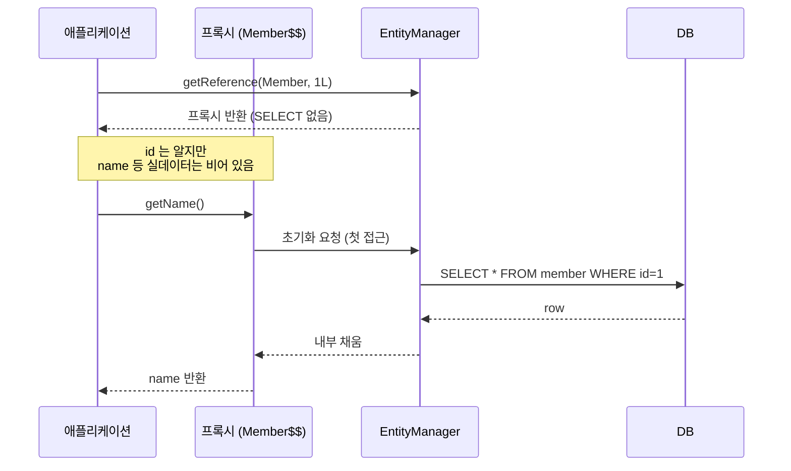
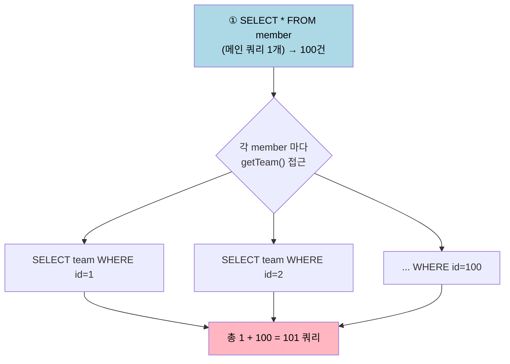

# 프록시와 N+1 문제 (즉시/지연 로딩, CASCADE, 고아 객체)
---
> 이 문서를 읽고 나면 지연 로딩이 프록시 위에서 어떻게 동작하는지 그림 없이 설명하고, 운영에서 SQL 이 폭증하는 N+1 상황을 코드만 보고 진단해 네 가지 해결책 중 맞는 것을 고를 수 있습니다.
>
> JPA 의 프록시 메커니즘이 지연 로딩을 가능하게 만듭니다. 그런데 같은 메커니즘이 N+1 문제의 출처이기도 합니다. JPA 가 자동으로 만들어 내는 SQL 의 *개수* 를 통제하지 못하면 운영에서 부하가 폭발하기 때문입니다.

## 1. 프록시 — 지연 로딩의 토대

> 프록시는 진짜 Entity 를 대신하는 *대리 객체* 이며, 실제 데이터 접근을 마지막 순간까지 미루는 장치입니다. 지연 로딩이 가능한 이유가 바로 여기에 있습니다.

이 개념은 일상에서 쓰는 *대리인* 과 같은 발상입니다. 대리인에게 일을 맡기면 본인은 필요한 순간에만 직접 나서고, 그전까지는 대리인이 자리를 채워 줍니다.

```java
Member m = em.getReference(Member.class, 1L);   // SELECT 안 함 — 프록시 반환
m.getName();   // 이 시점에 SELECT 실행
```

`getReference` 를 호출한 시점에는 DB 에 가지 않습니다. 진짜 데이터가 처음으로 필요해지는 순간, 즉 `getName()` 처럼 실제 필드를 읽는 메서드를 부를 때 비로소 SELECT 가 나갑니다. 이 "미루기" 가 지연 로딩의 본질입니다.

프록시의 동작을 떠받치는 특징은 세 가지입니다:

1. 상속 기반으로 만들어집니다. Hibernate 가 런타임에 `Member` 의 서브클래스를 동적으로 생성해 진짜 객체인 척 끼워 넣기 때문에, 호출하는 쪽 코드는 프록시인지 진짜인지 구분할 필요가 없습니다.
2. 첫 메서드 호출 시 초기화됩니다. 프록시 안에는 아직 데이터가 없으므로, 실제 필드가 필요한 메서드가 처음 불릴 때 DB 에서 진짜 데이터를 끌어와 내부를 채웁니다.
3. `getId()` 는 초기화를 일으키지 않습니다. 식별자는 프록시를 만들 때 이미 알고 있는 값이라 DB 까지 갈 이유가 없기 때문입니다.

프록시가 언제 SELECT 를 실행하는지 시점을 흐름으로 보면 다음과 같습니다.



그렇다면 `em.find()` 와 `em.getReference()` 는 언제 갈라 써야 할까요? `find` 는 호출 즉시 SELECT 를 날려 진짜 객체를 주고, `getReference` 는 프록시만 돌려줍니다. 다음에 필드 접근이 *확실히* 일어날 거면 `find`, *연관관계 설정용* 으로만 쓸 거면 `getReference` 가 적절합니다.

```java
// 단순 FK 연결 — getReference 가 적절
Order order = new Order();
order.setMember(em.getReference(Member.class, memberId));   // SELECT 안 감
em.persist(order);
```

위 코드에서 `Order` 는 `Member` 의 FK 만 필요하지 `Member` 의 이름이나 다른 필드를 읽지 않습니다. 이럴 때 `find` 로 진짜 객체를 끌어오면 쓰지도 않을 SELECT 가 한 번 더 나가므로, 프록시만 받는 `getReference` 가 한 쿼리를 아낍니다.

## 2. 즉시 로딩 (`EAGER`) vs 지연 로딩 (`LAZY`)

> 연관된 Entity 를 *언제 가져올 것인가* 를 정하는 설정입니다. 결론부터 말하면 거의 항상 `LAZY` 가 정답입니다.

```java
@Entity
public class Order {
    @ManyToOne(fetch = LAZY)
    private Member member;        // 권장

    @OneToMany(mappedBy = "order")   // 기본 LAZY
    private List<OrderItem> items;
}
```

### 2-1. 기본값

연관관계 애너테이션마다 기본 fetch 전략이 다릅니다. 단건을 가리키는 `@ManyToOne`, `@OneToOne` 은 기본이 즉시 로딩이라 위험하고, 컬렉션을 가리키는 `@OneToMany`, `@ManyToMany` 는 기본이 지연 로딩입니다.

| 관계 | 기본 전략 | 비고 |
|------|----------|------|
| `@ManyToOne` | EAGER | 위험 — LAZY 로 덮어야 함 |
| `@OneToOne` | EAGER | 위험 — LAZY 로 덮어야 함 |
| `@OneToMany` | LAZY | 안전 |
| `@ManyToMany` | LAZY | 안전 |

그래서 단건 연관관계에는 *반드시 명시적으로* `fetch = LAZY` 를 박아야 합니다. 기본값 `EAGER` 는 개발자가 의도하지 않은 SQL 폭발의 출처이기 때문입니다.

### 2-2. 왜 EAGER 가 위험한가

```java
List<Order> orders = orderRepository.findAll();   // SELECT order
for (Order o : orders) {
    // EAGER 면 매 order 마다 SELECT member — N+1
}
```

`findAll()` 같은 JPQL 은 *연관 EAGER 설정까지 고려해서 한 번에 조인하지 못합니다*. JPQL 은 작성한 쿼리 그대로 `order` 만 먼저 조회한 다음, EAGER 라는 사실을 뒤늦게 발견하고 각 `Order` 마다 `member` 를 채우려고 추가 SELECT 를 날립니다. 이것이 곧 다음 절에서 다룰 N+1 의 첫 번째 패턴입니다.

## 3. N+1 문제

> 메인 쿼리 1개 뒤에 연관 데이터를 채우려는 추가 쿼리 N개가 줄줄이 따라붙는 현상으로, JPA 에서 가장 흔하게 만나는 성능 함정입니다.

### 3-1. 발생 패턴

```java
List<Member> members = memberRepository.findAll();   // 1: SELECT member

for (Member m : members) {
    System.out.println(m.getTeam().getName());        // N: SELECT team WHERE id = ? (매번)
}
```

`LAZY` 라고 안심할 수 없습니다. 지연 로딩은 SELECT 시점을 *뒤로 미룰* 뿐, 없애 주는 게 아니기 때문입니다. 반복문 안에서 `getTeam().getName()` 으로 연관 데이터에 접근하는 순간마다 팀 SELECT 가 한 번씩 나갑니다. 회원이 100명이면 회원 조회 1번에 팀 조회 100번이 더해져 총 1 + 100 = 101 쿼리가 됩니다.

이 흐름을 그림으로 보면 메인 쿼리 하나가 어떻게 N개의 꼬리를 만드는지 분명해집니다.



### 3-2. 해결책 1 — Fetch Join (가장 흔함)

```java
@Query("SELECT m FROM Member m JOIN FETCH m.team")
List<Member> findAllWithTeam();
```

`JOIN FETCH` 는 회원과 팀을 한 번의 조인 쿼리로 함께 끌어옵니다. 메인 쿼리 단계에서 연관 데이터를 이미 다 채워 오므로, 반복문에서 `getTeam()` 을 불러도 추가 SELECT 가 나가지 않아 N+1 이 사라집니다. 단건 연관관계를 풀 때 가장 먼저 검토할 선택지입니다.

### 3-3. 해결책 2 — `@EntityGraph`

```java
@EntityGraph(attributePaths = {"team"})
@Override
List<Member> findAll();
```

`@EntityGraph` 는 JPQL 을 직접 쓰지 않고 애너테이션만으로 같은 fetch join 효과를 냅니다. 어떤 연관을 함께 가져올지 `attributePaths` 로 선언하면 됩니다. 여러 연관을 한꺼번에 조립해 가져와야 할 때 JPQL 문자열을 늘리는 것보다 가독성이 좋습니다.

### 3-4. 해결책 3 — `@BatchSize`

```java
@Entity
public class Team {
    @OneToMany(mappedBy = "team")
    @BatchSize(size = 100)
    private List<Member> members;
}
```

`@BatchSize` 는 지연 로딩을 유지하되, 연관 데이터에 접근할 때 한 건씩 SELECT 하는 대신 *`IN` 절로 묶어서* 한 번에 가져옵니다. 100명을 한 건씩 조회하면 100쿼리지만, 100개씩 묶으면 1 + N 이 1 + (N / 100) 으로 줄어듭니다. 컬렉션(1:N) 을 페이징과 함께 다룰 때 특히 유용합니다.

### 3-5. 해결책 4 — 서브쿼리

```java
@Query("SELECT m FROM Member m WHERE m IN " +
       "(SELECT m2 FROM Member m2 JOIN m2.team t WHERE t.active = true)")
List<Member> findActive();
```

조건이 복잡해서 단순 조인만으로 풀기 어려울 때 서브쿼리로 대상 범위를 먼저 좁히고 본 쿼리와 결합합니다. N+1 자체의 직접 해법이라기보다 복잡한 필터링과 결합하는 보조 수단에 가깝습니다.

### 3-6. 어떤 방법을 쓸까

상황마다 맞는 해결책이 다릅니다. 특히 *1:N 컬렉션을 fetch join 하면서 동시에 페이징* 하려는 경우는 주의가 필요합니다. 조인 결과 행이 뻥튀기되어 페이징이 메모리에서 처리되는 위험이 있으므로, 이때는 fetch join 대신 `@BatchSize` 를 씁니다.

| 상황 | 권장 | 이유 |
|------|------|------|
| 단순 N:1 fetch | Fetch Join | 한 조인으로 끝, 행 뻥튀기 없음 |
| 1:N 컬렉션 fetch + 페이징 | `@BatchSize` | Fetch Join + Page 조합은 위험 |
| 여러 연관 fetch | `@EntityGraph` | 선언적으로 여러 경로 조립 |
| 동적 조건 fetch | QueryDSL 또는 Criteria | 런타임 조건 조합 가능 |

## 4. CASCADE — 영속성 전이

> 부모 Entity 를 영속화하거나 삭제할 때 그 동작을 자식 Entity 에게도 함께 전파하는 옵션입니다.

```java
@Entity
public class Parent {
    @OneToMany(mappedBy = "parent", cascade = CascadeType.PERSIST)
    private List<Child> children = new ArrayList<>();
}
```

전파할 동작은 `CascadeType` 으로 고릅니다. persist 만 전파할지, remove 까지 전파할지 필요에 맞춰 선택합니다.

| CascadeType | 의미 |
|-------------|------|
| `PERSIST` | persist 전파 |
| `REMOVE` | remove 전파 |
| `MERGE` | merge 전파 |
| `ALL` | 위 동작 모두 전파 |

```java
Parent p = new Parent();
p.getChildren().add(new Child());
em.persist(p);   // CASCADE.PERSIST 면 Child 도 자동 persist
```

`CascadeType.PERSIST` 가 걸려 있으면 부모만 `persist` 해도 컬렉션에 담긴 자식이 함께 영속화됩니다. 자식을 일일이 `persist` 하지 않아도 되니 편리합니다.

### 4-1. CASCADE 의 위험

`CascadeType.ALL` 은 편리한 만큼 위험합니다. remove 까지 전파되므로 *부모를 삭제하면 자식이 전부 함께 삭제* 되기 때문입니다. 그래서 다음 두 조건이 모두 분명할 때만 써야 합니다:

1. 부모와 자식이 *단독 소유* 관계여야 합니다. 게시글과 댓글처럼 자식이 그 부모에게만 종속되는 구조여야 합니다.
2. 자식이 다른 부모를 가질 수 없어야 합니다. 한 댓글이 여러 게시글에 동시에 매달리는 일이 없어야 합니다.

여러 부모가 같은 자식을 공유하는 구조라면 CASCADE 를 걸어선 안 됩니다. 한 부모를 지웠다가 다른 부모가 여전히 참조하는 자식까지 사라지는 사고가 나기 때문입니다.

## 5. 고아 객체와 Aggregate

> 자식을 컬렉션에서 빼면 그 자식을 자동으로 DELETE 하는 기능입니다. `orphanRemoval = true` 로 켭니다.

```java
@OneToMany(mappedBy = "parent", orphanRemoval = true)
private List<Child> children = new ArrayList<>();

parent.getChildren().remove(0);   // 첫 자식이 컬렉션에서 빠짐 → 자동 DELETE
```

부모가 들고 있던 자식 컬렉션에서 원소를 제거하면, JPA 는 "이 자식은 더 이상 부모가 없는 고아" 라고 판단해 DELETE 를 날립니다. 부모-자식 관계의 끊김을 곧 자식의 수명 종료로 해석하는 셈입니다.

### 5-1. CASCADE.ALL + orphanRemoval = 생명주기 통합

```java
@OneToMany(mappedBy = "parent", cascade = CascadeType.ALL, orphanRemoval = true)
private List<Child> children = new ArrayList<>();
```

이 조합은 *Child 가 Parent 의 일부* 라는 선언입니다. 부모를 통해서만 자식이 생기고, 부모가 사라지거나 부모에게서 떨어지면 자식도 사라집니다. 자식의 생명주기가 부모의 생명주기 안에 완전히 포섭됩니다.

이는 일상의 *주문서와 주문 항목* 관계로 비유할 수 있습니다. 주문 항목은 그 자체로 독립해 존재하지 않고 언제나 어떤 주문서에 속하며, 주문서가 폐기되면 항목도 함께 폐기됩니다. DDD 의 Aggregate Root 패턴과 자연스럽게 맞아떨어지는 지점입니다.

다만 이 비유는 *한 자식이 오직 한 부모에게만 속한다* 는 전제에서만 유효합니다. 만약 다른 부모가 같은 자식을 참조할 가능성이 조금이라도 있다면 이 비유는 깨지고, 한쪽 부모를 지웠을 때 다른 부모가 참조 중인 자식까지 사라지는 사고가 납니다. 그래서 이 조합은 *다른 부모가 자식을 참조할 가능성이 0% 일 때만* 써야 합니다.

## 6. 면접 대비 요약

> 앞 절들의 핵심을 그림 없이 말로 풀 수 있는 형태로 압축합니다.

한 줄 정의부터 잡습니다. N+1 문제란 "메인 쿼리 1개를 실행한 뒤 연관 데이터를 채우려고 추가 쿼리 N개가 더 나가는 현상" 입니다.

핵심 포인트는 세 가지입니다:

1. 프록시가 지연 로딩을 가능하게 합니다. `getReference` 는 프록시만 반환하고 첫 실데이터 접근 시 SELECT 가 나가므로, FK 연결만 필요하면 `find` 대신 `getReference` 로 쿼리를 아낍니다.
2. `@ManyToOne`, `@OneToOne` 의 기본값 EAGER 가 N+1 의 출처입니다. 단건 연관관계에는 명시적으로 `fetch = LAZY` 를 박아야 합니다.
3. 해결책은 상황별로 다릅니다. 단순 N:1 은 Fetch Join, 1:N + 페이징은 `@BatchSize`, 여러 연관은 `@EntityGraph` 가 정석입니다.

자주 나오는 질문은 다음과 같습니다.

Q: LAZY 로 설정했는데도 N+1 이 발생하는 이유는 무엇인가요?
A: LAZY 는 SELECT 시점을 미룰 뿐 없애지 않기 때문입니다. 반복문 안에서 연관 데이터에 접근하면 접근할 때마다 SELECT 가 나가므로, 결국 LAZY 든 EAGER 든 추가 쿼리 수는 같습니다.

Q: 1:N 컬렉션을 fetch join 하면서 페이징하면 왜 위험한가요?
A: 조인 결과 행이 자식 수만큼 뻥튀기되어, DB 가 아니라 애플리케이션 메모리에서 페이징이 처리되기 때문입니다. 그래서 이 경우엔 fetch join 대신 `@BatchSize` 로 `IN` 절 배치 로딩을 씁니다.

## 관련 문서

- [연관관계 매핑](./02-02.연관관계%20매핑.md) — `@ManyToOne`/`@OneToMany` 의 fetch 기본값과 방향 설계
- [쿼리 메소드](./03-02.쿼리%20메소드.md) — Fetch Join, `@EntityGraph` 의 실제 선언 방법
