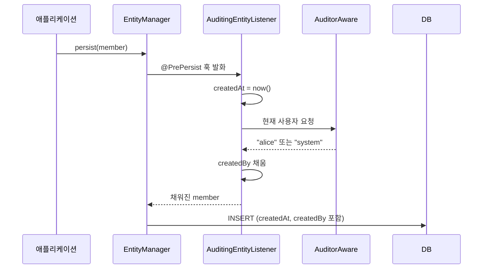
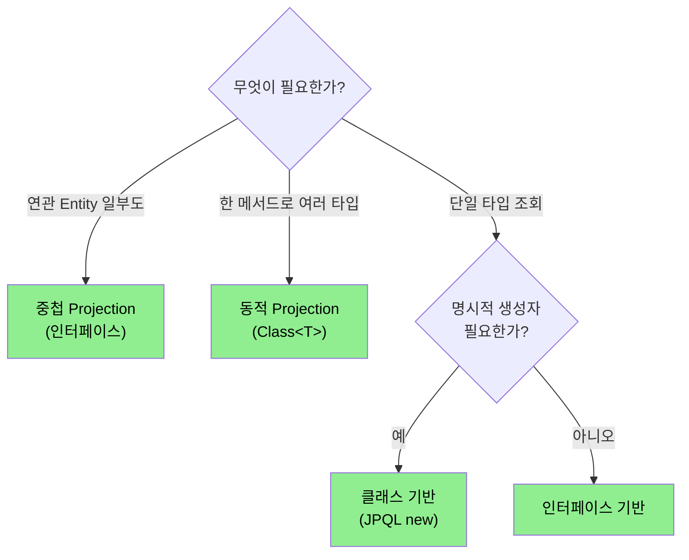

# 확장 기능 — Auditing, 페이징, Projection
---
> 이 문서를 읽고 나면 등록·수정 시각을 코드 한 줄 없이 자동 기록하도록 Entity 를 구성하고, 페이징 파라미터를 직접 파싱하지 않고 받아 처리하며, 필요한 컬럼만 골라 받는 네 가지 Projection 방식을 상황에 맞게 고를 수 있습니다.
>
> Spring Data JPA 의 부가 기능 세 가지를 한 묶음으로 봅니다. 등록·수정 시각을 자동으로 박는 Auditing, 페이지·정렬 파라미터를 자동 변환하는 페이징, 결과를 필요한 모양의 DTO 로 받는 Projection 입니다. 셋 다 *반복되는 보일러플레이트를 프레임워크에 떠넘기는* 같은 동기에서 나왔다는 점이 공통입니다.

## 1. Auditing — 생성·수정 시각 자동

> 모든 Entity 가 공통으로 갖는 등록일·수정일·등록자·수정자를 베이스 클래스 한 곳에 모아 자동으로 채우는 기능입니다.

이 발상은 여러 클래스가 공유하는 공통 필드를 부모 클래스로 끌어올리는 *상속 템플릿* 과 같습니다. 모든 테이블에 똑같이 들어가는 네 컬럼을 Entity 마다 반복해 적지 않고, 공통 부모에 한 번만 선언해 물려받게 합니다.

먼저 Auditing 기능 자체를 켭니다.

```java
@EnableJpaAuditing   // 메인 클래스 또는 Config 에
@SpringBootApplication
public class App { ... }
```

그다음 공통 컬럼을 담은 베이스 클래스를 만들고 Entity 가 상속하게 합니다.

```java
@MappedSuperclass
@EntityListeners(AuditingEntityListener.class)
public abstract class BaseEntity {
    @CreatedDate
    @Column(updatable = false)
    private LocalDateTime createdAt;

    @LastModifiedDate
    private LocalDateTime updatedAt;

    @CreatedBy
    @Column(updatable = false)
    private String createdBy;

    @LastModifiedBy
    private String updatedBy;
}

@Entity
public class Member extends BaseEntity {
    // 자동으로 createdAt, updatedAt, createdBy, updatedBy 가짐
}
```

`@MappedSuperclass` 는 이 클래스 자체는 테이블이 되지 않되 필드만 자식 Entity 에 합쳐지도록 합니다. `createdAt` 과 `createdBy` 에 붙은 `@Column(updatable = false)` 는 한번 기록된 등록 정보가 이후 UPDATE 에서 덮어써지지 않게 막습니다. 생성 시각은 처음 한 번만 의미가 있기 때문입니다.

그렇다면 이 값들은 *언제* 채워질까요? JPA 의 `@PrePersist`, `@PreUpdate` 이벤트 훅이 그 시점입니다. Entity 가 저장되기 직전과 수정되기 직전에 `AuditingEntityListener` 가 끼어들어 현재 시각과 사용자를 자동으로 써 넣습니다. 개발자가 `setCreatedAt(...)` 을 부르지 않아도 되는 이유가 바로 이 훅입니다.

저장 시 리스너가 값을 채우는 흐름은 다음과 같습니다.



### 1-1. AuditorAware — 등록자/수정자 결정

`@CreatedDate` 는 시스템 시각을 쓰면 되지만, `@CreatedBy`/`@LastModifiedBy` 의 "누가" 는 프레임워크가 알 수 없습니다. 그래서 현재 사용자를 알려 주는 `AuditorAware` 빈을 직접 등록해야 합니다.

```java
@Bean
public AuditorAware<String> auditorProvider() {
    return () -> {
        // SecurityContext 에서 현재 사용자 가져오기
        Authentication auth = SecurityContextHolder.getContext().getAuthentication();
        if (auth == null || !auth.isAuthenticated()) {
            return Optional.of("system");
        }
        return Optional.of(auth.getName());
    };
}
```

리스너가 등록자/수정자를 채울 때 이 빈을 호출합니다. 인증된 사용자가 있으면 그 이름을, 배치 작업처럼 로그인 주체가 없는 상황이면 `"system"` 을 폴백으로 돌려줍니다. 미인증 상황을 폴백 없이 두면 `createdBy` 가 비어 추적이 끊기므로, 기본값을 주는 편이 안전합니다.

## 2. 사용자 정의 Repository

> Spring Data 가 메서드 이름만으로 만들어 주지 못하는 복잡한 쿼리를 직접 구현해 표준 Repository 에 합치는 방법입니다.

메서드 이름 기반 쿼리나 `@Query` 로 풀리지 않는 동적 조건·다중 조인 조회가 있습니다. 이런 쿼리는 별도 인터페이스에 선언하고 직접 구현한 뒤, 원래 Repository 와 한 몸으로 합쳐 씁니다.

```java
public interface MemberRepositoryCustom {
    List<MemberDto> findComplexResult(MemberSearchCondition cond);
}

public class MemberRepositoryImpl implements MemberRepositoryCustom {
    private final EntityManager em;
    private final JPAQueryFactory queryFactory;

    @Override
    public List<MemberDto> findComplexResult(MemberSearchCondition cond) {
        // QueryDSL 또는 JPQL 로 복잡한 쿼리
    }
}

public interface MemberRepository extends JpaRepository<Member, Long>, MemberRepositoryCustom {
    // 두 인터페이스를 합쳐 하나의 Repository 로
}
```

여기서 명명 규칙이 핵심입니다. 구현 클래스 이름은 반드시 `<RepositoryInterfaceName>Impl` 형태여야 합니다. Spring Data 가 이 이름 규칙을 보고 구현체를 자동으로 찾아 표준 Repository 에 끼워 넣기 때문입니다. 이름이 어긋나면 합쳐지지 않으므로 규칙을 지키는 것이 중요합니다.

## 3. 페이징과 정렬

> 페이지 번호·크기·정렬 조건을 쿼리 파라미터에서 자동으로 뽑아 `Pageable` 객체로 변환해 주는 기능입니다.

```java
@RestController
public class MemberController {
    @GetMapping("/members")
    public Page<Member> list(Pageable pageable) {   // Spring 이 자동 바인딩
        return memberRepository.findAll(pageable);
    }
}
```

컨트롤러 메서드에 `Pageable` 을 파라미터로 두기만 하면 됩니다. 호출은 다음처럼 쿼리 파라미터로 합니다.

```
GET /members?page=0&size=20&sort=createdAt,desc&sort=name,asc
```

Spring MVC 가 `page`, `size`, `sort` 파라미터를 읽어 `Pageable` 로 변환해 주므로, 개발자가 직접 파싱하고 검증하는 코드를 쓰지 않아도 됩니다. 기본 페이지 크기는 `application.yml` 의 `spring.data.web.pageable.default-page-size` 로 조정합니다.

### 3-1. Page 의 변환

조회 결과인 `Page<Member>` 를 그대로 응답하면 Entity 가 JSON 으로 노출되어 위험합니다. `Page.map` 으로 DTO 로 바꿔 응답하는 편이 좋습니다.

```java
Page<Member> page = memberRepository.findAll(pageable);
Page<MemberDto> dtoPage = page.map(m -> new MemberDto(m.getId(), m.getName()));
```

`Page.map` 은 페이징 메타데이터(전체 개수·페이지 수)는 그대로 두고 내용물만 DTO 로 변환합니다. 덕분에 페이지 정보를 다시 계산하지 않고도 안전한 응답 모양을 만들 수 있습니다.

## 4. Projection — 결과를 DTO 로

> Entity 의 모든 컬럼이 아니라 화면에 필요한 일부 컬럼만 골라 받는 기능으로, 메모리와 네트워크 비용을 줄입니다.

목록 화면에 이름과 나이만 필요한데 Entity 전체를 가져오면, 쓰지도 않을 컬럼까지 SELECT 하고 객체에 담느라 메모리와 전송량이 낭비됩니다. Projection 은 필요한 컬럼만 SELECT 하도록 좁혀 이 낭비를 막습니다.

### 4-1. 인터페이스 기반 Projection

```java
public interface MemberSummary {
    String getName();
    int getAge();
}

public interface MemberRepository extends JpaRepository<Member, Long> {
    List<MemberSummary> findByActive(boolean active);
}
```

getter 만 선언한 인터페이스를 반환 타입으로 두면 Spring 이 그 인터페이스를 구현한 프록시를 자동으로 만듭니다. SELECT 도 선언된 `name`, `age` 컬럼만 가져오므로 별도 DTO 클래스 없이 가볍게 끝납니다.

### 4-2. 클래스 기반 Projection

```java
public record MemberSummaryDto(String name, int age) {}

@Query("SELECT new com.example.MemberSummaryDto(m.name, m.age) FROM Member m WHERE m.active = true")
List<MemberSummaryDto> findActive();
```

record 나 일반 클래스로 결과 모양을 명시하고, JPQL 의 `new` 키워드로 생성자를 직접 호출해 채웁니다. 반환 타입이 구체 클래스라 IDE 추적과 생성자 검증이 명확하다는 장점이 있습니다.

### 4-3. 동적 Projection

```java
<T> List<T> findByActive(boolean active, Class<T> type);

// 호출
List<MemberSummary> summary = memberRepository.findByActive(true, MemberSummary.class);
List<Member> full = memberRepository.findByActive(true, Member.class);
```

반환 타입을 제네릭으로 두고 호출 시 `Class<T>` 로 원하는 모양을 넘깁니다. 같은 메서드 하나로 요약 뷰도 전체 Entity 도 받을 수 있어, 비슷한 조회 메서드를 타입별로 중복 정의하지 않아도 됩니다.

### 4-4. 중첩 Projection

```java
public interface MemberWithTeam {
    String getName();
    TeamInfo getTeam();

    interface TeamInfo {
        String getName();
    }
}
```

연관 Entity 의 일부 필드까지 함께 골라 받을 때 중첩 인터페이스로 표현합니다. 회원 이름과 함께 팀 이름만 필요할 때 유용합니다. SpEL 을 쓰는 Open Projection(`@Value`) 도 있지만, 쿼리 최적화가 깨지고 가독성이 떨어져 권장하지 않습니다.

## 5. 어떤 Projection 을 쓸까

> 인터페이스·클래스·동적·중첩 네 방식을 상황에 맞게 고르는 기준입니다.

선택의 갈림길은 *가독성을 우선하는가, 명시적 생성자가 필요한가, 한 메서드로 여러 타입을 받는가, 연관 데이터까지 가져오는가* 입니다.

| 상황 | 권장 | 이유 |
|------|------|------|
| 단순 조회 + 가독성 우선 | 인터페이스 기반 | DTO 클래스 없이 getter 선언만으로 끝 |
| record 활용 + 명시적 생성자 | 클래스 기반 (`new ...` in JPQL) | 반환 타입이 구체적, 추적 명확 |
| 같은 메서드 여러 반환 타입 | 동적 | 타입별 메서드 중복 제거 |
| 연관 Entity 일부도 함께 | 중첩 (인터페이스) | 연관 필드까지 선택적 조회 |

같은 내용을 결정 트리로 보면 빠르게 고를 수 있습니다.



## 6. 면접 대비 요약

> 세 부가기능을 그림 없이 말로 풀 수 있는 형태로 압축합니다.

한 줄 정의부터 잡습니다. Auditing 은 "Entity 의 등록·수정 시각과 주체를 이벤트 훅으로 자동 기록하는 기능", 페이징은 "쿼리 파라미터를 `Pageable` 로 자동 변환해 페이지·정렬을 처리하는 기능", Projection 은 "필요한 컬럼만 골라 받아 메모리·네트워크를 아끼는 조회 기능" 입니다.

핵심 포인트는 세 가지입니다:

1. Auditing 은 `@EnableJpaAuditing` + `@MappedSuperclass` 베이스 클래스 + `AuditingEntityListener` 조합으로 동작하며, 등록자/수정자는 `AuditorAware` 빈이 결정합니다.
2. 페이징은 컨트롤러에 `Pageable` 만 두면 Spring MVC 가 자동 바인딩하고, 응답은 `Page.map` 으로 DTO 변환해 Entity 노출을 막습니다.
3. Projection 은 네 방식이 있고, 단순 조회는 인터페이스 기반, 명시적 생성자가 필요하면 클래스 기반이 정석입니다.

자주 나오는 질문은 다음과 같습니다.

Q: `@CreatedDate` 는 자동인데 `@CreatedBy` 는 왜 별도 설정(`AuditorAware`)이 필요한가요?
A: 시각은 시스템 시계로 알 수 있지만 "누가" 는 인증 컨텍스트에 있는 정보라 프레임워크가 스스로 알 수 없기 때문입니다. 그래서 현재 사용자를 알려 주는 `AuditorAware` 빈을 직접 등록해야 합니다.

Q: Projection 으로 일부 컬럼만 받으면 무엇이 좋아지나요?
A: SELECT 가 필요한 컬럼만 조회하므로 DB 에서 읽는 데이터, 객체에 담는 메모리, 네트워크 전송량이 모두 줄어듭니다. 목록 화면처럼 일부 필드만 쓰는 조회에서 효과가 큽니다.

## 관련 문서

- [공통 인터페이스](./03-01.Spring%20Data%20JPA%20공통%20인터페이스.md) — `JpaRepository` 기본 제공 메서드 위에 본 문서의 확장 기능이 얹힘
- [쿼리 메소드](./03-02.쿼리%20메소드.md) — 페이징·Projection 이 결합되는 쿼리 메서드와 `@Query` 의 기초
