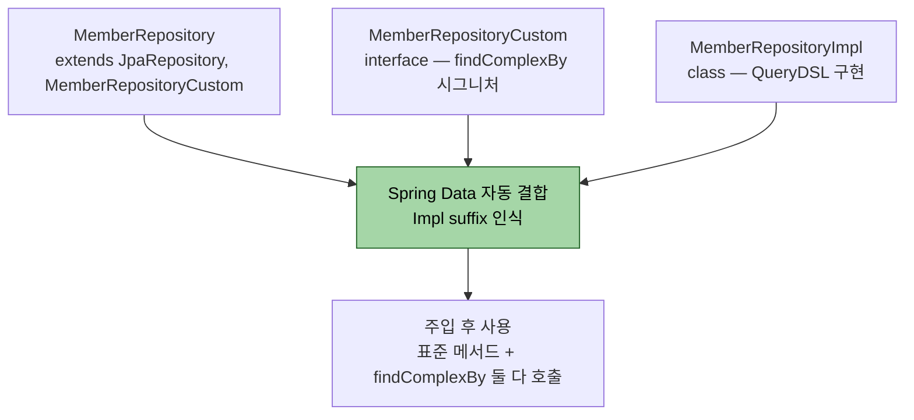
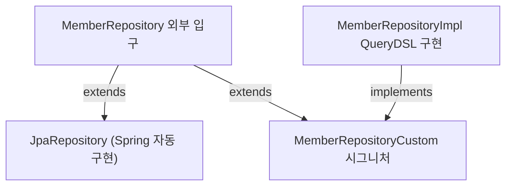

# 커스텀 리포지토리 패턴

---

> **이 문서를 읽고 나면, `JpaRepository` + `XxxRepositoryCustom` + `XxxRepositoryImpl` 3계층의 명명 규약과 Spring 의 fragment composition 동작을 설명할 수 있고, fragment 를 여러 인터페이스로 쪼개 책임을 분리할 수 있으며, 명명 규약 위반 시 발생하는 흔한 함정을 진단할 수 있다.**

Spring Data JPA의 `JpaRepository`에 QueryDSL 메서드를 자연스럽게 합치는 방법이 커스텀 리포지토리 패턴이다. `XxxRepositoryCustom` 인터페이스 + `XxxRepositoryImpl` 구현 클래스라는 명명 규약이 핵심이다. 이름이 한 글자라도 달라지면 Spring이 알아서 묶어 주지 않는다.

3계층 명명 규약을 한 그림으로 보면 다음과 같다.



- 핵심은 `Impl` suffix — Spring 이 *XxxRepositoryCustom 인터페이스의 구현체* 를 찾을 때 `XxxRepositoryImpl` 이라는 이름 규약으로 자동 매칭한다. 한 글자라도 다르면 못 찾는다.


## 왜 두 인터페이스로 나누는가

> Spring Data JPA가 자동 구현하는 메서드와, 직접 구현하는 메서드를 한 리포지토리에서 함께 쓰기 위함이다.

`MemberRepository`가 `findById`, `save` 같은 표준 메서드와 함께 `searchByCondition` 같은 QueryDSL 메서드를 노출해야 한다고 하자. 단순히 `JpaRepository`에 메서드를 추가하면 Spring Data JPA는 메서드 이름 규약으로 쿼리를 만들려 시도해 실패한다.

해결은 인터페이스를 두 개로 나누는 것이다.

```java
public interface MemberRepositoryCustom {
    // ...
}

@RequiredArgsConstructor
public class MemberRepositoryImpl implements MemberRepositoryCustom {
		// ...
}

```

```java
public interface MemberRepository extends JpaRepository<Member, Long>, MemberRepositoryCustom {}
```

호출 측은 `MemberRepository` 하나만 주입받아 *표준 메서드와 커스텀 메서드를 구분 없이* 부른다.

```java
@Service
@RequiredArgsConstructor
public class MemberService {

    private final MemberRepository memberRepository;   // ← 입구 하나뿐

    public Member updateNameIfExists(Long id, String newName, MemberSearchCond cond) {
        // ① JpaRepository 표준 메서드 — Spring 자동 구현
        Member member = memberRepository.findById(id)
            .orElseThrow(() -> new EntityNotFoundException(id));

        // ② MemberRepositoryCustom 커스텀 메서드 — MemberRepositoryImpl 의 QueryDSL 구현
        List<Member> duplicates = memberRepository.search(cond);
        if (!duplicates.isEmpty()) {
            throw new DuplicateMemberException();
        }

        member.changeName(newName);
        return memberRepository.save(member);          // ③ 다시 JpaRepository 표준
    }
}
```

- `findById` / `save` 는 Spring 이 자동 구현, `search` 는 `MemberRepositoryImpl` 의 QueryDSL 구현
- 호출자는 이 차이를 모른 채 *한 객체의 메서드*로 자연스럽게 섞어 쓴다. Spring Data JPA 의 fragment composition 이 이를 가능하게 한다.



> 다이어그램 풀이: UML 관습대로 *자식 → 부모* 화살표. `MemberRepository` 가 두 부모(`JpaRepository`, `MemberRepositoryCustom`)를 동시에 extends 하고, `MemberRepositoryImpl` 이 `MemberRepositoryCustom` 을 implements 한다. 
>
> - Spring 은 메인 리포지토리 이름 + `Impl` 접미사로 구현체를 찾아 커스텀 메서드를 자동 결합한다.


## 명명 규약을 어기면 어떻게 되는가

> Spring Data JPA가 커스텀 구현을 찾는 방법은 이름 매칭이다. 한 글자만 틀려도 빈을 못 찾는다.

| 메인 리포지토리 인터페이스 | 커스텀 인터페이스 | 구현 클래스 |
|------------------------|-----------------|-----------|
| `MemberRepository` | `MemberRepositoryCustom` | `MemberRepositoryImpl` |

- 구현 클래스의 끝 단어 `Impl`이 핵심이다. Spring Data JPA는 메인 리포지토리 이름 + `Impl`을 가진 빈을 찾는다. `MemberRepositoryQuerydslImpl` 같은 이름은 동작하지 않는다.

- 이 접미사를 바꾸고 싶다면 `@EnableJpaRepositories(repositoryImplementationPostfix = "Querydsl")`로 변경할 수 있지만, 관례에서 벗어나면 다른 개발자가 헤매게 된다. 표준 규약을 그대로 따르는 편이 안전하다.

자주 발생하는 에러 두 가지를 정리한다.

1. **구현 클래스가 안 잡힘.** 클래스 이름이 `Impl`로 끝나지 않거나, `MemberRepositoryCustom`을 implement하지 않은 경우다. 빈 등록 자체는 되지만 Spring Data JPA가 합쳐 주지 않는다. 호출 시 `AbstractMethodError`나 메서드 못 찾음 에러가 난다.
2. **메인 리포지토리가 커스텀 인터페이스를 extends하지 않음.** Spring은 메인 리포지토리의 부모 인터페이스 목록을 보고 합칠 대상을 찾는다. extends 누락은 흔한 실수다.


## Fragment 패턴 — 도메인을 잘게 쪼개기

> 한 리포지토리가 너무 비대해지면 fragment(조각)으로 쪼개 관심사를 분리한다.

회원 도메인이 검색·통계·외부연동까지 모두 가진다고 하자. 한 `MemberRepositoryCustom`에 메서드 20개를 두면 코드 리뷰 비용이 커진다. Spring Data JPA는 fragment를 여러 개 합치는 패턴을 지원한다.

```java
public interface MemberSearchFragment {
    List<Member> search(MemberSearchCond cond);
    Page<Member> searchPage(MemberSearchCond cond, Pageable pageable);
}

public interface MemberStatisticsFragment {
    long countByStatus(MemberStatus status);
    Map<MemberStatus, Long> statusBreakdown();
}

public interface MemberRepository
        extends JpaRepository<Member, Long>
        , MemberSearchFragment
        , MemberStatisticsFragment {
}
```

각 fragment마다 `XxxImpl` 구현 클래스를 둔다.

```java
public class MemberSearchFragmentImpl implements MemberSearchFragment { /* ... */ }
public class MemberStatisticsFragmentImpl implements MemberStatisticsFragment { /* ... */ }
```

이 패턴의 장점은 두 가지다.

1. **한 클래스가 한 관심사만 다룬다.** 검색 로직과 통계 로직이 같은 파일에 섞이지 않는다.
2. **테스트가 쪼개진다.** fragment 단위로 단위 테스트를 짤 수 있다.

단점은 클래스 수가 늘어나는 점이다. 도메인이 단순하고 메서드가 5개 이내면 단일 `XxxRepositoryCustom` + `Impl`이 더 가볍다.


## 통계용 별도 Query 클래스 분리

> Repository에 모두 쑤셔 넣지 않고, 통계나 보고용 쿼리는 별도 `XxxQueryRepository`로 뺀다.

리포지토리 패턴은 본래 도메인 영속성을 다룬다. 보고서나 대시보드용 통계 쿼리는 도메인 영속성과 사용 패턴이 다르다. 다음과 같이 분리하는 편이 코드가 잘 늙는다.

```java
@Repository
@RequiredArgsConstructor
public class MemberQueryRepository {

    private final JPAQueryFactory queryFactory;

    public List<MemberMonthlyStat> monthlyJoinStats(int year) {
        // 통계 쿼리 — Member의 영속성 라이프사이클과 무관
    }
}
```

- 이 클래스는 `MemberRepository`를 통하지 않고 서비스에서 직접 주입받는다. CQRS 관점에서 Read 모델로 보는 시각이다.
- `@Repository`를 붙이면 Spring이 빈으로 등록한다. 이름은 `XxxQueryRepository`나 `XxxQueryService`처럼 의도를 드러낸다.


## 트랜잭션 경계는 어디에 두는가

> 리포지토리에는 `@Transactional`을 붙이지 않는다. 서비스 계층에서 시작한다.

QueryDSL 쿼리는 `JPAQueryFactory`가 `EntityManager`를 통해 만들지만, 트랜잭션 경계는 외부에서 정해야 한다. 다음 세 가지 원칙을 지킨다.

1. **Read-only 쿼리는 서비스에 `@Transactional(readOnly = true)`을 붙인다.** Hibernate가 dirty checking을 건너뛰어 성능이 개선된다.
2. **쓰기를 동반하는 쿼리는 일반 `@Transactional`으로 감싼다.**
3. **리포지토리 메서드 단위로 트랜잭션을 시작하지 않는다.** 한 비즈니스 트랜잭션이 여러 리포지토리 호출에 걸치는 경우가 흔하기 때문이다.

```java
@Service
@RequiredArgsConstructor
public class MemberSearchService {
    private final MemberRepository repository;

    @Transactional(readOnly = true)
    public Page<Member> search(MemberSearchCond cond, Pageable pageable) {
        return repository.searchPage(cond, pageable);
    }
}
```

`@Transactional` 전파 모드와 격리 수준 조합은 [`05_data/`](../) 의 별도 문서(예정)로 다룬다.


## 패키지 구조 권장안

> 한 도메인 패키지 안에 다섯 종류의 파일이 모인다. 정렬 기준만 정해 두면 탐색이 빠르다.

```
com/example/member/
├── domain/
│   ├── Member.java
│   ├── Team.java
│   └── MemberStatus.java
├── repository/
│   ├── MemberRepository.java          # 메인 입구
│   ├── MemberRepositoryCustom.java    # 커스텀 시그니처
│   ├── MemberRepositoryImpl.java      # QueryDSL 구현
│   └── MemberQueryRepository.java     # 통계·보고용 별도 클래스
├── service/
│   └── MemberSearchService.java
└── dto/
    ├── MemberSearchCond.java
    └── MemberSearchResult.java
```

핵심은 `repository/` 한 폴더에 두 인터페이스 + 두 구현이 모이는 점이다. fragment 패턴을 쓰면 fragment마다 인터페이스+구현 한 쌍이 추가된다.


## 면접에서 받을 만한 질문

> 커스텀 리포지토리 패턴은 Spring Data JPA 면접의 단골이다. 명명 규약과 합쳐지는 메커니즘을 입으로 말할 수 있어야 한다.

1. `XxxRepositoryImpl`이라는 이름이 강제되는 이유는?
   - 답 요지: Spring Data JPA가 커스텀 인터페이스의 구현 클래스를 찾을 때 메인 리포지토리 이름 + `Impl` 접미사로 매칭하기 때문이다. 접미사는 `@EnableJpaRepositories(repositoryImplementationPostfix = ...)`로 바꿀 수 있지만 관례에서 벗어난다.
2. fragment 패턴은 언제 쓰는가?
   - 답 요지: 한 도메인의 커스텀 메서드가 너무 많아 한 클래스가 비대해질 때 관심사 단위로 분할한다. 검색·통계·외부연동을 별도 fragment로 두면 클래스가 작아지고 테스트도 쪼개진다.
3. `JPAQueryFactory`를 직접 구현 클래스에 주입해도 되는가?
   - 답 요지: 된다. 본 묶음의 표준이 그 방식이다. `QuerydslRepositorySupport`는 옛 패턴이며 6.x에서는 권장하지 않는다.
4. 트랜잭션 경계를 리포지토리에 두면 안 되는가?
   - 답 요지: 안 된다. 비즈니스 트랜잭션은 여러 리포지토리 호출을 묶는 경우가 많아 서비스 계층에서 경계를 정해야 한다. 리포지토리에 `@Transactional`을 두면 같은 비즈니스 트랜잭션이 여러 개로 쪼개진다.


## 관련 문서

> 본 커스텀 리포지토리 문서가 묶음 내 다른 챕터와 어떻게 연결되는지. 동적 검색 술어는 querydsl/01-04, 운영 규모 합성은 querydsl/02-04, 테스트 환경 결합은 querydsl/03-02 로 이어진다.

- [querydsl/01-04. 동적 쿼리](../querydsl/01-04.동적%20쿼리.md) — 커스텀 구현에 들어가는 검색 술어
- [querydsl/01-06. 페이징과 fetch join 함정](../querydsl/01-06.페이징과%20fetch%20join%20함정.md) — `searchPage`의 카운트 쿼리 분리
- [querydsl/03-02. 테스트와 멀티모듈](../querydsl/03-01.테스트와%20멀티모듈.md) — 커스텀 리포지토리 단위 테스트
- [Spring Data JPA Custom Implementations](https://docs.spring.io/spring-data/jpa/reference/repositories/custom-implementations.html)
